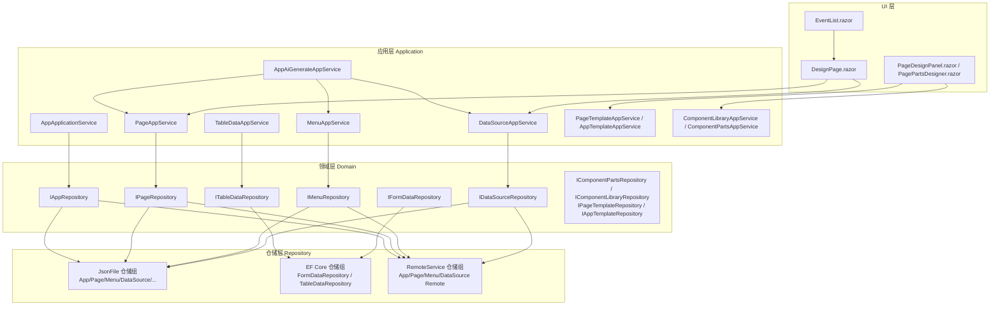
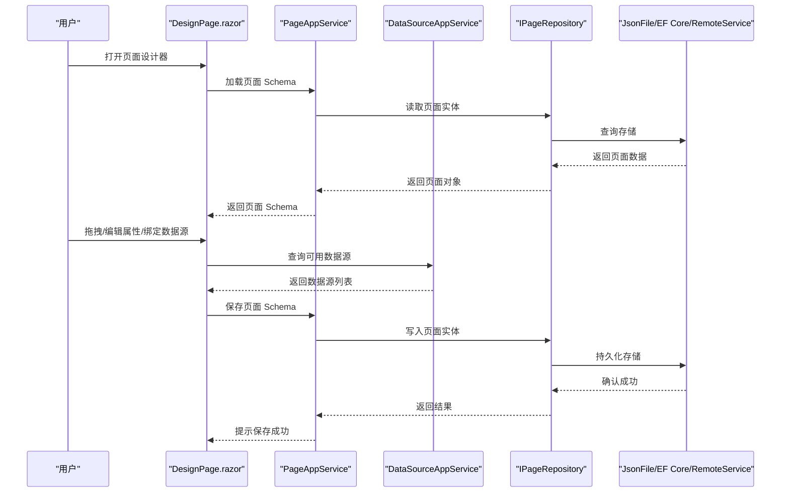
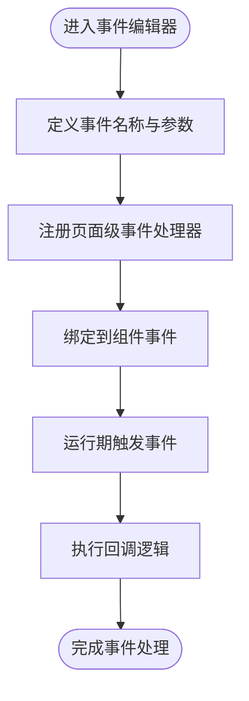
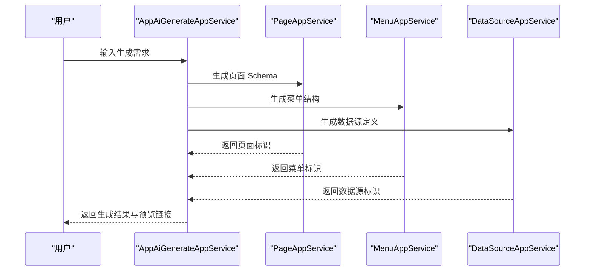
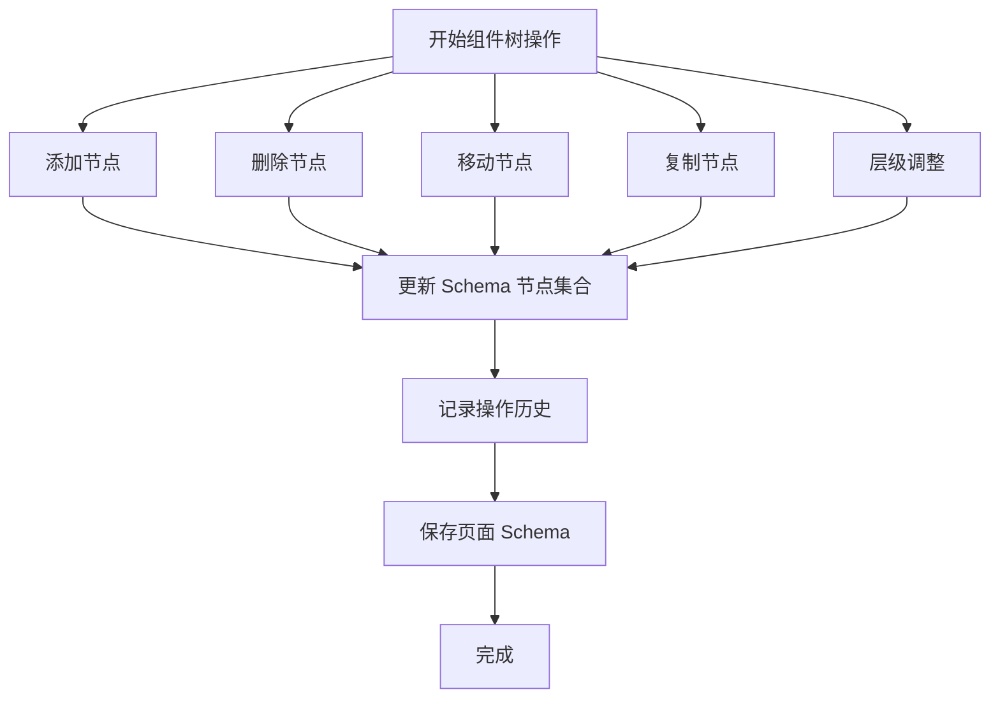
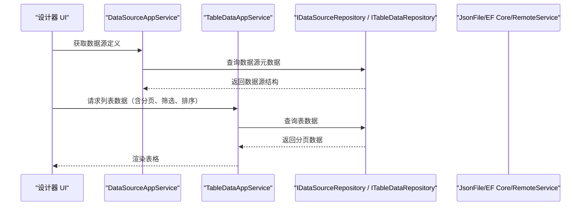
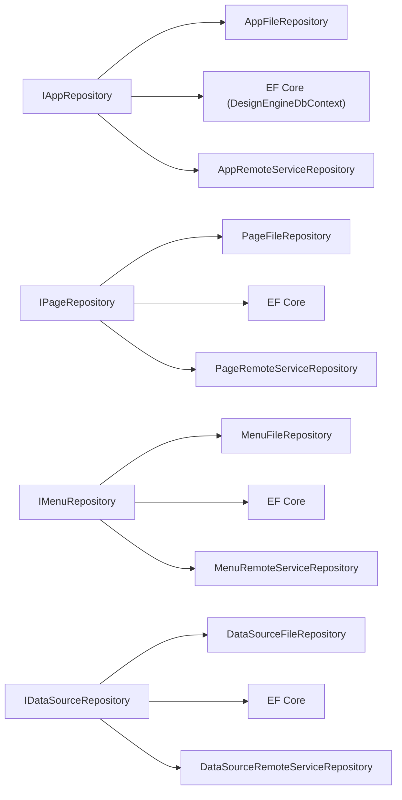

# 设计引擎

<cite>
**本文引用的文件**   
- [AppAiGenerateAppService.cs](file://src/src/LowCode/DesignEngine/H.LowCode.DesignEngine.Application/AppServices/AppAiGenerateAppService.cs)
- [IPageAppService.cs](file://src/src/LowCode/DesignEngine/H.LowCode.DesignEngine.Application.Contracts/AppServices/IPageAppService.cs)
- [IDataSourceAppService.cs](file://src/src/LowCode/DesignEngine/H.LowCode.DesignEngine.Application.Contracts/AppServices/IDataSourceAppService.cs)
- [IMenuAppService.cs](file://src/src/LowCode/DesignEngine/H.LowCode.DesignEngine.Application.Contracts/AppServices/IMenuAppService.cs)
- [IAppApplicationService.cs](file://src/src/LowCode/DesignEngine/H.LowCode.DesignEngine.Application.Contracts/AppServices/IAppApplicationService.cs)
- [IAppPublishAppService.cs](file://src/src/LowCode/DesignEngine/H.LowCode.DesignEngine.Application.Contracts/AppServices/IAppPublishAppService.cs)
- [IAppRbacAppService.cs](file://src/src/LowCode/DesignEngine/H.LowCode.DesignEngine.Application.Contracts/AppServices/IAppRbacAppService.cs)
- [IComponentLibraryAppService.cs](file://src/src/LowCode/DesignEngine/H.LowCode.DesignEngine.Application.Contracts/PartsAppServices/IComponentLibraryAppService.cs)
- [IComponentPartsAppService.cs](file://src/src/LowCode/DesignEngine/H.LowCode.DesignEngine.Application.Contracts/PartsAppServices/IComponentPartsAppService.cs)
- [IPageTemplateAppService.cs](file://src/src/LowCode/DesignEngine/H.LowCode.DesignEngine.Application.Contracts/PartsAppServices/IPageTemplateAppService.cs)
- [IAppTemplateAppService.cs](file://src/src/LowCode/DesignEngine/H.LowCode.DesignEngine.Application.Contracts/PartsAppServices/IAppTemplateAppService.cs)
- [AppApplicationService.cs](file://src/src/LowCode/DesignEngine/H.LowCode.DesignEngine.Application/AppServices/AppApplicationService.cs)
- [PageAppService.cs](file://src/src/LowCode/DesignEngine/H.LowCode.DesignEngine.Application/AppServices/PageAppService.cs)
- [DataSourceAppService.cs](file://src/src/LowCode/DesignEngine/H.LowCode.DesignEngine.Application/AppServices/DataSourceAppService.cs)
- [MenuAppService.cs](file://src/src/LowCode/DesignEngine/H.LowCode.DesignEngine.Application/AppServices/MenuAppService.cs)
- [TableDataAppService.cs](file://src/src/LowCode/DesignEngine/H.LowCode.DesignEngine.Application/AppServices/TableDataAppService.cs)
- [AppPublishAppService.cs](file://src/src/LowCode/DesignEngine/H.LowCode.DesignEngine.Application/AppServices/AppPublishAppService.cs)
- [AppRbacAppService.cs](file://src/src/LowCode/DesignEngine/H.LowCode.DesignEngine.Application/AppServices/AppRbacAppService.cs)
- [ComponentLibraryAppService.cs](file://src/src/LowCode/DesignEngine/H.LowCode.DesignEngine.Application/PartsAppServices/ComponentLibraryAppService.cs)
- [ComponentPartsAppService.cs](file://src/src/LowCode/DesignEngine/H.LowCode.DesignEngine.Application/PartsAppServices/ComponentPartsAppService.cs)
- [PageTemplateAppService.cs](file://src/src/LowCode/DesignEngine/H.LowCode.DesignEngine.Application/PartsAppServices/PageTemplateAppService.cs)
- [AppTemplateAppService.cs](file://src/src/LowCode/DesignEngine/H.LowCode.DesignEngine.Application/PartsAppServices/AppTemplateAppService.cs)
- [IAppRepository.cs](file://src/src/LowCode/DesignEngine/H.LowCode.DesignEngine.Domain/MetaRepositories/IAppRepository.cs)
- [IPageRepository.cs](file://src/src/LowCode/DesignEngine/H.LowCode.DesignEngine.Domain/MetaRepositories/IPageRepository.cs)
- [IMenuRepository.cs](file://src/src/LowCode/DesignEngine/H.LowCode.DesignEngine.Domain/MetaRepositories/IMenuRepository.cs)
- [IDataSourceRepository.cs](file://src/src/LowCode/DesignEngine/H.LowCode.DesignEngine.Domain/MetaRepositories/IDataSourceRepository.cs)
- [IAppPublishRepository.cs](file://src/src/LowCode/DesignEngine/H.LowCode.DesignEngine.Domain/MetaRepositories/IAppPublishRepository.cs)
- [IAppRbacRepository.cs](file://src/src/LowCode/DesignEngine/H.LowCode.DesignEngine.Domain/MetaRepositories/IAppRbacRepository.cs)
- [IComponentLibraryRepository.cs](file://src/src/LowCode/DesignEngine/H.LowCode.DesignEngine.Domain/PartsRepositories/IComponentLibraryRepository.cs)
- [IComponentPartsRepository.cs](file://src/src/LowCode/DesignEngine/H.LowCode.DesignEngine.Domain/PartsRepositories/IComponentPartsRepository.cs)
- [IPageTemplateRepository.cs](file://src/src/LowCode/DesignEngine/H.LowCode.DesignEngine.Domain/PartsRepositories/IPageTemplateRepository.cs)
- [IAppTemplateRepository.cs](file://src/src/LowCode/DesignEngine/H.LowCode.DesignEngine.Domain/PartsRepositories/IAppTemplateRepository.cs)
- [ITableDataRepository.cs](file://src/src/LowCode/DesignEngine/H.LowCode.DesignEngine.Domain/DataRepositories/ITableDataRepository.cs)
- [IFormDataRepository.cs](file://src/src/LowCode/DesignEngine/H.LowCode.DesignEngine.Domain/DataRepositories/IFormDataRepository.cs)
- [AppFileRepository.cs](file://src/src/LowCode/DesignEngine/H.LowCode.DesignEngine.Repository.JsonFile/Repositories/AppFileRepository.cs)
- [PageFileRepository.cs](file://src/src/LowCode/DesignEngine/H.LowCode.DesignEngine.Repository.JsonFile/Repositories/PageFileRepository.cs)
- [MenuFileRepository.cs](file://src/src/LowCode/DesignEngine/H.LowCode.DesignEngine.Repository.JsonFile/Repositories/MenuFileRepository.cs)
- [DataSourceFileRepository.cs](file://src/src/LowCode/DesignEngine/H.LowCode.DesignEngine.Repository.JsonFile/Repositories/DataSourceFileRepository.cs)
- [AppPublishFileRepository.cs](file://src/src/LowCode/DesignEngine/H.LowCode.DesignEngine.Repository.JsonFile/Repositories/AppPublishFileRepository.cs)
- [AppRbacFileRepository.cs](file://src/src/LowCode/DesignEngine/H.LowCode.DesignEngine.Repository.JsonFile/Repositories/AppRbacFileRepository.cs)
- [ComponentLibraryRepository.cs](file://src/src/LowCode/DesignEngine/H.LowCode.DesignEngine.Repository.JsonFile/PartsRepositories/ComponentLibraryRepository.cs)
- [ComponentPartsRepository.cs](file://src/src/LowCode/DesignEngine/H.LowCode.DesignEngine.Repository.JsonFile/PartsRepositories/ComponentPartsRepository.cs)
- [PageTemplateRepository.cs](file://src/src/LowCode/DesignEngine/H.LowCode.DesignEngine.Repository.JsonFile/PartsRepositories/PageTemplateRepository.cs)
- [AppTemplateFileRepository.cs](file://src/src/LowCode/DesignEngine/H.LowCode.DesignEngine.Repository.JsonFile/PartsRepositories/AppTemplateFileRepository.cs)
- [FileRepositoryBase.cs](file://src/src/LowCode/DesignEngine/H.LowCode.DesignEngine.Repository.JsonFile/Base/FileRepositoryBase.cs)
- [PartsFileRepositoryBase.cs](file://src/src/LowCode/DesignEngine/H.LowCode.DesignEngine.Repository.JsonFile/Base/PartsFileRepositoryBase.cs)
- [DesignEngineDbContext.cs](file://src/src/LowCode/DesignEngine/H.LowCode.DesignEngine.EntityFrameworkCore/EntityFrameworkCore/DesignEngineDbContext.cs)
- [EntityTypeManager.cs](file://src/src/LowCode/DesignEngine/H.LowCode.DesignEngine.EntityFrameworkCore/EntityManager/EntityTypeManager.cs)
- [FormDataRepository.cs](file://src/src/LowCode/DesignEngine/H.LowCode.DesignEngine.EntityFrameworkCore/DataRepositories/FormDataRepository.cs)
- [TableDataRepository.cs](file://src/src/LowCode/DesignEngine/H.LowCode.DesignEngine.EntityFrameworkCore/DataRepositories/TableDataRepository.cs)
- [QueryWithNoLockDbCommandInterceptor.cs](file://src/src/LowCode/DesignEngine/H.LowCode.DesignEngine.EntityFrameworkCore/EntityFrameworkCore/Extensions/QueryWithNoLockDbCommandInterceptor.cs)
- [ReadOnlySaveChangesInterceptor.cs](file://src/src/LowCode/DesignEngine/H.LowCode.DesignEngine.EntityFrameworkCore/EntityFrameworkCore/Extensions/ReadOnlySaveChangesInterceptor.cs)
- [CustomizeRelationalModelValidator.cs](file://src/src/LowCode/DesignEngine/H.LowCode.DesignEngine.EntityFrameworkCore/EntityFrameworkCore/Extensions/CustomizeRelationalModelValidator.cs)
- [DesignEngineModelCacheKeyFactory.cs](file://src/src/LowCode/DesignEngine/H.LowCode.DesignEngine.EntityFrameworkCore/EntityFrameworkCore/Extensions/DesignEngineModelCacheKeyFactory.cs)
- [AppRemoteServiceRepository.cs](file://src/src/LowCode/DesignEngine/H.LowCode.DesignEngine.Repository.RemoteService/Repositories/AppRemoteServiceRepository.cs)
- [PageRemoteServiceRepository.cs](file://src/src/LowCode/DesignEngine/H.LowCode.DesignEngine.Repository.RemoteService/Repositories/PageRemoteServiceRepository.cs)
- [MenuRemoteServiceRepository.cs](file://src/src/LowCode/DesignEngine/H.LowCode.DesignEngine.Repository.RemoteService/Repositories/MenuRemoteServiceRepository.cs)
- [DataSourceRemoteServiceRepository.cs](file://src/src/LowCode/DesignEngine/H.LowCode.DesignEngine.Repository.RemoteService/Repositories/DataSourceRemoteServiceRepository.cs)
- [RemoteServiceRepositoryBase.cs](file://src/src/LowCode/DesignEngine/H.LowCode.DesignEngine.Repository.RemoteService/Base/RemoteServiceRepositoryBase.cs)
- [DesignPage.razor](file://src/src/LowCode/DesignEngine/H.LowCode.DesignEngine/Pages/DesignPage.razor)
- [EventList.razor](file://src/src/LowCode/DesignEngine/H.LowCode.DesignEngineBase/Components/Events/EventList.razor)
- [DragDropElementDimensions.cs](file://src/src/LowCode/DesignEngine/H.LowCode.DesignEngineBase/Dtos/DragDropElementDimensions.cs)
- [PageDesignPanel.razor](file://src/src/LowCode/DesignEngine/H.LowCode.PartsDesignEngine/DesignPanel/PageDesignPanel.razor)
- [PagePartsDesigner.razor](file://src/src/LowCode/DesignEngine/H.LowCode.PartsDesignEngine/Pages/PageParts/PagePartsDesigner.razor)
- [ComponentPartsDesignerPage.razor](file://src/src/LowCode/DesignEngine/H.LowCode.PartsDesignEngine/Pages(ComponentParts)/ComponentPartsDesignerPage.razor)
- [ComponentPartsEditorPage.razor](file://src/src/LowCode/DesignEngine/H.LowCode.PartsDesignEngine/Pages(ComponentParts)/ComponentPartsEditorPage.razor)
- [PageLibraryList.razor](file://src/src/LowCode/DesignEngine/H.LowCode.PartsDesignEngine/Pages(PageParts)/PageLibraryList.razor)
- [AppAiGenerateDtos.cs](file://src/src/LowCode/DesignEngine/H.LowCode.DesignEngine.Application.Contracts/Dtos/Ai/AppAiGenerateDtos.cs)
- [IAppAiGenerateAppService.cs](file://src/src/LowCode/DesignEngine/H.LowCode.DesignEngine.Application.Contracts/AppServices/IAppAiGenerateAppService.cs)
</cite>

## 目录
1. [引言](#引言)
2. [项目结构](#项目结构)
3. [核心组件](#核心组件)
4. [架构总览](#架构总览)
5. [详细组件分析](#详细组件分析)
6. [依赖关系分析](#依赖关系分析)
7. [性能考虑](#性能考虑)
8. [故障排查指南](#故障排查指南)
9. [结论](#结论)
10. [附录：实践清单与示例路径](#附录实践清单与示例路径)

## 引言
本文件面向 AppLab 低代码平台的设计引擎，系统性梳理 DesignEngine 的分层架构、领域模型、应用服务、仓储抽象以及前端设计器交互流程。重点包括：
- Domain 领域模型与应用服务的职责边界
- JsonFile、EntityFrameworkCore、RemoteService 三种仓储实现的选择与对比
- DesignPage.razor 页面 Schema 的加载、编辑、保存与事件处理
- AI 生成应用（AppAiGenerateAppService）如何快速构造页面、菜单和数据源
- PartsDesignEngine（部件设计器）与 MyApplication（我的应用管理）的区别
- 组件树操作（添加、删除、移动、复制、撤销重做、层级调整）
- 事件系统注册与触发机制
- 数据源绑定：表单绑定、列表加载、分页查询、筛选排序
- 持久化策略与部署建议

## 项目结构
DesignEngine 采用典型的分层架构：Domain 定义领域接口与元模型；Application 暴露业务服务；Repository 抽象多种存储后端；UI 侧由 Blazor 页面和基础组件构成。

**图表来源**
- [AppApplicationService.cs](file://src/src/LowCode/DesignEngine/H.LowCode.DesignEngine.Application/AppServices/AppApplicationService.cs)
- [PageAppService.cs](file://src/src/LowCode/DesignEngine/H.LowCode.DesignEngine.Application/AppServices/PageAppService.cs)
- [MenuAppService.cs](file://src/src/LowCode/DesignEngine/H.LowCode.DesignEngine.Application/AppServices/MenuAppService.cs)
- [DataSourceAppService.cs](file://src/src/LowCode/DesignEngine/H.LowCode.DesignEngine.Application/AppServices/DataSourceAppService.cs)
- [TableDataAppService.cs](file://src/src/LowCode/DesignEngine/H.LowCode.DesignEngine.Application/AppServices/TableDataAppService.cs)
- [AppAiGenerateAppService.cs](file://src/src/LowCode/DesignEngine/H.LowCode.DesignEngine.Application/AppServices/AppAiGenerateAppService.cs)
- [IAppRepository.cs](file://src/src/LowCode/DesignEngine/H.LowCode.DesignEngine.Domain/MetaRepositories/IAppRepository.cs)
- [IPageRepository.cs](file://src/src/LowCode/DesignEngine/H.LowCode.DesignEngine.Domain/MetaRepositories/IPageRepository.cs)
- [IMenuRepository.cs](file://src/src/LowCode/DesignEngine/H.LowCode.DesignEngine.Domain/MetaRepositories/IMenuRepository.cs)
- [IDataSourceRepository.cs](file://src/src/LowCode/DesignEngine/H.LowCode.DesignEngine.Domain/MetaRepositories/IDataSourceRepository.cs)
- [ITableDataRepository.cs](file://src/src/LowCode/DesignEngine/H.LowCode.DesignEngine.Domain/DataRepositories/ITableDataRepository.cs)
- [IFormDataRepository.cs](file://src/src/LowCode/DesignEngine/H.LowCode.DesignEngine.Domain/DataRepositories/IFormDataRepository.cs)
- [AppFileRepository.cs](file://src/src/LowCode/DesignEngine/H.LowCode.DesignEngine.Repository.JsonFile/Repositories/AppFileRepository.cs)
- [PageFileRepository.cs](file://src/src/LowCode/DesignEngine/H.LowCode.DesignEngine.Repository.JsonFile/Repositories/PageFileRepository.cs)
- [MenuFileRepository.cs](file://src/src/LowCode/DesignEngine/H.LowCode.DesignEngine.Repository.JsonFile/Repositories/MenuFileRepository.cs)
- [DataSourceFileRepository.cs](file://src/src/LowCode/DesignEngine/H.LowCode.DesignEngine.Repository.JsonFile/Repositories/DataSourceFileRepository.cs)
- [FormDataRepository.cs](file://src/src/LowCode/DesignEngine/H.LowCode.DesignEngine.EntityFrameworkCore/DataRepositories/FormDataRepository.cs)
- [TableDataRepository.cs](file://src/src/LowCode/DesignEngine/H.LowCode.DesignEngine.EntityFrameworkCore/DataRepositories/TableDataRepository.cs)
- [AppRemoteServiceRepository.cs](file://src/src/LowCode/DesignEngine/H.LowCode.DesignEngine.Repository.RemoteService/Repositories/AppRemoteServiceRepository.cs)
- [PageRemoteServiceRepository.cs](file://src/src/LowCode/DesignEngine/H.LowCode.DesignEngine.Repository.RemoteService/Repositories/PageRemoteServiceRepository.cs)
- [MenuRemoteServiceRepository.cs](file://src/src/LowCode/DesignEngine/H.LowCode.DesignEngine.Repository.RemoteService/Repositories/MenuRemoteServiceRepository.cs)
- [DataSourceRemoteServiceRepository.cs](file://src/src/LowCode/DesignEngine/H.LowCode.DesignEngine.Repository.RemoteService/Repositories/DataSourceRemoteServiceRepository.cs)
- [DesignPage.razor](file://src/src/LowCode/DesignEngine/H.LowCode.DesignEngine/Pages/DesignPage.razor)
- [EventList.razor](file://src/src/LowCode/DesignEngine/H.LowCode.DesignEngineBase/Components/Events/EventList.razor)
- [PageDesignPanel.razor](file://src/src/LowCode/DesignEngine/H.LowCode.PartsDesignEngine/DesignPanel/PageDesignPanel.razor)
- [PagePartsDesigner.razor](file://src/src/LowCode/DesignEngine/H.LowCode.PartsDesignEngine/Pages/PageParts/PagePartsDesigner.razor)

**章节来源**
- [AppApplicationService.cs](file://src/src/LowCode/DesignEngine/H.LowCode.DesignEngine.Application/AppServices/AppApplicationService.cs)
- [PageAppService.cs](file://src/src/LowCode/DesignEngine/H.LowCode.DesignEngine.Application/AppServices/PageAppService.cs)
- [DataSourceAppService.cs](file://src/src/LowCode/DesignEngine/H.LowCode.DesignEngine.Application/AppServices/DataSourceAppService.cs)
- [MenuAppService.cs](file://src/src/LowCode/DesignEngine/H.LowCode.DesignEngine.Application/AppServices/MenuAppService.cs)
- [TableDataAppService.cs](file://src/src/LowCode/DesignEngine/H.LowCode.DesignEngine.Application/AppServices/TableDataAppService.cs)
- [IAppRepository.cs](file://src/src/LowCode/DesignEngine/H.LowCode.DesignEngine.Domain/MetaRepositories/IAppRepository.cs)
- [IPageRepository.cs](file://src/src/LowCode/DesignEngine/H.LowCode.DesignEngine.Domain/MetaRepositories/IPageRepository.cs)
- [IMenuRepository.cs](file://src/src/LowCode/DesignEngine/H.LowCode.DesignEngine.Domain/MetaRepositories/IMenuRepository.cs)
- [IDataSourceRepository.cs](file://src/src/LowCode/DesignEngine/H.LowCode.DesignEngine.Domain/MetaRepositories/IDataSourceRepository.cs)
- [ITableDataRepository.cs](file://src/src/LowCode/DesignEngine/H.LowCode.DesignEngine.Domain/DataRepositories/ITableDataRepository.cs)
- [IFormDataRepository.cs](file://src/src/LowCode/DesignEngine/H.LowCode.DesignEngine.Domain/DataRepositories/IFormDataRepository.cs)

## 核心组件
DesignEngine 的核心由“领域接口 + 应用服务 + 仓储实现”构成，并围绕“应用、页面、菜单、数据源、发布、权限、模板、组件库、部件”等元数据进行组织。

- 领域接口
  - 应用与页面：IAppRepository、IPageRepository
  - 菜单与数据源：IMenuRepository、IDataSourceRepository
  - 运行时数据：ITableDataRepository、IFormDataRepository
  - 发布与权限：IAppPublishRepository、IAppRbacRepository
  - 部件与模板：IComponentLibraryRepository、IComponentPartsRepository、IPageTemplateRepository、IAppTemplateRepository

- 应用服务
  - 应用生命周期：AppApplicationService
  - 页面编排：PageAppService
  - 数据源管理：DataSourceAppService
  - 菜单配置：MenuAppService
  - 表格数据访问：TableDataAppService
  - 发布与 RBAC：AppPublishAppService、AppRbacAppService
  - 模板与组件：PageTemplateAppService、AppTemplateAppService、ComponentLibraryAppService、ComponentPartsAppService
  - AI 生成：AppAiGenerateAppService

- 仓储实现
  - JsonFile：以 JSON 文件为持久化介质，适合本地开发或轻量部署
  - EF Core：基于 EntityFrameworkCore 的数据库持久化，适合生产环境
  - RemoteService：通过远程服务调用进行跨进程/跨服务的数据访问，适合微服务架构

**章节来源**
- [IAppRepository.cs](file://src/src/LowCode/DesignEngine/H.LowCode.DesignEngine.Domain/MetaRepositories/IAppRepository.cs)
- [IPageRepository.cs](file://src/src/LowCode/DesignEngine/H.LowCode.DesignEngine.Domain/MetaRepositories/IPageRepository.cs)
- [IMenuRepository.cs](file://src/src/LowCode/DesignEngine/H.LowCode.DesignEngine.Domain/MetaRepositories/IMenuRepository.cs)
- [IDataSourceRepository.cs](file://src/src/LowCode/DesignEngine/H.LowCode.DesignEngine.Domain/MetaRepositories/IDataSourceRepository.cs)
- [ITableDataRepository.cs](file://src/src/LowCode/DesignEngine/H.LowCode.DesignEngine.Domain/DataRepositories/ITableDataRepository.cs)
- [IFormDataRepository.cs](file://src/src/LowCode/DesignEngine/H.LowCode.DesignEngine.Domain/DataRepositories/IFormDataRepository.cs)
- [IAppPublishRepository.cs](file://src/src/LowCode/DesignEngine/H.LowCode.DesignEngine.Domain/MetaRepositories/IAppPublishRepository.cs)
- [IAppRbacRepository.cs](file://src/src/LowCode/DesignEngine/H.LowCode.DesignEngine.Domain/MetaRepositories/IAppRbacRepository.cs)
- [IComponentLibraryRepository.cs](file://src/src/LowCode/DesignEngine/H.LowCode.DesignEngine.Domain/PartsRepositories/IComponentLibraryRepository.cs)
- [IComponentPartsRepository.cs](file://src/src/LowCode/DesignEngine/H.LowCode.DesignEngine.Domain/PartsRepositories/IComponentPartsRepository.cs)
- [IPageTemplateRepository.cs](file://src/src/LowCode/DesignEngine/H.LowCode.DesignEngine.Domain/PartsRepositories/IPageTemplateRepository.cs)
- [IAppTemplateRepository.cs](file://src/src/LowCode/DesignEngine/H.LowCode.DesignEngine.Domain/PartsRepositories/IAppTemplateRepository.cs)
- [AppApplicationService.cs](file://src/src/LowCode/DesignEngine/H.LowCode.DesignEngine.Application/AppServices/AppApplicationService.cs)
- [PageAppService.cs](file://src/src/LowCode/DesignEngine/H.LowCode.DesignEngine.Application/AppServices/PageAppService.cs)
- [DataSourceAppService.cs](file://src/src/LowCode/DesignEngine/H.LowCode.DesignEngine.Application/AppServices/DataSourceAppService.cs)
- [MenuAppService.cs](file://src/src/LowCode/DesignEngine/H.LowCode.DesignEngine.Application/AppServices/MenuAppService.cs)
- [TableDataAppService.cs](file://src/src/LowCode/DesignEngine/H.LowCode.DesignEngine.Application/AppServices/TableDataAppService.cs)
- [AppPublishAppService.cs](file://src/src/LowCode/DesignEngine/H.LowCode.DesignEngine.Application/AppServices/AppPublishAppService.cs)
- [AppRbacAppService.cs](file://src/src/LowCode/DesignEngine/H.LowCode.DesignEngine.Application/AppServices/AppRbacAppService.cs)
- [ComponentLibraryAppService.cs](file://src/src/LowCode/DesignEngine/H.LowCode.DesignEngine.Application/PartsAppServices/ComponentLibraryAppService.cs)
- [ComponentPartsAppService.cs](file://src/src/LowCode/DesignEngine/H.LowCode.DesignEngine.Application/PartsAppServices/ComponentPartsAppService.cs)
- [PageTemplateAppService.cs](file://src/src/LowCode/DesignEngine/H.LowCode.DesignEngine.Application/PartsAppServices/PageTemplateAppService.cs)
- [AppTemplateAppService.cs](file://src/src/LowCode/DesignEngine/H.LowCode.DesignEngine.Application/PartsAppServices/AppTemplateAppService.cs)

## 架构总览
DesignEngine 遵循“领域驱动 + 分层架构”的原则，应用服务负责编排业务流程，仓储屏蔽存储差异，UI 层聚焦用户交互。AI 生成作为高层编排能力，统一调用页面、菜单、数据源应用服务，快速构建应用骨架。

```mermaid
classDiagram
    class IAppRepository
    class IPageRepository
    class IMenuRepository
    class IDataSourceRepository
    class ITableDataRepository
    class IFormDataRepository
    class IAppPublishRepository
    class IAppRbacRepository
    class IComponentLibraryRepository
    class IComponentPartsRepository
    class IPageTemplateRepository
    class IAppTemplateRepository

    class AppApplicationService
    class PageAppService
    class DataSourceAppService
    class MenuAppService
    class TableDataAppService
    class AppPublishAppService
    class AppRbacAppService
    class ComponentLibraryAppService
    class ComponentPartsAppService
    class PageTemplateAppService
    class AppTemplateAppService
    class AppAiGenerateAppService

    AppApplicationService --> IAppRepository
    PageAppService --> IPageRepository
    MenuAppService --> IMenuRepository
    DataSourceAppService --> IDataSourceRepository
    TableDataAppService --> ITableDataRepository
    AppPublishAppService --> IAppPublishRepository
    AppRbacAppService --> IAppRbacRepository
    ComponentLibraryAppService --> IComponentLibraryRepository
    ComponentPartsAppService --> IComponentPartsRepository
    PageTemplateAppService --> IPageTemplateRepository
    AppTemplateAppService --> IAppTemplateRepository
    AppAiGenerateAppService --> PageAppService
    AppAiGenerateAppService --> MenuAppService
    AppAiGenerateAppService --> DataSourceAppService
```

**图表来源**
- [AppApplicationService.cs](file://src/src/LowCode/DesignEngine/H.LowCode.DesignEngine.Application/AppServices/AppApplicationService.cs)
- [PageAppService.cs](file://src/src/LowCode/DesignEngine/H.LowCode.DesignEngine.Application/AppServices/PageAppService.cs)
- [MenuAppService.cs](file://src/src/LowCode/DesignEngine/H.LowCode.DesignEngine.Application/AppServices/MenuAppService.cs)
- [DataSourceAppService.cs](file://src/src/LowCode/DesignEngine/H.LowCode.DesignEngine.Application/AppServices/DataSourceAppService.cs)
- [TableDataAppService.cs](file://src/src/LowCode/DesignEngine/H.LowCode.DesignEngine.Application/AppServices/TableDataAppService.cs)
- [AppPublishAppService.cs](file://src/src/LowCode/DesignEngine/H.LowCode.DesignEngine.Application/AppServices/AppPublishAppService.cs)
- [AppRbacAppService.cs](file://src/src/LowCode/DesignEngine/H.LowCode.DesignEngine.Application/AppServices/AppRbacAppService.cs)
- [ComponentLibraryAppService.cs](file://src/src/LowCode/DesignEngine/H.LowCode.DesignEngine.Application/PartsAppServices/ComponentLibraryAppService.cs)
- [ComponentPartsAppService.cs](file://src/src/LowCode/DesignEngine/H.LowCode.DesignEngine.Application/PartsAppServices/ComponentPartsAppService.cs)
- [PageTemplateAppService.cs](file://src/src/LowCode/DesignEngine/H.LowCode.DesignEngine.Application/PartsAppServices/PageTemplateAppService.cs)
- [AppTemplateAppService.cs](file://src/src/LowCode/DesignEngine/H.LowCode.DesignEngine.Application/PartsAppServices/AppTemplateAppService.cs)
- [AppAiGenerateAppService.cs](file://src/src/LowCode/DesignEngine/H.LowCode.DesignEngine.Application/AppServices/AppAiGenerateAppService.cs)
- [IAppRepository.cs](file://src/src/LowCode/DesignEngine/H.LowCode.DesignEngine.Domain/MetaRepositories/IAppRepository.cs)
- [IPageRepository.cs](file://src/src/LowCode/DesignEngine/H.LowCode.DesignEngine.Domain/MetaRepositories/IPageRepository.cs)
- [IMenuRepository.cs](file://src/src/LowCode/DesignEngine/H.LowCode.DesignEngine.Domain/MetaRepositories/IMenuRepository.cs)
- [IDataSourceRepository.cs](file://src/src/LowCode/DesignEngine/H.LowCode.DesignEngine.Domain/MetaRepositories/IDataSourceRepository.cs)
- [ITableDataRepository.cs](file://src/src/LowCode/DesignEngine/H.LowCode.DesignEngine.Domain/DataRepositories/ITableDataRepository.cs)
- [IFormDataRepository.cs](file://src/src/LowCode/DesignEngine/H.LowCode.DesignEngine.Domain/DataRepositories/IFormDataRepository.cs)
- [IAppPublishRepository.cs](file://src/src/LowCode/DesignEngine/H.LowCode.DesignEngine.Domain/MetaRepositories/IAppPublishRepository.cs)
- [IAppRbacRepository.cs](file://src/src/LowCode/DesignEngine/H.LowCode.DesignEngine.Domain/MetaRepositories/IAppRbacRepository.cs)
- [IComponentLibraryRepository.cs](file://src/src/LowCode/DesignEngine/H.LowCode.DesignEngine.Domain/PartsRepositories/IComponentLibraryRepository.cs)
- [IComponentPartsRepository.cs](file://src/src/LowCode/DesignEngine/H.LowCode.DesignEngine.Domain/PartsRepositories/IComponentPartsRepository.cs)
- [IPageTemplateRepository.cs](file://src/src/LowCode/DesignEngine/H.LowCode.DesignEngine.Domain/PartsRepositories/IPageTemplateRepository.cs)
- [IAppTemplateRepository.cs](file://src/src/LowCode/DesignEngine/H.LowCode.DesignEngine.Domain/PartsRepositories/IAppTemplateRepository.cs)

## 详细组件分析

### 设计器页面 DesignPage.razor 的工作原理
DesignPage.razor 是设计器的核心入口页，负责：
- 加载页面 Schema：从 PageAppService 获取当前页面元数据
- 渲染组件树：根据 Schema 渲染可视化布局
- 支持拖拽组件：结合 DragDropElementDimensions 等基础 DTO 实现拖放布局
- 编辑属性：在属性面板中修改组件属性，回写至 Schema
- 绑定数据源：通过 DataSourceAppService 将页面组件与数据源关联
- 处理事件：通过 EventList.razor 注册页面级事件与组件间事件回调
- 保存与提交：将更新后的 Schema 通过 PageAppService 持久化

**图表来源**
- [DesignPage.razor](file://src/src/LowCode/DesignEngine/H.LowCode.DesignEngine/Pages/DesignPage.razor)
- [PageAppService.cs](file://src/src/LowCode/DesignEngine/H.LowCode.DesignEngine.Application/AppServices/PageAppService.cs)
- [DataSourceAppService.cs](file://src/src/LowCode/DesignEngine/H.LowCode.DesignEngine.Application/AppServices/DataSourceAppService.cs)
- [IPageRepository.cs](file://src/src/LowCode/DesignEngine/H.LowCode.DesignEngine.Domain/MetaRepositories/IPageRepository.cs)
- [PageFileRepository.cs](file://src/src/LowCode/DesignEngine/H.LowCode.DesignEngine.Repository.JsonFile/Repositories/PageFileRepository.cs)
- [PageRemoteServiceRepository.cs](file://src/src/LowCode/DesignEngine/H.LowCode.DesignEngine.Repository.RemoteService/Repositories/PageRemoteServiceRepository.cs)

**章节来源**
- [DesignPage.razor](file://src/src/LowCode/DesignEngine/H.LowCode.DesignEngine/Pages/DesignPage.razor)
- [PageAppService.cs](file://src/src/LowCode/DesignEngine/H.LowCode.DesignEngine.Application/AppServices/PageAppService.cs)
- [DataSourceAppService.cs](file://src/src/LowCode/DesignEngine/H.LowCode.DesignEngine.Application/AppServices/DataSourceAppService.cs)
- [DragDropElementDimensions.cs](file://src/src/LowCode/DesignEngine/H.LowCode.DesignEngineBase/Dtos/DragDropElementDimensions.cs)

### 事件系统 EventList.razor
EventList.razor 提供事件定义、页面级事件管理与组件间事件通信的基础能力：
- 事件定义：为组件或页面声明事件名称、参数类型
- 页面级事件：在页面级别注册全局事件，供子组件触发
- 组件间事件：通过事件总线或回调机制实现父子组件通信
- 注册与触发：在设计时注册事件处理器，在运行期触发回调

**图表来源**
- [EventList.razor](file://src/src/LowCode/DesignEngine/H.LowCode.DesignEngineBase/Components/Events/EventList.razor)

**章节来源**
- [EventList.razor](file://src/src/LowCode/DesignEngine/H.LowCode.DesignEngineBase/Components/Events/EventList.razor)

### AI 生成应用 AppAiGenerateAppService
AppAiGenerateAppService 通过 AI 辅助快速生成应用骨架，主要步骤：
- 接收用户意图：例如“生成一个订单管理页面，包含列表、表单、筛选与分页”
- 调用 PageAppService：创建页面 Schema，预设组件布局与属性
- 调用 MenuAppService：自动生成菜单项，挂载到新页面
- 调用 DataSourceAppService：创建数据源定义，绑定到页面组件
- 输出可验收产物：页面、菜单、数据源结构均已完成初版配置

**图表来源**
- [AppAiGenerateAppService.cs](file://src/src/LowCode/DesignEngine/H.LowCode.DesignEngine.Application/AppServices/AppAiGenerateAppService.cs)
- [IPageAppService.cs](file://src/src/LowCode/DesignEngine/H.LowCode.DesignEngine.Application.Contracts/AppServices/IPageAppService.cs)
- [IMenuAppService.cs](file://src/src/LowCode/DesignEngine/H.LowCode.DesignEngine.Application.Contracts/AppServices/IMenuAppService.cs)
- [IDataSourceAppService.cs](file://src/src/LowCode/DesignEngine/H.LowCode.DesignEngine.Application.Contracts/AppServices/IDataSourceAppService.cs)
- [AppAiGenerateDtos.cs](file://src/src/LowCode/DesignEngine/H.LowCode.DesignEngine.Application.Contracts/Dtos/Ai/AppAiGenerateDtos.cs)
- [IAppAiGenerateAppService.cs](file://src/src/LowCode/DesignEngine/H.LowCode.DesignEngine.Application.Contracts/AppServices/IAppAiGenerateAppService.cs)

**章节来源**
- [AppAiGenerateAppService.cs](file://src/src/LowCode/DesignEngine/H.LowCode.DesignEngine.Application/AppServices/AppAiGenerateAppService.cs)
- [IPageAppService.cs](file://src/src/LowCode/DesignEngine/H.LowCode.DesignEngine.Application.Contracts/AppServices/IPageAppService.cs)
- [IMenuAppService.cs](file://src/src/LowCode/DesignEngine/H.LowCode.DesignEngine.Application.Contracts/AppServices/IMenuAppService.cs)
- [IDataSourceAppService.cs](file://src/src/LowCode/DesignEngine/H.LowCode.DesignEngine.Application.Contracts/AppServices/IDataSourceAppService.cs)
- [AppAiGenerateDtos.cs](file://src/src/LowCode/DesignEngine/H.LowCode.DesignEngine.Application.Contracts/Dtos/Ai/AppAiGenerateDtos.cs)
- [IAppAiGenerateAppService.cs](file://src/src/LowCode/DesignEngine/H.LowCode.DesignEngine.Application.Contracts/AppServices/IAppAiGenerateAppService.cs)

### PartsDesignEngine（部件设计器）与 MyApplication（我的应用管理）
- PartsDesignEngine（部件设计器）
  - 关注点：组件部件与页面部件的定义、编辑与复用
  - 关键页面：PageDesignPanel.razor、PagePartsDesigner.razor、ComponentPartsDesignerPage.razor、ComponentPartsEditorPage.razor、PageLibraryList.razor
  - 适用场景：需要封装通用 UI 片段、提升复用率、建立组件库与页面模板体系

- MyApplication（我的应用管理）
  - 关注点：用户维度的应用实例管理，如应用的创建、版本、发布状态
  - 适用场景：个人或小团队的应用开发与迭代，强调应用生命周期与权限隔离

二者区别在于：
- 设计维度：部件设计器偏“构件”，我的应用管理偏“应用实例”
- 复用范围：部件设计器产出可在多个应用中复用的部件，我的应用管理针对具体应用
- 协作方式：部件设计器更适合团队共享组件库，我的应用管理更偏向个体或小组的开发工作区

**章节来源**
- [PageDesignPanel.razor](file://src/src/LowCode/DesignEngine/H.LowCode.PartsDesignEngine/DesignPanel/PageDesignPanel.razor)
- [PagePartsDesigner.razor](file://src/src/LowCode/DesignEngine/H.LowCode.PartsDesignEngine/Pages/PageParts/PagePartsDesigner.razor)
- [ComponentPartsDesignerPage.razor](file://src/src/LowCode/DesignEngine/H.LowCode.PartsDesignEngine/Pages(ComponentParts)/ComponentPartsDesignerPage.razor)
- [ComponentPartsEditorPage.razor](file://src/src/LowCode/DesignEngine/H.LowCode.PartsDesignEngine/Pages(ComponentParts)/ComponentPartsEditorPage.razor)
- [PageLibraryList.razor](file://src/src/LowCode/DesignEngine/H.LowCode.PartsDesignEngine/Pages(PageParts)/PageLibraryList.razor)

### 组件树操作：添加、删除、移动、复制、撤销重做、层级调整
组件树操作在设计器中以 Schema 变更为核心：
- 添加：向父节点插入子节点，默认属性由组件元数据提供
- 删除：移除指定节点，并清理其事件与数据源绑定
- 移动：调整节点位置，保持父子关系正确
- 复制：克隆节点及其子树，重新分配唯一标识
- 撤销重做：维护操作历史栈，支持时间轴回滚
- 层级调整：交换兄弟节点顺序，更新索引

这些操作最终体现为对页面 Schema 的增量修改，并通过 PageAppService 保存。

**图表来源**
- [DesignPage.razor](file://src/src/LowCode/DesignEngine/H.LowCode.DesignEngine/Pages/DesignPage.razor)
- [PageAppService.cs](file://src/src/LowCode/DesignEngine/H.LowCode.DesignEngine.Application/AppServices/PageAppService.cs)

**章节来源**
- [DesignPage.razor](file://src/src/LowCode/DesignEngine/H.LowCode.DesignEngine/Pages/DesignPage.razor)
- [PageAppService.cs](file://src/src/LowCode/DesignEngine/H.LowCode.DesignEngine.Application/AppServices/PageAppService.cs)

### 数据源绑定：表单绑定、列表加载、分页查询、筛选排序
数据源绑定围绕 DataSourceAppService 与 TableDataAppService 展开：
- 表单数据绑定：将表单字段映射到数据源的字段，支持双向绑定
- 列表数据加载：通过 TableDataAppService 查询列表数据，填充到表格组件
- 分页查询：传递分页参数（页码、每页大小），服务端返回分页结果
- 筛选排序：将筛选条件与排序规则作为查询参数传递给数据源

**图表来源**
- [DataSourceAppService.cs](file://src/src/LowCode/DesignEngine/H.LowCode.DesignEngine.Application/AppServices/DataSourceAppService.cs)
- [TableDataAppService.cs](file://src/src/LowCode/DesignEngine/H.LowCode.DesignEngine.Application/AppServices/TableDataAppService.cs)
- [IDataSourceRepository.cs](file://src/src/LowCode/DesignEngine/H.LowCode.DesignEngine.Domain/MetaRepositories/IDataSourceRepository.cs)
- [ITableDataRepository.cs](file://src/src/LowCode/DesignEngine/H.LowCode.DesignEngine.Domain/DataRepositories/ITableDataRepository.cs)

**章节来源**
- [DataSourceAppService.cs](file://src/src/LowCode/DesignEngine/H.LowCode.DesignEngine.Application/AppServices/DataSourceAppService.cs)
- [TableDataAppService.cs](file://src/src/LowCode/DesignEngine/H.LowCode.DesignEngine.Application/AppServices/TableDataAppService.cs)
- [IDataSourceRepository.cs](file://src/src/LowCode/DesignEngine/H.LowCode.DesignEngine.Domain/MetaRepositories/IDataSourceRepository.cs)
- [ITableDataRepository.cs](file://src/src/LowCode/DesignEngine/H.LowCode.DesignEngine.Domain/DataRepositories/ITableDataRepository.cs)

## 依赖关系分析
仓储层的三种实现分别服务于不同部署场景：
- JsonFile：简单直接，适合本地开发与演示
- EF Core：结构化存储，适合生产环境的并发与事务
- RemoteService：跨服务调用，适合微服务架构下的解耦

**图表来源**
- [IAppRepository.cs](file://src/src/LowCode/DesignEngine/H.LowCode.DesignEngine.Domain/MetaRepositories/IAppRepository.cs)
- [IPageRepository.cs](file://src/src/LowCode/DesignEngine/H.LowCode.DesignEngine.Domain/MetaRepositories/IPageRepository.cs)
- [IMenuRepository.cs](file://src/src/LowCode/DesignEngine/H.LowCode.DesignEngine.Domain/MetaRepositories/IMenuRepository.cs)
- [IDataSourceRepository.cs](file://src/src/LowCode/DesignEngine/H.LowCode.DesignEngine.Domain/MetaRepositories/IDataSourceRepository.cs)
- [AppFileRepository.cs](file://src/src/LowCode/DesignEngine/H.LowCode.DesignEngine.Repository.JsonFile/Repositories/AppFileRepository.cs)
- [PageFileRepository.cs](file://src/src/LowCode/DesignEngine/H.LowCode.DesignEngine.Repository.JsonFile/Repositories/PageFileRepository.cs)
- [MenuFileRepository.cs](file://src/src/LowCode/DesignEngine/H.LowCode.DesignEngine.Repository.JsonFile/Repositories/MenuFileRepository.cs)
- [DataSourceFileRepository.cs](file://src/src/LowCode/DesignEngine/H.LowCode.DesignEngine.Repository.JsonFile/Repositories/DataSourceFileRepository.cs)
- [DesignEngineDbContext.cs](file://src/src/LowCode/DesignEngine/H.LowCode.DesignEngine.EntityFrameworkCore/EntityFrameworkCore/DesignEngineDbContext.cs)
- [AppRemoteServiceRepository.cs](file://src/src/LowCode/DesignEngine/H.LowCode.DesignEngine.Repository.RemoteService/Repositories/AppRemoteServiceRepository.cs)
- [PageRemoteServiceRepository.cs](file://src/src/LowCode/DesignEngine/H.LowCode.DesignEngine.Repository.RemoteService/Repositories/PageRemoteServiceRepository.cs)
- [MenuRemoteServiceRepository.cs](file://src/src/LowCode/DesignEngine/H.LowCode.DesignEngine.Repository.RemoteService/Repositories/MenuRemoteServiceRepository.cs)
- [DataSourceRemoteServiceRepository.cs](file://src/src/LowCode/DesignEngine/H.LowCode.DesignEngine.Repository.RemoteService/Repositories/DataSourceRemoteServiceRepository.cs)

**章节来源**
- [AppFileRepository.cs](file://src/src/LowCode/DesignEngine/H.LowCode.DesignEngine.Repository.JsonFile/Repositories/AppFileRepository.cs)
- [PageFileRepository.cs](file://src/src/LowCode/DesignEngine/H.LowCode.DesignEngine.Repository.JsonFile/Repositories/PageFileRepository.cs)
- [MenuFileRepository.cs](file://src/src/LowCode/DesignEngine/H.LowCode.DesignEngine.Repository.JsonFile/Repositories/MenuFileRepository.cs)
- [DataSourceFileRepository.cs](file://src/src/LowCode/DesignEngine/H.LowCode.DesignEngine.Repository.JsonFile/Repositories/DataSourceFileRepository.cs)
- [DesignEngineDbContext.cs](file://src/src/LowCode/DesignEngine/H.LowCode.DesignEngine.EntityFrameworkCore/EntityFrameworkCore/DesignEngineDbContext.cs)
- [AppRemoteServiceRepository.cs](file://src/src/LowCode/DesignEngine/H.LowCode.DesignEngine.Repository.RemoteService/Repositories/AppRemoteServiceRepository.cs)
- [PageRemoteServiceRepository.cs](file://src/src/LowCode/DesignEngine/H.LowCode.DesignEngine.Repository.RemoteService/Repositories/PageRemoteServiceRepository.cs)
- [MenuRemoteServiceRepository.cs](file://src/src/LowCode/DesignEngine/H.LowCode.DesignEngine.Repository.RemoteService/Repositories/MenuRemoteServiceRepository.cs)
- [DataSourceRemoteServiceRepository.cs](file://src/src/LowCode/DesignEngine/H.LowCode.DesignEngine.Repository.RemoteService/Repositories/DataSourceRemoteServiceRepository.cs)

## 性能考虑
- JsonFile
  - 优点：零依赖、部署简单
  - 缺点：并发写入受限，不适合高负载生产环境
  - 优化建议：批量写入、缓存热点 Schema

- EF Core
  - 优点：事务支持、索引优化、查询性能稳定
  - 缺点：需要数据库运维成本
  - 优化建议：使用只读拦截器 QueryWithNoLockDbCommandInterceptor 减少锁竞争，启用 ReadOnlySaveChangesInterceptor 防止误写

- RemoteService
  - 优点：服务解耦、可扩展性强
  - 缺点：网络开销、序列化成本
  - 优化建议：缓存数据源元数据、减少频繁小请求

**章节来源**
- [QueryWithNoLockDbCommandInterceptor.cs](file://src/src/LowCode/DesignEngine/H.LowCode.DesignEngine.EntityFrameworkCore/EntityFrameworkCore/Extensions/QueryWithNoLockDbCommandInterceptor.cs)
- [ReadOnlySaveChangesInterceptor.cs](file://src/src/LowCode/DesignEngine/H.LowCode.DesignEngine.EntityFrameworkCore/EntityFrameworkCore/Extensions/ReadOnlySaveChangesInterceptor.cs)
- [CustomizeRelationalModelValidator.cs](file://src/src/LowCode/DesignEngine/H.LowCode.DesignEngine.EntityFrameworkCore/EntityFrameworkCore/Extensions/CustomizeRelationalModelValidator.cs)
- [DesignEngineModelCacheKeyFactory.cs](file://src/src/LowCode/DesignEngine/H.LowCode.DesignEngine.EntityFrameworkCore/EntityFrameworkCore/Extensions/DesignEngineModelCacheKeyFactory.cs)

## 故障排查指南
- 页面无法加载
  - 检查 PageAppService 是否返回有效 Schema
  - 校验 IPageRepository 对应仓储实现是否可用
  - 查看 JsonFile 路径权限或 EF Core 连接字符串配置

- 数据源绑定失败
  - 确认 DataSourceAppService 返回的数据源结构与组件字段一致
  - 检查 TableDataAppService 的分页、筛选、排序参数是否正确传递

- 事件未触发
  - 确认 EventList.razor 中的事件已注册
  - 检查组件间事件绑定是否正确

- AI 生成结果异常
  - 核对 AppAiGenerateAppService 调用的 PageAppService、MenuAppService、DataSourceAppService 返回值
  - 验证生成的页面、菜单、数据源是否存在一致性约束冲突

**章节来源**
- [PageAppService.cs](file://src/src/LowCode/DesignEngine/H.LowCode.DesignEngine.Application/AppServices/PageAppService.cs)
- [DataSourceAppService.cs](file://src/src/LowCode/DesignEngine/H.LowCode.DesignEngine.Application/AppServices/DataSourceAppService.cs)
- [TableDataAppService.cs](file://src/src/LowCode/DesignEngine/H.LowCode.DesignEngine.Application/AppServices/TableDataAppService.cs)
- [EventList.razor](file://src/src/LowCode/DesignEngine/H.LowCode.DesignEngineBase/Components/Events/EventList.razor)
- [AppAiGenerateAppService.cs](file://src/src/LowCode/DesignEngine/H.LowCode.DesignEngine.Application/AppServices/AppAiGenerateAppService.cs)

## 结论
DesignEngine 通过清晰的领域模型、应用服务与仓储抽象，提供了灵活且可扩展的低代码设计能力。JsonFile、EF Core、RemoteService 三种持久化策略覆盖了从开发到生产的不同场景。DesignPage.razor 与 EventList.razor 构成了设计器的核心交互，AI 生成能力进一步提升了开发效率。部件设计器与我的应用管理分别面向“构件复用”和“应用实例管理”，形成互补的工作流。

## 附录：实践清单与示例路径
- 在设计器中注册自定义组件
  - 参考组件库服务与页面模板服务
  - 示例路径：[ComponentLibraryAppService.cs](file://src/src/LowCode/DesignEngine/H.LowCode.DesignEngine.Application/PartsAppServices/ComponentLibraryAppService.cs)、[PageTemplateAppService.cs](file://src/src/LowCode/DesignEngine/H.LowCode.DesignEngine.Application/PartsAppServices/PageTemplateAppService.cs)

- 配置属性面板
  - 参考组件部件属性定义与样式定义
  - 示例路径：[ComponentPartsAppService.cs](file://src/src/LowCode/DesignEngine/H.LowCode.DesignEngine.Application/PartsAppServices/ComponentPartsAppService.cs)

- 实现事件回调
  - 参考事件编辑器与页面设计器
  - 示例路径：[EventList.razor](file://src/src/LowCode/DesignEngine/H.LowCode.DesignEngineBase/Components/Events/EventList.razor)、[PageDesignPanel.razor](file://src/src/LowCode/DesignEngine/H.LowCode.PartsDesignEngine/DesignPanel/PageDesignPanel.razor)

- 选择持久化策略
  - JsonFile：适用于本地开发
    - 示例路径：[FileRepositoryBase.cs](file://src/src/LowCode/DesignEngine/H.LowCode.DesignEngine.Repository.JsonFile/Base/FileRepositoryBase.cs)、[PartsFileRepositoryBase.cs](file://src/src/LowCode/DesignEngine/H.LowCode.DesignEngine.Repository.JsonFile/Base/PartsFileRepositoryBase.cs)
  - EF Core：适用于生产环境
    - 示例路径：[DesignEngineDbContext.cs](file://src/src/LowCode/DesignEngine/H.LowCode.DesignEngine.EntityFrameworkCore/EntityFrameworkCore/DesignEngineDbContext.cs)、[FormDataRepository.cs](file://src/src/LowCode/DesignEngine/H.LowCode.DesignEngine.EntityFrameworkCore/DataRepositories/FormDataRepository.cs)、[TableDataRepository.cs](file://src/src/LowCode/DesignEngine/H.LowCode.DesignEngine.EntityFrameworkCore/DataRepositories/TableDataRepository.cs)
  - RemoteService：适用于微服务架构
    - 示例路径：[RemoteServiceRepositoryBase.cs](file://src/src/LowCode/DesignEngine/H.LowCode.DesignEngine.Repository.RemoteService/Base/RemoteServiceRepositoryBase.cs)、[AppRemoteServiceRepository.cs](file://src/src/LowCode/DesignEngine/H.LowCode.DesignEngine.Repository.RemoteService/Repositories/AppRemoteServiceRepository.cs)