# 设计引擎架构总览

<cite>
**本文引用的文件**   
- [H.LowCode.DesignEngineBase.csproj](file://src/LowCode/DesignEngine/H.LowCode.DesignEngineBase/H.LowCode.DesignEngineBase.csproj)
- [H.LowCode.DesignEngine.Domain.csproj](file://src/LowCode/DesignEngine/H.LowCode.DesignEngine.Domain/H.LowCode.DesignEngine.Domain.csproj)
- [H.LowCode.DesignEngine.Application.Contracts.csproj](file://src/LowCode/DesignEngine/H.LowCode.DesignEngine.Application.Contracts/H.LowCode.DesignEngine.Application.Contracts.csproj)
- [H.LowCode.DesignEngine.Application.csproj](file://src/LowCode/DesignEngine/H.LowCode.DesignEngine.Application/H.LowCode.DesignEngine.Application.csproj)
- [H.LowCode.DesignEngine.EntityFrameworkCore.csproj](file://src/LowCode/DesignEngine/H.LowCode.DesignEngine.EntityFrameworkCore/H.LowCode.DesignEngine.EntityFrameworkCore.csproj)
- [H.LowCode.DesignEngine.Repository.JsonFile.csproj](file://src/LowCode/DesignEngine/H.LowCode.DesignEngine.Repository.JsonFile/H.LowCode.DesignEngine.Repository.JsonFile.csproj)
- [H.LowCode.DesignEngine.Repository.RemoteService.csproj](file://src/LowCode/DesignEngine/H.LowCode.DesignEngine.Repository.RemoteService/H.LowCode.DesignEngine.Repository.RemoteService.csproj)
- [H.LowCode.RenderEngine.Base.csproj](file://src/LowCode/RenderEngine/H.LowCode.RenderEngine.Base/H.LowCode.RenderEngine.Base.csproj)
- [H.LowCode.RenderEngine.EntityFrameworkCore.csproj](file://src/LowCode/RenderEngine/H.LowCode.RenderEngine.EntityFrameworkCore/H.LowCode.RenderEngine.EntityFrameworkCore.csproj)
- [H.LowCode.RenderEngine.Repository.JsonFile.csproj](file://src/LowCode/RenderEngine/H.LowCode.RenderEngine.Repository.JsonFile/H.LowCode.RenderEngine.Repository.JsonFile.csproj)
- [H.LowCode.RenderEngine.Repository.RemoteService.csproj](file://src/LowCode/RenderEngine/H.LowCode.RenderEngine.Repository.RemoteService/H.LowCode.RenderEngine.Repository.RemoteService.csproj)
- [H.LowCode.RenderEngine.Host.csproj](file://src/Host/RenderEngine/H.LowCode.RenderEngine.Host/H.LowCode.RenderEngine.Host.csproj)
- [H.AppLab.Web.Host.csproj](file://src/Host/H.AppLab.Web.Host/H.AppLab.Web.Host/H.AppLab.Web.Host.csproj)
- [H.AppLab.Desktop.csproj](file://src/Host/H.AppLab.Desktop/H.AppLab.Desktop/H.AppLab.Desktop.csproj)
- [Program.cs](file://src/Host/H.AppLab.Desktop/H.AppLab.Desktop/Program.cs)
- [WorkbenchApp.cs](file://src/Host/H.AppLab.Desktop/H.AppLab.Desktop/WorkbenchApp.cs)
- [appsettings.json](file://src/Host/H.AppLab.Desktop/H.AppLab.Desktop/appsettings.json)
- [BrowserSessionPool.cs](file://src/Agent/Workbench/H.Workbench.Core/Tools/Internal/BrowserSessionPool.cs)
- [GitWorkspaceResolver.cs](file://src/Agent/Workbench/H.Workbench.Core/Tools/Internal/GitWorkspaceResolver.cs)
- [GitWorkspaceLocks.cs](file://src/Agent/Workbench/H.Workbench.Core/Tools/Internal/GitWorkspaceLocks.cs)
- [BrowserTool.cs](file://src/Agent/Workbench/H.Workbench.Core/Tools/BrowserTool.cs)
- [WorkbenchCoreModule.cs](file://src/Agent/Workbench/H.Workbench.Core/WorkbenchCoreModule.cs)
</cite>

## 更新摘要
**变更内容**   
- 新增"基础设施层增强：浏览器会话池与工作区解析器"章节，详细说明 BrowserSessionPool 的实现原理、会话隔离机制和浏览器启动策略
- 新增 GitWorkspaceResolver 的路径安全解析机制说明，包括目录派生算法和安全护栏
- 在依赖关系分析中补充 Agent/Workbench 模块与基础设施层的关联
- 更新性能与可维护性考量，增加浏览器自动化任务的资源管理建议

## 目录

1. [引言](#引言)
2. [项目结构](#项目结构)
3. [核心抽象与领域模型](#核心抽象与领域模型)
4. [三层分层架构](#三层分层架构)
5. [仓储实现与切换机制](#仓储实现与切换机制)
6. [设计引擎、应用引擎与渲染引擎的边界](#设计引擎应用引擎与渲染引擎的边界)
7. [单体部署与按服务独立部署](#单体部署与按服务独立部署)
8. [扩展新仓储的实现步骤](#扩展新仓储的实现步骤)
9. [依赖关系分析](#依赖关系分析)
10. [基础设施层增强：浏览器会话池与工作区解析器](#基础设施层增强浏览器会话池与工作区解析器)
11. [性能与可维护性考量](#性能与可维护性考量)
12. [故障排查要点](#故障排查要点)
13. [结论](#结论)

## 引言

AppLab 低代码设计引擎围绕"定义应用元数据"这一核心职责展开：它负责建模页面、菜单、数据源、组件等设计期实体，并提供仓储接口把元数据持久化到数据库、本地文件或远端服务。该仓库采用典型的领域驱动分层 + 仓储插件化方案，使设计引擎既能嵌入桌面或 Web 宿主，也能以独立服务形式被渲染引擎调用。

从工程组织看，`src/LowCode/DesignEngine` 下集中了设计引擎相关的项目；`src/LowCode/RenderEngine` 提供渲染引擎；`src/Host` 提供桌面和 Web 宿主；`src/Tools` 提供迁移工具；`src/Services` 提供账户、审批、文件等业务服务；`src/Agent/Workbench` 提供智能体工作台能力，包含浏览器自动化、工作区管理等基础设施组件。本文聚焦设计引擎的基座层、领域层、应用层和基础设施层，并说明它们如何与渲染引擎解耦。

## 项目结构

设计引擎相关的核心工程位于 `src/LowCode/DesignEngine`，并按分层命名：

| 工程 | 主要职责 |
|---|---|
| `H.LowCode.DesignEngineBase` | 仓储接口、领域模型基类、依赖注入契约等共享抽象 |
| `H.LowCode.DesignEngine.Domain` | 领域实体、领域规则与聚合根 |
| `H.LowCode.DesignEngine.Application.Contracts` | 应用层 DTO、查询命令、API 契约 |
| `H.LowCode.DesignEngine.Application` | 用例编排，例如 AppService |
| `H.LowCode.DesignEngine.EntityFrameworkCore` | EntityFrameworkCore 仓储实现 |
| `H.LowCode.DesignEngine.Repository.JsonFile` | JsonFile 仓储实现 |
| `H.LowCode.DesignEngine.Repository.RemoteService` | RemoteService 仓储实现 |
| `H.LowCode.DesignEngine.Model` | 设计引擎运行时使用的模型对象 |
| `H.LowCode.DesignEngine` | 设计引擎入口、模块装配与外部可见能力 |

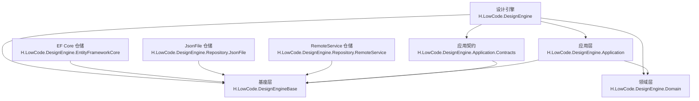

**图示来源**
- [H.LowCode.DesignEngineBase.csproj](file://src/LowCode/DesignEngine/H.LowCode.DesignEngineBase/H.LowCode.DesignEngineBase.csproj)
- [H.LowCode.DesignEngine.Domain.csproj](file://src/LowCode/DesignEngine/H.LowCode.DesignEngine.Domain/H.LowCode.DesignEngine.Domain.csproj)
- [H.LowCode.DesignEngine.Application.Contracts.csproj](file://src/LowCode/DesignEngine/H.LowCode.DesignEngine.Application.Contracts/H.LowCode.DesignEngine.Application.Contracts.csproj)
- [H.LowCode.DesignEngine.Application.csproj](file://src/LowCode/DesignEngine/H.LowCode.DesignEngine.Application/H.LowCode.DesignEngine.Application.csproj)
- [H.LowCode.DesignEngine.EntityFrameworkCore.csproj](file://src/LowCode/DesignEngine/H.LowCode.DesignEngine.EntityFrameworkCore/H.LowCode.DesignEngine.EntityFrameworkCore.csproj)
- [H.LowCode.DesignEngine.Repository.JsonFile.csproj](file://src/LowCode/DesignEngine/H.LowCode.DesignEngine.Repository.JsonFile/H.LowCode.DesignEngine.Repository.JsonFile.csproj)
- [H.LowCode.DesignEngine.Repository.RemoteService.csproj](file://src/LowCode/DesignEngine/H.LowCode.DesignEngine.Repository.RemoteService/H.LowCode.DesignEngine.Repository.RemoteService.csproj)

**章节来源**
- [H.LowCode.DesignEngineBase.csproj](file://src/LowCode/DesignEngine/H.LowCode.DesignEngineBase/H.LowCode.DesignEngineBase.csproj)
- [H.LowCode.DesignEngine.Domain.csproj](file://src/LowCode/DesignEngine/H.LowCode.DesignEngine.Domain/H.LowCode.DesignEngine.Domain.csproj)
- [H.LowCode.DesignEngine.Application.Contracts.csproj](file://src/LowCode/DesignEngine/H.LowCode.DesignEngine.Application.Contracts/H.LowCode.DesignEngine.Application.Contracts.csproj)
- [H.LowCode.DesignEngine.Application.csproj](file://src/LowCode/DesignEngine/H.LowCode.DesignEngine.Application/H.LowCode.DesignEngine.Application.csproj)
- [H.LowCode.DesignEngine.EntityFrameworkCore.csproj](file://src/LowCode/DesignEngine/H.LowCode.DesignEngine.EntityFrameworkCore/H.LowCode.DesignEngine.EntityFrameworkCore.csproj)
- [H.LowCode.DesignEngine.Repository.JsonFile.csproj](file://src/LowCode/DesignEngine/H.LowCode.DesignEngine.Repository.JsonFile/H.LowCode.DesignEngine.Repository.JsonFile.csproj)
- [H.LowCode.DesignEngine.Repository.RemoteService.csproj](file://src/LowCode/DesignEngine/H.LowCode.DesignEngine.Repository.RemoteService/H.LowCode.DesignEngine.Repository.RemoteService.csproj)

## 核心抽象与领域模型

### 仓储接口

`H.LowCode.DesignEngineBase` 是设计引擎的基座层，对外暴露仓储接口，典型包括：

- `IPageRepository`：页面的增删改查、版本、发布态管理。
- `IMenuRepository`：菜单树、路由、权限标识、菜单排序等元数据访问。
- `IDataSourceRepository`：数据源连接配置、测试连接、查询结果预览等。
- `IAppRepository`：应用级元数据，如应用名称、版本、启用状态、所属租户或环境等。

这些接口构成设计引擎的基础契约，不绑定具体存储技术。领域层和应用层通过依赖注入使用这些接口，从而在运行时替换为数据库、文件或服务端代理实现。

### 领域模型

`H.LowCode.DesignEngine.Domain` 中定义了设计期领域实体，常见关系如下：

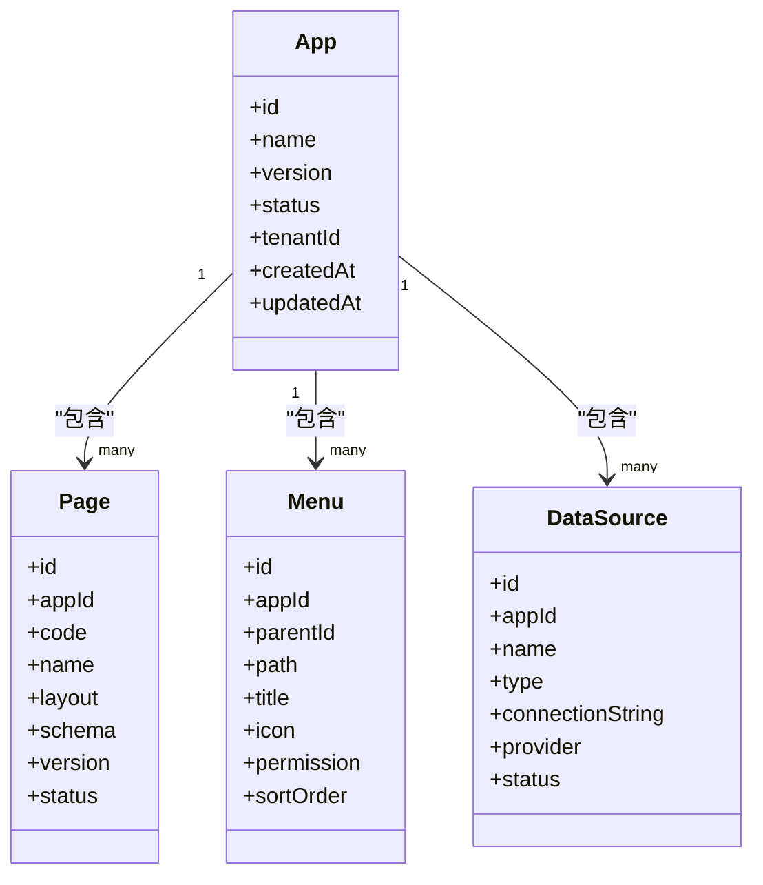

**图示来源**
- [H.LowCode.DesignEngine.Domain.csproj](file://src/LowCode/DesignEngine/H.LowCode.DesignEngine.Domain/H.LowCode.DesignEngine.Domain.csproj)

上述关系体现"应用是业务容器，页面、菜单、数据源都隶属于某个应用"。领域层只关注实体语义和不变式，例如：

- 页面必须属于一个有效应用。
- 菜单需要形成有向无环结构，避免循环引用。
- 数据源类型与连接字符串格式匹配。
- 发布态变更需要版本记录。

这些约束由领域实体或领域服务校验，而不是由 UI 或仓储直接判断。

**章节来源**
- [H.LowCode.DesignEngineBase.csproj](file://src/LowCode/DesignEngine/H.LowCode.DesignEngineBase/H.LowCode.DesignEngineBase.csproj)
- [H.LowCode.DesignEngine.Domain.csproj](file://src/LowCode/DesignEngine/H.LowCode.DesignEngine.Domain/H.LowCode.DesignEngine.Domain.csproj)

## 三层分层架构

设计引擎采用领域驱动的分层结构：

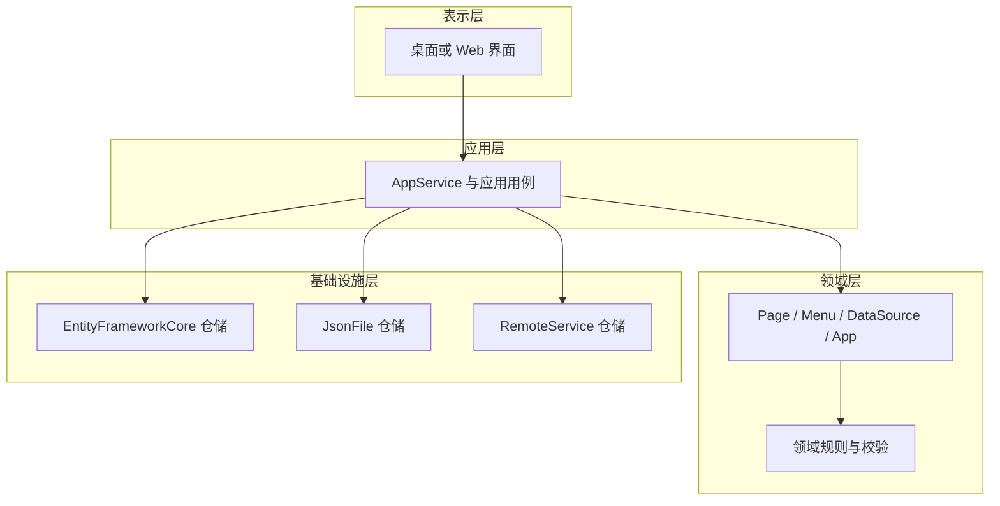

**图示来源**
- [H.LowCode.DesignEngine.Application.csproj](file://src/LowCode/DesignEngine/H.LowCode.DesignEngine.Application/H.LowCode.DesignEngine.Application.csproj)
- [H.LowCode.DesignEngine.Domain.csproj](file://src/LowCode/DesignEngine/H.LowCode.DesignEngine.Domain/H.LowCode.DesignEngine.Domain.csproj)
- [H.LowCode.DesignEngine.EntityFrameworkCore.csproj](file://src/LowCode/DesignEngine/H.LowCode.DesignEngine.EntityFrameworkCore/H.LowCode.DesignEngine.EntityFrameworkCore.csproj)
- [H.LowCode.DesignEngine.Repository.JsonFile.csproj](file://src/LowCode/DesignEngine/H.LowCode.DesignEngine.Repository.JsonFile/H.LowCode.DesignEngine.Repository.JsonFile.csproj)
- [H.LowCode.DesignEngine.Repository.RemoteService.csproj](file://src/LowCode/DesignEngine/H.LowCode.DesignEngine.Repository.RemoteService/H.LowCode.DesignEngine.Repository.RemoteService.csproj)

### 各层职责

| 层次 | 责任 | 典型产物 |
|---|---|---|
| 领域层 | 定义 Page、Menu、DataSource、App 等实体及其不变式 | 领域模型、领域枚举、领域事件 |
| 应用层 | 编排用例，如创建应用、保存页面、发布菜单、验证数据源 | AppService、DTO、命令查询对象 |
| 基础设施层 | 将领域对象持久化到不同后端 | EF Core、JsonFile、RemoteService 仓储实现 |
| 基座层 | 提供仓储接口、公共实体基类、依赖注入契约 | IPageRepository、IMenuRepository、IDataSourceRepository |

### 为什么这样分层

1. **稳定核心、灵活外围**：领域模型变化频率低于存储技术变化频率。将仓储抽象放在基座层，可以让 EF Core、JSON 文件和远程服务三种实现共存。
2. **用例清晰**：AppService 专注业务流程编排，不负责 SQL、JSON 文件读写或 HTTP 调用细节。
3. **便于测试**：单元测试可以注入内存或 JSON 仓储，集成测试再使用真实数据库或远端服务。
4. **支持多部署模式**：同一套领域和应用逻辑可在桌面、Web、独立服务中复用。

**章节来源**
- [H.LowCode.DesignEngineBase.csproj](file://src/LowCode/DesignEngine/H.LowCode.DesignEngineBase/H.LowCode.DesignEngineBase.csproj)
- [H.LowCode.DesignEngine.Domain.csproj](file://src/LowCode/DesignEngine/H.LowCode.DesignEngine.Domain/H.LowCode.DesignEngine.Domain.csproj)
- [H.LowCode.DesignEngine.Application.csproj](file://src/LowCode/DesignEngine/H.LowCode.DesignEngine.Application/H.LowCode.DesignEngine.Application.csproj)
- [H.LowCode.DesignEngine.EntityFrameworkCore.csproj](file://src/LowCode/DesignEngine/H.LowCode.DesignEngine.EntityFrameworkCore/H.LowCode.DesignEngine.EntityFrameworkCore.csproj)
- [H.LowCode.DesignEngine.Repository.JsonFile.csproj](file://src/LowCode/DesignEngine/H.LowCode.DesignEngine.Repository.JsonFile/H.LowCode.DesignEngine.Repository.JsonFile.csproj)
- [H.LowCode.DesignEngine.Repository.RemoteService.csproj](file://src/LowCode/DesignEngine/H.LowCode.DesignEngine.Repository.RemoteService/H.LowCode.DesignEngine.Repository.RemoteService.csproj)

## 仓储实现与切换机制

设计引擎至少提供三类仓储实现：

| 实现 | 适用场景 | 特点 |
|---|---|---|
| EntityFrameworkCore | 生产环境、需要事务、并发控制、SQL 查询优化 | 依赖数据库、迁移工具、DbContext |
| JsonFile | 开发调试、轻量演示、单机快速启动 | 基于本地 JSON 文件，简单但缺乏并发和复杂查询能力 |
| RemoteService | 设计引擎作为独立服务、跨进程调用 | 通过 HTTP 或远端代理访问设计引擎 API |

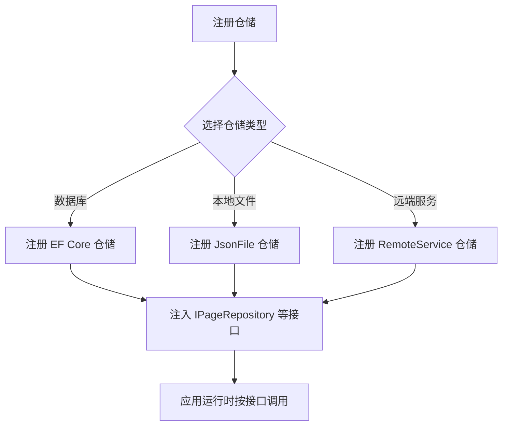

**图示来源**
- [H.LowCode.DesignEngine.EntityFrameworkCore.csproj](file://src/LowCode/DesignEngine/H.LowCode.DesignEngine.EntityFrameworkCore/H.LowCode.DesignEngine.EntityFrameworkCore.csproj)
- [H.LowCode.DesignEngine.Repository.JsonFile.csproj](file://src/LowCode/DesignEngine/H.LowCode.DesignEngine.Repository.JsonFile/H.LowCode.DesignEngine.Repository.JsonFile.csproj)
- [H.LowCode.DesignEngine.Repository.RemoteService.csproj](file://src/LowCode/DesignEngine/H.LowCode.DesignEngine.Repository.RemoteService/H.LowCode.DesignEngine.Repository.RemoteService.csproj)

### 切换方式概览

通常通过依赖注入容器注册具体仓储实现。工程层面已经按仓储类型拆分项目，因此切换仓储的关键是：

1. 引用目标仓储项目。
2. 在宿主模块或启动类中注册对应仓储。
3. 确保配置项（数据库连接串、JSON 目录、远端服务地址）正确。

对于桌面宿主，可通过 `Program.cs`、`WorkbenchApp.cs` 及 `appsettings.json` 控制行为；对于 Web 宿主，则通常在 Web 宿主模块中完成注册。

**章节来源**
- [H.LowCode.DesignEngineBase.csproj](file://src/LowCode/DesignEngine/H.LowCode.DesignEngineBase/H.LowCode.DesignEngineBase.csproj)
- [H.LowCode.DesignEngine.EntityFrameworkCore.csproj](file://src/LowCode/DesignEngine/H.LowCode.DesignEngine.EntityFrameworkCore/H.LowCode.DesignEngine.EntityFrameworkCore.csproj)
- [H.LowCode.DesignEngine.Repository.JsonFile.csproj](file://src/LowCode/DesignEngine/H.LowCode.DesignEngine.Repository.JsonFile/H.LowCode.DesignEngine.Repository.JsonFile.csproj)
- [H.LowCode.DesignEngine.Repository.RemoteService.csproj](file://src/LowCode/DesignEngine/H.LowCode.DesignEngine.Repository.RemoteService/H.LowCode.DesignEngine.Repository.RemoteService.csproj)
- [Program.cs](file://src/Host/H.AppLab.Desktop/H.AppLab.Desktop/Program.cs)
- [WorkbenchApp.cs](file://src/Host/H.AppLab.Desktop/H.AppLab.Desktop/WorkbenchApp.cs)
- [appsettings.json](file://src/Host/H.AppLab.Desktop/H.AppLab.Desktop/appsettings.json)

## 设计引擎、应用引擎与渲染引擎的边界

### 边界划分

- **设计引擎**：面向设计师和开发者，负责编辑、保存、发布应用元数据。
- **渲染引擎**：面向最终用户，负责读取已发布的页面、菜单和数据源，并渲染出实际界面。
- **应用引擎**：在 AppLab 上下文中，"应用引擎"更偏向运行时应用执行与业务用例编排；本仓库中与之最接近的是渲染引擎以及宿主中的业务服务。

三者之间的契约主要由以下内容定义：

1. **领域模型**：Page、Menu、DataSource、App 的结构。
2. **仓储接口**：应用引擎/渲染引擎通过仓储接口读取设计产物。
3. **应用契约**：DTO 和 API 契约定义请求响应格式。
4. **远程服务接口**：当设计引擎独立部署时，渲染引擎通过 RemoteService 仓储访问设计引擎。

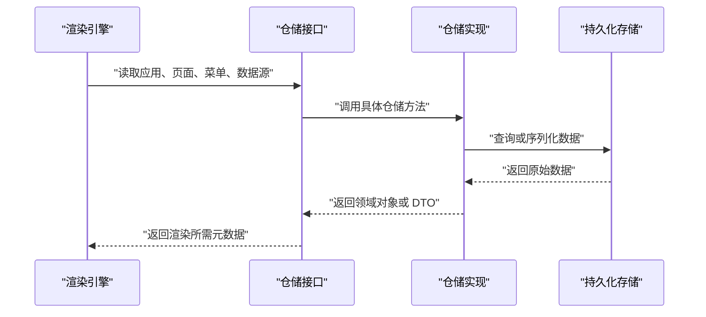

**图示来源**
- [H.LowCode.RenderEngine.Base.csproj](file://src/LowCode/RenderEngine/H.LowCode.RenderEngine.Base/H.LowCode.RenderEngine.Base.csproj)
- [H.LowCode.RenderEngine.EntityFrameworkCore.csproj](file://src/LowCode/RenderEngine/H.LowCode.RenderEngine.EntityFrameworkCore/H.LowCode.RenderEngine.EntityFrameworkCore.csproj)
- [H.LowCode.RenderEngine.Repository.JsonFile.csproj](file://src/LowCode/RenderEngine/H.LowCode.RenderEngine.Repository.JsonFile/H.LowCode.RenderEngine.Repository.JsonFile.csproj)
- [H.LowCode.RenderEngine.Repository.RemoteService.csproj](file://src/LowCode/RenderEngine/H.LowCode.RenderEngine.Repository.RemoteService/H.LowCode.RenderEngine.Repository.RemoteService.csproj)

### 设计引擎与渲染引擎的依赖方向

设计引擎定义元数据结构，渲染引擎消费这些结构。因此依赖方向是：

- 渲染引擎依赖设计引擎的应用契约或领域契约。
- 设计引擎不应反向依赖渲染引擎。
- 两者可共用基座层或公共契约项目，避免耦合具体实现。

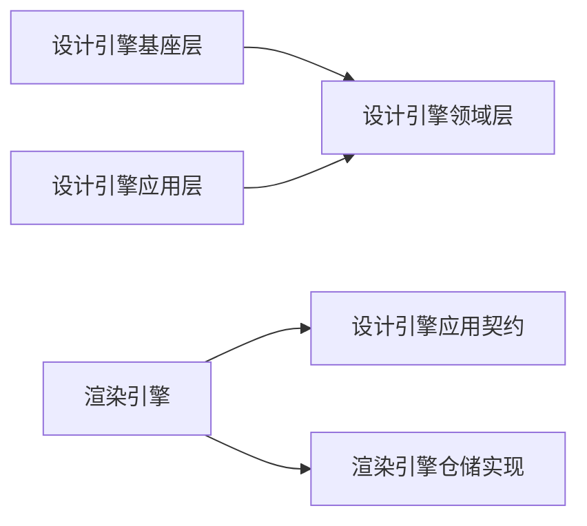

**图示来源**
- [H.LowCode.DesignEngineBase.csproj](file://src/LowCode/DesignEngine/H.LowCode.DesignEngineBase/H.LowCode.DesignEngineBase.csproj)
- [H.LowCode.DesignEngine.Domain.csproj](file://src/LowCode/DesignEngine/H.LowCode.DesignEngine.Domain/H.LowCode.DesignEngine.Domain.csproj)
- [H.LowCode.DesignEngine.Application.Contracts.csproj](file://src/LowCode/DesignEngine/H.LowCode.DesignEngine.Application.Contracts/H.LowCode.DesignEngine.Application.Contracts.csproj)
- [H.LowCode.RenderEngine.Base.csproj](file://src/LowCode/RenderEngine/H.LowCode.RenderEngine.Base/H.LowCode.RenderEngine.Base.csproj)

**章节来源**
- [H.LowCode.DesignEngineBase.csproj](file://src/LowCode/DesignEngine/H.LowCode.DesignEngineBase/H.LowCode.DesignEngineBase.csproj)
- [H.LowCode.DesignEngine.Domain.csproj](file://src/LowCode/DesignEngine/H.LowCode.DesignEngine.Domain/H.LowCode.DesignEngine.Domain.csproj)
- [H.LowCode.DesignEngine.Application.Contracts.csproj](file://src/LowCode/DesignEngine/H.LowCode.DesignEngine.Application.Contracts/H.LowCode.DesignEngine.Application.Contracts.csproj)
- [H.LowCode.RenderEngine.Base.csproj](file://src/LowCode/RenderEngine/H.LowCode.RenderEngine.Base/H.LowCode.RenderEngine.Base.csproj)
- [H.LowCode.RenderEngine.EntityFrameworkCore.csproj](file://src/LowCode/RenderEngine/H.LowCode.RenderEngine.EntityFrameworkCore/H.LowCode.RenderEngine.EntityFrameworkCore.csproj)
- [H.LowCode.RenderEngine.Repository.JsonFile.csproj](file://src/LowCode/RenderEngine/H.LowCode.RenderEngine.Repository.JsonFile/H.LowCode.RenderEngine.Repository.JsonFile.csproj)
- [H.LowCode.RenderEngine.Repository.RemoteService.csproj](file://src/LowCode/RenderEngine/H.LowCode.RenderEngine.Repository.RemoteService/H.LowCode.RenderEngine.Repository.RemoteService.csproj)

## 单体部署与按服务独立部署

### 单体部署

在单体模式下，设计引擎、渲染引擎、Web 或桌面宿主运行在同一进程内。优点是：

- 配置简单，无需网络调用。
- 适合内部低代码平台、单租户或少量租户场景。
- 开发体验好，修改设计后可以直接在宿主中查看效果。

典型宿主包括：

- `H.AppLab.Web.Host`：Web 宿主。
- `H.AppLab.Desktop`：桌面宿主。

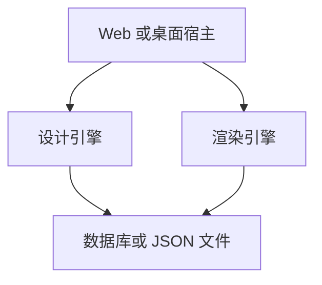

**图示来源**
- [H.AppLab.Web.Host.csproj](file://src/Host/H.AppLab.Web.Host/H.AppLab.Web.Host/H.AppLab.Web.Host.csproj)
- [H.AppLab.Desktop.csproj](file://src/Host/H.AppLab.Desktop/H.AppLab.Desktop/H.AppLab.Desktop.csproj)

### 独立服务部署

在独立服务模式中，设计引擎单独部署为服务，渲染引擎通过 RemoteService 仓储访问设计引擎。优点是：

- 设计引擎可独立扩缩容。
- 多个渲染实例共享同一个设计中心。
- 更适合多租户、多环境、多团队协作。

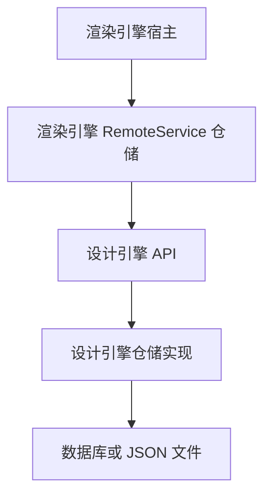

**图示来源**
- [H.LowCode.RenderEngine.Repository.RemoteService.csproj](file://src/LowCode/RenderEngine/H.LowCode.RenderEngine.Repository.RemoteService/H.LowCode.RenderEngine.Repository.RemoteService.csproj)
- [H.LowCode.DesignEngine.Repository.RemoteService.csproj](file://src/LowCode/DesignEngine/H.LowCode.DesignEngine.Repository.RemoteService/H.LowCode.DesignEngine.Repository.RemoteService.csproj)
- [H.LowCode.RenderEngine.Host.csproj](file://src/Host/RenderEngine/H.LowCode.RenderEngine.Host/H.LowCode.RenderEngine.Host.csproj)

**章节来源**
- [H.AppLab.Web.Host.csproj](file://src/Host/H.AppLab.Web.Host/H.AppLab.Web.Host/H.AppLab.Web.Host.csproj)
- [H.AppLab.Desktop.csproj](file://src/Host/H.AppLab.Desktop/H.AppLab.Desktop/H.AppLab.Desktop.csproj)
- [H.LowCode.RenderEngine.Repository.RemoteService.csproj](file://src/LowCode/RenderEngine/H.LowCode.RenderEngine.Repository.RemoteService/H.LowCode.RenderEngine.Repository.RemoteService.csproj)
- [H.LowCode.DesignEngine.Repository.RemoteService.csproj](file://src/LowCode/DesignEngine/H.LowCode.DesignEngine.Repository.RemoteService/H.LowCode.DesignEngine.Repository.RemoteService.csproj)
- [H.LowCode.RenderEngine.Host.csproj](file://src/Host/RenderEngine/H.LowCode.RenderEngine.Host/H.LowCode.RenderEngine.Host.csproj)

## 扩展新仓储的实现步骤

假设要新增一个仓储实现，例如 `H.LowCode.DesignEngine.Repository.MyStore`，可按以下步骤进行：

1. **明确仓储接口**：确认需要实现的接口来自 `H.LowCode.DesignEngineBase`，例如 `IPageRepository`、`IMenuRepository`、`IDataSourceRepository`。
2. **新建仓储项目**：参考现有仓储项目结构，新增 `H.LowCode.DesignEngine.Repository.MyStore` 工程。
3. **实现仓储类**：实现基座层定义的仓储接口，并在内部封装 MyStore 客户端、SDK 或自定义存储逻辑。
4. **注册依赖注入**：在宿主或模块中注册 MyStore 仓储为具体实现。
5. **配置连接信息**：将数据库连接串、API 地址、认证信息等放入配置文件，并通过配置对象注入仓储。
6. **验证领域模型映射**：确保领域实体与持久化结构一致，必要时编写测试覆盖关键用例。
7. **更新宿主选择逻辑**：在桌面或 Web 宿主中提供配置开关，让用户选择 JsonFile、EF Core、RemoteService 或新仓储。

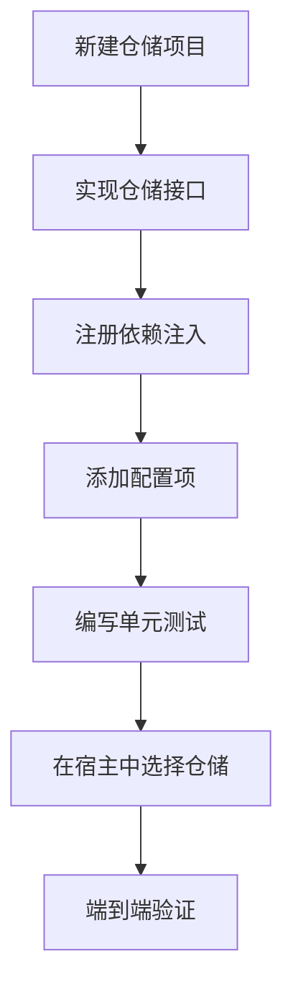

**图示来源**
- [H.LowCode.DesignEngineBase.csproj](file://src/LowCode/DesignEngine/H.LowCode.DesignEngineBase/H.LowCode.DesignEngineBase.csproj)
- [H.LowCode.DesignEngine.Repository.JsonFile.csproj](file://src/LowCode/DesignEngine/H.LowCode.DesignEngine.Repository.JsonFile/H.LowCode.DesignEngine.Repository.JsonFile.csproj)
- [H.LowCode.DesignEngine.Repository.RemoteService.csproj](file://src/LowCode/DesignEngine/H.LowCode.DesignEngine.Repository.RemoteService/H.LowCode.DesignEngine.Repository.RemoteService.csproj)

**章节来源**
- [H.LowCode.DesignEngineBase.csproj](file://src/LowCode/DesignEngine/H.LowCode.DesignEngineBase/H.LowCode.DesignEngineBase.csproj)
- [H.LowCode.DesignEngine.Repository.JsonFile.csproj](file://src/LowCode/DesignEngine/H.LowCode.DesignEngine.Repository.JsonFile/H.LowCode.DesignEngine.Repository.JsonFile.csproj)
- [H.LowCode.DesignEngine.Repository.RemoteService.csproj](file://src/LowCode/DesignEngine/H.LowCode.DesignEngine.Repository.RemoteService/H.LowCode.DesignEngine.Repository.RemoteService.csproj)

## 依赖关系分析

从项目依赖角度看，设计引擎遵循"上层依赖下层、基础设施对接口编程"的原则：

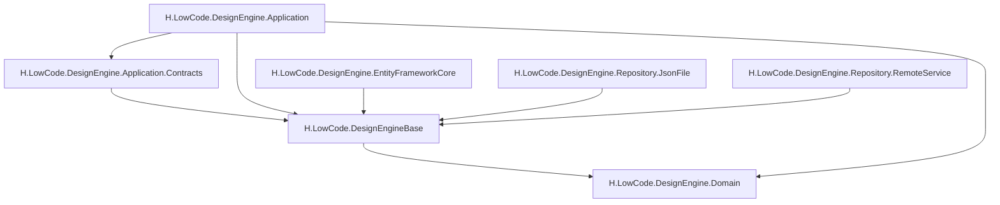

**图示来源**
- [H.LowCode.DesignEngineBase.csproj](file://src/LowCode/DesignEngine/H.LowCode.DesignEngineBase/H.LowCode.DesignEngineBase.csproj)
- [H.LowCode.DesignEngine.Domain.csproj](file://src/LowCode/DesignEngine/H.LowCode.DesignEngine.Domain/H.LowCode.DesignEngine.Domain.csproj)
- [H.LowCode.DesignEngine.Application.Contracts.csproj](file://src/LowCode/DesignEngine/H.LowCode.DesignEngine.Application.Contracts/H.LowCode.DesignEngine.Application.Contracts.csproj)
- [H.LowCode.DesignEngine.Application.csproj](file://src/LowCode/DesignEngine/H.LowCode.DesignEngine.Application/H.LowCode.DesignEngine.Application.csproj)
- [H.LowCode.DesignEngine.EntityFrameworkCore.csproj](file://src/LowCode/DesignEngine/H.LowCode.DesignEngine.EntityFrameworkCore/H.LowCode.DesignEngine.EntityFrameworkCore.csproj)
- [H.LowCode.DesignEngine.Repository.JsonFile.csproj](file://src/LowCode/DesignEngine/H.LowCode.DesignEngine.Repository.JsonFile/H.LowCode.DesignEngine.Repository.JsonFile.csproj)
- [H.LowCode.DesignEngine.Repository.RemoteService.csproj](file://src/LowCode/DesignEngine/H.LowCode.DesignEngine.Repository.RemoteService/H.LowCode.DesignEngine.Repository.RemoteService.csproj)

### 依赖方向约束

- 领域层不依赖应用层、基础设施层。
- 应用层不直接依赖 EF Core、JSON 文件或 HTTP 客户端的具体实现，而是依赖基座层仓储接口。
- 仓储实现只依赖基座层接口和自身基础设施。
- 渲染引擎依赖设计引擎的应用契约，而不直接依赖设计引擎的基础设施实现。

这种约束降低了耦合度，也便于替换存储、增加新的宿主形态。

**章节来源**
- [H.LowCode.DesignEngineBase.csproj](file://src/LowCode/DesignEngine/H.LowCode.DesignEngineBase/H.LowCode.DesignEngineBase.csproj)
- [H.LowCode.DesignEngine.Domain.csproj](file://src/LowCode/DesignEngine/H.LowCode.DesignEngine.Domain/H.LowCode.DesignEngine.Domain.csproj)
- [H.LowCode.DesignEngine.Application.Contracts.csproj](file://src/LowCode/DesignEngine/H.LowCode.DesignEngine.Application.Contracts/H.LowCode.DesignEngine.Application.Contracts.csproj)
- [H.LowCode.DesignEngine.Application.csproj](file://src/LowCode/DesignEngine/H.LowCode.DesignEngine.Application/H.LowCode.DesignEngine.Application.csproj)
- [H.LowCode.DesignEngine.EntityFrameworkCore.csproj](file://src/LowCode/DesignEngine/H.LowCode.DesignEngine.EntityFrameworkCore/H.LowCode.DesignEngine.EntityFrameworkCore.csproj)
- [H.LowCode.DesignEngine.Repository.JsonFile.csproj](file://src/LowCode/DesignEngine/H.LowCode.DesignEngine.Repository.JsonFile/H.LowCode.DesignEngine.Repository.JsonFile.csproj)
- [H.LowCode.DesignEngine.Repository.RemoteService.csproj](file://src/LowCode/DesignEngine/H.LowCode.DesignEngine.Repository.RemoteService/H.LowCode.DesignEngine.Repository.RemoteService.csproj)

## 基础设施层增强：浏览器会话池与工作区解析器

除了传统的仓储实现外，Agent/Workbench 模块还引入了两类重要的基础设施组件：BrowserSessionPool（浏览器会话池）和 GitWorkspaceResolver（工作区路径解析器），用于支撑浏览器自动化任务和工作区管理。

### BrowserSessionPool：Playwright 浏览器实例的连接池管理

`BrowserSessionPool` 是一个单例服务，负责管理 Playwright 浏览器实例的生命周期和会话隔离。它的核心价值体现在两个方面：

1. **跨工具调用的会话持久化**：由于 ToolRegistry 每次注册都会用 `ActivatorUtilities.CreateInstance` 新建工具实例，如果将会话状态保存在工具字段里，下次调用时就会丢失。BrowserSessionPool 作为单例，确保浏览器进程能够跨越多次工具调用存活。

2. **会话隔离与并发控制**：宿主允许 `MaxConcurrentRuns` 路并发执行，如果所有员工共用"当前页面"，两个执行会互相把对方的页面踩掉。BrowserSessionPool 通过 sessionId 隔离会话，每个会话拥有独立的 `IBrowserContext` 和 `IPage`。

#### 核心特性

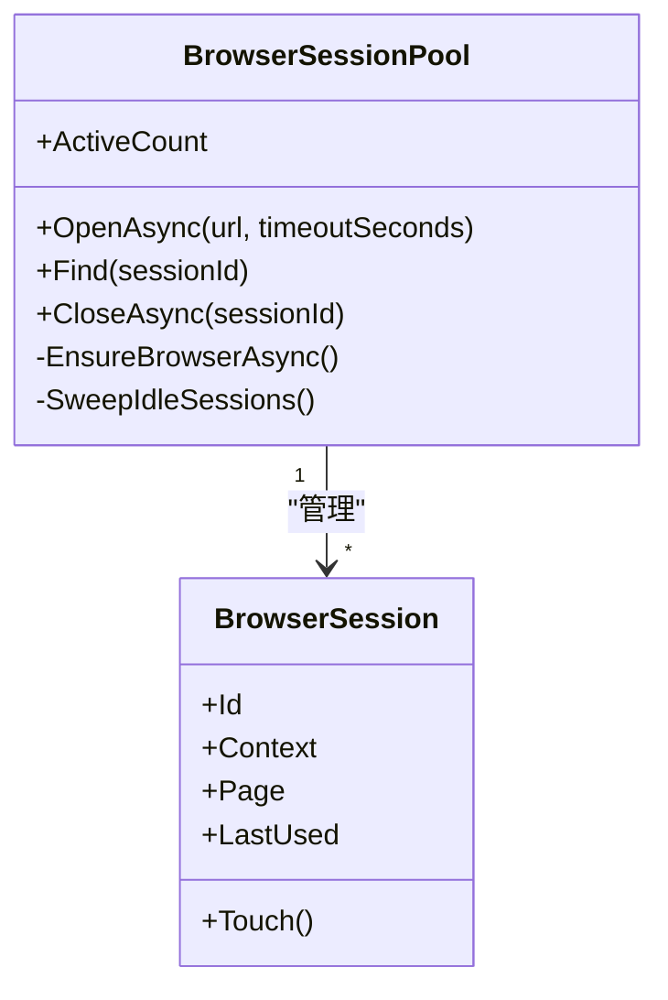

**图示来源**
- [BrowserSessionPool.cs:1-194](file://src/Agent/Workbench/H.Workbench.Core/Tools/Internal/BrowserSessionPool.cs#L1-L194)

**关键实现细节：**

- **浏览器启动策略**：优先尝试系统已安装的 Chrome/Edge，都没有时回落到 Playwright 自带 Chromium。启动失败时会给出明确的错误提示和安装建议。
- **会话限制**：通过 `_options.Browser.MaxSessions` 配置最大并发会话数，超出时抛出异常并提示用户关闭不用的会话。
- **空闲回收**：定期扫描空闲超时的会话（默认 30 秒），自动释放资源。
- **线程安全**：使用 `SemaphoreSlim` 保护浏览器创建过程，使用 `ConcurrentDictionary` 管理会话集合。

**章节来源**
- [BrowserSessionPool.cs:1-194](file://src/Agent/Workbench/H.Workbench.Core/Tools/Internal/BrowserSessionPool.cs#L1-L194)
- [WorkbenchCoreModule.cs:35](file://src/Agent/Workbench/H.Workbench.Core/WorkbenchCoreModule.cs#L35)
- [BrowserTool.cs:1-200](file://src/Agent/Workbench/H.Workbench.Core/Tools/BrowserTool.cs#L1-L200)

### GitWorkspaceResolver：工作区路径的安全解析

`GitWorkspaceResolver` 负责将仓库 URL 或目录名统一解析到 WorkDir 内的物理目录，并强制实施多重安全护栏：

#### 核心安全机制

1. **禁止路径逃逸**：拒绝 `..`、绝对路径、符号链接逃逸，确保所有操作都在 WorkDir 范围内。
2. **目录名派生算法**：从仓库 URL 派生出唯一的目录名（host-org-repo + 短 hash），避免碰撞。
3. **符号链接检测**：通过 `FileAttributes.ReparsePoint` 检测符号链接，出于安全考虑拒绝访问。
4. **.git 目录保护**：禁止访问 `.git` 目录内部，防止误操作破坏版本控制元数据。

#### 路径解析流程

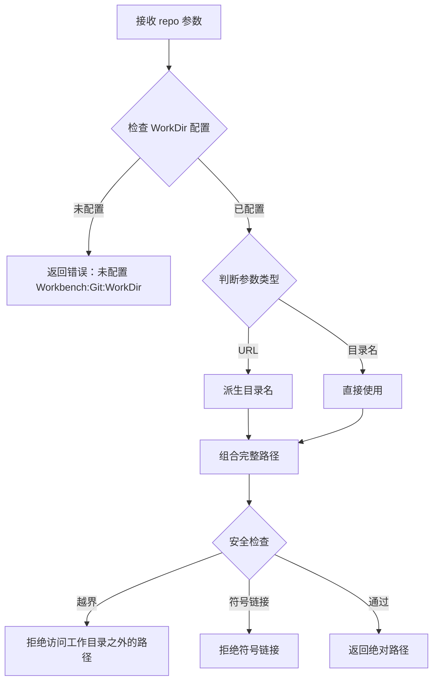

**图示来源**
- [GitWorkspaceResolver.cs:1-277](file://src/Agent/Workbench/H.Workbench.Core/Tools/Internal/GitWorkspaceResolver.cs#L1-L277)

**关键实现细节：**

- **目录名派生**：从 URL 中提取 host、org、repo 部分，去除 `.git` 后缀，经过 sanitize 处理后拼接，最后附加 SHA256 短 hash（8 位）防碰撞。
- **输出路径解析**：支持两种模式——给定 repo 时落在仓库副本内，未给定时落在 WorkDir 的 outputs 目录。两种情况都强制留在 WorkDir 内。
- **相对路径解析**：`TryResolveInRepo` 方法确保相对路径不会越出仓库目录，同时禁止访问 `.git` 目录内部。

**章节来源**
- [GitWorkspaceResolver.cs:1-277](file://src/Agent/Workbench/H.Workbench.Core/Tools/Internal/GitWorkspaceResolver.cs#L1-L277)

### GitWorkspaceLocks：仓库写操作的串行化锁

`GitWorkspaceLocks` 是一个按仓库目录串行的写操作锁，防止同一工作副本被并发 clone/pull/commit 破坏。它是单例注入，只读命令（status/log）无需加锁。

**核心特性：**

- 使用 `ConcurrentDictionary<string, SemaphoreSlim>` 为每个仓库目录维护独立的信号量。
- `AcquireAsync` 方法返回 `IDisposable`，通过 using 语句自动释放锁。
- 路径规范化：使用 `Path.GetFullPath` 确保相同目录的不同表示形式映射到同一个锁。

**章节来源**
- [GitWorkspaceLocks.cs:1-26](file://src/Agent/Workbench/H.Workbench.Core/Tools/Internal/GitWorkspaceLocks.cs#L1-L26)
- [WorkbenchCoreModule.cs:36](file://src/Agent/Workbench/H.Workbench.Core/WorkbenchCoreModule.cs#L36)

### 依赖注入注册

在 `WorkbenchCoreModule` 中，这些基础设施组件被注册为单例：

```csharp
context.Services.AddSingleton<Tools.Internal.BrowserSessionPool>();
context.Services.AddSingleton<Tools.Internal.GitWorkspaceLocks>();
```

**章节来源**
- [WorkbenchCoreModule.cs:35-36](file://src/Agent/Workbench/H.Workbench.Core/WorkbenchCoreModule.cs#L35-L36)

## 性能与可维护性考量

### 性能特性

| 仓储实现 | 优势 | 风险 |
|---|---|---|
| EF Core | 支持索引、分页、事务、复杂查询 | 需要合理设计 DbContext、查询和迁移 |
| JsonFile | 零依赖、启动快、适合演示 | 并发写入不安全，不适合高并发生产 |
| RemoteService | 支持横向扩展、与存储解耦 | 网络延迟、序列化开销、可用性依赖设计引擎服务 |

### 浏览器自动化性能优化

BrowserSessionPool 引入的性能优化措施：

1. **浏览器实例复用**：避免每次工具调用都重新启动浏览器进程，显著降低启动开销。
2. **会话隔离**：通过独立的 `IBrowserContext` 实现会话隔离，避免并发执行时的相互干扰。
3. **空闲回收**：自动清理长时间未使用的会话，释放内存和系统资源。
4. **启动降级策略**：优先使用系统浏览器，减少 Playwright 内置浏览器的下载和启动开销。

### 可维护性建议

1. **仓储接口保持稳定**：不要频繁修改 `IPageRepository`、`IMenuRepository`、`IDataSourceRepository` 等方法签名。
2. **领域模型演进要有版本策略**：页面 schema、菜单结构、数据源配置应支持向后兼容。
3. **应用层保持薄**：AppService 只做用例编排，不要把持久化细节下沉到领域层。
4. **配置集中管理**：仓储选择、连接串、远端地址应集中在配置文件中。
5. **测试分层**：领域层做单元测试，仓储实现做集成测试，UI 做端到端测试。
6. **浏览器会话管理**：合理配置 `MaxSessions` 和 `IdleTimeoutSeconds`，避免资源泄漏。
7. **工作区路径安全**：始终使用 `GitWorkspaceResolver` 解析路径，不要手动拼接路径字符串。

## 故障排查要点

常见问题和定位思路如下：

| 现象 | 可能原因 | 排查方向 |
|---|---|---|
| 页面无法保存 | 仓储未正确注册或参数错误 | 检查依赖注入注册和配置项 |
| 菜单为空 | 菜单未关联应用或排序字段异常 | 检查领域模型关系和菜单树构建逻辑 |
| 数据源连接失败 | 连接串格式错误或提供者不支持 | 检查数据源类型、连接字符串和 Provider |
| 渲染引擎读不到设计产物 | 设计引擎未启动或远端地址错误 | 检查 RemoteService 配置和网络连通性 |
| 单体模式下渲染与设计不同步 | 缓存或未刷新 | 检查渲染引擎缓存、发布流程和刷新触发点 |
| 浏览器会话打开失败 | 浏览器未安装或 Playwright 未下载 | 检查系统是否安装 Chrome/Edge，或执行 `dotnet playwright install chromium` |
| 并发浏览器会话超限 | 达到 MaxSessions 上限 | 检查是否有未关闭的会话，调用 BrowserCloseAsync 释放 |
| 工作区路径访问被拒 | 路径越出 WorkDir 或是符号链接 | 检查 repo 参数是否正确，确认路径在工作目录内 |
| 仓库目录不存在 | 尚未克隆或目录名派生错误 | 先调用 GitCloneAsync 或 GitListReposAsync 查看可用仓库 |

**章节来源**
- [Program.cs](file://src/Host/H.AppLab.Desktop/H.AppLab.Desktop/Program.cs)
- [WorkbenchApp.cs](file://src/Host/H.AppLab.Desktop/H.AppLab.Desktop/WorkbenchApp.cs)
- [appsettings.json](file://src/Host/H.AppLab.Desktop/H.AppLab.Desktop/appsettings.json)
- [BrowserSessionPool.cs:120-130](file://src/Agent/Workbench/H.Workbench.Core/Tools/Internal/BrowserSessionPool.cs#L120-L130)
- [GitWorkspaceResolver.cs:30-50](file://src/Agent/Workbench/H.Workbench.Core/Tools/Internal/GitWorkspaceResolver.cs#L30-L50)

## 结论

AppLab 设计引擎通过 `H.LowCode.DesignEngineBase` 暴露仓储接口，通过 `H.LowCode.DesignEngine.Domain` 定义 Page、Menu、DataSource、App 等核心领域模型，再通过应用层 AppService 编排用例，最后由 EF Core、JsonFile、RemoteService 等多种仓储实现支撑持久化。这种分层与插件化设计使得：

- 领域模型稳定且可测试。
- 存储实现可替换且可扩展。
- 设计引擎既可嵌入桌面和 Web 宿主，也可独立部署供渲染引擎调用。
- 单体部署与微服务部署共享同一套领域与应用逻辑，降低重复实现成本。

此外，Agent/Workbench 模块引入的 BrowserSessionPool 和 GitWorkspaceResolver 进一步增强了基础设施层的能力：

- **BrowserSessionPool** 通过连接池管理和会话隔离，提升了浏览器自动化任务的性能和可靠性。
- **GitWorkspaceResolver** 通过严格的路径安全护栏，确保了工作区操作的安全性。
- **GitWorkspaceLocks** 通过细粒度的仓库级锁，防止了并发写操作的数据竞争。

在实际工程中，扩展新仓储时应优先完善仓储接口契约、领域模型映射和配置注入，再根据部署模式选择合适的宿主装配方式。同时，合理使用浏览器会话池和工作区解析器，可以显著提升系统的性能和安全性。