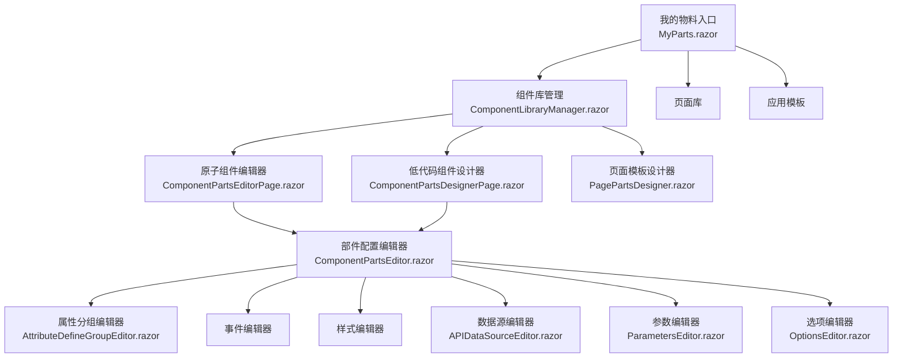
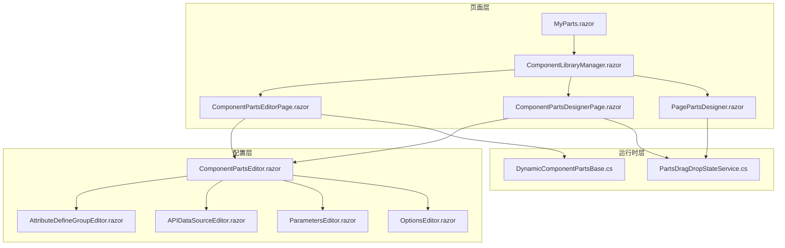
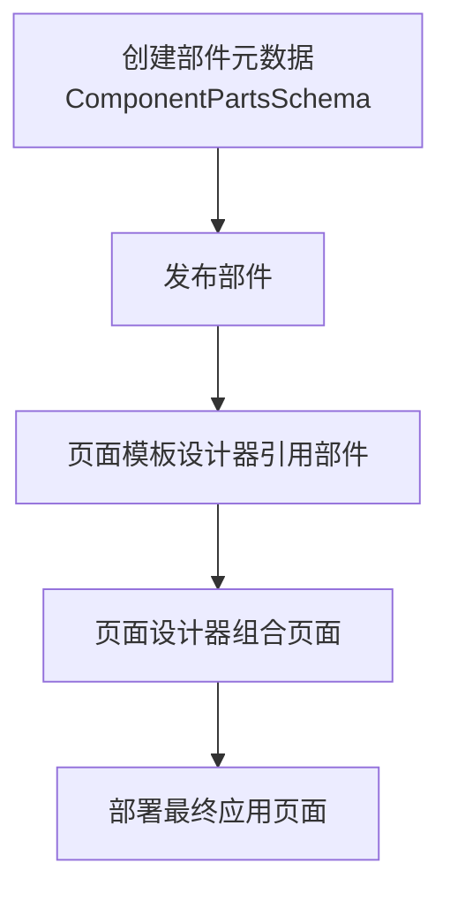
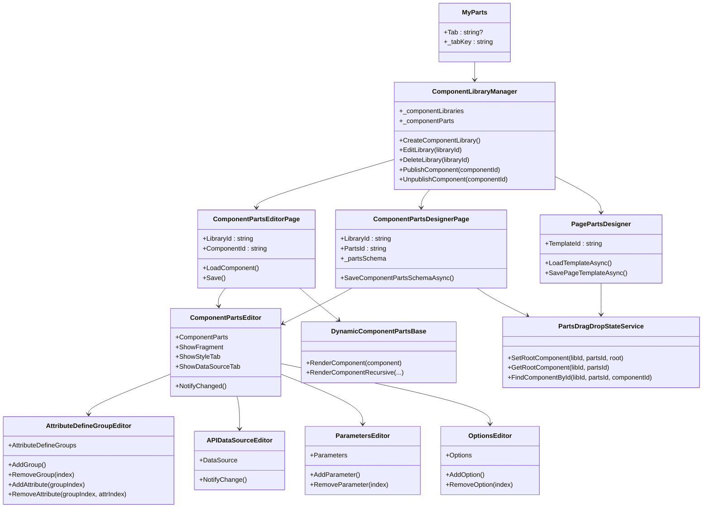
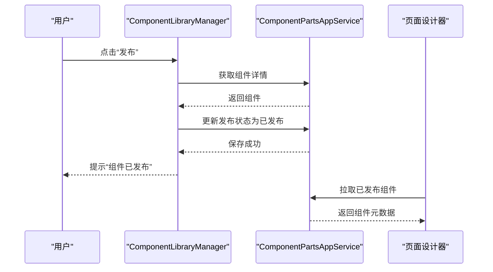

# 部件设计器

<cite>
**本文引用的文件**   
- [MyParts.razor](file://src/LowCode/DesignEngine/H.LowCode.PartsDesignEngine/Pages/MyParts.razor)
- [ComponentLibraryManager.razor](file://src/LowCode/DesignEngine/H.LowCode.PartsDesignEngine/Pages/ComponentParts/ComponentLibraryManager.razor)
- [ComponentPartsDesignerPage.razor](file://src/LowCode/DesignEngine/H.LowCode.PartsDesignEngine/Pages/ComponentParts/ComponentPartsDesignerPage.razor)
- [ComponentPartsEditorPage.razor](file://src/LowCode/DesignEngine/H.LowCode.PartsDesignEngine/Pages/ComponentParts/ComponentPartsEditorPage.razor)
- [PagePartsDesigner.razor](file://src/LowCode/DesignEngine/H.LowCode.PartsDesignEngine/Pages/PageParts/PagePartsDesigner.razor)
- [ComponentPartsEditor.razor](file://src/LowCode/DesignEngine/H.LowCode.PartsDesignEngine/Pages/ComponentParts/Components/ComponentPartsEditor.razor)
- [AttributeDefineGroupEditor.razor](file://src/LowCode/DesignEngine/H.LowCode.PartsDesignEngine/Pages/ComponentParts/Components/AttributeDefineGroupEditor.razor)
- [APIDataSourceEditor.razor](file://src/LowCode/DesignEngine/H.LowCode.PartsDesignEngine/Pages/ComponentParts/Components/APIDataSourceEditor.razor)
- [ParametersEditor.razor](file://src/LowCode/DesignEngine/H.LowCode.PartsDesignEngine/Pages/ComponentParts/Components/ParametersEditor.razor)
- [OptionsEditor.razor](file://src/LowCode/DesignEngine/H.LowCode.PartsDesignEngine/Pages/ComponentParts/Components/OptionsEditor.razor)
- [DynamicComponentPartsBase.cs](file://src/LowCode/DesignEngine/H.LowCode.PartsDesignEngine/Services/DynamicComponentPartsBase.cs)
- [PartsDragDropStateService.cs](file://src/LowCode/DesignEngine/H.LowCode.PartsDesignEngine/Services/PartsDragDropStateService.cs)
</cite>

## 目录
1. [引言](#引言)
2. [项目结构](#项目结构)
3. [核心组件](#核心组件)
4. [架构总览](#架构总览)
5. [详细组件分析](#详细组件分析)
6. [依赖关系分析](#依赖关系分析)
7. [性能与稳定性](#性能与稳定性)
8. [故障排查](#故障排查)
9. [从零创建自定义组件部件示例](#从零创建自定义组件部件示例)
10. [版本管理与发布流程](#版本管理与发布流程)
11. [结论](#结论)

## 引言
本文件面向“部件设计器”，即 H.LowCode.PartsDesignEngine 中与“页面设计器”并列的部件（Fragment、组件库条目、页面模板）编辑能力。其核心目标是：让开发者定义可复用的部件元数据，并在页面设计器中引用这些部件进行组合。

关键区分：
- 页面设计器：面向最终应用页面，用于编排页面级组件树、布局和业务页面逻辑。
- 部件设计器：面向可复用单元，包括原子 Fragment、低代码组件、页面模板等；产出的是“部件元数据”，而不是最终页面本身。

## 项目结构
部件设计器的前端界面集中在 `H.LowCode.PartsDesignEngine` 下，主要路径如下：
- `/devhome/myparts/{Tab}`：我的物料入口页，包含“组件库”“页面库”“应用模板”三个标签。
- 组件库管理：`Pages/ComponentParts/ComponentLibraryManager.razor`。
- 原子组件编辑器：`Pages/ComponentParts/ComponentPartsEditorPage.razor`。
- 低代码组件设计器：`Pages/ComponentParts/ComponentPartsDesignerPage.razor`。
- 页面模板设计器：`Pages/PageParts/PagePartsDesigner.razor`。
- 通用部件配置编辑器：`Pages/ComponentParts/Components/ComponentPartsEditor.razor`。
- 属性、事件、样式、数据源、参数、选项等子编辑器位于同目录下。
- 运行时动态渲染基类与服务：`Services/DynamicComponentPartsBase.cs`、`Services/PartsDragDropStateService.cs`。

**图示来源**
- [MyParts.razor:1-47](file://src/LowCode/DesignEngine/H.LowCode.PartsDesignEngine/Pages/MyParts.razor#L1-L47)
- [ComponentLibraryManager.razor:1-552](file://src/LowCode/DesignEngine/H.LowCode.PartsDesignEngine/Pages/ComponentParts/ComponentLibraryManager.razor#L1-L552)
- [ComponentPartsEditorPage.razor:1-263](file://src/LowCode/DesignEngine/H.LowCode.PartsDesignEngine/Pages/ComponentParts/ComponentPartsEditorPage.razor#L1-L263)
- [ComponentPartsDesignerPage.razor:1-260](file://src/LowCode/DesignEngine/H.LowCode.PartsDesignEngine/Pages/ComponentParts/ComponentPartsDesignerPage.razor#L1-L260)
- [PagePartsDesigner.razor:1-156](file://src/LowCode/DesignEngine/H.LowCode.PartsDesignEngine/Pages/PageParts/PagePartsDesigner.razor#L1-L156)
- [ComponentPartsEditor.razor:1-312](file://src/LowCode/DesignEngine/H.LowCode.PartsDesignEngine/Pages/ComponentParts/Components/ComponentPartsEditor.razor#L1-L312)
- [AttributeDefineGroupEditor.razor:1-289](file://src/LowCode/DesignEngine/H.LowCode.PartsDesignEngine/Pages/ComponentParts/Components/AttributeDefineGroupEditor.razor#L1-L289)
- [APIDataSourceEditor.razor:1-78](file://src/LowCode/DesignEngine/H.LowCode.PartsDesignEngine/Pages/ComponentParts/Components/APIDataSourceEditor.razor#L1-L78)
- [ParametersEditor.razor:1-104](file://src/LowCode/DesignEngine/H.LowCode.PartsDesignEngine/Pages/ComponentParts/Components/ParametersEditor.razor#L1-L104)
- [OptionsEditor.razor:1-94](file://src/LowCode/DesignEngine/H.LowCode.PartsDesignEngine/Pages/ComponentParts/Components/OptionsEditor.razor#L1-L94)

**章节来源**
- [MyParts.razor:1-47](file://src/LowCode/DesignEngine/H.LowCode.PartsDesignEngine/Pages/MyParts.razor#L1-L47)

## 核心组件
- **MyParts.razor**：我的物料导航入口，按 Tab 切换“组件库”“页面库”“应用模板”。
- **ComponentLibraryManager.razor**：组件库列表与组件卡片管理，负责新建/编辑/删除组件库、新建/编辑/删除/发布/取消发布组件、搜索过滤和跳转。
- **ComponentPartsEditorPage.razor**：原子组件编辑器页面，加载组件后使用 `ComponentPartsEditor` 编辑元数据，并右侧实时预览。
- **ComponentPartsDesignerPage.razor**：低代码组件设计器页面，左侧可视化设计面板 + 底部“低代码组件属性”编辑区，支持保存、预览占位、AI 草稿。
- **PagePartsDesigner.razor**：页面模板设计器，将模板组件树注册到拖拽状态服务，再交由页面设计面板编排。
- **ComponentPartsEditor.razor**：通用部件配置编辑器，聚合基本信息、属性分组、事件、样式、数据源、参数、选项等编辑项。
- **DynamicComponentPartsBase.cs**：在部件设计器中根据部件 Fragment 元数据动态渲染待编辑或预览的组件片段。
- **PartsDragDropStateService.cs**：跨组件共享拖拽状态，如根组件、当前拖拽项、上次悬停项、选中项等。

**章节来源**
- [ComponentLibraryManager.razor:1-552](file://src/LowCode/DesignEngine/H.LowCode.PartsDesignEngine/Pages/ComponentParts/ComponentLibraryManager.razor#L1-L552)
- [ComponentPartsEditorPage.razor:1-263](file://src/LowCode/DesignEngine/H.LowCode.PartsDesignEngine/Pages/ComponentParts/ComponentPartsEditorPage.razor#L1-L263)
- [ComponentPartsDesignerPage.razor:1-260](file://src/LowCode/DesignEngine/H.LowCode.PartsDesignEngine/Pages/ComponentParts/ComponentPartsDesignerPage.razor#L1-L260)
- [PagePartsDesigner.razor:1-156](file://src/LowCode/DesignEngine/H.LowCode.PartsDesignEngine/Pages/PageParts/PagePartsDesigner.razor#L1-L156)
- [ComponentPartsEditor.razor:1-312](file://src/LowCode/DesignEngine/H.LowCode.PartsDesignEngine/Pages/ComponentParts/Components/ComponentPartsEditor.razor#L1-L312)
- [DynamicComponentPartsBase.cs:1-200](file://src/LowCode/DesignEngine/H.LowCode.PartsDesignEngine/Services/DynamicComponentPartsBase.cs#L1-L200)
- [PartsDragDropStateService.cs:1-200](file://src/LowCode/DesignEngine/H.LowCode.PartsDesignEngine/Services/PartsDragDropStateService.cs#L1-L200)

## 架构总览
部件设计器由三层组成：
- 页面层：路由与布局，承载“我的物料”“组件库”“组件编辑器”“组件设计器”“页面模板设计器”。
- 配置层：`ComponentPartsEditor` 及其子编辑器维护 `ComponentPartsSchema` 元数据。
- 运行时层：`DynamicComponentPartsBase` 根据 Fragment 元数据动态渲染组件；`PartsDragDropStateService` 提供拖拽状态。

**图示来源**
- [MyParts.razor:1-47](file://src/LowCode/DesignEngine/H.LowCode.PartsDesignEngine/Pages/MyParts.razor#L1-L47)
- [ComponentLibraryManager.razor:1-552](file://src/LowCode/DesignEngine/H.LowCode.PartsDesignEngine/Pages/ComponentParts/ComponentLibraryManager.razor#L1-L552)
- [ComponentPartsEditorPage.razor:1-263](file://src/LowCode/DesignEngine/H.LowCode.PartsDesignEngine/Pages/ComponentParts/ComponentPartsEditorPage.razor#L1-L263)
- [ComponentPartsDesignerPage.razor:1-260](file://src/LowCode/DesignEngine/H.LowCode.PartsDesignEngine/Pages/ComponentParts/ComponentPartsDesignerPage.razor#L1-L260)
- [PagePartsDesigner.razor:1-156](file://src/LowCode/DesignEngine/H.LowCode.PartsDesignEngine/Pages/PageParts/PagePartsDesigner.razor#L1-L156)
- [ComponentPartsEditor.razor:1-312](file://src/LowCode/DesignEngine/H.LowCode.PartsDesignEngine/Pages/ComponentParts/Components/ComponentPartsEditor.razor#L1-L312)
- [DynamicComponentPartsBase.cs:1-200](file://src/LowCode/DesignEngine/H.LowCode.PartsDesignEngine/Services/DynamicComponentPartsBase.cs#L1-L200)
- [PartsDragDropStateService.cs:1-200](file://src/LowCode/DesignEngine/H.LowCode.PartsDesignEngine/Services/PartsDragDropStateService.cs#L1-L200)

## 详细组件分析

### 页面与部件的区别
- 页面设计器：编排最终页面，关注页面布局、业务页面级交互、页面模板等。
- 部件设计器：产出可复用的部件元数据，包括：
  - 原子 Fragment：描述一个具体控件的外观、属性、事件、样式和数据源。
  - 低代码组件：由多个部件组成的可复用组件，通过可视化设计器编排。
  - 页面模板：一组部件构成的页面骨架，供页面设计器引用。

因此，“部件”是页面设计器的上游资产；页面设计器消费这些部件，而不是直接生产它们。

**章节来源**
- [PagePartsDesigner.razor:1-156](file://src/LowCode/DesignEngine/H.LowCode.PartsDesignEngine/Pages/PageParts/PagePartsDesigner.razor#L1-L156)

### 页面职责划分

#### 组件库管理：ComponentLibraryManager.razor
职责：
- 加载并展示组件库列表，支持新增、编辑、删除组件库。
- 选择组件库后，加载该库下的组件卡片列表。
- 对组件执行新增、编辑信息、设计、删除、发布、取消发布等操作。
- 根据组件类型跳转到不同页面：
  - 原子组件 → `/devhome/myparts/component/edit/{libraryId}/{componentId}`
  - 低代码组件 → `/devhome/myparts/component/designer/{libraryId}/{partsId}`
- 通过 `ComponentLibraryAppService` 和 `ComponentPartsAppService` 访问后端。

关键点：
- 组件库下拉菜单采用固定定位，避免滚动容器影响。
- 组件卡片显示类型、是否容器、是否支持数据源、发布状态、修改时间。
- 发布状态为 0 时显示“发布”“删除”，已发布时显示“取消发布”。

**章节来源**
- [ComponentLibraryManager.razor:1-552](file://src/LowCode/DesignEngine/H.LowCode.PartsDesignEngine/Pages/ComponentParts/ComponentLibraryManager.razor#L1-L552)

#### 组件片段编辑：ComponentPartsEditorPage.razor
职责：
- 路由 `/devhome/myparts/component/edit/{LibraryId}/{ComponentId}`。
- 调用 `IComponentPartsAppService.GetByIdAsync` 加载组件元数据。
- 左侧使用 `ComponentPartsEditor` 编辑组件元数据。
- 右侧使用 `ComponentPartsPreview` 实时预览。
- 支持 AI 生成草稿，用户确认后手动保存。
- 保存时设置 `LibraryId` 并调用 `SaveAsync`。

行为要点：
- 参数变化时重新加载组件。
- 编辑器变更触发预览刷新。
- 保存失败时提示错误。

**章节来源**
- [ComponentPartsEditorPage.razor:1-263](file://src/LowCode/DesignEngine/H.LowCode.PartsDesignEngine/Pages/ComponentParts/ComponentPartsEditorPage.razor#L1-L263)

#### 页面模板设计：PagePartsDesigner.razor
职责：
- 路由 `/devhome/myparts/page/designer/{TemplateId}`。
- 加载页面模板，并将模板组件树包装成根节点，注册到 `PartsDragDropStateService`。
- 使用 `ComponentPanel` 和 `PageDesignPanel` 完成页面模板可视化编排。
- 保存时将拖拽状态中的根组件树回写至模板。

特殊点：
- 使用虚拟组件库 Id `__pagetpl__` 作为拖拽状态 Key，隔离页面模板与组件库。
- 模板为空或无组件时阻止保存并提示。

**章节来源**
- [PagePartsDesigner.razor:1-156](file://src/LowCode/DesignEngine/H.LowCode.PartsDesignEngine/Pages/PageParts/PagePartsDesigner.razor#L1-L156)

#### 低代码组件设计：ComponentPartsDesignerPage.razor
职责：
- 路由 `/devhome/myparts/component/designer/{LibraryId}/{PartsId}`。
- 加载低代码组件元数据，确保 `Childrens` 非空。
- 左侧顶部为可视化设计面板，下方为“低代码组件属性”编辑区。
- 使用 `ComponentPartsEditor` 编辑基础属性、属性分组、事件、样式、数据源等。
- 支持保存、预览占位、AI 生成草稿。

校验与保存：
- 校验 `PartsId` 和 `Name`。
- 设置 `LibraryId`、`PartsId`、`ModifiedTime`。
- 调用 `ComponentPartsAppService.SaveAsync`。

**章节来源**
- [ComponentPartsDesignerPage.razor:1-260](file://src/LowCode/DesignEngine/H.LowCode.PartsDesignEngine/Pages/ComponentParts/ComponentPartsDesignerPage.razor#L1-L260)

### ComponentPartsEditor.razor：部件元数据编辑中枢
`ComponentPartsEditor` 是部件配置的核心表单，承担以下职责：
- 基本信息：`PartsId`、`Label`、组件类型、排序、版本、是否容器、是否支持数据源、隐藏标签、描述、基础样式。
- 属性分组：委托给 `AttributeDefineGroupEditor`。
- 事件定义：委托给 `EventDefineEditor`。
- 样式定义：委托给 `StyleDefineEditor`。
- 数据源：委托给 `ComponentDataSourceEditor`，其中 API 数据源由 `APIDataSourceEditor` 编辑。
- 参数与选项：分别由 `ParametersEditor` 和 `OptionsEditor` 编辑。
- 片段编辑：当需要渲染 Fragment 时，使用 `ComponentFragmentEditor`。

重要参数：
- `ShowFragment`：是否显示渲染 Fragment 编辑。
- `ShowStyleTab`：是否显示样式定义标签页。
- `ShowDataSourceTab`：是否显示数据源标签页。
- `ShowActions`：是否显示底部保存/取消操作区。
- `ShowComponentType`：是否显示组件类型单选。

变更传播：
- 内部所有编辑项变更后，通过 `NotifyChanged` 同时触发 `ComponentPartsChanged` 和 `OnChanged`。
- 外部预览组件监听 `OnChanged` 刷新预览。

类型保护：
- 若用户选择“低代码组件”，会弹出提示并阻止切换，因为低代码组件应使用设计器拖拽编排。

**章节来源**
- [ComponentPartsEditor.razor:1-312](file://src/LowCode/DesignEngine/H.LowCode.PartsDesignEngine/Pages/ComponentParts/Components/ComponentPartsEditor.razor#L1-L312)

### 属性定义编辑：AttributeDefineGroupEditor.razor
职责：
- 管理 `ComponentPartsAttributeDefineGroupSchema` 列表。
- 支持添加/删除属性分组。
- 每个分组内支持添加/删除属性定义。
- 属性定义包含：名称、显示名称、CLR 类型、控件类型、必填、默认值、描述。
- 对特定控件类型提供扩展配置：
  - 下拉、单选、多选：通过 `FixedOptionDataSourceEditor` 编辑选项。
  - 表格：支持数组项类型、最大项数、对象结构的 JSON Schema。

数据结构复杂度：
- 外层分组为 `IEnumerable<ComponentPartsAttributeDefineGroupSchema>`。
- 每个分组内属性定义为数组 `ComponentPartsAttributeDefineSchema[]`。
- 数组型属性通过 `Options` 字典存储额外配置。

**章节来源**
- [AttributeDefineGroupEditor.razor:1-289](file://src/LowCode/DesignEngine/H.LowCode.PartsDesignEngine/Pages/ComponentParts/Components/AttributeDefineGroupEditor.razor#L1-L289)

### 事件定义编辑：FragmentEventEditor / EventDefineEditor
- `ComponentPartsEditor` 中将事件定义委托给 `EventDefineEditor`。
- 仓库中存在 `FragmentEventEditor.razor` 文件，但读取为空内容，说明该文件在当前快照中未实现或为空占位。
- 实际事件编辑功能应以 `EventDefineEditor` 为准。

建议：
- 若需统一命名，可将事件编辑器命名为 `FragmentEventEditor` 或明确区分“部件事件编辑器”与“片段事件编辑器”。

**章节来源**
- [ComponentPartsEditor.razor:1-312](file://src/LowCode/DesignEngine/H.LowCode.PartsDesignEngine/Pages/ComponentParts/Components/ComponentPartsEditor.razor#L1-L312)

### 样式定义编辑：FragmentStyleEditor / StyleDefineEditor
- `ComponentPartsEditor` 中将样式定义委托给 `StyleDefineEditor`。
- 仓库中存在 `FragmentStyleEditor.razor` 文件，但读取为空内容。
- 实际样式编辑功能应由 `StyleDefineEditor` 实现。

**章节来源**
- [ComponentPartsEditor.razor:1-312](file://src/LowCode/DesignEngine/H.LowCode.PartsDesignEngine/Pages/ComponentParts/Components/ComponentPartsEditor.razor#L1-L312)

### API 数据源编辑：APIDataSourceEditor.razor
职责：
- 编辑 `APIDataSourceSchema`。
- 支持配置 API 地址、请求方法、请求头、查询参数、请求体。
- 使用 `APIParamsList` 编辑请求头和查询参数。
- 初始化缺失字段：Method、Headers、Queries、Body。

适用场景：
- 适用于非容器组件的数据源配置。
- 在 `ComponentPartsEditor` 中通过 `ComponentDataSourceEditor` 被调用。

**章节来源**
- [APIDataSourceEditor.razor:1-78](file://src/LowCode/DesignEngine/H.LowCode.PartsDesignEngine/Pages/ComponentParts/Components/APIDataSourceEditor.razor#L1-L78)

### 参数编辑：ParametersEditor.razor
职责：
- 编辑键值对字典 `Dictionary<string, string>`。
- 支持添加、删除、修改参数键和值。
- 忽略空键，仅提交有效参数。

用途：
- 可用于组件运行时参数、数据源附加参数、选项扩展参数等。

**章节来源**
- [ParametersEditor.razor:1-104](file://src/LowCode/DesignEngine/H.LowCode.PartsDesignEngine/Pages/ComponentParts/Components/ParametersEditor.razor#L1-L104)

### 选项编辑：OptionsEditor.razor
职责：
- 编辑键值对字典 `Dictionary<string, object>`。
- 将对象值转为字符串进行编辑。
- 支持添加、删除选项。

用途：
- 常用于下拉、单选、多选等属性的选项配置。
- 与 `AttributeDefineGroupEditor` 中的表格、下拉、单选、多选控件联动。

**章节来源**
- [OptionsEditor.razor:1-94](file://src/LowCode/DesignEngine/H.LowCode.PartsDesignEngine/Pages/ComponentParts/Components/OptionsEditor.razor#L1-L94)

### DynamicComponentPartsBase：动态渲染待编辑组件片段
作用：
- 继承自 `LowCodeDynamicComponentBase`。
- 根据 `ComponentPartsSchema` 和 `ComponentPartsFragmentSchema` 动态渲染组件。
- 支持原生 HTML 元素片段和 .NET 组件片段。
- 递归渲染属性、子片段、内容、数据源。

关键逻辑：
- 若 Fragment 的 `TypeName` 为空，则使用 `DefaultTypeName`。
- 若无法解析组件类型，跳过渲染以避免崩溃。
- 原生 HTML 片段支持资源挂载占位、属性合并、内容覆盖、拖拽容器注入。
- 对于支持数据源的组件，渲染数据源插槽；否则渲染子片段或文本内容。

注意事项：
- 这是运行时渲染基类，主要用于预览和设计时的动态渲染，而非静态编译期组件。

**章节来源**
- [DynamicComponentPartsBase.cs:1-200](file://src/LowCode/DesignEngine/H.LowCode.PartsDesignEngine/Services/DynamicComponentPartsBase.cs#L1-L200)

### PartsDragDropStateService：拖拽状态服务
作用：
- 提供进程内全局状态，按 `libId-partsId` 键组织拖拽状态。
- 暴露根组件、最后选中组件、当前拖拽组件、上次悬停组件、上次放置组件、上次悬停时间等。
- 提供查找组件、重置拖拽样式等方法。

与部件设计器的关系：
- 页面模板设计器将模板根组件注册为该服务的根组件。
- 组件设计器和页面设计器在拖拽过程中读写该状态，以同步高亮、动画、选中态。

复杂度：
- 查找组件使用递归遍历，最坏情况 O(N)。
- 状态存取使用字典缓存，平均 O(1)。

**章节来源**
- [PartsDragDropStateService.cs:1-200](file://src/LowCode/DesignEngine/H.LowCode.PartsDesignEngine/Services/PartsDragDropStateService.cs#L1-L200)

### 部件与页面的关系
- 部件产出 `ComponentPartsSchema`，描述 Fragment、属性、事件、样式、数据源、参数、选项。
- 页面设计器消费这些部件，将其组合为页面模板或页面实例。
- 页面模板设计器本身也属于“部件”的一种：它是一组部件构成的页面骨架。

**图示来源**
- [ComponentLibraryManager.razor:1-552](file://src/LowCode/DesignEngine/H.LowCode.PartsDesignEngine/Pages/ComponentParts/ComponentLibraryManager.razor#L1-L552)
- [PagePartsDesigner.razor:1-156](file://src/LowCode/DesignEngine/H.LowCode.PartsDesignEngine/Pages/PageParts/PagePartsDesigner.razor#L1-L156)

## 依赖关系分析

**图示来源**
- [MyParts.razor:1-47](file://src/LowCode/DesignEngine/H.LowCode.PartsDesignEngine/Pages/MyParts.razor#L1-L47)
- [ComponentLibraryManager.razor:1-552](file://src/LowCode/DesignEngine/H.LowCode.PartsDesignEngine/Pages/ComponentParts/ComponentLibraryManager.razor#L1-L552)
- [ComponentPartsEditorPage.razor:1-263](file://src/LowCode/DesignEngine/H.LowCode.PartsDesignEngine/Pages/ComponentParts/ComponentPartsEditorPage.razor#L1-L263)
- [ComponentPartsDesignerPage.razor:1-260](file://src/LowCode/DesignEngine/H.LowCode.PartsDesignEngine/Pages/ComponentParts/ComponentPartsDesignerPage.razor#L1-L260)
- [PagePartsDesigner.razor:1-156](file://src/LowCode/DesignEngine/H.LowCode.PartsDesignEngine/Pages/PageParts/PagePartsDesigner.razor#L1-L156)
- [ComponentPartsEditor.razor:1-312](file://src/LowCode/DesignEngine/H.LowCode.PartsDesignEngine/Pages/ComponentParts/Components/ComponentPartsEditor.razor#L1-L312)
- [AttributeDefineGroupEditor.razor:1-289](file://src/LowCode/DesignEngine/H.LowCode.PartsDesignEngine/Pages/ComponentParts/Components/AttributeDefineGroupEditor.razor#L1-L289)
- [APIDataSourceEditor.razor:1-78](file://src/LowCode/DesignEngine/H.LowCode.PartsDesignEngine/Pages/ComponentParts/Components/APIDataSourceEditor.razor#L1-L78)
- [ParametersEditor.razor:1-104](file://src/LowCode/DesignEngine/H.LowCode.PartsDesignEngine/Pages/ComponentParts/Components/ParametersEditor.razor#L1-L104)
- [OptionsEditor.razor:1-94](file://src/LowCode/DesignEngine/H.LowCode.PartsDesignEngine/Pages/ComponentParts/Components/OptionsEditor.razor#L1-L94)
- [DynamicComponentPartsBase.cs:1-200](file://src/LowCode/DesignEngine/H.LowCode.PartsDesignEngine/Services/DynamicComponentPartsBase.cs#L1-L200)
- [PartsDragDropStateService.cs:1-200](file://src/LowCode/DesignEngine/H.LowCode.PartsDesignEngine/Services/PartsDragDropStateService.cs#L1-L200)

## 性能与稳定性
- 动态渲染：`DynamicComponentPartsBase` 在无法解析组件类型时跳过渲染，避免整页崩溃，适合设计器预览场景。
- 拖拽状态：`PartsDragDropStateService` 使用字典缓存状态，避免重复计算；查找组件为递归遍历，建议在大型组件树中注意性能。
- 编辑器变更传播：`ComponentPartsEditor` 每次变更都会触发两个回调，外部预览组件应避免过度重渲染。
- 数据源编辑器：API 数据源编辑器初始化缺失字段，减少空引用风险。
- 组件类型保护：选择低代码组件时给出提示，防止误用原子组件编辑器。

[本节为通用指导，不直接分析具体文件]

## 故障排查
常见问题与建议：
- 组件不存在：`ComponentPartsEditorPage` 和 `ComponentPartsDesignerPage` 在加载失败时会提示并返回上一页。
- 页面模板为空：`PagePartsDesigner` 在保存前检查组件数量，为空时提示先添加组件。
- 缺少 Fragment 或 TypeName：`DynamicComponentPartsBase` 会在运行时抛出空引用异常，需检查部件元数据是否完整。
- 事件编辑器与样式编辑器文件为空：当前快照中 `FragmentEventEditor.razor` 和 `FragmentStyleEditor.razor` 为空，实际编辑功能应参考 `EventDefineEditor` 和 `StyleDefineEditor`。
- 发布状态异常：组件发布/取消发布后应重新加载组件列表，确保 UI 与后端一致。

**章节来源**
- [ComponentPartsEditorPage.razor:1-263](file://src/LowCode/DesignEngine/H.LowCode.PartsDesignEngine/Pages/ComponentParts/ComponentPartsEditorPage.razor#L1-L263)
- [ComponentPartsDesignerPage.razor:1-260](file://src/LowCode/DesignEngine/H.LowCode.PartsDesignEngine/Pages/ComponentParts/ComponentPartsDesignerPage.razor#L1-L260)
- [PagePartsDesigner.razor:1-156](file://src/LowCode/DesignEngine/H.LowCode.PartsDesignEngine/Pages/PageParts/PagePartsDesigner.razor#L1-L156)
- [DynamicComponentPartsBase.cs:1-200](file://src/LowCode/DesignEngine/H.LowCode.PartsDesignEngine/Services/DynamicComponentPartsBase.cs#L1-L200)
- [ComponentLibraryManager.razor:1-552](file://src/LowCode/DesignEngine/H.LowCode.PartsDesignEngine/Pages/ComponentParts/ComponentLibraryManager.razor#L1-L552)

## 从零创建自定义组件部件示例

### 步骤一：创建组件库
1. 打开“我的物料”入口页 `/devhome/myparts`。
2. 切换到“组件库”标签。
3. 点击“+ 新建”创建组件库。
4. 填写组件库名称、标识、描述后保存。

**章节来源**
- [MyParts.razor:1-47](file://src/LowCode/DesignEngine/H.LowCode.PartsDesignEngine/Pages/MyParts.razor#L1-L47)
- [ComponentLibraryManager.razor:1-552](file://src/LowCode/DesignEngine/H.LowCode.PartsDesignEngine/Pages/ComponentParts/ComponentLibraryManager.razor#L1-L552)

### 步骤二：创建自定义组件
1. 在组件库中选择目标库。
2. 点击“+ 新建组件”。
3. 选择组件类型：
   - 原子组件：进入 `ComponentPartsEditorPage`。
   - 低代码组件：进入 `ComponentPartsDesignerPage`。
4. 填写组件 ID、显示名称、版本、描述等基本信息。

**章节来源**
- [ComponentLibraryManager.razor:1-552](file://src/LowCode/DesignEngine/H.LowCode.PartsDesignEngine/Pages/ComponentParts/ComponentLibraryManager.razor#L1-L552)

### 步骤三：定义属性
1. 打开“属性”标签。
2. 添加属性分组，例如“基础属性”。
3. 添加属性项，填写名称、显示名称、CLR 类型、控件类型、必填、默认值。
4. 若控件类型为下拉、单选、多选，配置选项。
5. 若控件类型为表格，配置数组项类型、最大项数和对象结构。

**章节来源**
- [ComponentPartsEditor.razor:1-312](file://src/LowCode/DesignEngine/H.LowCode.PartsDesignEngine/Pages/ComponentParts/Components/ComponentPartsEditor.razor#L1-L312)
- [AttributeDefineGroupEditor.razor:1-289](file://src/LowCode/DesignEngine/H.LowCode.PartsDesignEngine/Pages/ComponentParts/Components/AttributeDefineGroupEditor.razor#L1-L289)

### 步骤四：定义事件
1. 打开“事件”标签。
2. 使用 `EventDefineEditor` 添加事件定义。
3. 若需要，补充事件参数和说明。

**章节来源**
- [ComponentPartsEditor.razor:1-312](file://src/LowCode/DesignEngine/H.LowCode.PartsDesignEngine/Pages/ComponentParts/Components/ComponentPartsEditor.razor#L1-L312)

### 步骤五：定义样式
1. 打开“样式”标签。
2. 使用 `StyleDefineEditor` 添加样式定义。
3. 配置样式键名、默认值、说明。

**章节来源**
- [ComponentPartsEditor.razor:1-312](file://src/LowCode/DesignEngine/H.LowCode.PartsDesignEngine/Pages/ComponentParts/Components/ComponentPartsEditor.razor#L1-L312)

### 步骤六：配置 API 数据源
1. 打开“数据源”标签。
2. 选择 API 数据源。
3. 配置 API 地址、请求方法、请求头、查询参数、请求体。
4. 若组件支持数据源，确保 `IsSupportDataSource` 为真。

**章节来源**
- [ComponentPartsEditor.razor:1-312](file://src/LowCode/DesignEngine/H.LowCode.PartsDesignEngine/Pages/ComponentParts/Components/ComponentPartsEditor.razor#L1-L312)
- [APIDataSourceEditor.razor:1-78](file://src/LowCode/DesignEngine/H.LowCode.PartsDesignEngine/Pages/ComponentParts/Components/APIDataSourceEditor.razor#L1-L78)

### 步骤七：配置参数与选项
1. 使用 `ParametersEditor` 添加键值对参数。
2. 使用 `OptionsEditor` 添加键值对选项。
3. 将参数和选项绑定到属性、数据源或控件配置中。

**章节来源**
- [ParametersEditor.razor:1-104](file://src/LowCode/DesignEngine/H.LowCode.PartsDesignEngine/Pages/ComponentParts/Components/ParametersEditor.razor#L1-L104)
- [OptionsEditor.razor:1-94](file://src/LowCode/DesignEngine/H.LowCode.PartsDesignEngine/Pages/ComponentParts/Components/OptionsEditor.razor#L1-L94)

### 步骤八：预览与保存
1. 在原子组件编辑器中，右侧实时预览组件。
2. 点击“刷新预览”确认渲染结果。
3. 点击“保存”保存组件元数据。
4. 发布组件，使其可在页面设计器中使用。

**章节来源**
- [ComponentPartsEditorPage.razor:1-263](file://src/LowCode/DesignEngine/H.LowCode.PartsDesignEngine/Pages/ComponentParts/ComponentPartsEditorPage.razor#L1-L263)
- [ComponentLibraryManager.razor:1-552](file://src/LowCode/DesignEngine/H.LowCode.PartsDesignEngine/Pages/ComponentParts/ComponentLibraryManager.razor#L1-L552)

### 步骤九：在页面设计器中拖拽使用
1. 打开页面模板设计器或页面设计器。
2. 从组件面板拖拽已发布的组件到页面。
3. 在属性面板中设置组件属性、事件、数据源。
4. 保存页面模板或页面。

**章节来源**
- [PagePartsDesigner.razor:1-156](file://src/LowCode/DesignEngine/H.LowCode.PartsDesignEngine/Pages/PageParts/PagePartsDesigner.razor#L1-L156)

## 版本管理与发布流程

### 版本字段
- 部件元数据包含 `Version` 字段，由用户在“基本信息”标签中填写。
- 该字段用于标识部件版本，便于后续兼容性和追溯。

**章节来源**
- [ComponentPartsEditor.razor:1-312](file://src/LowCode/DesignEngine/H.LowCode.PartsDesignEngine/Pages/ComponentParts/Components/ComponentPartsEditor.razor#L1-L312)

### 发布流程
1. 编辑完成后，在组件库中点击“发布”。
2. 后端将组件的 `PublishStatus` 设为 1。
3. 组件列表中显示“已发布”。
4. 页面设计器可以引用已发布组件。

### 取消发布
1. 对已发布组件点击“取消发布”。
2. 后端将 `PublishStatus` 设为 0。
3. 组件列表中显示“待发布”。

### 删除组件
- 仅对未发布组件提供删除按钮。
- 删除后重新加载组件列表。

**图示来源**
- [ComponentLibraryManager.razor:1-552](file://src/LowCode/DesignEngine/H.LowCode.PartsDesignEngine/Pages/ComponentParts/ComponentLibraryManager.razor#L1-L552)

**章节来源**
- [ComponentLibraryManager.razor:1-552](file://src/LowCode/DesignEngine/H.LowCode.PartsDesignEngine/Pages/ComponentParts/ComponentLibraryManager.razor#L1-L552)

## 结论
部件设计器是低代码平台中连接“可复用部件”与“页面编排”的关键环节。它通过 `ComponentPartsSchema` 描述部件的外观、行为和数据契约，并通过 `DynamicComponentPartsBase` 在设计器中进行动态渲染验证。`ComponentLibraryManager`、`ComponentPartsEditorPage`、`ComponentPartsDesignerPage`、`PagePartsDesigner` 共同构成完整的部件生命周期：创建、编辑、设计、预览、发布、引用。

实践中应优先关注：
- 属性、事件、样式定义的完整性。
- API 数据源配置的准确性。
- 版本字段的规范性。
- 发布状态的可见性与可控性。
- 页面设计器对已发布部件的稳定引用。