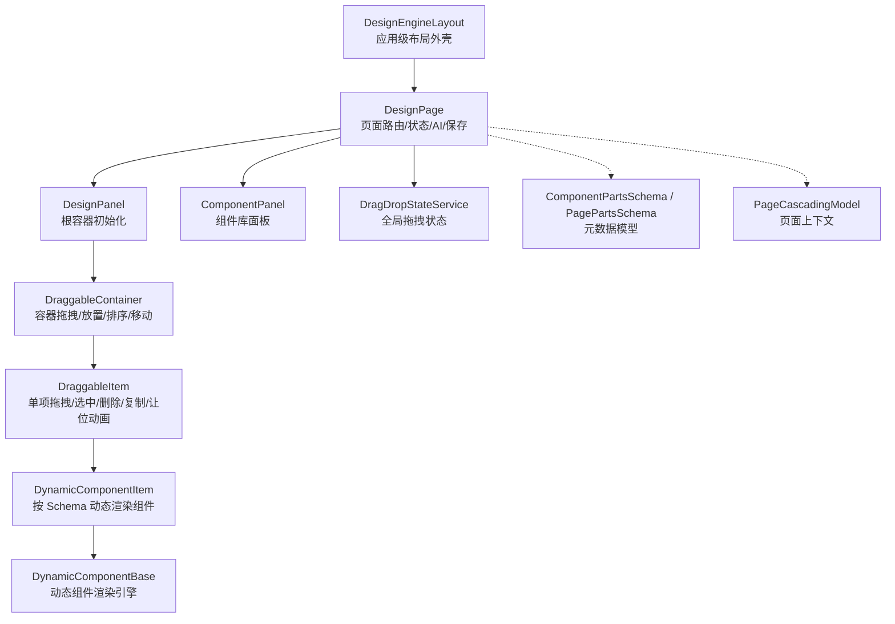
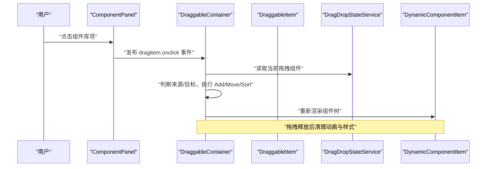
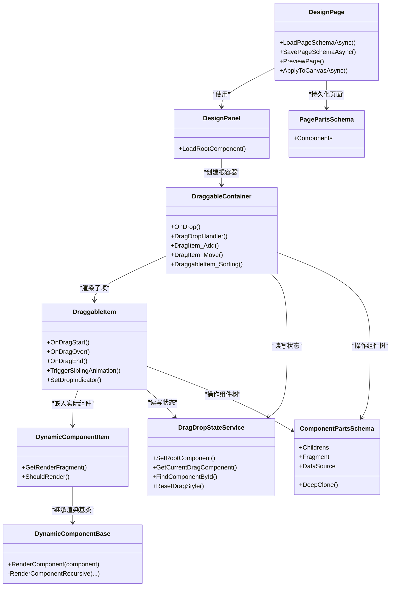
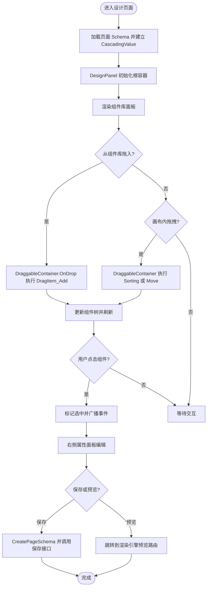
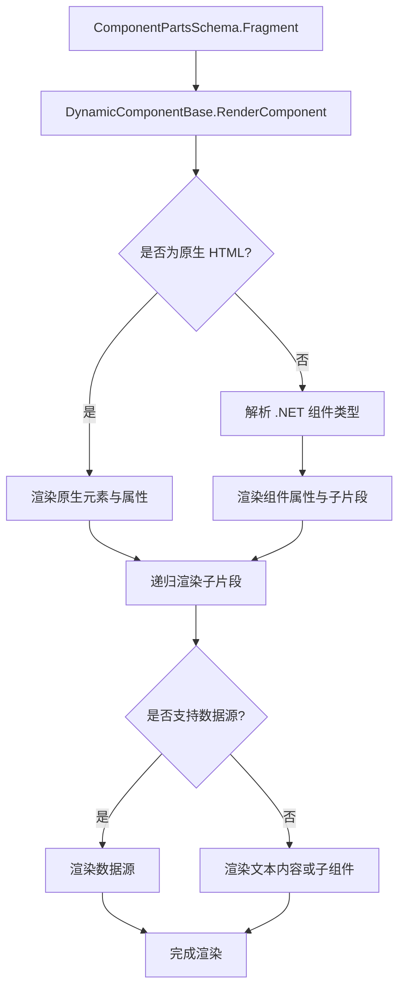

# 页面设计器

<cite>
**本文引用的文件**   
- [DesignEngineLayout.razor](file://src/LowCode/DesignEngine/H.LowCode.DesignEngine/Layout/DesignEngineLayout.razor)
- [DesignPage.razor](file://src/LowCode/DesignEngine/H.LowCode.DesignEngine/Pages/DesignPage.razor)
- [DesignPanel.razor](file://src/LowCode/DesignEngine/H.LowCode.DesignEngine/DesignPanel/DesignPanel.razor)
- [DraggableContainer.razor](file://src/LowCode/DesignEngine/H.LowCode.DesignEngine/DraggableComponents/DraggableContainer.razor)
- [DraggableItem.razor](file://src/LowCode/DesignEngine/H.LowCode.DesignEngine/DraggableComponents/DraggableItem.razor)
- [DynamicComponentItem.razor](file://src/LowCode/DesignEngine/H.LowCode.DesignEngine/DraggableComponents/DynamicComponentItem.razor)
- [ComponentPanel.razor](file://src/LowCode/DesignEngine/H.LowCode.DesignEngine/ComponentPanel/ComponentPanel.razor)
- [DragDropStateService.cs](file://src/LowCode/DesignEngine/H.LowCode.DesignEngine/Services/DragDropStateService.cs)
- [DynamicComponentBase.cs](file://src/LowCode/DesignEngine/H.LowCode.DesignEngine/Services/DynamicComponentBase.cs)
- [ComponentPartsSchema.cs](file://src/LowCode/Common/H.LowCode.MetaSchema.DesignEngine/ComponentPartsSchema.cs)
- [PagePartsSchema.cs](file://src/LowCode/Common/H.LowCode.MetaSchema.DesignEngine/PagePartsSchema.cs)
- [PageCascadingModel.cs](file://src/LowCode/Common/H.LowCode.ComponentBase/CascadingModels/PageCascadingModel.cs)
</cite>

## 目录
1. [引言](#引言)
2. [项目结构](#项目结构)
3. [核心组件](#核心组件)
4. [架构总览](#架构总览)
5. [详细组件分析](#详细组件分析)
6. [依赖关系分析](#依赖关系分析)
7. [可视化编辑流程](#可视化编辑流程)
8. [动态组件渲染系统](#动态组件渲染系统)
9. [扩展指南](#扩展指南)
10. [性能与优化](#性能与优化)
11. [故障排查](#故障排查)
12. [结论](#结论)

## 引言
本技术文档聚焦 H.AppLab 低代码平台中的“页面设计器”子系统，重点解析以下能力：
- 布局容器 DesignEngineLayout、主设计面板 DesignPanel、拖拽容器 DraggableContainer、可拖拽项 DraggableItem 的职责与协作方式。
- 页面的可视化编辑流程：从左侧组件库拖入画布、在画布内选择/移动/排序/删除/复制组件。
- 基于元数据 Schema 的动态组件渲染机制，以及如何通过 Fragment、属性定义和数据源配置驱动 UI 生成。
- 面向二次开发的扩展点：新增组件类型、自定义拖拽行为、管理组件层级。
- 性能优化建议与常见问题定位方法。

## 项目结构
页面设计器位于 LowCode 模块的 DesignEngine 子项目中，核心前端实现采用 Blazor 组件模式组织：
- Layout 层：提供设计器应用级布局外壳。
- Page 层：承载路由、页面状态加载、保存、预览与 AI 生成入口。
- DesignPanel 层：封装根容器初始化与画布外层包装。
- DraggableComponents 层：实现拖拽交互、选择状态、动画与 DOM 事件处理。
- ComponentPanel 层：左侧组件库面板，负责展示组件树并触发拖入事件。
- Services 层：跨组件共享的拖拽状态服务与动态组件渲染基类。
- Common/MetaSchema 层：页面与组件的元数据模型。

图表来源
- [DesignEngineLayout.razor:1-8](file://src/LowCode/DesignEngine/H.LowCode.DesignEngine/Layout/DesignEngineLayout.razor#L1-L8)
- [DesignPage.razor:1-120](file://src/LowCode/DesignEngine/H.LowCode.DesignEngine/Pages/DesignPage.razor#L1-L120)
- [DesignPanel.razor:1-50](file://src/LowCode/DesignEngine/H.LowCode.DesignEngine/DesignPanel/DesignPanel.razor#L1-L50)
- [DraggableContainer.razor:1-120](file://src/LowCode/DesignEngine/H.LowCode.DesignEngine/DraggableComponents/DraggableContainer.razor#L1-L120)
- [DraggableItem.razor:1-120](file://src/LowCode/DesignEngine/H.LowCode.DesignEngine/DraggableComponents/DraggableItem.razor#L1-L120)
- [DynamicComponentItem.razor:1-82](file://src/LowCode/DesignEngine/H.LowCode.DesignEngine/DraggableComponents/DynamicComponentItem.razor#L1-L82)
- [DynamicComponentBase.cs:1-120](file://src/LowCode/DesignEngine/H.LowCode.DesignEngine/Services/DynamicComponentBase.cs#L1-L120)
- [ComponentPartsSchema.cs:1-120](file://src/LowCode/Common/H.LowCode.MetaSchema.DesignEngine/ComponentPartsSchema.cs#L1-L120)
- [PagePartsSchema.cs:1-15](file://src/LowCode/Common/H.LowCode.MetaSchema.DesignEngine/PagePartsSchema.cs#L1-L15)
- [PageCascadingModel.cs:1-23](file://src/LowCode/Common/H.LowCode.ComponentBase/CascadingModels/PageCascadingModel.cs#L1-L23)

章节来源
- [DesignEngineLayout.razor:1-8](file://src/LowCode/DesignEngine/H.LowCode.DesignEngine/Layout/DesignEngineLayout.razor#L1-L8)
- [DesignPage.razor:1-120](file://src/LowCode/DesignEngine/H.LowCode.DesignEngine/Pages/DesignPage.razor#L1-L120)
- [DesignPanel.razor:1-50](file://src/LowCode/DesignEngine/H.LowCode.DesignEngine/DesignPanel/DesignPanel.razor#L1-L50)
- [ComponentPanel.razor:1-124](file://src/LowCode/DesignEngine/H.LowCode.DesignEngine/ComponentPanel/ComponentPanel.razor#L1-L124)

## 核心组件
本节聚焦五个关键组件的职责与协作关系：
- DesignEngineLayout：作为设计器的应用级布局容器，包裹页面主体区域。
- DesignPage：页面设计器的主路由页，负责加载页面 Schema、同步页面上下文、调用 API 保存/预览、以及 AI 生成组件树。
- DesignPanel：将当前页面组件列表包装为根容器，并注入 DragDropStateService 中。
- DraggableContainer：递归渲染子组件，监听拖放事件，处理新增、排序、跨容器移动、删除、复制等逻辑。
- DraggableItem：单个组件的拖拽交互外壳，负责选中、删除、复制、让位动画、JS 拖拽图像跟随等。

章节来源
- [DesignEngineLayout.razor:1-8](file://src/LowCode/DesignEngine/H.LowCode.DesignEngine/Layout/DesignEngineLayout.razor#L1-L8)
- [DesignPage.razor:1-120](file://src/LowCode/DesignEngine/H.LowCode.DesignEngine/Pages/DesignPage.razor#L1-L120)
- [DesignPanel.razor:1-50](file://src/LowCode/DesignEngine/H.LowCode.DesignEngine/DesignPanel/DesignPanel.razor#L1-L50)
- [DraggableContainer.razor:1-120](file://src/LowCode/DesignEngine/H.LowCode.DesignEngine/DraggableComponents/DraggableContainer.razor#L1-L120)
- [DraggableItem.razor:1-120](file://src/LowCode/DesignEngine/H.LowCode.DesignEngine/DraggableComponents/DraggableItem.razor#L1-L120)

## 架构总览
页面设计器的运行时由三层构成：
- 表现层（Blazor 组件）：DesignEngineLayout → DesignPage → DesignPanel → DraggableContainer → DraggableItem → DynamicComponentItem。
- 状态层（静态服务）：DragDropStateService 维护每个 AppId + PageId 下的拖拽状态、选中项、根容器等。
- 数据层（元数据模型）：PagePartsSchema 描述页面，ComponentPartsSchema 描述组件及其 Fragment、DataSource、样式、事件、条件分支等。

图表来源
- [ComponentPanel.razor:1-124](file://src/LowCode/DesignEngine/H.LowCode.DesignEngine/ComponentPanel/ComponentPanel.razor#L1-L124)
- [DraggableContainer.razor:1-120](file://src/LowCode/DesignEngine/H.LowCode.DesignEngine/DraggableComponents/DraggableContainer.razor#L1-L120)
- [DraggableItem.razor:1-120](file://src/LowCode/DesignEngine/H.LowCode.DesignEngine/DraggableComponents/DraggableItem.razor#L1-L120)
- [DragDropStateService.cs:1-120](file://src/LowCode/DesignEngine/H.LowCode.DesignEngine/Services/DragDropStateService.cs#L1-L120)
- [DynamicComponentItem.razor:1-82](file://src/LowCode/DesignEngine/H.LowCode.DesignEngine/DraggableComponents/DynamicComponentItem.razor#L1-L82)

## 详细组件分析

### DesignEngineLayout 布局组件
职责：
- 作为设计器应用外壳，提供高度 100% 的布局容器，并通过 @Body 渲染具体页面。
- 继承自 LowCodeLayoutComponentBase，接入设计器基础能力。

关键点：
- 仅做布局容器，不包含业务逻辑。
- 用于统一页面高度和布局风格。

章节来源
- [DesignEngineLayout.razor:1-8](file://src/LowCode/DesignEngine/H.LowCode.DesignEngine/Layout/DesignEngineLayout.razor#L1-L8)

### DesignPanel 主设计面板
职责：
- 根据当前页面上下文构建根组件节点，并将其放入 DragDropStateService。
- 使用 DraggableContainer 渲染整个页面组件树。

关键流程：
- OnInitializedAsync 中调用 LoadRootComponent。
- LoadRootComponent 从 DragDropStateService 获取或新建根节点，设置 Childrens 为页面组件列表。
- 将根组件注册到 DragDropStateService，供后续拖拽操作访问。

章节来源
- [DesignPanel.razor:1-50](file://src/LowCode/DesignEngine/H.LowCode.DesignEngine/DesignPanel/DesignPanel.razor#L1-L50)
- [DragDropStateService.cs:1-60](file://src/LowCode/DesignEngine/H.LowCode.DesignEngine/Services/DragDropStateService.cs#L1-L60)

### DraggableContainer 拖拽容器
职责：
- 递归渲染子组件 DraggableItem。
- 订阅来自 ComponentPanel 的拖入事件，处理新增、排序、跨容器移动、删除、复制。
- 管理拖拽过程中的动画与样式重置。

核心逻辑：
- OnDrop 时读取当前拖拽组件，判断是否来自组件面板或已在画布内拖拽。
- DragDropHandler 分派到 DragItem_Add、DragItem_Move、DraggableItem_Sorting。
- ResetAllAnimationStates 用于清理兄弟组件动画状态。
- Dispose 时重置拖拽状态，避免跨页面残留。

复杂度说明：
- 查找父容器：FindComponentById 使用递归遍历，时间复杂度 O(N)，N 为组件总数。
- 排序与插入：对 Childrens 列表进行 RemoveAt/Insert，时间复杂度 O(N)。

章节来源
- [DraggableContainer.razor:1-200](file://src/LowCode/DesignEngine/H.LowCode.DesignEngine/DraggableComponents/DraggableContainer.razor#L1-L200)
- [DraggableContainer.razor:201-278](file://src/LowCode/DesignEngine/H.LowCode.DesignEngine/DraggableComponents/DraggableContainer.razor#L201-L278)
- [DragDropStateService.cs:120-200](file://src/LowCode/DesignEngine/H.LowCode.DesignEngine/Services/DragDropStateService.cs#L120-L200)

### DraggableItem 可拖拽项
职责：
- 为单个组件提供拖拽、选中、删除、复制、让位动画、JS 拖拽图像跟随等能力。
- 计算组件宽度与行布局，联动页面列数变化。
- 通过 CSS 与 JS 优化拖拽时的视觉反馈。

关键实现：
- OnDragStart 记录初始坐标并设置当前拖拽组件。
- OnDragOver 更新最后悬停目标并触发兄弟组件让位动画。
- OnDragEnd 清理所有动画与拖拽相关样式。
- TriggerSiblingAnimation 计算同行/跨行的位移距离，使用 translate3d 启用 GPU 加速。
- SetDropIndicator 标记放置指示线，辅助用户理解放置位置。

性能要点：
- 避免在 dragstart 阶段立即修改 isDragging 对应的样式，防止原生拖拽中断。
- 使用 requestAnimationFrame 驱动的 JS 覆盖层实现平滑跟手，减少 Blazor 频繁渲染开销。

章节来源
- [DraggableItem.razor:1-200](file://src/LowCode/DesignEngine/H.LowCode.DesignEngine/DraggableComponents/DraggableItem.razor#L1-L200)
- [DraggableItem.razor:201-400](file://src/LowCode/DesignEngine/H.LowCode.DesignEngine/DraggableComponents/DraggableItem.razor#L201-L400)
- [DraggableItem.razor:401-472](file://src/LowCode/DesignEngine/H.LowCode.DesignEngine/DraggableComponents/DraggableItem.razor#L401-L472)

### DynamicComponentItem 动态组件渲染项
职责：
- 根据 ComponentPartsSchema 的 Fragment 类型动态渲染真实组件或原生 HTML。
- 支持容器组件嵌套、低代码组件子项递归渲染、隐藏标签与描述信息。

渲染策略：
- ComponentType=1：真实组件或原生 HTML；若 IsContainer=true，则递归渲染子容器。
- ComponentType=2：低代码组件，递归渲染其 Childrens。
- ShouldRender 中使用 StateKey 避免重复渲染。

章节来源
- [DynamicComponentItem.razor:1-82](file://src/LowCode/DesignEngine/H.LowCode.DesignEngine/DraggableComponents/DynamicComponentItem.razor#L1-L82)

### ComponentPanel 组件库面板
职责：
- 展示左侧图标栏与内容区，支持组件库、数据源、在线编码三个 Tab。
- 加载组件库列表，并按库分组渲染组件项。
- 每个组件项以 DragItem 形式暴露拖拽入口。

章节来源
- [ComponentPanel.razor:1-124](file://src/LowCode/DesignEngine/H.LowCode.DesignEngine/ComponentPanel/ComponentPanel.razor#L1-L124)

## 依赖关系分析
组件间依赖如下：
- DesignPage 依赖 PageAppService 与 AppAiGenerateAppService，用于页面 CRUD 与 AI 生成。
- DesignPanel 依赖 DragDropStateService，用于根容器管理。
- DraggableContainer 依赖 DragDropStateService 与 BlazorEventDispatcher，用于事件分发与状态同步。
- DraggableItem 依赖 JSRuntime 与 elementUtils，用于拖拽图像与尺寸测量。
- DynamicComponentItem 依赖 DynamicComponentBase，用于动态组件渲染。
- 所有组件均依赖 ComponentPartsSchema 与 PagePartsSchema 提供的元数据结构。

图表来源
- [DesignPage.razor:1-120](file://src/LowCode/DesignEngine/H.LowCode.DesignEngine/Pages/DesignPage.razor#L1-L120)
- [DesignPanel.razor:1-50](file://src/LowCode/DesignEngine/H.LowCode.DesignEngine/DesignPanel/DesignPanel.razor#L1-L50)
- [DraggableContainer.razor:1-200](file://src/LowCode/DesignEngine/H.LowCode.DesignEngine/DraggableComponents/DraggableContainer.razor#L1-L200)
- [DraggableItem.razor:1-200](file://src/LowCode/DesignEngine/H.LowCode.DesignEngine/DraggableComponents/DraggableItem.razor#L1-L200)
- [DynamicComponentItem.razor:1-82](file://src/LowCode/DesignEngine/H.LowCode.DesignEngine/DraggableComponents/DynamicComponentItem.razor#L1-L82)
- [DynamicComponentBase.cs:1-120](file://src/LowCode/DesignEngine/H.LowCode.DesignEngine/Services/DynamicComponentBase.cs#L1-L120)
- [DragDropStateService.cs:1-120](file://src/LowCode/DesignEngine/H.LowCode.DesignEngine/Services/DragDropStateService.cs#L1-L120)
- [ComponentPartsSchema.cs:1-120](file://src/LowCode/Common/H.LowCode.MetaSchema.DesignEngine/ComponentPartsSchema.cs#L1-L120)
- [PagePartsSchema.cs:1-15](file://src/LowCode/Common/H.LowCode.MetaSchema.DesignEngine/PagePartsSchema.cs#L1-L15)

章节来源
- [DragDropStateService.cs:1-200](file://src/LowCode/DesignEngine/H.LowCode.DesignEngine/Services/DragDropStateService.cs#L1-L200)
- [ComponentPartsSchema.cs:1-200](file://src/LowCode/Common/H.LowCode.MetaSchema.DesignEngine/ComponentPartsSchema.cs#L1-L200)
- [PagePartsSchema.cs:1-15](file://src/LowCode/Common/H.LowCode.MetaSchema.DesignEngine/PagePartsSchema.cs#L1-L15)
- [PageCascadingModel.cs:1-23](file://src/LowCode/Common/H.LowCode.ComponentBase/CascadingModels/PageCascadingModel.cs#L1-L23)

## 可视化编辑流程
页面设计器的可视化编辑流程包含以下关键步骤：

图表来源
- [DesignPage.razor:1-200](file://src/LowCode/DesignEngine/H.LowCode.DesignEngine/Pages/DesignPage.razor#L1-L200)
- [DesignPanel.razor:1-50](file://src/LowCode/DesignEngine/H.LowCode.DesignEngine/DesignPanel/DesignPanel.razor#L1-L50)
- [DraggableContainer.razor:1-200](file://src/LowCode/DesignEngine/H.LowCode.DesignEngine/DraggableComponents/DraggableContainer.razor#L1-L200)
- [DraggableItem.razor:1-200](file://src/LowCode/DesignEngine/H.LowCode.DesignEngine/DraggableComponents/DraggableItem.razor#L1-L200)

章节来源
- [DesignPage.razor:1-200](file://src/LowCode/DesignEngine/H.LowCode.DesignEngine/Pages/DesignPage.razor#L1-L200)
- [DraggableContainer.razor:1-200](file://src/LowCode/DesignEngine/H.LowCode.DesignEngine/DraggableComponents/DraggableContainer.razor#L1-L200)
- [DraggableItem.razor:1-200](file://src/LowCode/DesignEngine/H.LowCode.DesignEngine/DraggableComponents/DraggableItem.razor#L1-L200)

## 动态组件渲染系统
动态组件渲染系统由 DynamicComponentBase 与 DynamicComponentItem 共同组成，核心思想是“以 Schema 驱动 UI”。

- ComponentPartsSchema.Fragment 描述组件的类型、属性、内容、子片段、资源挂载与默认类型名。
- DynamicComponentBase.RenderComponent 将 Fragment 解析为真实组件或原生 HTML，并递归渲染属性、子片段、内容、数据源。
- NativeHtmlElement 支持 html:{tag} 形式的原生元素，支持 $(DraggableContainer) 占位符注入可拖拽子容器。
- DynamicComponentItem.ShouldRender 使用 StateKey 避免不必要的重渲染，提升性能。

图表来源
- [DynamicComponentBase.cs:1-200](file://src/LowCode/DesignEngine/H.LowCode.DesignEngine/Services/DynamicComponentBase.cs#L1-L200)
- [DynamicComponentItem.razor:1-82](file://src/LowCode/DesignEngine/H.LowCode.DesignEngine/DraggableComponents/DynamicComponentItem.razor#L1-L82)
- [ComponentPartsSchema.cs:1-120](file://src/LowCode/Common/H.LowCode.MetaSchema.DesignEngine/ComponentPartsSchema.cs#L1-L120)

章节来源
- [DynamicComponentBase.cs:1-200](file://src/LowCode/DesignEngine/H.LowCode.DesignEngine/Services/DynamicComponentBase.cs#L1-L200)
- [DynamicComponentItem.razor:1-82](file://src/LowCode/DesignEngine/H.LowCode.DesignEngine/DraggableComponents/DynamicComponentItem.razor#L1-L82)
- [ComponentPartsSchema.cs:1-200](file://src/LowCode/Common/H.LowCode.MetaSchema.DesignEngine/ComponentPartsSchema.cs#L1-L200)

## 扩展指南

### 扩展新的页面组件类型
步骤概述：
1. 在组件库中添加新的组件物料定义，确保 ComponentPartsSchema.Fragment.TypeName 指向真实 .NET 组件类型或原生 HTML。
2. 如需原生 HTML，使用 html:{tag} 形式，并在 Fragment 中定义 Attributes、ChildFragments 与 Content。
3. 如需复杂容器，可在 Fragment.Content 中使用 $(DraggableContainer) 占位符，由 DynamicComponentBase 自动注入 DraggableContainer。
4. 在 ComponentPanel 中加载该组件，即可在设计器中拖拽使用。

参考路径：
- 动态组件解析与渲染：[DynamicComponentBase.cs:1-200](file://src/LowCode/DesignEngine/H.LowCode.DesignEngine/Services/DynamicComponentBase.cs#L1-L200)
- 原生 HTML 与容器注入：[DynamicComponentBase.cs:120-200](file://src/LowCode/DesignEngine/H.LowCode.DesignEngine/Services/DynamicComponentBase.cs#L120-L200)
- 动态渲染项：[DynamicComponentItem.razor:1-82](file://src/LowCode/DesignEngine/H.LowCode.DesignEngine/DraggableComponents/DynamicComponentItem.razor#L1-L82)

### 自定义拖拽行为
步骤概述：
1. 在 DraggableItem 中重写 OnDragStart/OnDragOver/OnDragEnd 以改变拖拽起始、悬停与结束行为。
2. 在 DraggableContainer 中扩展 DragDropHandler，增加自定义的放置规则（如限制只能放在特定容器）。
3. 使用 DragDropStateService 同步拖拽状态，确保多组件一致。
4. 如需自定义让位动画，调整 TriggerSiblingAnimation 中的位移计算逻辑。

参考路径：
- 拖拽交互：[DraggableItem.razor:1-200](file://src/LowCode/DesignEngine/H.LowCode.DesignEngine/DraggableComponents/DraggableItem.razor#L1-L200)
- 容器处理：[DraggableContainer.razor:1-200](file://src/LowCode/DesignEngine/H.LowCode.DesignEngine/DraggableComponents/DraggableContainer.razor#L1-L200)
- 状态服务：[DragDropStateService.cs:1-120](file://src/LowCode/DesignEngine/H.LowCode.DesignEngine/Services/DragDropStateService.cs#L1-L120)

### 实现组件层级管理
步骤概述：
1. 使用 ComponentPartsSchema.Childrens 维护组件树。
2. 通过 DragDropStateService.FindComponentById 定位父容器，再执行 Insert/Remove 操作。
3. 在拖拽完成后调用 RefreshState 或 InvokeAsync(StateHasChanged) 触发 UI 更新。
4. 对于深拷贝场景，使用 ComponentPartsSchema.DeepClone 生成新实例并重新绑定 ParentId 与 Refresh。

参考路径：
- 层级操作：[DraggableContainer.razor:201-278](file://src/LowCode/DesignEngine/H.LowCode.DesignEngine/DraggableComponents/DraggableContainer.razor#L201-L278)
- 查找组件：[DragDropStateService.cs:120-200](file://src/LowCode/DesignEngine/H.LowCode.DesignEngine/Services/DragDropStateService.cs#L120-L200)
- 深拷贝：[ComponentPartsSchema.cs:120-200](file://src/LowCode/Common/H.LowCode.MetaSchema.DesignEngine/ComponentPartsSchema.cs#L120-L200)

## 性能与优化
- 拖拽性能：
  - 使用 JS 覆盖层与 requestAnimationFrame 实现平滑跟手，避免 Blazor 频繁渲染导致延迟。
  - 在 dragstart 阶段不立即修改 isDragging 对应样式，防止原生拖拽中断。
- 动画性能：
  - 使用 translate3d 与 will-change 提示浏览器启用 GPU 加速。
  - 仅在偏移量发生变化时更新 AnimationTransform，减少无效重渲染。
- 渲染性能：
  - DynamicComponentItem.ShouldRender 使用 StateKey 避免重复渲染。
  - 动态组件解析失败时跳过渲染，避免整页崩溃。
- 状态管理：
  - DragDropStateService 按 appId-pageId 维度隔离状态，避免跨页面污染。
  - 在组件销毁时清理事件订阅与拖拽状态，避免内存泄漏。

章节来源
- [DraggableItem.razor:201-400](file://src/LowCode/DesignEngine/H.LowCode.DesignEngine/DraggableComponents/DraggableItem.razor#L201-L400)
- [DynamicComponentItem.razor:1-82](file://src/LowCode/DesignEngine/H.LowCode.DesignEngine/DraggableComponents/DynamicComponentItem.razor#L1-L82)
- [DragDropStateService.cs:200-250](file://src/LowCode/DesignEngine/H.LowCode.DesignEngine/Services/DragDropStateService.cs#L200-L250)

## 故障排查
常见问题与建议：
- 拖拽无响应：
  - 检查是否在 dragstart 阶段修改了源节点样式，导致原生拖拽被取消。
  - 确认 DragDropStateService 中 CurrentDragComponent 已正确设置。
- 组件未显示：
  - 检查 ComponentPartsSchema.Fragment.TypeName 是否有效，是否存在对应 .NET 组件或原生 HTML。
  - 查看 DynamicComponentBase 解析类型失败时的日志输出。
- 动画错乱：
  - 确认 ResetAllAnimationStates 与 ClearSiblingAnimation 是否正确调用。
  - 检查 TriggerSiblingAnimation 中的 itemsPerRow 计算是否与页面布局一致。
- 保存为空：
  - 确认 CreatePageSchema 已将根容器的 Childrens 赋值给 PagePartsSchema.Components。
  - 校验页面组件数量，避免空组件保存。

章节来源
- [DraggableItem.razor:201-400](file://src/LowCode/DesignEngine/H.LowCode.DesignEngine/DraggableComponents/DraggableItem.razor#L201-L400)
- [DynamicComponentBase.cs:1-120](file://src/LowCode/DesignEngine/H.LowCode.DesignEngine/Services/DynamicComponentBase.cs#L1-L120)
- [DesignPage.razor:120-200](file://src/LowCode/DesignEngine/H.LowCode.DesignEngine/Pages/DesignPage.razor#L120-L200)

## 结论
H.AppLab 页面设计器通过清晰的组件分层与元数据驱动机制，实现了高可扩展的可视化编辑体验。DesignEngineLayout、DesignPanel、DraggableContainer、DraggableItem 与 DynamicComponentItem 协同工作，结合 DragDropStateService 的状态管理与 DynamicComponentBase 的动态渲染引擎，使开发者可以方便地扩展新组件、定制拖拽行为与管理组件层级。在生产环境中，应重点关注拖拽性能、动画优化与状态一致性，以确保流畅的用户体验。