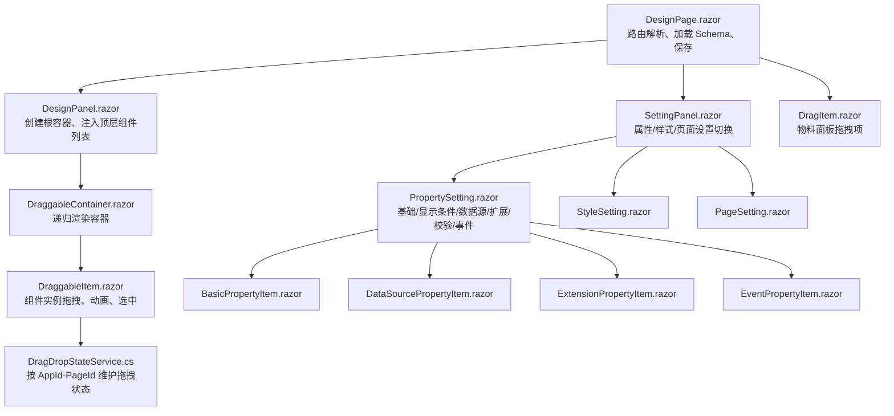
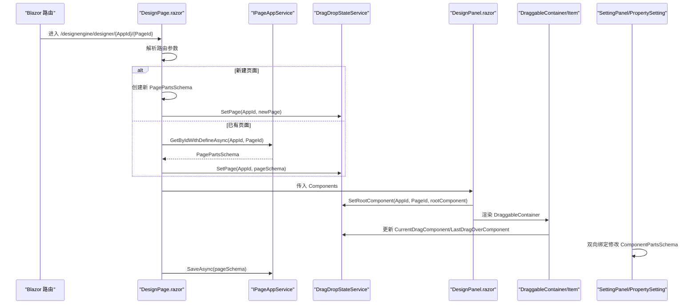
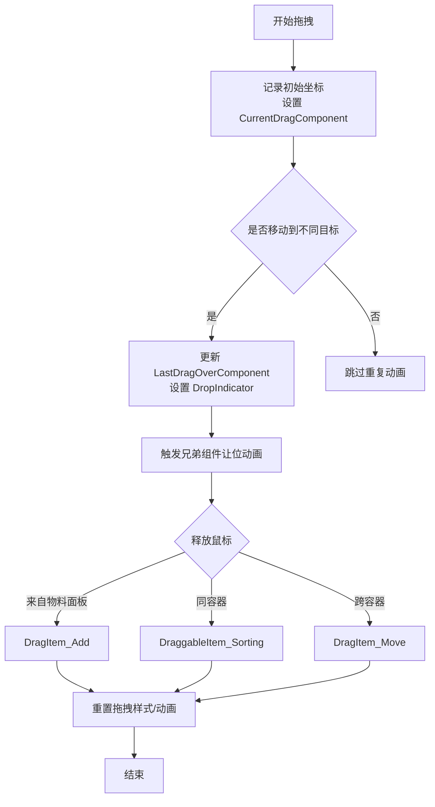
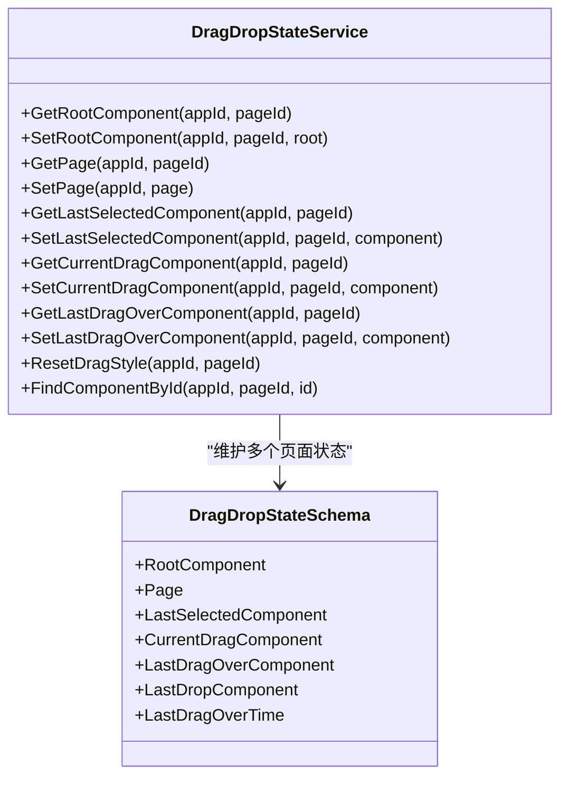
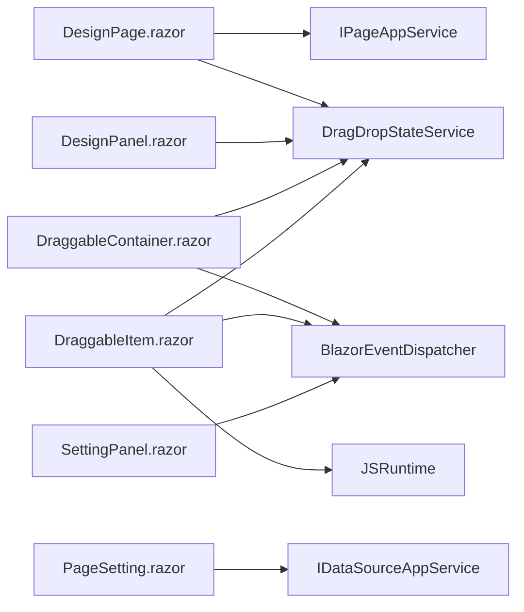

# 页面设计器

<cite>
**本文引用的文件**   
- [DesignPage.razor](file://src/LowCode/DesignEngine/H.LowCode.DesignEngine/Pages/DesignPage.razor)
- [DesignPanel.razor](file://src/LowCode/DesignEngine/H.LowCode.DesignEngine/DesignPanel/DesignPanel.razor)
- [DragItem.razor](file://src/LowCode/DesignEngine/H.LowCode.DesignEngine/ComponentPanel/DragItem.razor)
- [DraggableContainer.razor](file://src/LowCode/DesignEngine/H.LowCode.DesignEngine/DraggableComponents/DraggableContainer.razor)
- [DraggableItem.razor](file://src/LowCode/DesignEngine/H.LowCode.DesignEngine/DraggableComponents/DraggableItem.razor)
- [DragDropStateService.cs](file://src/LowCode/DesignEngine/H.LowCode.DesignEngine/Services/DragDropStateService.cs)
- [SettingPanel.razor](file://src/LowCode/DesignEngine/H.LowCode.DesignEngine/SettingPanel/SettingPanel.razor)
- [PropertySetting.razor](file://src/LowCode/DesignEngine/H.LowCode.DesignEngine/SettingPanel/PropertySetting.razor)
- [BasicPropertyItem.razor](file://src/LowCode/DesignEngine/H.LowCode.DesignEngine/SettingPanel/PropertySettingItems/BasicPropertyItem.razor)
- [ExtensionPropertyItem.razor](file://src/LowCode/DesignEngine/H.LowCode.DesignEngine/SettingPanel/PropertySettingItems/ExtensionPropertyItem.razor)
- [DataSourcePropertyItem.razor](file://src/LowCode/DesignEngine/H.LowCode.DesignEngine/SettingPanel/PropertySettingItems/DataSourcePropertyItem.razor)
- [EventPropertyItem.razor](file://src/LowCode/DesignEngine/H.LowCode.DesignEngine/SettingPanel/PropertySettingItems/EventPropertyItem.razor)
- [StyleSetting.razor](file://src/LowCode/DesignEngine/H.LowCode.DesignEngine/SettingPanel/StyleSetting.razor)
- [PageSetting.razor](file://src/LowCode/DesignEngine/H.LowCode.DesignEngine/SettingPanel/PageSetting.razor)
- [IPageAppService.cs](file://src/LowCode/DesignEngine/H.LowCode.DesignEngine.Application.Contracts/AppServices/IPageAppService.cs)
- [ComponentPartsSchema.cs](file://src/LowCode/Common/H.LowCode.MetaSchema.DesignEngine/ComponentPartsSchema.cs)
</cite>

## 目录
1. [引言](#引言)
2. [项目结构](#项目结构)
3. [核心组件](#核心组件)
4. [架构总览](#架构总览)
5. [详细组件分析](#详细组件分析)
6. [依赖关系分析](#依赖关系分析)
7. [性能与交互优化](#性能与交互优化)
8. [故障排查指南](#故障排查指南)
9. [结论](#结论)
10. [附录：完整操作示例](#附录完整操作示例)

## 引言
本文面向低代码平台中的“页面设计器”，以 `DesignPage.razor` 为入口，逐步说明页面加载、拖拽构建组件树、属性面板动态绑定、样式与校验编辑、事件定义与保存、以及保存策略。文档同时解释设计期状态如何由 `DragDropStateService` 管理，并对比设计器渲染与运行时 `RenderEngine` 的差异。

## 项目结构
页面设计器位于 `H.LowCode.DesignEngine` 项目中，采用 Blazor 组件分层组织：
- 页面层：`Pages/DesignPage.razor`
- 画布层：`DesignPanel/DesignPanel.razor`、`DraggableComponents/DraggableContainer.razor`、`DraggableComponents/DraggableItem.razor`
- 物料面板：`ComponentPanel/DragItem.razor`
- 设置面板：`SettingPanel/SettingPanel.razor` 及其子项
- 拖拽状态服务：`Services/DragDropStateService.cs`
- 数据契约与元模型：`H.LowCode.MetaSchema.DesignEngine` 中的 `ComponentPartsSchema`、`PagePartsSchema` 等
- 应用服务接口：`Application.Contracts/AppServices/IPageAppService.cs`

**图表来源**
- [DesignPage.razor:1-80](file://src/LowCode/DesignEngine/H.LowCode.DesignEngine/Pages/DesignPage.razor#L1-L80)
- [DesignPanel.razor:1-50](file://src/LowCode/DesignEngine/H.LowCode.DesignEngine/DesignPanel/DesignPanel.razor#L1-L50)
- [DraggableContainer.razor:1-60](file://src/LowCode/DesignEngine/H.LowCode.DesignEngine/DraggableComponents/DraggableContainer.razor#L1-L60)
- [DraggableItem.razor:1-60](file://src/LowCode/DesignEngine/H.LowCode.DesignEngine/DraggableComponents/DraggableItem.razor#L1-L60)
- [DragItem.razor:1-44](file://src/LowCode/DesignEngine/H.LowCode.DesignEngine/ComponentPanel/DragItem.razor#L1-L44)
- [SettingPanel.razor:1-93](file://src/LowCode/DesignEngine/H.LowCode.DesignEngine/SettingPanel/SettingPanel.razor#L1-L93)
- [PropertySetting.razor:1-60](file://src/LowCode/DesignEngine/H.LowCode.DesignEngine/SettingPanel/PropertySetting.razor#L1-L60)
- [DragDropStateService.cs:1-120](file://src/LowCode/DesignEngine/H.LowCode.DesignEngine/Services/DragDropStateService.cs#L1-L120)

**章节来源**
- [DesignPage.razor:1-120](file://src/LowCode/DesignEngine/H.LowCode.DesignEngine/Pages/DesignPage.razor#L1-L120)
- [DesignPanel.razor:1-50](file://src/LowCode/DesignEngine/H.LowCode.DesignEngine/DesignPanel/DesignPanel.razor#L1-L50)

## 核心组件
- `DesignPage.razor`：路由入口、页面 Schema 加载、预览与保存、AI 生成入口。
- `DesignPanel.razor`：根据页面传入的顶层组件集合创建根节点，并把根节点注册到拖拽状态中。
- `DragItem.razor`：物料面板中的单个组件项，支持点击添加和拖拽初始化。
- `DraggableContainer.razor`：可放置子组件的容器，处理新增、删除、复制、排序、跨容器移动。
- `DraggableItem.razor`：组件实例包装，实现原生拖拽、让位动画、选中态、事件发布。
- `DragDropStateService.cs`：基于 `AppId-PageId` 键值的全局静态状态服务，维护根组件、当前拖拽项、最后选中项、最后悬停项等。
- `SettingPanel.razor`：属性/样式/页面三栏 Tab 控制，订阅选中与失焦事件。
- `PropertySetting.razor`：组合基础属性、显示条件、数据源、扩展属性、校验规则、事件。
- `BasicPropertyItem.razor`：Name/标题/描述等基础字段。
- `DataSourcePropertyItem.razor`：通用/选项/表格/树/列表数据源配置入口。
- `ExtensionPropertyItem.razor`：按 `AttributeDefineGroups` 动态渲染扩展属性。
- `EventPropertyItem.razor`：打开事件配置弹窗，将事件写入组件 `Events`。
- `StyleSetting.razor`：宽度、标签宽度、自定义样式。
- `PageSetting.razor`：页面布局列数、表单页数据源、页面级事件。

**章节来源**
- [DesignPage.razor:1-120](file://src/LowCode/DesignEngine/H.LowCode.DesignEngine/Pages/DesignPage.razor#L1-L120)
- [DragDropStateService.cs:1-250](file://src/LowCode/DesignEngine/H.LowCode.DesignEngine/Services/DragDropStateService.cs#L1-L250)
- [PropertySetting.razor:1-200](file://src/LowCode/DesignEngine/H.LowCode.DesignEngine/SettingPanel/PropertySetting.razor#L1-L200)

## 架构总览
页面设计器的数据流围绕“页面 Schema + 设计期状态”展开：
1. 路由参数解析得到 `AppId` 与 `PageId`。
2. 新建页面时生成临时 `PagePartsSchema`；已有页面则调用 `PageAppService.GetByIdWithDefineAsync` 获取。
3. 通过 `DragDropStateService.SetPage` 把页面对象挂入状态服务。
4. `DesignPanel` 读取或构造根组件，并通过 `DragDropStateService.SetRootComponent` 注册。
5. 画布使用 `DraggableContainer` 递归渲染组件树。
6. 用户操作（拖拽、点击、删除、复制）修改 `ComponentPartsSchema` 树结构，并由状态服务协调 UI 刷新。
7. 属性面板通过双向绑定直接修改同一棵 `ComponentPartsSchema` 树。
8. 保存时从状态服务取回根组件，覆盖 `_pageSchema.Components`，再调用 `PageAppService.SaveAsync`。

**图表来源**
- [DesignPage.razor:1-120](file://src/LowCode/DesignEngine/H.LowCode.DesignEngine/Pages/DesignPage.razor#L1-L120)
- [DesignPanel.razor:1-50](file://src/LowCode/DesignEngine/H.LowCode.DesignEngine/DesignPanel/DesignPanel.razor#L1-L50)
- [DraggableContainer.razor:60-160](file://src/LowCode/DesignEngine/H.LowCode.DesignEngine/DraggableComponents/DraggableContainer.razor#L60-L160)
- [DragDropStateService.cs:1-120](file://src/LowCode/DesignEngine/H.LowCode.DesignEngine/Services/DragDropStateService.cs#L1-L120)

**章节来源**
- [DesignPage.razor:80-200](file://src/LowCode/DesignEngine/H.LowCode.DesignEngine/Pages/DesignPage.razor#L80-L200)
- [DesignPanel.razor:10-50](file://src/LowCode/DesignEngine/H.LowCode.DesignEngine/DesignPanel/DesignPanel.razor#L10-L50)

## 详细组件分析

### 页面加载流程
`DesignPage.razor` 的职责包括：
- 声明路由 `/designengine/designer/{AppId}/{PageId}`。
- 在初始化阶段计算 `_isNewPage`，新建页面时替换 `PageId` 为新 GUID。
- 调用 `PageAppService.GetByIdWithDefineAsync` 获取页面 Schema。
- 调用 `DragDropStateService.SetPage` 缓存页面对象。
- 向 `DesignPanel` 传入 `_pageSchema.Components`。
- 向 `SettingPanel` 传入 `_pageSchema`。
- 保存前调用 `CreatePageSchema`，从 `DragDropStateService.GetRootComponent` 拉取最新根节点，并覆盖 `_pageSchema.Components`。

关键行为：
- 新建页面路径会导航到新 ID。
- 空组件禁止保存。
- 异常捕获后提示失败。

**章节来源**
- [DesignPage.razor:1-120](file://src/LowCode/DesignEngine/H.LowCode.DesignEngine/Pages/DesignPage.razor#L1-L120)
- [DesignPage.razor:120-200](file://src/LowCode/DesignEngine/H.LowCode.DesignEngine/Pages/DesignPage.razor#L120-L200)

### 画布与动态组件树
`DesignPanel.razor` 负责：
- 接收顶层 `Components`。
- 若状态中没有根组件，则创建虚拟根节点，其 `Childrens` 指向页面传入的顶层组件。
- 调用 `DragDropStateService.SetRootComponent`，使后续拖拽逻辑能访问根节点。

`DraggableContainer.razor` 负责：
- 遍历 `ContainerComponent.Childrens`，为每个子项渲染 `DraggableItem`。
- 根容器为空时显示引导文案。
- 订阅 `designengine.dragitem.onclick`，用于从物料面板点击新增组件。
- 处理 `OnDrop`，区分三种情况：
  - 来自物料面板：新增组件。
  - 同容器内拖拽：排序。
  - 跨容器拖拽：移动。
- 释放后清空 `LastDragOverComponent`，避免残留插入位置。

`DraggableItem.razor` 负责：
- 组件实例的选中、删除、复制。
- 原生拖拽事件链：`dragstart/drag/dragover/dragenter/dragleave/dragend`。
- 让位动画：根据鼠标偏移计算兄弟组件的 `translate3d` 位移。
- 通过 `BlazorEventDispatcher` 发布选中事件，供 `SettingPanel` 监听。

**图表来源**
- [DraggableItem.razor:120-220](file://src/LowCode/DesignEngine/H.LowCode.DesignEngine/DraggableComponents/DraggableItem.razor#L120-L220)
- [DraggableContainer.razor:120-200](file://src/LowCode/DesignEngine/H.LowCode.DesignEngine/DraggableComponents/DraggableContainer.razor#L120-L200)

**章节来源**
- [DesignPanel.razor:10-50](file://src/LowCode/DesignEngine/H.LowCode.DesignEngine/DesignPanel/DesignPanel.razor#L10-L50)
- [DraggableContainer.razor:1-200](file://src/LowCode/DesignEngine/H.LowCode.DesignEngine/DraggableComponents/DraggableContainer.razor#L1-L200)
- [DraggableItem.razor:1-220](file://src/LowCode/DesignEngine/H.LowCode.DesignEngine/DraggableComponents/DraggableItem.razor#L1-L220)

### 拖拽体系与状态服务
#### DragItem.razor：暴露组件元数据
- 作为物料面板中的可拖拽项，暴露 `Component`，该对象包含 `PartsId`、`Label`、`SupportEvents`、`DataSource`、`AttributeDefineGroups` 等元信息。
- 点击时通过事件总线发布 `designengine.dragitem.onclick`，让根容器处理新增。
- 拖拽开始时设置 `CurrentDragComponent`，标记 `IsDroppedFromComponentPanel = true`，以便容器识别新增来源。

#### DraggableContainer.razor：容器嵌套
- 递归渲染所有子组件。
- 统一处理新增、删除、复制、排序、跨容器移动。
- 通过事件总线解耦“物料面板点击新增”和“画布内部拖拽”。

#### DragDropStateService.cs：拖拽状态中心
状态服务是一个静态类，内部维护一个字典：
- 键：`appId-pageId`。
- 值：`DragDropStateSchema`，包含：
  - `RootComponent`：根组件树。
  - `Page`：页面 Schema。
  - `LastSelectedComponent`：上次选中组件。
  - `CurrentDragComponent`：当前拖拽组件。
  - `LastDragOverComponent`：最后一次悬停的目标组件。
  - `LastDropComponent`：最后一次落点组件。
  - `LastDragOverTime`：悬停时间戳。

它还提供：
- `FindComponentById`：递归查找组件。
- `ResetDragStyle`：清理拖拽相关动画与选中态。
- `ResetComponent`：清空选中、拖拽、悬停引用。

注意：当前 `GetLastDragOverTime` 的实现存在分支问题，返回 `DateTime.Now` 而非状态中的值，这是实现细节缺陷，不应视为正常时间获取方式。

**图表来源**
- [DragDropStateService.cs:1-250](file://src/LowCode/DesignEngine/H.LowCode.DesignEngine/Services/DragDropStateService.cs#L1-L250)

**章节来源**
- [DragItem.razor:1-44](file://src/LowCode/DesignEngine/H.LowCode.DesignEngine/ComponentPanel/DragItem.razor#L1-L44)
- [DraggableContainer.razor:1-200](file://src/LowCode/DesignEngine/H.LowCode.DesignEngine/DraggableComponents/DraggableContainer.razor#L1-L200)
- [DragDropStateService.cs:1-250](file://src/LowCode/DesignEngine/H.LowCode.DesignEngine/Services/DragDropStateService.cs#L1-L250)

### 属性面板的动态绑定机制
`SettingPanel.razor` 提供三个 Tab：
- “属性”：仅对非容器组件显示 `PropertySetting`。
- “样式”：显示 `StyleSetting`。
- “页面”：始终显示 `PageSetting`。

它订阅两个事件：
- `designengine.draggableitem.onclick`：选中组件后切换到“属性”Tab。
- `designengine.draggableitem.onblur`：取消选中后切回“页面”Tab。

`PropertySetting.razor` 是属性编辑中枢，按顺序渲染：
1. `BasicPropertyItem`：Name、标题、描述。
2. 显示条件：启用开关、值表达式、比较符、期望值。
3. `DataSourcePropertyItem`：根据 `DataSource.DataSourceGroupType` 选择配置弹窗。
4. `ExtensionPropertyItem`：按 `AttributeDefineGroups` 渲染扩展属性。
5. 校验设置：启用开关、规则列表、规则类型、触发时机、优先级。
6. 事件：当 `SupportEvents` 非空时显示 `EventPropertyItem`。

`BasicPropertyItem.razor`：
- 容器组件只显示标识。
- 普通组件提供 Name、标题、描述输入，并调用 `RefreshState()` 触发重绘。

`ExtensionPropertyItem.razor`：
- 遍历 `AttributeDefineGroups`。
- 根据 `AttributeItemType` 渲染输入框、数字输入、复选框、开关等。
- 可选展示 `Description`。

`DataSourcePropertyItem.razor`：
- 支持 `General`、`Option`、`Table`、`Tree`、`List` 数据源分组。
- 对每种类型打开对应设置弹窗，例如 `OptionDataSourceSetting`、`TableDataSourceSetting`、`ListDataSourceSetting`。
- 表格数据源还嵌入 `TablePropertyItem` 进行字段映射。

`EventPropertyItem.razor`：
- 打开事件配置弹窗。
- 初始化时将 `SupportEvents` 中未配置的事件加入 `Events` 列表。
- 确认后将 `Component.Events` 写回组件实例。

**章节来源**
- [SettingPanel.razor:1-93](file://src/LowCode/DesignEngine/H.LowCode.DesignEngine/SettingPanel/SettingPanel.razor#L1-L93)
- [PropertySetting.razor:1-200](file://src/LowCode/DesignEngine/H.LowCode.DesignEngine/SettingPanel/PropertySetting.razor#L1-L200)
- [BasicPropertyItem.razor:1-38](file://src/LowCode/DesignEngine/H.LowCode.DesignEngine/SettingPanel/PropertySettingItems/BasicPropertyItem.razor#L1-L38)
- [ExtensionPropertyItem.razor:1-87](file://src/LowCode/DesignEngine/H.LowCode.DesignEngine/SettingPanel/PropertySettingItems/ExtensionPropertyItem.razor#L1-L87)
- [DataSourcePropertyItem.razor:1-163](file://src/LowCode/DesignEngine/H.LowCode.DesignEngine/SettingPanel/PropertySettingItems/DataSourcePropertyItem.razor#L1-L163)
- [EventPropertyItem.razor:1-40](file://src/LowCode/DesignEngine/H.LowCode.DesignEngine/SettingPanel/PropertySettingItems/EventPropertyItem.razor#L1-L40)

### 样式设置、校验规则与页面级设置
#### 样式设置
`StyleSetting.razor`：
- 组件宽度：范围滑块绑定 `Component.Style.ItemWidth`。
- 标签宽度：非容器且未隐藏标签时可用。
- 自定义样式：文本域绑定 `Component.Style.CustomStyle`。
- 每次修改调用 `Component.RefreshState()` 触发局部刷新。

#### 校验规则
`PropertySetting.razor` 内置完整的校验编辑器：
- 启用开关。
- 规则列表支持必填、最小长度、最大长度、最小值、最大值、正则、邮箱、手机号、URL、自定义。
- 每条规则支持启用开关、错误消息、触发时机（输入时/失去焦点）、优先级。
- 提供添加、删除规则按钮。
- 所有输入均使用 `@bind:after` 回调触发 `OnRuleChange`，保持 UI 与 Schema 同步。

#### 页面级设置
`PageSetting.razor`：
- 页面布局：一列至四列，改变时发布 `designengine.pagesetting.pagelayout.onchange`，`DraggableItem` 监听并重新计算宽度。
- 表单页数据源：无/数据表/API。
- 数据表数据源：下拉选择、详情展示、自动填充 `Page.DataSource.DataSourceId`。
- API 数据源：下拉选择、详情展示、自动填充 `Page.DataSource.DataSourceId`。
- 页面自定义样式。
- 页面级事件：打开事件配置弹窗，将事件写入页面级数据结构。

**章节来源**
- [StyleSetting.razor:1-31](file://src/LowCode/DesignEngine/H.LowCode.DesignEngine/SettingPanel/StyleSetting.razor#L1-L31)
- [PropertySetting.razor:60-200](file://src/LowCode/DesignEngine/H.LowCode.DesignEngine/SettingPanel/PropertySetting.razor#L60-L200)
- [PageSetting.razor:1-120](file://src/LowCode/DesignEngine/H.LowCode.DesignEngine/SettingPanel/PageSetting.razor#L1-L120)

### 事件系统设计与运行期差异
#### 设计期事件定义
- 组件事件：`EventPropertyItem.razor` 读取 `Component.SupportEvents`，初始化事件列表，确认后写回 `Component.Events`。
- 页面事件：`PageSetting.razor` 提供页面级事件配置弹窗，同样通过 `EventList` 编辑事件。

#### 设计期事件传播
设计器内部使用 `BlazorEventDispatcher` 做松耦合通信：
- `DraggableItem` 点击后发布 `designengine.draggableitem.onclick`。
- `DraggableContainer` 根容器订阅 `designengine.dragitem.onclick`，用于物料面板点击新增。
- `SettingPanel` 订阅 `designengine.draggableitem.onclick` 与 `designengine.draggableitem.onblur`，控制属性面板显隐。
- `PageSetting` 发布 `designengine.pagesetting.pagelayout.onchange`，`DraggableItem` 订阅以响应布局变化。

#### 运行期差异
设计期 Schema 与运行时渲染结果存在明显差异：
- 设计期使用 `ComponentPartsSchema`，包含大量仅设计期使用的字段，如 `DesignState`、`Refresh`、`ParentId`、`PublishStatus`、`ModifiedTime` 等。
- 运行时由 `RenderEngine` 渲染，通常使用更精简的运行时组件模型，不再保留设计期交互状态。
- 设计期拖拽、动画、选中、让位、事件弹窗都是 UI 交互产物，不会原样出现在运行结果中。
- 设计期保存的是页面 Schema，而运行时由渲染引擎解析 Schema 并执行数据绑定、事件处理和数据源查询。

**章节来源**
- [EventPropertyItem.razor:1-40](file://src/LowCode/DesignEngine/H.LowCode.DesignEngine/SettingPanel/PropertySettingItems/EventPropertyItem.razor#L1-L40)
- [PageSetting.razor:120-241](file://src/LowCode/DesignEngine/H.LowCode.DesignEngine/SettingPanel/PageSetting.razor#L120-L241)
- [DraggableItem.razor:1-120](file://src/LowCode/DesignEngine/H.LowCode.DesignEngine/DraggableComponents/DraggableItem.razor#L1-L120)
- [ComponentPartsSchema.cs:1-120](file://src/LowCode/Common/H.LowCode.MetaSchema.DesignEngine/ComponentPartsSchema.cs#L1-L120)

### 撤销与重做实现现状
在当前仓库证据中：
- `DragDropStateService` 没有实现撤销栈、重做栈或快照机制。
- `DraggableContainer` 的删除、复制、拖拽排序、跨容器移动都直接修改 `ComponentPartsSchema` 树，没有中间快照。
- `DesignPage.razor` 的保存逻辑也没有合并历史版本。

因此，当前实现属于“即时修改、无撤销重做”的设计期状态模型。若要实现撤销重做，建议：
- 在 `DragDropStateService` 中引入基于 `AppId-PageId` 的快照栈。
- 每次重大变更（新增、删除、复制、排序、移动、属性批量提交）压入快照。
- 限制快照数量，避免内存增长。
- 撤销重做时恢复 `RootComponent`、`LastSelectedComponent`、`CurrentDragComponent`、`LastDragOverComponent`。
- 对 `ComponentPartsSchema.DeepClone` 的使用需谨慎，避免深拷贝整棵树造成性能问题。

**章节来源**
- [DragDropStateService.cs:1-250](file://src/LowCode/DesignEngine/H.LowCode.DesignEngine/Services/DragDropStateService.cs#L1-L250)
- [DraggableContainer.razor:120-200](file://src/LowCode/DesignEngine/H.LowCode.DesignEngine/DraggableComponents/DraggableContainer.razor#L120-L200)
- [DesignPage.razor:120-200](file://src/LowCode/DesignEngine/H.LowCode.DesignEngine/Pages/DesignPage.razor#L120-L200)

## 依赖关系分析
- `DesignPage.razor` 依赖 `IPageAppService` 获取和保存页面。
- `DesignPanel.razor` 依赖 `DragDropStateService` 读写根组件。
- `DraggableContainer.razor` 依赖 `DragDropStateService` 和 `BlazorEventDispatcher`。
- `DraggableItem.razor` 依赖 `DragDropStateService`、`BlazorEventDispatcher`、`JSRuntime`。
- `SettingPanel.razor` 依赖 `BlazorEventDispatcher`。
- `PropertySetting.razor` 依赖多个子项组件。
- `DataSourcePropertyItem.razor` 依赖各类数据源设置组件。
- `PageSetting.razor` 依赖 `IDataSourceAppService`。

**图表来源**
- [DesignPage.razor:1-40](file://src/LowCode/DesignEngine/H.LowCode.DesignEngine/Pages/DesignPage.razor#L1-L40)
- [DraggableContainer.razor:60-120](file://src/LowCode/DesignEngine/H.LowCode.DesignEngine/DraggableComponents/DraggableContainer.razor#L60-L120)
- [DraggableItem.razor:1-60](file://src/LowCode/DesignEngine/H.LowCode.DesignEngine/DraggableComponents/DraggableItem.razor#L1-L60)
- [PageSetting.razor:1-40](file://src/LowCode/DesignEngine/H.LowCode.DesignEngine/SettingPanel/PageSetting.razor#L1-L40)

**章节来源**
- [IPageAppService.cs](file://src/LowCode/DesignEngine/H.LowCode.DesignEngine.Application.Contracts/AppServices/IPageAppService.cs)
- [DragDropStateService.cs:1-120](file://src/LowCode/DesignEngine/H.LowCode.DesignEngine/Services/DragDropStateService.cs#L1-L120)

## 性能与交互优化
当前设计器已有一些优化实践：
- 使用 `translate3d` 和 `will-change` 触发 GPU 加速，减少重排。
- 在拖拽过程中延迟设置 `isDragging`，避免中断原生拖拽。
- 使用 JS 辅助绘制跟随鼠标的拖拽图像，降低 Blazor 逐事件渲染开销。
- 兄弟组件让位动画只在必要时更新位移，避免频繁重渲染。
- 通过 `RefreshState` 精确触发组件自身重绘，而不是全量重建。

潜在优化空间：
- 撤销重做尚未实现，未来应优先实现轻量级增量快照。
- `DeepClone` 会复制整棵组件树，适合复制场景，不适合高频撤销。
- `DragDropStateService` 是静态全局状态，多页面并发时需确保 `AppId-PageId` 键隔离。
- 大页面组件树渲染时，应考虑虚拟化或懒加载子组件。

[本节为一般性指导，不直接分析具体代码片段]

## 故障排查指南
常见问题与建议：
- 拖拽无效：检查 `DragDropStateService.GetCurrentDragComponent` 是否被正确设置，确认 `DragItem` 或 `DraggableItem` 是否设置了当前拖拽项。
- 拖拽后样式未清理：检查 `DragDropStateService.ResetDragStyle` 是否在释放时调用。
- 属性面板不切换：确认 `DraggableItem` 是否发布 `designengine.draggableitem.onclick`，`SettingPanel` 是否正确订阅。
- 布局变化不生效：确认 `PageSetting` 发布 `designengine.pagesetting.pagelayout.onchange`，`DraggableItem` 是否订阅并更新 `_pageLayout`。
- 保存后组件丢失：检查 `CreatePageSchema` 是否正确从状态服务获取根组件并覆盖 `_pageSchema.Components`。
- 时间戳读取异常：注意 `DragDropStateService.GetLastDragOverTime` 的实现缺陷，不要依赖其返回值作为真实时间。

**章节来源**
- [DraggableContainer.razor:120-200](file://src/LowCode/DesignEngine/H.LowCode.DesignEngine/DraggableComponents/DraggableContainer.razor#L120-L200)
- [DraggableItem.razor:200-472](file://src/LowCode/DesignEngine/H.LowCode.DesignEngine/DraggableComponents/DraggableItem.razor#L200-L472)
- [SettingPanel.razor:40-93](file://src/LowCode/DesignEngine/H.LowCode.DesignEngine/SettingPanel/SettingPanel.razor#L40-L93)
- [DragDropStateService.cs:120-250](file://src/LowCode/DesignEngine/H.LowCode.DesignEngine/Services/DragDropStateService.cs#L120-L250)

## 结论
页面设计器以 `DesignPage.razor` 为入口，通过 `PageAppService` 加载页面 Schema，借助 `DragDropStateService` 维护设计期状态，使用 `DraggableContainer` 与 `DraggableItem` 实现嵌套容器和拖拽交互，并通过 `SettingPanel` 及一系列 `PropertySettingItems` 完成属性、样式、校验、数据源和事件的动态编辑。当前实现强调设计期交互体验与 Schema 驱动，但尚未实现撤销重做。保存策略以最终 Schema 为准，与运行时渲染结果存在明确职责分离。

[本节为总结性内容，不直接分析具体文件]

## 附录：完整操作示例

### 示例一：在设计器中添加一个按钮并绑定 Click 事件
步骤：
1. 打开页面设计器，左侧组件面板中找到按钮组件。
2. 点击按钮或直接拖拽到画布中央。
   - 点击路径：`DragItem.razor` 发布 `designengine.dragitem.onclick`，根容器 `DraggableContainer.razor` 收到后执行新增。
   - 拖拽路径：`DragItem.razor` 设置 `CurrentDragComponent`，释放时 `DraggableContainer.razor` 判断 `IsDroppedFromComponentPanel` 并新增。
3. 选中刚添加的按钮，右侧“属性”面板出现。
4. 如果按钮组件支持事件，会出现“事件”区域，点击“配置事件”。
5. 在事件弹窗中新增 Click 事件，确认后事件配置写入 `Component.Events`。
6. 点击“保存”按钮，`DesignPage.razor` 调用 `PageAppService.SaveAsync`。

涉及文件：
- [DragItem.razor:1-44](file://src/LowCode/DesignEngine/H.LowCode.DesignEngine/ComponentPanel/DragItem.razor#L1-L44)
- [DraggableContainer.razor:60-160](file://src/LowCode/DesignEngine/H.LowCode.DesignEngine/DraggableComponents/DraggableContainer.razor#L60-L160)
- [PropertySetting.razor:160-200](file://src/LowCode/DesignEngine/H.LowCode.DesignEngine/SettingPanel/PropertySetting.razor#L160-L200)
- [EventPropertyItem.razor:1-40](file://src/LowCode/DesignEngine/H.LowCode.DesignEngine/SettingPanel/PropertySettingItems/EventPropertyItem.razor#L1-L40)
- [DesignPage.razor:120-200](file://src/LowCode/DesignEngine/H.LowCode.DesignEngine/Pages/DesignPage.razor#L120-L200)

### 示例二：添加表单字段并配置 SQL 数据源
步骤：
1. 在组件面板中选择表单字段组件，拖入画布。
2. 在“属性”面板中填写 Name、标题、描述。
3. 进入“数据源”区域：
   - 如果组件支持表格或列表数据源，点击“配置数据源”。
   - `DataSourcePropertyItem.razor` 根据 `DataSourceGroupType` 打开对应弹窗。
   - 如果是表格数据源，还会显示 `TablePropertyItem`，用于字段映射。
4. 配置完成后关闭弹窗，Schema 中的 `DataSource` 已被更新。
5. 如需校验，启用“校验设置”，添加必填或格式规则。
6. 如需样式调整，切换到“样式”Tab，调整宽度、标签宽度或自定义样式。
7. 保存页面。

涉及文件：
- [DataSourcePropertyItem.razor:1-163](file://src/LowCode/DesignEngine/H.LowCode.DesignEngine/SettingPanel/PropertySettingItems/DataSourcePropertyItem.razor#L1-L163)
- [PropertySetting.razor:60-160](file://src/LowCode/DesignEngine/H.LowCode.DesignEngine/SettingPanel/PropertySetting.razor#L60-L160)
- [StyleSetting.razor:1-31](file://src/LowCode/DesignEngine/H.LowCode.DesignEngine/SettingPanel/StyleSetting.razor#L1-L31)
- [DesignPage.razor:120-200](file://src/LowCode/DesignEngine/H.LowCode.DesignEngine/Pages/DesignPage.razor#L120-L200)

### 示例三：配置页面级 SQL 数据源
步骤：
1. 切换到右侧“页面”Tab。
2. 如果页面类型为表单页，在“数据源”中选择“数据表”。
3. 从下拉列表选择一个数据库表，`PageSetting.razor` 会加载表详情并设置 `DataSourceId`。
4. 也可选择“API”数据源，选择 API 后设置 `DataSourceId`。
5. 如需页面级事件，点击“配置事件”并编辑事件列表。
6. 保存页面。

涉及文件：
- [PageSetting.razor:1-120](file://src/LowCode/DesignEngine/H.LowCode.DesignEngine/SettingPanel/PageSetting.razor#L1-L120)
- [PageSetting.razor:120-241](file://src/LowCode/DesignEngine/H.LowCode.DesignEngine/SettingPanel/PageSetting.razor#L120-L241)
- [DesignPage.razor:120-200](file://src/LowCode/DesignEngine/H.LowCode.DesignEngine/Pages/DesignPage.razor#L120-L200)