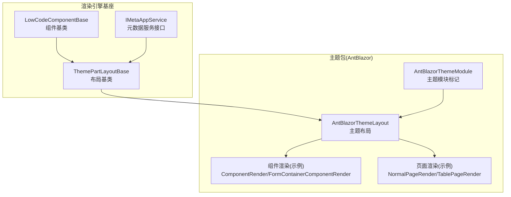
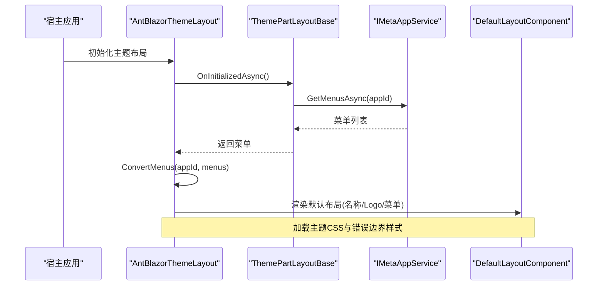
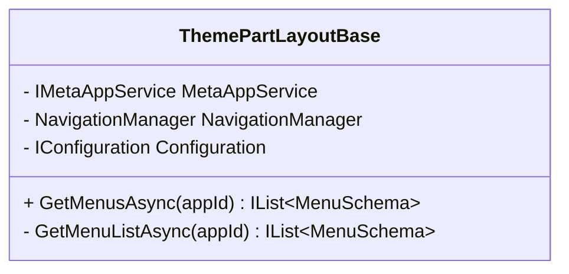
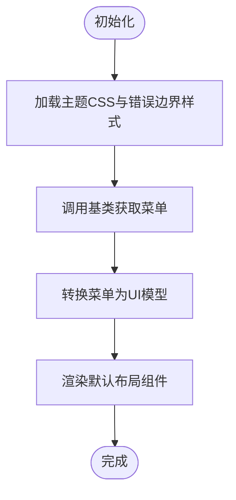
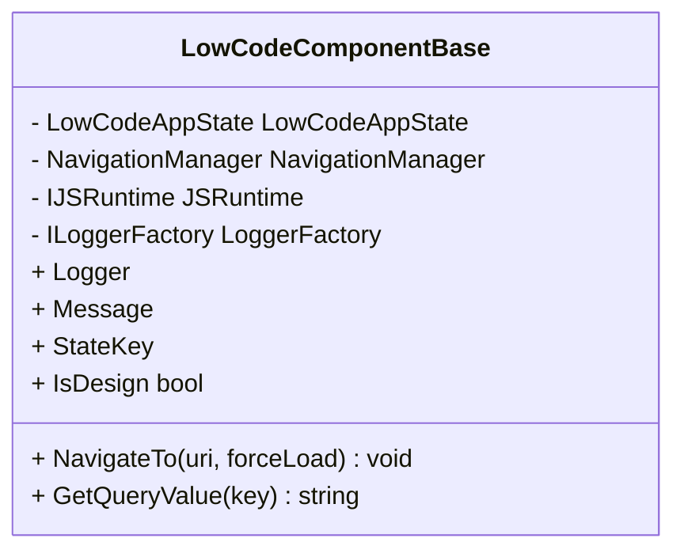
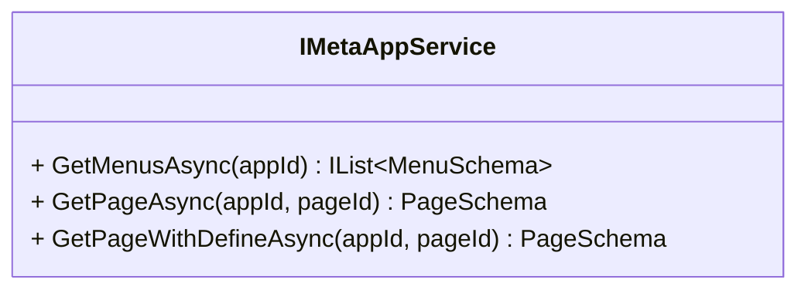
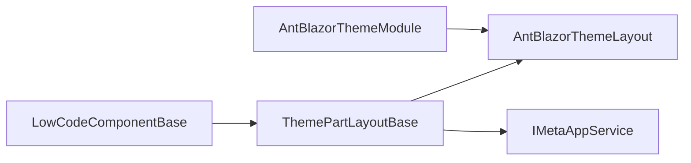

# 主题系统

<cite>
**本文引用的文件**   
- [AntBlazorThemeModule.cs](file://src/LowCode/RenderEngine/H.LowCode.RenderEngine/AntBlazorThemeModule.cs)
- [ThemePartLayoutBase.cs](file://src/LowCode/RenderEngine/H.LowCode.RenderEngineBase/Layout/ThemePartLayoutBase.cs)
- [AntBlazorThemeLayout.razor](file://src/LowCode/RenderEngine/H.LowCode.RenderEngine/Layout/AntBlazorThemeLayout.razor)
- [LowCodeComponentBase.cs](file://src/LowCode/Common/H.LowCode.ComponentBase/LowCodeComponentBase.cs)
- [IMetaAppService.cs](file://src/LowCode/RenderEngine/H.LowCode.RenderEngine.Application.Contracts/RenderAppServices/IMetaAppService.cs)
- [MyAppLayout.razor](file://src/LowCode/DesignEngine/H.LowCode.MyApp/Layout/MyAppLayout.razor)
</cite>

## 目录
1. [简介](#简介)
2. [项目结构](#项目结构)
3. [核心组件](#核心组件)
4. [架构总览](#架构总览)
5. [详细组件分析](#详细组件分析)
6. [依赖关系分析](#依赖关系分析)
7. [性能考量](#性能考量)
8. [故障排查指南](#故障排查指南)
9. [结论](#结论)
10. [附录](#附录)

## 简介
本文件面向低代码主题系统的全面文档，围绕主题注册、样式隔离、动态切换等核心机制展开，并结合 AntBlazor 主题的集成方式与自定义主题开发流程进行说明。同时阐述设计器与渲染器中主题的不同处理方式，涵盖 CSS 变量、样式覆盖、响应式主题等高级特性，并提供最佳实践、性能优化建议以及测试与调试方法。

## 项目结构
主题系统主要位于渲染引擎与主题包两个层次：
- 渲染引擎基座提供布局基类与通用能力（菜单获取、导航、配置注入等）
- 具体主题包（如 AntBlazor）实现布局、页面渲染与组件渲染，并加载主题资源

图表来源 
- [ThemePartLayoutBase.cs:1-44](file://src/LowCode/RenderEngine/H.LowCode.RenderEngineBase/Layout/ThemePartLayoutBase.cs#L1-L44)
- [AntBlazorThemeLayout.razor:1-60](file://src/LowCode/RenderEngine/H.LowCode.RenderEngine/Layout/AntBlazorThemeLayout.razor#L1-L60)
- [AntBlazorThemeModule.cs:1-9](file://src/LowCode/RenderEngine/H.LowCode.RenderEngine/AntBlazorThemeModule.cs#L1-L9)
- [IMetaAppService.cs:1-14](file://src/LowCode/RenderEngine/H.LowCode.RenderEngine.Application.Contracts/RenderAppServices/IMetaAppService.cs#L1-L14)
- [LowCodeComponentBase.cs:1-73](file://src/LowCode/Common/H.LowCode.ComponentBase/LowCodeComponentBase.cs#L1-L73)

章节来源
- [ThemePartLayoutBase.cs:1-44](file://src/LowCode/RenderEngine/H.LowCode.RenderEngineBase/Layout/ThemePartLayoutBase.cs#L1-L44)
- [AntBlazorThemeLayout.razor:1-60](file://src/LowCode/RenderEngine/H.LowCode.RenderEngine/Layout/AntBlazorThemeLayout.razor#L1-L60)
- [AntBlazorThemeModule.cs:1-9](file://src/LowCode/RenderEngine/H.LowCode.RenderEngine/AntBlazorThemeModule.cs#L1-L9)
- [IMetaAppService.cs:1-14](file://src/LowCode/RenderEngine/H.LowCode.RenderEngine.Application.Contracts/RenderAppServices/IMetaAppService.cs#L1-L14)
- [LowCodeComponentBase.cs:1-73](file://src/LowCode/Common/H.LowCode.ComponentBase/LowCodeComponentBase.cs#L1-L73)

## 核心组件
- 主题布局基类：提供菜单获取、导航与配置注入等通用能力，供具体主题布局继承使用
- 主题布局实现：AntBlazor 主题布局负责加载主题样式、错误边界、菜单转换与默认布局容器
- 组件基类：为所有低代码组件提供状态、导航、JS 交互与日志等基础能力
- 元数据服务接口：定义获取菜单、页面等元数据的契约，供布局与服务层使用
- 主题模块标记：用于标识主题包，便于宿主或框架识别与装配

章节来源
- [ThemePartLayoutBase.cs:1-44](file://src/LowCode/RenderEngine/H.LowCode.RenderEngineBase/Layout/ThemePartLayoutBase.cs#L1-L44)
- [AntBlazorThemeLayout.razor:1-60](file://src/LowCode/RenderEngine/H.LowCode.RenderEngine/Layout/AntBlazorThemeLayout.razor#L1-L60)
- [LowCodeComponentBase.cs:1-73](file://src/LowCode/Common/H.LowCode.ComponentBase/LowCodeComponentBase.cs#L1-L73)
- [IMetaAppService.cs:1-14](file://src/LowCode/RenderEngine/H.LowCode.RenderEngine.Application.Contracts/RenderAppServices/IMetaAppService.cs#L1-L14)
- [AntBlazorThemeModule.cs:1-9](file://src/LowCode/RenderEngine/H.LowCode.RenderEngine/AntBlazorThemeModule.cs#L1-L9)

## 架构总览
主题系统在渲染期通过“布局基类 + 主题布局”的组合完成样式加载与菜单构建；在设计期通过独立布局加载设计器资源与菜单。主题包以模块化方式组织，便于替换与扩展。

图表来源 
- [AntBlazorThemeLayout.razor:1-60](file://src/LowCode/RenderEngine/H.LowCode.RenderEngine/Layout/AntBlazorThemeLayout.razor#L1-L60)
- [ThemePartLayoutBase.cs:1-44](file://src/LowCode/RenderEngine/H.LowCode.RenderEngineBase/Layout/ThemePartLayoutBase.cs#L1-L44)
- [IMetaAppService.cs:1-14](file://src/LowCode/RenderEngine/H.LowCode.RenderEngine.Application.Contracts/RenderAppServices/IMetaAppService.cs#L1-L14)

## 详细组件分析

### 主题布局基类（ThemePartLayoutBase）
职责与行为：
- 注入元数据服务、导航与配置
- 获取菜单列表并在缺失时插入首页项
- 为具体主题布局提供统一的菜单处理逻辑

图表来源 
- [ThemePartLayoutBase.cs:1-44](file://src/LowCode/RenderEngine/H.LowCode.RenderEngineBase/Layout/ThemePartLayoutBase.cs#L1-L44)

章节来源
- [ThemePartLayoutBase.cs:1-44](file://src/LowCode/RenderEngine/H.LowCode.RenderEngineBase/Layout/ThemePartLayoutBase.cs#L1-L44)

### AntBlazor 主题布局（AntBlazorThemeLayout）
职责与行为：
- 继承主题布局基类，加载主题样式与错误边界样式
- 将元数据菜单转换为 UI 菜单模型并传递给默认布局组件
- 在参数变化时恢复错误边界，提升容错性

图表来源 
- [AntBlazorThemeLayout.razor:1-60](file://src/LowCode/RenderEngine/H.LowCode.RenderEngine/Layout/AntBlazorThemeLayout.razor#L1-L60)

章节来源
- [AntBlazorThemeLayout.razor:1-60](file://src/LowCode/RenderEngine/H.LowCode.RenderEngine/Layout/AntBlazorThemeLayout.razor#L1-L60)

### 组件基类（LowCodeComponentBase）
职责与行为：
- 提供 IsDesign 状态判断（区分设计态与运行态）
- 统一日志、导航、JS 交互与查询参数解析
- 为低代码组件提供一致的运行时能力

图表来源 
- [LowCodeComponentBase.cs:1-73](file://src/LowCode/Common/H.LowCode.ComponentBase/LowCodeComponentBase.cs#L1-L73)

章节来源
- [LowCodeComponentBase.cs:1-73](file://src/LowCode/Common/H.LowCode.ComponentBase/LowCodeComponentBase.cs#L1-L73)

### 元数据服务接口（IMetaAppService）
职责与行为：
- 定义获取菜单、页面等元数据的契约
- 供布局与服务层解耦调用

图表来源 
- [IMetaAppService.cs:1-14](file://src/LowCode/RenderEngine/H.LowCode.RenderEngine.Application.Contracts/RenderAppServices/IMetaAppService.cs#L1-L14)

章节来源
- [IMetaAppService.cs:1-14](file://src/LowCode/RenderEngine/H.LowCode.RenderEngine.Application.Contracts/RenderAppServices/IMetaAppService.cs#L1-L14)

### 设计器布局（MyAppLayout）
职责与行为：
- 加载设计器样式与 Logo
- 通过级联值传递应用元数据
- 初始化菜单数据并渲染默认布局组件

章节来源
- [MyAppLayout.razor:1-47](file://src/LowCode/DesignEngine/H.LowCode.MyApp/Layout/MyAppLayout.razor#L1-L47)

## 依赖关系分析
- 主题布局依赖布局基类提供的菜单获取与导航能力
- 布局基类依赖元数据服务接口获取菜单
- 组件基类被所有低代码组件继承，提供公共能力
- 主题模块标记用于主题包的识别与装配

图表来源 
- [ThemePartLayoutBase.cs:1-44](file://src/LowCode/RenderEngine/H.LowCode.RenderEngineBase/Layout/ThemePartLayoutBase.cs#L1-L44)
- [AntBlazorThemeLayout.razor:1-60](file://src/LowCode/RenderEngine/H.LowCode.RenderEngine/Layout/AntBlazorThemeLayout.razor#L1-L60)
- [IMetaAppService.cs:1-14](file://src/LowCode/RenderEngine/H.LowCode.RenderEngine.Application.Contracts/RenderAppServices/IMetaAppService.cs#L1-L14)
- [LowCodeComponentBase.cs:1-73](file://src/LowCode/Common/H.LowCode.ComponentBase/LowCodeComponentBase.cs#L1-L73)
- [AntBlazorThemeModule.cs:1-9](file://src/LowCode/RenderEngine/H.LowCode.RenderEngine/AntBlazorThemeModule.cs#L1-L9)

章节来源
- [ThemePartLayoutBase.cs:1-44](file://src/LowCode/RenderEngine/H.LowCode.RenderEngineBase/Layout/ThemePartLayoutBase.cs#L1-L44)
- [AntBlazorThemeLayout.razor:1-60](file://src/LowCode/RenderEngine/H.LowCode.RenderEngine/Layout/AntBlazorThemeLayout.razor#L1-L60)
- [IMetaAppService.cs:1-14](file://src/LowCode/RenderEngine/H.LowCode.RenderEngine.Application.Contracts/RenderAppServices/IMetaAppService.cs#L1-L14)
- [LowCodeComponentBase.cs:1-73](file://src/LowCode/Common/H.LowCode.ComponentBase/LowCodeComponentBase.cs#L1-L73)
- [AntBlazorThemeModule.cs:1-9](file://src/LowCode/RenderEngine/H.LowCode.RenderEngine/AntBlazorThemeModule.cs#L1-L9)

## 性能考量
- 样式加载策略：主题 CSS 应在首次渲染前按需加载，避免阻塞首屏；可使用条件加载与懒加载减少初始体积
- 菜单缓存：对菜单数据进行本地缓存，减少重复请求；结合持久化状态降低网络开销
- 错误边界：在布局层捕获异常并恢复，避免整页崩溃导致重渲染
- 组件渲染优化：利用 ShouldRender 与状态键减少不必要的重渲染
- 资源路径：使用静态资源路径与内容包引用，确保 CDN 与离线场景下的稳定性

[本节为通用指导，不直接分析具体文件]

## 故障排查指南
- 主题样式未生效：检查主题 CSS 是否正确加载，确认资源路径与命名空间
- 菜单为空或缺失首页：检查元数据服务是否返回有效菜单，确认基类是否自动插入首页项
- 页面报错无提示：确认错误边界样式与恢复逻辑是否启用
- 设计态与运行态样式冲突：通过 IsDesign 状态控制样式分支，避免互相覆盖

章节来源
- [AntBlazorThemeLayout.razor:1-60](file://src/LowCode/RenderEngine/H.LowCode.RenderEngine/Layout/AntBlazorThemeLayout.razor#L1-L60)
- [ThemePartLayoutBase.cs:1-44](file://src/LowCode/RenderEngine/H.LowCode.RenderEngineBase/Layout/ThemePartLayoutBase.cs#L1-L44)
- [LowCodeComponentBase.cs:1-73](file://src/LowCode/Common/H.LowCode.ComponentBase/LowCodeComponentBase.cs#L1-L73)

## 结论
本主题系统通过“布局基类 + 主题布局”的清晰分层，实现了样式隔离、菜单统一管理与错误边界保护。AntBlazor 主题作为具体实现，展示了如何加载资源、转换菜单与渲染默认布局。设计器与渲染器分别采用独立布局，满足各自需求。遵循本文的最佳实践与性能建议，可进一步提升主题的可维护性与用户体验。

[本节为总结性内容，不直接分析具体文件]

## 附录
- 主题注册与装配：通过主题模块标记与宿主模块装配，确保主题资源与组件渲染正确加载
- 样式覆盖策略：优先使用 CSS 变量与命名空间，避免全局覆盖导致的冲突
- 响应式主题：基于媒体查询与容器查询实现多端适配，保持视觉一致性
- 测试与调试：使用浏览器开发者工具检查样式加载顺序与元素计算样式；在服务端日志中记录菜单与页面元数据获取结果

[本节为补充信息，不直接分析具体文件]