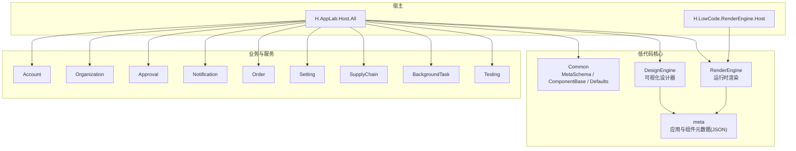
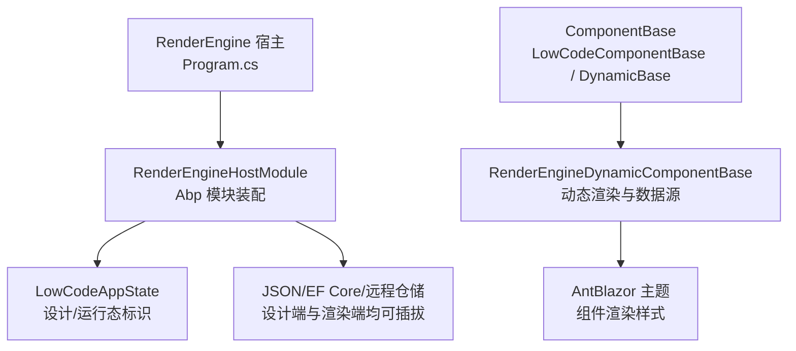
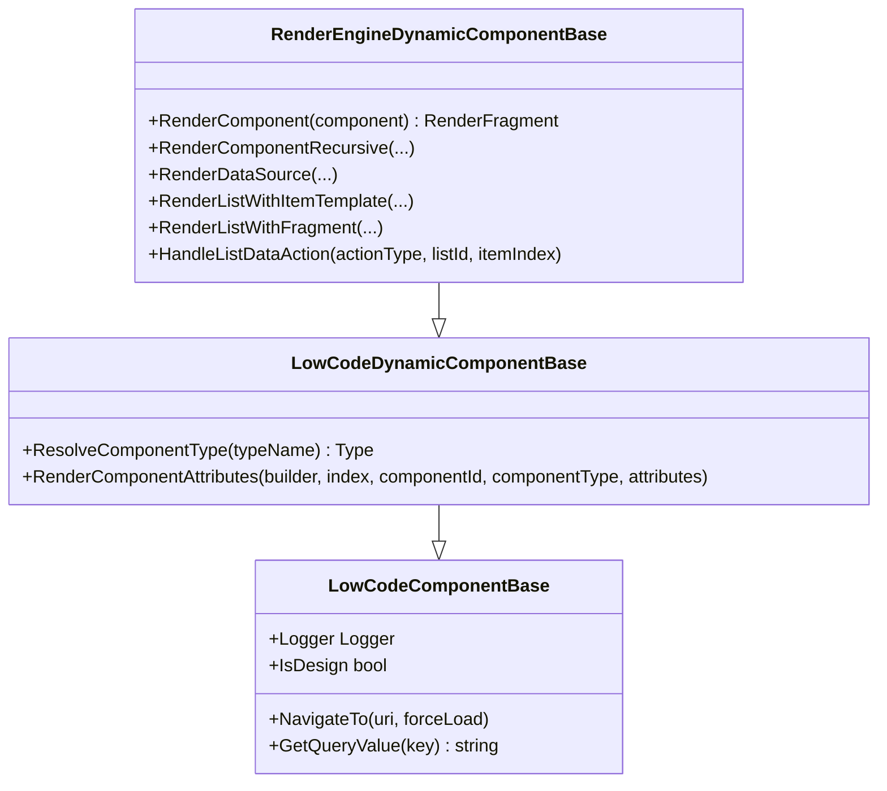
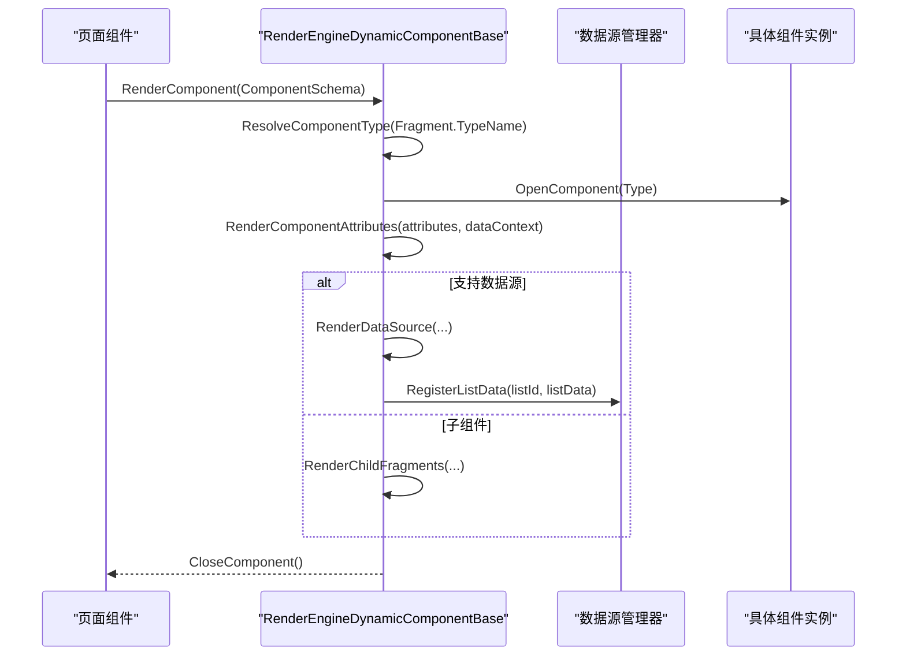
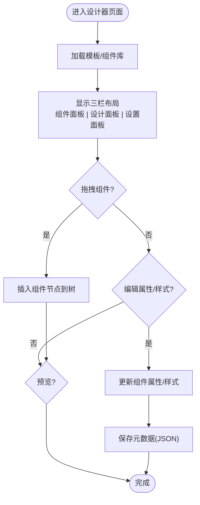
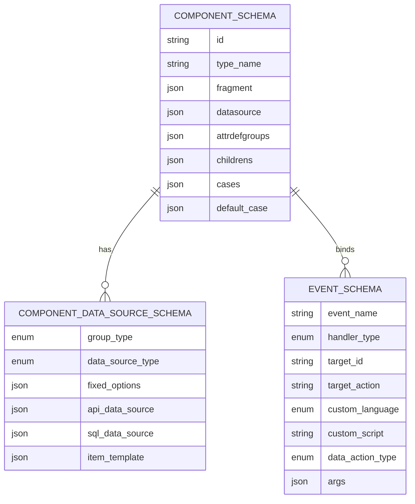
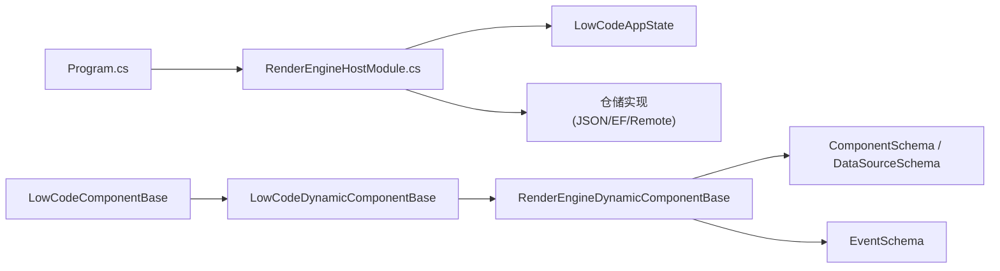

# 低代码引擎

<cite>
**本文引用的文件**   
- [README.md](file://README.md)
- [Program.cs](file://src/Host/RenderEngine/H.LowCode.RenderEngine.Host/Program.cs)
- [RenderEngineHostModule.cs](file://src/Host/RenderEngine/H.LowCode.RenderEngine.Host/RenderEngineHostModule.cs)
- [LowCodeComponentBase.cs](file://src/LowCode/Common/H.LowCode.ComponentBase/LowCodeComponentBase.cs)
- [LowCodeDynamicComponentBase.cs](file://src/LowCode/Common/H.LowCode.ComponentBase/LowCodeDynamicComponentBase.cs)
- [RenderEngineDynamicComponentBase.cs](file://src/LowCode/RenderEngine/H.LowCode.RenderEngineBase/RenderEngineDynamicComponentBase.cs)
- [ComponentSchema.cs](file://src/LowCode/Common/H.LowCode.MetaSchema.RenderEngine/ComponentSchema.cs)
- [ComponentDataSourceSchema.cs](file://src/LowCode/Common/H.LowCode.MetaSchema.RenderEngine/DataSourceSchemas/ComponentDataSourceSchema.cs)
- [EventSchema.cs](file://src/LowCode/Common/H.LowCode.MetaSchema/PropertySchemas/EventSchema.cs)
- [PagePartsDesigner.razor](file://src/LowCode/DesignEngine/H.LowCode.PartsDesignEngine/Pages/PageParts/PagePartsDesigner.razor)
- [DynamicComponentPartsBase.cs](file://src/LowCode/DesignEngine/H.LowCode.PartsDesignEngine/Services/DynamicComponentPartsBase.cs)
- [SettingPanel.razor](file://src/LowCode/DesignEngine/H.LowCode.DesignEngine/SettingPanel/SettingPanel.razor)
- [DesignEngineJsonFileRepositoryModule.cs](file://src/LowCode/DesignEngine/H.LowCode.DesignEngine.Repository.JsonFile/DesignEngineJsonFileRepositoryModule.cs)
- [ListDataOperationManager.cs](file://src/LowCode/RenderEngine/H.LowCode.RenderEngineBase/ListDataOperationManager.cs)
</cite>

## 目录
1. [简介](#简介)
2. [项目结构](#项目结构)
3. [核心组件](#核心组件)
4. [架构总览](#架构总览)
5. [详细组件分析](#详细组件分析)
6. [依赖关系分析](#依赖关系分析)
7. [性能考量](#性能考量)
8. [故障排查指南](#故障排查指南)
9. [结论](#结论)
10. [附录](#附录)

## 简介
本文件为 AppLab 低代码引擎的全面技术文档，聚焦设计引擎（DesignEngine）与渲染引擎（RenderEngine）的核心功能与实现原理。内容涵盖：
- 元数据驱动的动态渲染机制（Schema 定义、组件注册、属性绑定）
- 可视化设计器能力（拖拽布局、属性配置、实时预览）
- 组件系统架构（基础组件、容器组件、表单组件等）
- 主题系统、事件系统、状态管理等高级特性
- 自定义组件开发指南与最佳实践

## 项目结构
AppLab 采用模块化架构，支持单体与按服务独立部署。核心低代码能力集中在 LowCode 目录下，分为 Common（公共元数据与基类）、DesignEngine（设计端）、RenderEngine（运行端），以及 meta（元数据 JSON）。宿主程序位于 Host 目录，提供 Blazor Web App（Server + WebAssembly Client）模式。

图表来源
- [README.md:1-74](file://README.md#L1-L74)

章节来源
- [README.md:1-74](file://README.md#L1-L74)

## 核心组件
- 组件基类与动态渲染基类
  - LowCodeComponentBase：提供日志、导航、JS 交互、设计态标识、消息服务等通用能力。
  - LowCodeDynamicComponentBase：负责根据 Schema 解析类型、渲染属性（含 RenderFragment、EventCallback、简单值）、兼容旧版 AntDesign 类型映射。
  - RenderEngineDynamicComponentBase：在渲染端扩展数据源渲染（选项、列表、Table）、条件渲染、事件绑定、列表操作事件处理。

- 元数据 Schema
  - ComponentSchema：描述组件的 Fragment、DataSource、AttributeDefineGroups、Childrens、Cases/DefaultCase 等。
  - ComponentDataSourceSchema：描述选项数据源、SQL/API 数据源、列表项模板 ItemTemplate 等。
  - EventSchema：描述事件名称、目标类型、目标动作、自定义脚本语言与内容、数据操作类型等。

- 设计器与运行时模块
  - DesignEngine：页面/组件物料设计器，产出应用与组件元数据。
  - RenderEngine：根据元数据动态渲染可运行应用，主题基于 AntBlazor。

章节来源
- [LowCodeComponentBase.cs:1-73](file://src/LowCode/Common/H.LowCode.ComponentBase/LowCodeComponentBase.cs#L1-L73)
- [LowCodeDynamicComponentBase.cs:1-187](file://src/LowCode/Common/H.LowCode.ComponentBase/LowCodeDynamicComponentBase.cs#L1-L187)
- [RenderEngineDynamicComponentBase.cs:1-692](file://src/LowCode/RenderEngine/H.LowCode.RenderEngineBase/RenderEngineDynamicComponentBase.cs#L1-L692)
- [ComponentSchema.cs:1-83](file://src/LowCode/Common/H.LowCode.MetaSchema.RenderEngine/ComponentSchema.cs#L1-L83)
- [ComponentDataSourceSchema.cs:1-22](file://src/LowCode/Common/H.LowCode.MetaSchema.RenderEngine/DataSourceSchemas/ComponentDataSourceSchema.cs#L1-L22)
- [EventSchema.cs:1-54](file://src/LowCode/Common/H.LowCode.MetaSchema/PropertySchemas/EventSchema.cs#L1-L54)

## 架构总览
渲染引擎通过宿主模块装配，启用 MVC 控制器与 Razor 组件，并注入低代码状态与仓储实现。设计器与渲染器共享 MetaSchema 与 ComponentBase，确保“所见即所得”的一致性。

图表来源
- [Program.cs:44-79](file://src/Host/RenderEngine/H.LowCode.RenderEngine.Host/Program.cs#L44-L79)
- [RenderEngineHostModule.cs:1-39](file://src/Host/RenderEngine/H.LowCode.RenderEngine.Host/RenderEngineHostModule.cs#L1-L39)

章节来源
- [Program.cs:44-79](file://src/Host/RenderEngine/H.LowCode.RenderEngine.Host/Program.cs#L44-L79)
- [RenderEngineHostModule.cs:1-39](file://src/Host/RenderEngine/H.LowCode.RenderEngine.Host/RenderEngineHostModule.cs#L1-L39)

## 详细组件分析

### 渲染引擎（RenderEngine）动态渲染机制
- 组件类型解析与兼容
  - 优先直接解析 TypeName；若失败且为旧版 AntDesign 类型，回退到内置映射至 Hc 组件。
- 属性渲染
  - 支持 RenderFragment（如 ChildContent）、EventCallback（反射方法名绑定）、简单值（按属性实际类型转换）。
- 数据源渲染
  - 选项数据源：固定选项 + 子项 Fragment 渲染。
  - 列表数据源：支持 ItemTemplate（完整组件配置）或 Fragment（简单组件配置），并注册 ListDataManager 以支持行级操作。
- 条件渲染
  - 当组件类型为 Conditional 时，从属性中读取 ConditionValue，匹配 Cases 分支或 DefaultCase。
- 事件绑定
  - 针对 Data 类型事件，结合当前 ListId 与 itemIndex 生成回调处理器，统一走 HandleListDataAction。

图表来源
- [LowCodeComponentBase.cs:1-73](file://src/LowCode/Common/H.LowCode.ComponentBase/LowCodeComponentBase.cs#L1-L73)
- [LowCodeDynamicComponentBase.cs:1-187](file://src/LowCode/Common/H.LowCode.ComponentBase/LowCodeDynamicComponentBase.cs#L1-L187)
- [RenderEngineDynamicComponentBase.cs:1-692](file://src/LowCode/RenderEngine/H.LowCode.RenderEngineBase/RenderEngineDynamicComponentBase.cs#L1-L692)

章节来源
- [RenderEngineDynamicComponentBase.cs:1-692](file://src/LowCode/RenderEngine/H.LowCode.RenderEngineBase/RenderEngineDynamicComponentBase.cs#L1-L692)
- [LowCodeDynamicComponentBase.cs:1-187](file://src/LowCode/Common/H.LowCode.ComponentBase/LowCodeDynamicComponentBase.cs#L1-L187)

#### 渲染流程时序图

图表来源
- [RenderEngineDynamicComponentBase.cs:26-79](file://src/LowCode/RenderEngine/H.LowCode.RenderEngineBase/RenderEngineDynamicComponentBase.cs#L26-L79)
- [ListDataOperationManager.cs](file://src/LowCode/RenderEngine/H.LowCode.RenderEngineBase/ListDataOperationManager.cs)

### 设计引擎（DesignEngine）可视化设计器
- 页面/组件物料设计器
  - 提供组件面板、设计面板、设置面板三栏布局。
  - 通过 CascadingValue 传递上下文（partsCascading），驱动设计与预览。
- 动态组件渲染（设计态）
  - DynamicComponentPartsBase 继承自 LowCodeDynamicComponentBase，递归渲染组件片段与数据源。
- 属性与样式配置
  - SettingPanel 订阅设计面板事件，切换属性/样式标签页，展示对应设置组件。
- 仓储与持久化
  - 设计端支持 JSON 文件仓储实现，便于本地开发与演示。

图表来源
- [PagePartsDesigner.razor:1-69](file://src/LowCode/DesignEngine/H.LowCode.PartsDesignEngine/Pages/PageParts/PagePartsDesigner.razor#L1-L69)
- [DynamicComponentPartsBase.cs:1-34](file://src/LowCode/DesignEngine/H.LowCode.PartsDesignEngine/Services/DynamicComponentPartsBase.cs#L1-L34)
- [SettingPanel.razor:36-91](file://src/LowCode/DesignEngine/H.LowCode.DesignEngine/SettingPanel/SettingPanel.razor#L36-L91)
- [DesignEngineJsonFileRepositoryModule.cs:1-25](file://src/LowCode/DesignEngine/H.LowCode.DesignEngine.Repository.JsonFile/DesignEngineJsonFileRepositoryModule.cs#L1-L25)

章节来源
- [PagePartsDesigner.razor:1-69](file://src/LowCode/DesignEngine/H.LowCode.PartsDesignEngine/Pages/PageParts/PagePartsDesigner.razor#L1-L69)
- [DynamicComponentPartsBase.cs:1-34](file://src/LowCode/DesignEngine/H.LowCode.PartsDesignEngine/Services/DynamicComponentPartsBase.cs#L1-L34)
- [SettingPanel.razor:36-91](file://src/LowCode/DesignEngine/H.LowCode.DesignEngine/SettingPanel/SettingPanel.razor#L36-L91)
- [DesignEngineJsonFileRepositoryModule.cs:1-25](file://src/LowCode/DesignEngine/H.LowCode.DesignEngine.Repository.JsonFile/DesignEngineJsonFileRepositoryModule.cs#L1-L25)

### 元数据驱动的 Schema 体系
- ComponentSchema
  - 包含 Fragment（渲染片段）、DataSource（数据源）、AttributeDefineGroups（属性定义分组）、Childrens（子组件）、Cases/DefaultCase（条件分支）。
  - 提供 MergeAttributeDefineToFragment 将属性定义合并到 Fragment.Attributes。
- ComponentDataSourceSchema
  - 支持固定选项、SQL/API、列表项模板 ItemTemplate。
- EventSchema
  - 标准事件（目标 id、动作）、自定义脚本（语言、内容）、数据操作事件（移动、删除、复制、新增、保存、刷新）。

图表来源
- [ComponentSchema.cs:1-83](file://src/LowCode/Common/H.LowCode.MetaSchema.RenderEngine/ComponentSchema.cs#L1-L83)
- [ComponentDataSourceSchema.cs:1-22](file://src/LowCode/Common/H.LowCode.MetaSchema.RenderEngine/DataSourceSchemas/ComponentDataSourceSchema.cs#L1-L22)
- [EventSchema.cs:1-54](file://src/LowCode/Common/H.LowCode.MetaSchema/PropertySchemas/EventSchema.cs#L1-L54)

章节来源
- [ComponentSchema.cs:1-83](file://src/LowCode/Common/H.LowCode.MetaSchema.RenderEngine/ComponentSchema.cs#L1-L83)
- [ComponentDataSourceSchema.cs:1-22](file://src/LowCode/Common/H.LowCode.MetaSchema.RenderEngine/DataSourceSchemas/ComponentDataSourceSchema.cs#L1-L22)
- [EventSchema.cs:1-54](file://src/LowCode/Common/H.LowCode.MetaSchema/PropertySchemas/EventSchema.cs#L1-L54)

### 主题系统与默认组件库
- 主题系统
  - 基于 AntBlazor 主题，提供统一的组件样式与布局。
- 默认组件库
  - 提供丰富的基础组件（输入、选择、按钮、卡片、布局等），并通过动态组件基类进行统一渲染。

章节来源
- [README.md:1-74](file://README.md#L1-L74)

### 事件系统与状态管理
- 事件系统
  - 通过 EventSchema 描述事件目标、动作与参数；渲染端根据事件类型生成回调处理器。
- 状态管理
  - LowCodeAppState 提供设计/运行态标识；ListDataOperationManager 维护列表数据的增删改查与顺序调整。

章节来源
- [EventSchema.cs:1-54](file://src/LowCode/Common/H.LowCode.MetaSchema/PropertySchemas/EventSchema.cs#L1-L54)
- [RenderEngineDynamicComponentBase.cs:611-692](file://src/LowCode/RenderEngine/H.LowCode.RenderEngineBase/RenderEngineDynamicComponentBase.cs#L611-L692)
- [ListDataOperationManager.cs](file://src/LowCode/RenderEngine/H.LowCode.RenderEngineBase/ListDataOperationManager.cs)

## 依赖关系分析
- 宿主层
  - Program 配置中间件、静态资源、路由与 Razor 组件，注入额外程序集（LowCode）。
  - RenderEngineHostModule 装配 Abp 模块、自动控制器、低代码状态。
- 组件基类与渲染器
  - LowCodeComponentBase → LowCodeDynamicComponentBase → RenderEngineDynamicComponentBase。
- 元数据与仓储
  - 设计端与渲染端均通过接口抽象仓储，支持 JSON/EF Core/远程服务多种实现。

图表来源
- [Program.cs:44-79](file://src/Host/RenderEngine/H.LowCode.RenderEngine.Host/Program.cs#L44-L79)
- [RenderEngineHostModule.cs:1-39](file://src/Host/RenderEngine/H.LowCode.RenderEngine.Host/RenderEngineHostModule.cs#L1-L39)
- [LowCodeComponentBase.cs:1-73](file://src/LowCode/Common/H.LowCode.ComponentBase/LowCodeComponentBase.cs#L1-L73)
- [LowCodeDynamicComponentBase.cs:1-187](file://src/LowCode/Common/H.LowCode.ComponentBase/LowCodeDynamicComponentBase.cs#L1-L187)
- [RenderEngineDynamicComponentBase.cs:1-692](file://src/LowCode/RenderEngine/H.LowCode.RenderEngineBase/RenderEngineDynamicComponentBase.cs#L1-L692)
- [ComponentSchema.cs:1-83](file://src/LowCode/Common/H.LowCode.MetaSchema.RenderEngine/ComponentSchema.cs#L1-L83)
- [ComponentDataSourceSchema.cs:1-22](file://src/LowCode/Common/H.LowCode.MetaSchema.RenderEngine/DataSourceSchemas/ComponentDataSourceSchema.cs#L1-L22)
- [EventSchema.cs:1-54](file://src/LowCode/Common/H.LowCode.MetaSchema/PropertySchemas/EventSchema.cs#L1-L54)

章节来源
- [Program.cs:44-79](file://src/Host/RenderEngine/H.LowCode.RenderEngine.Host/Program.cs#L44-L79)
- [RenderEngineHostModule.cs:1-39](file://src/Host/RenderEngine/H.LowCode.RenderEngine.Host/RenderEngineHostModule.cs#L1-L39)

## 性能考量
- 组件类型解析缓存
  - 建议对常用组件类型进行缓存，减少反射开销。
- 列表数据渲染优化
  - 使用 ItemTemplate 时避免重复计算，必要时引入虚拟滚动。
- 懒加载与 AOT
  - 客户端按需加载程序集，Release 模式启用 AOT 与裁剪以减少体积。
- 数据源异步加载
  - API/SQL 数据源应在组件初始化阶段异步获取，避免阻塞渲染。

[本节为通用指导，不直接分析具体文件]

## 故障排查指南
- 组件类型解析失败
  - 检查 Fragment.TypeName 是否正确，确认程序集已加载；旧版 AntDesign 类型需映射到 Hc 组件。
- 属性绑定无效
  - 确认属性名与类型匹配，EventCallback 方法名需在组件中存在。
- 列表操作无响应
  - 检查 CurrentListId 与 ListItemContext 是否传递正确，事件类型是否为 Data。
- 设计器无法保存
  - 确认仓储实现已注册（JSON/EF/Remote），路径与权限正确。

章节来源
- [LowCodeDynamicComponentBase.cs:57-77](file://src/LowCode/Common/H.LowCode.ComponentBase/LowCodeDynamicComponentBase.cs#L57-L77)
- [RenderEngineDynamicComponentBase.cs:540-567](file://src/LowCode/RenderEngine/H.LowCode.RenderEngineBase/RenderEngineDynamicComponentBase.cs#L540-L567)
- [DesignEngineJsonFileRepositoryModule.cs:1-25](file://src/LowCode/DesignEngine/H.LowCode.DesignEngine.Repository.JsonFile/DesignEngineJsonFileRepositoryModule.cs#L1-L25)

## 结论
AppLab 低代码引擎通过清晰的分层与元数据驱动，实现了设计端与运行端的高度一致性。组件基类与动态渲染机制提供了强大的扩展能力，配合主题系统与事件系统，可满足复杂业务场景的快速构建需求。建议在大型项目中引入类型解析缓存与列表虚拟化，进一步提升性能。

[本节为总结性内容，不直接分析具体文件]

## 附录
- 自定义组件开发指南
  - 继承 LowCodeComponentBase 或 LowCodeDynamicComponentBase，按需重写属性渲染逻辑。
  - 在 MetaSchema 中定义组件 Schema（Fragment、DataSource、Events），并在设计器中注册。
  - 遵循命名约定与类型安全，确保属性值转换正确。
- 最佳实践
  - 合理拆分组件粒度，避免过深的嵌套。
  - 使用 ItemTemplate 表达复杂列表项，保持 Schema 可读性。
  - 事件处理尽量解耦，通过事件总线或状态管理协调跨组件通信。

[本节为通用指导，不直接分析具体文件]