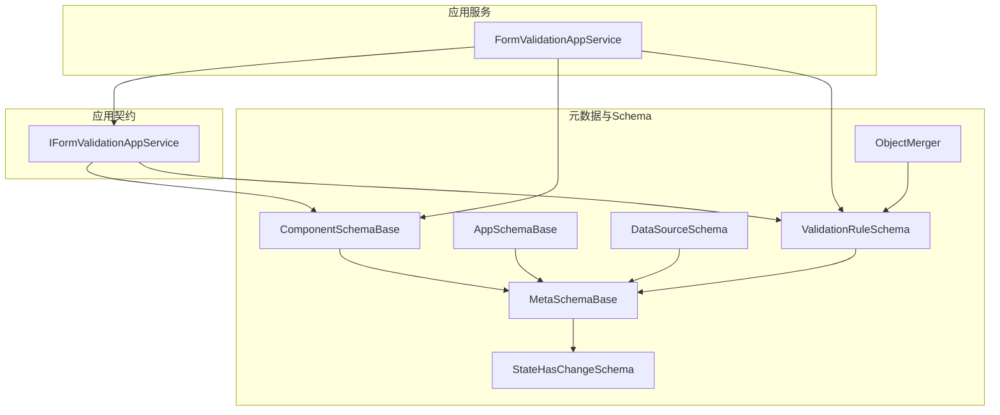
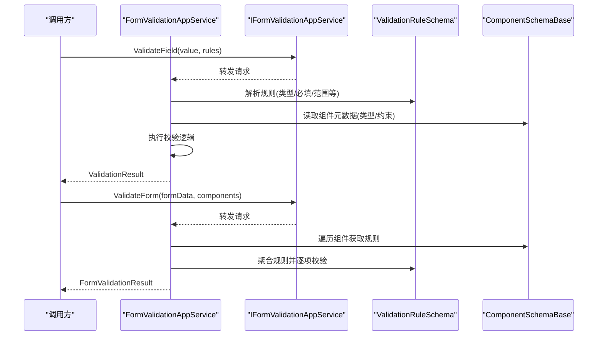
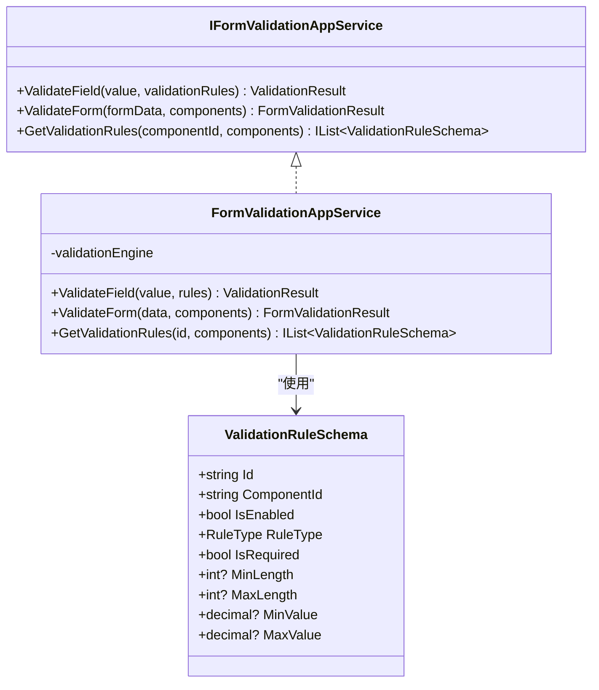
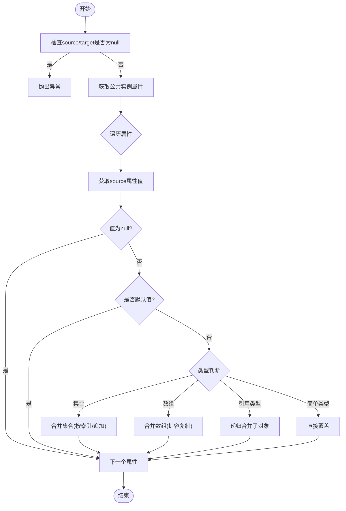
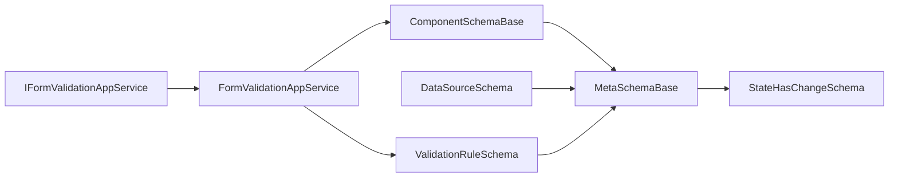

# Schema验证机制

<cite>
**本文引用的文件**   
- [ValidationRuleSchema.cs](file://src/LowCode/Common/H.LowCode.MetaSchema/PropertySchemas/ValidationRuleSchema.cs)
- [IFormValidationAppService.cs](file://src/LowCode/Common/H.LowCode.Application.Contracts/AppServices/IFormValidationAppService.cs)
- [FormValidationAppService.cs](file://src/LowCode/Common/H.LowCode.Application/Services/FormValidationAppService.cs)
- [ObjectMerger.cs](file://src/LowCode/Common/H.LowCode.MetaSchema/Utils/ObjectMerger.cs)
- [StateHasChangeSchema.cs](file://src/LowCode/Common/H.LowCode.MetaSchema/StateHasChangeSchema.cs)
- [MetaSchemaBase.cs](file://src/LowCode/Common/H.LowCode.MetaSchema/MetaSchemaBase.cs)
- [ComponentSchemaBase.cs](file://src/LowCode/Common/H.LowCode.MetaSchema/ComponentSchemaBase.cs)
- [AppSchemaBase.cs](file://src/LowCode/Common/H.LowCode.MetaSchema/AppSchemaBase.cs)
- [DataSourceSchema.cs](file://src/LowCode/Common/H.LowCode.MetaSchema/DataSourceSchema.cs)
- [APIDataSourceSchema.cs](file://src/LowCode/Common/H.LowCode.MetaSchema/DataSourceSchemas/APIDataSourceSchema.cs)
- [ComponentDataSourceSchema.cs](file://src/LowCode/Common/H.LowCode.MetaSchema/DataSourceSchemas/ComponentDataSourceSchema.cs)
- [ListDataSourceSchema.cs](file://src/LowCode/Common/H.LowCode.MetaSchema/DataSourceSchemas/ListDataSourceSchema.cs)
- [OptionDataSourceSchema.cs](file://src/LowCode/Common/H.LowCode.MetaSchema/DataSourceSchemas/OptionDataSourceSchema.cs)
- [PageDataSourceSchema.cs](file://src/LowCode/Common/H.LowCode.MetaSchema/DataSourceSchemas/PageDataSourceSchema.cs)
- [SQLDataSourceSchema.cs](file://src/LowCode/Common/H.LowCode.MetaSchema/DataSourceSchemas/SQLDataSourceSchema.cs)
- [TableFieldSchema.cs](file://src/LowCode/Common/H.LowCode.MetaSchema/DataSourceSchemas/TableFieldSchema.cs)
- [ComponentValueTypeEnum.cs](file://src/LowCode/Common/H.LowCode.MetaSchema/Enums/ComponentValueTypeEnum.cs)
- [EventTargetTypeEnum.cs](file://src/LowCode/Common/H.LowCode.MetaSchema/Enums/EventTargetTypeEnum.cs)
- [EventDataActionTypeEnum.cs](file://src/LowCode/Common/H.LowCode.MetaSchema/Enums/EventDataActionTypeEnum.cs)
- [ComponentDataSourceGroupTypeEnum.cs](file://src/LowCode/Common/H.LowCode.MetaSchema/Enums/ComponentDataSourceGroupTypeEnum.cs)
- [ComponentDataSourceTypeEnum.cs](file://src/LowCode/Common/H.LowCode.MetaSchema/Enums/ComponentDataSourceTypeEnum.cs)
- [PageDataSourceTypeEnum.cs](file://src/LowCode/Common/H.LowCode.MetaSchema/Enums/PageDataSourceTypeEnum.cs)
- [PageTypeEnum.cs](file://src/LowCode/Common/H.LowCode.MetaSchema/Enums/PageTypeEnum.cs)
- [PublishStatusEnum.cs](file://src/LowCode/Common/H.LowCode.MetaSchema/Enums/PublishStatusEnum.cs)
- [SupportPlatformEnum.cs](file://src/LowCode/Common/H.LowCode.MetaSchema/Enums/SupportPlatformEnum.cs)
- [MenuSchema.cs](file://src/LowCode/Common/H.LowCode.MetaSchema/MenuSchema.cs)
</cite>

## 目录
1. [简介](#简介)
2. [项目结构](#项目结构)
3. [核心组件](#核心组件)
4. [架构总览](#架构总览)
5. [详细组件分析](#详细组件分析)
6. [依赖关系分析](#依赖关系分析)
7. [性能考虑](#性能考虑)
8. [故障排查指南](#故障排查指南)
9. [结论](#结论)
10. [附录](#附录)

## 简介
本文件面向低代码平台的Schema验证机制，系统性阐述验证框架的设计与实现、规则定义与使用、内置与自定义验证器扩展方式、对象合并工具ObjectMerger的工作原理与应用场景、状态变更Schema的管理（监听与更新通知）、版本兼容性与迁移策略，以及最佳实践、性能优化建议与常见问题排查。文档力求在保持技术深度的同时，对非专业读者也具备可读性。

## 项目结构
围绕Schema验证的核心代码集中在LowCode\Common下的H.LowCode.MetaSchema与H.LowCode.Application、H.LowCode.Application.Contracts三个项目中：
- H.LowCode.MetaSchema：定义各类Schema模型、枚举、基础类型与工具类（如ObjectMerger）。
- H.LowCode.Application.Contracts：对外暴露的校验服务接口与结果DTO。
- H.LowCode.Application：校验服务的实现，串联Schema与验证逻辑。

图表来源
- [MetaSchemaBase.cs:1-19](file://src/LowCode/Common/H.LowCode.MetaSchema/MetaSchemaBase.cs#L1-L19)
- [StateHasChangeSchema.cs:1-16](file://src/LowCode/Common/H.LowCode.MetaSchema/StateHasChangeSchema.cs#L1-L16)
- [ComponentSchemaBase.cs](file://src/LowCode/Common/H.LowCode.MetaSchema/ComponentSchemaBase.cs)
- [AppSchemaBase.cs](file://src/LowCode/Common/H.LowCode.MetaSchema/AppSchemaBase.cs)
- [DataSourceSchema.cs](file://src/LowCode/Common/H.LowCode.MetaSchema/DataSourceSchema.cs)
- [ValidationRuleSchema.cs:1-59](file://src/LowCode/Common/H.LowCode.MetaSchema/PropertySchemas/ValidationRuleSchema.cs#L1-L59)
- [ObjectMerger.cs:1-176](file://src/LowCode/Common/H.LowCode.MetaSchema/Utils/ObjectMerger.cs#L1-L176)
- [IFormValidationAppService.cs:1-42](file://src/LowCode/Common/H.LowCode.Application.Contracts/AppServices/IFormValidationAppService.cs#L1-L42)
- [FormValidationAppService.cs](file://src/LowCode/Common/H.LowCode.Application/Services/FormValidationAppService.cs)

章节来源
- [ValidationRuleSchema.cs:1-59](file://src/LowCode/Common/H.LowCode.MetaSchema/PropertySchemas/ValidationRuleSchema.cs#L1-L59)
- [IFormValidationAppService.cs:1-42](file://src/LowCode/Common/H.LowCode.Application.Contracts/AppServices/IFormValidationAppService.cs#L1-L42)
- [ObjectMerger.cs:1-176](file://src/LowCode/Common/H.LowCode.MetaSchema/Utils/ObjectMerger.cs#L1-L176)
- [StateHasChangeSchema.cs:1-16](file://src/LowCode/Common/H.LowCode.MetaSchema/StateHasChangeSchema.cs#L1-L16)
- [MetaSchemaBase.cs:1-19](file://src/LowCode/Common/H.LowCode.MetaSchema/MetaSchemaBase.cs#L1-L19)

## 核心组件
- 校验规则Schema（ValidationRuleSchema）：描述字段级校验规则，包括是否启用、规则类型、必填、长度范围、数值范围等属性，用于驱动表单或组件字段的输入校验。
- 表单校验服务接口（IFormValidationAppService）：提供字段级与表单级的校验能力，以及根据组件列表获取对应校验规则的查询能力。
- 表单校验服务实现（FormValidationAppService）：实现接口定义的校验流程，结合ValidationRuleSchema与组件元数据进行校验并返回统一结果。
- 对象合并工具（ObjectMerger）：基于反射对复杂对象进行深度合并，支持集合与数组的增量合并，跳过默认值，避免覆盖未设置的配置项。
- 状态变更Schema（StateHasChangeSchema）：为Schema提供唯一StateKey与变更键管理能力，便于状态监听与差异化更新。
- 元数据基类（MetaSchemaBase）：为所有Schema提供创建者、修改者、时间戳等通用审计字段。

章节来源
- [ValidationRuleSchema.cs:1-59](file://src/LowCode/Common/H.LowCode.MetaSchema/PropertySchemas/ValidationRuleSchema.cs#L1-L59)
- [IFormValidationAppService.cs:1-42](file://src/LowCode/Common/H.LowCode.Application.Contracts/AppServices/IFormValidationAppService.cs#L1-L42)
- [FormValidationAppService.cs](file://src/LowCode/Common/H.LowCode.Application/Services/FormValidationAppService.cs)
- [ObjectMerger.cs:1-176](file://src/LowCode/Common/H.LowCode.MetaSchema/Utils/ObjectMerger.cs#L1-L176)
- [StateHasChangeSchema.cs:1-16](file://src/LowCode/Common/H.LowCode.MetaSchema/StateHasChangeSchema.cs#L1-L16)
- [MetaSchemaBase.cs:1-19](file://src/LowCode/Common/H.LowCode.MetaSchema/MetaSchemaBase.cs#L1-L19)

## 架构总览
下图展示了从调用方到校验服务再到Schema与规则的数据流与职责边界。

图表来源
- [IFormValidationAppService.cs:1-42](file://src/LowCode/Common/H.LowCode.Application.Contracts/AppServices/IFormValidationAppService.cs#L1-L42)
- [FormValidationAppService.cs](file://src/LowCode/Common/H.LowCode.Application/Services/FormValidationAppService.cs)
- [ValidationRuleSchema.cs:1-59](file://src/LowCode/Common/H.LowCode.MetaSchema/PropertySchemas/ValidationRuleSchema.cs#L1-L59)
- [ComponentSchemaBase.cs](file://src/LowCode/Common/H.LowCode.MetaSchema/ComponentSchemaBase.cs)

## 详细组件分析

### 校验规则Schema（ValidationRuleSchema）
- 作用：以JSON友好的属性描述字段校验规则，包含id、关联组件cid、是否启用、规则类型、必填、最小/最大长度、最小/最大值等。
- 设计要点：
  - 通过JsonPropertyName映射JSON字段名，便于前后端一致序列化。
  - 规则类型采用枚举，便于扩展新的校验器。
  - 可选数值与长度范围，支撑数字、文本等多类型输入校验。
- 使用方式：
  - 在组件Schema中声明字段对应的ValidationRuleSchema列表。
  - 校验服务根据组件ID查找规则，按顺序执行校验并汇总错误信息。

章节来源
- [ValidationRuleSchema.cs:1-59](file://src/LowCode/Common/H.LowCode.MetaSchema/PropertySchemas/ValidationRuleSchema.cs#L1-L59)

### 表单校验服务（IFormValidationAppService与FormValidationAppService）
- 接口能力：
  - ValidateField：对单个字段值依据规则进行校验，返回IsValid与ErrorMessage。
  - ValidateForm：对整表数据与组件列表进行批量校验，返回结构化结果。
  - GetValidationRules：根据组件ID与组件列表提取对应校验规则。
- 实现思路：
  - 将ValidationRuleSchema与ComponentSchemaBase结合，先做元数据层面的合法性检查，再执行具体规则校验。
  - 支持短路校验（如必填失败即停止后续规则），提升性能与用户体验。
  - 错误消息可本地化或模板化，便于多语言展示。

图表来源
- [IFormValidationAppService.cs:1-42](file://src/LowCode/Common/H.LowCode.Application.Contracts/AppServices/IFormValidationAppService.cs#L1-L42)
- [FormValidationAppService.cs](file://src/LowCode/Common/H.LowCode.Application/Services/FormValidationAppService.cs)
- [ValidationRuleSchema.cs:1-59](file://src/LowCode/Common/H.LowCode.MetaSchema/PropertySchemas/ValidationRuleSchema.cs#L1-L59)

章节来源
- [IFormValidationAppService.cs:1-42](file://src/LowCode/Common/H.LowCode.Application.Contracts/AppServices/IFormValidationAppService.cs#L1-L42)
- [FormValidationAppService.cs](file://src/LowCode/Common/H.LowCode.Application/Services/FormValidationAppService.cs)

### 对象合并工具（ObjectMerger）
- 目标：在不破坏已有配置的前提下，将源对象的非空且非默认值属性合并到目标对象，支持嵌套对象、集合与数组的增量合并。
- 关键行为：
  - 跳过默认值，避免覆盖未显式设置的配置。
  - 集合类型按索引位置合并元素；若目标较短则追加新元素。
  - 数组类型会创建足够长度的新数组并逐元素合并。
  - 引用类型递归合并，字符串作为简单类型直接覆盖。
- 适用场景：
  - Schema版本升级时的增量合并。
  - 用户自定义配置与系统默认配置的融合。
  - 运行时动态拼装复杂对象图。

图表来源
- [ObjectMerger.cs:1-176](file://src/LowCode/Common/H.LowCode.MetaSchema/Utils/ObjectMerger.cs#L1-L176)

章节来源
- [ObjectMerger.cs:1-176](file://src/LowCode/Common/H.LowCode.MetaSchema/Utils/ObjectMerger.cs#L1-L176)

### 状态变更Schema（StateHasChangeSchema与MetaSchemaBase）
- StateHasChangeSchema：为每个Schema分配唯一的StateKey，并提供变更键的方法，便于UI层进行细粒度状态更新与监听。
- MetaSchemaBase：继承自StateHasChangeSchema，增加CreatorId、CreationTime、ModifierId、ModificationTime等审计字段，统一所有Schema的元数据。
- 使用模式：
  - 在组件或页面Schema中维护StateKey，当Schema内容变化时可通过ChangeStateKey触发重新渲染或局部刷新。
  - 结合事件总线或Blazor的StateHasChanged机制，实现高效的状态同步。

章节来源
- [StateHasChangeSchema.cs:1-16](file://src/LowCode/Common/H.LowCode.MetaSchema/StateHasChangeSchema.cs#L1-L16)
- [MetaSchemaBase.cs:1-19](file://src/LowCode/Common/H.LowCode.MetaSchema/MetaSchemaBase.cs#L1-L19)

### 组件与数据源Schema
- ComponentSchemaBase：组件级别的元数据基类，承载组件属性、事件、数据绑定等描述。
- AppSchemaBase：应用级元数据基类，用于应用配置、主题、权限等。
- DataSourceSchema及其派生类型：
  - APIDataSourceSchema：API数据源配置（URL、方法、参数、头部、Body等）。
  - ComponentDataSourceSchema：从其他组件拉取数据。
  - ListDataSourceSchema：静态列表数据源。
  - OptionDataSourceSchema：选项型数据源（如下拉框选项）。
  - PageDataSourceSchema：页面级数据源。
  - SQLDataSourceSchema：SQL查询数据源。
  - TableFieldSchema：表格字段定义。
- 枚举体系：
  - ComponentValueTypeEnum：组件值类型。
  - EventTargetTypeEnum、EventDataActionTypeEnum：事件目标与动作类型。
  - ComponentDataSourceGroupTypeEnum、ComponentDataSourceTypeEnum：数据源分组与类型。
  - PageDataSourceTypeEnum、PageTypeEnum：页面数据源与页面类型。
  - PublishStatusEnum、SupportPlatformEnum：发布状态与平台支持。

章节来源
- [ComponentSchemaBase.cs](file://src/LowCode/Common/H.LowCode.MetaSchema/ComponentSchemaBase.cs)
- [AppSchemaBase.cs](file://src/LowCode/Common/H.LowCode.MetaSchema/AppSchemaBase.cs)
- [DataSourceSchema.cs](file://src/LowCode/Common/H.LowCode.MetaSchema/DataSourceSchema.cs)
- [APIDataourceSchema.cs](file://src/LowCode/Common/H.LowCode.MetaSchema/DataSourceSchemas/APIDataSourceSchema.cs)
- [ComponentDataSourceSchema.cs](file://src/LowCode/Common/H.LowCode.MetaSchema/DataSourceSchemas/ComponentDataSourceSchema.cs)
- [ListDataSourceSchema.cs](file://src/LowCode/Common/H.LowCode.MetaSchema/DataSourceSchemas/ListDataSourceSchema.cs)
- [OptionDataSourceSchema.cs](file://src/LowCode/Common/H.LowCode.MetaSchema/DataSourceSchemas/OptionDataSourceSchema.cs)
- [PageDataSourceSchema.cs](file://src/LowCode/Common/H.LowCode.MetaSchema/DataSourceSchemas/PageDataSourceSchema.cs)
- [SQLDataSourceSchema.cs](file://src/LowCode/Common/H.LowCode.MetaSchema/DataSourceSchemas/SQLDataSourceSchema.cs)
- [TableFieldSchema.cs](file://src/LowCode/Common/H.LowCode.MetaSchema/DataSourceSchemas/TableFieldSchema.cs)
- [ComponentValueTypeEnum.cs](file://src/LowCode/Common/H.LowCode.MetaSchema/Enums/ComponentValueTypeEnum.cs)
- [EventTargetTypeEnum.cs](file://src/LowCode/Common/H.LowCode.MetaSchema/Enums/EventTargetTypeEnum.cs)
- [EventDataActionTypeEnum.cs](file://src/LowCode/Common/H.LowCode.MetaSchema/Enums/EventDataActionTypeEnum.cs)
- [ComponentDataSourceGroupTypeEnum.cs](file://src/LowCode/Common/H.LowCode.MetaSchema/Enums/ComponentDataSourceGroupTypeEnum.cs)
- [ComponentDataSourceTypeEnum.cs](file://src/LowCode/Common/H.LowCode.MetaSchema/Enums/ComponentDataSourceTypeEnum.cs)
- [PageDataSourceTypeEnum.cs](file://src/LowCode/Common/H.LowCode.MetaSchema/Enums/PageDataSourceTypeEnum.cs)
- [PageTypeEnum.cs](file://src/LowCode/Common/H.LowCode.MetaSchema/Enums/PageTypeEnum.cs)
- [PublishStatusEnum.cs](file://src/LowCode/Common/H.LowCode.MetaSchema/Enums/PublishStatusEnum.cs)
- [SupportPlatformEnum.cs](file://src/LowCode/Common/H.LowCode.MetaSchema/Enums/SupportPlatformEnum.cs)
- [MenuSchema.cs](file://src/LowCode/Common/H.LowCode.MetaSchema/MenuSchema.cs)

## 依赖关系分析
- 校验服务依赖：
  - IFormValidationAppService定义了对外契约，FormValidationAppService实现具体校验逻辑。
  - ValidationRuleSchema与ComponentSchemaBase是校验的核心输入。
- Schema层次：
  - MetaSchemaBase为所有Schema提供审计字段与StateKey能力。
  - ComponentSchemaBase、AppSchemaBase分别承载组件与应用级元数据。
  - DataSourceSchema族提供多样化数据源配置。
- 工具依赖：
  - ObjectMerger被用于Schema合并与版本迁移，减少破坏性变更。

图表来源
- [IFormValidationAppService.cs:1-42](file://src/LowCode/Common/H.LowCode.Application.Contracts/AppServices/IFormValidationAppService.cs#L1-L42)
- [FormValidationAppService.cs](file://src/LowCode/Common/H.LowCode.Application/Services/FormValidationAppService.cs)
- [ValidationRuleSchema.cs:1-59](file://src/LowCode/Common/H.LowCode.MetaSchema/PropertySchemas/ValidationRuleSchema.cs#L1-L59)
- [ComponentSchemaBase.cs](file://src/LowCode/Common/H.LowCode.MetaSchema/ComponentSchemaBase.cs)
- [MetaSchemaBase.cs:1-19](file://src/LowCode/Common/H.LowCode.MetaSchema/MetaSchemaBase.cs#L1-L19)
- [StateHasChangeSchema.cs:1-16](file://src/LowCode/Common/H.LowCode.MetaSchema/StateHasChangeSchema.cs#L1-L16)
- [DataSourceSchema.cs](file://src/LowCode/Common/H.LowCode.MetaSchema/DataSourceSchema.cs)

章节来源
- [IFormValidationAppService.cs:1-42](file://src/LowCode/Common/H.LowCode.Application.Contracts/AppServices/IFormValidationAppService.cs#L1-L42)
- [FormValidationAppService.cs](file://src/LowCode/Common/H.LowCode.Application/Services/FormValidationAppService.cs)
- [ValidationRuleSchema.cs:1-59](file://src/LowCode/Common/H.LowCode.MetaSchema/PropertySchemas/ValidationRuleSchema.cs#L1-L59)
- [ComponentSchemaBase.cs](file://src/LowCode/Common/H.LowCode.MetaSchema/ComponentSchemaBase.cs)
- [MetaSchemaBase.cs:1-19](file://src/LowCode/Common/H.LowCode.MetaSchema/MetaSchemaBase.cs#L1-L19)
- [StateHasChangeSchema.cs:1-16](file://src/LowCode/Common/H.LowCode.MetaSchema/StateHasChangeSchema.cs#L1-L16)
- [DataSourceSchema.cs](file://src/LowCode/Common/H.LowCode.MetaSchema/DataSourceSchema.cs)

## 性能考虑
- 校验短路：对于必填、格式不匹配等快速失败的规则优先执行，减少不必要的计算。
- 规则缓存：对高频使用的组件规则进行内存缓存，避免重复解析。
- 批量校验：ValidateForm应尽量避免N+1查询，集中处理错误并一次性返回。
- 对象合并优化：ObjectMerger在大量集合合并时注意避免频繁创建新数组，必要时复用缓冲区。
- 异步与批处理：长耗时校验（如远程校验）应异步执行，前端使用防抖与节流降低请求频率。

[本节为通用指导，无需特定文件来源]

## 故障排查指南
- 常见校验错误
  - 必填校验失败：检查ValidationRuleSchema的IsRequired与组件值是否为空。
  - 长度/数值范围越界：核对MinLength/MaxLength、MinValue/MaxValue与输入值类型是否匹配。
  - 规则未生效：确认IsEnabled为true且ComponentId与组件一致。
- 合并问题
  - 默认值覆盖：确认ObjectMerger是否正确跳过默认值，避免覆盖未设置字段。
  - 集合/数组不一致：检查索引对齐与元素类型是否可合并。
- 状态更新异常
  - StateKey未变化：确保ChangeStateKey在Schema变更后调用，触发UI刷新。
  - 审计字段缺失：MetaSchemaBase的创建/修改时间与ID需由上游填充。

章节来源
- [ValidationRuleSchema.cs:1-59](file://src/LowCode/Common/H.LowCode.MetaSchema/PropertySchemas/ValidationRuleSchema.cs#L1-L59)
- [ObjectMerger.cs:1-176](file://src/LowCode/Common/H.LowCode.MetaSchema/Utils/ObjectMerger.cs#L1-L176)
- [StateHasChangeSchema.cs:1-16](file://src/LowCode/Common/H.LowCode.MetaSchema/StateHasChangeSchema.cs#L1-L16)
- [MetaSchemaBase.cs:1-19](file://src/LowCode/Common/H.LowCode.MetaSchema/MetaSchemaBase.cs#L1-L19)

## 结论
该低代码平台的Schema验证机制以ValidationRuleSchema为核心，配合IFormValidationAppService与FormValidationAppService形成清晰的校验分层。ObjectMerger为Schema版本兼容与配置融合提供了可靠保障，StateHasChangeSchema与MetaSchemaBase则为状态管理与审计奠定基础。通过合理的规则设计与性能优化策略，可在保证灵活性的同时维持良好的运行效率与用户体验。

[本节为总结性内容，无需特定文件来源]

## 附录
- 最佳实践
  - 明确规则优先级与短路策略，提升校验性能。
  - 使用统一的错误消息模板，便于国际化与可维护性。
  - 对复杂对象合并进行单元测试，确保增量合并的正确性。
  - 在Schema变更时记录审计字段，便于追溯与回滚。
- 版本兼容与迁移策略
  - 新增字段默认跳过合并，避免破坏旧版Schema。
  - 对废弃字段提供迁移脚本或兼容层，逐步淘汰。
  - 使用ObjectMerger进行增量升级，保留用户自定义配置。

[本节为通用指导，无需特定文件来源]