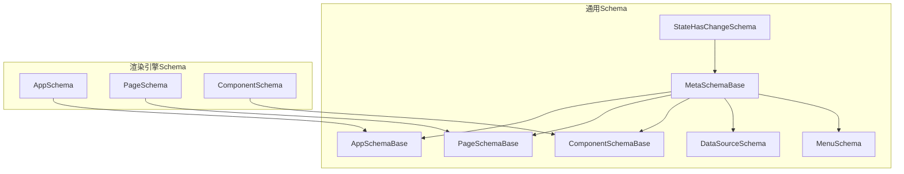
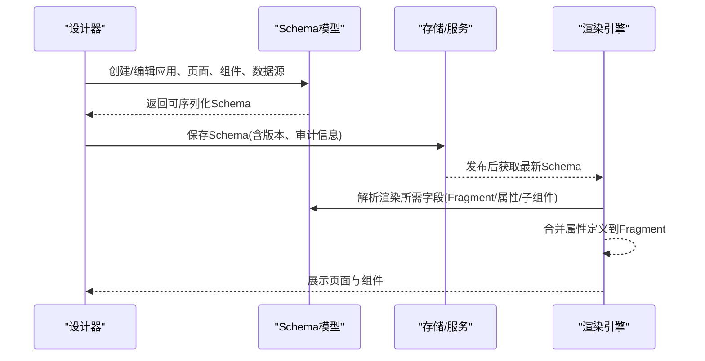
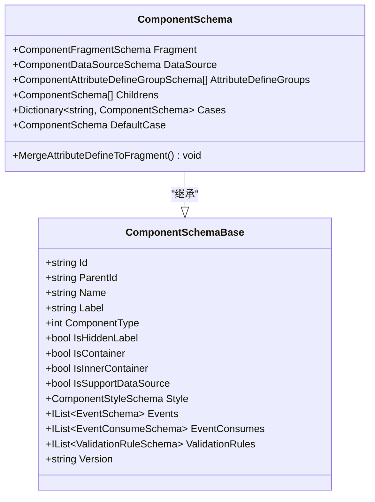
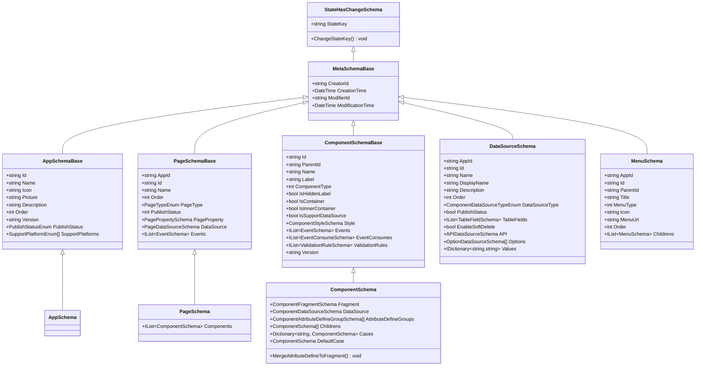

# 元数据Schema

<cite>
**本文引用的文件**   
- [MetaSchemaBase.cs](file://src/LowCode/Common/H.LowCode.MetaSchema/MetaSchemaBase.cs)
- [AppSchemaBase.cs](file://src/LowCode/Common/H.LowCode.MetaSchema/AppSchemaBase.cs)
- [PageSchemaBase.cs](file://src/LowCode/Common/H.LowCode.MetaSchema/PageSchemaBase.cs)
- [ComponentSchemaBase.cs](file://src/LowCode/Common/H.LowCode.MetaSchema/ComponentSchemaBase.cs)
- [DataSourceSchema.cs](file://src/LowCode/Common/H.LowCode.MetaSchema/DataSourceSchema.cs)
- [StateHasChangeSchema.cs](file://src/LowCode/Common/H.LowCode.MetaSchema/StateHasChangeSchema.cs)
- [MenuSchema.cs](file://src/LowCode/Common/H.LowCode.MetaSchema/MenuSchema.cs)
- [AppSchema.cs](file://src/LowCode/Common/H.LowCode.MetaSchema.RenderEngine/AppSchema.cs)
- [PageSchema.cs](file://src/LowCode/Common/H.LowCode.MetaSchema.RenderEngine/PageSchema.cs)
- [ComponentSchema.cs](file://src/LowCode/Common/H.LowCode.MetaSchema.RenderEngine/ComponentSchema.cs)
</cite>

## 目录
1. [简介](#简介)
2. [项目结构](#项目结构)
3. [核心组件](#核心组件)
4. [架构总览](#架构总览)
5. [详细组件分析](#详细组件分析)
6. [依赖关系分析](#依赖关系分析)
7. [性能考量](#性能考量)
8. [故障排查指南](#故障排查指南)
9. [结论](#结论)
10. [附录](#附录)

## 简介
本文件为低代码元数据Schema系统的权威文档，聚焦于Schema定义规范与数据结构、验证机制与版本兼容、设计引擎与渲染引擎对Schema的不同处理与使用场景、编辑器扩展方式、最佳实践与常见模式，以及迁移与升级策略。读者无需深入底层实现即可理解并正确使用Schema进行应用、页面、组件与数据源的建模与演进。

## 项目结构
该Schema体系位于LowCode公共模块中，分为“通用Schema基类”和“渲染引擎专用Schema”。设计期与运行期的Schema通过继承与扩展解耦：
- 通用基类（MetaSchemaBase等）提供统一的元数据字段与生命周期标记
- 渲染引擎Schema（AppSchema、PageSchema、ComponentSchema）面向运行时渲染与数据绑定
- 菜单Schema用于导航树描述

图表来源 
- [MetaSchemaBase.cs:1-20](file://src/LowCode/Common/H.LowCode.MetaSchema/MetaSchemaBase.cs#L1-L20)
- [AppSchemaBase.cs:1-32](file://src/LowCode/Common/H.LowCode.MetaSchema/AppSchemaBase.cs#L1-L32)
- [PageSchemaBase.cs:1-40](file://src/LowCode/Common/H.LowCode.MetaSchema/PageSchemaBase.cs#L1-L40)
- [ComponentSchemaBase.cs:1-104](file://src/LowCode/Common/H.LowCode.MetaSchema/ComponentSchemaBase.cs#L1-L104)
- [DataSourceSchema.cs:1-70](file://src/LowCode/Common/H.LowCode.MetaSchema/DataSourceSchema.cs#L1-L70)
- [MenuSchema.cs:1-39](file://src/LowCode/Common/H.LowCode.MetaSchema/MenuSchema.cs#L1-L39)
- [StateHasChangeSchema.cs:1-17](file://src/LowCode/Common/H.LowCode.MetaSchema/StateHasChangeSchema.cs#L1-L17)
- [AppSchema.cs:1-10](file://src/LowCode/Common/H.LowCode.MetaSchema.RenderEngine/AppSchema.cs#L1-L10)
- [PageSchema.cs:1-10](file://src/LowCode/Common/H.LowCode.MetaSchema.RenderEngine/PageSchema.cs#L1-L10)
- [ComponentSchema.cs:1-83](file://src/LowCode/Common/H.LowCode.MetaSchema.RenderEngine/ComponentSchema.cs#L1-L83)

章节来源
- [MetaSchemaBase.cs:1-20](file://src/LowCode/Common/H.LowCode.MetaSchema/MetaSchemaBase.cs#L1-L20)
- [AppSchemaBase.cs:1-32](file://src/LowCode/Common/H.LowCode.MetaSchema/AppSchemaBase.cs#L1-L32)
- [PageSchemaBase.cs:1-40](file://src/LowCode/Common/H.LowCode.MetaSchema/PageSchemaBase.cs#L1-L40)
- [ComponentSchemaBase.cs:1-104](file://src/LowCode/Common/H.LowCode.MetaSchema/ComponentSchemaBase.cs#L1-L104)
- [DataSourceSchema.cs:1-70](file://src/LowCode/Common/H.LowCode.MetaSchema/DataSourceSchema.cs#L1-L70)
- [MenuSchema.cs:1-39](file://src/LowCode/Common/H.LowCode.MetaSchema/MenuSchema.cs#L1-L39)
- [StateHasChangeSchema.cs:1-17](file://src/LowCode/Common/H.LowCode.MetaSchema/StateHasChangeSchema.cs#L1-L17)
- [AppSchema.cs:1-10](file://src/LowCode/Common/H.LowCode.MetaSchema.RenderEngine/AppSchema.cs#L1-L10)
- [PageSchema.cs:1-10](file://src/LowCode/Common/H.LowCode.MetaSchema.RenderEngine/PageSchema.cs#L1-L10)
- [ComponentSchema.cs:1-83](file://src/LowCode/Common/H.LowCode.MetaSchema.RenderEngine/ComponentSchema.cs#L1-L83)

## 核心组件
本节概述Schema的核心类型与职责边界，帮助快速定位与理解各Schema的用途。

- MetaSchemaBase：所有Schema的元数据基类，统一包含创建者、创建时间、修改者、修改时间等审计字段，便于追踪与回溯。
- StateHasChangeSchema：为每个实例生成唯一StateKey，并在需要时刷新状态，支撑渲染时的细粒度更新。
- AppSchemaBase：应用级Schema基础，包含Id、名称、图标、图片、描述、排序、版本、发布状态、支持平台等。
- PageSchemaBase：页面级Schema基础，包含应用关联、页面Id、名称、排序、页面类型、发布状态、页面属性、数据源、事件等。
- ComponentSchemaBase：组件级Schema基础，包含实例Id、父Id、名称、标签、类型、容器标识、样式、事件、事件消费、校验规则、版本等；并提供容器与数据源支持的约束逻辑。
- DataSourceSchema：数据源Schema，支持表、API、选项/字典等多种数据源类型，并附带字段、软删除开关、值映射等。
- MenuSchema：菜单树节点Schema，支持父子层级、标题、图标、路径、排序等。
- 渲染引擎Schema：AppSchema、PageSchema、ComponentSchema在基类基础上补充渲染所需字段，如组件Fragment、属性分组、子组件、条件分支等。

章节来源
- [MetaSchemaBase.cs:1-20](file://src/LowCode/Common/H.LowCode.MetaSchema/MetaSchemaBase.cs#L1-L20)
- [StateHasChangeSchema.cs:1-17](file://src/LowCode/Common/H.LowCode.MetaSchema/StateHasChangeSchema.cs#L1-L17)
- [AppSchemaBase.cs:1-32](file://src/LowCode/Common/H.LowCode.MetaSchema/AppSchemaBase.cs#L1-L32)
- [PageSchemaBase.cs:1-40](file://src/LowCode/Common/H.LowCode.MetaSchema/PageSchemaBase.cs#L1-L40)
- [ComponentSchemaBase.cs:1-104](file://src/LowCode/Common/H.LowCode.MetaSchema/ComponentSchemaBase.cs#L1-L104)
- [DataSourceSchema.cs:1-70](file://src/LowCode/Common/H.LowCode.MetaSchema/DataSourceSchema.cs#L1-L70)
- [MenuSchema.cs:1-39](file://src/LowCode/Common/H.LowCode.MetaSchema/MenuSchema.cs#L1-L39)
- [AppSchema.cs:1-10](file://src/LowCode/Common/H.LowCode.MetaSchema.RenderEngine/AppSchema.cs#L1-L10)
- [PageSchema.cs:1-10](file://src/LowCode/Common/H.LowCode.MetaSchema.RenderEngine/PageSchema.cs#L1-L10)
- [ComponentSchema.cs:1-83](file://src/LowCode/Common/H.LowCode.MetaSchema.RenderEngine/ComponentSchema.cs#L1-L83)

## 架构总览
下图展示了Schema从设计期到运行期的流转与差异：设计期以基类为主，强调可编辑性与扩展性；运行期以渲染引擎Schema为主，强调渲染效率与数据绑定能力。

图表来源 
- [PageSchema.cs:1-10](file://src/LowCode/Common/H.LowCode.MetaSchema.RenderEngine/PageSchema.cs#L1-L10)
- [ComponentSchema.cs:1-83](file://src/LowCode/Common/H.LowCode.MetaSchema.RenderEngine/ComponentSchema.cs#L1-L83)
- [AppSchemaBase.cs:1-32](file://src/LowCode/Common/H.LowCode.MetaSchema/AppSchemaBase.cs#L1-L32)
- [PageSchemaBase.cs:1-40](file://src/LowCode/Common/H.LowCode.MetaSchema/PageSchemaBase.cs#L1-L40)
- [ComponentSchemaBase.cs:1-104](file://src/LowCode/Common/H.LowCode.MetaSchema/ComponentSchemaBase.cs#L1-L104)

## 详细组件分析

### 应用Schema（AppSchema）
- 职责：描述应用基本信息、版本、发布状态与多平台支持
- 关键字段：Id、Name、Icon、Picture、Description、Order、Version、PublishStatus、SupportPlatforms
- 设计要点：
  - Version用于版本控制与兼容性判断
  - PublishStatus用于发布流程状态管理
  - SupportPlatforms用于跨端适配

章节来源
- [AppSchemaBase.cs:1-32](file://src/LowCode/Common/H.LowCode.MetaSchema/AppSchemaBase.cs#L1-L32)
- [AppSchema.cs:1-10](file://src/LowCode/Common/H.LowCode.MetaSchema.RenderEngine/AppSchema.cs#L1-L10)

### 页面Schema（PageSchema）
- 职责：描述页面结构、属性、数据源与事件
- 关键字段：AppId、Id、Name、Order、PageType、PublishStatus、PageProperty、DataSource、Events
- 渲染增强：Components列表承载组件树，驱动渲染引擎构建UI

章节来源
- [PageSchemaBase.cs:1-40](file://src/LowCode/Common/H.LowCode.MetaSchema/PageSchemaBase.cs#L1-L40)
- [PageSchema.cs:1-10](file://src/LowCode/Common/H.LowCode.MetaSchema.RenderEngine/PageSchema.cs#L1-L10)

### 组件Schema（ComponentSchema）
- 职责：描述组件实例、样式、事件、校验规则、子组件与条件渲染
- 关键字段：Id、ParentId、Name、Label、ComponentType、IsContainer、Style、Events、EventConsumes、ValidationRules、Version
- 渲染增强：
  - Fragment：组件渲染片段，承载最终属性集合
  - AttributeDefineGroups：属性定义分组，用于将设计期配置转换为渲染期属性
  - Childrens：子组件数组，形成组件树
  - Cases/DefaultCase：条件分支渲染
  - MergeAttributeDefineToFragment：将属性定义合并至Fragment，减少重复计算

图表来源 
- [ComponentSchemaBase.cs:1-104](file://src/LowCode/Common/H.LowCode.MetaSchema/ComponentSchemaBase.cs#L1-L104)
- [ComponentSchema.cs:1-83](file://src/LowCode/Common/H.LowCode.MetaSchema.RenderEngine/ComponentSchema.cs#L1-L83)

章节来源
- [ComponentSchemaBase.cs:1-104](file://src/LowCode/Common/H.LowCode.MetaSchema/ComponentSchemaBase.cs#L1-L104)
- [ComponentSchema.cs:1-83](file://src/LowCode/Common/H.LowCode.MetaSchema.RenderEngine/ComponentSchema.cs#L1-L83)

### 数据源Schema（DataSourceSchema）
- 职责：抽象不同数据源类型，统一访问接口
- 支持类型：
  - Table：表数据源，包含字段定义与软删除开关
  - API：API数据源，包含请求配置
  - Option：选项/字典数据源，包含静态选项与键值映射
- 关键字段：AppId、Id、Name、DisplayName、Description、Order、DataSourceType、PublishStatus、TableFields、EnableSoftDelete、API、Options、Values

章节来源
- [DataSourceSchema.cs:1-70](file://src/LowCode/Common/H.LowCode.MetaSchema/DataSourceSchema.cs#L1-L70)

### 菜单Schema（MenuSchema）
- 职责：描述应用菜单树结构
- 关键字段：AppId、Id、ParentId、Title、MenuType、Icon、MenuUrl、Order、Childrens

章节来源
- [MenuSchema.cs:1-39](file://src/LowCode/Common/H.LowCode.MetaSchema/MenuSchema.cs#L1-L39)

### 元数据与状态（MetaSchemaBase、StateHasChangeSchema）
- MetaSchemaBase：统一审计字段（CreatorId、CreationTime、ModifierId、ModificationTime）
- StateHasChangeSchema：为每个实例生成StateKey，支持按需刷新

章节来源
- [MetaSchemaBase.cs:1-20](file://src/LowCode/Common/H.LowCode.MetaSchema/MetaSchemaBase.cs#L1-L20)
- [StateHasChangeSchema.cs:1-17](file://src/LowCode/Common/H.LowCode.MetaSchema/StateHasChangeSchema.cs#L1-L17)

## 依赖关系分析
- 继承关系：
  - AppSchemaBase、PageSchemaBase、ComponentSchemaBase均继承自MetaSchemaBase
  - MetaSchemaBase继承自StateHasChangeSchema
  - 渲染引擎Schema（AppSchema、PageSchema、ComponentSchema）分别继承对应基类
- 组合关系：
  - PageSchemaBase组合PagePropertySchema、PageDataSourceSchema、EventSchema
  - ComponentSchemaBase组合ComponentStyleSchema、EventSchema、EventConsumeSchema、ValidationRuleSchema
  - ComponentSchema组合ComponentFragmentSchema、ComponentDataSourceSchema、ComponentAttributeDefineGroupSchema、子组件数组
- 关键耦合点：
  - ComponentSchema.MergeAttributeDefineToFragment将设计期属性定义合并到渲染期Fragment，降低运行时开销
  - DataSourceSchema的多态字段（Table/API/Option）需按类型解析

图表来源 
- [StateHasChangeSchema.cs:1-17](file://src/LowCode/Common/H.LowCode.MetaSchema/StateHasChangeSchema.cs#L1-L17)
- [MetaSchemaBase.cs:1-20](file://src/LowCode/Common/H.LowCode.MetaSchema/MetaSchemaBase.cs#L1-L20)
- [AppSchemaBase.cs:1-32](file://src/LowCode/Common/H.LowCode.MetaSchema/AppSchemaBase.cs#L1-L32)
- [PageSchemaBase.cs:1-40](file://src/LowCode/Common/H.LowCode.MetaSchema/PageSchemaBase.cs#L1-L40)
- [ComponentSchemaBase.cs:1-104](file://src/LowCode/Common/H.LowCode.MetaSchema/ComponentSchemaBase.cs#L1-L104)
- [DataSourceSchema.cs:1-70](file://src/LowCode/Common/H.LowCode.MetaSchema/DataSourceSchema.cs#L1-L70)
- [MenuSchema.cs:1-39](file://src/LowCode/Common/H.LowCode.MetaSchema/MenuSchema.cs#L1-L39)
- [AppSchema.cs:1-10](file://src/LowCode/Common/H.LowCode.MetaSchema.RenderEngine/AppSchema.cs#L1-L10)
- [PageSchema.cs:1-10](file://src/LowCode/Common/H.LowCode.MetaSchema.RenderEngine/PageSchema.cs#L1-L10)
- [ComponentSchema.cs:1-83](file://src/LowCode/Common/H.LowCode.MetaSchema.RenderEngine/ComponentSchema.cs#L1-L83)

## 性能考量
- 属性合并优化：ComponentSchema.MergeAttributeDefineToFragment在设计期或加载时将属性定义合并到Fragment，避免每次渲染重复计算，提升渲染性能。
- 状态刷新粒度：StateHasChangeSchema的StateKey可用于局部刷新，减少不必要的重渲染。
- 数据源选择：优先使用缓存与分页的数据源配置，避免大对象一次性加载。
- 条件渲染：合理使用Cases/DefaultCase，避免过深的条件分支导致渲染复杂度上升。

[本节为通用指导，不直接分析具体文件]

## 故障排查指南
- 组件未渲染或属性缺失：
  - 检查ComponentSchema.AttributeDefineGroups是否已正确合并到Fragment（调用MergeAttributeDefineToFragment）。
  - 确认ComponentSchema.IsContainer与IsSupportDataSource的逻辑是否符合预期（容器组件不支持数据源）。
- 页面无法加载：
  - 校验PageSchema.Components是否为空或存在非法引用。
  - 检查PageSchema.DataSource配置是否与组件期望一致。
- 数据源异常：
  - 根据DataSourceType区分Table/API/Option，逐项核对字段、API地址、选项映射。
  - 启用软删除时需确保后端查询逻辑匹配。
- 版本兼容问题：
  - 对比Schema.Version与运行期期望版本，必要时执行迁移脚本或降级策略。

章节来源
- [ComponentSchema.cs:1-83](file://src/LowCode/Common/H.LowCode.MetaSchema.RenderEngine/ComponentSchema.cs#L1-L83)
- [ComponentSchemaBase.cs:1-104](file://src/LowCode/Common/H.LowCode.MetaSchema/ComponentSchemaBase.cs#L1-L104)
- [PageSchema.cs:1-10](file://src/LowCode/Common/H.LowCode.MetaSchema.RenderEngine/PageSchema.cs#L1-L10)
- [DataSourceSchema.cs:1-70](file://src/LowCode/Common/H.LowCode.MetaSchema/DataSourceSchema.cs#L1-L70)

## 结论
本Schema体系通过清晰的层次结构与职责划分，实现了设计期与运行期的有效解耦。基类提供统一的元数据与状态管理能力，渲染引擎Schema专注于渲染与数据绑定。借助属性合并、状态键与条件渲染等机制，系统在可扩展性与性能之间取得平衡。建议遵循本文的最佳实践与迁移策略，持续完善Schema生态。

[本节为总结性内容，不直接分析具体文件]

## 附录

### Schema验证机制与版本兼容性
- 验证建议：
  - 必填字段校验（如Id、Name、DataSourceType）
  - 类型校验（如PageType、ComponentType、PublishStatus）
  - 关联校验（如AppId一致性、父子Id有效性）
  - 业务规则校验（如容器组件禁用数据源）
- 版本兼容：
  - 使用Schema.Version进行向后兼容判断
  - 提供迁移工具将旧版Schema升级到新版
  - 在渲染引擎中对未知字段做容错处理

[本节为通用指导，不直接分析具体文件]

### 设计引擎与渲染引擎的差异与使用场景
- 设计引擎：
  - 侧重可编辑性与扩展性，使用基类Schema进行可视化编辑
  - 支持属性分组、事件编排、校验规则配置
- 渲染引擎：
  - 侧重性能与稳定性，使用渲染引擎Schema进行高效渲染
  - 将设计期配置转换为Fragment与属性集合，减少运行时开销

[本节为通用指导，不直接分析具体文件]

### Schema编辑器扩展方法
- 新增组件类型：
  - 扩展ComponentSchemaBase，定义新组件的属性与行为
  - 在渲染引擎中注册对应的ComponentSchema
- 新增数据源类型：
  - 扩展DataSourceSchema，增加新的DataSourceType分支
  - 在数据访问层实现对应类型的读取逻辑
- 自定义属性定义：
  - 扩展ComponentAttributeDefineGroupSchema，定义新的属性输入控件
  - 在编辑器中提供对应的编辑界面

[本节为通用指导，不直接分析具体文件]

### Schema设计的最佳实践与常见模式
- 单一职责：每个Schema只负责一个领域概念（应用、页面、组件、数据源）
- 向后兼容：新增字段保持可选，避免破坏旧版Schema
- 明确版本：为每个Schema维护Version，便于升级与回滚
- 合理拆分：将复杂组件拆分为多个子组件，提升复用性
- 数据源抽象：统一数据源接口，屏蔽底层差异

[本节为通用指导，不直接分析具体文件]

### Schema迁移与升级策略
- 增量迁移：按版本逐步迁移，避免一次性大变更
- 双向兼容：新旧Schema同时支持，平滑过渡
- 自动化检测：在加载时检测版本差异并提示用户
- 回滚机制：保留历史版本，支持快速回滚

[本节为通用指导，不直接分析具体文件]