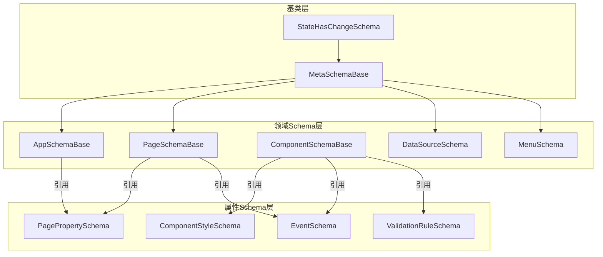
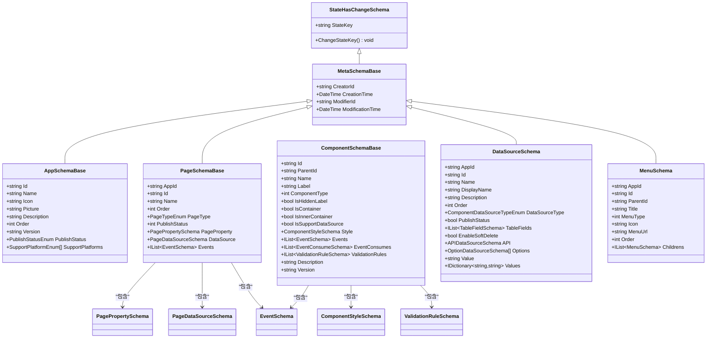
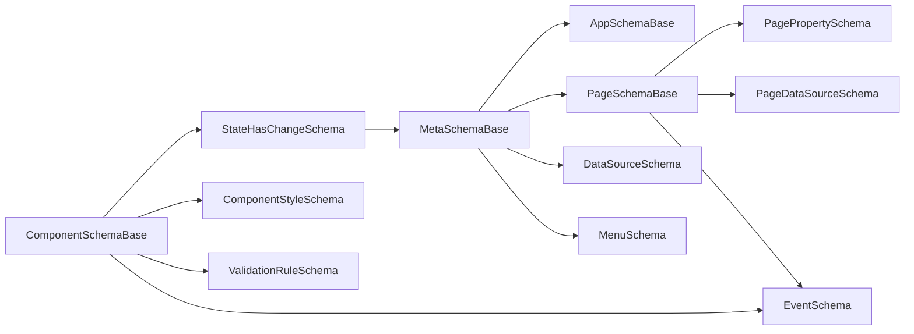

# 基础Schema类型

<cite>
**本文引用的文件**
- [MetaSchemaBase.cs](file://src/LowCode/Common/H.LowCode.MetaSchema/MetaSchemaBase.cs)
- [StateHasChangeSchema.cs](file://src/LowCode/Common/H.LowCode.MetaSchema/StateHasChangeSchema.cs)
- [AppSchemaBase.cs](file://src/LowCode/Common/H.LowCode.MetaSchema/AppSchemaBase.cs)
- [PageSchemaBase.cs](file://src/LowCode/Common/H.LowCode.MetaSchema/PageSchemaBase.cs)
- [ComponentSchemaBase.cs](file://src/LowCode/Common/H.LowCode.MetaSchema/ComponentSchemaBase.cs)
- [DataSourceSchema.cs](file://src/LowCode/Common/H.LowCode.MetaSchema/DataSourceSchema.cs)
- [MenuSchema.cs](file://src/LowCode/Common/H.LowCode.MetaSchema/MenuSchema.cs)
- [EventSchema.cs](file://src/LowCode/Common/H.LowCode.MetaSchema/PropertySchemas/EventSchema.cs)
- [ValidationRuleSchema.cs](file://src/LowCode/Common/H.LowCode.MetaSchema/PropertySchemas/ValidationRuleSchema.cs)
- [ComponentStyleSchema.cs](file://src/LowCode/Common/H.LowCode.MetaSchema/PropertySchemas/ComponentStyleSchema.cs)
- [PagePropertySchema.cs](file://src/LowCode/Common/H.LowCode.MetaSchema/PropertySchemas/PagePropertySchema.cs)
</cite>

## 目录
1. [简介](#简介)
2. [项目结构](#项目结构)
3. [核心组件](#核心组件)
4. [架构总览](#架构总览)
5. [详细组件分析](#详细组件分析)
6. [依赖关系分析](#依赖关系分析)
7. [性能考虑](#性能考虑)
8. [故障排查指南](#故障排查指南)
9. [结论](#结论)
10. [附录：扩展与自定义指南](#附录扩展与自定义指南)

## 简介
本文件面向低代码平台的基础Schema类型，系统性阐述以下要点：
- MetaSchemaBase基类的设计模式与核心能力（审计字段、序列化约定、状态键机制）
- AppSchemaBase应用Schema的结构（应用元数据、版本、发布状态、支持平台等）
- PageSchemaBase页面Schema的层次结构与继承关系（页面属性、数据源、事件）
- ComponentSchemaBase组件Schema的通用定义（属性、样式、交互行为、校验规则）
- Schema类型的扩展方法与自定义实现指南（如何新增属性、事件、数据源与校验规则）

## 项目结构
围绕H.LowCode.MetaSchema模块，Schema类型按“基类-派生类-属性Schema”分层组织：
- 基类层：StateHasChangeSchema、MetaSchemaBase
- 领域Schema层：AppSchemaBase、PageSchemaBase、ComponentSchemaBase、DataSourceSchema、MenuSchema
- 属性Schema层：ComponentStyleSchema、PagePropertySchema、EventSchema、ValidationRuleSchema等

图表来源
- [StateHasChangeSchema.cs](file://src/LowCode/Common/H.LowCode.MetaSchema/StateHasChangeSchema.cs)
- [MetaSchemaBase.cs](file://src/LowCode/Common/H.LowCode.MetaSchema/MetaSchemaBase.cs)
- [AppSchemaBase.cs](file://src/LowCode/Common/H.LowCode.MetaSchema/AppSchemaBase.cs)
- [PageSchemaBase.cs](file://src/LowCode/Common/H.LowCode.MetaSchema/PageSchemaBase.cs)
- [ComponentSchemaBase.cs](file://src/LowCode/Common/H.LowCode.MetaSchema/ComponentSchemaBase.cs)
- [DataSourceSchema.cs](file://src/LowCode/Common/H.LowCode.MetaSchema/DataSourceSchema.cs)
- [MenuSchema.cs](file://src/LowCode/Common/H.LowCode.MetaSchema/MenuSchema.cs)
- [ComponentStyleSchema.cs](file://src/LowCode/Common/H.LowCode.MetaSchema/PropertySchemas/ComponentStyleSchema.cs)
- [PagePropertySchema.cs](file://src/LowCode/Common/H.LowCode.MetaSchema/PropertySchemas/PagePropertySchema.cs)
- [EventSchema.cs](file://src/LowCode/Common/H.LowCode.MetaSchema/PropertySchemas/EventSchema.cs)
- [ValidationRuleSchema.cs](file://src/LowCode/Common/H.LowCode.MetaSchema/PropertySchemas/ValidationRuleSchema.cs)

章节来源
- [StateHasChangeSchema.cs](file://src/LowCode/Common/H.LowCode.MetaSchema/StateHasChangeSchema.cs)
- [MetaSchemaBase.cs](file://src/LowCode/Common/H.LowCode.MetaSchema/MetaSchemaBase.cs)
- [AppSchemaBase.cs](file://src/LowCode/Common/H.LowCode.MetaSchema/AppSchemaBase.cs)
- [PageSchemaBase.cs](file://src/LowCode/Common/H.LowCode.MetaSchema/PageSchemaBase.cs)
- [ComponentSchemaBase.cs](file://src/LowCode/Common/H.LowCode.MetaSchema/ComponentSchemaBase.cs)
- [DataSourceSchema.cs](file://src/LowCode/Common/H.LowCode.MetaSchema/DataSourceSchema.cs)
- [MenuSchema.cs](file://src/LowCode/Common/H.LowCode.MetaSchema/MenuSchema.cs)
- [ComponentStyleSchema.cs](file://src/LowCode/Common/H.LowCode.MetaSchema/PropertySchemas/ComponentStyleSchema.cs)
- [PagePropertySchema.cs](file://src/LowCode/Common/H.LowCode.MetaSchema/PropertySchemas/PagePropertySchema.cs)
- [EventSchema.cs](file://src/LowCode/Common/H.LowCode.MetaSchema/PropertySchemas/EventSchema.cs)
- [ValidationRuleSchema.cs](file://src/LowCode/Common/H.LowCode.MetaSchema/PropertySchemas/ValidationRuleSchema.cs)

## 核心组件
- StateHasChangeSchema：为所有可参与状态更新的Schema提供唯一StateKey与刷新方法，便于渲染引擎按需重绘。
- MetaSchemaBase：在StateHasChangeSchema基础上增加创建者、修改者及时间戳等审计字段，统一JSON序列化键名。
- AppSchemaBase：描述应用级元数据（标识、名称、图标、描述、排序、版本、发布状态、支持平台）。
- PageSchemaBase：描述页面级元数据（归属应用、标识、名称、排序、页面类型、发布状态），并聚合页面属性、数据源与事件。
- ComponentSchemaBase：描述组件实例（标识、父节点、名称、标签、类型、容器标记、样式、事件、事件消费、校验规则、版本）。
- DataSourceSchema：抽象数据源（表、API、选项、字典），并提供字段、软删除开关、值映射等扩展点。
- MenuSchema：菜单树形结构（应用ID、父子关系、标题、类型、图标、路径、排序、子节点）。

章节来源
- [StateHasChangeSchema.cs](file://src/LowCode/Common/H.LowCode.MetaSchema/StateHasChangeSchema.cs)
- [MetaSchemaBase.cs](file://src/LowCode/Common/H.LowCode.MetaSchema/MetaSchemaBase.cs)
- [AppSchemaBase.cs](file://src/LowCode/Common/H.LowCode.MetaSchema/AppSchemaBase.cs)
- [PageSchemaBase.cs](file://src/LowCode/Common/H.LowCode.MetaSchema/PageSchemaBase.cs)
- [ComponentSchemaBase.cs](file://src/LowCode/Common/H.LowCode.MetaSchema/ComponentSchemaBase.cs)
- [DataSourceSchema.cs](file://src/LowCode/Common/H.LowCode.MetaSchema/DataSourceSchema.cs)
- [MenuSchema.cs](file://src/LowCode/Common/H.LowCode.MetaSchema/MenuSchema.cs)

## 架构总览
下图展示Schema类的继承与组合关系，以及关键属性的职责划分。

图表来源
- [StateHasChangeSchema.cs](file://src/LowCode/Common/H.LowCode.MetaSchema/StateHasChangeSchema.cs)
- [MetaSchemaBase.cs](file://src/LowCode/Common/H.LowCode.MetaSchema/MetaSchemaBase.cs)
- [AppSchemaBase.cs](file://src/LowCode/Common/H.LowCode.MetaSchema/AppSchemaBase.cs)
- [PageSchemaBase.cs](file://src/LowCode/Common/H.LowCode.MetaSchema/PageSchemaBase.cs)
- [ComponentSchemaBase.cs](file://src/LowCode/Common/H.LowCode.MetaSchema/ComponentSchemaBase.cs)
- [DataSourceSchema.cs](file://src/LowCode/Common/H.LowCode.MetaSchema/DataSourceSchema.cs)
- [MenuSchema.cs](file://src/LowCode/Common/H.LowCode.MetaSchema/MenuSchema.cs)
- [PagePropertySchema.cs](file://src/LowCode/Common/H.LowCode.MetaSchema/PropertySchemas/PagePropertySchema.cs)
- [EventSchema.cs](file://src/LowCode/Common/H.LowCode.MetaSchema/PropertySchemas/EventSchema.cs)
- [ValidationRuleSchema.cs](file://src/LowCode/Common/H.LowCode.MetaSchema/PropertySchemas/ValidationRuleSchema.cs)
- [ComponentStyleSchema.cs](file://src/LowCode/Common/H.LowCode.MetaSchema/PropertySchemas/ComponentStyleSchema.cs)

## 详细组件分析

### MetaSchemaBase 基类设计模式与核心功能
- 设计模式
  - 模板方法思想：通过基类统一注入审计字段与序列化约定，派生类无需重复实现。
  - 组合优先：将“状态键”和“审计信息”作为公共能力，由具体Schema组合使用。
- 核心功能
  - 审计字段：CreatorId、CreationTime、ModifierId、ModificationTime，统一以短键名序列化，降低存储体积。
  - 序列化约定：采用JsonPropertyName特性控制JSON键名，保证前后端契约稳定。
  - 状态管理：继承StateHasChangeSchema，获得StateKey与ChangeStateKey，用于渲染引擎增量更新。

章节来源
- [MetaSchemaBase.cs](file://src/LowCode/Common/H.LowCode.MetaSchema/MetaSchemaBase.cs)
- [StateHasChangeSchema.cs](file://src/LowCode/Common/H.LowCode.MetaSchema/StateHasChangeSchema.cs)

### AppSchemaBase 应用Schema定义结构
- 应用元数据
  - 标识、名称、图标、图片、描述、排序、版本、发布状态、支持平台数组。
- 版本管理与发布
  - Version字段承载语义化版本；PublishStatus表示发布态；SupportPlatforms限定运行平台集合。
- 生命周期管理
  - 结合审计字段记录创建与修改轨迹，配合发布状态实现应用全生命周期追踪。

章节来源
- [AppSchemaBase.cs](file://src/LowCode/Common/H.LowCode.MetaSchema/AppSchemaBase.cs)

### PageSchemaBase 页面Schema层次结构与继承关系
- 层次结构
  - 继承自MetaSchemaBase，具备审计字段与状态键能力。
  - 包含PagePropertySchema（布局、默认/自定义样式）、PageDataSourceSchema（页面数据源）、Events（事件列表）。
- 页面属性
  - 页面类型、发布状态、排序、名称、归属应用ID、唯一标识。
- 事件与状态
  - 事件列表统一使用EventSchema，支持标准事件、自定义脚本、数据操作事件等。

章节来源
- [PageSchemaBase.cs](file://src/LowCode/Common/H.LowCode.MetaSchema/PageSchemaBase.cs)
- [PagePropertySchema.cs](file://src/LowCode/Common/H.LowCode.MetaSchema/PropertySchemas/PagePropertySchema.cs)
- [EventSchema.cs](file://src/LowCode/Common/H.LowCode.MetaSchema/PropertySchemas/EventSchema.cs)

### ComponentSchemaBase 组件Schema通用定义
- 组件属性
  - 实例ID、父节点ID、名称、显示标签、组件类型、隐藏标签、容器标记、是否内部容器、是否支持数据源。
- 样式与交互
  - 样式对象ComponentStyleSchema（宽度、高度、标签宽度、默认/自定义样式）。
  - 事件与事件消费：Events与EventConsumes，支持事件驱动交互。
- 校验规则
  - ValidationRuleSchema列表，支持必填、长度、数值范围、正则、邮箱、手机、URL、身份证、自定义表达式等。
- 版本
  - 组件版本默认“0.0.1”，便于向后兼容与灰度升级。

章节来源
- [ComponentSchemaBase.cs](file://src/LowCode/Common/H.LowCode.MetaSchema/ComponentSchemaBase.cs)
- [ComponentStyleSchema.cs](file://src/LowCode/Common/H.LowCode.MetaSchema/PropertySchemas/ComponentStyleSchema.cs)
- [EventSchema.cs](file://src/LowCode/Common/H.LowCode.MetaSchema/PropertySchemas/EventSchema.cs)
- [ValidationRuleSchema.cs](file://src/LowCode/Common/H.LowCode.MetaSchema/PropertySchemas/ValidationRuleSchema.cs)

### DataSourceSchema 数据源抽象
- 数据源类型
  - 表数据源（字段集合、软删除开关）、API数据源、选项数据源（静态选项、字典映射）。
- 元数据
  - 应用ID、标识、名称、显示名、描述、排序、发布状态。
- 扩展点
  - 通过DataSourceType区分不同数据源的具体配置，便于渲染引擎按需解析。

章节来源
- [DataSourceSchema.cs](file://src/LowCode/Common/H.LowCode.MetaSchema/DataSourceSchema.cs)

### MenuSchema 菜单结构
- 树形结构
  - 应用ID、父子关系、标题、类型（菜单/目录）、图标、路径、排序、子节点集合。
- 用途
  - 用于导航与路由生成，支撑多租户与应用内多级菜单。

章节来源
- [MenuSchema.cs](file://src/LowCode/Common/H.LowCode.MetaSchema/MenuSchema.cs)

## 依赖关系分析
- 继承链
  - StateHasChangeSchema → MetaSchemaBase → AppSchemaBase / PageSchemaBase / DataSourceSchema / MenuSchema
  - ComponentSchemaBase独立于MetaSchemaBase，但同样继承StateHasChangeSchema，确保状态刷新一致性。
- 组合关系
  - PageSchemaBase组合PagePropertySchema、PageDataSourceSchema、EventSchema。
  - ComponentSchemaBase组合ComponentStyleSchema、EventSchema、ValidationRuleSchema。
- 外部依赖
  - ShortIdGenerator用于生成唯一标识（StateKey、页面Id等）。
  - System.Text.Json.Serialization用于JSON序列化键名控制。

图表来源
- [StateHasChangeSchema.cs](file://src/LowCode/Common/H.LowCode.MetaSchema/StateHasChangeSchema.cs)
- [MetaSchemaBase.cs](file://src/LowCode/Common/H.LowCode.MetaSchema/MetaSchemaBase.cs)
- [AppSchemaBase.cs](file://src/LowCode/Common/H.LowCode.MetaSchema/AppSchemaBase.cs)
- [PageSchemaBase.cs](file://src/LowCode/Common/H.LowCode.MetaSchema/PageSchemaBase.cs)
- [ComponentSchemaBase.cs](file://src/LowCode/Common/H.LowCode.MetaSchema/ComponentSchemaBase.cs)
- [DataSourceSchema.cs](file://src/LowCode/Common/H.LowCode.MetaSchema/DataSourceSchema.cs)
- [MenuSchema.cs](file://src/LowCode/Common/H.LowCode.MetaSchema/MenuSchema.cs)
- [PagePropertySchema.cs](file://src/LowCode/Common/H.LowCode.MetaSchema/PropertySchemas/PagePropertySchema.cs)
- [EventSchema.cs](file://src/LowCode/Common/H.LowCode.MetaSchema/PropertySchemas/EventSchema.cs)
- [ValidationRuleSchema.cs](file://src/LowCode/Common/H.LowCode.MetaSchema/PropertySchemas/ValidationRuleSchema.cs)

章节来源
- [StateHasChangeSchema.cs](file://src/LowCode/Common/H.LowCode.MetaSchema/StateHasChangeSchema.cs)
- [MetaSchemaBase.cs](file://src/LowCode/Common/H.LowCode.MetaSchema/MetaSchemaBase.cs)
- [AppSchemaBase.cs](file://src/LowCode/Common/H.LowCode.MetaSchema/AppSchemaBase.cs)
- [PageSchemaBase.cs](file://src/LowCode/Common/H.LowCode.MetaSchema/PageSchemaBase.cs)
- [ComponentSchemaBase.cs](file://src/LowCode/Common/H.LowCode.MetaSchema/ComponentSchemaBase.cs)
- [DataSourceSchema.cs](file://src/LowCode/Common/H.LowCode.MetaSchema/DataSourceSchema.cs)
- [MenuSchema.cs](file://src/LowCode/Common/H.LowCode.MetaSchema/MenuSchema.cs)
- [PagePropertySchema.cs](file://src/LowCode/Common/H.LowCode.MetaSchema/PropertySchemas/PagePropertySchema.cs)
- [EventSchema.cs](file://src/LowCode/Common/H.LowCode.MetaSchema/PropertySchemas/EventSchema.cs)
- [ValidationRuleSchema.cs](file://src/LowCode/Common/H.LowCode.MetaSchema/PropertySchemas/ValidationRuleSchema.cs)

## 性能考虑
- JSON序列化优化
  - 使用短键名（如cid、ct、mid、mt、n、v、pub等）减少传输体积。
  - 对不需要序列化的字段使用JsonIgnore避免冗余。
- 状态更新粒度
  - StateKey用于细粒度渲染，仅在必要时调用ChangeStateKey触发局部刷新，避免整页重绘。
- 数据源选择
  - 根据组件类型与场景选择合适的DataSourceType，避免不必要的复杂解析。
- 校验规则执行时机
  - 合理设置Trigger（Blur/Change/Submit），平衡用户体验与性能开销。

[本节为通用指导，不直接分析具体文件]

## 故障排查指南
- 状态未刷新
  - 检查StateKey是否唯一，必要时调用ChangeStateKey重新生成。
- 序列化异常
  - 确认JsonPropertyName键名与前端一致，避免大小写或命名差异。
- 校验不生效
  - 检查ValidationRuleSchema的Enabled、Trigger、RuleType与参数是否匹配。
- 事件未触发
  - 核对EventSchema的事件目标ID、动作与参数映射是否正确。
- 数据源加载失败
  - 确认DataSourceType与对应配置项（如API、Options、Values）完整且有效。

章节来源
- [StateHasChangeSchema.cs](file://src/LowCode/Common/H.LowCode.MetaSchema/StateHasChangeSchema.cs)
- [ValidationRuleSchema.cs](file://src/LowCode/Common/H.LowCode.MetaSchema/PropertySchemas/ValidationRuleSchema.cs)
- [EventSchema.cs](file://src/LowCode/Common/H.LowCode.MetaSchema/PropertySchemas/EventSchema.cs)
- [DataSourceSchema.cs](file://src/LowCode/Common/H.LowCode.MetaSchema/DataSourceSchema.cs)

## 结论
MetaSchemaBase及其派生Schema构成了低代码平台的元数据基石：
- 统一的审计与状态管理机制保障可追溯性与渲染效率
- 清晰的继承与组合关系使应用、页面、组件、数据源与菜单的定义保持一致性
- 丰富的属性Schema与校验规则满足多样化业务需求
- 通过扩展点与约定，平台具备良好的可扩展性与兼容性

[本节为总结性内容，不直接分析具体文件]

## 附录：扩展与自定义指南
- 新增Schema属性
  - 在对应Schema类中添加属性并使用JsonPropertyName指定键名，保持前后端契约一致。
- 自定义事件
  - 在EventSchema中扩展EventCustomLanguage与EventCustomScript，或在现有枚举中新增类型。
- 自定义数据源
  - 基于DataSourceSchema扩展新的DataSourceType分支，并在渲染引擎中实现解析逻辑。
- 自定义校验规则
  - 在ValidationRuleSchema中新增RuleType与对应验证逻辑，确保Trigger与ErrorMessage清晰明确。
- 样式扩展
  - 在ComponentStyleSchema中新增样式字段，并在渲染时合并默认与自定义样式。
- 版本与发布策略
  - 利用Version与PublishStatus实现灰度发布与回滚，结合审计字段进行变更追踪。

章节来源
- [EventSchema.cs](file://src/LowCode/Common/H.LowCode.MetaSchema/PropertySchemas/EventSchema.cs)
- [ValidationRuleSchema.cs](file://src/LowCode/Common/H.LowCode.MetaSchema/PropertySchemas/ValidationRuleSchema.cs)
- [DataSourceSchema.cs](file://src/LowCode/Common/H.LowCode.MetaSchema/DataSourceSchema.cs)
- [ComponentStyleSchema.cs](file://src/LowCode/Common/H.LowCode.MetaSchema/PropertySchemas/ComponentStyleSchema.cs)
- [AppSchemaBase.cs](file://src/LowCode/Common/H.LowCode.MetaSchema/AppSchemaBase.cs)