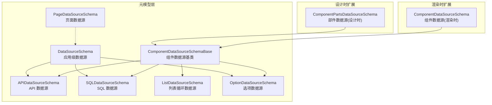
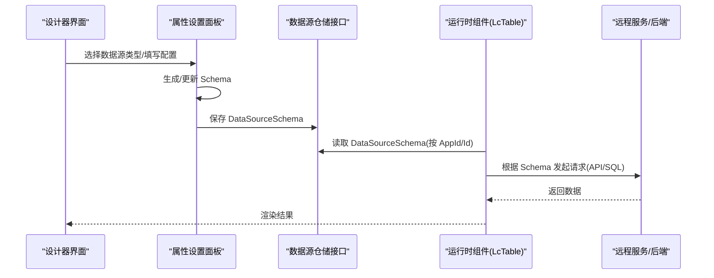
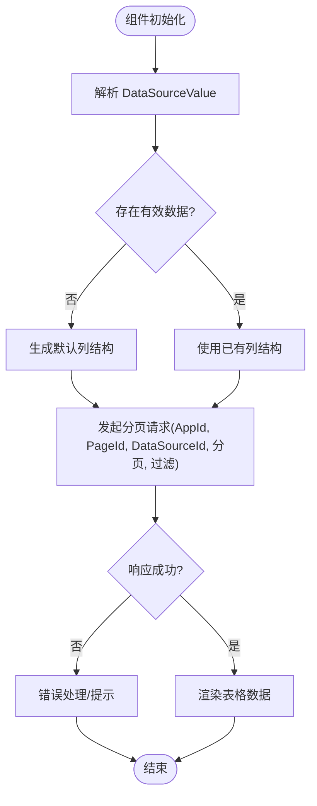
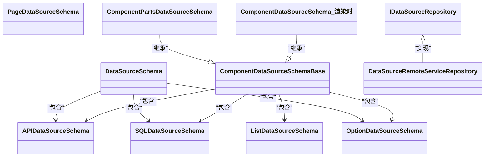

# 数据源Schema

<cite>
**本文引用的文件**   
- [DataSourceSchema.cs](file://src/LowCode/Common/H.LowCode.MetaSchema/DataSourceSchema.cs)
- [ComponentDataSourceSchema.cs](file://src/LowCode/Common/H.LowCode.MetaSchema/DataSourceSchemas/ComponentDataSourceSchema.cs)
- [APIDataSourceSchema.cs](file://src/LowCode/Common/H.LowCode.MetaSchema/DataSourceSchemas/APIDataSourceSchema.cs)
- [SQLDataSourceSchema.cs](file://src/LowCode/Common/H.LowCode.MetaSchema/DataSourceSchemas/SQLDataSourceSchema.cs)
- [ListDataSourceSchema.cs](file://src/LowCode/Common/H.LowCode.MetaSchema/DataSourceSchemas/ListDataSourceSchema.cs)
- [OptionDataSourceSchema.cs](file://src/LowCode/Common/H.LowCode.MetaSchema/DataSourceSchemas/OptionDataSourceSchema.cs)
- [PageDataSourceSchema.cs](file://src/LowCode/Common/H.LowCode.MetaSchema/DataSourceSchemas/PageDataSourceSchema.cs)
- [ComponentPartsDataSourceSchema.cs](file://src/LowCode/Common/H.LowCode.MetaSchema.DesignEngine/DataSourceSchemas/ComponentPartsDataSourceSchema.cs)
- [ComponentDataSourceSchema.cs（渲染引擎）](file://src/LowCode/Common/H.LowCode.MetaSchema.RenderEngine/DataSourceSchemas/ComponentDataSourceSchema.cs)
- [IDataSourceRepository.cs](file://src/LowCode/DesignEngine/H.LowCode.DesignEngine.Domain/MetaRepositories/IDataSourceRepository.cs)
- [DataSourceRemoteServiceRepository.cs](file://src/LowCode/DesignEngine/H.LowCode.DesignEngine.Repository.RemoteService/Repositories/DataSourceRemoteServiceRepository.cs)
- [LcTable.razor](file://src/LowCode/Common/H.LowCode.Components/Components/LcTable.razor)
- [TableDataSourceSetting.razor](file://src/LowCode/DesignEngine/H.LowCode.DesignEngine/SettingPanel/PropertySettingItems/TableDataSource/TableDataSourceSetting.razor)
- [OptionDataSourceSetting.razor](file://src/LowCode/DesignEngine/H.LowCode.DesignEngine/SettingPanel/PropertySettingItems/OptionDataSource/OptionDataSourceSetting.razor)
- [SQLForOptionDataSource.razor](file://src/LowCode/DesignEngine/H.LowCode.DesignEngine/SettingPanel/PropertySettingItems/OptionDataSource/SQLForOptionDataSource.razor)
- [ListDataSourceSetting.razor](file://src/LowCode/DesignEngine/H.LowCode.DesignEngine/SettingPanel/PropertySettingItems/ListDataSource/ListDataSourceSetting.razor)
- [APIDataSourceList.razor](file://src/LowCode/DesignEngine/H.LowCode.MyApp/Pages/DataSource/APIDataSourceList.razor)
</cite>

## 目录
1. [简介](#简介)
2. [项目结构](#项目结构)
3. [核心组件](#核心组件)
4. [架构总览](#架构总览)
5. [详细组件分析](#详细组件分析)
6. [依赖关系分析](#依赖关系分析)
7. [性能与缓存](#性能与缓存)
8. [故障排查指南](#故障排查指南)
9. [结论](#结论)
10. [附录：自定义数据源开发指南](#附录自定义数据源开发指南)

## 简介
本文件面向低代码平台的数据源 Schema 体系，系统性阐述 DataSourceSchema 基类的设计与扩展机制，覆盖 API、SQL、列表、选项等数据源类型的定义；说明连接配置、参数绑定与响应映射；给出缓存策略与性能优化建议；总结验证规则与错误处理；并提供自定义数据源类型的开发与集成示例。

## 项目结构
数据源 Schema 位于 LowCode 公共元模型层，设计时/渲染时分别有对应的扩展类型，UI 编辑器通过设置面板驱动 Schema 的创建与更新，运行时由组件消费 Schema 并执行数据获取与渲染。

图表来源 
- [DataSourceSchema.cs:1-70](file://src/LowCode/Common/H.LowCode.MetaSchema/DataSourceSchema.cs#L1-L70)
- [ComponentDataSourceSchema.cs:1-53](file://src/LowCode/Common/H.LowCode.MetaSchema/DataSourceSchemas/ComponentDataSourceSchema.cs#L1-L53)
- [APIDataSourceSchema.cs:1-65](file://src/LowCode/Common/H.LowCode.MetaSchema/DataSourceSchemas/APIDataSourceSchema.cs#L1-L65)
- [SQLDataSourceSchema.cs:1-18](file://src/LowCode/Common/H.LowCode.MetaSchema/DataSourceSchemas/SQLDataSourceSchema.cs#L1-L18)
- [ListDataSourceSchema.cs:1-51](file://src/LowCode/Common/H.LowCode.MetaSchema/DataSourceSchemas/ListDataSourceSchema.cs#L1-L51)
- [OptionDataSourceSchema.cs:1-34](file://src/LowCode/Common/H.LowCode.MetaSchema/DataSourceSchemas/OptionDataSourceSchema.cs#L1-L34)
- [PageDataSourceSchema.cs:1-18](file://src/LowCode/Common/H.LowCode.MetaSchema/DataSourceSchemas/PageDataSourceSchema.cs#L1-L18)
- [ComponentPartsDataSourceSchema.cs:1-22](file://src/LowCode/Common/H.LowCode.MetaSchema.DesignEngine/DataSourceSchemas/ComponentPartsDataSourceSchema.cs#L1-L22)
- [ComponentDataSourceSchema.cs（渲染引擎）:1-22](file://src/LowCode/Common/H.LowCode.MetaSchema.RenderEngine/DataSourceSchemas/ComponentDataSourceSchema.cs#L1-L22)

章节来源
- [DataSourceSchema.cs:1-70](file://src/LowCode/Common/H.LowCode.MetaSchema/DataSourceSchema.cs#L1-L70)
- [ComponentDataSourceSchema.cs:1-53](file://src/LowCode/Common/H.LowCode.MetaSchema/DataSourceSchemas/ComponentDataSourceSchema.cs#L1-L53)

## 核心组件
- 应用级数据源 DataSourceSchema：描述一个数据源的元信息与应用归属，按类型承载不同子配置（表字段、API、选项等）。
- 组件数据源基类 ComponentDataSourceSchemaBase：统一描述组件侧数据源分组、类型、引用标识、值以及三类具体数据源（固定选项、API、SQL），并支持列表循环数据源。
- 具体数据源类型：
  - APIDataSourceSchema：域、路径、方法、查询参数、请求体、请求头。
  - SQLDataSourceSchema：数据库类型与 SQL 语句。
  - ListDataSourceSchema：固定数据、API/SQL 配置、响应路径、排序与倒序。
  - OptionDataSourceSchema：标签、值、选中状态、排序、分组、描述。
  - PageDataSourceSchema：页面级数据源类型与引用。

章节来源
- [DataSourceSchema.cs:1-70](file://src/LowCode/Common/H.LowCode.MetaSchema/DataSourceSchema.cs#L1-L70)
- [ComponentDataSourceSchema.cs:1-53](file://src/LowCode/Common/H.LowCode.MetaSchema/DataSourceSchemas/ComponentDataSourceSchema.cs#L1-L53)
- [APIDataSourceSchema.cs:1-65](file://src/LowCode/Common/H.LowCode.MetaSchema/DataSourceSchemas/APIDataSourceSchema.cs#L1-L65)
- [SQLDataSourceSchema.cs:1-18](file://src/LowCode/Common/H.LowCode.MetaSchema/DataSourceSchemas/SQLDataSourceSchema.cs#L1-L18)
- [ListDataSourceSchema.cs:1-51](file://src/LowCode/Common/H.LowCode.MetaSchema/DataSourceSchemas/ListDataSourceSchema.cs#L1-L51)
- [OptionDataSourceSchema.cs:1-34](file://src/LowCode/Common/H.LowCode.MetaSchema/DataSourceSchemas/OptionDataSourceSchema.cs#L1-L34)
- [PageDataSourceSchema.cs:1-18](file://src/LowCode/Common/H.LowCode.MetaSchema/DataSourceSchemas/PageDataSourceSchema.cs#L1-L18)

## 架构总览
数据源在“设计时”被编辑与保存，“渲染时”被组件消费。设计时通过设置面板驱动 Schema 变更；渲染时由组件根据 DataSourceId 或内联配置发起请求或读取本地数据。

图表来源 
- [TableDataSourceSetting.razor:1-23](file://src/LowCode/DesignEngine/H.LowCode.DesignEngine/SettingPanel/PropertySettingItems/TableDataSource/TableDataSourceSetting.razor#L1-L23)
- [OptionDataSourceSetting.razor:1-46](file://src/LowCode/DesignEngine/H.LowCode.DesignEngine/SettingPanel/PropertySettingItems/OptionDataSource/OptionDataSourceSetting.razor#L1-L46)
- [ListDataSourceSetting.razor:19-40](file://src/LowCode/DesignEngine/H.LowCode.DesignEngine/SettingPanel/PropertySettingItems/ListDataSource/ListDataSourceSetting.razor#L19-L40)
- [IDataSourceRepository.cs:1-16](file://src/LowCode/DesignEngine/H.LowCode.DesignEngine.Domain/MetaRepositories/IDataSourceRepository.cs#L1-L16)
- [LcTable.razor:168-207](file://src/LowCode/Common/H.LowCode.Components/Components/LcTable.razor#L168-L207)

## 详细组件分析

### DataSourceSchema（应用级数据源）
- 作用：描述一个数据源的基本信息与所属应用，并按类型承载具体配置。
- 关键字段：应用ID、ID、名称、显示名、描述、排序、类型、发布状态；按类型分支包含表字段、API、选项与字典等。
- 扩展点：新增数据源类型时，可在对应区域增加字段并在 UI 中提供编辑器。

章节来源
- [DataSourceSchema.cs:1-70](file://src/LowCode/Common/H.LowCode.MetaSchema/DataSourceSchema.cs#L1-L70)

### ComponentDataSourceSchemaBase（组件数据源基类）
- 作用：为组件提供统一的数据源描述能力，包括分组类型、类型、引用标识、值，以及三类具体数据源（固定选项、API、SQL）和列表循环数据源。
- 扩展点：新增组件数据源类型时，增加对应字段与 UI 编辑器，并在组件渲染逻辑中处理。

章节来源
- [ComponentDataSourceSchema.cs:1-53](file://src/LowCode/Common/H.LowCode.MetaSchema/DataSourceSchemas/ComponentDataSourceSchema.cs#L1-L53)

### APIDataSourceSchema（API 数据源）
- 作用：描述 HTTP 调用所需的全部元信息。
- 关键字段：域名、路径、方法、查询参数数组、请求体（类型与值/多部分参数）、请求头数组。
- 使用场景：组件或列表数据源通过该配置发起网络请求，并将响应按路径解析为数据。

章节来源
- [APIDataSourceSchema.cs:1-65](file://src/LowCode/Common/H.LowCode.MetaSchema/DataSourceSchemas/APIDataSourceSchema.cs#L1-L65)

### SQLDataSourceSchema（SQL 数据源）
- 作用：描述 SQL 查询所需的数据库类型与 SQL 语句。
- 使用场景：适用于直接执行 SQL 的场景，通常配合后端服务进行安全校验与参数化执行。

章节来源
- [SQLDataSourceSchema.cs:1-18](file://src/LowCode/Common/H.LowCode.MetaSchema/DataSourceSchemas/SQLDataSourceSchema.cs#L1-L18)

### ListDataSourceSchema（列表循环数据源）
- 作用：用于列表循环渲染的数据源配置，支持固定数据、API/SQL 配置、响应路径提取、排序与倒序。
- 关键点：DataPath 用于从复杂响应中提取数组；OrderBy/OrderDesc 控制排序。

章节来源
- [ListDataSourceSchema.cs:1-51](file://src/LowCode/Common/H.LowCode.MetaSchema/DataSourceSchemas/ListDataSourceSchema.cs#L1-L51)

### OptionDataSourceSchema（选项数据源）
- 作用：描述下拉、单选等选项型控件的静态选项集合。
- 关键字段：标签、值、是否选中、排序、分组、描述。

章节来源
- [OptionDataSourceSchema.cs:1-34](file://src/LowCode/Common/H.LowCode.MetaSchema/DataSourceSchemas/OptionDataSourceSchema.cs#L1-L34)

### PageDataSourceSchema（页面数据源）
- 作用：页面级数据源的类型与引用，便于页面初始化加载数据。

章节来源
- [PageDataSourceSchema.cs:1-18](file://src/LowCode/Common/H.LowCode.MetaSchema/DataSourceSchemas/PageDataSourceSchema.cs#L1-L18)

### 设计时与渲染时扩展
- 设计时扩展 ComponentPartsDataSourceSchema：在部件层面扩展数据源片段与列表项模板。
- 渲染时扩展 ComponentDataSourceSchema：在渲染时绑定 Fragment 与 ItemTemplate。

章节来源
- [ComponentPartsDataSourceSchema.cs:1-22](file://src/LowCode/Common/H.LowCode.MetaSchema.DesignEngine/DataSourceSchemas/ComponentPartsDataSourceSchema.cs#L1-L22)
- [ComponentDataSourceSchema.cs（渲染引擎）:1-22](file://src/LowCode/Common/H.LowCode.MetaSchema.RenderEngine/DataSourceSchemas/ComponentDataSourceSchema.cs#L1-L22)

### 运行时数据流（以 LcTable 为例）
- 组件从 DataSourceValue 解析 TablePropertySchema，若为空则生成默认列结构。
- 发起分页请求时携带 AppId、PageId、DataSourceId、分页与过滤条件。
- 后端根据 DataSourceId 查找 DataSourceSchema，按类型执行 API/SQL 或读取固定数据，返回数据后渲染表格。

图表来源 
- [LcTable.razor:168-207](file://src/LowCode/Common/H.LowCode.Components/Components/LcTable.razor#L168-L207)

章节来源
- [LcTable.razor:168-207](file://src/LowCode/Common/H.LowCode.Components/Components/LcTable.razor#L168-L207)

## 依赖关系分析
- 设计时：设置面板依赖各 Schema 类型，负责生成/更新 Schema；仓储接口负责持久化。
- 渲染时：组件依赖 DataSourceSchema 与具体数据源配置，发起请求并渲染。
- 仓储实现：当前远程服务仓储未实现具体逻辑，需补充 Save/Get 等方法。

图表来源 
- [DataSourceSchema.cs:1-70](file://src/LowCode/Common/H.LowCode.MetaSchema/DataSourceSchema.cs#L1-L70)
- [ComponentDataSourceSchema.cs:1-53](file://src/LowCode/Common/H.LowCode.MetaSchema/DataSourceSchemas/ComponentDataSourceSchema.cs#L1-L53)
- [APIDataSourceSchema.cs:1-65](file://src/LowCode/Common/H.LowCode.MetaSchema/DataSourceSchemas/APIDataSourceSchema.cs#L1-L65)
- [SQLDataSourceSchema.cs:1-18](file://src/LowCode/Common/H.LowCode.MetaSchema/DataSourceSchemas/SQLDataSourceSchema.cs#L1-L18)
- [ListDataSourceSchema.cs:1-51](file://src/LowCode/Common/H.LowCode.MetaSchema/DataSourceSchemas/ListDataSourceSchema.cs#L1-L51)
- [OptionDataSourceSchema.cs:1-34](file://src/LowCode/Common/H.LowCode.MetaSchema/DataSourceSchemas/OptionDataSourceSchema.cs#L1-L34)
- [ComponentPartsDataSourceSchema.cs:1-22](file://src/LowCode/Common/H.LowCode.MetaSchema.DesignEngine/DataSourceSchemas/ComponentPartsDataSourceSchema.cs#L1-L22)
- [ComponentDataSourceSchema.cs（渲染引擎）:1-22](file://src/LowCode/Common/H.LowCode.MetaSchema.RenderEngine/DataSourceSchemas/ComponentDataSourceSchema.cs#L1-L22)
- [IDataSourceRepository.cs:1-16](file://src/LowCode/DesignEngine/H.LowCode.DesignEngine.Domain/MetaRepositories/IDataSourceRepository.cs#L1-L16)
- [DataSourceRemoteServiceRepository.cs:1-39](file://src/LowCode/DesignEngine/H.LowCode.DesignEngine.Repository.RemoteService/Repositories/DataSourceRemoteServiceRepository.cs#L1-L39)

章节来源
- [IDataSourceRepository.cs:1-16](file://src/LowCode/DesignEngine/H.LowCode.DesignEngine.Domain/MetaRepositories/IDataSourceRepository.cs#L1-L16)
- [DataSourceRemoteServiceRepository.cs:1-39](file://src/LowCode/DesignEngine/H.LowCode.DesignEngine.Repository.RemoteService/Repositories/DataSourceRemoteServiceRepository.cs#L1-L39)

## 性能与缓存
- 列表数据源 DataPath：通过精确路径提取数组，减少前端解析开销。
- 排序与倒序：在数据源层声明 OrderBy/OrderDesc，可结合后端排序降低内存排序成本。
- 固定数据：设计时预览可使用 FixedData，避免频繁请求。
- 建议：
  - 对高频访问的 API 数据源启用服务端缓存（如 Redis），并通过版本号或时间戳失效。
  - 对 SQL 数据源限制查询复杂度，使用分页与必要索引。
  - 组件侧对相同 DataSourceId 的请求做去抖与合并，避免重复请求。

[本节为通用指导，不直接分析具体文件]

## 故障排查指南
- 保存失败：检查 API 数据源的 Queries/Headers 是否为空条目，确保 Name/Type 非空后再保存。
- 数据为空：确认 DataSourceValue 是否有效 JSON；若为空将回退到默认列结构。
- 请求异常：检查 Domain/Path/Method 是否正确，Headers 与 Body 是否符合后端要求。
- 仓储未实现：远程服务仓储目前抛出未实现异常，需补充 Get/Save/Delete 等方法。

章节来源
- [APIDataSourceList.razor:114-163](file://src/LowCode/DesignEngine/H.LowCode.MyApp/Pages/DataSource/APIDataSourceList.razor#L114-L163)
- [LcTable.razor:168-207](file://src/LowCode/Common/H.LowCode.Components/Components/LcTable.razor#L168-L207)
- [DataSourceRemoteServiceRepository.cs:1-39](file://src/LowCode/DesignEngine/H.LowCode.DesignEngine.Repository.RemoteService/Repositories/DataSourceRemoteServiceRepository.cs#L1-L39)

## 结论
数据源 Schema 体系以 DataSourceSchema 为核心，通过统一的基类与类型化的子配置，支撑 API、SQL、列表、选项等多种数据源类型。设计时通过设置面板驱动 Schema 构建，渲染时由组件消费并执行数据获取与渲染。建议在仓储与服务端完善实现，并结合缓存与排序优化提升性能。

[本节为总结性内容，不直接分析具体文件]

## 附录：自定义数据源开发指南
- 步骤概览：
  1) 新增 Schema 类型：在 MetaSchema 层定义新的数据源 Schema，并在 DataSourceSchema 或 ComponentDataSourceSchemaBase 中添加对应字段。
  2) 设计时编辑器：在 DesignEngine 的设置面板中新增对应编辑器，绑定新 Schema 字段。
  3) 渲染时消费：在组件或渲染引擎中识别新类型，实现数据获取与映射逻辑。
  4) 持久化与仓储：在仓储接口与实现中支持新类型的序列化与存取。
- 参考路径：
  - Schema 定义参考：[APIDataSourceSchema.cs:1-65](file://src/LowCode/Common/H.LowCode.MetaSchema/DataSourceSchemas/APIDataSourceSchema.cs#L1-L65)、[SQLDataSourceSchema.cs:1-18](file://src/LowCode/Common/H.LowCode.MetaSchema/DataSourceSchemas/SQLDataSourceSchema.cs#L1-L18)、[ListDataSourceSchema.cs:1-51](file://src/LowCode/Common/H.LowCode.MetaSchema/DataSourceSchemas/ListDataSourceSchema.cs#L1-L51)、[OptionDataSourceSchema.cs:1-34](file://src/LowCode/Common/H.LowCode.MetaSchema/DataSourceSchemas/OptionDataSourceSchema.cs#L1-L34)。
  - 设计时编辑器参考：[TableDataSourceSetting.razor:1-23](file://src/LowCode/DesignEngine/H.LowCode.DesignEngine/SettingPanel/PropertySettingItems/TableDataSource/TableDataSourceSetting.razor#L1-L23)、[OptionDataSourceSetting.razor:1-46](file://src/LowCode/DesignEngine/H.LowCode.DesignEngine/SettingPanel/PropertySettingItems/OptionDataSource/OptionDataSourceSetting.razor#L1-L46)、[SQLForOptionDataSource.razor:1-25](file://src/LowCode/DesignEngine/H.LowCode.DesignEngine/SettingPanel/PropertySettingItems/OptionDataSource/SQLForOptionDataSource.razor#L1-L25)、[ListDataSourceSetting.razor:19-40](file://src/LowCode/DesignEngine/H.LowCode.DesignEngine/SettingPanel/PropertySettingItems/ListDataSource/ListDataSourceSetting.razor#L19-L40)。
  - 渲染时消费参考：[LcTable.razor:168-207](file://src/LowCode/Common/H.LowCode.Components/Components/LcTable.razor#L168-L207)。
  - 仓储接口与实现参考：[IDataSourceRepository.cs:1-16](file://src/LowCode/DesignEngine/H.LowCode.DesignEngine.Domain/MetaRepositories/IDataSourceRepository.cs#L1-L16)、[DataSourceRemoteServiceRepository.cs:1-39](file://src/LowCode/DesignEngine/H.LowCode.DesignEngine.Repository.RemoteService/Repositories/DataSourceRemoteServiceRepository.cs#L1-L39)。

[本节为通用指导，不直接分析具体文件]