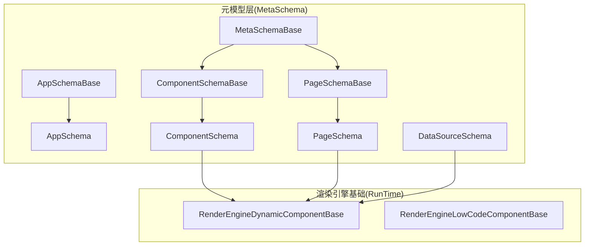
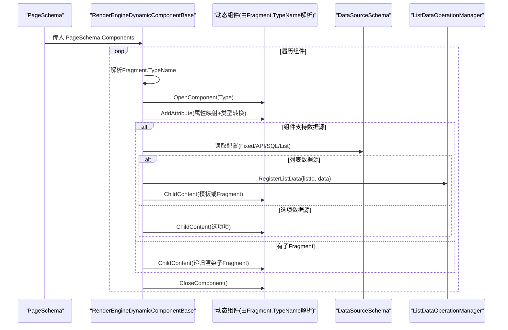
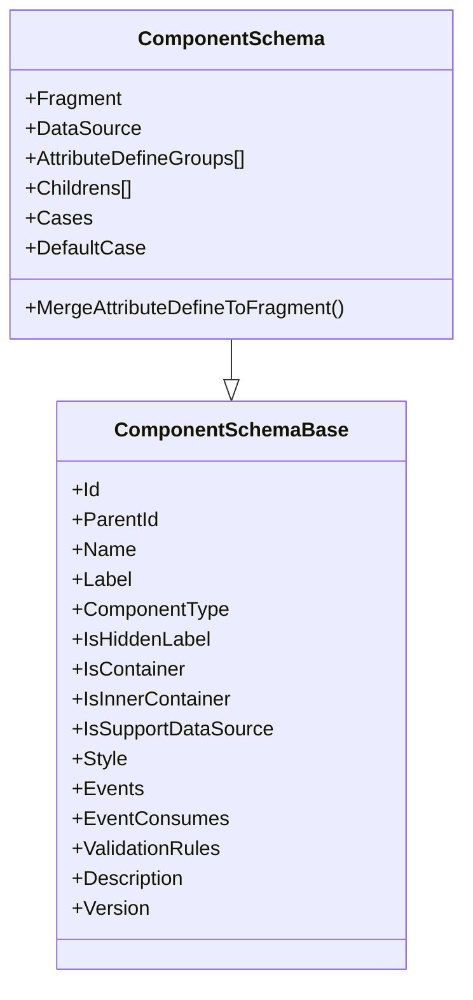
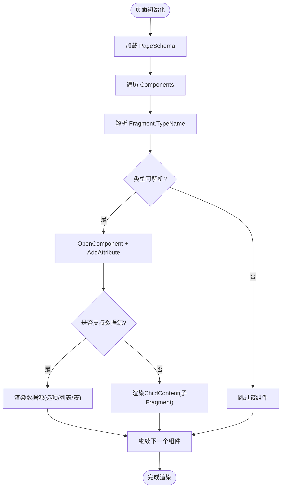
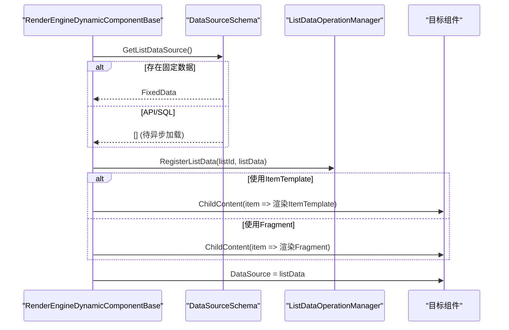
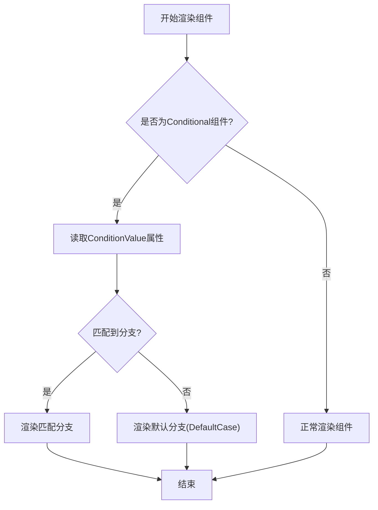
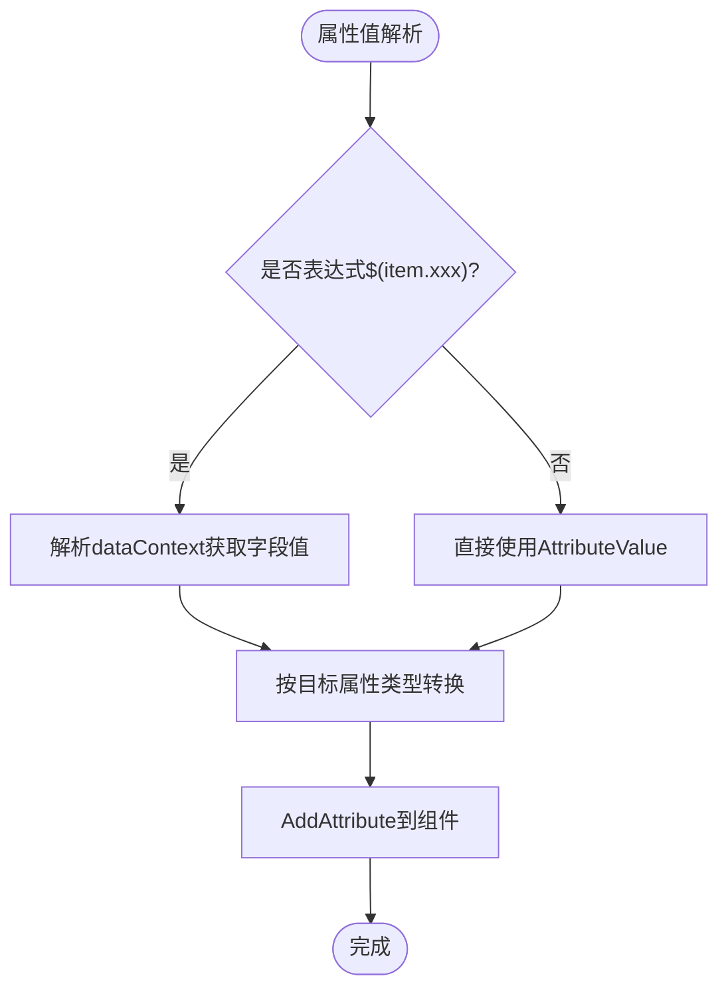
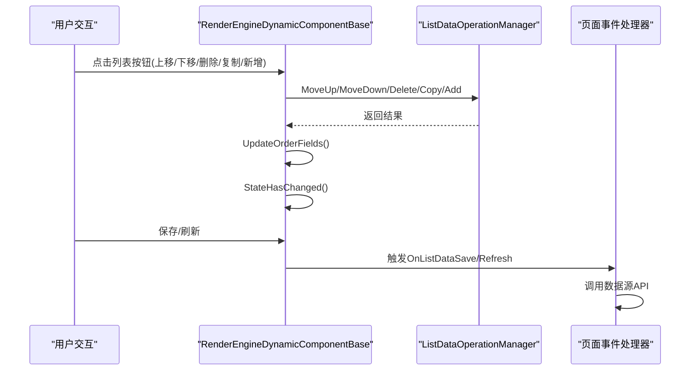
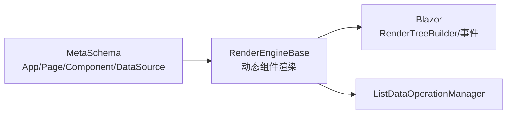

# 渲染引擎Schema

<cite>
**本文引用的文件**   
- [AppSchema.cs](file://src/LowCode/Common/H.LowCode.MetaSchema.RenderEngine/AppSchema.cs)
- [ComponentSchema.cs](file://src/LowCode/Common/H.LowCode.MetaSchema.RenderEngine/ComponentSchema.cs)
- [PageSchema.cs](file://src/LowCode/Common/H.LowCode.MetaSchema.RenderEngine/PageSchema.cs)
- [ComponentSchemaBase.cs](file://src/LowCode/Common/H.LowCode.MetaSchema/ComponentSchemaBase.cs)
- [PageSchemaBase.cs](file://src/LowCode/Common/H.LowCode.MetaSchema/PageSchemaBase.cs)
- [AppSchemaBase.cs](file://src/LowCode/Common/H.LowCode.MetaSchema/AppSchemaBase.cs)
- [DataSourceSchema.cs](file://src/LowCode/Common/H.LowCode.MetaSchema/DataSourceSchema.cs)
- [MetaSchemaBase.cs](file://src/LowCode/Common/H.LowCode.MetaSchema/MetaSchemaBase.cs)
- [RenderEngineDynamicComponentBase.cs](file://src/LowCode/RenderEngine/H.LowCode.RenderEngineBase/RenderEngineDynamicComponentBase.cs)
- [RenderEngineLowCodeComponentBase.cs](file://src/LowCode/RenderEngine/H.LowCode.RenderEngineBase/RenderEngineLowCodeComponentBase.cs)
</cite>

## 目录
1. [简介](#简介)
2. [项目结构](#项目结构)
3. [核心组件](#核心组件)
4. [架构总览](#架构总览)
5. [详细组件分析](#详细组件分析)
6. [依赖关系分析](#依赖关系分析)
7. [性能考量](#性能考量)
8. [故障排查指南](#故障排查指南)
9. [结论](#结论)
10. [附录](#附录)

## 简介
本文件面向低代码渲染引擎的 Schema 系统，聚焦于“渲染引擎专用”的 Schema 类型与优化策略。内容涵盖：
- 运行时组件 Schema 的处理机制（动态加载、实例化）
- 页面渲染 Schema 的生命周期（从解析到最终渲染）
- 组件属性绑定与数据同步机制
- Schema 验证与兼容性检查要点
- 与渲染性能相关的 Schema 配置选项
- 扩展开发指南与自定义渲染器实现建议

## 项目结构
渲染引擎相关代码主要分布在以下模块：
- MetaSchema（公共元模型）：定义应用、页面、组件、数据源等通用 Schema 基类与字段约定
- RenderEngineBase（渲染引擎基础能力）：提供基于 Blazor 的动态组件渲染、数据源处理、事件绑定与列表操作
- 主题与具体实现（如 AntBlazor 主题）：在更上层完成具体 UI 渲染细节

图表来源 
- [AppSchema.cs:1-10](file://src/LowCode/Common/H.LowCode.MetaSchema.RenderEngine/AppSchema.cs#L1-L10)
- [ComponentSchema.cs:1-83](file://src/LowCode/Common/H.LowCode.MetaSchema.RenderEngine/ComponentSchema.cs#L1-L83)
- [PageSchema.cs:1-10](file://src/LowCode/Common/H.LowCode.MetaSchema.RenderEngine/PageSchema.cs#L1-L10)
- [ComponentSchemaBase.cs:1-104](file://src/LowCode/Common/H.LowCode.MetaSchema/ComponentSchemaBase.cs#L1-L104)
- [PageSchemaBase.cs:1-40](file://src/LowCode/Common/H.LowCode.MetaSchema/PageSchemaBase.cs#L1-L40)
- [AppSchemaBase.cs:1-32](file://src/LowCode/Common/H.LowCode.MetaSchema/AppSchemaBase.cs#L1-L32)
- [DataSourceSchema.cs:1-70](file://src/LowCode/Common/H.LowCode.MetaSchema/DataSourceSchema.cs#L1-L70)
- [MetaSchemaBase.cs:1-20](file://src/LowCode/Common/H.LowCode.MetaSchema/MetaSchemaBase.cs#L1-L20)
- [RenderEngineDynamicComponentBase.cs:1-692](file://src/LowCode/RenderEngine/H.LowCode.RenderEngineBase/RenderEngineDynamicComponentBase.cs#L1-L692)
- [RenderEngineLowCodeComponentBase.cs:1-16](file://src/LowCode/RenderEngine/H.LowCode.RenderEngineBase/RenderEngineLowCodeComponentBase.cs#L1-L16)

章节来源
- [AppSchema.cs:1-10](file://src/LowCode/Common/H.LowCode.MetaSchema.RenderEngine/AppSchema.cs#L1-L10)
- [ComponentSchema.cs:1-83](file://src/LowCode/Common/H.LowCode.MetaSchema.RenderEngine/ComponentSchema.cs#L1-L83)
- [PageSchema.cs:1-10](file://src/LowCode/Common/H.LowCode.MetaSchema.RenderEngine/PageSchema.cs#L1-L10)
- [ComponentSchemaBase.cs:1-104](file://src/LowCode/Common/H.LowCode.MetaSchema/ComponentSchemaBase.cs#L1-L104)
- [PageSchemaBase.cs:1-40](file://src/LowCode/Common/H.LowCode.MetaSchema/PageSchemaBase.cs#L1-L40)
- [AppSchemaBase.cs:1-32](file://src/LowCode/Common/H.LowCode.MetaSchema/AppSchemaBase.cs#L1-L32)
- [DataSourceSchema.cs:1-70](file://src/LowCode/Common/H.LowCode.MetaSchema/DataSourceSchema.cs#L1-L70)
- [MetaSchemaBase.cs:1-20](file://src/LowCode/Common/H.LowCode.MetaSchema/MetaSchemaBase.cs#L1-L20)
- [RenderEngineDynamicComponentBase.cs:1-692](file://src/LowCode/RenderEngine/H.LowCode.RenderEngineBase/RenderEngineDynamicComponentBase.cs#L1-L692)
- [RenderEngineLowCodeComponentBase.cs:1-16](file://src/LowCode/RenderEngine/H.LowCode.RenderEngineBase/RenderEngineLowCodeComponentBase.cs#L1-L16)

## 核心组件
- 应用级 Schema
  - AppSchemaBase：应用基本信息（标识、名称、图标、描述、排序、版本、发布状态、支持平台）
  - AppSchema：继承自 AppSchemaBase，用于渲染引擎的应用元数据承载
- 页面级 Schema
  - PageSchemaBase：页面元信息（应用Id、页面Id、名称、排序、页面类型、发布状态、页面属性、页面数据源、页面事件）
  - PageSchema：页面组件集合 Components
- 组件级 Schema
  - ComponentSchemaBase：组件通用元信息（实例Id、父Id、名称、标签、类型、容器标记、样式、事件、校验规则、版本等），并包含是否支持数据源的逻辑控制
  - ComponentSchema：渲染引擎专用组件 Schema，包含 Fragment（渲染片段）、数据源 DataSource、属性定义分组 AttributeDefineGroups、子组件 Childrens、条件分支 Cases/DefaultCase，以及将属性定义合并到 Fragment 的能力
- 数据源 Schema
  - DataSourceSchema：统一的数据源抽象，支持表、API、选项等多种类型，并提供字段、软删除开关、字典值等扩展点
- 元数据基类
  - MetaSchemaBase：统一的审计字段（创建者、创建时间、修改者、修改时间）
  - StateHasChangeSchema：作为所有 Schema 的基础，便于与 Blazor 状态更新机制协作

章节来源
- [AppSchemaBase.cs:1-32](file://src/LowCode/Common/H.LowCode.MetaSchema/AppSchemaBase.cs#L1-L32)
- [AppSchema.cs:1-10](file://src/LowCode/Common/H.LowCode.MetaSchema.RenderEngine/AppSchema.cs#L1-L10)
- [PageSchemaBase.cs:1-40](file://src/LowCode/Common/H.LowCode.MetaSchema/PageSchemaBase.cs#L1-L40)
- [PageSchema.cs:1-10](file://src/LowCode/Common/H.LowCode.MetaSchema.RenderEngine/PageSchema.cs#L1-L10)
- [ComponentSchemaBase.cs:1-104](file://src/LowCode/Common/H.LowCode.MetaSchema/ComponentSchemaBase.cs#L1-L104)
- [ComponentSchema.cs:1-83](file://src/LowCode/Common/H.LowCode.MetaSchema.RenderEngine/ComponentSchema.cs#L1-L83)
- [DataSourceSchema.cs:1-70](file://src/LowCode/Common/H.LowCode.MetaSchema/DataSourceSchema.cs#L1-L70)
- [MetaSchemaBase.cs:1-20](file://src/LowCode/Common/H.LowCode.MetaSchema/MetaSchemaBase.cs#L1-L20)

## 架构总览
渲染引擎通过“Schema 驱动 + 动态组件”的方式工作：
- 页面 Schema 持有组件树（Components）
- 每个组件 Schema 包含 Fragment（TypeName + Attributes + ChildFragments）与可选数据源
- 渲染引擎动态解析 TypeName 为 .NET 类型，按属性映射生成 Blazor 组件树
- 数据源根据类型（固定选项、表、列表、API/SQL）进行差异化处理
- 事件与条件渲染由 Schema 中的事件与分支配置驱动

图表来源 
- [PageSchema.cs:1-10](file://src/LowCode/Common/H.LowCode.MetaSchema.RenderEngine/PageSchema.cs#L1-L10)
- [ComponentSchema.cs:1-83](file://src/LowCode/Common/H.LowCode.MetaSchema.RenderEngine/ComponentSchema.cs#L1-L83)
- [RenderEngineDynamicComponentBase.cs:1-692](file://src/LowCode/RenderEngine/H.LowCode.RenderEngineBase/RenderEngineDynamicComponentBase.cs#L1-L692)
- [DataSourceSchema.cs:1-70](file://src/LowCode/Common/H.LowCode.MetaSchema/DataSourceSchema.cs#L1-L70)

## 详细组件分析

### 组件Schema与Fragment渲染
- ComponentSchema 提供 Fragment（渲染片段）、DataSource、属性定义分组、子组件与条件分支
- MergeAttributeDefineToFragment 可将属性定义组转换为 Fragment 的属性，简化渲染时的属性注入
- 渲染器根据 IsSupportDataSource 决定是注入数据源还是渲染 ChildContent

图表来源 
- [ComponentSchema.cs:1-83](file://src/LowCode/Common/H.LowCode.MetaSchema.RenderEngine/ComponentSchema.cs#L1-L83)
- [ComponentSchemaBase.cs:1-104](file://src/LowCode/Common/H.LowCode.MetaSchema/ComponentSchemaBase.cs#L1-L104)

章节来源
- [ComponentSchema.cs:1-83](file://src/LowCode/Common/H.LowCode.MetaSchema.RenderEngine/ComponentSchema.cs#L1-L83)
- [ComponentSchemaBase.cs:1-104](file://src/LowCode/Common/H.LowCode.MetaSchema/ComponentSchemaBase.cs#L1-L104)

### 页面Schema与生命周期
- PageSchemaBase 定义页面元信息与页面级数据源、事件
- PageSchema 持有 Components 列表，作为渲染入口
- 渲染流程：页面初始化 -> 遍历 Components -> 动态解析组件类型 -> 构建 RenderTree

图表来源 
- [PageSchemaBase.cs:1-40](file://src/LowCode/Common/H.LowCode.MetaSchema/PageSchemaBase.cs#L1-L40)
- [PageSchema.cs:1-10](file://src/LowCode/Common/H.LowCode.MetaSchema.RenderEngine/PageSchema.cs#L1-L10)
- [RenderEngineDynamicComponentBase.cs:1-692](file://src/LowCode/RenderEngine/H.LowCode.RenderEngineBase/RenderEngineDynamicComponentBase.cs#L1-L692)

章节来源
- [PageSchemaBase.cs:1-40](file://src/LowCode/Common/H.LowCode.MetaSchema/PageSchemaBase.cs#L1-L40)
- [PageSchema.cs:1-10](file://src/LowCode/Common/H.LowCode.MetaSchema.RenderEngine/PageSchema.cs#L1-L10)
- [RenderEngineDynamicComponentBase.cs:1-692](file://src/LowCode/RenderEngine/H.LowCode.RenderEngineBase/RenderEngineDynamicComponentBase.cs#L1-L692)

### 数据源与列表渲染
- 数据源类型包括固定选项、API、SQL、表、列表等
- 列表数据源支持 ItemTemplate（完整组件配置）与 Fragment（简单配置）两种模式
- 列表项上下文 ListItemContext 提供当前项、索引与列表Id，便于事件与数据绑定

图表来源 
- [RenderEngineDynamicComponentBase.cs:1-692](file://src/LowCode/RenderEngine/H.LowCode.RenderEngineBase/RenderEngineDynamicComponentBase.cs#L1-L692)
- [DataSourceSchema.cs:1-70](file://src/LowCode/Common/H.LowCode.MetaSchema/DataSourceSchema.cs#L1-L70)

章节来源
- [RenderEngineDynamicComponentBase.cs:1-692](file://src/LowCode/RenderEngine/H.LowCode.RenderEngineBase/RenderEngineDynamicComponentBase.cs#L1-L692)
- [DataSourceSchema.cs:1-70](file://src/LowCode/Common/H.LowCode.MetaSchema/DataSourceSchema.cs#L1-L70)

### 条件渲染与事件绑定
- 条件渲染：当组件类型为 Conditional 且存在 Cases/DefaultCase 时，根据 ConditionValue 选择分支渲染
- 事件绑定：Fragment 的事件配置会映射到组件事件（如 OnClick），并在列表上下文中传递 listId 与 itemIndex

图表来源 
- [RenderEngineDynamicComponentBase.cs:1-692](file://src/LowCode/RenderEngine/H.LowCode.RenderEngineBase/RenderEngineDynamicComponentBase.cs#L1-L692)
- [ComponentSchema.cs:1-83](file://src/LowCode/Common/H.LowCode.MetaSchema.RenderEngine/ComponentSchema.cs#L1-L83)

章节来源
- [RenderEngineDynamicComponentBase.cs:1-692](file://src/LowCode/RenderEngine/H.LowCode.RenderEngineBase/RenderEngineDynamicComponentBase.cs#L1-L692)
- [ComponentSchema.cs:1-83](file://src/LowCode/Common/H.LowCode.MetaSchema.RenderEngine/ComponentSchema.cs#L1-L83)

### 属性绑定与类型转换
- 属性值支持表达式 $(item.fieldName)，在列表上下文中解析为对应字段值
- 类型转换：优先使用组件属性的实际类型进行转换，确保强类型安全
- 若属性不存在于目标组件，则忽略；否则注入到组件属性

图表来源 
- [RenderEngineDynamicComponentBase.cs:1-692](file://src/LowCode/RenderEngine/H.LowCode.RenderEngineBase/RenderEngineDynamicComponentBase.cs#L1-L692)

章节来源
- [RenderEngineDynamicComponentBase.cs:1-692](file://src/LowCode/RenderEngine/H.LowCode.RenderEngineBase/RenderEngineDynamicComponentBase.cs#L1-L692)

### 列表数据操作与事件
- 列表操作包括上移、下移、删除、复制、新增、保存、刷新
- 操作通过 ListDataOperationManager 执行，完成后触发 StateHasChanged 以刷新UI
- 保存与刷新事件由页面层订阅并调用数据源 API

图表来源 
- [RenderEngineDynamicComponentBase.cs:1-692](file://src/LowCode/RenderEngine/H.LowCode.RenderEngineBase/RenderEngineDynamicComponentBase.cs#L1-L692)

章节来源
- [RenderEngineDynamicComponentBase.cs:1-692](file://src/LowCode/RenderEngine/H.LowCode.RenderEngineBase/RenderEngineDynamicComponentBase.cs#L1-L692)

## 依赖关系分析
- 渲染引擎基础组件依赖 MetaSchema 定义的各类 Schema
- 组件渲染依赖 Blazor 的 RenderTreeBuilder 与事件回调机制
- 列表数据操作依赖 ListDataOperationManager（在渲染引擎基础中注入）

图表来源 
- [ComponentSchema.cs:1-83](file://src/LowCode/Common/H.LowCode.MetaSchema.RenderEngine/ComponentSchema.cs#L1-L83)
- [PageSchema.cs:1-10](file://src/LowCode/Common/H.LowCode.MetaSchema.RenderEngine/PageSchema.cs#L1-L10)
- [DataSourceSchema.cs:1-70](file://src/LowCode/Common/H.LowCode.MetaSchema/DataSourceSchema.cs#L1-L70)
- [RenderEngineDynamicComponentBase.cs:1-692](file://src/LowCode/RenderEngine/H.LowCode.RenderEngineBase/RenderEngineDynamicComponentBase.cs#L1-L692)

章节来源
- [ComponentSchema.cs:1-83](file://src/LowCode/Common/H.LowCode.MetaSchema.RenderEngine/ComponentSchema.cs#L1-L83)
- [PageSchema.cs:1-10](file://src/LowCode/Common/H.LowCode.MetaSchema.RenderEngine/PageSchema.cs#L1-L10)
- [DataSourceSchema.cs:1-70](file://src/LowCode/Common/H.LowCode.MetaSchema/DataSourceSchema.cs#L1-L70)
- [RenderEngineDynamicComponentBase.cs:1-692](file://src/LowCode/RenderEngine/H.LowCode.RenderEngineBase/RenderEngineDynamicComponentBase.cs#L1-L692)

## 性能考量
- 避免不必要的类型解析失败：无法解析的类型直接跳过，防止整页崩溃
- 合理使用 IsSupportDataSource：容器组件通常不支持数据源，减少无效的数据源处理
- 列表数据缓存：固定数据优先，减少网络请求；API/SQL 数据源应在组件初始化时异步加载
- 属性类型转换：使用组件属性的实际类型进行转换，避免多次转换开销
- 条件渲染：仅在必要时计算条件值与分支匹配，降低渲染成本

[本节为通用指导，不直接分析具体文件]

## 故障排查指南
- 空引用异常
  - 现象：组件或 Fragment 为空导致 NullReferenceException
  - 排查：确认 ComponentSchema 与 Fragment 已正确初始化
- 类型解析失败
  - 现象：Fragment.TypeName 无法解析为有效类型
  - 排查：检查命名空间与程序集引用，确保类型可被 ResolveType 解析
- 属性绑定无效
  - 现象：组件属性未生效
  - 排查：确认属性名与目标组件属性一致，类型转换成功
- 列表数据为空
  - 现象：列表无数据渲染
  - 排查：检查 FixedData、API/SQL 数据源配置是否正确，异步加载是否完成

章节来源
- [RenderEngineDynamicComponentBase.cs:1-692](file://src/LowCode/RenderEngine/H.LowCode.RenderEngineBase/RenderEngineDynamicComponentBase.cs#L1-L692)

## 结论
渲染引擎通过 Schema 驱动与动态组件机制，实现了高度灵活的页面渲染能力。MetaSchema 定义了清晰的元数据模型，RenderEngineBase 提供了强大的运行时渲染、数据源处理与事件绑定能力。遵循本文档的最佳实践与性能优化建议，可以构建稳定高效的低代码渲染体验。

[本节为总结性内容，不直接分析具体文件]

## 附录

### Schema 验证与兼容性检查要点
- 必填字段校验：组件 Id、Fragment.TypeName、数据源必要字段
- 类型兼容性：属性值与目标属性类型一致，必要时进行转换
- 版本兼容：组件 Version 字段可用于向后兼容判断
- 发布状态：页面与应用 PublishStatus 控制可见性与可用性

[本节为通用指导，不直接分析具体文件]

### 扩展开发与自定义渲染器实现指南
- 扩展组件 Schema：在 ComponentSchema 中增加新的属性或行为，并在渲染器中处理
- 自定义数据源：扩展 DataSourceSchema，实现新的数据源类型（如 GraphQL、消息队列）
- 自定义渲染器：继承 RenderEngineDynamicComponentBase，重写属性渲染、事件绑定或数据源处理逻辑
- 主题集成：在主题项目中注册自定义组件与样式，确保渲染效果符合预期

[本节为通用指导，不直接分析具体文件]