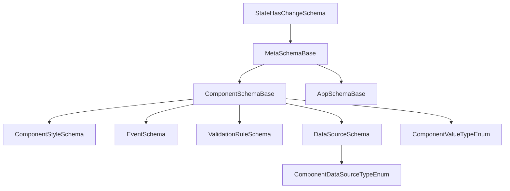
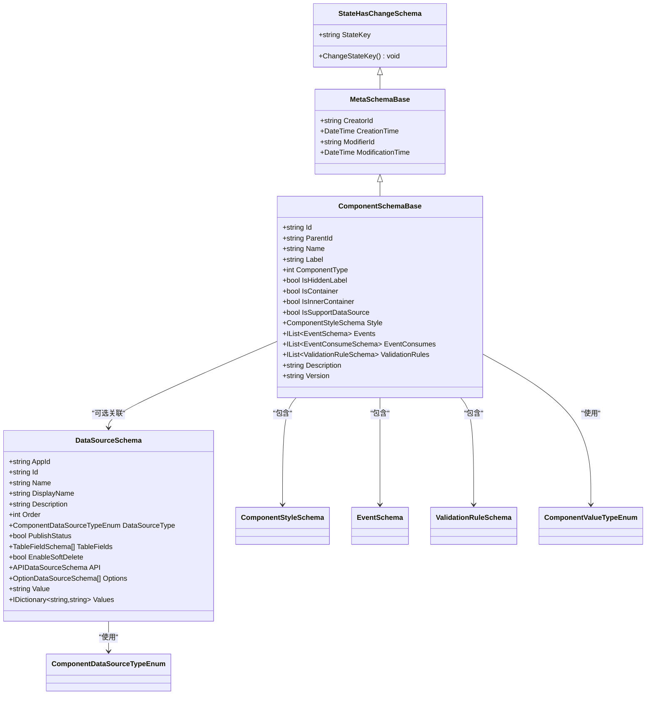
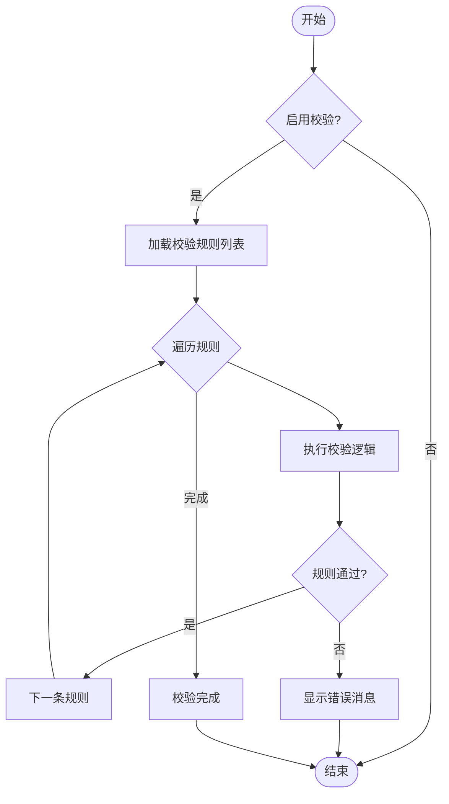
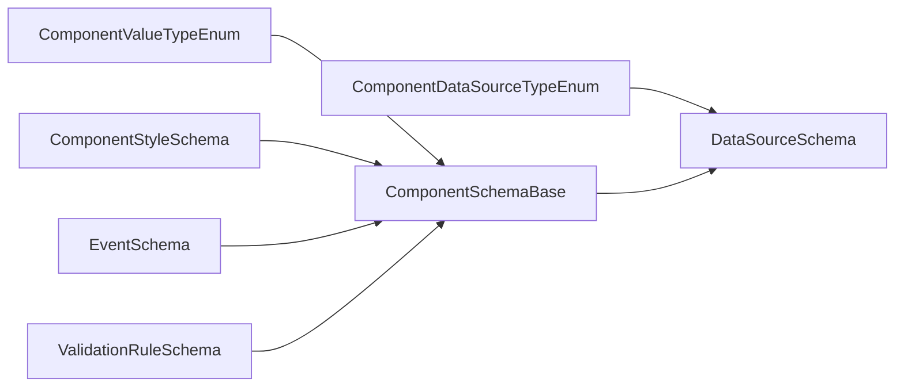

# 组件Schema定义

<cite>
**本文引用的文件**   
- [ComponentSchemaBase.cs](file://src/LowCode/Common/H.LowCode.MetaSchema/ComponentSchemaBase.cs)
- [MetaSchemaBase.cs](file://src/LowCode/Common/H.LowCode.MetaSchema/MetaSchemaBase.cs)
- [StateHasChangeSchema.cs](file://src/LowCode/Common/H.LowCode.MetaSchema/StateHasChangeSchema.cs)
- [AppSchemaBase.cs](file://src/LowCode/Common/H.LowCode.MetaSchema/AppSchemaBase.cs)
- [DataSourceSchema.cs](file://src/LowCode/Common/H.LowCode.MetaSchema/DataSourceSchema.cs)
- [ComponentValueTypeEnum.cs](file://src/LowCode/Common/H.LowCode.MetaSchema/Enums/ComponentValueTypeEnum.cs)
- [ComponentDataSourceTypeEnum.cs](file://src/LowCode/Common/H.LowCode.MetaSchema/Enums/ComponentDataSourceTypeEnum.cs)
- [EventDataActionTypeEnum.cs](file://src/LowCode/Common/H.LowCode.MetaSchema/Enums/EventDataActionTypeEnum.cs)
- [EventTargetTypeEnum.cs](file://src/LowCode/Common/H.LowCode.MetaSchema/Enums/EventTargetTypeEnum.cs)
- [PropertySchemas/ValidationRuleSchema.cs](file://src/LowCode/Common/H.LowCode.MetaSchema/PropertySchemas/ValidationRuleSchema.cs)
- [PropertySchemas/EventSchema.cs](file://src/LowCode/Common/H.LowCode.MetaSchema/PropertySchemas/EventSchema.cs)
- [PropertySchemas/ComponentStyleSchema.cs](file://src/LowCode/Common/H.LowCode.MetaSchema/PropertySchemas/ComponentStyleSchema.cs)
- [PropertySetting.razor（设计引擎）](file://src/LowCode/DesignEngine/H.LowCode.DesignEngine/SettingPanel/PropertySetting.razor)
- [PropertySetting.razor（部件设计引擎）](file://src/LowCode/DesignEngine/H.LowCode.PartsDesignEngine/SettingPanel/PropertySetting.razor)
- [ValidationSetting.razor](file://src/LowCode/DesignEngine/H.LowCode.DesignEngine/SettingPanel/ValidationSetting.razor)
</cite>

## 目录
1. [简介](#简介)
2. [项目结构](#项目结构)
3. [核心组件](#核心组件)
4. [架构总览](#架构总览)
5. [详细组件分析](#详细组件分析)
6. [依赖关系分析](#依赖关系分析)
7. [性能考虑](#性能考虑)
8. [故障排查指南](#故障排查指南)
9. [结论](#结论)
10. [附录](#附录)

## 简介
本文件面向低代码平台的“组件Schema定义”，系统性阐述组件属性Schema的结构与用法，覆盖基本属性、复杂属性与动态属性的定义方式；解释组件值类型枚举的使用场景与数据映射规则；说明组件属性验证规则与约束条件；描述组件样式Schema的定义方法，包括CSS属性绑定与主题集成思路；详述组件事件Schema的配置，包括事件类型、参数传递与回调处理；并提供自定义组件Schema的实现示例与最佳实践。文档以仓库中实际源码为依据，确保内容准确可落地。

## 项目结构
围绕组件Schema的核心实现集中在 LowCode 公共元数据模块中，采用分层与职责清晰的类体系：
- 基类与通用能力：MetaSchemaBase、StateHasChangeSchema
- 应用级基础：AppSchemaBase
- 组件级基础：ComponentSchemaBase（包含样式、事件、校验等扩展）
- 数据源：DataSourceSchema 及其具体类型
- 枚举：值类型、数据源类型、事件目标与动作类型等
- 属性Schema：样式、事件、校验规则等

图表来源
- [StateHasChangeSchema.cs:1-17](file://src/LowCode/Common/H.LowCode.MetaSchema/StateHasChangeSchema.cs#L1-L17)
- [MetaSchemaBase.cs:1-20](file://src/LowCode/Common/H.LowCode.MetaSchema/MetaSchemaBase.cs#L1-L20)
- [ComponentSchemaBase.cs:1-104](file://src/LowCode/Common/H.LowCode.MetaSchema/ComponentSchemaBase.cs#L1-L104)
- [AppSchemaBase.cs:1-32](file://src/LowCode/Common/H.LowCode.MetaSchema/AppSchemaBase.cs#L1-L32)
- [DataSourceSchema.cs:1-70](file://src/LowCode/Common/H.LowCode.MetaSchema/DataSourceSchema.cs#L1-L70)
- [ComponentValueTypeEnum.cs:1-27](file://src/LowCode/Common/H.LowCode.MetaSchema/Enums/ComponentValueTypeEnum.cs#L1-L27)
- [ComponentDataSourceTypeEnum.cs:1-21](file://src/LowCode/Common/H.LowCode.MetaSchema/Enums/ComponentDataSourceTypeEnum.cs#L1-L21)

章节来源
- [ComponentSchemaBase.cs:1-104](file://src/LowCode/Common/H.LowCode.MetaSchema/ComponentSchemaBase.cs#L1-L104)
- [MetaSchemaBase.cs:1-20](file://src/LowCode/Common/H.LowCode.MetaSchema/MetaSchemaBase.cs#L1-L20)
- [StateHasChangeSchema.cs:1-17](file://src/LowCode/Common/H.LowCode.MetaSchema/StateHasChangeSchema.cs#L1-L17)
- [AppSchemaBase.cs:1-32](file://src/LowCode/Common/H.LowCode.MetaSchema/AppSchemaBase.cs#L1-L32)
- [DataSourceSchema.cs:1-70](file://src/LowCode/Common/H.LowCode.MetaSchema/DataSourceSchema.cs#L1-L70)

## 核心组件
- StateHasChangeSchema：为所有Schema提供状态键与变更能力，便于渲染引擎在状态变化时触发更新。
- MetaSchemaBase：提供创建者、创建时间、修改者、修改时间等审计字段。
- ComponentSchemaBase：组件Schema的根，包含实例Id、父Id、名称、标签、组件类型、容器标记、是否支持数据源、样式、事件、事件消费、校验规则、版本与描述等。
- DataSourceSchema：统一的数据源抽象，支持表、API、选项、SQL、表达式、固定值等多种类型。
- 枚举族：ComponentValueTypeEnum（组件值类型）、ComponentDataSourceTypeEnum（数据源类型）、EventTargetTypeEnum（事件目标类型）、EventDataActionTypeEnum（事件动作类型）。

章节来源
- [StateHasChangeSchema.cs:1-17](file://src/LowCode/Common/H.LowCode.MetaSchema/StateHasChangeSchema.cs#L1-L17)
- [MetaSchemaBase.cs:1-20](file://src/LowCode/Common/H.LowCode.MetaSchema/MetaSchemaBase.cs#L1-L20)
- [ComponentSchemaBase.cs:1-104](file://src/LowCode/Common/H.LowCode.MetaSchema/ComponentSchemaBase.cs#L1-L104)
- [DataSourceSchema.cs:1-70](file://src/LowCode/Common/H.LowCode.MetaSchema/DataSourceSchema.cs#L1-L70)
- [ComponentValueTypeEnum.cs:1-27](file://src/LowCode/Common/H.LowCode.MetaSchema/Enums/ComponentValueTypeEnum.cs#L1-L27)
- [ComponentDataSourceTypeEnum.cs:1-21](file://src/LowCode/Common/H.LowCode.MetaSchema/Enums/ComponentDataSourceTypeEnum.cs#L1-L21)
- [EventTargetTypeEnum.cs](file://src/LowCode/Common/H.LowCode.MetaSchema/Enums/EventTargetTypeEnum.cs)
- [EventDataActionTypeEnum.cs](file://src/LowCode/Common/H.LowCode.MetaSchema/Enums/EventDataActionTypeEnum.cs)

## 架构总览
组件Schema通过继承体系形成稳定的元数据结构，渲染与设计器均基于同一套Schema进行解析与交互。组件属性由“值类型”驱动UI呈现，数据源由“数据源类型”驱动数据获取策略，事件由“事件Schema”驱动交互流程，样式由“样式Schema”驱动外观表现，校验由“校验规则Schema”驱动输入约束。

图表来源
- [ComponentSchemaBase.cs:1-104](file://src/LowCode/Common/H.LowCode.MetaSchema/ComponentSchemaBase.cs#L1-L104)
- [DataSourceSchema.cs:1-70](file://src/LowCode/Common/H.LowCode.MetaSchema/DataSourceSchema.cs#L1-L70)
- [ComponentValueTypeEnum.cs:1-27](file://src/LowCode/Common/H.LowCode.MetaSchema/Enums/ComponentValueTypeEnum.cs#L1-L27)
- [ComponentDataSourceTypeEnum.cs:1-21](file://src/LowCode/Common/H.LowCode.MetaSchema/Enums/ComponentDataSourceTypeEnum.cs#L1-L21)
- [PropertySchemas/ComponentStyleSchema.cs](file://src/LowCode/Common/H.LowCode.MetaSchema/PropertySchemas/ComponentStyleSchema.cs)
- [PropertySchemas/EventSchema.cs](file://src/LowCode/Common/H.LowCode.MetaSchema/PropertySchemas/EventSchema.cs)
- [PropertySchemas/ValidationRuleSchema.cs](file://src/LowCode/Common/H.LowCode.MetaSchema/PropertySchemas/ValidationRuleSchema.cs)

## 详细组件分析

### 组件属性Schema结构与数据映射
- 基本属性：Id、ParentId、Name、Label、ComponentType、IsHiddenLabel、IsContainer、IsInnerContainer、Version、Description等，用于标识与描述组件实例。
- 复杂属性：Style（样式）、Events（事件）、EventConsumes（事件消费）、ValidationRules（校验规则），分别控制外观、交互、行为与约束。
- 动态属性：IsSupportDataSource根据容器类型自动限制是否允许数据源；同时可通过值类型与数据源类型组合实现动态渲染与数据绑定。

章节来源
- [ComponentSchemaBase.cs:1-104](file://src/LowCode/Common/H.LowCode.MetaSchema/ComponentSchemaBase.cs#L1-L104)

### 组件值类型枚举与数据映射规则
- 值类型涵盖字符串、文本、整数、浮点、小数、布尔、日期、数组、选项、表格、字符串列表、整数列表、树等，用于决定属性编辑器的形态与数据序列化格式。
- 映射规则建议：
  - 简单类型直接映射到JSON标量或布尔。
  - 列表与数组映射为JSON数组。
  - 选项映射为键值对或选择项集合。
  - 表格与树映射为结构化对象或节点集合。
  - 日期按ISO格式或平台约定序列化。
- 值类型与编辑器联动：设计器根据值类型生成对应输入控件，运行时渲染器根据值类型进行数据绑定与格式化。

章节来源
- [ComponentValueTypeEnum.cs:1-27](file://src/LowCode/Common/H.LowCode.MetaSchema/Enums/ComponentValueTypeEnum.cs#L1-L27)

### 组件数据源Schema与类型
- 数据源类型包括数据库、API、选项、SQL、表达式、固定值等，适配不同数据来源与加载策略。
- 表数据源支持字段定义与软删除开关；API数据源支持接口配置；选项数据源支持静态选项与字典映射。
- 数据源与组件值的绑定：组件值类型需与数据源返回结构兼容，必要时进行转换与格式化。

章节来源
- [DataSourceSchema.cs:1-70](file://src/LowCode/Common/H.LowCode.MetaSchema/DataSourceSchema.cs#L1-L70)
- [ComponentDataSourceTypeEnum.cs:1-21](file://src/LowCode/Common/H.LowCode.MetaSchema/Enums/ComponentDataSourceTypeEnum.cs#L1-L21)

### 组件样式Schema与主题集成
- 样式Schema集中管理组件外观相关属性，如颜色、尺寸、间距、布局等。
- CSS属性绑定：样式Schema中的键值对可直接映射为CSS属性，支持变量与主题色注入。
- 主题集成：通过主题系统替换默认样式值，实现多主题切换与品牌化定制。

章节来源
- [PropertySchemas/ComponentStyleSchema.cs](file://src/LowCode/Common/H.LowCode.MetaSchema/PropertySchemas/ComponentStyleSchema.cs)

### 组件事件Schema与回调处理
- 事件Schema定义事件类型、触发目标、动作类型与参数传递方式。
- 事件目标类型与动作类型枚举用于限定事件作用域与执行行为。
- 事件消费：组件可声明事件消费策略，将事件转发至页面或其他组件进行处理。
- 回调处理：设计器与运行时代码根据事件Schema生成回调绑定，支持同步与异步处理。

章节来源
- [PropertySchemas/EventSchema.cs](file://src/LowCode/Common/H.LowCode.MetaSchema/PropertySchemas/EventSchema.cs)
- [EventTargetTypeEnum.cs](file://src/LowCode/Common/H.LowCode.MetaSchema/Enums/EventTargetTypeEnum.cs)
- [EventDataActionTypeEnum.cs](file://src/LowCode/Common/H.LowCode.MetaSchema/Enums/EventDataActionTypeEnum.cs)

### 组件属性验证规则与约束
- 校验规则Schema支持必填、长度、数值范围、正则、邮箱、电话、URL、自定义表达式等。
- 触发时机：支持输入时与失去焦点时两种模式。
- 错误消息：每条规则可配置独立错误提示。
- 优先级：规则可按优先级顺序执行，保证关键校验优先。
- 设计器交互：属性面板与校验面板提供可视化配置入口，实时生效并刷新组件状态。

章节来源
- [PropertySchemas/ValidationRuleSchema.cs](file://src/LowCode/Common/H.LowCode.MetaSchema/PropertySchemas/ValidationRuleSchema.cs)
- [PropertySetting.razor（设计引擎）:94-254](file://src/LowCode/DesignEngine/H.LowCode.DesignEngine/SettingPanel/PropertySetting.razor#L94-L254)
- [PropertySetting.razor（部件设计引擎）:94-147](file://src/LowCode/DesignEngine/H.LowCode.PartsDesignEngine/SettingPanel/PropertySetting.razor#L94-L147)
- [ValidationSetting.razor:102-152](file://src/LowCode/DesignEngine/H.LowCode.DesignEngine/SettingPanel/ValidationSetting.razor#L102-L152)

### 自定义组件Schema实现示例与最佳实践
- 继承ComponentSchemaBase：新增业务属性，保持与现有Schema体系的兼容性。
- 值类型选择：根据业务语义选择合适的值类型，避免过度复杂导致编辑器难以维护。
- 数据源绑定：明确数据源类型与返回结构，必要时增加转换器。
- 事件定义：清晰定义事件目标与动作，避免歧义与冲突。
- 样式规范：遵循主题变量命名与层级，便于统一管理与替换。
- 校验策略：优先使用内置规则，复杂场景使用自定义表达式，并确保错误消息友好。
- 版本管理：组件Schema升级时需维护版本号，保证向后兼容。

章节来源
- [ComponentSchemaBase.cs:1-104](file://src/LowCode/Common/H.LowCode.MetaSchema/ComponentSchemaBase.cs#L1-L104)
- [ComponentValueTypeEnum.cs:1-27](file://src/LowCode/Common/H.LowCode.MetaSchema/Enums/ComponentValueTypeEnum.cs#L1-L27)
- [DataSourceSchema.cs:1-70](file://src/LowCode/Common/H.LowCode.MetaSchema/DataSourceSchema.cs#L1-L70)
- [PropertySchemas/EventSchema.cs](file://src/LowCode/Common/H.LowCode.MetaSchema/PropertySchemas/EventSchema.cs)
- [PropertySchemas/ComponentStyleSchema.cs](file://src/LowCode/Common/H.LowCode.MetaSchema/PropertySchemas/ComponentStyleSchema.cs)
- [PropertySchemas/ValidationRuleSchema.cs](file://src/LowCode/Common/H.LowCode.MetaSchema/PropertySchemas/ValidationRuleSchema.cs)

## 依赖关系分析
- 组件Schema依赖值类型枚举与数据源枚举，决定渲染与数据绑定策略。
- 样式、事件、校验规则作为扩展属性被组件Schema聚合，提升内聚性。
- 设计器与运行时代码通过统一的Schema接口访问组件元数据，降低耦合度。

图表来源
- [ComponentValueTypeEnum.cs:1-27](file://src/LowCode/Common/H.LowCode.MetaSchema/Enums/ComponentValueTypeEnum.cs#L1-L27)
- [ComponentDataSourceTypeEnum.cs:1-21](file://src/LowCode/Common/H.LowCode.MetaSchema/Enums/ComponentDataSourceTypeEnum.cs#L1-L21)
- [ComponentSchemaBase.cs:1-104](file://src/LowCode/Common/H.LowCode.MetaSchema/ComponentSchemaBase.cs#L1-L104)
- [DataSourceSchema.cs:1-70](file://src/LowCode/Common/H.LowCode.MetaSchema/DataSourceSchema.cs#L1-L70)
- [PropertySchemas/ComponentStyleSchema.cs](file://src/LowCode/Common/H.LowCode.MetaSchema/PropertySchemas/ComponentStyleSchema.cs)
- [PropertySchemas/EventSchema.cs](file://src/LowCode/Common/H.LowCode.MetaSchema/PropertySchemas/EventSchema.cs)
- [PropertySchemas/ValidationRuleSchema.cs](file://src/LowCode/Common/H.LowCode.MetaSchema/PropertySchemas/ValidationRuleSchema.cs)

章节来源
- [ComponentSchemaBase.cs:1-104](file://src/LowCode/Common/H.LowCode.MetaSchema/ComponentSchemaBase.cs#L1-L104)
- [DataSourceSchema.cs:1-70](file://src/LowCode/Common/H.LowCode.MetaSchema/DataSourceSchema.cs#L1-L70)

## 性能考虑
- Schema解析与渲染：尽量使用轻量级数据结构，避免深层嵌套导致的序列化开销。
- 数据源加载：合理分页与缓存，减少重复请求。
- 校验规则执行：按需触发，避免频繁计算影响交互体验。
- 样式计算：利用主题变量与CSS变量，减少运行时样式计算成本。

[本节为通用指导，不直接分析具体文件]

## 故障排查指南
- 校验失败：检查规则类型、触发时机、优先级与错误消息配置是否正确。
- 数据绑定异常：确认值类型与数据源返回结构一致，必要时添加转换器。
- 事件未触发：核对事件目标类型与动作类型配置，检查事件消费链是否完整。
- 样式不生效：检查样式Schema键名与主题变量映射，确认CSS变量已注入。

章节来源
- [PropertySetting.razor（设计引擎）:94-254](file://src/LowCode/DesignEngine/H.LowCode.DesignEngine/SettingPanel/PropertySetting.razor#L94-L254)
- [PropertySetting.razor（部件设计引擎）:94-147](file://src/LowCode/DesignEngine/H.LowCode.PartsDesignEngine/SettingPanel/PropertySetting.razor#L94-L147)
- [ValidationSetting.razor:102-152](file://src/LowCode/DesignEngine/H.LowCode.DesignEngine/SettingPanel/ValidationSetting.razor#L102-L152)

## 结论
组件Schema定义构成了低代码平台的核心元数据基础，通过清晰的继承体系、丰富的枚举与属性Schema，实现了组件属性、样式、事件与校验的统一建模。遵循本文档的结构与实践建议，开发者可以快速构建稳定、可扩展且易维护的组件Schema，支撑高效的设计器与渲染引擎协作。

[本节为总结，不直接分析具体文件]

## 附录
- 值类型与编辑器映射建议：字符串→文本框，整数/浮点→数字输入，布尔→开关，日期→日期选择器，数组/列表→多选或表格，选项→下拉或单选，表格→行编辑，树→树形选择。
- 数据源选择建议：数据库用于结构化数据，API用于外部服务，选项用于静态配置，SQL用于灵活查询，表达式用于动态计算，固定值用于常量。
- 事件设计建议：最小化事件数量，明确参数结构，避免循环触发，提供取消与重试机制。
- 样式设计建议：使用主题变量，避免硬编码颜色与尺寸，保持响应式与可访问性。

[本节为补充信息，不直接分析具体文件]