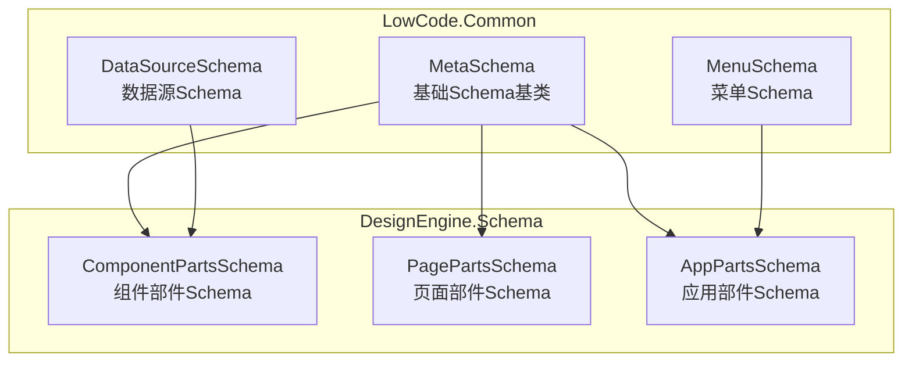
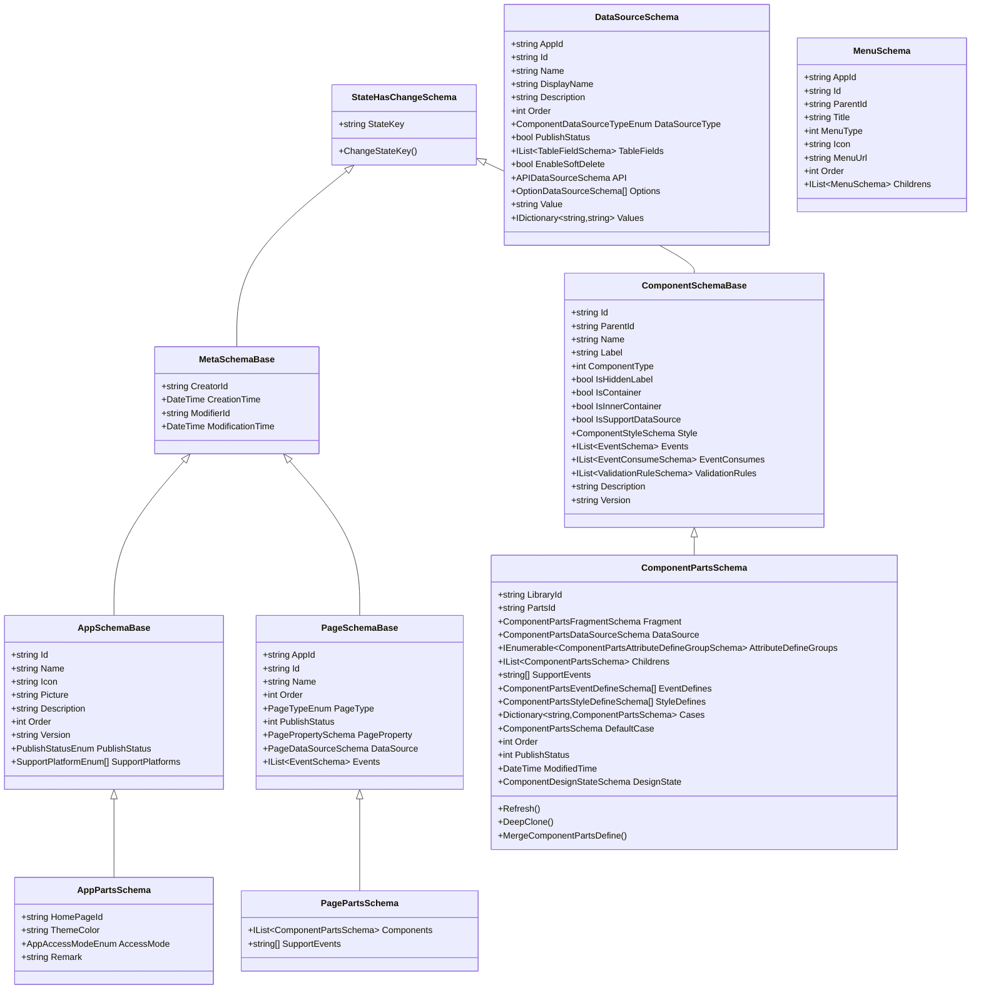
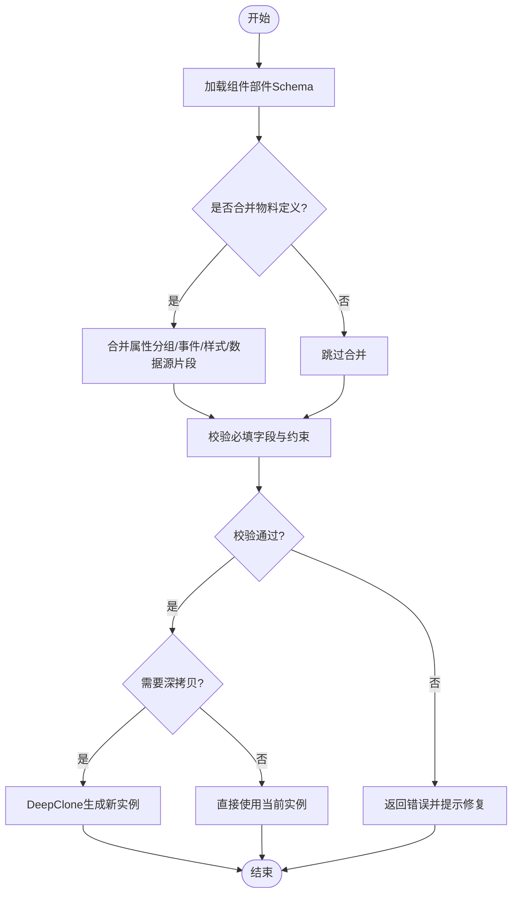
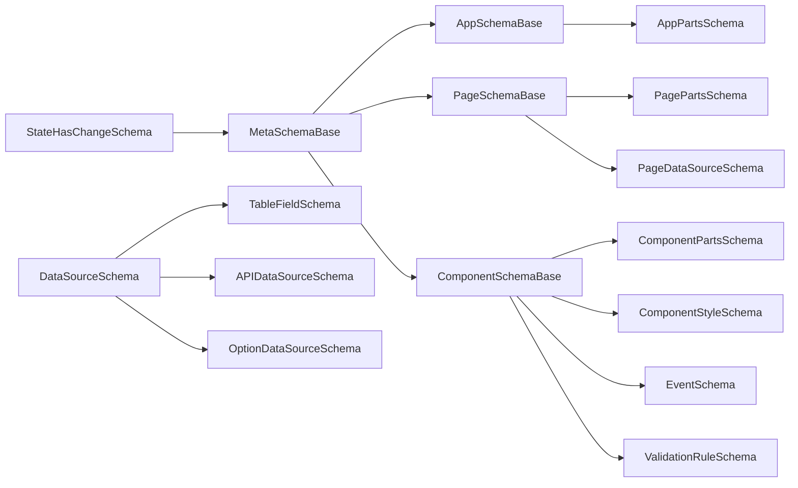

# 设计引擎Schema

<cite>
**本文引用的文件**
- [ComponentSchemaBase.cs](file://src/LowCode/Common/H.LowCode.MetaSchema/ComponentSchemaBase.cs)
- [PageSchemaBase.cs](file://src/LowCode/Common/H.LowCode.MetaSchema/PageSchemaBase.cs)
- [AppSchemaBase.cs](file://src/LowCode/Common/H.LowCode.MetaSchema/AppSchemaBase.cs)
- [MetaSchemaBase.cs](file://src/LowCode/Common/H.LowCode.MetaSchema/MetaSchemaBase.cs)
- [StateHasChangeSchema.cs](file://src/LowCode/Common/H.LowCode.MetaSchema/StateHasChangeSchema.cs)
- [DataSourceSchema.cs](file://src/LowCode/Common/H.LowCode.MetaSchema/DataSourceSchema.cs)
- [MenuSchema.cs](file://src/LowCode/Common/H.LowCode.MetaSchema/MenuSchema.cs)
- [ComponentPartsSchema.cs](file://src/LowCode/Common/H.LowCode.MetaSchema.DesignEngine/ComponentPartsSchema.cs)
- [PagePartsSchema.cs](file://src/LowCode/Common/H.LowCode.MetaSchema.DesignEngine/PagePartsSchema.cs)
- [AppPartsSchema.cs](file://src/LowCode/Common/H.LowCode.MetaSchema.DesignEngine/AppPartsSchema.cs)
</cite>

## 目录
1. [简介](#简介)
2. [项目结构](#项目结构)
3. [核心组件](#核心组件)
4. [架构总览](#架构总览)
5. [详细组件分析](#详细组件分析)
6. [依赖关系分析](#依赖关系分析)
7. [性能考量](#性能考量)
8. [故障排查指南](#故障排查指南)
9. [结论](#结论)
10. [附录](#附录)

## 简介
本文件面向低代码设计引擎的Schema系统，系统性阐述设计时元数据模型与运行时渲染模型的职责边界、类型体系与扩展机制。重点覆盖：
- 设计引擎特有的Schema类型：组件部件Schema、页面模板Schema、应用模板Schema等
- 设计时属性Schema定义：可视化编辑器控件绑定、实时预览机制
- 组件片段Schema的设计模式：支持组件模块化与复用
- 设计状态Schema管理：拖拽状态、选择状态、编辑状态
- Schema验证规则与完整性检查
- 设计引擎扩展开发指南与自定义Schema实现

## 项目结构
本仓库采用分层与领域内聚的组织方式，LowCode域下Common层提供跨引擎共享的元数据Schema（MetaSchema），DesignEngine与RenderEngine分别承载设计期与运行期的具体实现。Schema相关核心位于H.LowCode.MetaSchema及其DesignEngine子命名空间。

图表来源
- [MetaSchemaBase.cs:1-20](file://src/LowCode/Common/H.LowCode.MetaSchema/MetaSchemaBase.cs#L1-L20)
- [ComponentSchemaBase.cs:1-104](file://src/LowCode/Common/H.LowCode.MetaSchema/ComponentSchemaBase.cs#L1-L104)
- [PageSchemaBase.cs:1-40](file://src/LowCode/Common/H.LowCode.MetaSchema/PageSchemaBase.cs#L1-L40)
- [AppSchemaBase.cs:1-32](file://src/LowCode/Common/H.LowCode.MetaSchema/AppSchemaBase.cs#L1-L32)
- [DataSourceSchema.cs:1-70](file://src/LowCode/Common/H.LowCode.MetaSchema/DataSourceSchema.cs#L1-L70)
- [MenuSchema.cs:1-39](file://src/LowCode/Common/H.LowCode.MetaSchema/MenuSchema.cs#L1-L39)
- [ComponentPartsSchema.cs:1-230](file://src/LowCode/Common/H.LowCode.MetaSchema.DesignEngine/ComponentPartsSchema.cs#L1-L230)
- [PagePartsSchema.cs:1-17](file://src/LowCode/Common/H.LowCode.MetaSchema.DesignEngine/PagePartsSchema.cs#L1-L17)
- [AppPartsSchema.cs:1-53](file://src/LowCode/Common/H.LowCode.MetaSchema.DesignEngine/AppPartsSchema.cs#L1-L53)

章节来源
- [ComponentSchemaBase.cs:1-104](file://src/LowCode/Common/H.LowCode.MetaSchema/ComponentSchemaBase.cs#L1-L104)
- [PageSchemaBase.cs:1-40](file://src/LowCode/Common/H.LowCode.MetaSchema/PageSchemaBase.cs#L1-L40)
- [AppSchemaBase.cs:1-32](file://src/LowCode/Common/H.LowCode.MetaSchema/AppSchemaBase.cs#L1-L32)
- [MetaSchemaBase.cs:1-20](file://src/LowCode/Common/H.LowCode.MetaSchema/MetaSchemaBase.cs#L1-L20)
- [StateHasChangeSchema.cs:1-17](file://src/LowCode/Common/H.LowCode.MetaSchema/StateHasChangeSchema.cs#L1-L17)
- [DataSourceSchema.cs:1-70](file://src/LowCode/Common/H.LowCode.MetaSchema/DataSourceSchema.cs#L1-L70)
- [MenuSchema.cs:1-39](file://src/LowCode/Common/H.LowCode.MetaSchema/MenuSchema.cs#L1-L39)
- [ComponentPartsSchema.cs:1-230](file://src/LowCode/Common/H.LowCode.MetaSchema.DesignEngine/ComponentPartsSchema.cs#L1-L230)
- [PagePartsSchema.cs:1-17](file://src/LowCode/Common/H.LowCode.MetaSchema.DesignEngine/PagePartsSchema.cs#L1-L17)
- [AppPartsSchema.cs:1-53](file://src/LowCode/Common/H.LowCode.MetaSchema.DesignEngine/AppPartsSchema.cs#L1-L53)

## 核心组件
- 基础元数据基类：统一创建者、修改者、时间戳等审计字段，并继承变更通知能力
- 组件Schema基类：描述组件实例Id、名称、显示名、类型、容器标识、样式、事件、校验规则、版本等
- 页面Schema基类：页面元信息、排序、类型、发布状态、页面属性、数据源、事件
- 应用Schema基类：应用基本信息、图标、封面、描述、排序、版本、发布状态、支持平台
- 数据源Schema：表结构、API、选项、字典等多类型数据源抽象
- 菜单Schema：树形菜单节点定义
- 设计期部件Schema：组件部件、页面部件、应用部件，承载设计期特有配置与状态

章节来源
- [MetaSchemaBase.cs:1-20](file://src/LowCode/Common/H.LowCode.MetaSchema/MetaSchemaBase.cs#L1-L20)
- [ComponentSchemaBase.cs:1-104](file://src/LowCode/Common/H.LowCode.MetaSchema/ComponentSchemaBase.cs#L1-L104)
- [PageSchemaBase.cs:1-40](file://src/LowCode/Common/H.LowCode.MetaSchema/PageSchemaBase.cs#L1-L40)
- [AppSchemaBase.cs:1-32](file://src/LowCode/Common/H.LowCode.MetaSchema/AppSchemaBase.cs#L1-L32)
- [DataSourceSchema.cs:1-70](file://src/LowCode/Common/H.LowCode.MetaSchema/DataSourceSchema.cs#L1-L70)
- [MenuSchema.cs:1-39](file://src/LowCode/Common/H.LowCode.MetaSchema/MenuSchema.cs#L1-L39)
- [ComponentPartsSchema.cs:1-230](file://src/LowCode/Common/H.LowCode.MetaSchema.DesignEngine/ComponentPartsSchema.cs#L1-L230)
- [PagePartsSchema.cs:1-17](file://src/LowCode/Common/H.LowCode.MetaSchema.DesignEngine/PagePartsSchema.cs#L1-L17)
- [AppPartsSchema.cs:1-53](file://src/LowCode/Common/H.LowCode.MetaSchema.DesignEngine/AppPartsSchema.cs#L1-L53)

## 架构总览
设计期Schema与运行期Schema通过“部件Schema”作为桥梁：设计期以部件Schema描述组件物料与属性定义，生成或合并到组件实例Schema；运行期基于组件实例Schema进行渲染与交互。

图表来源
- [StateHasChangeSchema.cs:1-17](file://src/LowCode/Common/H.LowCode.MetaSchema/StateHasChangeSchema.cs#L1-L17)
- [MetaSchemaBase.cs:1-20](file://src/LowCode/Common/H.LowCode.MetaSchema/MetaSchemaBase.cs#L1-L20)
- [AppSchemaBase.cs:1-32](file://src/LowCode/Common/H.LowCode.MetaSchema/AppSchemaBase.cs#L1-L32)
- [PageSchemaBase.cs:1-40](file://src/LowCode/Common/H.LowCode.MetaSchema/PageSchemaBase.cs#L1-L40)
- [ComponentSchemaBase.cs:1-104](file://src/LowCode/Common/H.LowCode.MetaSchema/ComponentSchemaBase.cs#L1-L104)
- [DataSourceSchema.cs:1-70](file://src/LowCode/Common/H.LowCode.MetaSchema/DataSourceSchema.cs#L1-L70)
- [MenuSchema.cs:1-39](file://src/LowCode/Common/H.LowCode.MetaSchema/MenuSchema.cs#L1-L39)
- [ComponentPartsSchema.cs:1-230](file://src/LowCode/Common/H.LowCode.MetaSchema.DesignEngine/ComponentPartsSchema.cs#L1-L230)
- [PagePartsSchema.cs:1-17](file://src/LowCode/Common/H.LowCode.MetaSchema.DesignEngine/PagePartsSchema.cs#L1-L17)
- [AppPartsSchema.cs:1-53](file://src/LowCode/Common/H.LowCode.MetaSchema.DesignEngine/AppPartsSchema.cs#L1-L53)

## 详细组件分析

### 组件部件Schema（ComponentPartsSchema）
- 作用：定义组件物料的结构、属性分组、事件与样式定义、条件分支、数据源片段以及设计期状态
- 关键特性：
  - 支持父子层级结构与条件分支渲染（Cases/DefaultCase）
  - 属性定义分组（AttributeDefineGroups）驱动可视化编辑器控件绑定
  - 事件与样式定义（EventDefines/StyleDefines）用于设计期配置与预览
  - 设计期状态（DesignState）与刷新回调（Refresh）支撑拖拽、选择、编辑等交互
  - DeepClone与MergeComponentPartsDefine支持复制与合并物料定义到实例

图表来源
- [ComponentPartsSchema.cs:103-136](file://src/LowCode/Common/H.LowCode.MetaSchema.DesignEngine/ComponentPartsSchema.cs#L103-L136)
- [ComponentPartsSchema.cs:149-229](file://src/LowCode/Common/H.LowCode.MetaSchema.DesignEngine/ComponentPartsSchema.cs#L149-L229)

章节来源
- [ComponentPartsSchema.cs:1-230](file://src/LowCode/Common/H.LowCode.MetaSchema.DesignEngine/ComponentPartsSchema.cs#L1-L230)

### 页面部件Schema（PagePartsSchema）
- 作用：定义页面级部件集合与页面支持的事件列表（如OnLoad）
- 特点：聚合组件部件列表，便于页面级布局与事件编排

章节来源
- [PagePartsSchema.cs:1-17](file://src/LowCode/Common/H.LowCode.MetaSchema.DesignEngine/PagePartsSchema.cs#L1-L17)

### 应用部件Schema（AppPartsSchema）
- 作用：定义应用级配置，包括默认首页、主题主色、访问模式、备注等
- 访问模式：公开、登录后可访问、仅成员可访问

章节来源
- [AppPartsSchema.cs:1-53](file://src/LowCode/Common/H.LowCode.MetaSchema.DesignEngine/AppPartsSchema.cs#L1-L53)

### 组件Schema基类（ComponentSchemaBase）
- 作用：描述组件实例的核心元数据与行为开关
- 关键点：
  - 容器标识与内部容器标识控制拖拽与嵌套
  - 是否支持数据源由容器类型决定
  - 样式、事件、事件消费、校验规则、版本等完整描述

章节来源
- [ComponentSchemaBase.cs:1-104](file://src/LowCode/Common/H.LowCode.MetaSchema/ComponentSchemaBase.cs#L1-L104)

### 页面Schema基类（PageSchemaBase）
- 作用：页面元信息与页面级数据源、事件、属性配置
- 关键点：页面类型、发布状态、排序、页面属性与数据源

章节来源
- [PageSchemaBase.cs:1-40](file://src/LowCode/Common/H.LowCode.MetaSchema/PageSchemaBase.cs#L1-L40)

### 应用Schema基类（AppSchemaBase）
- 作用：应用基本信息、展示与发布状态、支持平台
- 关键点：图标、封面、描述、版本、平台枚举数组

章节来源
- [AppSchemaBase.cs:1-32](file://src/LowCode/Common/H.LowCode.MetaSchema/AppSchemaBase.cs#L1-L32)

### 数据源Schema（DataSourceSchema）
- 作用：统一抽象多种数据源类型（表、API、选项、字典）
- 关键点：
  - 表数据源包含字段定义与软删除开关
  - API数据源与选项数据源支持不同场景的数据绑定
  - 字典数据源使用键值对映射

章节来源
- [DataSourceSchema.cs:1-70](file://src/LowCode/Common/H.LowCode.MetaSchema/DataSourceSchema.cs#L1-L70)

### 菜单Schema（MenuSchema）
- 作用：树形菜单节点定义，支持父子关系、类型、路径与排序
- 关键点：菜单类型（菜单/目录）、图标、路径、子节点

章节来源
- [MenuSchema.cs:1-39](file://src/LowCode/Common/H.LowCode.MetaSchema/MenuSchema.cs#L1-L39)

### 设计状态Schema（StateHasChangeSchema）
- 作用：为所有Schema提供唯一StateKey与变更触发能力
- 关键点：StateKey用于UI状态同步与增量更新

章节来源
- [StateHasChangeSchema.cs:1-17](file://src/LowCode/Common/H.LowCode.MetaSchema/StateHasChangeSchema.cs#L1-L17)

## 依赖关系分析
- 继承关系：
  - MetaSchemaBase继承StateHasChangeSchema，提供审计与变更能力
  - AppSchemaBase、PageSchemaBase、ComponentSchemaBase均继承MetaSchemaBase
  - 设计期部件Schema（ComponentPartsSchema、PagePartsSchema、AppPartsSchema）分别继承对应基类
- 组合关系：
  - ComponentSchemaBase组合样式、事件、校验规则等属性Schema
  - PageSchemaBase组合页面属性与数据源Schema
  - DataSourceSchema组合表字段、API、选项、字典等具体数据源Schema
- 耦合度与内聚性：
  - 设计期部件Schema高度内聚于设计器交互逻辑（设计状态、刷新、合并、克隆）
  - 运行期Schema保持简洁，侧重渲染所需的最小元数据

图表来源
- [StateHasChangeSchema.cs:1-17](file://src/LowCode/Common/H.LowCode.MetaSchema/StateHasChangeSchema.cs#L1-L17)
- [MetaSchemaBase.cs:1-20](file://src/LowCode/Common/H.LowCode.MetaSchema/MetaSchemaBase.cs#L1-L20)
- [AppSchemaBase.cs:1-32](file://src/LowCode/Common/H.LowCode.MetaSchema/AppSchemaBase.cs#L1-L32)
- [PageSchemaBase.cs:1-40](file://src/LowCode/Common/H.LowCode.MetaSchema/PageSchemaBase.cs#L1-L40)
- [ComponentSchemaBase.cs:1-104](file://src/LowCode/Common/H.LowCode.MetaSchema/ComponentSchemaBase.cs#L1-L104)
- [DataSourceSchema.cs:1-70](file://src/LowCode/Common/H.LowCode.MetaSchema/DataSourceSchema.cs#L1-L70)
- [ComponentPartsSchema.cs:1-230](file://src/LowCode/Common/H.LowCode.MetaSchema.DesignEngine/ComponentPartsSchema.cs#L1-L230)
- [PagePartsSchema.cs:1-17](file://src/LowCode/Common/H.LowCode.MetaSchema.DesignEngine/PagePartsSchema.cs#L1-L17)
- [AppPartsSchema.cs:1-53](file://src/LowCode/Common/H.LowCode.MetaSchema.DesignEngine/AppPartsSchema.cs#L1-L53)

章节来源
- [ComponentSchemaBase.cs:1-104](file://src/LowCode/Common/H.LowCode.MetaSchema/ComponentSchemaBase.cs#L1-L104)
- [PageSchemaBase.cs:1-40](file://src/LowCode/Common/H.LowCode.MetaSchema/PageSchemaBase.cs#L1-L40)
- [AppSchemaBase.cs:1-32](file://src/LowCode/Common/H.LowCode.MetaSchema/AppSchemaBase.cs#L1-L32)
- [DataSourceSchema.cs:1-70](file://src/LowCode/Common/H.LowCode.MetaSchema/DataSourceSchema.cs#L1-L70)
- [ComponentPartsSchema.cs:1-230](file://src/LowCode/Common/H.LowCode.MetaSchema.DesignEngine/ComponentPartsSchema.cs#L1-L230)
- [PagePartsSchema.cs:1-17](file://src/LowCode/Common/H.LowCode.MetaSchema.DesignEngine/PagePartsSchema.cs#L1-L17)
- [AppPartsSchema.cs:1-53](file://src/LowCode/Common/H.LowCode.MetaSchema.DesignEngine/AppPartsSchema.cs#L1-L53)

## 性能考量
- 深拷贝与递归处理：DeepCloneRecursive在复杂组件树中可能产生较大开销，建议按需启用并在大对象上避免频繁调用
- 合并策略：MergeComponentPartsDefine按组与属性名匹配更新，减少全量替换带来的序列化与渲染成本
- 状态键变更：ChangeStateKey会触发UI重新渲染，应仅在必要时调用以避免抖动
- 数据源选择：优先使用轻量数据源（如选项/字典）以减少网络与解析开销

[本节为通用指导，不直接分析具体文件]

## 故障排查指南
- 校验失败：
  - 检查组件实例必填字段（Id、Name等）与校验规则（ValidationRules）
  - 确认容器组件未错误启用数据源（IsSupportDataSource受IsContainer影响）
- 事件未触发：
  - 核对组件支持事件列表（SupportEvents）与事件定义（EventDefines）
  - 确保事件消费（EventConsumes）正确配置
- 预览异常：
  - 检查样式定义（StyleDefines）与属性分组（AttributeDefineGroups）是否完整
  - 确认设计状态（DesignState）未被污染（如选中状态未重置）
- 数据源问题：
  - 表数据源字段缺失或类型不匹配
  - API数据源URL或参数配置错误
  - 选项/字典数据源键值对为空或不一致

章节来源
- [ComponentSchemaBase.cs:1-104](file://src/LowCode/Common/H.LowCode.MetaSchema/ComponentSchemaBase.cs#L1-L104)
- [ComponentPartsSchema.cs:1-230](file://src/LowCode/Common/H.LowCode.MetaSchema.DesignEngine/ComponentPartsSchema.cs#L1-L230)
- [DataSourceSchema.cs:1-70](file://src/LowCode/Common/H.LowCode.MetaSchema/DataSourceSchema.cs#L1-L70)

## 结论
本Schema体系通过清晰的基类继承与组合关系，将设计期与运行期关注点解耦，同时以部件Schema为核心实现组件物料化与复用。设计状态与校验规则保障了设计器的交互体验与数据一致性。扩展方面，可通过新增属性Schema、数据源Schema与部件Schema快速丰富引擎能力。

[本节为总结性内容，不直接分析具体文件]

## 附录

### 设计时属性Schema与可视化编辑器绑定
- 属性分组（AttributeDefineGroups）驱动编辑器面板的分组与控件渲染
- 每个属性定义（AttributeDefineSchema）指定显示名、类型、默认值、选项与校验规则
- 实时预览通过StateKey变化与组件刷新回调（Refresh）联动

章节来源
- [ComponentPartsSchema.cs:1-230](file://src/LowCode/Common/H.LowCode.MetaSchema.DesignEngine/ComponentPartsSchema.cs#L1-L230)

### 设计状态Schema管理
- 拖拽状态：通过组件树ParentId与Order维护位置与层级
- 选择状态：DesignState.IsSelected标记当前选中项
- 编辑状态：属性分组与事件/样式定义共同构成编辑上下文

章节来源
- [ComponentPartsSchema.cs:87-101](file://src/LowCode/Common/H.LowCode.MetaSchema.DesignEngine/ComponentPartsSchema.cs#L87-L101)

### Schema验证规则与完整性检查
- 组件实例校验：必填字段、类型约束、容器与数据源兼容性
- 页面与应用校验：发布状态、平台支持、访问模式合法性
- 数据源校验：字段完整性、API可达性、选项非空

章节来源
- [ComponentSchemaBase.cs:1-104](file://src/LowCode/Common/H.LowCode.MetaSchema/ComponentSchemaBase.cs#L1-L104)
- [PageSchemaBase.cs:1-40](file://src/LowCode/Common/H.LowCode.MetaSchema/PageSchemaBase.cs#L1-L40)
- [AppSchemaBase.cs:1-32](file://src/LowCode/Common/H.LowCode.MetaSchema/AppSchemaBase.cs#L1-L32)
- [DataSourceSchema.cs:1-70](file://src/LowCode/Common/H.LowCode.MetaSchema/DataSourceSchema.cs#L1-L70)

### 设计引擎扩展开发指南
- 新增组件部件Schema：
  - 定义属性分组与事件/样式定义
  - 实现DeepClone与MergeComponentPartsDefine逻辑
  - 注册至组件库（LibraryId）供设计器使用
- 自定义数据源Schema：
  - 扩展DataSourceSchema的具体类型（如新增GraphQLDataSourceSchema）
  - 在页面/组件数据源配置中接入
- 自定义属性Schema：
  - 在属性分组中添加新的AttributeDefineSchema
  - 在编辑器侧实现对应的控件绑定与双向数据绑定

章节来源
- [ComponentPartsSchema.cs:103-229](file://src/LowCode/Common/H.LowCode.MetaSchema.DesignEngine/ComponentPartsSchema.cs#L103-L229)
- [DataSourceSchema.cs:1-70](file://src/LowCode/Common/H.LowCode.MetaSchema/DataSourceSchema.cs#L1-L70)