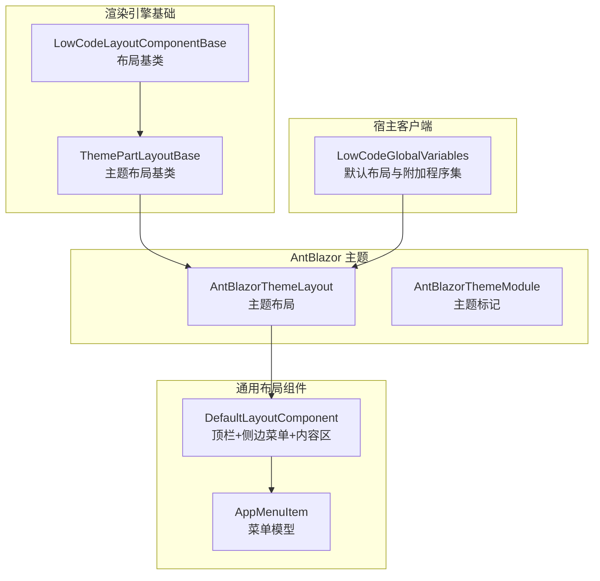
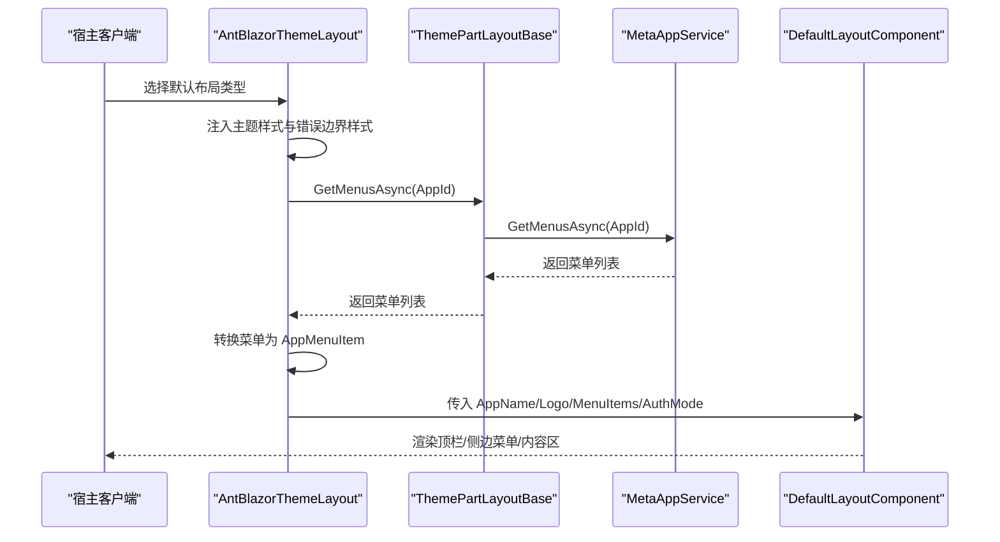
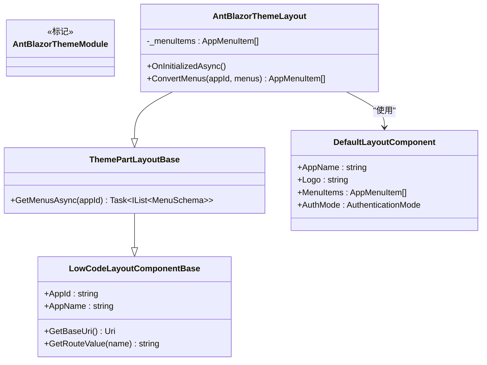
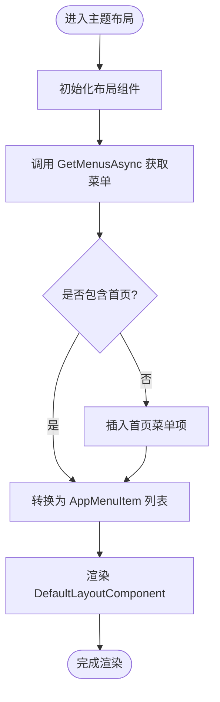
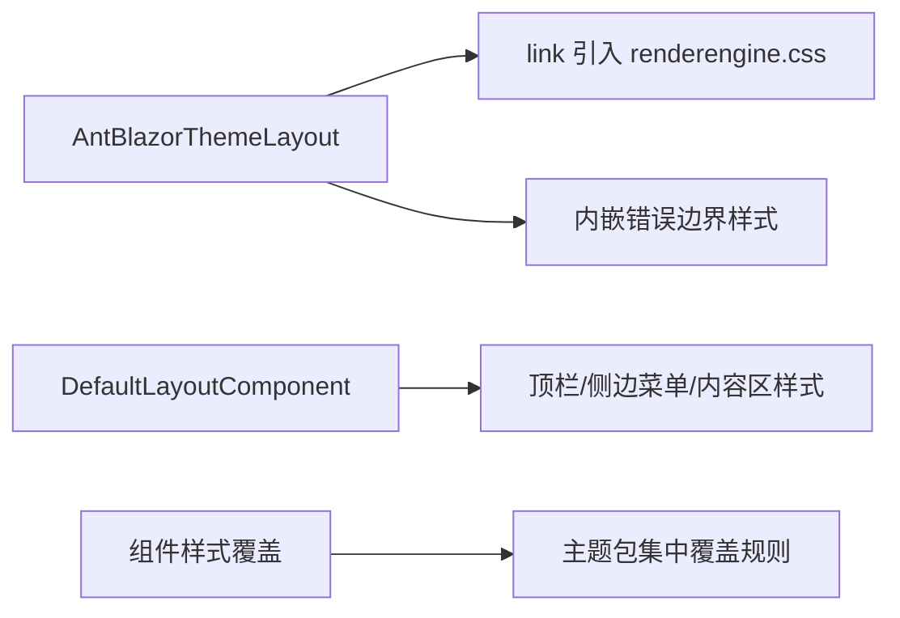
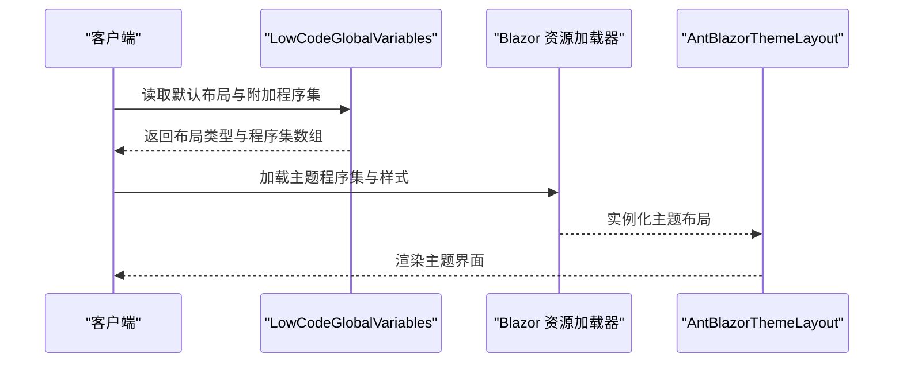
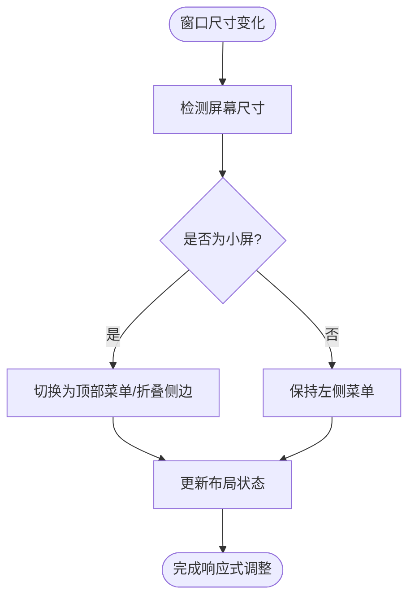
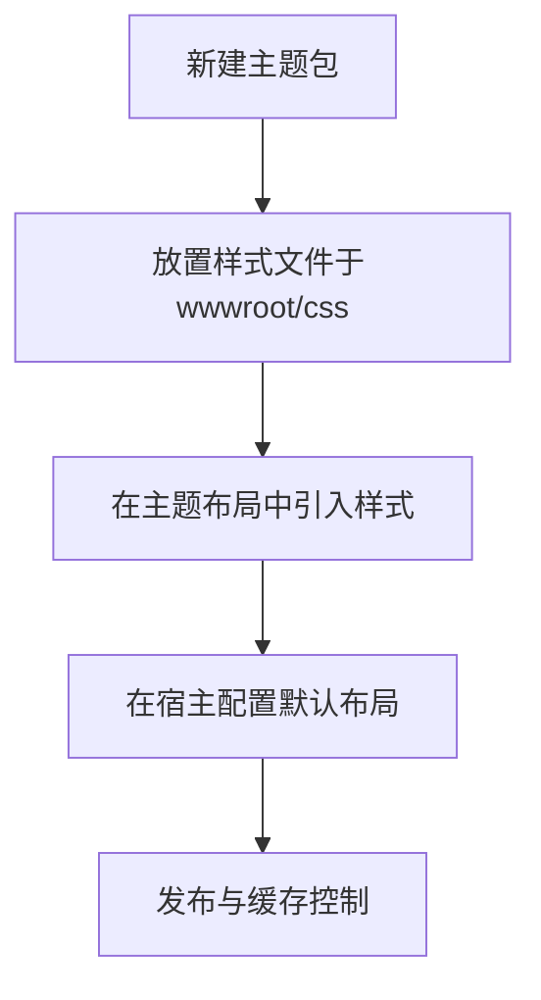
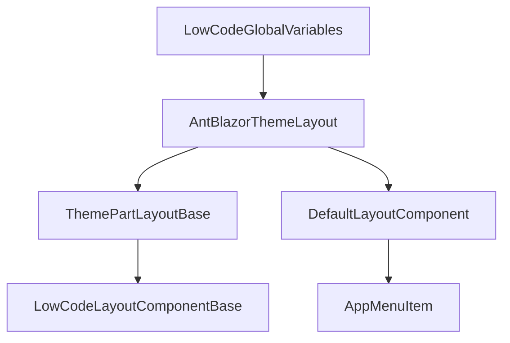

# 主题系统

<cite>
**本文引用的文件**   
- [AntBlazorThemeModule.cs](file://src/LowCode/RenderEngine/H.LowCode.RenderEngine/AntBlazorThemeModule.cs)
- [AntBlazorThemeLayout.razor](file://src/LowCode/RenderEngine/H.LowCode.RenderEngine/Layout/AntBlazorThemeLayout.razor)
- [LowCodeGlobalVariables.cs](file://src/Host/RenderEngine/H.LowCode.RenderEngine.Host.Client/LowCodeGlobalVariables.cs)
- [ThemePartLayoutBase.cs](file://src/LowCode/RenderEngine/H.LowCode.RenderEngineBase/Layout/ThemePartLayoutBase.cs)
- [LowCodeLayoutComponentBase.cs](file://src/LowCode/Common/H.LowCode.ComponentBase/LowCodeLayoutComponentBase.cs)
- [DefaultLayoutComponent.razor](file://src/Components/AppDrawer/H.AppDrawer.Components/Components/DefaultLayoutComponent.razor)
- [AppMenuItem.cs](file://src/Components/AppDrawer/H.AppDrawer.Model/AppMenuItem.cs)
- [ComponentStyleSchema.cs](file://src/LowCode/Common/H.LowCode.MetaSchema/PropertySchemas/ComponentStyleSchema.cs)
- [H.LowCode.RenderEngine.Host.html](file://src/Host/RenderEngine/H.LowCode.RenderEngine.Host/Components/App.razor)
</cite>

## 目录
1. [简介](#简介)
2. [项目结构](#项目结构)
3. [核心组件](#核心组件)
4. [架构总览](#架构总览)
5. [详细组件分析](#详细组件分析)
6. [依赖关系分析](#依赖关系分析)
7. [性能考虑](#性能考虑)
8. [故障排查指南](#故障排查指南)
9. [结论](#结论)
10. [附录](#附录)

## 简介
本文件围绕“主题系统”进行系统化说明，重点覆盖：
- AntBlazor 主题的集成方式与样式注入机制
- 组件样式覆盖策略与运行时主题切换
- 布局系统工作原理（ThemePartLayoutBase、页面布局配置、导航栏定制）
- 自定义主题创建最佳实践（样式组织、组件样式覆盖、图标资源管理）
- 主题性能优化与兼容性注意事项

该主题系统基于 Blazor WebAssembly 的模块化资源加载能力，通过“默认布局组件 + 主题布局”的组合实现可插拔的主题体系。

## 项目结构
主题相关代码主要分布在以下模块：
- 渲染引擎基础层：提供布局基类与通用能力
- AntBlazor 主题：具体主题实现与样式注入
- 宿主客户端：声明默认主题布局与额外程序集
- 通用抽屉布局：承载顶部导航、侧边菜单与内容区

**图表来源** 
- [LowCodeLayoutComponentBase.cs:1-66](file://src/LowCode/Common/H.LowCode.ComponentBase/LowCodeLayoutComponentBase.cs#L1-L66)
- [ThemePartLayoutBase.cs:1-43](file://src/LowCode/RenderEngine/H.LowCode.RenderEngineBase/Layout/ThemePartLayoutBase.cs#L1-L43)
- [AntBlazorThemeLayout.razor:1-60](file://src/LowCode/RenderEngine/H.LowCode.RenderEngine/Layout/AntBlazorThemeLayout.razor#L1-L60)
- [AntBlazorThemeModule.cs:1-9](file://src/LowCode/RenderEngine/H.LowCode.RenderEngine/AntBlazorThemeModule.cs#L1-L9)
- [LowCodeGlobalVariables.cs:1-14](file://src/Host/RenderEngine/H.LowCode.RenderEngine.Host.Client/LowCodeGlobalVariables.cs#L1-L14)
- [DefaultLayoutComponent.razor:1-270](file://src/Components/AppDrawer/H.AppDrawer.Components/Components/DefaultLayoutComponent.razor#L1-L270)
- [AppMenuItem.cs:1-22](file://src/Components/AppDrawer/H.AppDrawer.Model/AppMenuItem.cs#L1-L22)

**章节来源**
- [LowCodeLayoutComponentBase.cs:1-66](file://src/LowCode/Common/H.LowCode.ComponentBase/LowCodeLayoutComponentBase.cs#L1-L66)
- [ThemePartLayoutBase.cs:1-43](file://src/LowCode/RenderEngine/H.LowCode.RenderEngineBase/Layout/ThemePartLayoutBase.cs#L1-L43)
- [AntBlazorThemeLayout.razor:1-60](file://src/LowCode/RenderEngine/H.LowCode.RenderEngine/Layout/AntBlazorThemeLayout.razor#L1-L60)
- [AntBlazorThemeModule.cs:1-9](file://src/LowCode/RenderEngine/H.LowCode.RenderEngine/AntBlazorThemeModule.cs#L1-L9)
- [LowCodeGlobalVariables.cs:1-14](file://src/Host/RenderEngine/H.LowCode.RenderEngine.Host.Client/LowCodeGlobalVariables.cs#L1-L14)
- [DefaultLayoutComponent.razor:1-270](file://src/Components/AppDrawer/H.AppDrawer.Components/Components/DefaultLayoutComponent.razor#L1-L270)
- [AppMenuItem.cs:1-22](file://src/Components/AppDrawer/H.AppDrawer.Model/AppMenuItem.cs#L1-L22)

## 核心组件
- LowCodeLayoutComponentBase：为所有布局组件提供路由参数解析、应用标识、基础 URI 等通用能力。
- ThemePartLayoutBase：在布局基类之上扩展菜单获取与首页入口逻辑，统一主题布局的数据准备。
- AntBlazorThemeLayout：具体主题布局，负责引入主题样式、错误边界样式、并组合 DefaultLayoutComponent 呈现整体界面。
- DefaultLayoutComponent：通用布局容器，包含 TopNavbar、SideMenu/TopMenu、内容区与 AppDrawer，支持认证模式与菜单位置配置。
- AppMenuItem：菜单项数据模型，用于构建导航树。

**章节来源**
- [LowCodeLayoutComponentBase.cs:1-66](file://src/LowCode/Common/H.LowCode.ComponentBase/LowCodeLayoutComponentBase.cs#L1-L66)
- [ThemePartLayoutBase.cs:1-43](file://src/LowCode/RenderEngine/H.LowCode.RenderEngineBase/Layout/ThemePartLayoutBase.cs#L1-L43)
- [AntBlazorThemeLayout.razor:1-60](file://src/LowCode/RenderEngine/H.LowCode.RenderEngine/Layout/AntBlazorThemeLayout.razor#L1-L60)
- [DefaultLayoutComponent.razor:1-270](file://src/Components/AppDrawer/H.AppDrawer.Components/Components/DefaultLayoutComponent.razor#L1-L270)
- [AppMenuItem.cs:1-22](file://src/Components/AppDrawer/H.AppDrawer.Model/AppMenuItem.cs#L1-L22)

## 架构总览
主题系统的运行流程如下：
- 宿主客户端通过全局变量声明默认主题布局与附加程序集
- 主题布局在初始化时加载主题样式与错误边界样式
- 主题布局调用基类方法获取菜单并转换为 UI 菜单模型
- 最终由 DefaultLayoutComponent 渲染顶栏、菜单与内容区域

**图表来源** 
- [LowCodeGlobalVariables.cs:1-14](file://src/Host/RenderEngine/H.LowCode.RenderEngine.Host.Client/LowCodeGlobalVariables.cs#L1-L14)
- [AntBlazorThemeLayout.razor:1-60](file://src/LowCode/RenderEngine/H.LowCode.RenderEngine/Layout/AntBlazorThemeLayout.razor#L1-L60)
- [ThemePartLayoutBase.cs:1-43](file://src/LowCode/RenderEngine/H.LowCode.RenderEngineBase/Layout/ThemePartLayoutBase.cs#L1-L43)
- [DefaultLayoutComponent.razor:1-270](file://src/Components/AppDrawer/H.AppDrawer.Components/Components/DefaultLayoutComponent.razor#L1-L270)

## 详细组件分析

### AntBlazor 主题集成与样式注入
- 主题模块标记：AntBlazorThemeModule 作为主题模块的标记类，便于识别与注册。
- 主题布局：AntBlazorThemeLayout 继承自 ThemePartLayoutBase，并在头部引入 renderengine.css；同时定义错误边界样式以提升异常可见性。
- 宿主配置：LowCodeGlobalVariables 指定默认布局类型为 AntBlazorThemeLayout，并将主题程序集加入附加程序集集合，确保资源按需加载。

**图表来源** 
- [AntBlazorThemeModule.cs:1-9](file://src/LowCode/RenderEngine/H.LowCode.RenderEngine/AntBlazorThemeModule.cs#L1-L9)
- [AntBlazorThemeLayout.razor:1-60](file://src/LowCode/RenderEngine/H.LowCode.RenderEngine/Layout/AntBlazorThemeLayout.razor#L1-L60)
- [ThemePartLayoutBase.cs:1-43](file://src/LowCode/RenderEngine/H.LowCode.RenderEngineBase/Layout/ThemePartLayoutBase.cs#L1-L43)
- [LowCodeLayoutComponentBase.cs:1-66](file://src/LowCode/Common/H.LowCode.ComponentBase/LowCodeLayoutComponentBase.cs#L1-L66)
- [DefaultLayoutComponent.razor:1-270](file://src/Components/AppDrawer/H.AppDrawer.Components/Components/DefaultLayoutComponent.razor#L1-L270)

**章节来源**
- [AntBlazorThemeModule.cs:1-9](file://src/LowCode/RenderEngine/H.LowCode.RenderEngine/AntBlazorThemeModule.cs#L1-L9)
- [AntBlazorThemeLayout.razor:1-60](file://src/LowCode/RenderEngine/H.LowCode.RenderEngine/Layout/AntBlazorThemeLayout.razor#L1-L60)
- [LowCodeGlobalVariables.cs:1-14](file://src/Host/RenderEngine/H.LowCode.RenderEngine.Host.Client/LowCodeGlobalVariables.cs#L1-L14)

### 布局系统与导航定制
- 基类职责：LowCodeLayoutComponentBase 提供 AppId、AppName、路由值读取与基础 URI 工具方法。
- 主题布局增强：ThemePartLayoutBase 扩展了菜单获取逻辑，并确保存在“首页”入口。
- 默认布局组件：DefaultLayoutComponent 整合 TopNavbar、SideMenu/TopMenu、内容区与 AppDrawer，支持认证模式与菜单位置配置。
- 菜单模型：AppMenuItem 描述名称、URL、图标、Key 与子菜单结构。

**图表来源** 
- [ThemePartLayoutBase.cs:1-43](file://src/LowCode/RenderEngine/H.LowCode.RenderEngineBase/Layout/ThemePartLayoutBase.cs#L1-L43)
- [AntBlazorThemeLayout.razor:1-60](file://src/LowCode/RenderEngine/H.LowCode.RenderEngine/Layout/AntBlazorThemeLayout.razor#L1-L60)
- [DefaultLayoutComponent.razor:1-270](file://src/Components/AppDrawer/H.AppDrawer.Components/Components/DefaultLayoutComponent.razor#L1-L270)
- [AppMenuItem.cs:1-22](file://src/Components/AppDrawer/H.AppDrawer.Model/AppMenuItem.cs#L1-L22)

**章节来源**
- [LowCodeLayoutComponentBase.cs:1-66](file://src/LowCode/Common/H.LowCode.ComponentBase/LowCodeLayoutComponentBase.cs#L1-L66)
- [ThemePartLayoutBase.cs:1-43](file://src/LowCode/RenderEngine/H.LowCode.RenderEngineBase/Layout/ThemePartLayoutBase.cs#L1-L43)
- [DefaultLayoutComponent.razor:1-270](file://src/Components/AppDrawer/H.AppDrawer.Components/Components/DefaultLayoutComponent.razor#L1-L270)
- [AppMenuItem.cs:1-22](file://src/Components/AppDrawer/H.AppDrawer.Model/AppMenuItem.cs#L1-L22)

### 样式注入与组件样式覆盖策略
- 样式注入点：AntBlazorThemeLayout 在布局中通过 link 标签引入 renderengine.css，确保主题样式优先加载。
- 错误边界样式：布局内嵌错误边界样式，提升异常提示的可读性与一致性。
- 组件样式覆盖：通过 scoped CSS 或更具体的选择器对组件样式进行覆盖；建议在主题包中集中维护覆盖规则，避免散落在各页面。
- 资源路径：样式与图标等资源通过 _content 路径引用，保证模块化与版本隔离。

**图表来源** 
- [AntBlazorThemeLayout.razor:1-60](file://src/LowCode/RenderEngine/H.LowCode.RenderEngine/Layout/AntBlazorThemeLayout.razor#L1-L60)
- [DefaultLayoutComponent.razor:1-270](file://src/Components/AppDrawer/H.AppDrawer.Components/Components/DefaultLayoutComponent.razor#L1-L270)

**章节来源**
- [AntBlazorThemeLayout.razor:1-60](file://src/LowCode/RenderEngine/H.LowCode.RenderEngine/Layout/AntBlazorThemeLayout.razor#L1-L60)
- [DefaultLayoutComponent.razor:1-270](file://src/Components/AppDrawer/H.AppDrawer.Components/Components/DefaultLayoutComponent.razor#L1-L270)

### 运行时主题切换与样式缓存管理
- 默认主题设置：LowCodeGlobalVariables 指定默认布局类型为 AntBlazorThemeLayout，并追加主题程序集，使主题可在运行时被正确解析与加载。
- 样式缓存：Blazor 的静态资源（CSS/JS）通常由浏览器缓存；建议通过版本号或哈希文件名控制缓存失效。
- 切换策略：如需动态切换主题，可通过替换默认布局类型或动态注入不同样式表实现；当前仓库以“默认主题固定”为主。

**图表来源** 
- [LowCodeGlobalVariables.cs:1-14](file://src/Host/RenderEngine/H.LowCode.RenderEngine.Host.Client/LowCodeGlobalVariables.cs#L1-L14)
- [AntBlazorThemeLayout.razor:1-60](file://src/LowCode/RenderEngine/H.LowCode.RenderEngine/Layout/AntBlazorThemeLayout.razor#L1-L60)

**章节来源**
- [LowCodeGlobalVariables.cs:1-14](file://src/Host/RenderEngine/H.LowCode.RenderEngine.Host.Client/LowCodeGlobalVariables.cs#L1-L14)

### 响应式设计支持
- 布局容器：DefaultLayoutComponent 使用 flex 布局与百分比宽度，适配不同屏幕尺寸。
- 内容区自适应：内容容器允许滚动且保持最小宽度，防止头部/工具栏被压缩。
- 菜单位置：支持左侧或顶部菜单，适应桌面与平板场景。

**图表来源** 
- [DefaultLayoutComponent.razor:1-270](file://src/Components/AppDrawer/H.AppDrawer.Components/Components/DefaultLayoutComponent.razor#L1-L270)

**章节来源**
- [DefaultLayoutComponent.razor:1-270](file://src/Components/AppDrawer/H.AppDrawer.Components/Components/DefaultLayoutComponent.razor#L1-L270)

### 自定义主题创建最佳实践
- 样式文件组织：将主题样式集中于主题包的 wwwroot/css 下，并通过布局组件统一引入。
- 组件样式覆盖：使用更高特异性的选择器或 scoped CSS 覆盖默认组件样式，避免污染全局样式。
- 图标资源管理：将图标资源放入主题包的 wwwroot 目录，并通过相对路径或 _content 路径引用。
- 主题切换扩展：如需多主题切换，可在宿主层提供主题选择器，动态替换默认布局或注入不同样式表。

[此图为概念性流程图，不直接映射具体源码文件]

## 依赖关系分析
主题系统的关键依赖关系如下：
- 宿主客户端依赖全局变量以选择默认布局与附加程序集
- 主题布局依赖布局基类与 MetaAppService 获取菜单
- 默认布局组件依赖菜单模型与导航服务

**图表来源** 
- [LowCodeGlobalVariables.cs:1-14](file://src/Host/RenderEngine/H.LowCode.RenderEngine.Host.Client/LowCodeGlobalVariables.cs#L1-L14)
- [AntBlazorThemeLayout.razor:1-60](file://src/LowCode/RenderEngine/H.LowCode.RenderEngine/Layout/AntBlazorThemeLayout.razor#L1-L60)
- [ThemePartLayoutBase.cs:1-43](file://src/LowCode/RenderEngine/H.LowCode.RenderEngineBase/Layout/ThemePartLayoutBase.cs#L1-L43)
- [LowCodeLayoutComponentBase.cs:1-66](file://src/LowCode/Common/H.LowCode.ComponentBase/LowCodeLayoutComponentBase.cs#L1-L66)
- [DefaultLayoutComponent.razor:1-270](file://src/Components/AppDrawer/H.AppDrawer.Components/Components/DefaultLayoutComponent.razor#L1-L270)
- [AppMenuItem.cs:1-22](file://src/Components/AppDrawer/H.AppDrawer.Model/AppMenuItem.cs#L1-L22)

**章节来源**
- [LowCodeGlobalVariables.cs:1-14](file://src/Host/RenderEngine/H.LowCode.RenderEngine.Host.Client/LowCodeGlobalVariables.cs#L1-L14)
- [AntBlazorThemeLayout.razor:1-60](file://src/LowCode/RenderEngine/H.LowCode.RenderEngine/Layout/AntBlazorThemeLayout.razor#L1-L60)
- [ThemePartLayoutBase.cs:1-43](file://src/LowCode/RenderEngine/H.LowCode.RenderEngineBase/Layout/ThemePartLayoutBase.cs#L1-L43)
- [LowCodeLayoutComponentBase.cs:1-66](file://src/LowCode/Common/H.LowCode.ComponentBase/LowCodeLayoutComponentBase.cs#L1-L66)
- [DefaultLayoutComponent.razor:1-270](file://src/Components/AppDrawer/H.AppDrawer.Components/Components/DefaultLayoutComponent.razor#L1-L270)
- [AppMenuItem.cs:1-22](file://src/Components/AppDrawer/H.AppDrawer.Model/AppMenuItem.cs#L1-L22)

## 性能考虑
- 样式加载顺序：确保主题样式在组件样式之前加载，避免覆盖失效。
- 资源体积控制：合并与压缩 CSS，减少请求数量；按需加载主题程序集。
- 缓存策略：为静态资源添加版本号或哈希后缀，提高缓存命中率并避免脏缓存。
- 首屏渲染：尽量减少首次渲染时的同步阻塞，异步检查认证状态与菜单数据。

[本节为通用指导，不直接分析具体文件]

## 故障排查指南
- 样式未生效：检查 AntBlazorThemeLayout 是否正确引入 renderengine.css；确认样式路径与 _content 引用是否正确。
- 错误边界样式缺失：确认布局内嵌的错误边界样式未被其他样式覆盖。
- 菜单未显示：检查 ThemePartLayoutBase 的 GetMenusAsync 是否成功返回菜单；确认首页入口是否存在。
- 认证跳转异常：验证 DefaultLayoutComponent 的认证模式与 API 返回格式是否符合预期。

**章节来源**
- [AntBlazorThemeLayout.razor:1-60](file://src/LowCode/RenderEngine/H.LowCode.RenderEngine/Layout/AntBlazorThemeLayout.razor#L1-L60)
- [ThemePartLayoutBase.cs:1-43](file://src/LowCode/RenderEngine/H.LowCode.RenderEngineBase/Layout/ThemePartLayoutBase.cs#L1-L43)
- [DefaultLayoutComponent.razor:1-270](file://src/Components/AppDrawer/H.AppDrawer.Components/Components/DefaultLayoutComponent.razor#L1-L270)

## 结论
本主题系统通过“布局基类 + 主题布局 + 默认布局组件”的分层设计，实现了清晰的样式注入与菜单渲染机制。AntBlazor 主题以模块化方式集成，宿主通过全局变量配置默认布局与附加程序集，确保主题可插拔与可扩展。在实际使用中，建议遵循样式集中管理、资源版本控制与响应式适配的最佳实践，以获得稳定与高性能的用户体验。

[本节为总结性内容，不直接分析具体文件]

## 附录
- 样式与资源路径示例：参考宿主 HTML 中的资源引用方式，确保主题样式与图标资源正确加载。
- 组件样式覆盖示例：参考 ComponentStyleSchema 的结构，合理组织组件样式属性。

**章节来源**
- [H.LowCode.RenderEngine.Host.html:1-32](file://src/Host/RenderEngine/H.LowCode.RenderEngine.Host/Components/App.razor#L1-L32)
- [ComponentStyleSchema.cs:1-39](file://src/LowCode/Common/H.LowCode.MetaSchema/PropertySchemas/ComponentStyleSchema.cs#L1-L39)