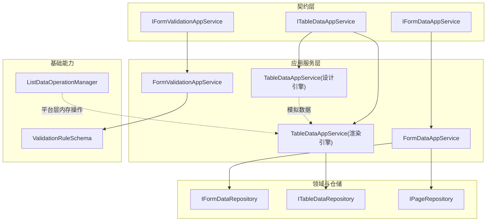
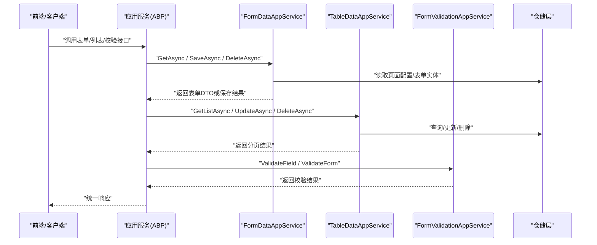
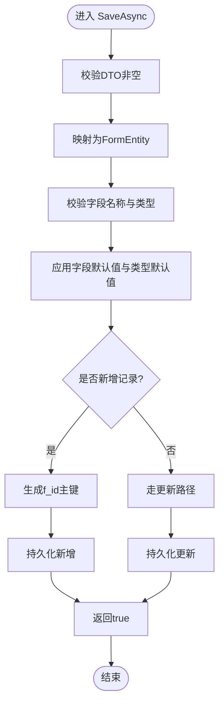
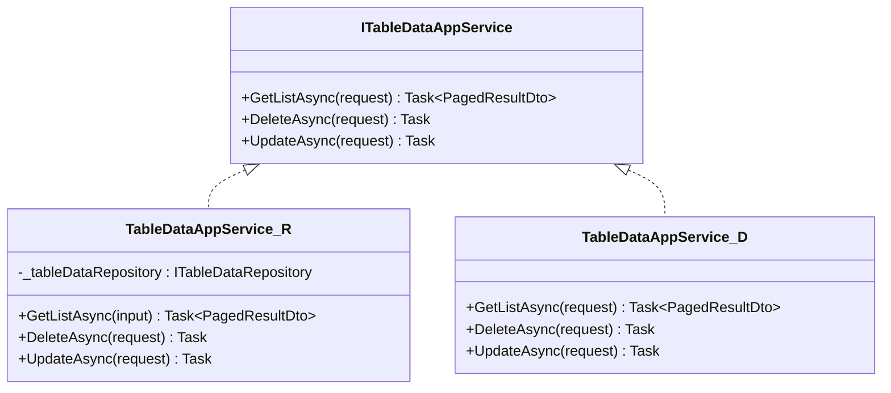
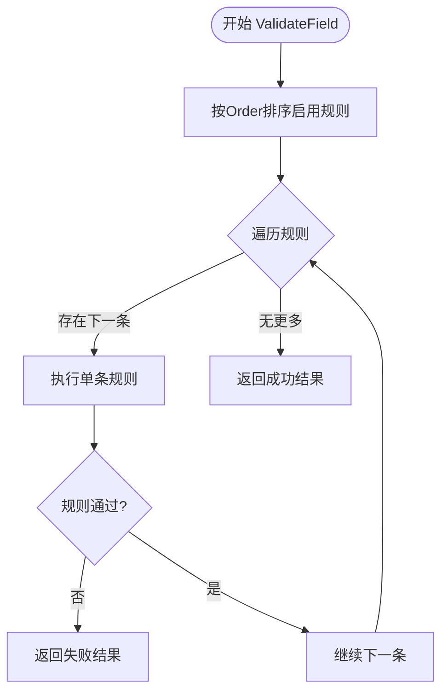
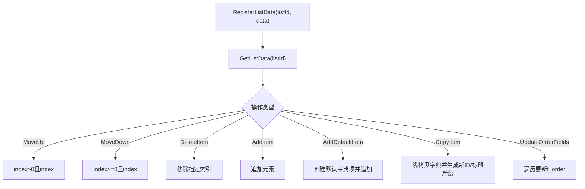
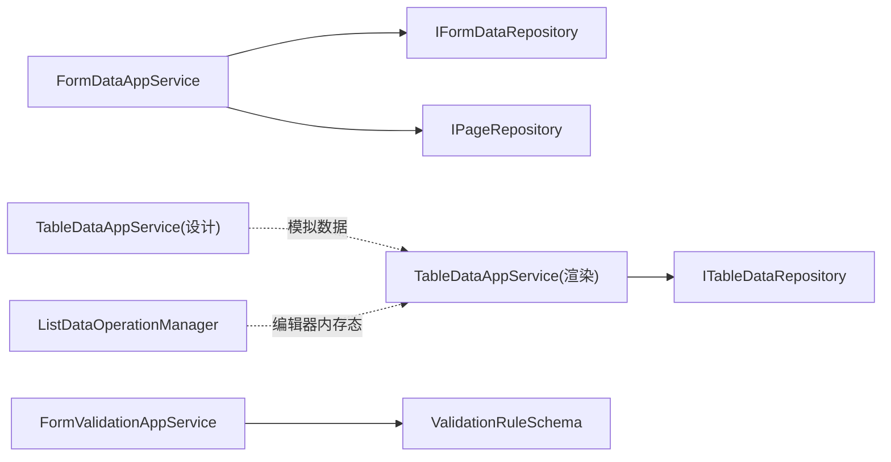

# 数据管理

<cite>
**本文引用的文件**   
- [IFormDataAppService.cs](file://src/LowCode/Common/H.LowCode.Application.Contracts/AppServices/IFormDataAppService.cs)
- [FormDataAppService.cs](file://src/LowCode/RenderEngine/H.LowCode.RenderEngine.Application/DataAppServices/FormDataAppService.cs)
- [ITableDataAppService.cs](file://src/LowCode/Common/H.LowCode.Application.Contracts/AppServices/ITableDataAppService.cs)
- [TableDataAppService（设计引擎）.cs](file://src/LowCode/DesignEngine/H.LowCode.DesignEngine.Application/AppServices/TableDataAppService.cs)
- [TableDataAppService（渲染引擎）.cs](file://src/LowCode/RenderEngine/H.LowCode.RenderEngine.Application/DataAppServices/TableDataAppService.cs)
- [ListDataOperationManager.cs](file://src/LowCode/RenderEngine/H.LowCode.RenderEngineBase/ListDataOperationManager.cs)
- [IFormValidationAppService.cs](file://src/LowCode/Common/H.LowCode.Application.Contracts/AppServices/IFormValidationAppService.cs)
- [FormValidationAppService.cs](file://src/LowCode/Common/H.LowCode.Application/Services/FormValidationAppService.cs)
- [ValidationRuleSchema.cs](file://src/LowCode/Common/H.LowCode.MetaSchema/PropertySchemas/ValidationRuleSchema.cs)
</cite>

## 目录
1. [简介](#简介)
2. [项目结构](#项目结构)
3. [核心组件](#核心组件)
4. [架构总览](#架构总览)
5. [详细组件分析](#详细组件分析)
6. [依赖关系分析](#依赖关系分析)
7. [性能考虑](#性能考虑)
8. [故障排查指南](#故障排查指南)
9. [结论](#结论)
10. [附录](#附录)

## 简介
本文件面向数据管理系统，聚焦于表单与列表数据的统一服务化能力。文档围绕以下目标展开：
- 解释数据服务架构，重点说明 FormDataAppService 与 TableDataAppService 的设计模式与实现原理
- 阐述列表数据操作管理器 ListDataOperationManager 的功能边界与使用方式
- 梳理数据缓存机制（内存缓存、分布式缓存）的配置与使用建议
- 说明数据验证与转换流程（前端校验、后端校验、数据格式化）
- 给出数据同步策略、冲突解决机制与性能优化建议
- 提供数据访问最佳实践与常见问题解决方案

## 项目结构
本项目采用分层与领域模块化的组织方式，低代码相关能力集中在 LowCode 目录下，按“通用契约层、应用服务层、领域与仓储、持久化实现”等层次划分。渲染引擎与设计引擎分别提供运行时与开发时的数据服务能力。

图表来源
- [IFormDataAppService.cs:1-12](file://src/LowCode/Common/H.LowCode.Application.Contracts/AppServices/IFormDataAppService.cs#L1-L12)
- [ITableDataAppService.cs:1-27](file://src/LowCode/Common/H.LowCode.Application.Contracts/AppServices/ITableDataAppService.cs#L1-L27)
- [IFormValidationAppService.cs:1-67](file://src/LowCode/Common/H.LowCode.Application.Contracts/AppServices/IFormValidationAppService.cs#L1-L67)
- [FormDataAppService.cs:1-352](file://src/LowCode/RenderEngine/H.LowCode.RenderEngine.Application/DataAppServices/FormDataAppService.cs#L1-L352)
- [TableDataAppService（渲染引擎）.cs:1-34](file://src/LowCode/RenderEngine/H.LowCode.RenderEngine.Application/DataAppServices/TableDataAppService.cs#L1-L34)
- [TableDataAppService（设计引擎）.cs:1-58](file://src/LowCode/DesignEngine/H.LowCode.DesignEngine.Application/AppServices/TableDataAppService.cs#L1-L58)
- [ListDataOperationManager.cs:1-157](file://src/LowCode/RenderEngine/H.LowCode.RenderEngineBase/ListDataOperationManager.cs#L1-L157)
- [ValidationRuleSchema.cs:1-178](file://src/LowCode/Common/H.LowCode.MetaSchema/PropertySchemas/ValidationRuleSchema.cs#L1-L178)

章节来源
- [IFormDataAppService.cs:1-12](file://src/LowCode/Common/H.LowCode.Application.Contracts/AppServices/IFormDataAppService.cs#L1-L12)
- [ITableDataAppService.cs:1-27](file://src/LowCode/Common/H.LowCode.Application.Contracts/AppServices/ITableDataAppService.cs#L1-L27)
- [IFormValidationAppService.cs:1-67](file://src/LowCode/Common/H.LowCode.Application.Contracts/AppServices/IFormValidationAppService.cs#L1-L67)

## 核心组件
- 表单数据服务（FormDataAppService）
  - 职责：根据页面元数据动态构造表单实体、处理新增/更新/删除、字段默认值与类型校验、主键生成与异常日志记录
  - 关键能力：GetAsync（获取或初始化默认表单）、SaveAsync（保存并自动处理主键与默认值）、DeleteAsync（按实体名与ID删除）
- 表格数据服务（TableDataAppService）
  - 渲染引擎实现：对接 ITableDataRepository，直接返回分页结果与执行删除/更新
  - 设计引擎实现：提供模拟数据与打印日志，用于设计与演示阶段
- 表单校验服务（FormValidationAppService）
  - 职责：基于 ValidationRuleSchema 对单字段与整表进行规则驱动校验，支持必填、长度、数值范围、正则、邮箱、手机、URL、自定义表达式等
- 列表数据操作管理器（ListDataOperationManager）
  - 职责：平台层内存中的列表增删改查、上下移动、复制、顺序字段维护等，适用于编辑器场景的本地状态管理

章节来源
- [FormDataAppService.cs:1-352](file://src/LowCode/RenderEngine/H.LowCode.RenderEngine.Application/DataAppServices/FormDataAppService.cs#L1-L352)
- [TableDataAppService（渲染引擎）.cs:1-34](file://src/LowCode/RenderEngine/H.LowCode.RenderEngine.Application/DataAppServices/TableDataAppService.cs#L1-L34)
- [TableDataAppService（设计引擎）.cs:1-58](file://src/LowCode/DesignEngine/H.LowCode.DesignEngine.Application/AppServices/TableDataAppService.cs#L1-L58)
- [FormValidationAppService.cs:1-252](file://src/LowCode/Common/H.LowCode.Application/Services/FormValidationAppService.cs#L1-L252)
- [ListDataOperationManager.cs:1-157](file://src/LowCode/RenderEngine/H.LowCode.RenderEngineBase/ListDataOperationManager.cs#L1-L157)

## 架构总览
系统遵循 ABP 应用服务分层与远程服务暴露模式，通过接口契约定义跨进程调用能力，具体实现由不同环境（渲染/设计）注入。

图表来源
- [IFormDataAppService.cs:1-12](file://src/LowCode/Common/H.LowCode.Application.Contracts/AppServices/IFormDataAppService.cs#L1-L12)
- [ITableDataAppService.cs:1-27](file://src/LowCode/Common/H.LowCode.Application.Contracts/AppServices/ITableDataAppService.cs#L1-L27)
- [IFormValidationAppService.cs:1-67](file://src/LowCode/Common/H.LowCode.Application.Contracts/AppServices/IFormValidationAppService.cs#L1-L67)
- [FormDataAppService.cs:1-352](file://src/LowCode/RenderEngine/H.LowCode.RenderEngine.Application/DataAppServices/FormDataAppService.cs#L1-L352)
- [TableDataAppService（渲染引擎）.cs:1-34](file://src/LowCode/RenderEngine/H.LowCode.RenderEngine.Application/DataAppServices/TableDataAppService.cs#L1-L34)
- [FormValidationAppService.cs:1-252](file://src/LowCode/Common/H.LowCode.Application/Services/FormValidationAppService.cs#L1-L252)

## 详细组件分析

### 表单数据服务（FormDataAppService）
- 设计要点
  - 基于页面元数据动态构建 FormEntity，并通过对象映射转换为 DTO
  - 新增时自动生成主键 f_id；更新时保持原主键不变
  - 字段默认值优先从页面配置获取，否则回退到类型默认值
  - 字段值有效性校验与类型兼容性检查
  - 异常路径记录错误日志并抛出
- 关键流程
  - GetAsync：若 id 为空则返回默认表单结构；否则按实体名与 id 查询并映射为 DTO
  - SaveAsync：校验字段非空与类型有效 -> 应用默认值 -> 判断新增/更新 -> 持久化 -> 返回成功
  - DeleteAsync：根据页面配置解析实体名后删除

图表来源
- [FormDataAppService.cs:52-122](file://src/LowCode/RenderEngine/H.LowCode.RenderEngine.Application/DataAppServices/FormDataAppService.cs#L52-L122)
- [FormDataAppService.cs:127-168](file://src/LowCode/RenderEngine/H.LowCode.RenderEngine.Application/DataAppServices/FormDataAppService.cs#L127-L168)
- [FormDataAppService.cs:173-209](file://src/LowCode/RenderEngine/H.LowCode.RenderEngine.Application/DataAppServices/FormDataAppService.cs#L173-L209)
- [FormDataAppService.cs:214-283](file://src/LowCode/RenderEngine/H.LowCode.RenderEngine.Application/DataAppServices/FormDataAppService.cs#L214-L283)
- [FormDataAppService.cs:288-302](file://src/LowCode/RenderEngine/H.LowCode.RenderEngine.Application/DataAppServices/FormDataAppService.cs#L288-L302)

章节来源
- [FormDataAppService.cs:1-352](file://src/LowCode/RenderEngine/H.LowCode.RenderEngine.Application/DataAppServices/FormDataAppService.cs#L1-L352)

### 表格数据服务（TableDataAppService）
- 渲染引擎实现
  - 通过 ITableDataRepository 完成分页查询、删除与更新，返回 PagedResultDto<Dictionary<string, object>>
- 设计引擎实现
  - 返回固定数量的模拟数据，便于设计与演示；删除/更新仅打印日志

图表来源
- [ITableDataAppService.cs:1-27](file://src/LowCode/Common/H.LowCode.Application.Contracts/AppServices/ITableDataAppService.cs#L1-L27)
- [TableDataAppService（渲染引擎）.cs:1-34](file://src/LowCode/RenderEngine/H.LowCode.RenderEngine.Application/DataAppServices/TableDataAppService.cs#L1-L34)
- [TableDataAppService（设计引擎）.cs:1-58](file://src/LowCode/DesignEngine/H.LowCode.DesignEngine.Application/AppServices/TableDataAppService.cs#L1-L58)

章节来源
- [ITableDataAppService.cs:1-27](file://src/LowCode/Common/H.LowCode.Application.Contracts/AppServices/ITableDataAppService.cs#L1-L27)
- [TableDataAppService（渲染引擎）.cs:1-34](file://src/LowCode/RenderEngine/H.LowCode.RenderEngine.Application/DataAppServices/TableDataAppService.cs#L1-L34)
- [TableDataAppService（设计引擎）.cs:1-58](file://src/LowCode/DesignEngine/H.LowCode.DesignEngine.Application/AppServices/TableDataAppService.cs#L1-L58)

### 表单校验服务（FormValidationAppService）
- 规则驱动校验
  - 支持多种内置规则：必填、最小/最大长度、最小/最大值、正则、邮箱、手机、URL、自定义表达式
  - 校验触发时机：失焦、改变、提交
  - 输出结构化结果：字段级 ValidationResult 与整体 FormValidationResult
- 典型流程
  - 按优先级排序启用规则，依次执行；任一失败即返回失败结果
  - 表单级校验遍历组件，收集各字段校验结果并汇总错误信息

图表来源
- [FormValidationAppService.cs:15-34](file://src/LowCode/Common/H.LowCode.Application/Services/FormValidationAppService.cs#L15-L34)
- [FormValidationAppService.cs:64-108](file://src/LowCode/Common/H.LowCode.Application/Services/FormValidationAppService.cs#L64-L108)
- [ValidationRuleSchema.cs:10-95](file://src/LowCode/Common/H.LowCode.MetaSchema/PropertySchemas/ValidationRuleSchema.cs#L10-L95)

章节来源
- [IFormValidationAppService.cs:1-67](file://src/LowCode/Common/H.LowCode.Application.Contracts/AppServices/IFormValidationAppService.cs#L1-L67)
- [FormValidationAppService.cs:1-252](file://src/LowCode/Common/H.LowCode.Application/Services/FormValidationAppService.cs#L1-L252)
- [ValidationRuleSchema.cs:1-178](file://src/LowCode/Common/H.LowCode.MetaSchema/PropertySchemas/ValidationRuleSchema.cs#L1-L178)

### 列表数据操作管理器（ListDataOperationManager）
- 功能边界
  - 注册/获取列表数据（内存字典存储）
  - 上移/下移、删除、添加、复制、默认项创建、顺序字段更新
- 适用场景
  - 编辑器/设计器中的本地状态管理，不直接涉及数据库
- 注意事项
  - 深拷贝策略针对 Dictionary<string, object> 做了基本处理，复杂嵌套需扩展
  - 顺序字段默认名为 f_order，可配置

图表来源
- [ListDataOperationManager.cs:18-155](file://src/LowCode/RenderEngine/H.LowCode.RenderEngineBase/ListDataOperationManager.cs#L18-L155)

章节来源
- [ListDataOperationManager.cs:1-157](file://src/LowCode/RenderEngine/H.LowCode.RenderEngineBase/ListDataOperationManager.cs#L1-L157)

## 依赖关系分析
- 服务与仓储解耦
  - FormDataAppService 依赖 IFormDataRepository 与 IPageRepository，通过 LazyServiceProvider 按需解析
  - TableDataAppService（渲染引擎）依赖 ITableDataRepository，设计引擎实现不依赖仓储
- 校验与元数据
  - FormValidationAppService 依赖 ValidationRuleSchema 描述校验规则，支持扩展自定义表达式
- 平台能力
  - ListDataOperationManager 作为平台层工具类，被编辑器/设计器使用，与持久化无关

图表来源
- [FormDataAppService.cs:16-17](file://src/LowCode/RenderEngine/H.LowCode.RenderEngine.Application/DataAppServices/FormDataAppService.cs#L16-L17)
- [TableDataAppService（渲染引擎）.cs:13-18](file://src/LowCode/RenderEngine/H.LowCode.RenderEngine.Application/DataAppServices/TableDataAppService.cs#L13-L18)
- [FormValidationAppService.cs:1-252](file://src/LowCode/Common/H.LowCode.Application/Services/FormValidationAppService.cs#L1-L252)
- [ListDataOperationManager.cs:1-157](file://src/LowCode/RenderEngine/H.LowCode.RenderEngineBase/ListDataOperationManager.cs#L1-L157)

章节来源
- [FormDataAppService.cs:1-352](file://src/LowCode/RenderEngine/H.LowCode.RenderEngine.Application/DataAppServices/FormDataAppService.cs#L1-L352)
- [TableDataAppService（渲染引擎）.cs:1-34](file://src/LowCode/RenderEngine/H.LowCode.RenderEngine.Application/DataAppServices/TableDataAppService.cs#L1-L34)
- [FormValidationAppService.cs:1-252](file://src/LowCode/Common/H.LowCode.Application/Services/FormValidationAppService.cs#L1-L252)
- [ListDataOperationManager.cs:1-157](file://src/LowCode/RenderEngine/H.LowCode.RenderEngineBase/ListDataOperationManager.cs#L1-L157)

## 性能考虑
- 表单保存路径
  - 避免在 SaveAsync 中重复解析页面配置；可将页面配置缓存至内存或分布式缓存
  - 字段默认值计算与类型转换尽量复用，减少反射开销
- 列表查询
  - 分页参数应合理设置页大小，避免一次性加载过多数据
  - 将排序、过滤、搜索条件下推到仓储层执行，减少内存处理
- 校验性能
  - 规则数量较多时，建议缓存编译后的正则表达式与规则执行链
  - 批量校验时合并错误消息，减少往返次数
- 缓存策略
  - 页面元数据、字段默认值、枚举字典等适合放入内存缓存
  - 多实例部署时，使用分布式缓存（如 Redis）共享热点元数据
- 并发与一致性
  - 对高频写入的表单数据，建议在仓储层引入乐观锁或版本号字段，避免覆盖写
  - 列表编辑场景，先读后写需加行级锁或版本控制

[本节为通用指导，无需特定文件引用]

## 故障排查指南
- 表单保存失败
  - 检查字段是否为空或类型不兼容；查看 SaveAsync 的异常日志记录
  - 确认主键字段 f_id 是否存在或已生成
- 页面配置缺失
  - GetAsync 中若找不到页面配置会抛出 KeyNotFoundException；检查 appId/pageId 是否正确
- 校验失败
  - 查看 FormValidationResult 的 ErrorMessages 与 FieldResults，定位具体字段与规则
- 列表数据为空或分页异常
  - 检查仓储实现是否正确处理分页参数；确认输入请求的页码与页大小
- 设计引擎模拟数据
  - 设计引擎的 TableDataAppService 仅打印日志，不会真正修改数据；切换到渲染引擎以连接真实数据源

章节来源
- [FormDataAppService.cs:114-121](file://src/LowCode/RenderEngine/H.LowCode.RenderEngine.Application/DataAppServices/FormDataAppService.cs#L114-L121)
- [FormDataAppService.cs:21-24](file://src/LowCode/RenderEngine/H.LowCode.RenderEngine.Application/DataAppServices/FormDataAppService.cs#L21-L24)
- [FormValidationAppService.cs:36-56](file://src/LowCode/Common/H.LowCode.Application/Services/FormValidationAppService.cs#L36-L56)
- [TableDataAppService（设计引擎）.cs:40-57](file://src/LowCode/DesignEngine/H.LowCode.DesignEngine.Application/AppServices/TableDataAppService.cs#L40-L57)

## 结论
本数据管理系统通过清晰的契约与服务分层，实现了表单与列表数据的统一处理能力。FormDataAppService 提供了灵活的动态表单构建与校验能力，TableDataAppService 区分了渲染与设计两种运行模式，FormValidationAppService 以规则驱动的方式保障数据质量，ListDataOperationManager 则为编辑器场景提供了高效的内存操作能力。结合合理的缓存、校验与并发策略，可在保证一致性的同时提升系统性能与可维护性。

[本节为总结性内容，无需特定文件引用]

## 附录
- 数据同步策略建议
  - 增量同步：基于时间戳或版本号字段，仅同步变更数据
  - 全量快照：定期生成快照用于恢复与审计
  - 冲突解决：采用“最后写入胜出”或“字段级合并”，并在业务层提供冲突提示与人工干预入口
- 数据访问最佳实践
  - 始终使用 DTO 进行跨层传输，避免直接暴露实体
  - 分页、排序、过滤条件集中封装，确保可测试性与可复用性
  - 对敏感字段进行脱敏与加密存储
  - 所有外部输入必须经过校验与白名单过滤
- 常见问题解决方案
  - 大列表卡顿：启用虚拟滚动与分页加载
  - 校验性能差：预编译正则、缓存规则树
  - 并发覆盖写：引入乐观锁与重试机制

[本节为通用指导，无需特定文件引用]