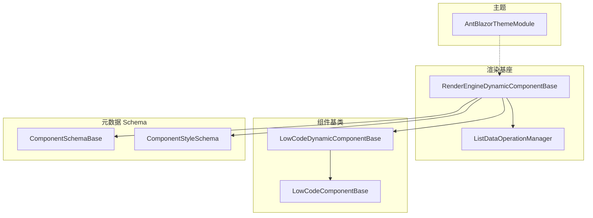
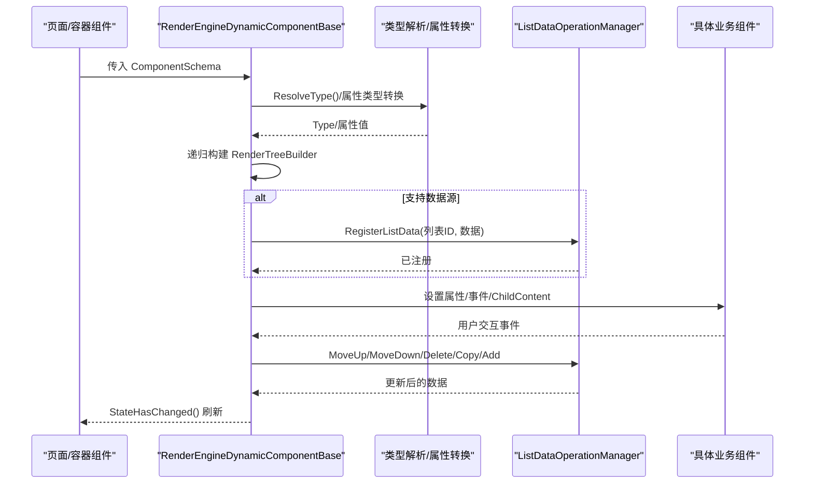
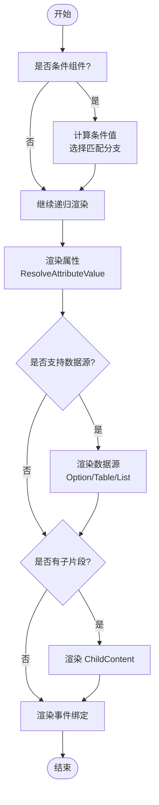
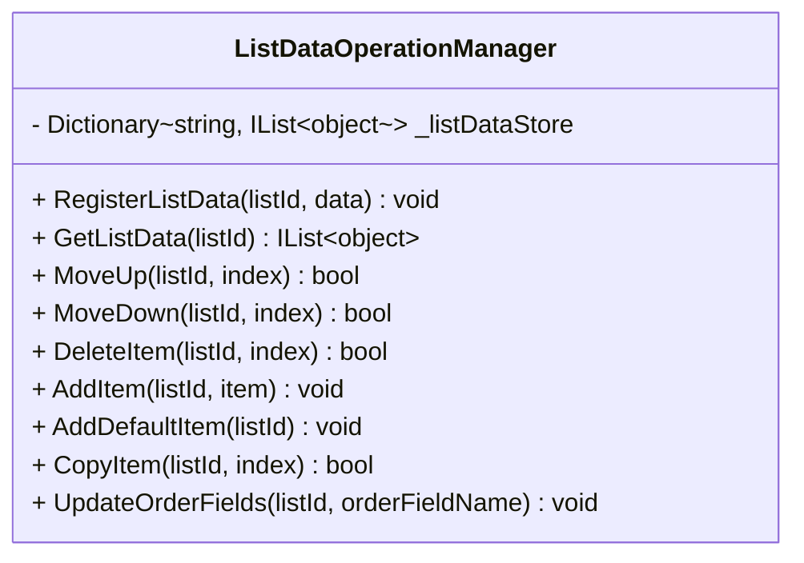
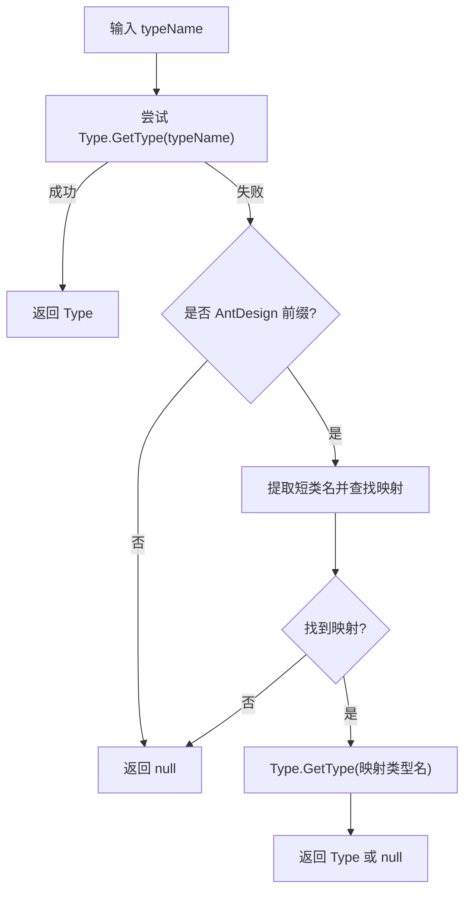
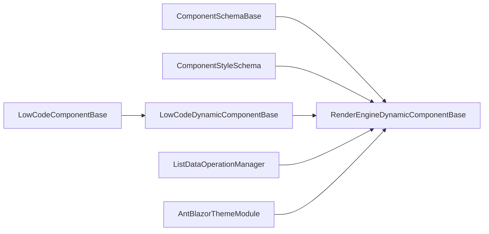

# 渲染引擎

<cite>
**本文引用的文件**   
- [RenderEngineDynamicComponentBase.cs](file://src/LowCode/RenderEngine/H.LowCode.RenderEngineBase/RenderEngineDynamicComponentBase.cs)
- [ListDataOperationManager.cs](file://src/LowCode/RenderEngine/H.LowCode.RenderEngineBase/ListDataOperationManager.cs)
- [LowCodeDynamicComponentBase.cs](file://src/LowCode/Common/H.LowCode.ComponentBase/LowCodeDynamicComponentBase.cs)
- [LowCodeComponentBase.cs](file://src/LowCode/Common/H.LowCode.ComponentBase/LowCodeComponentBase.cs)
- [ComponentSchemaBase.cs](file://src/LowCode/Common/H.LowCode.MetaSchema/ComponentSchemaBase.cs)
- [ComponentStyleSchema.cs](file://src/LowCode/Common/H.LowCode.MetaSchema/PropertySchemas/ComponentStyleSchema.cs)
- [AntBlazorThemeModule.cs](file://src/LowCode/RenderEngine/H.LowCode.Themes.AntBlazor/AntBlazorThemeModule.cs)
</cite>

## 目录
1. [简介](#简介)
2. [项目结构](#项目结构)
3. [核心组件](#核心组件)
4. [架构总览](#架构总览)
5. [详细组件分析](#详细组件分析)
6. [依赖关系分析](#依赖关系分析)
7. [性能考虑](#性能考虑)
8. [故障排查指南](#故障排查指南)
9. [结论](#结论)
10. [附录：自定义渲染器与主题开发指南](#附录自定义渲染器与主题开发指南)

## 简介
本文件面向低代码渲染引擎，系统性阐述元数据驱动的动态渲染机制与架构设计。内容覆盖 Schema 解析、组件实例化、属性绑定、事件处理、列表数据源渲染、条件渲染、主题系统与样式注入、状态同步与生命周期管理，以及性能优化策略（懒加载、虚拟滚动、缓存）和扩展点（自定义渲染器与主题）。文档以仓库中实际源码为依据，辅以可视化图示帮助理解。

## 项目结构
渲染引擎相关代码主要分布在以下模块：
- 渲染基座与动态组件：H.LowCode.RenderEngineBase
- 通用组件基类与状态：H.LowCode.ComponentBase
- 元数据 Schema 定义：H.LowCode.MetaSchema
- 主题实现示例：H.LowCode.Themes.AntBlazor

图表来源
- [RenderEngineDynamicComponentBase.cs](file://src/LowCode/RenderEngine/H.LowCode.RenderEngineBase/RenderEngineDynamicComponentBase.cs)
- [ListDataOperationManager.cs](file://src/LowCode/RenderEngine/H.LowCode.RenderEngineBase/ListDataOperationManager.cs)
- [LowCodeDynamicComponentBase.cs](file://src/LowCode/Common/H.LowCode.ComponentBase/LowCodeDynamicComponentBase.cs)
- [LowCodeComponentBase.cs](file://src/LowCode/Common/H.LowCode.ComponentBase/LowCodeComponentBase.cs)
- [ComponentSchemaBase.cs](file://src/LowCode/Common/H.LowCode.MetaSchema/ComponentSchemaBase.cs)
- [ComponentStyleSchema.cs](file://src/LowCode/Common/H.LowCode.MetaSchema/PropertySchemas/ComponentStyleSchema.cs)
- [AntBlazorThemeModule.cs](file://src/LowCode/RenderEngine/H.LowCode.Themes.AntBlazor/AntBlazorThemeModule.cs)

章节来源
- [RenderEngineDynamicComponentBase.cs](file://src/LowCode/RenderEngine/H.LowCode.RenderEngineBase/RenderEngineDynamicComponentBase.cs)
- [LowCodeDynamicComponentBase.cs](file://src/LowCode/Common/H.LowCode.ComponentBase/LowCodeDynamicComponentBase.cs)
- [LowCodeComponentBase.cs](file://src/LowCode/Common/H.LowCode.ComponentBase/LowCodeComponentBase.cs)
- [ComponentSchemaBase.cs](file://src/LowCode/Common/H.LowCode.MetaSchema/ComponentSchemaBase.cs)
- [ComponentStyleSchema.cs](file://src/LowCode/Common/H.LowCode.MetaSchema/PropertySchemas/ComponentStyleSchema.cs)
- [AntBlazorThemeModule.cs](file://src/LowCode/RenderEngine/H.LowCode.Themes.AntBlazor/AntBlazorThemeModule.cs)

## 核心组件
- 动态渲染基类：负责根据元数据 Schema 递归构建 Blazor 渲染树，支持属性绑定、事件绑定、子节点渲染、数据源注入与条件分支渲染。
- 列表数据操作管理器：集中维护列表数据的增删改查、排序与顺序字段更新，为列表项交互提供统一能力。
- 组件类型解析与兼容：提供旧版 AntDesign 类型到现用 Hc 组件类型的映射，保障历史页面数据可正常渲染。
- 组件基础能力：注入导航、JS 运行时、日志、应用状态等通用能力，并提供便捷方法。
- 元数据 Schema：描述组件实例 ID、名称、样式、事件、校验规则、版本等；样式 Schema 描述布局与样式字段。
- 主题模块：标记当前主题实现，便于按主题装配样式与组件渲染策略。

章节来源
- [RenderEngineDynamicComponentBase.cs](file://src/LowCode/RenderEngine/H.LowCode.RenderEngineBase/RenderEngineDynamicComponentBase.cs)
- [ListDataOperationManager.cs](file://src/LowCode/RenderEngine/H.LowCode.RenderEngineBase/ListDataOperationManager.cs)
- [LowCodeDynamicComponentBase.cs](file://src/LowCode/Common/H.LowCode.ComponentBase/LowCodeDynamicComponentBase.cs)
- [LowCodeComponentBase.cs](file://src/LowCode/Common/H.LowCode.ComponentBase/LowCodeComponentBase.cs)
- [ComponentSchemaBase.cs](file://src/LowCode/Common/H.LowCode.MetaSchema/ComponentSchemaBase.cs)
- [ComponentStyleSchema.cs](file://src/LowCode/Common/H.LowCode.MetaSchema/PropertySchemas/ComponentStyleSchema.cs)
- [AntBlazorThemeModule.cs](file://src/LowCode/RenderEngine/H.LowCode.Themes.AntBlazor/AntBlazorThemeModule.cs)

## 架构总览
渲染引擎采用“元数据驱动 + 动态组件”的架构：页面或部件以 JSON Schema 描述 UI 结构与行为，渲染引擎在运行期解析 Schema，动态创建组件实例并挂载属性与事件，形成完整的渲染树。

图表来源
- [RenderEngineDynamicComponentBase.cs](file://src/LowCode/RenderEngine/H.LowCode.RenderEngineBase/RenderEngineDynamicComponentBase.cs)
- [ListDataOperationManager.cs](file://src/LowCode/RenderEngine/H.LowCode.RenderEngineBase/ListDataOperationManager.cs)

章节来源
- [RenderEngineDynamicComponentBase.cs](file://src/LowCode/RenderEngine/H.LowCode.RenderEngineBase/RenderEngineDynamicComponentBase.cs)
- [ListDataOperationManager.cs](file://src/LowCode/RenderEngine/H.LowCode.RenderEngineBase/ListDataOperationManager.cs)

## 详细组件分析

### 动态渲染器：RenderEngineDynamicComponentBase
职责
- 基于 ComponentSchema 递归渲染组件树
- 支持条件渲染（Conditional）
- 属性绑定与类型转换
- 事件绑定（含列表项事件）
- 数据源注入（固定选项、Table、List）
- 列表项上下文传递（Item/Index/ListId）
- 列表数据操作（上移/下移/删除/复制/新增/保存/刷新）

关键流程
- 入口：RenderComponent -> RenderComponentRecursive
- 条件渲染：IsConditionalComponent -> RenderConditionalComponent
- 属性渲染：RenderComponentAttributes -> ResolveAttributeValue
- 数据源渲染：RenderDataSource（Option/Table/List）
- 列表渲染：RenderListDataSource -> RenderListWithItemTemplate / RenderListWithFragment
- 事件绑定：RenderFragmentEvents -> CreateButtonClickHandler -> HandleListDataAction
- 列表数据管理：ListDataOperationManager.RegisterListData/MoveUp/MoveDown/Delete/Copy/AddDefaultItem/UpdateOrderFields

图表来源
- [RenderEngineDynamicComponentBase.cs](file://src/LowCode/RenderEngine/H.LowCode.RenderEngineBase/RenderEngineDynamicComponentBase.cs)

章节来源
- [RenderEngineDynamicComponentBase.cs](file://src/LowCode/RenderEngine/H.LowCode.RenderEngineBase/RenderEngineDynamicComponentBase.cs)

### 列表数据操作管理器：ListDataOperationManager
职责
- 维护内存中的列表数据字典（listId -> IList<object>）
- 提供上移、下移、删除、复制、新增默认项、更新顺序字段等操作
- 供渲染器在用户交互时调用，触发状态更新与重渲染

图表来源
- [ListDataOperationManager.cs](file://src/LowCode/RenderEngine/H.LowCode.RenderEngineBase/ListDataOperationManager.cs)

章节来源
- [ListDataOperationManager.cs](file://src/LowCode/RenderEngine/H.LowCode.RenderEngineBase/ListDataOperationManager.cs)

### 组件类型解析与兼容：LowCodeDynamicComponentBase
职责
- 提供 ResolveComponentType，优先直接解析类型名，失败时回退到旧版 AntDesign 到 Hc 组件的映射表
- 提供通用的属性渲染逻辑（RenderComponentAttributes），支持 RenderFragment、EventCallback 与普通属性的差异化处理

图表来源
- [LowCodeDynamicComponentBase.cs](file://src/LowCode/Common/H.LowCode.ComponentBase/LowCodeDynamicComponentBase.cs)

章节来源
- [LowCodeDynamicComponentBase.cs](file://src/LowCode/Common/H.LowCode.ComponentBase/LowCodeDynamicComponentBase.cs)

### 组件基础能力：LowCodeComponentBase
职责
- 注入 LowCodeAppState、NavigationManager、IJSRuntime、ILoggerFactory
- 提供日志、消息提示、导航、查询参数读取等通用方法
- 暴露 IsDesign 标识，用于区分设计与运行态

章节来源
- [LowCodeComponentBase.cs](file://src/LowCode/Common/H.LowCode.ComponentBase/LowCodeComponentBase.cs)

### 元数据 Schema：ComponentSchemaBase 与样式 Schema
职责
- ComponentSchemaBase：描述组件实例 Id、父 Id、名称、标签、类型、容器标志、是否隐藏标题、是否支持数据源、样式、事件、事件消费、校验规则、版本等
- ComponentStyleSchema：描述宽度、高度、标签宽度、默认样式、自定义样式等

章节来源
- [ComponentSchemaBase.cs](file://src/LowCode/Common/H.LowCode.MetaSchema/ComponentSchemaBase.cs)
- [ComponentStyleSchema.cs](file://src/LowCode/Common/H.LowCode.MetaSchema/PropertySchemas/ComponentStyleSchema.cs)

### 主题系统：AntBlazorThemeModule
职责
- 作为主题模块标记类，配合宿主或模块装配机制启用特定主题的样式与组件渲染策略
- 通过该标记，可在运行时切换主题，影响样式注入与组件外观

章节来源
- [AntBlazorThemeModule.cs](file://src/LowCode/RenderEngine/H.LowCode.Themes.AntBlazor/AntBlazorThemeModule.cs)

## 依赖关系分析
- 渲染器依赖元数据 Schema（ComponentSchemaBase、ComponentStyleSchema）进行解析与渲染
- 渲染器依赖组件类型解析（LowCodeDynamicComponentBase）完成类型兼容与属性渲染
- 渲染器依赖列表数据操作管理器（ListDataOperationManager）维护列表状态
- 组件基类（LowCodeComponentBase）提供跨组件的通用能力（导航、JS、日志、应用状态）
- 主题模块（AntBlazorThemeModule）作为装配标记，影响样式与渲染策略

图表来源
- [RenderEngineDynamicComponentBase.cs](file://src/LowCode/RenderEngine/H.LowCode.RenderEngineBase/RenderEngineDynamicComponentBase.cs)
- [LowCodeDynamicComponentBase.cs](file://src/LowCode/Common/H.LowCode.ComponentBase/LowCodeDynamicComponentBase.cs)
- [LowCodeComponentBase.cs](file://src/LowCode/Common/H.LowCode.ComponentBase/LowCodeComponentBase.cs)
- [ComponentSchemaBase.cs](file://src/LowCode/Common/H.LowCode.MetaSchema/ComponentSchemaBase.cs)
- [ComponentStyleSchema.cs](file://src/LowCode/Common/H.LowCode.MetaSchema/PropertySchemas/ComponentStyleSchema.cs)
- [ListDataOperationManager.cs](file://src/LowCode/RenderEngine/H.LowCode.RenderEngineBase/ListDataOperationManager.cs)
- [AntBlazorThemeModule.cs](file://src/LowCode/RenderEngine/H.LowCode.Themes.AntBlazor/AntBlazorThemeModule.cs)

章节来源
- [RenderEngineDynamicComponentBase.cs](file://src/LowCode/RenderEngine/H.LowCode.RenderEngineBase/RenderEngineDynamicComponentBase.cs)
- [LowCodeDynamicComponentBase.cs](file://src/LowCode/Common/H.LowCode.ComponentBase/LowCodeDynamicComponentBase.cs)
- [LowCodeComponentBase.cs](file://src/LowCode/Common/H.LowCode.ComponentBase/LowCodeComponentBase.cs)
- [ComponentSchemaBase.cs](file://src/LowCode/Common/H.LowCode.MetaSchema/ComponentSchemaBase.cs)
- [ComponentStyleSchema.cs](file://src/LowCode/Common/H.LowCode.MetaSchema/PropertySchemas/ComponentStyleSchema.cs)
- [ListDataOperationManager.cs](file://src/LowCode/RenderEngine/H.LowCode.RenderEngineBase/ListDataOperationManager.cs)
- [AntBlazorThemeModule.cs](file://src/LowCode/RenderEngine/H.LowCode.Themes.AntBlazor/AntBlazorThemeModule.cs)

## 性能考虑
- 懒加载
  - 组件类型解析失败时跳过渲染，避免整页崩溃与不必要的资源加载
  - 列表数据源支持固定数据（设计时）与 API/SQL（运行期按需加载），减少首屏压力
- 虚拟滚动
  - 列表渲染建议结合虚拟化方案（如只渲染可视区域项），降低 DOM 数量与重排开销
- 缓存机制
  - 列表数据在内存中集中管理（ListDataOperationManager），避免重复计算与网络请求
  - 组件类型解析结果可缓存（ResolveComponentType），提升后续渲染速度
- 渲染优化
  - 使用 RenderTreeBuilder 精确控制属性与事件绑定，减少无效更新
  - 条件渲染仅在条件变化时重新计算分支，避免全量重建

[本节为通用性能指导，不直接分析具体文件]

## 故障排查指南
常见问题与定位要点
- 组件类型无法解析
  - 检查 TypeName 是否正确，必要时确认 AntDesign 到 Hc 的映射是否生效
  - 参考类型解析逻辑与兼容映射
- 属性绑定失败或类型不匹配
  - 确认 AttributeClrType 与实际属性类型一致，确保字符串值能正确转换为目标类型
  - 检查 ResolveAttributeValue 的数据绑定表达式格式
- 列表数据未更新或交互无效
  - 确认 RegisterListData 是否被调用，listId 是否唯一且一致
  - 检查 HandleListDataAction 对应的事件类型与索引范围
- 事件未触发
  - 确认事件名称与处理器绑定逻辑（如 OnClick）是否匹配
  - 检查 ListItemContext 是否正确传递 Item/Index/ListId

章节来源
- [RenderEngineDynamicComponentBase.cs](file://src/LowCode/RenderEngine/H.LowCode.RenderEngineBase/RenderEngineDynamicComponentBase.cs)
- [ListDataOperationManager.cs](file://src/LowCode/RenderEngine/H.LowCode.RenderEngineBase/ListDataOperationManager.cs)
- [LowCodeDynamicComponentBase.cs](file://src/LowCode/Common/H.LowCode.ComponentBase/LowCodeDynamicComponentBase.cs)

## 结论
本渲染引擎以元数据 Schema 为核心，通过动态组件与渲染树构建实现灵活的 UI 生成。其特性包括：
- 强大的属性与事件绑定机制
- 条件渲染与列表数据源支持
- 统一的列表数据操作与状态同步
- 组件类型兼容与主题可扩展性
- 良好的性能优化空间（懒加载、虚拟化、缓存）

在实际使用中，建议结合业务场景完善数据源加载、事件消费与主题样式覆盖，以获得更佳的体验与可维护性。

[本节为总结，不直接分析具体文件]

## 附录：自定义渲染器与主题开发指南

### 自定义渲染器
- 继承 LowCodeDynamicComponentBase 或 RenderEngineDynamicComponentBase，重写属性渲染与事件绑定逻辑，以满足特殊组件需求
- 在 RenderComponentAttributes 中扩展属性类型支持与数据绑定表达式解析
- 在 RenderFragmentEvents 中扩展事件类型与处理器绑定
- 针对复杂列表项，使用 RenderListWithItemTemplate 或 RenderListWithFragment 定制渲染策略

章节来源
- [RenderEngineDynamicComponentBase.cs](file://src/LowCode/RenderEngine/H.LowCode.RenderEngineBase/RenderEngineDynamicComponentBase.cs)
- [LowCodeDynamicComponentBase.cs](file://src/LowCode/Common/H.LowCode.ComponentBase/LowCodeDynamicComponentBase.cs)

### 主题开发
- 创建主题模块标记类（如 AntBlazorThemeModule），用于装配主题样式与组件渲染策略
- 在 wwwroot 中提供主题 CSS/JS，并在宿主中按需注入
- 通过组件样式 Schema（ComponentStyleSchema）与页面级样式配置，实现样式覆盖与响应式适配

章节来源
- [AntBlazorThemeModule.cs](file://src/LowCode/RenderEngine/H.LowCode.Themes.AntBlazor/AntBlazorThemeModule.cs)
- [ComponentStyleSchema.cs](file://src/LowCode/Common/H.LowCode.MetaSchema/PropertySchemas/ComponentStyleSchema.cs)