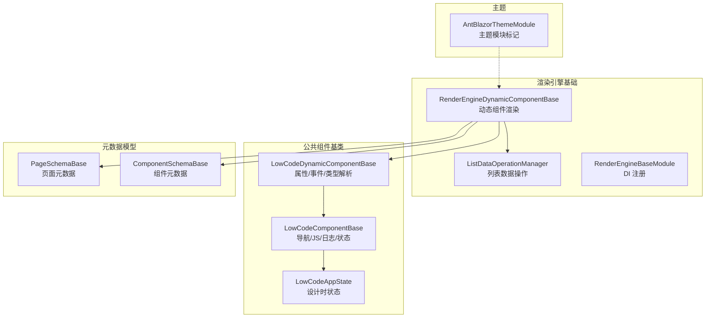
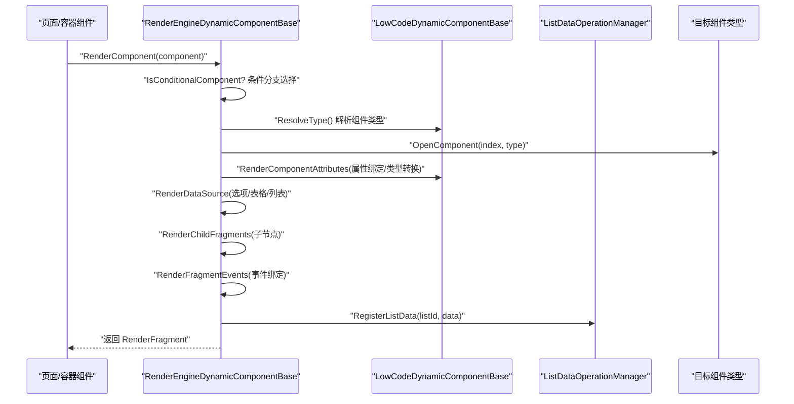
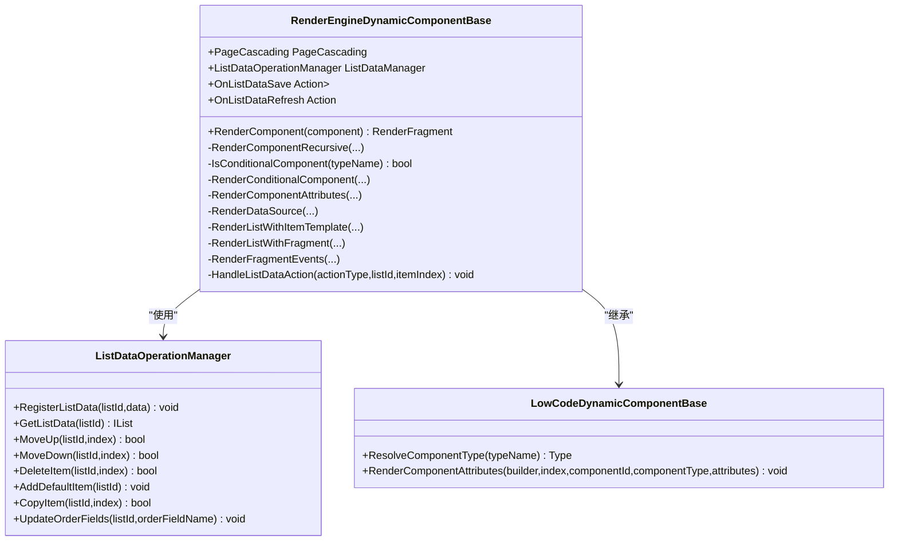
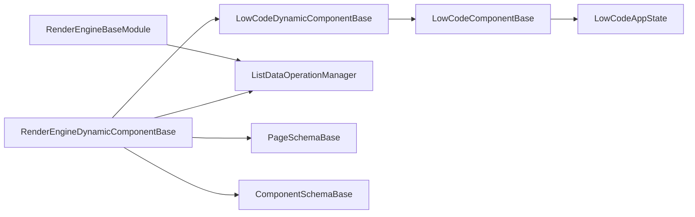
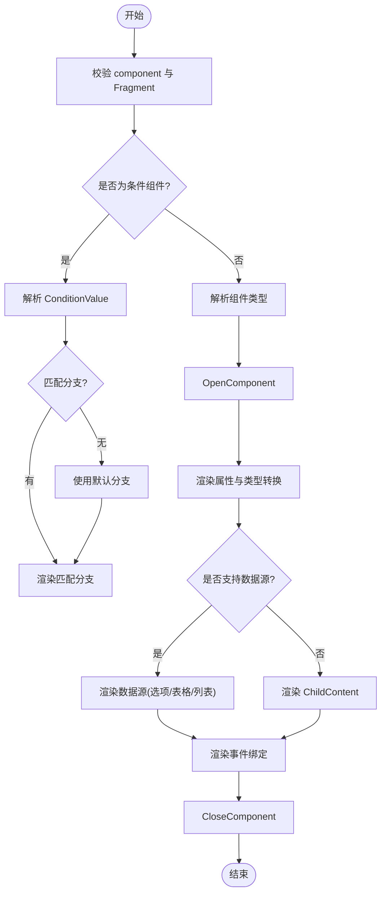

# 渲染引擎核心

<cite>
**本文引用的文件**   
- [RenderEngineDynamicComponentBase.cs](file://src/LowCode/RenderEngine/H.LowCode.RenderEngineBase/RenderEngineDynamicComponentBase.cs)
- [ListDataOperationManager.cs](file://src/LowCode/RenderEngine/H.LowCode.RenderEngineBase/ListDataOperationManager.cs)
- [RenderEngineBaseModule.cs](file://src/LowCode/RenderEngine/H.LowCode.RenderEngineBase/RenderEngineBaseModule.cs)
- [LowCodeDynamicComponentBase.cs](file://src/LowCode/Common/H.LowCode.ComponentBase/LowCodeDynamicComponentBase.cs)
- [LowCodeComponentBase.cs](file://src/LowCode/Common/H.LowCode.ComponentBase/LowCodeComponentBase.cs)
- [PageSchemaBase.cs](file://src/LowCode/Common/H.LowCode.MetaSchema/PageSchemaBase.cs)
- [ComponentSchemaBase.cs](file://src/LowCode/Common/H.LowCode.MetaSchema/ComponentSchemaBase.cs)
- [LowCodeAppState.cs](file://src/LowCode/Common/H.LowCode.ComponentBase/LowCodeAppState.cs)
- [AntBlazorThemeModule.cs](file://src/LowCode/RenderEngine/H.LowCode.RenderEngine/AntBlazorThemeModule.cs)
</cite>

## 目录
1. [简介](#简介)
2. [项目结构](#项目结构)
3. [核心组件](#核心组件)
4. [架构总览](#架构总览)
5. [详细组件分析](#详细组件分析)
6. [依赖关系分析](#依赖关系分析)
7. [性能考虑](#性能考虑)
8. [故障排查指南](#故障排查指南)
9. [结论](#结论)
10. [附录](#附录)

## 简介
本文件面向“元数据驱动的动态渲染引擎”核心模块，系统性阐述以下能力：
- Schema 解析与渲染流程：从页面/组件元数据到 Blazor 组件实例化的完整链路。
- 组件实例化与属性绑定：基于反射的属性映射、类型转换、事件回调绑定。
- 事件处理系统：列表项事件、条件渲染分支选择、数据操作事件分发。
- 架构设计要点：组件注册表（类型解析兼容）、生命周期控制、状态同步机制。
- ABP 集成与依赖注入：服务注册、模块标记、扩展点。
- 性能优化策略：懒加载、虚拟滚动、缓存机制等最佳实践建议。
- 自定义渲染器开发指南：如何扩展组件类型、数据源、事件处理器。

## 项目结构
渲染引擎核心位于 LowCode 子域下的 RenderEngine 与 Common 模块中，关键目录与职责如下：
- H.LowCode.RenderEngineBase：动态渲染基类、列表数据操作管理器、基础 DI 模块。
- H.LowCode.ComponentBase：通用组件基类、应用状态、消息服务等。
- H.LowCode.MetaSchema：页面与组件的元数据结构定义。
- H.LowCode.RenderEngine：主题模块标记（用于后续主题扩展）。

图表来源
- [RenderEngineDynamicComponentBase.cs:1-692](file://src/LowCode/RenderEngine/H.LowCode.RenderEngineBase/RenderEngineDynamicComponentBase.cs#L1-L692)
- [ListDataOperationManager.cs:1-157](file://src/LowCode/RenderEngine/H.LowCode.RenderEngineBase/ListDataOperationManager.cs#L1-L157)
- [RenderEngineBaseModule.cs:1-17](file://src/LowCode/RenderEngine/H.LowCode.RenderEngineBase/RenderEngineBaseModule.cs#L1-L17)
- [LowCodeDynamicComponentBase.cs:1-187](file://src/LowCode/Common/H.LowCode.ComponentBase/LowCodeDynamicComponentBase.cs#L1-L187)
- [LowCodeComponentBase.cs:1-73](file://src/LowCode/Common/H.LowCode.ComponentBase/LowCodeComponentBase.cs#L1-L73)
- [PageSchemaBase.cs:1-40](file://src/LowCode/Common/H.LowCode.MetaSchema/PageSchemaBase.cs#L1-L40)
- [ComponentSchemaBase.cs:1-104](file://src/LowCode/Common/H.LowCode.MetaSchema/ComponentSchemaBase.cs#L1-L104)
- [LowCodeAppState.cs:1-21](file://src/LowCode/Common/H.LowCode.ComponentBase/LowCodeAppState.cs#L1-L21)
- [AntBlazorThemeModule.cs:1-9](file://src/LowCode/RenderEngine/H.LowCode.RenderEngine/AntBlazorThemeModule.cs#L1-L9)

章节来源
- [RenderEngineDynamicComponentBase.cs:1-692](file://src/LowCode/RenderEngine/H.LowCode.RenderEngineBase/RenderEngineDynamicComponentBase.cs#L1-L692)
- [LowCodeDynamicComponentBase.cs:1-187](file://src/LowCode/Common/H.LowCode.ComponentBase/LowCodeDynamicComponentBase.cs#L1-L187)
- [PageSchemaBase.cs:1-40](file://src/LowCode/Common/H.LowCode.MetaSchema/PageSchemaBase.cs#L1-L40)
- [ComponentSchemaBase.cs:1-104](file://src/LowCode/Common/H.LowCode.MetaSchema/ComponentSchemaBase.cs#L1-L104)

## 核心组件
- 动态渲染基类：负责根据 ComponentFragmentSchema 递归构建 RenderTree，支持条件渲染、数据源注入、事件绑定与属性值解析。
- 列表数据操作管理器：维护列表数据的增删改查、排序与顺序字段更新，供列表项按钮事件调用。
- 组件基类体系：提供类型解析兼容（旧 AntDesign -> 新 Hc）、属性/事件/RenderFragment 渲染、简单类型转换。
- 元数据模型：页面与组件的 JSON 结构定义，驱动渲染引擎行为。
- DI 模块：将 ListDataOperationManager 注册为单例，确保 WebAssembly 状态保持。

章节来源
- [RenderEngineDynamicComponentBase.cs:1-692](file://src/LowCode/RenderEngine/H.LowCode.RenderEngineBase/RenderEngineDynamicComponentBase.cs#L1-L692)
- [ListDataOperationManager.cs:1-157](file://src/LowCode/RenderEngine/H.LowCode.RenderEngineBase/ListDataOperationManager.cs#L1-L157)
- [LowCodeDynamicComponentBase.cs:1-187](file://src/LowCode/Common/H.LowCode.ComponentBase/LowCodeDynamicComponentBase.cs#L1-L187)
- [RenderEngineBaseModule.cs:1-17](file://src/LowCode/RenderEngine/H.LowCode.RenderEngineBase/RenderEngineBaseModule.cs#L1-L17)

## 架构总览
渲染引擎采用“元数据驱动 + 动态组件实例化”的架构：
- 输入：页面/组件元数据（PageSchemaBase、ComponentSchemaBase）
- 处理：动态组件基类解析 Fragment、属性、事件、数据源，并生成 Blazor RenderTree
- 输出：运行时组件树，支持条件分支、列表循环、事件回调与数据操作

图表来源
- [RenderEngineDynamicComponentBase.cs:26-79](file://src/LowCode/RenderEngine/H.LowCode.RenderEngineBase/RenderEngineDynamicComponentBase.cs#L26-L79)
- [RenderEngineDynamicComponentBase.cs:154-187](file://src/LowCode/RenderEngine/H.LowCode.RenderEngineBase/RenderEngineDynamicComponentBase.cs#L154-L187)
- [RenderEngineDynamicComponentBase.cs:286-315](file://src/LowCode/RenderEngine/H.LowCode.RenderEngineBase/RenderEngineDynamicComponentBase.cs#L286-L315)
- [ListDataOperationManager.cs:18-29](file://src/LowCode/RenderEngine/H.LowCode.RenderEngineBase/ListDataOperationManager.cs#L18-L29)
- [LowCodeDynamicComponentBase.cs:57-77](file://src/LowCode/Common/H.LowCode.ComponentBase/LowCodeDynamicComponentBase.cs#L57-L77)

## 详细组件分析

### 动态渲染基类（RenderEngineDynamicComponentBase）
- 功能要点
  - 递归渲染组件树：按 Fragment.TypeName 解析类型，创建组件并设置属性、子内容、事件。
  - 条件渲染：根据 ConditionValue 属性值匹配 Cases 分支或 DefaultCase。
  - 数据源渲染：支持固定选项、Table 直接 DataSource、List 循环渲染（ItemTemplate 或 Fragment）。
  - 属性绑定：支持字符串到实际类型的转换、$(item.fieldName) 表达式解析。
  - 事件处理：为列表项按钮生成 EventCallback，触发上移/下移/删除/复制/新增/保存/刷新等操作。
- 关键实现路径
  - 递归渲染入口：[RenderComponentRecursive:37-79](file://src/LowCode/RenderEngine/H.LowCode.RenderEngineBase/RenderEngineDynamicComponentBase.cs#L37-L79)
  - 条件渲染判断与分支选择：[IsConditionalComponent / RenderConditionalComponent:84-130](file://src/LowCode/RenderEngine/H.LowCode.RenderEngineBase/RenderEngineDynamicComponentBase.cs#L84-L130)
  - 属性渲染与类型转换：[RenderComponentAttributes:154-187](file://src/LowCode/RenderEngine/H.LowCode.RenderEngineBase/RenderEngineDynamicComponentBase.cs#L154-L187)
  - 数据源渲染（选项/表格/列表）：[RenderDataSource:189-220](file://src/LowCode/RenderEngine/H.LowCode.RenderEngineBase/RenderEngineDynamicComponentBase.cs#L189-L220)
  - 列表循环渲染（ItemTemplate/Fragment）：[RenderListWithItemTemplate / RenderListWithFragment:320-430](file://src/LowCode/RenderEngine/H.LowCode.RenderEngineBase/RenderEngineDynamicComponentBase.cs#L320-L430)
  - 事件绑定与处理：[RenderFragmentEvents / HandleListDataAction:504-666](file://src/LowCode/RenderEngine/H.LowCode.RenderEngineBase/RenderEngineDynamicComponentBase.cs#L504-L666)
  - 列表数据管理：[GetListDataSource / RegisterListData:540-315](file://src/LowCode/RenderEngine/H.LowCode.RenderEngineBase/RenderEngineDynamicComponentBase.cs#L540-L315)

图表来源
- [RenderEngineDynamicComponentBase.cs:10-692](file://src/LowCode/RenderEngine/H.LowCode.RenderEngineBase/RenderEngineDynamicComponentBase.cs#L10-L692)
- [ListDataOperationManager.cs:11-157](file://src/LowCode/RenderEngine/H.LowCode.RenderEngineBase/ListDataOperationManager.cs#L11-L157)
- [LowCodeDynamicComponentBase.cs:13-187](file://src/LowCode/Common/H.LowCode.ComponentBase/LowCodeDynamicComponentBase.cs#L13-L187)

章节来源
- [RenderEngineDynamicComponentBase.cs:1-692](file://src/LowCode/RenderEngine/H.LowCode.RenderEngineBase/RenderEngineDynamicComponentBase.cs#L1-L692)
- [ListDataOperationManager.cs:1-157](file://src/LowCode/RenderEngine/H.LowCode.RenderEngineBase/ListDataOperationManager.cs#L1-L157)

### 属性绑定与类型转换（LowCodeDynamicComponentBase）
- 功能要点
  - 类型解析兼容：旧 AntDesign 类型名自动映射到新 Hc 组件类型。
  - 属性渲染：区分 RenderFragment、EventCallback、简单类型，进行安全赋值与类型转换。
  - 事件回调绑定：通过反射查找方法并创建 EventCallback。
- 关键实现路径
  - 类型解析兼容映射：[ResolveComponentType:57-77](file://src/LowCode/Common/H.LowCode.ComponentBase/LowCodeDynamicComponentBase.cs#L57-L77)
  - 属性渲染入口：[RenderComponentAttributes:87-98](file://src/LowCode/Common/H.LowCode.ComponentBase/LowCodeDynamicComponentBase.cs#L87-L98)
  - 属性细分渲染：[RenderComponentAttribute / RenderComponentSimpleAttribute:100-176](file://src/LowCode/Common/H.LowCode.ComponentBase/LowCodeDynamicComponentBase.cs#L100-L176)

章节来源
- [LowCodeDynamicComponentBase.cs:1-187](file://src/LowCode/Common/H.LowCode.ComponentBase/LowCodeDynamicComponentBase.cs#L1-L187)

### 列表数据操作（ListDataOperationManager）
- 功能要点
  - 列表数据注册与获取：以 listId 为键维护数据集合。
  - 数据操作：上移/下移/删除/复制/新增默认项。
  - 顺序字段更新：统一更新 f_order 字段，保证排序一致性。
- 关键实现路径
  - 注册/获取：[RegisterListData / GetListData:18-29](file://src/LowCode/RenderEngine/H.LowCode.RenderEngineBase/ListDataOperationManager.cs#L18-L29)
  - 移动/删除/复制/新增：[MoveUp / MoveDown / DeleteItem / CopyItem / AddDefaultItem:34-103](file://src/LowCode/RenderEngine/H.LowCode.RenderEngineBase/ListDataOperationManager.cs#L34-L103)
  - 顺序字段更新：[UpdateOrderFields:145-155](file://src/LowCode/RenderEngine/H.LowCode.RenderEngineBase/ListDataOperationManager.cs#L145-L155)

章节来源
- [ListDataOperationManager.cs:1-157](file://src/LowCode/RenderEngine/H.LowCode.RenderEngineBase/ListDataOperationManager.cs#L1-L157)

### 元数据模型（PageSchemaBase / ComponentSchemaBase）
- 功能要点
  - 页面元数据：包含 Id、Name、Order、PageType、PublishStatus、PageProperty、DataSource、Events。
  - 组件元数据：包含 Id、ParentId、Name、Label、ComponentType、IsHiddenLabel、IsContainer、IsInnerContainer、IsSupportDataSource、Style、Events、EventConsumes、ValidationRules、Version。
- 关键实现路径
  - 页面元数据定义：[PageSchemaBase:6-40](file://src/LowCode/Common/H.LowCode.MetaSchema/PageSchemaBase.cs#L6-L40)
  - 组件元数据定义：[ComponentSchemaBase:5-104](file://src/LowCode/Common/H.LowCode.MetaSchema/ComponentSchemaBase.cs#L5-L104)

章节来源
- [PageSchemaBase.cs:1-40](file://src/LowCode/Common/H.LowCode.MetaSchema/PageSchemaBase.cs#L1-L40)
- [ComponentSchemaBase.cs:1-104](file://src/LowCode/Common/H.LowCode.MetaSchema/ComponentSchemaBase.cs#L1-L104)

### 应用状态与模块标记（LowCodeAppState / AntBlazorThemeModule）
- 功能要点
  - 应用状态：IsDesign 标识设计时模式，供组件按需调整行为。
  - 主题模块：AntBlazor 主题模块标记，便于后续扩展与组合。
- 关键实现路径
  - 应用状态：[LowCodeAppState:9-21](file://src/LowCode/Common/H.LowCode.ComponentBase/LowCodeAppState.cs#L9-L21)
  - 主题模块标记：[AntBlazorThemeModule:6-9](file://src/LowCode/RenderEngine/H.LowCode.RenderEngine/AntBlazorThemeModule.cs#L6-L9)

章节来源
- [LowCodeAppState.cs:1-21](file://src/LowCode/Common/H.LowCode.ComponentBase/LowCodeAppState.cs#L1-L21)
- [AntBlazorThemeModule.cs:1-9](file://src/LowCode/RenderEngine/H.LowCode.RenderEngine/AntBlazorThemeModule.cs#L1-L9)

## 依赖关系分析
- 组件类型解析依赖：LowCodeDynamicComponentBase.ResolveComponentType 提供类型解析与兼容映射。
- 列表数据操作依赖：RenderEngineDynamicComponentBase 通过 ListDataOperationManager 管理列表数据。
- DI 依赖：RenderEngineBaseModule 将 ListDataOperationManager 注册为 Singleton，确保跨组件状态一致。
- 元数据依赖：渲染过程完全由 PageSchemaBase 与 ComponentSchemaBase 驱动。

图表来源
- [RenderEngineDynamicComponentBase.cs:10-692](file://src/LowCode/RenderEngine/H.LowCode.RenderEngineBase/RenderEngineDynamicComponentBase.cs#L10-L692)
- [LowCodeDynamicComponentBase.cs:13-187](file://src/LowCode/Common/H.LowCode.ComponentBase/LowCodeDynamicComponentBase.cs#L13-L187)
- [ListDataOperationManager.cs:11-157](file://src/LowCode/RenderEngine/H.LowCode.RenderEngineBase/ListDataOperationManager.cs#L11-L157)
- [RenderEngineBaseModule.cs:10-15](file://src/LowCode/RenderEngine/H.LowCode.RenderEngineBase/RenderEngineBaseModule.cs#L10-L15)
- [PageSchemaBase.cs:6-40](file://src/LowCode/Common/H.LowCode.MetaSchema/PageSchemaBase.cs#L6-L40)
- [ComponentSchemaBase.cs:5-104](file://src/LowCode/Common/H.LowCode.MetaSchema/ComponentSchemaBase.cs#L5-L104)

章节来源
- [RenderEngineBaseModule.cs:1-17](file://src/LowCode/RenderEngine/H.LowCode.RenderEngineBase/RenderEngineBaseModule.cs#L1-L17)
- [LowCodeDynamicComponentBase.cs:1-187](file://src/LowCode/Common/H.LowCode.ComponentBase/LowCodeDynamicComponentBase.cs#L1-L187)
- [ListDataOperationManager.cs:1-157](file://src/LowCode/RenderEngine/H.LowCode.RenderEngineBase/ListDataOperationManager.cs#L1-L157)

## 性能考虑
- 懒加载
  - 组件类型解析失败时跳过渲染，避免整页崩溃；可在大型应用中按需加载组件程序集。
  - 列表数据源 API/SQL 加载可延迟至首次可见或用户交互时触发。
- 虚拟滚动
  - 对超长列表建议使用虚拟滚动方案（如只渲染可视区域），减少 DOM 节点数量与渲染开销。
- 缓存机制
  - 组件类型解析结果可缓存，避免重复反射与类型查找。
  - 列表数据可按 listId 缓存，结合版本号或时间戳失效策略。
- 渲染优化
  - 合理使用 ShouldRender 与 StateKey，减少不必要的重渲染。
  - 属性值转换尽量在解析阶段完成，避免在渲染循环中重复计算。
- 事件与状态同步
  - 列表操作后及时调用 UpdateOrderFields 并触发 StateHasChanged，确保 UI 与数据一致。

[本节为通用性能指导，不直接分析具体文件]

## 故障排查指南
- 组件类型无法解析
  - 现象：组件未渲染或页面部分缺失。
  - 排查：检查 ComponentFragmentSchema.TypeName 是否正确；确认 ResolveComponentType 映射是否覆盖旧类型。
  - 参考路径：[ResolveComponentType:57-77](file://src/LowCode/Common/H.LowCode.ComponentBase/LowCodeDynamicComponentBase.cs#L57-L77)
- 属性绑定失败
  - 现象：属性为空或类型不匹配。
  - 排查：确认 AttributeClrType 与 AttributeValue 正确；检查 ConvertToRealType 转换逻辑。
  - 参考路径：[RenderComponentSimpleAttribute:153-176](file://src/LowCode/Common/H.LowCode.ComponentBase/LowCodeDynamicComponentBase.cs#L153-L176)
- 列表数据操作无效
  - 现象：上移/下移/删除无效果。
  - 排查：确认 RegisterListData 已调用；检查 index 边界；验证 UpdateOrderFields 是否执行。
  - 参考路径：[ListDataOperationManager:34-155](file://src/LowCode/RenderEngine/H.LowCode.RenderEngineBase/ListDataOperationManager.cs#L34-L155)
- 条件渲染不生效
  - 现象：分支未选择或默认分支未渲染。
  - 排查：检查 ConditionValue 属性是否存在且可解析；确认 Cases 字典键匹配。
  - 参考路径：[RenderConditionalComponent:92-130](file://src/LowCode/RenderEngine/H.LowCode.RenderEngineBase/RenderEngineDynamicComponentBase.cs#L92-L130)

章节来源
- [LowCodeDynamicComponentBase.cs:57-77](file://src/LowCode/Common/H.LowCode.ComponentBase/LowCodeDynamicComponentBase.cs#L57-L77)
- [LowCodeDynamicComponentBase.cs:153-176](file://src/LowCode/Common/H.LowCode.ComponentBase/LowCodeDynamicComponentBase.cs#L153-L176)
- [ListDataOperationManager.cs:34-155](file://src/LowCode/RenderEngine/H.LowCode.RenderEngineBase/ListDataOperationManager.cs#L34-L155)
- [RenderEngineDynamicComponentBase.cs:92-130](file://src/LowCode/RenderEngine/H.LowCode.RenderEngineBase/RenderEngineDynamicComponentBase.cs#L92-L130)

## 结论
渲染引擎核心通过“元数据驱动 + 动态组件实例化”实现了高度可扩展的 UI 渲染能力。其关键点包括：
- 灵活的组件类型解析与兼容映射，保障历史数据平滑迁移。
- 完善的属性绑定与事件处理机制，支持复杂交互场景。
- 列表数据操作管理器提供统一的 CRUD 与排序能力。
- 清晰的 DI 模块与模块标记，便于 ABP 框架集成与扩展。
建议在大规模应用中引入懒加载、虚拟滚动与缓存策略，进一步提升性能与用户体验。

[本节为总结性内容，不直接分析具体文件]

## 附录

### 渲染流程图（算法级）

图表来源
- [RenderEngineDynamicComponentBase.cs:26-79](file://src/LowCode/RenderEngine/H.LowCode.RenderEngineBase/RenderEngineDynamicComponentBase.cs#L26-L79)
- [RenderEngineDynamicComponentBase.cs:154-187](file://src/LowCode/RenderEngine/H.LowCode.RenderEngineBase/RenderEngineDynamicComponentBase.cs#L154-L187)
- [RenderEngineDynamicComponentBase.cs:189-220](file://src/LowCode/RenderEngine/H.LowCode.RenderEngineBase/RenderEngineDynamicComponentBase.cs#L189-L220)

### 自定义渲染器开发指南
- 扩展组件类型
  - 在 ResolveComponentType 的映射表中添加新类型映射，或直接使用完整类型名。
  - 参考路径：[ResolveComponentType:57-77](file://src/LowCode/Common/H.LowCode.ComponentBase/LowCodeDynamicComponentBase.cs#L57-L77)
- 扩展数据源
  - 在 RenderDataSource 中增加新的 DataSourceGroupType 分支，实现特定数据源的渲染逻辑。
  - 参考路径：[RenderDataSource:189-220](file://src/LowCode/RenderEngine/H.LowCode.RenderEngineBase/RenderEngineDynamicComponentBase.cs#L189-L220)
- 扩展事件处理器
  - 在 RenderFragmentEvents 中新增事件名称与处理器映射，或在 HandleListDataAction 中添加新操作类型。
  - 参考路径：[RenderFragmentEvents:504-535](file://src/LowCode/RenderEngine/H.LowCode.RenderEngineBase/RenderEngineDynamicComponentBase.cs#L504-L535), [HandleListDataAction:611-666](file://src/LowCode/RenderEngine/H.LowCode.RenderEngineBase/RenderEngineDynamicComponentBase.cs#L611-L666)
- 扩展 DI 与服务
  - 在 RenderEngineBaseModule 中注册自定义服务，确保跨组件可用。
  - 参考路径：[RenderEngineBaseModule:10-15](file://src/LowCode/RenderEngine/H.LowCode.RenderEngineBase/RenderEngineBaseModule.cs#L10-L15)

章节来源
- [LowCodeDynamicComponentBase.cs:57-77](file://src/LowCode/Common/H.LowCode.ComponentBase/LowCodeDynamicComponentBase.cs#L57-L77)
- [RenderEngineDynamicComponentBase.cs:189-220](file://src/LowCode/RenderEngine/H.LowCode.RenderEngineBase/RenderEngineDynamicComponentBase.cs#L189-L220)
- [RenderEngineDynamicComponentBase.cs:504-535](file://src/LowCode/RenderEngine/H.LowCode.RenderEngineBase/RenderEngineDynamicComponentBase.cs#L504-L535)
- [RenderEngineDynamicComponentBase.cs:611-666](file://src/LowCode/RenderEngine/H.LowCode.RenderEngineBase/RenderEngineDynamicComponentBase.cs#L611-L666)
- [RenderEngineBaseModule.cs:10-15](file://src/LowCode/RenderEngine/H.LowCode.RenderEngineBase/RenderEngineBaseModule.cs#L10-L15)