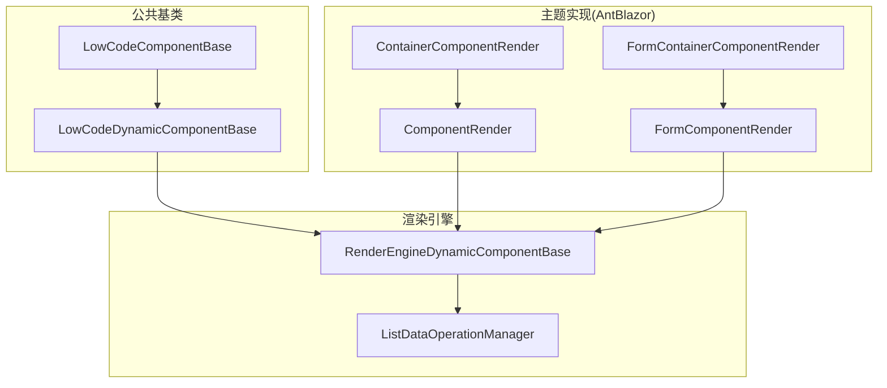
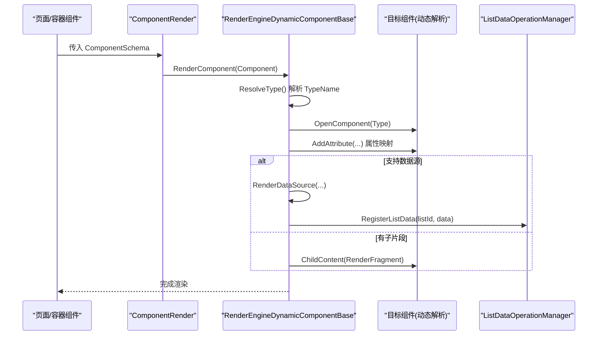
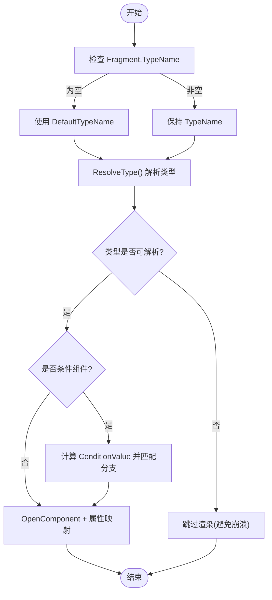
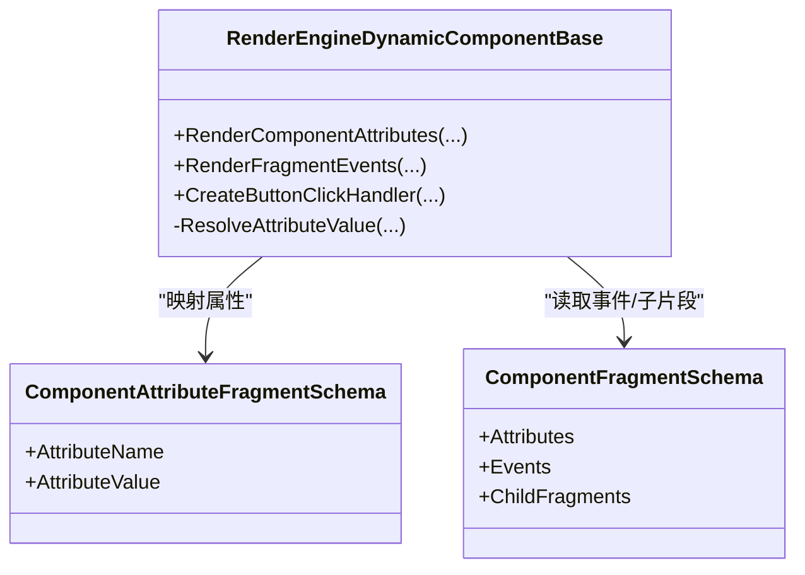
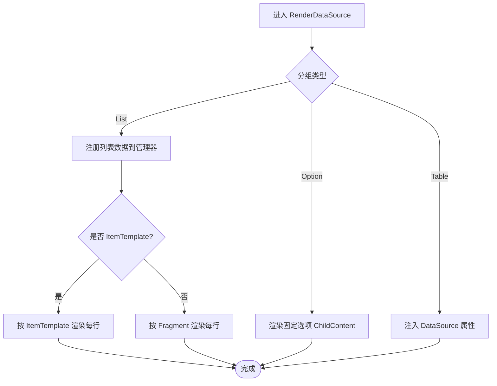
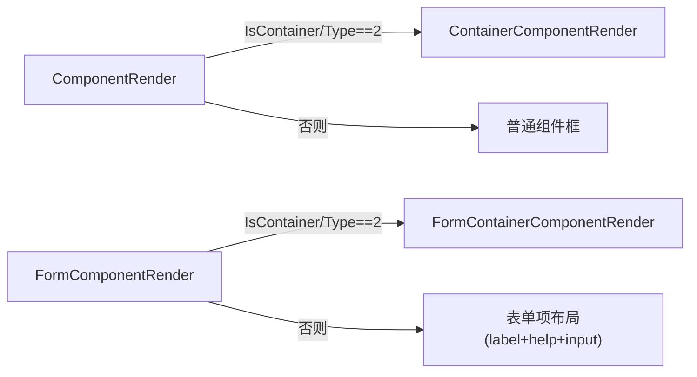
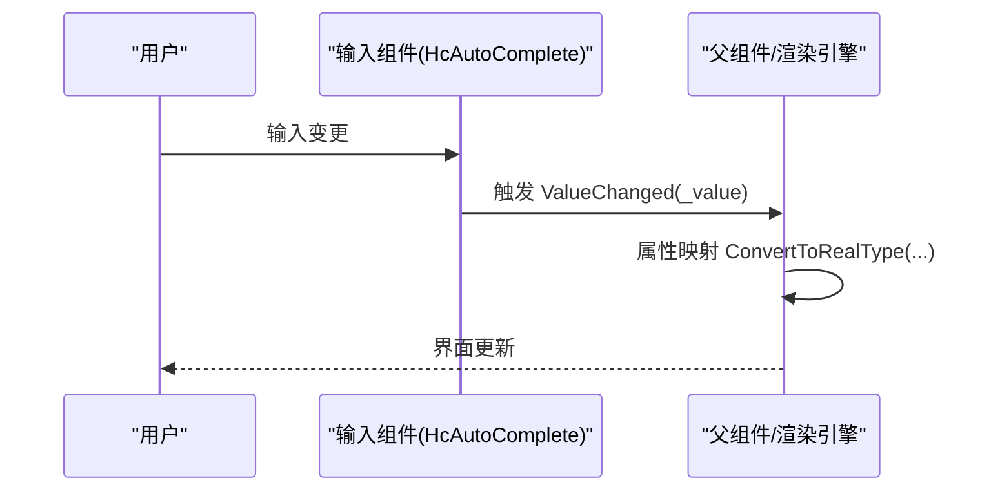
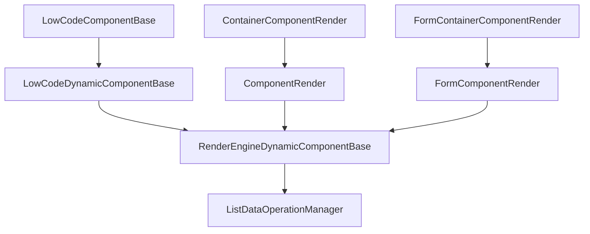

# 组件渲染系统

<cite>
**本文引用的文件**   
- [LowCodeComponentBase.cs](file://src/LowCode/Common/H.LowCode.ComponentBase/LowCodeComponentBase.cs)
- [LowCodeDynamicComponentBase.cs](file://src/LowCode/Common/H.LowCode.ComponentBase/LowCodeDynamicComponentBase.cs)
- [RenderEngineDynamicComponentBase.cs](file://src/LowCode/RenderEngine/H.LowCode.RenderEngineBase/RenderEngineDynamicComponentBase.cs)
- [ListDataOperationManager.cs](file://src/LowCode/RenderEngine/H.LowCode.RenderEngineBase/ListDataOperationManager.cs)
- [ComponentRender.razor](file://src/LowCode/RenderEngine/H.LowCode.Themes.AntBlazor/ComponentRender/ComponentRender.razor)
- [ContainerComponentRender.razor](file://src/LowCode/RenderEngine/H.LowCode.Themes.AntBlazor/ComponentRender/ContainerComponentRender.razor)
- [FormComponentRender.razor](file://src/LowCode/RenderEngine/H.LowCode.Themes.AntBlazor/ComponentRender/FormComponentRender.razor)
- [FormContainerComponentRender.razor](file://src/LowCode/RenderEngine/H.LowCode.Themes.AntBlazor/ComponentRender/FormContainerComponentRender.razor)
- [PropertySetting.razor（设计器属性面板）](file://src/LowCode/DesignEngine/H.LowCode.PartsDesignEngine/SettingPanel/PropertySetting.razor)
- [ValidationSetting.razor（校验设置）](file://src/LowCode/DesignEngine/H.LowCode.DesignEngine/SettingPanel/ValidationSetting.razor)
- [ComponentPartsSchema.cs](file://src/LowCode/Common/H.LowCode.MetaSchema.DesignEngine/ComponentPartsSchema.cs)
</cite>

## 目录
1. [简介](#简介)
2. [项目结构](#项目结构)
3. [核心组件](#核心组件)
4. [架构总览](#架构总览)
5. [详细组件分析](#详细组件分析)
6. [依赖关系分析](#依赖关系分析)
7. [性能考量](#性能考量)
8. [故障排查指南](#故障排查指南)
9. [结论](#结论)
10. [附录：自定义组件开发与集成指南](#附录自定义组件开发与集成指南)

## 简介
本文件面向低代码平台的“组件渲染系统”，系统性阐述动态组件的发现与实例化、属性映射与事件绑定、容器与表单两类组件的差异化渲染策略、状态管理与双向数据绑定、验证规则应用与错误处理，以及生命周期钩子的调用时机。同时给出自定义组件开发、集成与性能优化建议，帮助读者快速掌握并扩展该渲染体系。

## 项目结构
渲染系统围绕“基类 + 渲染引擎 + 主题实现”分层组织：
- 公共基类层：提供通用能力（日志、导航、JS交互、设计态标识等）
- 渲染引擎层：负责按元数据动态解析类型、构建 RenderTree、属性映射、事件绑定、数据源注入
- 主题实现层：AntBlazor 主题下的具体渲染组件（容器、表单、列表项模板等）
- 设计器侧：用于配置组件属性、事件、校验规则等元数据

图表来源 
- [LowCodeComponentBase.cs:1-73](file://src/LowCode/Common/H.LowCode.ComponentBase/LowCodeComponentBase.cs#L1-L73)
- [LowCodeDynamicComponentBase.cs:1-42](file://src/LowCode/Common/H.LowCode.ComponentBase/LowCodeDynamicComponentBase.cs#L1-L42)
- [RenderEngineDynamicComponentBase.cs:1-692](file://src/LowCode/RenderEngine/H.LowCode.RenderEngineBase/RenderEngineDynamicComponentBase.cs#L1-L692)
- [ListDataOperationManager.cs:1-157](file://src/LowCode/RenderEngine/H.LowCode.RenderEngineBase/ListDataOperationManager.cs#L1-L157)
- [ComponentRender.razor:1-42](file://src/LowCode/RenderEngine/H.LowCode.Themes.AntBlazor/ComponentRender/ComponentRender.razor#L1-L42)
- [ContainerComponentRender.razor:1-27](file://src/LowCode/RenderEngine/H.LowCode.Themes.AntBlazor/ComponentRender/ContainerComponentRender.razor#L1-L27)
- [FormComponentRender.razor:1-41](file://src/LowCode/RenderEngine/H.LowCode.Themes.AntBlazor/ComponentRender/FormComponentRender.razor#L1-L41)
- [FormContainerComponentRender.razor:1-26](file://src/LowCode/RenderEngine/H.LowCode.Themes.AntBlazor/ComponentRender/FormContainerComponentRender.razor#L1-L26)

章节来源
- [LowCodeComponentBase.cs:1-73](file://src/LowCode/Common/H.LowCode.ComponentBase/LowCodeComponentBase.cs#L1-L73)
- [LowCodeDynamicComponentBase.cs:1-42](file://src/LowCode/Common/H.LowCode.ComponentBase/LowCodeDynamicComponentBase.cs#L1-L42)
- [RenderEngineDynamicComponentBase.cs:1-692](file://src/LowCode/RenderEngine/H.LowCode.RenderEngineBase/RenderEngineDynamicComponentBase.cs#L1-L692)
- [ListDataOperationManager.cs:1-157](file://src/LowCode/RenderEngine/H.LowCode.RenderEngineBase/ListDataOperationManager.cs#L1-L157)
- [ComponentRender.razor:1-42](file://src/LowCode/RenderEngine/H.LowCode.Themes.AntBlazor/ComponentRender/ComponentRender.razor#L1-L42)
- [ContainerComponentRender.razor:1-27](file://src/LowCode/RenderEngine/H.LowCode.Themes.AntBlazor/ComponentRender/ContainerComponentRender.razor#L1-L27)
- [FormComponentRender.razor:1-41](file://src/LowCode/RenderEngine/H.LowCode.Themes.AntBlazor/ComponentRender/FormComponentRender.razor#L1-L41)
- [FormContainerComponentRender.razor:1-26](file://src/LowCode/RenderEngine/H.LowCode.Themes.AntBlazor/ComponentRender/FormContainerComponentRender.razor#L1-L26)

## 核心组件
- LowCodeComponentBase：所有组件的根基类，提供日志、导航、JS 交互、设计态判断、消息提示等通用能力。
- LowCodeDynamicComponentBase：动态组件基类，内置旧版 AntDesign 到现用 Hc 组件的类型兼容映射，统一动态解析入口。
- RenderEngineDynamicComponentBase：渲染引擎核心，负责根据 ComponentSchema 动态解析类型、递归构建 RenderTree、属性映射、事件绑定、数据源注入（选项、表格、列表）、条件渲染等。
- ListDataOperationManager：列表数据操作管理器，维护列表数据的增删改查、排序、复制、顺序字段更新等。
- 主题渲染组件：ComponentRender、ContainerComponentRender、FormComponentRender、FormContainerComponentRender，分别负责普通组件、容器组件、表单组件及表单容器的渲染策略。

章节来源
- [LowCodeComponentBase.cs:1-73](file://src/LowCode/Common/H.LowCode.ComponentBase/LowCodeComponentBase.cs#L1-L73)
- [LowCodeDynamicComponentBase.cs:1-42](file://src/LowCode/Common/H.LowCode.ComponentBase/LowCodeDynamicComponentBase.cs#L1-L42)
- [RenderEngineDynamicComponentBase.cs:1-692](file://src/LowCode/RenderEngine/H.LowCode.RenderEngineBase/RenderEngineDynamicComponentBase.cs#L1-L692)
- [ListDataOperationManager.cs:1-157](file://src/LowCode/RenderEngine/H.LowCode.RenderEngineBase/ListDataOperationManager.cs#L1-L157)
- [ComponentRender.razor:1-42](file://src/LowCode/RenderEngine/H.LowCode.Themes.AntBlazor/ComponentRender/ComponentRender.razor#L1-L42)
- [ContainerComponentRender.razor:1-27](file://src/LowCode/RenderEngine/H.LowCode.Themes.AntBlazor/ComponentRender/ContainerComponentRender.razor#L1-L27)
- [FormComponentRender.razor:1-41](file://src/LowCode/RenderEngine/H.LowCode.Themes.AntBlazor/ComponentRender/FormComponentRender.razor#L1-L41)
- [FormContainerComponentRender.razor:1-26](file://src/LowCode/RenderEngine/H.LowCode.Themes.AntBlazor/ComponentRender/FormContainerComponentRender.razor#L1-L26)

## 架构总览
渲染流程从页面或容器组件开始，依据 ComponentSchema 中的 Fragment.TypeName 动态解析目标组件类型，随后通过 RenderTreeBuilder 逐层构建 UI，期间完成属性映射、事件绑定、数据源注入与子节点渲染。容器与表单组件采用不同渲染分支，确保布局与交互符合预期。

图表来源 
- [ComponentRender.razor:1-42](file://src/LowCode/RenderEngine/H.LowCode.Themes.AntBlazor/ComponentRender/ComponentRender.razor#L1-L42)
- [RenderEngineDynamicComponentBase.cs:1-692](file://src/LowCode/RenderEngine/H.LowCode.RenderEngineBase/RenderEngineDynamicComponentBase.cs#L1-L692)
- [ListDataOperationManager.cs:1-157](file://src/LowCode/RenderEngine/H.LowCode.RenderEngineBase/ListDataOperationManager.cs#L1-L157)

## 详细组件分析

### 动态组件发现与实例化
- 类型解析：基于 ComponentFragmentSchema.TypeName 使用反射解析为 Type；若为空则回退 DefaultTypeName；无法解析时跳过以避免崩溃。
- 条件渲染：当 TypeName 包含“Conditional”且存在 Cases 时，读取 ConditionValue 属性值匹配分支，渲染对应 Case 的 Fragment。
- 兼容性映射：LowCodeDynamicComponentBase 内置旧版 AntDesign 组件名到现用 Hc 组件名的映射，保证历史页面数据可用。

图表来源 
- [RenderEngineDynamicComponentBase.cs:1-692](file://src/LowCode/RenderEngine/H.LowCode.RenderEngineBase/RenderEngineDynamicComponentBase.cs#L1-L692)
- [LowCodeDynamicComponentBase.cs:1-42](file://src/LowCode/Common/H.LowCode.ComponentBase/LowCodeDynamicComponentBase.cs#L1-L42)

章节来源
- [RenderEngineDynamicComponentBase.cs:1-692](file://src/LowCode/RenderEngine/H.LowCode.RenderEngineBase/RenderEngineDynamicComponentBase.cs#L1-L692)
- [LowCodeDynamicComponentBase.cs:1-42](file://src/LowCode/Common/H.LowCode.ComponentBase/LowCodeDynamicComponentBase.cs#L1-L42)

### 属性映射与事件绑定
- 属性映射：遍历 ComponentAttributeFragmentSchema，按属性名反射获取目标组件属性，将字符串值转换为属性实际类型后赋值。
- 事件绑定：在 Fragment 层级支持事件定义，当前实现聚焦于 Data 类型事件（如列表项按钮），生成 EventCallback 并绑定到组件事件（例如 OnClick）。
- 数据绑定表达式：支持 $(item.fieldName) 形式的表达式，在列表项上下文中解析为具体字段值。

图表来源 
- [RenderEngineDynamicComponentBase.cs:1-692](file://src/LowCode/RenderEngine/H.LowCode.RenderEngineBase/RenderEngineDynamicComponentBase.cs#L1-L692)

章节来源
- [RenderEngineDynamicComponentBase.cs:1-692](file://src/LowCode/RenderEngine/H.LowCode.RenderEngineBase/RenderEngineDynamicComponentBase.cs#L1-L692)

### 数据源注入与列表循环
- 选项型数据源：为选项类组件注入 ChildContent，逐项渲染 Option 组件，并传递 Label/Value。
- 表格型数据源：直接将 DataSource 对象注入组件属性。
- 列表型数据源：注册到 ListDataOperationManager，支持 ItemTemplate（完整组件配置）或 Fragment（简单组件配置）两种模式；为每项创建 ListItemContext（Item/Index/ListId），并在事件处理中定位行索引。

图表来源 
- [RenderEngineDynamicComponentBase.cs:1-692](file://src/LowCode/RenderEngine/H.LowCode.RenderEngineBase/RenderEngineDynamicComponentBase.cs#L1-L692)
- [ListDataOperationManager.cs:1-157](file://src/LowCode/RenderEngine/H.LowCode.RenderEngineBase/ListDataOperationManager.cs#L1-L157)

章节来源
- [RenderEngineDynamicComponentBase.cs:1-692](file://src/LowCode/RenderEngine/H.LowCode.RenderEngineBase/RenderEngineDynamicComponentBase.cs#L1-L692)
- [ListDataOperationManager.cs:1-157](file://src/LowCode/RenderEngine/H.LowCode.RenderEngineBase/ListDataOperationManager.cs#L1-L157)

### 容器组件与表单组件渲染策略
- 容器组件（ContainerComponentRender）：遍历 Childrens，按样式计算宽度与高度，内部递归渲染子组件（ComponentRender）。
- 表单容器（FormContainerComponentRender）：与容器类似，但子组件统一以 FormComponentRender 渲染，便于表单布局与标签展示。
- 普通组件（ComponentRender）：根据 IsContainer/ComponentType 决定走容器分支还是普通分支；普通分支显示标题（可选）与内容区。
- 表单组件（FormComponentRender）：在非容器情况下渲染 label/help 文本与输入区域，宽度按栅格计算。

图表来源 
- [ComponentRender.razor:1-42](file://src/LowCode/RenderEngine/H.LowCode.Themes.AntBlazor/ComponentRender/ComponentRender.razor#L1-L42)
- [ContainerComponentRender.razor:1-27](file://src/LowCode/RenderEngine/H.LowCode.Themes.AntBlazor/ComponentRender/ContainerComponentRender.razor#L1-L27)
- [FormComponentRender.razor:1-41](file://src/LowCode/RenderEngine/H.LowCode.Themes.AntBlazor/ComponentRender/FormComponentRender.razor#L1-L41)
- [FormContainerComponentRender.razor:1-26](file://src/LowCode/RenderEngine/H.LowCode.Themes.AntBlazor/ComponentRender/FormContainerComponentRender.razor#L1-L26)

章节来源
- [ComponentRender.razor:1-42](file://src/LowCode/RenderEngine/H.LowCode.Themes.AntBlazor/ComponentRender/ComponentRender.razor#L1-L42)
- [ContainerComponentRender.razor:1-27](file://src/LowCode/RenderEngine/H.LowCode.Themes.AntBlazor/ComponentRender/ContainerComponentRender.razor#L1-L27)
- [FormComponentRender.razor:1-41](file://src/LowCode/RenderEngine/H.LowCode.Themes.AntBlazor/ComponentRender/FormComponentRender.razor#L1-L41)
- [FormContainerComponentRender.razor:1-26](file://src/LowCode/RenderEngine/H.LowCode.Themes.AntBlazor/ComponentRender/FormContainerComponentRender.razor#L1-L26)

### 组件状态管理与双向数据绑定
- 状态键控制重渲染：LowCodeComponentBase 暴露 StateKey，可在 ShouldRender 中比较 StateKey 决定是否重新渲染，减少不必要的刷新。
- 列表项上下文：ListItemContext 携带 Item/Index/ListId，供属性绑定与事件处理使用。
- 双向绑定：组件内部通过 Value/ValueChanged 模式（示例见默认组件）实现输入值变化触发父级更新；渲染引擎在属性映射阶段将字符串值转换为目标类型后赋值。

图表来源 
- [HcAutoComplete.razor（示例）:179-214](file://src/Services/Approval/H.Approval.Web/Pages/BasicSettings.razor#L179-L214)
- [RenderEngineDynamicComponentBase.cs:1-692](file://src/LowCode/RenderEngine/H.LowCode.RenderEngineBase/RenderEngineDynamicComponentBase.cs#L1-L692)

章节来源
- [LowCodeComponentBase.cs:1-73](file://src/LowCode/Common/H.LowCode.ComponentBase/LowCodeComponentBase.cs#L1-L73)
- [RenderEngineDynamicComponentBase.cs:1-692](file://src/LowCode/RenderEngine/H.LowCode.RenderEngineBase/RenderEngineDynamicComponentBase.cs#L1-L692)

### 验证规则应用与错误处理
- 设计器侧：PropertySetting/ValidationSetting 提供启用/禁用校验、添加/删除规则、设置优先级与触发时机等能力，并将 ValidationRules 写入组件元数据。
- 运行时：组件可根据 ValidationRules 进行校验（由具体组件实现），错误信息可通过 LowCodeMessageService 提示。
- 错误处理：类型解析失败时跳过渲染，避免整页崩溃；必要处抛出 NullReferenceException 以便快速定位问题。

章节来源
- [PropertySetting.razor（设计器属性面板）:143-195](file://src/LowCode/DesignEngine/H.LowCode.PartsDesignEngine/SettingPanel/PropertySetting.razor#L143-L195)
- [ValidationSetting.razor（校验设置）:102-152](file://src/LowCode/DesignEngine/H.LowCode.DesignEngine/SettingPanel/ValidationSetting.razor#L102-L152)
- [ComponentPartsSchema.cs:1-50](file://src/LowCode/Common/H.LowCode.MetaSchema.DesignEngine/ComponentPartsSchema.cs#L1-L50)
- [RenderEngineDynamicComponentBase.cs:1-692](file://src/LowCode/RenderEngine/H.LowCode.RenderEngineBase/RenderEngineDynamicComponentBase.cs#L1-L692)

### 组件生命周期钩子
- OnInitializedAsync：基类与渲染引擎基类均重写该方法，用于初始化依赖（如注入服务、订阅事件）。
- OnParametersSet / OnParametersSetAsync：参数变化时重置或加载数据（设计器属性面板常用）。
- ShouldRender：结合 StateKey 控制是否重新渲染，提升性能。
- 用途建议：
  - OnInitializedAsync：一次性初始化（如注册列表数据、订阅全局事件）
  - OnParametersSet：响应外部参数变化（如组件元数据更新）
  - ShouldRender：仅在 StateKey 变化时渲染，避免频繁重建

章节来源
- [RenderEngineDynamicComponentBase.cs:1-692](file://src/LowCode/RenderEngine/H.LowCode.RenderEngineBase/RenderEngineDynamicComponentBase.cs#L1-L692)
- [PropertySetting.razor（设计器属性面板）:143-195](file://src/LowCode/DesignEngine/H.LowCode.PartsDesignEngine/SettingPanel/PropertySetting.razor#L143-L195)
- [LowCodeComponentBase.cs:1-73](file://src/LowCode/Common/H.LowCode.ComponentBase/LowCodeComponentBase.cs#L1-L73)

## 依赖关系分析
- 组件基类依赖：LowCodeComponentBase 依赖 IJSRuntime、NavigationManager、ILoggerFactory 等；LowCodeDynamicComponentBase 依赖 MetaSchema 与反射工具。
- 渲染引擎依赖：RenderEngineDynamicComponentBase 依赖 MetaSchema 模型、ListDataOperationManager、事件与数据绑定工具。
- 主题组件依赖：各 .razor 组件继承自渲染引擎基类或 LowCode 基类，依赖样式与布局。

图表来源 
- [LowCodeComponentBase.cs:1-73](file://src/LowCode/Common/H.LowCode.ComponentBase/LowCodeComponentBase.cs#L1-L73)
- [LowCodeDynamicComponentBase.cs:1-42](file://src/LowCode/Common/H.LowCode.ComponentBase/LowCodeDynamicComponentBase.cs#L1-L42)
- [RenderEngineDynamicComponentBase.cs:1-692](file://src/LowCode/RenderEngine/H.LowCode.RenderEngineBase/RenderEngineDynamicComponentBase.cs#L1-L692)
- [ListDataOperationManager.cs:1-157](file://src/LowCode/RenderEngine/H.LowCode.RenderEngineBase/ListDataOperationManager.cs#L1-L157)
- [ComponentRender.razor:1-42](file://src/LowCode/RenderEngine/H.LowCode.Themes.AntBlazor/ComponentRender/ComponentRender.razor#L1-L42)
- [ContainerComponentRender.razor:1-27](file://src/LowCode/RenderEngine/H.LowCode.Themes.AntBlazor/ComponentRender/ContainerComponentRender.razor#L1-L27)
- [FormComponentRender.razor:1-41](file://src/LowCode/RenderEngine/H.LowCode.Themes.AntBlazor/ComponentRender/FormComponentRender.razor#L1-L41)
- [FormContainerComponentRender.razor:1-26](file://src/LowCode/RenderEngine/H.LowCode.Themes.AntBlazor/ComponentRender/FormContainerComponentRender.razor#L1-L26)

章节来源
- [LowCodeComponentBase.cs:1-73](file://src/LowCode/Common/H.LowCode.ComponentBase/LowCodeComponentBase.cs#L1-L73)
- [LowCodeDynamicComponentBase.cs:1-42](file://src/LowCode/Common/H.LowCode.ComponentBase/LowCodeDynamicComponentBase.cs#L1-L42)
- [RenderEngineDynamicComponentBase.cs:1-692](file://src/LowCode/RenderEngine/H.LowCode.RenderEngineBase/RenderEngineDynamicComponentBase.cs#L1-L692)
- [ListDataOperationManager.cs:1-157](file://src/LowCode/RenderEngine/H.LowCode.RenderEngineBase/ListDataOperationManager.cs#L1-L157)

## 性能考量
- 按需渲染：利用 ShouldRender 与 StateKey 控制重渲染范围，避免全树重建。
- 类型解析缓存：建议在大型应用中缓存已解析的 Type，减少反射开销。
- 列表渲染优化：优先使用 ItemTemplate 精确渲染所需字段；避免在 ChildContent 中执行昂贵计算。
- 数据源加载：API/SQL 数据源应在组件初始化时异步加载，避免阻塞首屏渲染。
- 事件绑定最小化：仅绑定必要事件，减少回调数量。

[本节为通用指导，不直接分析具体文件]

## 故障排查指南
- 类型解析失败：检查 ComponentFragmentSchema.TypeName 是否正确，必要时回退 DefaultTypeName；查看日志输出定位。
- 属性映射异常：确认属性名与目标组件属性一致，注意类型转换（ConvertToRealType）是否成功。
- 列表事件无效：确认 CurrentListId 与 ListItemContext.ListId 一致，事件处理器是否被正确绑定。
- 校验未生效：在设计器中启用校验并添加规则，确保组件实现了校验逻辑。
- 页面崩溃：捕获并记录 NullReferenceException，定位缺失的 Fragment 或属性。

章节来源
- [RenderEngineDynamicComponentBase.cs:1-692](file://src/LowCode/RenderEngine/H.LowCode.RenderEngineBase/RenderEngineDynamicComponentBase.cs#L1-L692)
- [ListDataOperationManager.cs:1-157](file://src/LowCode/RenderEngine/H.LowCode.RenderEngineBase/ListDataOperationManager.cs#L1-L157)
- [PropertySetting.razor（设计器属性面板）:143-195](file://src/LowCode/DesignEngine/H.LowCode.PartsDesignEngine/SettingPanel/PropertySetting.razor#L143-L195)

## 结论
本渲染系统通过“元数据驱动 + 动态解析 + 主题实现”的方式，实现了高内聚、低耦合的组件渲染机制。其核心在于 RenderEngineDynamicComponentBase 对属性映射、事件绑定、数据源注入与条件渲染的统一抽象，配合 Container/Form 两类渲染策略满足复杂业务场景。借助状态键与 ShouldRender 优化渲染性能，并通过设计器完善校验与事件配置，形成完整的低代码闭环。

[本节为总结性内容，不直接分析具体文件]

## 附录：自定义组件开发与集成指南
- 组件基类选择：
  - 普通组件：继承 LowCodeComponentBase 或 LowCodeDynamicComponentBase
  - 渲染引擎组件：继承 RenderEngineDynamicComponentBase，以获得数据源与事件绑定能力
- 元数据定义：
  - 在 ComponentPartsSchema 中定义 Fragment（TypeName/Attributes/Events/ChildFragments）与 DataSource（Option/Table/List）
  - 支持事件 SupportEvents 与 ValidationRules
- 属性与事件：
  - 使用 [Parameter] 声明属性，支持 Value/ValueChanged 模式实现双向绑定
  - 在渲染引擎中通过属性映射自动赋值；事件通过 RenderFragmentEvents 绑定
- 数据源接入：
  - 选项型：为 ChildContent 注入 Option 组件
  - 列表型：使用 ItemTemplate 或 Fragment 渲染行，配合 ListDataOperationManager 管理数据
- 性能优化：
  - 合理使用 ShouldRender 与 StateKey
  - 避免在渲染过程中执行耗时操作
- 调试技巧：
  - 使用 Logger 输出关键路径
  - 在 ShouldRender 中打印 StateKey 变化
  - 针对类型解析失败增加友好提示

章节来源
- [ComponentPartsSchema.cs:1-50](file://src/LowCode/Common/H.LowCode.MetaSchema.DesignEngine/ComponentPartsSchema.cs#L1-L50)
- [RenderEngineDynamicComponentBase.cs:1-692](file://src/LowCode/RenderEngine/H.LowCode.RenderEngineBase/RenderEngineDynamicComponentBase.cs#L1-L692)
- [LowCodeComponentBase.cs:1-73](file://src/LowCode/Common/H.LowCode.ComponentBase/LowCodeComponentBase.cs#L1-L73)
- [LowCodeDynamicComponentBase.cs:1-42](file://src/LowCode/Common/H.LowCode.ComponentBase/LowCodeDynamicComponentBase.cs#L1-L42)