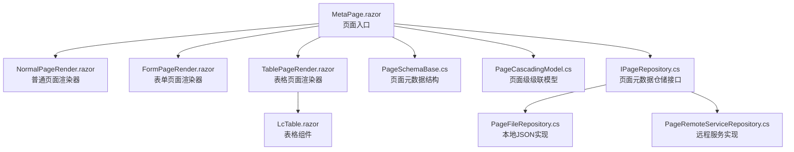
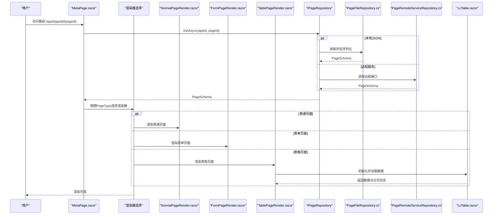
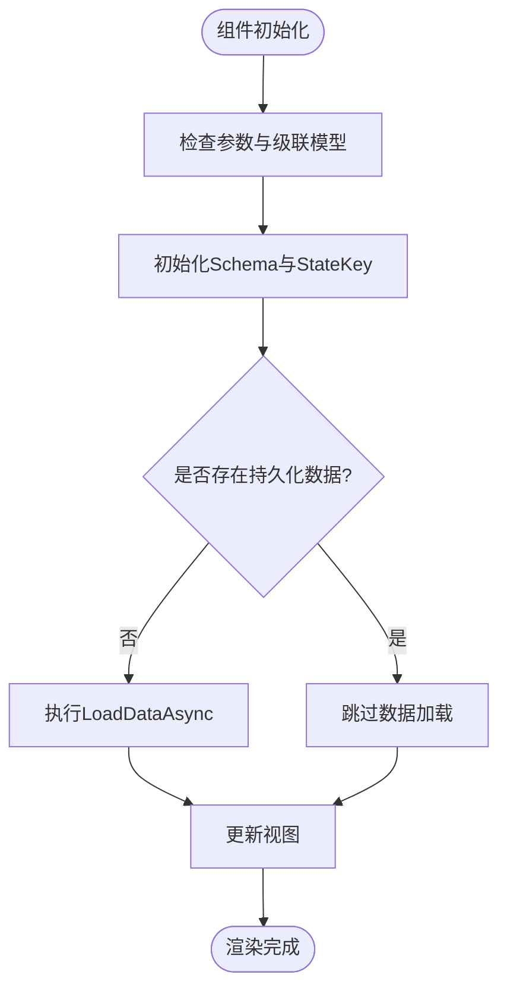
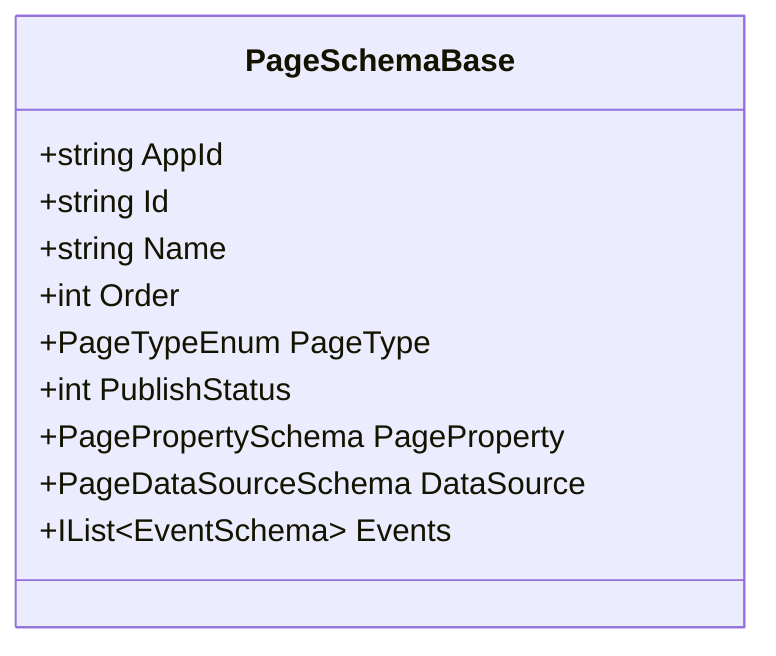
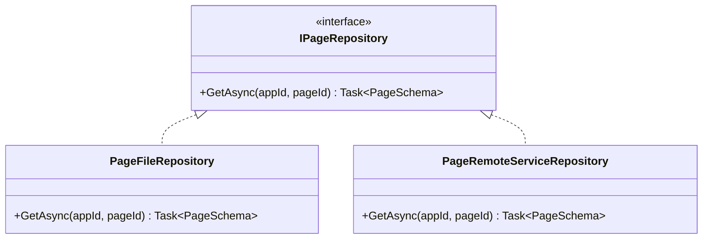
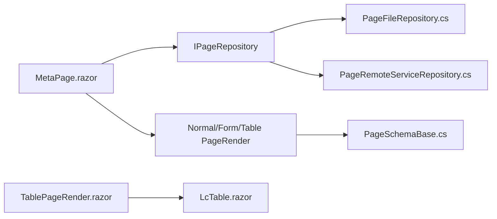

# 页面渲染

<cite>
**本文引用的文件**   
- [MetaPage.razor](file://src/LowCode/RenderEngine/H.LowCode.Themes.AntBlazor/Pages/MetaPage.razor)
- [NormalPageRender.razor](file://src/LowCode/RenderEngine/H.LowCode.Themes.AntBlazor/PageRender/NormalPageRender.razor)
- [FormPageRender.razor](file://src/LowCode/RenderEngine/H.LowCode.Themes.AntBlazor/PageRender/FormPageRender.razor)
- [TablePageRender.razor](file://src/LowCode/RenderEngine/H.LowCode.Themes.AntBlazor/PageRender/TablePageRender.razor)
- [LcTable.razor](file://src/LowCode/Common/H.LowCode.Components/Components/LcTable.razor)
- [PageSchemaBase.cs](file://src/LowCode/Common/H.LowCode.MetaSchema/PageSchemaBase.cs)
- [PageCascadingModel.cs](file://src/LowCode/Common/H.LowCode.ComponentBase/CascadingModels/PageCascadingModel.cs)
- [LowCodePageComponentBase.cs](file://src/LowCode/Common/H.LowCode.ComponentBase/LowCodePageComponentBase.cs)
- [IPageRepository.cs（渲染引擎）](file://src/LowCode/RenderEngine/H.LowCode.RenderEngine.Domain/MetaRepositories/IPageRepository.cs)
- [PageFileRepository.cs（渲染引擎-JsonFile）](file://src/LowCode/RenderEngine/H.LowCode.RenderEngine.Repository.JsonFile/Repositories/PageFileRepository.cs)
- [PageRemoteServiceRepository.cs（渲染引擎-RemoteService）](file://src/LowCode/RenderEngine/H.LowCode.RenderEngine.Repository.RemoteService/Repositories/PageRemoteServiceRepository.cs)
- [Error.razor（渲染引擎宿主）](file://src/Host/RenderEngine/H.LowCode.RenderEngine.Host/Components/Pages/Error.razor)
</cite>

## 目录
1. [简介](#简介)
2. [项目结构](#项目结构)
3. [核心组件](#核心组件)
4. [架构总览](#架构总览)
5. [详细组件分析](#详细组件分析)
6. [依赖关系分析](#依赖关系分析)
7. [性能考虑](#性能考虑)
8. [故障排查指南](#故障排查指南)
9. [结论](#结论)
10. [附录](#附录)

## 简介
本文件面向页面渲染系统，系统性阐述三类页面渲染器（普通页面、表单页面、表格页面）的实现与应用场景，解释页面元数据解析流程（结构定义、路由配置、权限控制），并说明页面状态管理（数据获取、缓存策略、错误处理）、生命周期管理（初始化、销毁、刷新）以及性能优化与自定义页面类型开发指南。文档以仓库中实际代码为依据，提供可视化图示与源码定位，便于快速理解与扩展。

## 项目结构
渲染引擎采用“主题化 + 页面渲染器”的架构：
- 主题层（AntBlazor）提供具体页面渲染器实现与UI样式
- 渲染入口页负责加载页面元数据、设置上下文与布局
- 元数据通过仓储接口抽象，支持本地JSON或远程服务两种实现
- 通用组件（如表格）内置数据加载、分页与持久化能力

**图表来源** 
- [MetaPage.razor](file://src/LowCode/RenderEngine/H.LowCode.Themes.AntBlazor/Pages/MetaPage.razor)
- [NormalPageRender.razor](file://src/LowCode/RenderEngine/H.LowCode.Themes.AntBlazor/PageRender/NormalPageRender.razor)
- [FormPageRender.razor](file://src/LowCode/RenderEngine/H.LowCode.Themes.AntBlazor/PageRender/FormPageRender.razor)
- [TablePageRender.razor](file://src/LowCode/RenderEngine/H.LowCode.Themes.AntBlazor/PageRender/TablePageRender.razor)
- [PageSchemaBase.cs](file://src/LowCode/Common/H.LowCode.MetaSchema/PageSchemaBase.cs)
- [PageCascadingModel.cs](file://src/LowCode/Common/H.LowCode.ComponentBase/CascadingModels/PageCascadingModel.cs)
- [IPageRepository.cs（渲染引擎）](file://src/LowCode/RenderEngine/H.LowCode.RenderEngine.Domain/MetaRepositories/IPageRepository.cs)
- [PageFileRepository.cs（渲染引擎-JsonFile）](file://src/LowCode/RenderEngine/H.LowCode.RenderEngine.Repository.JsonFile/Repositories/PageFileRepository.cs)
- [PageRemoteServiceRepository.cs（渲染引擎-RemoteService）](file://src/LowCode/RenderEngine/H.LowCode.RenderEngine.Repository.RemoteService/Repositories/PageRemoteServiceRepository.cs)
- [LcTable.razor](file://src/LowCode/Common/H.LowCode.Components/Components/LcTable.razor)

**章节来源**
- [MetaPage.razor](file://src/LowCode/RenderEngine/H.LowCode.Themes.AntBlazor/Pages/MetaPage.razor)
- [PageSchemaBase.cs](file://src/LowCode/Common/H.LowCode.MetaSchema/PageSchemaBase.cs)
- [PageCascadingModel.cs](file://src/LowCode/Common/H.LowCode.ComponentBase/CascadingModels/PageCascadingModel.cs)

## 核心组件
- MetaPage：渲染入口，负责根据路由参数加载页面元数据、设置页面级级联模型（AppId、PageId、PageName、PageLayout），并选择对应渲染器。
- NormalPageRender：普通页面渲染器，用于展示静态内容或非表单/非表格的业务页面。
- FormPageRender：表单页面渲染器，用于数据录入、编辑与提交等场景。
- TablePageRender：表格页面渲染器，用于列表展示、分页、筛选与批量操作。
- LcTable：通用表格组件，封装数据加载、分页、状态键与SSR持久化等能力。
- PageSchemaBase：页面元数据基础结构，包含应用ID、页面ID、名称、排序、页面类型、发布状态、页面属性、数据源与事件等。
- PageCascadingModel：页面级级联模型，向下传递AppId、PageId、PageName与布局信息。
- LowCodePageComponentBase：页面组件基类，提供统一的初始化钩子与查询参数辅助方法。
- IPageRepository：页面元数据仓储接口，统一GetAsync访问方式。
- PageFileRepository / PageRemoteServiceRepository：本地JSON与远程服务两种元数据读取实现。

**章节来源**
- [MetaPage.razor](file://src/LowCode/RenderEngine/H.LowCode.Themes.AntBlazor/Pages/MetaPage.razor)
- [NormalPageRender.razor](file://src/LowCode/RenderEngine/H.LowCode.Themes.AntBlazor/PageRender/NormalPageRender.razor)
- [FormPageRender.razor](file://src/LowCode/RenderEngine/H.LowCode.Themes.AntBlazor/PageRender/FormPageRender.razor)
- [TablePageRender.razor](file://src/LowCode/RenderEngine/H.LowCode.Themes.AntBlazor/PageRender/TablePageRender.razor)
- [LcTable.razor](file://src/LowCode/Common/H.LowCode.Components/Components/LcTable.razor)
- [PageSchemaBase.cs](file://src/LowCode/Common/H.LowCode.MetaSchema/PageSchemaBase.cs)
- [PageCascadingModel.cs](file://src/LowCode/Common/H.LowCode.ComponentBase/CascadingModels/PageCascadingModel.cs)
- [LowCodePageComponentBase.cs](file://src/LowCode/Common/H.LowCode.ComponentBase/LowCodePageComponentBase.cs)
- [IPageRepository.cs（渲染引擎）](file://src/LowCode/RenderEngine/H.LowCode.RenderEngine.Domain/MetaRepositories/IPageRepository.cs)
- [PageFileRepository.cs（渲染引擎-JsonFile）](file://src/LowCode/RenderEngine/H.LowCode.RenderEngine.Repository.JsonFile/Repositories/PageFileRepository.cs)
- [PageRemoteServiceRepository.cs（渲染引擎-RemoteService）](file://src/LowCode/RenderEngine/H.LowCode.RenderEngine.Repository.RemoteService/Repositories/PageRemoteServiceRepository.cs)

## 架构总览
渲染流程从MetaPage开始，依据页面元数据的PageType选择具体渲染器；渲染器再组合业务组件完成UI渲染。元数据通过仓储接口抽象，支持本地JSON与远程服务两种读取方式。表格组件具备独立的数据加载与状态管理逻辑。

**图表来源** 
- [MetaPage.razor](file://src/LowCode/RenderEngine/H.LowCode.Themes.AntBlazor/Pages/MetaPage.razor)
- [NormalPageRender.razor](file://src/LowCode/RenderEngine/H.LowCode.Themes.AntBlazor/PageRender/NormalPageRender.razor)
- [FormPageRender.razor](file://src/LowCode/RenderEngine/H.LowCode.Themes.AntBlazor/PageRender/FormPageRender.razor)
- [TablePageRender.razor](file://src/LowCode/RenderEngine/H.LowCode.Themes.AntBlazor/PageRender/TablePageRender.razor)
- [IPageRepository.cs（渲染引擎）](file://src/LowCode/RenderEngine/H.LowCode.RenderEngine.Domain/MetaRepositories/IPageRepository.cs)
- [PageFileRepository.cs（渲染引擎-JsonFile）](file://src/LowCode/RenderEngine/H.LowCode.RenderEngine.Repository.JsonFile/Repositories/PageFileRepository.cs)
- [PageRemoteServiceRepository.cs（渲染引擎-RemoteService）](file://src/LowCode/RenderEngine/H.LowCode.RenderEngine.Repository.RemoteService/Repositories/PageRemoteServiceRepository.cs)
- [LcTable.razor](file://src/LowCode/Common/H.LowCode.Components/Components/LcTable.razor)

## 详细组件分析

### MetaPage（页面入口）
- 职责：接收路由参数，构建页面级级联模型，加载页面元数据，设置布局与名称，并分发到具体渲染器。
- 关键点：
  - OnInitializedAsync/OnParametersSetAsync中根据PageId变化重新加载元数据，确保路由切换时数据一致性。
  - 将PageSchema中的名称与布局信息写入PageCascadingModel，供子组件使用。
  - 通过MetaAppService.GetPageWithDefineAsync获取完整页面定义（含组件定义合并）。

**章节来源**
- [MetaPage.razor](file://src/LowCode/RenderEngine/H.LowCode.Themes.AntBlazor/Pages/MetaPage.razor)
- [PageCascadingModel.cs](file://src/LowCode/Common/H.LowCode.ComponentBase/CascadingModels/PageCascadingModel.cs)

### NormalPageRender（普通页面渲染器）
- 适用场景：展示静态内容、公告、帮助页、仪表盘概览等非表单/非表格页面。
- 特点：直接渲染页面定义的组件树，不强制数据绑定或复杂交互。

**章节来源**
- [NormalPageRender.razor](file://src/LowCode/RenderEngine/H.LowCode.Themes.AntBlazor/PageRender/NormalPageRender.razor)

### FormPageRender（表单页面渲染器）
- 适用场景：新增、编辑、审批等需要表单输入与校验的场景。
- 特点：结合页面数据源与事件定义，驱动表单字段联动、提交与结果反馈。

**章节来源**
- [FormPageRender.razor](file://src/LowCode/RenderEngine/H.LowCode.Themes.AntBlazor/PageRender/FormPageRender.razor)

### TablePageRender（表格页面渲染器）
- 适用场景：数据列表、报表、导出、批量操作等。
- 特点：与LcTable组件协作，支持分页、筛选、排序与状态键隔离。

**章节来源**
- [TablePageRender.razor](file://src/LowCode/RenderEngine/H.LowCode.Themes.AntBlazor/PageRender/TablePageRender.razor)
- [LcTable.razor](file://src/LowCode/Common/H.LowCode.Components/Components/LcTable.razor)

### LcTable（表格组件）
- 职责：封装表格数据加载、分页、状态键管理与SSR持久化。
- 关键点：
  - OnParametersSetAsync中检查持久化数据，避免重复请求。
  - Init阶段根据DataSource配置初始化TablePropertySchema与StateKey。
  - OnChange处理分页变更，触发LoadDataAsync并刷新视图。

**图表来源** 
- [LcTable.razor](file://src/LowCode/Common/H.LowCode.Components/Components/LcTable.razor)

**章节来源**
- [LcTable.razor](file://src/LowCode/Common/H.LowCode.Components/Components/LcTable.razor)

### 页面元数据结构（PageSchemaBase）
- 字段含义：
  - AppId：所属应用标识
  - Id：页面唯一标识
  - Name：页面名称
  - Order：排序权重
  - PageType：页面类型（决定渲染器选择）
  - PublishStatus：发布状态
  - PageProperty：页面属性（含布局等）
  - DataSource：页面数据源配置
  - Events：事件定义集合

**图表来源** 
- [PageSchemaBase.cs](file://src/LowCode/Common/H.LowCode.MetaSchema/PageSchemaBase.cs)

**章节来源**
- [PageSchemaBase.cs](file://src/LowCode/Common/H.LowCode.MetaSchema/PageSchemaBase.cs)

### 页面级级联模型（PageCascadingModel）
- 作用：在组件树中向下传递AppId、PageId、PageName与PageLayout，供子组件统一消费。
- 关键属性：
  - AppId：应用标识
  - PageId：页面标识
  - PageName：页面名称
  - PageLayout：页面布局（列数）

**章节来源**
- [PageCascadingModel.cs](file://src/LowCode/Common/H.LowCode.ComponentBase/CascadingModels/PageCascadingModel.cs)

### 页面组件基类（LowCodePageComponentBase）
- 作用：为页面组件提供统一初始化钩子与查询参数辅助方法。
- 关键点：
  - OnInitializedAsync统一初始化流程
  - GetQueryValue<T>用于获取URL查询参数（默认返回default，可覆盖实现）

**章节来源**
- [LowCodePageComponentBase.cs](file://src/LowCode/Common/H.LowCode.ComponentBase/LowCodePageComponentBase.cs)

### 页面元数据仓储（IPageRepository及实现）
- 接口：IPageRepository.GetAsync(appId, pageId)
- 实现：
  - PageFileRepository：从本地JSON文件读取并反序列化为PageSchema
  - PageRemoteServiceRepository：通过远程服务获取PageSchema（当前未实现）

**图表来源** 
- [IPageRepository.cs（渲染引擎）](file://src/LowCode/RenderEngine/H.LowCode.RenderEngine.Domain/MetaRepositories/IPageRepository.cs)
- [PageFileRepository.cs（渲染引擎-JsonFile）](file://src/LowCode/RenderEngine/H.LowCode.RenderEngine.Repository.JsonFile/Repositories/PageFileRepository.cs)
- [PageRemoteServiceRepository.cs（渲染引擎-RemoteService）](file://src/LowCode/RenderEngine/H.LowCode.RenderEngine.Repository.RemoteService/Repositories/PageRemoteServiceRepository.cs)

**章节来源**
- [IPageRepository.cs（渲染引擎）](file://src/LowCode/RenderEngine/H.LowCode.RenderEngine.Domain/MetaRepositories/IPageRepository.cs)
- [PageFileRepository.cs（渲染引擎-JsonFile）](file://src/LowCode/RenderEngine/H.LowCode.RenderEngine.Repository.JsonFile/Repositories/PageFileRepository.cs)
- [PageRemoteServiceRepository.cs（渲染引擎-RemoteService）](file://src/LowCode/RenderEngine/H.LowCode.RenderEngine.Repository.RemoteService/Repositories/PageRemoteServiceRepository.cs)

## 依赖关系分析
- MetaPage依赖IPageRepository获取页面元数据，并通过MetaAppService合并组件定义。
- 渲染器依赖PageSchemaBase中的PageType进行分支选择。
- TablePageRender依赖LcTable组件进行数据展示与交互。
- 仓储实现解耦了数据来源，便于替换为数据库或远程服务。

**图表来源** 
- [MetaPage.razor](file://src/LowCode/RenderEngine/H.LowCode.Themes.AntBlazor/Pages/MetaPage.razor)
- [IPageRepository.cs（渲染引擎）](file://src/LowCode/RenderEngine/H.LowCode.RenderEngine.Domain/MetaRepositories/IPageRepository.cs)
- [PageFileRepository.cs（渲染引擎-JsonFile）](file://src/LowCode/RenderEngine/H.LowCode.RenderEngine.Repository.JsonFile/Repositories/PageFileRepository.cs)
- [PageRemoteServiceRepository.cs（渲染引擎-RemoteService）](file://src/LowCode/RenderEngine/H.LowCode.RenderEngine.Repository.RemoteService/Repositories/PageRemoteServiceRepository.cs)
- [PageSchemaBase.cs](file://src/LowCode/Common/H.LowCode.MetaSchema/PageSchemaBase.cs)
- [TablePageRender.razor](file://src/LowCode/RenderEngine/H.LowCode.Themes.AntBlazor/PageRender/TablePageRender.razor)
- [LcTable.razor](file://src/LowCode/Common/H.LowCode.Components/Components/LcTable.razor)

**章节来源**
- [MetaPage.razor](file://src/LowCode/RenderEngine/H.LowCode.Themes.AntBlazor/Pages/MetaPage.razor)
- [PageSchemaBase.cs](file://src/LowCode/Common/H.LowCode.MetaSchema/PageSchemaBase.cs)
- [LcTable.razor](file://src/LowCode/Common/H.LowCode.Components/Components/LcTable.razor)

## 性能考虑
- SSR持久化：LcTable利用PersistentState在SSR与WebAssembly之间保持数据，减少重复请求。
- 条件加载：仅在数据为空或首次加载时执行LoadDataAsync，避免不必要的网络开销。
- 状态键隔离：通过StateKey区分不同数据源实例，防止状态污染。
- 路由参数监听：MetaPage在PageId变化时重新加载元数据，保证切换时的数据一致性。
- 组件定义合并：MetaAppService在加载时合并组件定义，提升历史组件兼容性。

[本节为通用指导，无需源码引用]

## 故障排查指南
- 错误页面：渲染引擎宿主提供Error.razor用于捕获并展示异常信息，开发模式下显示详细堆栈。
- 常见问题：
  - 页面元数据缺失：检查IPageRepository实现是否正确返回PageSchema。
  - 表格数据未加载：确认LcTable的DataSource配置与StateKey是否有效。
  - 路由切换无刷新：检查MetaPage的OnParametersSetAsync是否响应PageId变化。

**章节来源**
- [Error.razor（渲染引擎宿主）](file://src/Host/RenderEngine/H.LowCode.RenderEngine.Host/Components/Pages/Error.razor)

## 结论
页面渲染系统通过清晰的层次划分与抽象接口，实现了多类型页面的灵活渲染与扩展。基于PageSchemaBase的元数据驱动与IPageRepository的数据源抽象，使得系统具备良好的可维护性与可扩展性。配合LcTable等通用组件，能够高效支撑常见业务场景。建议在生产环境中启用远程服务仓储以实现集中化管理，并结合缓存与监控进一步提升性能与稳定性。

[本节为总结，无需源码引用]

## 附录
- 自定义页面类型开发指南：
  - 定义新的PageType枚举值并在MetaPage中进行分支判断
  - 创建对应的PageRender组件，继承LowCodePageComponentBase以获得统一生命周期
  - 在PageSchemaBase中扩展必要的页面属性与事件定义
  - 如需数据源，参考LcTable的DataSource与StateKey模式进行实现

[本节为概念性内容，无需源码引用]