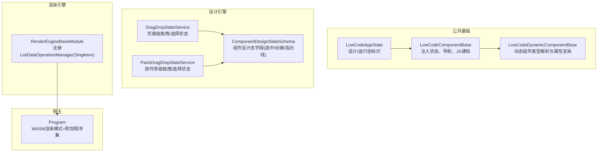
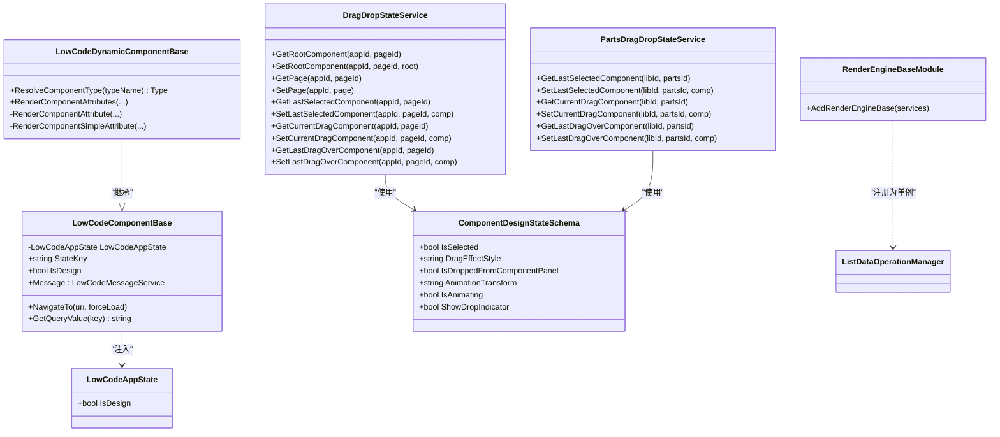
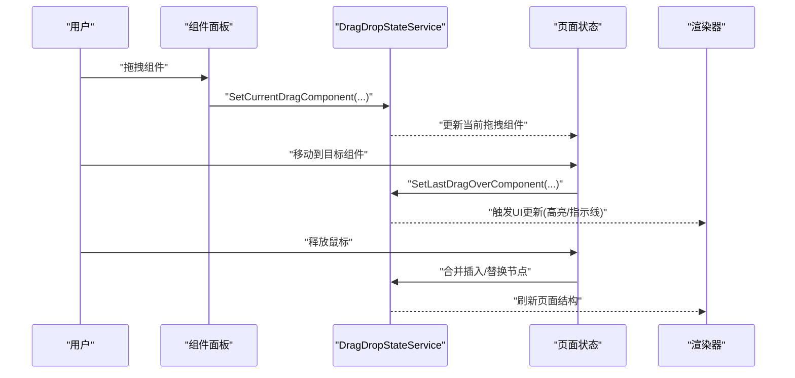
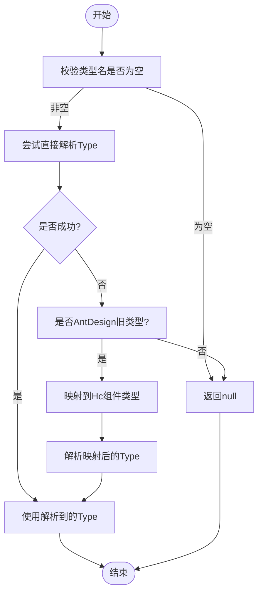
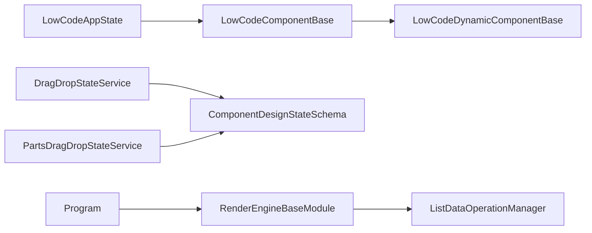

# 状态管理

<cite>
**本文引用的文件**   
- [LowCodeAppState.cs](file://src/LowCode/Common/H.LowCode.ComponentBase/LowCodeAppState.cs)
- [LowCodeComponentBase.cs](file://src/LowCode/Common/H.LowCode.ComponentBase/LowCodeComponentBase.cs)
- [LowCodeDynamicComponentBase.cs](file://src/LowCode/Common/H.LowCode.ComponentBase/LowCodeDynamicComponentBase.cs)
- [ComponentDesignStateSchema.cs](file://src/LowCode/Common/H.LowCode.MetaSchema.DesignEngine/PropertySchemas/ComponentDesignStateSchema.cs)
- [DragDropStateService.cs](file://src/LowCode/DesignEngine/H.LowCode.DesignEngine/Services/DragDropStateService.cs)
- [PartsDragDropStateService.cs](file://src/LowCode/DesignEngine/H.LowCode.PartsDesignEngine/Services/PartsDragDropStateService.cs)
- [RenderEngineBaseModule.cs](file://src/LowCode/RenderEngine/H.LowCode.RenderEngineBase/RenderEngineBaseModule.cs)
- [Program.cs](file://src/Host/RenderEngine/H.LowCode.RenderEngine.Host/Program.cs)
</cite>

## 目录
1. [简介](#简介)
2. [项目结构](#项目结构)
3. [核心组件](#核心组件)
4. [架构总览](#架构总览)
5. [详细组件分析](#详细组件分析)
6. [依赖关系分析](#依赖关系分析)
7. [性能考虑](#性能考虑)
8. [故障排查指南](#故障排查指南)
9. [结论](#结论)
10. [附录](#附录)

## 简介
本文件面向低代码状态管理系统，围绕 LowCodeAppState 的设计模式与状态同步机制展开，重点解释设计态与运行态的状态分离、拖拽状态管理、组件选择状态、属性编辑状态的实现方式，并给出状态持久化策略（本地存储、服务器同步、冲突解决）与性能优化建议（订阅、增量更新、内存管理）。文档同时提供最佳实践与常见问题解决方案，帮助读者快速理解并高效使用。

## 项目结构
低代码状态管理相关代码主要分布在以下模块：
- 公共基础能力：组件基类与全局状态标记
- 设计引擎：页面与组件的交互状态（选择、拖拽、动画指示等）
- 渲染引擎：运行时的数据操作管理器与模块注册
- 宿主程序：Blazor WebAssembly 渲染模式与额外程序集加载

图表来源 
- [LowCodeAppState.cs:1-21](file://src/LowCode/Common/H.LowCode.ComponentBase/LowCodeAppState.cs#L1-L21)
- [LowCodeComponentBase.cs:1-73](file://src/LowCode/Common/H.LowCode.ComponentBase/LowCodeComponentBase.cs#L1-L73)
- [LowCodeDynamicComponentBase.cs:1-187](file://src/LowCode/Common/H.LowCode.ComponentBase/LowCodeDynamicComponentBase.cs#L1-L187)
- [ComponentDesignStateSchema.cs:1-41](file://src/LowCode/Common/H.LowCode.MetaSchema.DesignEngine/PropertySchemas/ComponentDesignStateSchema.cs#L1-L41)
- [DragDropStateService.cs:1-42](file://src/LowCode/DesignEngine/H.LowCode.DesignEngine/Services/DragDropStateService.cs#L1-L42)
- [PartsDragDropStateService.cs:42-79](file://src/LowCode/DesignEngine/H.LowCode.PartsDesignEngine/Services/PartsDragDropStateService.cs#L42-L79)
- [RenderEngineBaseModule.cs:1-13](file://src/LowCode/RenderEngine/H.LowCode.RenderEngineBase/RenderEngineBaseModule.cs#L1-L13)
- [Program.cs:44-79](file://src/Host/RenderEngine/H.LowCode.RenderEngine.Host/Program.cs#L44-L79)

章节来源
- [LowCodeAppState.cs:1-21](file://src/LowCode/Common/H.LowCode.ComponentBase/LowCodeAppState.cs#L1-L21)
- [LowCodeComponentBase.cs:1-73](file://src/LowCode/Common/H.LowCode.ComponentBase/LowCodeComponentBase.cs#L1-L73)
- [LowCodeDynamicComponentBase.cs:1-187](file://src/LowCode/Common/H.LowCode.ComponentBase/LowCodeDynamicComponentBase.cs#L1-L187)
- [ComponentDesignStateSchema.cs:1-41](file://src/LowCode/Common/H.LowCode.MetaSchema.DesignEngine/PropertySchemas/ComponentDesignStateSchema.cs#L1-L41)
- [DragDropStateService.cs:1-42](file://src/LowCode/DesignEngine/H.LowCode.DesignEngine/Services/DragDropStateService.cs#L1-L42)
- [PartsDragDropStateService.cs:42-79](file://src/LowCode/DesignEngine/H.LowCode.PartsDesignEngine/Services/PartsDragDropStateService.cs#L42-L79)
- [RenderEngineBaseModule.cs:1-13](file://src/LowCode/RenderEngine/H.LowCode.RenderEngineBase/RenderEngineBaseModule.cs#L1-L13)
- [Program.cs:44-79](file://src/Host/RenderEngine/H.LowCode.RenderEngine.Host/Program.cs#L44-L79)

## 核心组件
- LowCodeAppState：全局状态标记，用于区分“设计时”和“运行时”。组件通过依赖注入获取该实例，从而判断当前上下文。
- LowCodeComponentBase：组件基类，注入 LowCodeAppState、NavigationManager、IJSRuntime 等，提供 IsDesign 便捷访问、消息提示、导航与查询参数读取等通用能力。
- LowCodeDynamicComponentBase：动态组件基类，负责将元数据中的组件类型名解析为实际 Type（含旧版 AntDesign 到 Hc 组件的兼容映射），并按属性定义渲染简单属性、事件回调与 RenderFragment。
- ComponentDesignStateSchema：组件设计态状态模型，包含选中、拖拽效果样式、是否由面板拖入、让位动画变换、动画进行中、放置指示线显示等字段，且标注不序列化。
- DragDropStateService / PartsDragDropStateService：静态服务，维护页面级与部件库级的拖拽与选择状态（根组件、页、最后选中组件、当前拖拽组件、上次悬停组件等）。
- RenderEngineBaseModule：在渲染引擎中注册 ListDataOperationManager 为单例，确保 WebAssembly 环境下状态保持。
- Program：配置 Blazor WASM 渲染模式并加载额外程序集，使低代码组件可在客户端动态发现与渲染。

章节来源
- [LowCodeAppState.cs:1-21](file://src/LowCode/Common/H.LowCode.ComponentBase/LowCodeAppState.cs#L1-L21)
- [LowCodeComponentBase.cs:1-73](file://src/LowCode/Common/H.LowCode.ComponentBase/LowCodeComponentBase.cs#L1-L73)
- [LowCodeDynamicComponentBase.cs:1-187](file://src/LowCode/Common/H.LowCode.ComponentBase/LowCodeDynamicComponentBase.cs#L1-L187)
- [ComponentDesignStateSchema.cs:1-41](file://src/LowCode/Common/H.LowCode.MetaSchema.DesignEngine/PropertySchemas/ComponentDesignStateSchema.cs#L1-L41)
- [DragDropStateService.cs:1-42](file://src/LowCode/DesignEngine/H.LowCode.DesignEngine/Services/DragDropStateService.cs#L1-L42)
- [PartsDragDropStateService.cs:42-79](file://src/LowCode/DesignEngine/H.LowCode.PartsDesignEngine/Services/PartsDragDropStateService.cs#L42-L79)
- [RenderEngineBaseModule.cs:1-13](file://src/LowCode/RenderEngine/H.LowCode.RenderEngineBase/RenderEngineBaseModule.cs#L1-L13)
- [Program.cs:44-79](file://src/Host/RenderEngine/H.LowCode.RenderEngine.Host/Program.cs#L44-L79)

## 架构总览
低代码状态管理采用“设计态/运行态分离 + 组件基类统一接入 + 静态服务集中管理交互状态”的模式：
- 设计态：由 DesignEngine 侧的 DragDropStateService/PartsDragDropStateService 维护页面与部件库的交互状态；ComponentDesignStateSchema 描述组件级别的临时 UI 状态（选中、动画、指示线等），不参与持久化。
- 运行态：由 RenderEngine 侧的 ListDataOperationManager（Singleton）维持数据操作状态，配合 Blazor 组件树进行渲染。
- 组件接入：所有低代码组件继承自 LowCodeComponentBase，通过注入的 LowCodeAppState.IsDesign 判断上下文，并使用基类提供的导航、JS 通知等能力。

图表来源 
- [LowCodeAppState.cs:1-21](file://src/LowCode/Common/H.LowCode.ComponentBase/LowCodeAppState.cs#L1-L21)
- [LowCodeComponentBase.cs:1-73](file://src/LowCode/Common/H.LowCode.ComponentBase/LowCodeComponentBase.cs#L1-L73)
- [LowCodeDynamicComponentBase.cs:1-187](file://src/LowCode/Common/H.LowCode.ComponentBase/LowCodeDynamicComponentBase.cs#L1-L187)
- [ComponentDesignStateSchema.cs:1-41](file://src/LowCode/Common/H.LowCode.MetaSchema.DesignEngine/PropertySchemas/ComponentDesignStateSchema.cs#L1-L41)
- [DragDropStateService.cs:1-42](file://src/LowCode/DesignEngine/H.LowCode.DesignEngine/Services/DragDropStateService.cs#L1-L42)
- [PartsDragDropStateService.cs:42-79](file://src/LowCode/DesignEngine/H.LowCode.PartsDesignEngine/Services/PartsDragDropStateService.cs#L42-L79)
- [RenderEngineBaseModule.cs:1-13](file://src/LowCode/RenderEngine/H.LowCode.RenderEngineBase/RenderEngineBaseModule.cs#L1-L13)

## 详细组件分析

### LowCodeAppState 与状态分离
- 作用：作为全局上下文开关，IsDesign=true 表示设计器环境，false 表示运行环境。
- 使用方式：组件基类注入后暴露 IsDesign 属性，供上层逻辑分支处理不同行为（如设计态下启用拖拽、选择、属性编辑面板；运行态下仅渲染业务逻辑）。
- 设计要点：轻量不可变对象，避免复杂生命周期管理。

章节来源
- [LowCodeAppState.cs:1-21](file://src/LowCode/Common/H.LowCode.ComponentBase/LowCodeAppState.cs#L1-L21)
- [LowCodeComponentBase.cs:1-73](file://src/LowCode/Common/H.LowCode.ComponentBase/LowCodeComponentBase.cs#L1-L73)

### 拖拽状态管理（DragDropStateService / PartsDragDropStateService）
- 职责：维护页面级与部件库级的拖拽与选择状态，包括根组件、页、最后选中组件、当前拖拽组件、上次悬停组件等。
- 数据结构：内部以字典缓存状态 Schema，按 appId/pageId 或 libId/partsId 维度隔离。
- 典型流程：从组件面板拖入 -> 设置当前拖拽组件 -> 计算放置目标 -> 更新最后悬停组件 -> 落盘前合并到页面结构。

图表来源 
- [DragDropStateService.cs:1-42](file://src/LowCode/DesignEngine/H.LowCode.DesignEngine/Services/DragDropStateService.cs#L1-L42)
- [PartsDragDropStateService.cs:42-79](file://src/LowCode/DesignEngine/H.LowCode.PartsDesignEngine/Services/PartsDragDropStateService.cs#L42-L79)

章节来源
- [DragDropStateService.cs:1-42](file://src/LowCode/DesignEngine/H.LowCode.DesignEngine/Services/DragDropStateService.cs#L1-L42)
- [PartsDragDropStateService.cs:42-79](file://src/LowCode/DesignEngine/H.LowCode.PartsDesignEngine/Services/PartsDragDropStateService.cs#L42-L79)

### 组件选择状态（ComponentDesignStateSchema）
- 字段说明：IsSelected（选中）、DragEffectStyle（拖拽效果样式）、IsDroppedFromComponentPanel（是否来自面板拖入）、AnimationTransform（让位动画变换）、IsAnimating（动画进行中）、ShowDropIndicator（放置指示线）。
- 特点：全部标注不序列化，表明这些是纯 UI 交互状态，不参与持久化。
- 使用场景：设计器在拖拽过程中根据这些字段控制视觉反馈与动画。

章节来源
- [ComponentDesignStateSchema.cs:1-41](file://src/LowCode/Common/H.LowCode.MetaSchema.DesignEngine/PropertySchemas/ComponentDesignStateSchema.cs#L1-L41)

### 属性编辑状态与动态渲染（LowCodeDynamicComponentBase）
- 类型解析：ResolveComponentType 支持直接解析与旧版 AntDesign 到 Hc 组件的兼容映射，失败返回 null 以避免整页崩溃。
- 属性渲染：对 RenderFragment、EventCallback、简单类型分别处理，保证元数据驱动的属性正确绑定。
- 错误处理：对空属性名、空类型名等进行防御性检查并记录警告日志。

图表来源 
- [LowCodeDynamicComponentBase.cs:1-187](file://src/LowCode/Common/H.LowCode.ComponentBase/LowCodeDynamicComponentBase.cs#L1-L187)

章节来源
- [LowCodeDynamicComponentBase.cs:1-187](file://src/LowCode/Common/H.LowCode.ComponentBase/LowCodeDynamicComponentBase.cs#L1-L187)

### 运行态数据操作状态（ListDataOperationManager）
- 注册方式：RenderEngineBaseModule 将其注册为 Singleton，确保在 Blazor WebAssembly 环境中跨组件共享状态。
- 作用范围：列表数据的分页、排序、筛选等操作状态在运行态保持一致，避免重复请求与状态不一致。

章节来源
- [RenderEngineBaseModule.cs:1-13](file://src/LowCode/RenderEngine/H.LowCode.RenderEngineBase/RenderEngineBaseModule.cs#L1-L13)

## 依赖关系分析
- 组件层依赖：LowCodeComponentBase 依赖 LowCodeAppState、NavigationManager、IJSRuntime；LowCodeDynamicComponentBase 依赖组件元数据与类型解析工具。
- 设计态依赖：DragDropStateService 与 PartsDragDropStateService 依赖 ComponentDesignStateSchema 描述 UI 交互状态。
- 运行态依赖：RenderEngineBaseModule 注册 ListDataOperationManager，Program 配置 WASM 渲染模式与附加程序集。

图表来源 
- [LowCodeAppState.cs:1-21](file://src/LowCode/Common/H.LowCode.ComponentBase/LowCodeAppState.cs#L1-L21)
- [LowCodeComponentBase.cs:1-73](file://src/LowCode/Common/H.LowCode.ComponentBase/LowCodeComponentBase.cs#L1-L73)
- [LowCodeDynamicComponentBase.cs:1-187](file://src/LowCode/Common/H.LowCode.ComponentBase/LowCodeDynamicComponentBase.cs#L1-L187)
- [ComponentDesignStateSchema.cs:1-41](file://src/LowCode/Common/H.LowCode.MetaSchema.DesignEngine/PropertySchemas/ComponentDesignStateSchema.cs#L1-L41)
- [DragDropStateService.cs:1-42](file://src/LowCode/DesignEngine/H.LowCode.DesignEngine/Services/DragDropStateService.cs#L1-L42)
- [PartsDragDropStateService.cs:42-79](file://src/LowCode/DesignEngine/H.LowCode.PartsDesignEngine/Services/PartsDragDropStateService.cs#L42-L79)
- [RenderEngineBaseModule.cs:1-13](file://src/LowCode/RenderEngine/H.LowCode.RenderEngineBase/RenderEngineBaseModule.cs#L1-L13)
- [Program.cs:44-79](file://src/Host/RenderEngine/H.LowCode.RenderEngine.Host/Program.cs#L44-L79)

## 性能考虑
- 状态订阅与增量更新
  - 利用 Blazor 的按需渲染特性，仅在状态变化时调用 StateHasChanged，避免全量重渲染。
  - 对大型页面结构变更，优先局部更新（如只更新被拖拽节点的子树）。
- 内存管理
  - 设计态状态（ComponentDesignStateSchema）不持久化，避免不必要的序列化开销。
  - 静态服务（DragDropStateService/PartsDragDropStateService）需按 appId/pageId 或 libId/partsId 维度清理过期状态，防止内存泄漏。
- 网络与缓存
  - 运行态数据操作（ListDataOperationManager）可结合服务端缓存与前端去抖/节流，减少重复请求。
  - 静态资源响应头已设置 Cache-Control，利于浏览器缓存。

[本节为通用指导，不直接分析具体文件]

## 故障排查指南
- 组件类型解析失败
  - 现象：动态组件无法渲染或报错。
  - 排查：确认类型名格式是否正确，是否命中 AntDesign 旧类型映射；查看 ResolveComponentType 的返回值与日志。
  - 参考：[LowCodeDynamicComponentBase.cs:1-187](file://src/LowCode/Common/H.LowCode.ComponentBase/LowCodeDynamicComponentBase.cs#L1-L187)
- 拖拽状态异常
  - 现象：拖拽无高亮、放置指示线不显示、组件未插入。
  - 排查：检查 DragDropStateService/PartsDragDropStateService 的 Set/Get 方法调用顺序与键值（appId/pageId 或 libId/partsId）是否一致；确认 ComponentDesignStateSchema 字段是否被正确设置。
  - 参考：[DragDropStateService.cs:1-42](file://src/LowCode/DesignEngine/H.LowCode.DesignEngine/Services/DragDropStateService.cs#L1-L42)、[PartsDragDropStateService.cs:42-79](file://src/LowCode/DesignEngine/H.LowCode.PartsDesignEngine/Services/PartsDragDropStateService.cs#L42-L79)、[ComponentDesignStateSchema.cs:1-41](file://src/LowCode/Common/H.LowCode.MetaSchema.DesignEngine/PropertySchemas/ComponentDesignStateSchema.cs#L1-L41)
- 运行态数据状态丢失
  - 现象：刷新后列表分页/筛选状态丢失。
  - 排查：确认 ListDataOperationManager 是否以 Singleton 注册；检查 WASM 渲染模式是否正常加载附加程序集。
  - 参考：[RenderEngineBaseModule.cs:1-13](file://src/LowCode/RenderEngine/H.LowCode.RenderEngineBase/RenderEngineBaseModule.cs#L1-L13)、[Program.cs:44-79](file://src/Host/RenderEngine/H.LowCode.RenderEngine.Host/Program.cs#L44-L79)

章节来源
- [LowCodeDynamicComponentBase.cs:1-187](file://src/LowCode/Common/H.LowCode.ComponentBase/LowCodeDynamicComponentBase.cs#L1-L187)
- [DragDropStateService.cs:1-42](file://src/LowCode/DesignEngine/H.LowCode.DesignEngine/Services/DragDropStateService.cs#L1-L42)
- [PartsDragDropStateService.cs:42-79](file://src/LowCode/DesignEngine/H.LowCode.PartsDesignEngine/Services/PartsDragDropStateService.cs#L42-L79)
- [ComponentDesignStateSchema.cs:1-41](file://src/LowCode/Common/H.LowCode.MetaSchema.DesignEngine/PropertySchemas/ComponentDesignStateSchema.cs#L1-L41)
- [RenderEngineBaseModule.cs:1-13](file://src/LowCode/RenderEngine/H.LowCode.RenderEngineBase/RenderEngineBaseModule.cs#L1-L13)
- [Program.cs:44-79](file://src/Host/RenderEngine/H.LowCode.RenderEngine.Host/Program.cs#L44-L79)

## 结论
本状态管理体系通过 LowCodeAppState 明确区分设计态与运行态，借助组件基类统一接入，并以静态服务集中管理设计器交互状态，实现了清晰的状态边界与良好的扩展性。运行态通过单例数据操作管理器保障状态一致性。建议在后续迭代中完善状态持久化策略（本地缓存与服务器同步）与冲突解决机制，进一步提升用户体验与系统稳定性。

[本节为总结性内容，不直接分析具体文件]

## 附录
- 状态持久化策略建议
  - 本地存储：对设计态草稿（页面结构、组件属性）进行 JSON 序列化，按 appId/pageId 分桶存储；对运行态数据操作状态可按会话周期缓存。
  - 服务器同步：设计态变更增量同步至服务端，保留版本历史；运行态数据操作结果通过 API 提交，支持乐观锁或版本号冲突检测。
  - 冲突解决：基于时间戳与版本号合并策略，优先保留用户最新操作；对关键数据引入人工确认流程。
- 最佳实践
  - 将 UI 交互状态与业务数据状态解耦，避免混用导致难以追踪的问题。
  - 对大对象与频繁变更的状态，采用不可变更新与浅拷贝策略，降低渲染成本。
  - 在设计器中限制并发拖拽与批量操作，避免状态竞争。
- 常见问题
  - 类型解析失败：确保元数据中的类型名完整且可解析，必要时增加降级映射。
  - 状态不同步：检查各服务层的键空间隔离与生命周期管理，确保状态读写路径一致。
  - 性能瓶颈：定位高频重渲染点，使用 ShouldRender 与局部更新优化。

[本节为通用指导，不直接分析具体文件]