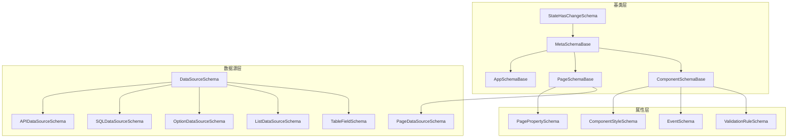
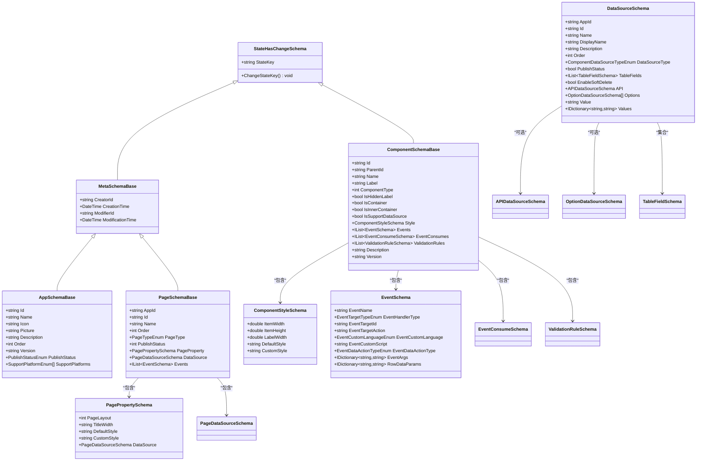
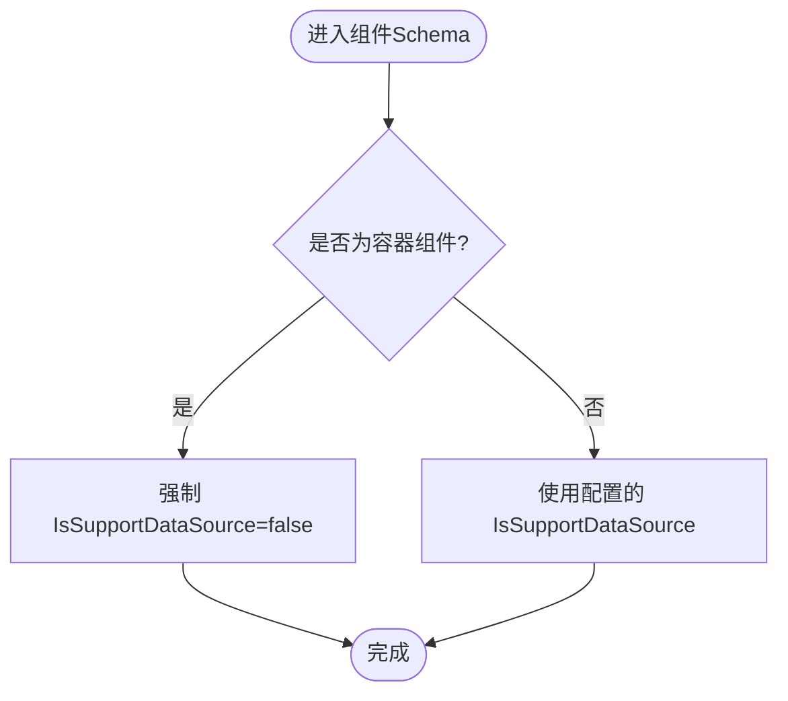
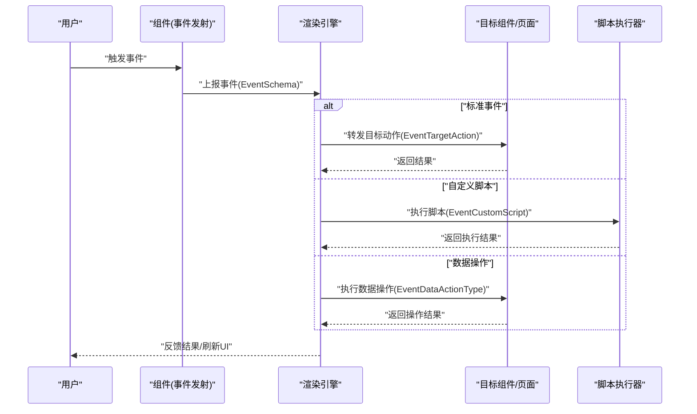
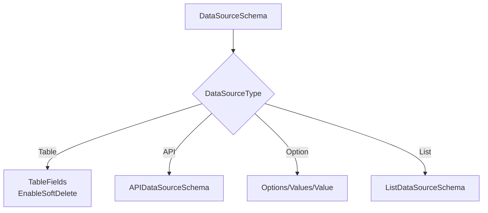
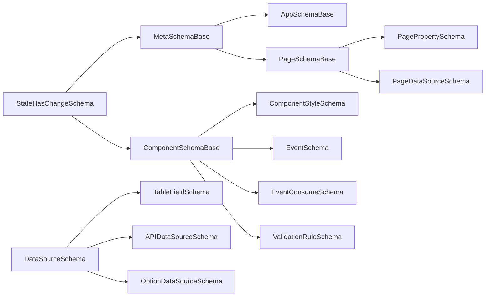

# 元数据Schema

<cite>
**本文引用的文件**
- [ComponentSchemaBase.cs](file://src/LowCode/Common/H.LowCode.MetaSchema/ComponentSchemaBase.cs)
- [PageSchemaBase.cs](file://src/LowCode/Common/H.LowCode.MetaSchema/PageSchemaBase.cs)
- [MetaSchemaBase.cs](file://src/LowCode/Common/H.LowCode.MetaSchema/MetaSchemaBase.cs)
- [StateHasChangeSchema.cs](file://src/LowCode/Common/H.LowCode.MetaSchema/StateHasChangeSchema.cs)
- [AppSchemaBase.cs](file://src/LowCode/Common/H.LowCode.MetaSchema/AppSchemaBase.cs)
- [EventSchema.cs](file://src/LowCode/Common/H.LowCode.MetaSchema/PropertySchemas/EventSchema.cs)
- [ComponentStyleSchema.cs](file://src/LowCode/Common/H.LowCode.MetaSchema/PropertySchemas/ComponentStyleSchema.cs)
- [DataSourceSchema.cs](file://src/LowCode/Common/H.LowCode.MetaSchema/DataSourceSchema.cs)
- [PagePropertySchema.cs](file://src/LowCode/Common/H.LowCode.MetaSchema/PropertySchemas/PagePropertySchema.cs)
</cite>

## 目录
1. [简介](#简介)
2. [项目结构](#项目结构)
3. [核心组件](#核心组件)
4. [架构总览](#架构总览)
5. [详细组件分析](#详细组件分析)
6. [依赖关系分析](#依赖关系分析)
7. [性能考量](#性能考量)
8. [故障排查指南](#故障排查指南)
9. [结论](#结论)
10. [附录：自定义Schema开发指南与示例](#附录自定义schema开发指南与示例)

## 简介
本文件面向低代码平台的“元数据Schema系统”，系统性阐述以下要点：
- ComponentSchemaBase（组件Schema基类）与 PageSchemaBase（页面Schema基类）的设计理念与职责边界
- 属性Schema定义规范：数据类型、验证规则、默认值设置
- 事件Schema机制：事件类型、参数传递、回调处理
- 数据源Schema、布局Schema、样式Schema的定义规范
- 自定义Schema开发的完整指南与实践建议

该文档旨在帮助开发者快速理解并扩展Schema体系，确保在设计与渲染阶段具备一致的元数据结构。

## 项目结构
Schema相关核心位于 LowCode.Common.H.LowCode.MetaSchema 模块下，围绕“基类—属性—数据源—事件—样式”的层次化组织展开：
- 基类层：StateHasChangeSchema、MetaSchemaBase、AppSchemaBase、PageSchemaBase、ComponentSchemaBase
- 属性层：ComponentStyleSchema、PagePropertySchema、ValidationRuleSchema、EventSchema 等
- 数据源层：DataSourceSchema 及其具体实现（如 APIDataSourceSchema、SQLDataSourceSchema、OptionDataSourceSchema、ListDataSourceSchema、PageDataSourceSchema、TableFieldSchema 等）

图表来源
- [StateHasChangeSchema.cs:1-17](file://src/LowCode/Common/H.LowCode.MetaSchema/StateHasChangeSchema.cs#L1-L17)
- [MetaSchemaBase.cs:1-20](file://src/LowCode/Common/H.LowCode.MetaSchema/MetaSchemaBase.cs#L1-L20)
- [AppSchemaBase.cs:1-32](file://src/LowCode/Common/H.LowCode.MetaSchema/AppSchemaBase.cs#L1-L32)
- [PageSchemaBase.cs:1-40](file://src/LowCode/Common/H.LowCode.MetaSchema/PageSchemaBase.cs#L1-L40)
- [ComponentSchemaBase.cs:1-104](file://src/LowCode/Common/H.LowCode.MetaSchema/ComponentSchemaBase.cs#L1-L104)
- [ComponentStyleSchema.cs:1-40](file://src/LowCode/Common/H.LowCode.MetaSchema/PropertySchemas/ComponentStyleSchema.cs#L1-L40)
- [PagePropertySchema.cs:1-38](file://src/LowCode/Common/H.LowCode.MetaSchema/PropertySchemas/PagePropertySchema.cs#L1-L38)
- [EventSchema.cs:1-67](file://src/LowCode/Common/H.LowCode.MetaSchema/PropertySchemas/EventSchema.cs#L1-L67)
- [DataSourceSchema.cs:1-70](file://src/LowCode/Common/H.LowCode.MetaSchema/DataSourceSchema.cs#L1-L70)

章节来源
- [ComponentSchemaBase.cs:1-104](file://src/LowCode/Common/H.LowCode.MetaSchema/ComponentSchemaBase.cs#L1-L104)
- [PageSchemaBase.cs:1-40](file://src/LowCode/Common/H.LowCode.MetaSchema/PageSchemaBase.cs#L1-L40)
- [MetaSchemaBase.cs:1-20](file://src/LowCode/Common/H.LowCode.MetaSchema/MetaSchemaBase.cs#L1-L20)
- [StateHasChangeSchema.cs:1-17](file://src/LowCode/Common/H.LowCode.MetaSchema/StateHasChangeSchema.cs#L1-L17)
- [AppSchemaBase.cs:1-32](file://src/LowCode/Common/H.LowCode.MetaSchema/AppSchemaBase.cs#L1-L32)
- [ComponentStyleSchema.cs:1-40](file://src/LowCode/Common/H.LowCode.MetaSchema/PropertySchemas/ComponentStyleSchema.cs#L1-L40)
- [PagePropertySchema.cs:1-38](file://src/LowCode/Common/H.LowCode.MetaSchema/PropertySchemas/PagePropertySchema.cs#L1-L38)
- [EventSchema.cs:1-67](file://src/LowCode/Common/H.LowCode.MetaSchema/PropertySchemas/EventSchema.cs#L1-L67)
- [DataSourceSchema.cs:1-70](file://src/LowCode/Common/H.LowCode.MetaSchema/DataSourceSchema.cs#L1-L70)

## 核心组件
- StateHasChangeSchema：为所有Schema提供状态键（StateKey）与变更能力，用于渲染引擎触发更新。
- MetaSchemaBase：统一审计字段（创建者、创建时间、修改者、修改时间），贯穿应用、页面、组件等元数据。
- AppSchemaBase：应用级元数据（名称、图标、描述、排序、版本、发布状态、支持平台）。
- PageSchemaBase：页面级元数据（ID、名称、排序、页面类型、发布状态、页面属性、页面数据源、页面事件）。
- ComponentSchemaBase：组件级元数据（实例ID、父ID、名称、标签、组件类型、容器标记、标题隐藏、是否支持数据源、样式、事件、事件消费、校验规则、描述、版本）。

这些基类共同构成“应用—页面—组件”三层元数据的骨架，保证跨层级的一致性与可扩展性。

章节来源
- [StateHasChangeSchema.cs:1-17](file://src/LowCode/Common/H.LowCode.MetaSchema/StateHasChangeSchema.cs#L1-L17)
- [MetaSchemaBase.cs:1-20](file://src/LowCode/Common/H.LowCode.MetaSchema/MetaSchemaBase.cs#L1-L20)
- [AppSchemaBase.cs:1-32](file://src/LowCode/Common/H.LowCode.MetaSchema/AppSchemaBase.cs#L1-L32)
- [PageSchemaBase.cs:1-40](file://src/LowCode/Common/H.LowCode.MetaSchema/PageSchemaBase.cs#L1-L40)
- [ComponentSchemaBase.cs:1-104](file://src/LowCode/Common/H.LowCode.MetaSchema/ComponentSchemaBase.cs#L1-L104)

## 架构总览
下图展示了Schema继承关系与关键组合关系，体现“基类—属性—数据源—事件—样式”的分层设计。

图表来源
- [StateHasChangeSchema.cs:1-17](file://src/LowCode/Common/H.LowCode.MetaSchema/StateHasChangeSchema.cs#L1-L17)
- [MetaSchemaBase.cs:1-20](file://src/LowCode/Common/H.LowCode.MetaSchema/MetaSchemaBase.cs#L1-L20)
- [AppSchemaBase.cs:1-32](file://src/LowCode/Common/H.LowCode.MetaSchema/AppSchemaBase.cs#L1-L32)
- [PageSchemaBase.cs:1-40](file://src/LowCode/Common/H.LowCode.MetaSchema/PageSchemaBase.cs#L1-L40)
- [ComponentSchemaBase.cs:1-104](file://src/LowCode/Common/H.LowCode.MetaSchema/ComponentSchemaBase.cs#L1-L104)
- [ComponentStyleSchema.cs:1-40](file://src/LowCode/Common/H.LowCode.MetaSchema/PropertySchemas/ComponentStyleSchema.cs#L1-L40)
- [PagePropertySchema.cs:1-38](file://src/LowCode/Common/H.LowCode.MetaSchema/PropertySchemas/PagePropertySchema.cs#L1-L38)
- [EventSchema.cs:1-67](file://src/LowCode/Common/H.LowCode.MetaSchema/PropertySchemas/EventSchema.cs#L1-L67)
- [DataSourceSchema.cs:1-70](file://src/LowCode/Common/H.LowCode.MetaSchema/DataSourceSchema.cs#L1-L70)

## 详细组件分析

### ComponentSchemaBase（组件Schema基类）
- 标识与层级：Id、ParentId、Name、Label、Version，支撑组件树结构与唯一性。
- 行为特征：ComponentType（原子/组合）、IsContainer、IsInnerContainer、IsHiddenLabel，决定渲染与交互行为。
- 数据绑定：IsSupportDataSource 控制是否允许配置数据源；容器组件强制不可绑定数据源。
- 样式与事件：Style（组件样式）、Events（事件定义）、EventConsumes（事件消费）、ValidationRules（校验规则）。
- 序列化约定：通过 JsonPropertyName 指定紧凑JSON键名（如 id、n、lb、ct、stl、evs、valrules、desc、v）。

图表来源
- [ComponentSchemaBase.cs:1-104](file://src/LowCode/Common/H.LowCode.MetaSchema/ComponentSchemaBase.cs#L1-L104)

章节来源
- [ComponentSchemaBase.cs:1-104](file://src/LowCode/Common/H.LowCode.MetaSchema/ComponentSchemaBase.cs#L1-L104)

### PageSchemaBase（页面Schema基类）
- 标识与排序：Id、Name、Order、PageType、PublishStatus。
- 页面属性：PageProperty（布局、标题宽度、默认/自定义样式、页面数据源）。
- 页面数据源：DataSource（页面级数据源）。
- 页面事件：Events（页面级事件集合）。
- 序列化约定：aid、id、n、order、pt、pub、pageprop、ds、evs。

章节来源
- [PageSchemaBase.cs:1-40](file://src/LowCode/Common/H.LowCode.MetaSchema/PageSchemaBase.cs#L1-L40)

### MetaSchemaBase 与 StateHasChangeSchema
- StateHasChangeSchema：提供 StateKey 与 ChangeStateKey()，用于渲染引擎状态刷新。
- MetaSchemaBase：统一审计字段（CreatorId、CreationTime、ModifierId、ModificationTime）。

章节来源
- [StateHasChangeSchema.cs:1-17](file://src/LowCode/Common/H.LowCode.MetaSchema/StateHasChangeSchema.cs#L1-L17)
- [MetaSchemaBase.cs:1-20](file://src/LowCode/Common/H.LowCode.MetaSchema/MetaSchemaBase.cs#L1-L20)

### 属性Schema定义规范
- 组件样式 Schema（ComponentStyleSchema）
  - 字段：ItemWidth、ItemHeight、LabelWidth、DefaultStyle、CustomStyle
  - 用途：控制组件尺寸、标签宽度、默认/自定义样式注入
  - 默认值：ItemWidth=4、ItemHeight=85、LabelWidth=180
- 页面属性 Schema（PagePropertySchema）
  - 字段：PageLayout（列数）、TitleWidth、DefaultStyle、CustomStyle、DataSource
  - 用途：页面整体布局与样式、页面级数据源
- 校验规则 Schema（ValidationRuleSchema）
  - 用途：为组件属性提供校验约束（如必填、长度、格式等）
- 事件 Schema（EventSchema）
  - 标准事件：EventTargetId、EventTargetAction
  - 自定义事件：EventCustomLanguage、EventCustomScript
  - 数据操作事件：EventDataActionType
  - 参数传递：EventArgs（通用键值对）、RowDataParams（行数据到URL参数的映射）

章节来源
- [ComponentStyleSchema.cs:1-40](file://src/LowCode/Common/H.LowCode.MetaSchema/PropertySchemas/ComponentStyleSchema.cs#L1-L40)
- [PagePropertySchema.cs:1-38](file://src/LowCode/Common/H.LowCode.MetaSchema/PropertySchemas/PagePropertySchema.cs#L1-L38)
- [EventSchema.cs:1-67](file://src/LowCode/Common/H.LowCode.MetaSchema/PropertySchemas/EventSchema.cs#L1-L67)

### 事件Schema定义机制
- 事件类型：
  - 标准事件：目标动作（跳转、打开弹窗、调用服务等）
  - 自定义事件：脚本语言与脚本内容
  - 数据操作事件：增删改查等操作类型
- 参数传递：
  - EventArgs：通用参数字典
  - RowDataParams：将行数据字段映射为URL参数名
- 回调处理：
  - 事件消费（EventConsumeSchema）：声明事件名称与显示名称，供上层编排消费逻辑

图表来源
- [EventSchema.cs:1-67](file://src/LowCode/Common/H.LowCode.MetaSchema/PropertySchemas/EventSchema.cs#L1-L67)

章节来源
- [EventSchema.cs:1-67](file://src/LowCode/Common/H.LowCode.MetaSchema/PropertySchemas/EventSchema.cs#L1-L67)

### 数据源Schema定义规范
- 数据源基类（DataSourceSchema）
  - 标识与元信息：AppId、Id、Name、DisplayName、Description、Order、PublishStatus
  - 类型枚举：DataSourceType（表、API、选项、列表等）
  - 表数据源：TableFields（字段定义）、EnableSoftDelete（软删除开关）
  - API数据源：API（接口配置）
  - 选项数据源：Options（静态选项数组）、Values（键值字典）、Value（当前值）
- 页面数据源（PageDataSourceSchema）：页面级数据源配置，与页面属性中的DataSource关联
- 其他数据源：APIDataSourceSchema、SQLDataSourceSchema、OptionDataSourceSchema、ListDataSourceSchema、TableFieldSchema

图表来源
- [DataSourceSchema.cs:1-70](file://src/LowCode/Common/H.LowCode.MetaSchema/DataSourceSchema.cs#L1-L70)

章节来源
- [DataSourceSchema.cs:1-70](file://src/LowCode/Common/H.LowCode.MetaSchema/DataSourceSchema.cs#L1-L70)

### 布局Schema与样式Schema
- 布局Schema（PagePropertySchema.PageLayout）：支持一列至四列布局，配合组件的ItemWidth进行栅格分配
- 样式Schema（ComponentStyleSchema）：组件级宽高、标签宽度、默认/自定义样式注入，覆盖页面默认样式

章节来源
- [PagePropertySchema.cs:1-38](file://src/LowCode/Common/H.LowCode.MetaSchema/PropertySchemas/PagePropertySchema.cs#L1-L38)
- [ComponentStyleSchema.cs:1-40](file://src/LowCode/Common/H.LowCode.MetaSchema/PropertySchemas/ComponentStyleSchema.cs#L1-L40)

## 依赖关系分析
- 继承链：StateHasChangeSchema → MetaSchemaBase → AppSchemaBase / PageSchemaBase；ComponentSchemaBase 直接继承 StateHasChangeSchema
- 组合关系：
  - PageSchemaBase 组合 PagePropertySchema、PageDataSourceSchema、Events
  - ComponentSchemaBase 组合 ComponentStyleSchema、Events、EventConsumes、ValidationRules
  - DataSourceSchema 组合 TableFieldSchema、APIDataSourceSchema、OptionDataSourceSchema 等

图表来源
- [StateHasChangeSchema.cs:1-17](file://src/LowCode/Common/H.LowCode.MetaSchema/StateHasChangeSchema.cs#L1-L17)
- [MetaSchemaBase.cs:1-20](file://src/LowCode/Common/H.LowCode.MetaSchema/MetaSchemaBase.cs#L1-L20)
- [AppSchemaBase.cs:1-32](file://src/LowCode/Common/H.LowCode.MetaSchema/AppSchemaBase.cs#L1-L32)
- [PageSchemaBase.cs:1-40](file://src/LowCode/Common/H.LowCode.MetaSchema/PageSchemaBase.cs#L1-L40)
- [ComponentSchemaBase.cs:1-104](file://src/LowCode/Common/H.LowCode.MetaSchema/ComponentSchemaBase.cs#L1-L104)
- [PagePropertySchema.cs:1-38](file://src/LowCode/Common/H.LowCode.MetaSchema/PropertySchemas/PagePropertySchema.cs#L1-L38)
- [ComponentStyleSchema.cs:1-40](file://src/LowCode/Common/H.LowCode.MetaSchema/PropertySchemas/ComponentStyleSchema.cs#L1-L40)
- [EventSchema.cs:1-67](file://src/LowCode/Common/H.LowCode.MetaSchema/PropertySchemas/EventSchema.cs#L1-L67)
- [DataSourceSchema.cs:1-70](file://src/LowCode/Common/H.LowCode.MetaSchema/DataSourceSchema.cs#L1-L70)

章节来源
- [ComponentSchemaBase.cs:1-104](file://src/LowCode/Common/H.LowCode.MetaSchema/ComponentSchemaBase.cs#L1-L104)
- [PageSchemaBase.cs:1-40](file://src/LowCode/Common/H.LowCode.MetaSchema/PageSchemaBase.cs#L1-L40)
- [DataSourceSchema.cs:1-70](file://src/LowCode/Common/H.LowCode.MetaSchema/DataSourceSchema.cs#L1-L70)

## 性能考量
- 状态键管理：StateHasChangeSchema.StateKey 用于最小化重渲染范围，避免全量刷新
- 条件计算：ComponentSchemaBase.IsSupportDataSource 在容器组件上强制关闭，减少无效的数据源解析
- JSON序列化：采用紧凑键名（JsonPropertyName）降低传输体积，提升序列化/反序列化效率
- 数据源选择：根据 DataSourceType 分支加载对应配置，避免无关配置参与运算

[本节为通用指导，不直接分析具体文件]

## 故障排查指南
- 事件未触发或无响应
  - 检查 EventSchema.EventName 是否与目标组件的事件消费一致
  - 确认 EventTargetId 与 EventTargetAction 配置正确
  - 若为自定义脚本，检查 EventCustomLanguage 与 EventCustomScript 语法
- 数据源未生效
  - 组件 IsSupportDataSource 是否为 true（容器组件自动为 false）
  - DataSourceType 与实际配置匹配（Table/API/Option/List）
  - 表数据源的 TableFields 与后端字段一致
- 样式未生效
  - 组件样式 DefaultStyle/CustomStyle 是否正确注入
  - 页面样式 DefaultStyle/CustomStyle 是否被组件样式覆盖
- 校验失败
  - 检查 ValidationRuleSchema 的规则配置是否符合预期

章节来源
- [EventSchema.cs:1-67](file://src/LowCode/Common/H.LowCode.MetaSchema/PropertySchemas/EventSchema.cs#L1-L67)
- [ComponentSchemaBase.cs:1-104](file://src/LowCode/Common/H.LowCode.MetaSchema/ComponentSchemaBase.cs#L1-L104)
- [DataSourceSchema.cs:1-70](file://src/LowCode/Common/H.LowCode.MetaSchema/DataSourceSchema.cs#L1-L70)
- [ComponentStyleSchema.cs:1-40](file://src/LowCode/Common/H.LowCode.MetaSchema/PropertySchemas/ComponentStyleSchema.cs#L1-L40)
- [PagePropertySchema.cs:1-38](file://src/LowCode/Common/H.LowCode.MetaSchema/PropertySchemas/PagePropertySchema.cs#L1-L38)

## 结论
本Schema体系以清晰的继承与组合关系，构建了“应用—页面—组件”的统一元数据模型。通过标准化的属性、事件、数据源与样式定义，既保证了设计与渲染的一致性，也为扩展提供了稳定基础。遵循本文档的规范与最佳实践，可高效扩展自定义Schema并保障系统的可维护性与性能。

[本节为总结性内容，不直接分析具体文件]

## 附录：自定义Schema开发指南与示例
- 新增组件Schema步骤
  1. 继承 ComponentSchemaBase 或更具体的基类
  2. 定义属性字段，并使用 JsonPropertyName 指定JSON键名
  3. 如需数据源，确保 IsSupportDataSource=true（非容器组件）
  4. 配置样式（ComponentStyleSchema）与事件（EventSchema）
  5. 添加校验规则（ValidationRuleSchema）
- 新增页面Schema步骤
  1. 继承 PageSchemaBase
  2. 配置 PagePropertySchema（布局、样式）
  3. 配置 PageDataSourceSchema（页面数据源）
  4. 定义页面级事件（Events）
- 新增数据源Schema步骤
  1. 基于 DataSourceSchema 扩展具体类型（如 APIDataSourceSchema、SQLDataSourceSchema）
  2. 定义字段映射（TableFieldSchema）与查询参数
  3. 设置发布状态与排序
- 事件扩展建议
  - 标准事件优先使用 EventTargetId/EventTargetAction
  - 复杂逻辑使用自定义脚本（EventCustomLanguage/EventCustomScript）
  - 数据操作使用 EventDataActionType，并通过 EventArgs/RowDataParams 传递参数
- 样式扩展建议
  - 组件样式优先使用 ItemWidth/ItemHeight/LabelWidth 控制布局
  - 通过 DefaultStyle/CustomStyle 注入CSS，注意优先级与覆盖策略

章节来源
- [ComponentSchemaBase.cs:1-104](file://src/LowCode/Common/H.LowCode.MetaSchema/ComponentSchemaBase.cs#L1-L104)
- [PageSchemaBase.cs:1-40](file://src/LowCode/Common/H.LowCode.MetaSchema/PageSchemaBase.cs#L1-L40)
- [DataSourceSchema.cs:1-70](file://src/LowCode/Common/H.LowCode.MetaSchema/DataSourceSchema.cs#L1-L70)
- [EventSchema.cs:1-67](file://src/LowCode/Common/H.LowCode.MetaSchema/PropertySchemas/EventSchema.cs#L1-L67)
- [ComponentStyleSchema.cs:1-40](file://src/LowCode/Common/H.LowCode.MetaSchema/PropertySchemas/ComponentStyleSchema.cs#L1-L40)
- [PagePropertySchema.cs:1-38](file://src/LowCode/Common/H.LowCode.MetaSchema/PropertySchemas/PagePropertySchema.cs#L1-L38)