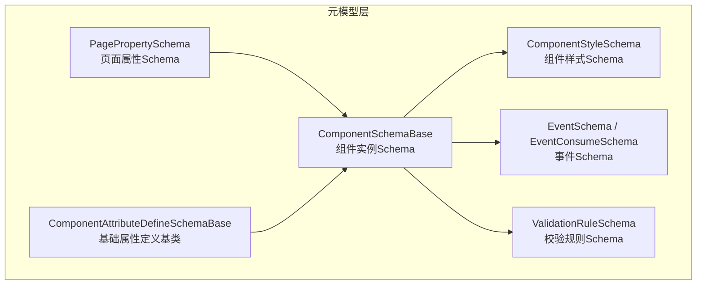
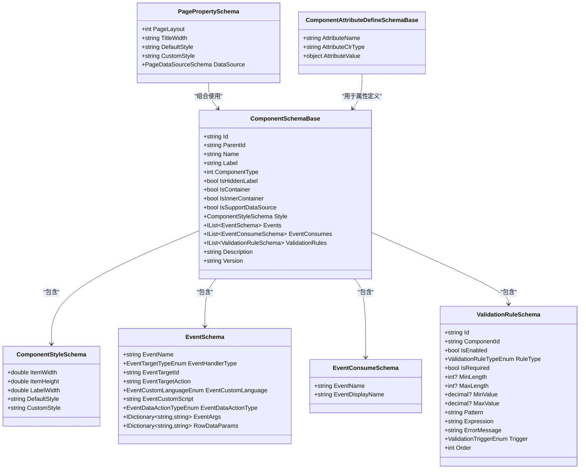
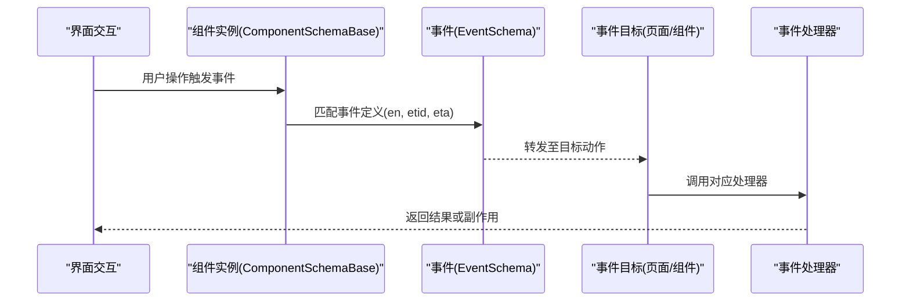
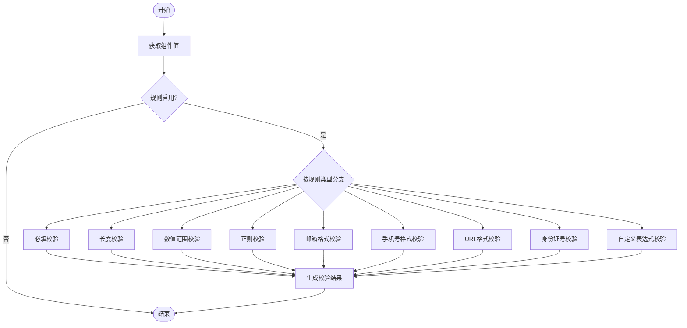
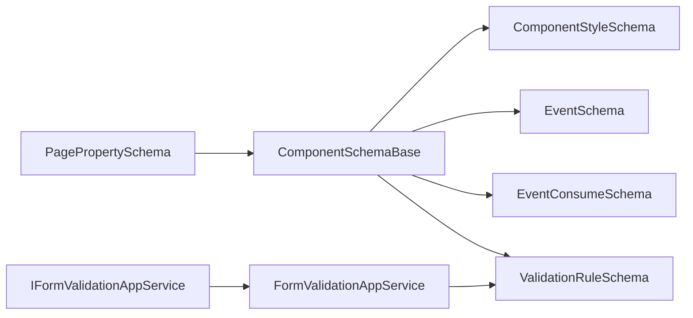

# 属性Schema定义

<cite>
**本文引用的文件**   
- [ComponentAttributeDefineSchemaBase.cs](file://src/LowCode/Common/H.LowCode.MetaSchema/PropertySchemas/ComponentAttributeDefineSchemaBase.cs)
- [ValidationRuleSchema.cs](file://src/LowCode/Common/H.LowCode.MetaSchema/PropertySchemas/ValidationRuleSchema.cs)
- [EventSchema.cs](file://src/LowCode/Common/H.LowCode.MetaSchema/PropertySchemas/EventSchema.cs)
- [ComponentStyleSchema.cs](file://src/LowCode/Common/H.LowCode.MetaSchema/PropertySchemas/ComponentStyleSchema.cs)
- [PagePropertySchema.cs](file://src/LowCode/Common/H.LowCode.MetaSchema/PropertySchemas/PagePropertySchema.cs)
- [ComponentSchemaBase.cs](file://src/LowCode/Common/H.LowCode.MetaSchema/ComponentSchemaBase.cs)
- [FormValidationAppService.cs](file://src/LowCode/Common/H.LowCode.Application/Services/FormValidationAppService.cs)
- [IFormValidationAppService.cs](file://src/LowCode/Common/H.LowCode.Application.Contracts/AppServices/IFormValidationAppService.cs)
</cite>

## 目录
1. [简介](#简介)
2. [项目结构](#项目结构)
3. [核心组件](#核心组件)
4. [架构总览](#架构总览)
5. [详细组件分析](#详细组件分析)
6. [依赖关系分析](#依赖关系分析)
7. [性能考虑](#性能考虑)
8. [故障排查指南](#故障排查指南)
9. [结论](#结论)
10. [附录：自定义属性类型开发指南与示例](#附录自定义属性类型开发指南与示例)

## 简介
本文件面向低代码平台的“属性Schema定义系统”，系统性阐述基础属性、样式属性、验证规则、事件属性的设计模式与实现规范。文档覆盖文本输入、数字选择、布尔值、日期时间等数据类型的Schema结构，解释校验规则的Schema定义与执行机制，并说明事件属性的定义方式与回调处理流程。最后提供自定义属性类型的开发指南与完整示例路径，帮助开发者快速扩展平台能力。

## 项目结构
属性Schema相关代码集中在MetaSchema模块的PropertySchemas目录中，并通过ComponentSchemaBase将组件实例与其属性、样式、事件、校验规则进行统一组织。页面级属性通过PagePropertySchema描述布局与默认样式。

图表来源 
- [ComponentSchemaBase.cs:1-104](file://src/LowCode/Common/H.LowCode.MetaSchema/ComponentSchemaBase.cs#L1-L104)
- [ComponentStyleSchema.cs:1-40](file://src/LowCode/Common/H.LowCode.MetaSchema/PropertySchemas/ComponentStyleSchema.cs#L1-L40)
- [EventSchema.cs:1-67](file://src/LowCode/Common/H.LowCode.MetaSchema/PropertySchemas/EventSchema.cs#L1-L67)
- [ValidationRuleSchema.cs:1-178](file://src/LowCode/Common/H.LowCode.MetaSchema/PropertySchemas/ValidationRuleSchema.cs#L1-L178)
- [PagePropertySchema.cs:1-38](file://src/LowCode/Common/H.LowCode.MetaSchema/PropertySchemas/PagePropertySchema.cs#L1-L38)
- [ComponentAttributeDefineSchemaBase.cs:1-26](file://src/LowCode/Common/H.LowCode.MetaSchema/PropertySchemas/ComponentAttributeDefineSchemaBase.cs#L1-L26)

章节来源
- [ComponentSchemaBase.cs:1-104](file://src/LowCode/Common/H.LowCode.MetaSchema/ComponentSchemaBase.cs#L1-L104)
- [ComponentStyleSchema.cs:1-40](file://src/LowCode/Common/H.LowCode.MetaSchema/PropertySchemas/ComponentStyleSchema.cs#L1-L40)
- [EventSchema.cs:1-67](file://src/LowCode/Common/H.LowCode.MetaSchema/PropertySchemas/EventSchema.cs#L1-L67)
- [ValidationRuleSchema.cs:1-178](file://src/LowCode/Common/H.LowCode.MetaSchema/PropertySchemas/ValidationRuleSchema.cs#L1-L178)
- [PagePropertySchema.cs:1-38](file://src/LowCode/Common/H.LowCode.MetaSchema/PropertySchemas/PagePropertySchema.cs#L1-L38)
- [ComponentAttributeDefineSchemaBase.cs:1-26](file://src/LowCode/Common/H.LowCode.MetaSchema/PropertySchemas/ComponentAttributeDefineSchemaBase.cs#L1-L26)

## 核心组件
- 组件实例Schema（ComponentSchemaBase）
  - 统一承载组件Id、名称、标签、类型、容器标识、是否支持数据源、样式、事件、事件消费、校验规则、版本等。
- 组件样式Schema（ComponentStyleSchema）
  - 定义组件宽度、高度、标签宽度、默认样式与自定义样式。
- 事件Schema（EventSchema / EventConsumeSchema）
  - 标准事件目标（id、动作）、自定义脚本语言与内容、数据操作事件类型、事件参数与行数据映射。
- 校验规则Schema（ValidationRuleSchema）
  - 规则Id、关联组件Id、启用状态、规则类型、必填、长度/数值范围、正则、自定义表达式、错误消息、触发时机、排序。
- 页面属性Schema（PagePropertySchema）
  - 页面布局列数、标题宽度、默认样式、自定义样式、页面数据源。
- 基础属性定义基类（ComponentAttributeDefineSchemaBase）
  - 属性名、CLR类型、属性值，作为具体属性定义的通用骨架。

章节来源
- [ComponentSchemaBase.cs:1-104](file://src/LowCode/Common/H.LowCode.MetaSchema/ComponentSchemaBase.cs#L1-L104)
- [ComponentStyleSchema.cs:1-40](file://src/LowCode/Common/H.LowCode.MetaSchema/PropertySchemas/ComponentStyleSchema.cs#L1-L40)
- [EventSchema.cs:1-67](file://src/LowCode/Common/H.LowCode.MetaSchema/PropertySchemas/EventSchema.cs#L1-L67)
- [ValidationRuleSchema.cs:1-178](file://src/LowCode/Common/H.LowCode.MetaSchema/PropertySchemas/ValidationRuleSchema.cs#L1-L178)
- [PagePropertySchema.cs:1-38](file://src/LowCode/Common/H.LowCode.MetaSchema/PropertySchemas/PagePropertySchema.cs#L1-L38)
- [ComponentAttributeDefineSchemaBase.cs:1-26](file://src/LowCode/Common/H.LowCode.MetaSchema/PropertySchemas/ComponentAttributeDefineSchemaBase.cs#L1-L26)

## 架构总览
下图展示了组件Schema如何聚合样式、事件与校验规则，以及页面属性如何与组件Schema协同工作。

图表来源 
- [ComponentSchemaBase.cs:1-104](file://src/LowCode/Common/H.LowCode.MetaSchema/ComponentSchemaBase.cs#L1-L104)
- [ComponentStyleSchema.cs:1-40](file://src/LowCode/Common/H.LowCode.MetaSchema/PropertySchemas/ComponentStyleSchema.cs#L1-L40)
- [EventSchema.cs:1-67](file://src/LowCode/Common/H.LowCode.MetaSchema/PropertySchemas/EventSchema.cs#L1-L67)
- [ValidationRuleSchema.cs:1-178](file://src/LowCode/Common/H.LowCode.MetaSchema/PropertySchemas/ValidationRuleSchema.cs#L1-L178)
- [PagePropertySchema.cs:1-38](file://src/LowCode/Common/H.LowCode.MetaSchema/PropertySchemas/PagePropertySchema.cs#L1-L38)
- [ComponentAttributeDefineSchemaBase.cs:1-26](file://src/LowCode/Common/H.LowCode.MetaSchema/PropertySchemas/ComponentAttributeDefineSchemaBase.cs#L1-L26)

## 详细组件分析

### 组件实例Schema（ComponentSchemaBase）
- 职责：描述一个组件实例的核心元信息，并聚合样式、事件、校验规则等扩展配置。
- 关键点：
  - 唯一Id与父Id用于树形结构与渲染定位。
  - 组件类型区分原子组件与组合组件；容器组件禁用数据源。
  - 样式对象、事件列表、事件消费列表、校验规则列表均为可选集合。
  - 版本字段便于后续演进与兼容。

章节来源
- [ComponentSchemaBase.cs:1-104](file://src/LowCode/Common/H.LowCode.MetaSchema/ComponentSchemaBase.cs#L1-L104)

### 组件样式Schema（ComponentStyleSchema）
- 职责：声明组件在布局中的尺寸与样式。
- 关键点：
  - ItemWidth为栅格单位（如12/24=50%），ItemHeight以像素为单位。
  - LabelWidth控制表单标签宽度。
  - DefaultStyle与CustomStyle分别表示默认与用户自定义样式。

章节来源
- [ComponentStyleSchema.cs:1-40](file://src/LowCode/Common/H.LowCode.MetaSchema/PropertySchemas/ComponentStyleSchema.cs#L1-L40)

### 事件Schema（EventSchema / EventConsumeSchema）
- 职责：描述组件可触发的事件及其处理方式。
- 关键点：
  - 标准事件：指定目标Id与动作（如页面跳转、弹窗打开）。
  - 自定义事件：指定脚本语言与脚本内容。
  - 数据操作事件：指定数据操作类型（增删改查等）。
  - 事件参数与行数据映射：用于传递上下文数据到处理器。
  - 事件消费：声明组件对外暴露的可被其他组件消费的事件。

图表来源 
- [EventSchema.cs:1-67](file://src/LowCode/Common/H.LowCode.MetaSchema/PropertySchemas/EventSchema.cs#L1-L67)
- [ComponentSchemaBase.cs:1-104](file://src/LowCode/Common/H.LowCode.MetaSchema/ComponentSchemaBase.cs#L1-L104)

章节来源
- [EventSchema.cs:1-67](file://src/LowCode/Common/H.LowCode.MetaSchema/PropertySchemas/EventSchema.cs#L1-L67)
- [ComponentSchemaBase.cs:1-104](file://src/LowCode/Common/H.LowCode.MetaSchema/ComponentSchemaBase.cs#L1-L104)

### 校验规则Schema（ValidationRuleSchema）
- 职责：声明组件值的校验策略与行为。
- 关键点：
  - 规则类型涵盖必填、长度、数值范围、正则、邮箱、手机号、URL、身份证、自定义表达式等。
  - 触发时机支持失焦、值改变、提交时三种。
  - 错误消息与排序便于前端展示与顺序控制。
  - 与组件Id绑定，确保规则作用于正确实例。

图表来源 
- [ValidationRuleSchema.cs:1-178](file://src/LowCode/Common/H.LowCode.MetaSchema/PropertySchemas/ValidationRuleSchema.cs#L1-L178)

章节来源
- [ValidationRuleSchema.cs:1-178](file://src/LowCode/Common/H.LowCode.MetaSchema/PropertySchemas/ValidationRuleSchema.cs#L1-L178)

### 页面属性Schema（PagePropertySchema）
- 职责：描述页面的布局与样式，以及页面级数据源。
- 关键点：
  - PageLayout决定列数（1-4列）。
  - TitleWidth控制标题宽度。
  - DefaultStyle与CustomStyle分别设置默认与自定义样式。
  - DataSource用于页面级数据绑定。

章节来源
- [PagePropertySchema.cs:1-38](file://src/LowCode/Common/H.LowCode.MetaSchema/PropertySchemas/PagePropertySchema.cs#L1-L38)

### 基础属性定义基类（ComponentAttributeDefineSchemaBase）
- 职责：为具体属性定义提供统一的键名、CLR类型与值载体。
- 关键点：
  - AttributeName必须与组件实际属性一致。
  - AttributeClrType用于序列化与类型转换。
  - AttributeValue承载运行时值。

章节来源
- [ComponentAttributeDefineSchemaBase.cs:1-26](file://src/LowCode/Common/H.LowCode.MetaSchema/PropertySchemas/ComponentAttributeDefineSchemaBase.cs#L1-L26)

## 依赖关系分析
- ComponentSchemaBase依赖ComponentStyleSchema、EventSchema、EventConsumeSchema、ValidationRuleSchema，形成“组件实例”的统一描述。
- PagePropertySchema与ComponentSchemaBase共同构成页面级与组件级的元模型。
- 校验执行依赖FormValidationAppService与接口IFormValidationAppService，负责根据ValidationRuleSchema对组件值进行校验。

图表来源 
- [ComponentSchemaBase.cs:1-104](file://src/LowCode/Common/H.LowCode.MetaSchema/ComponentSchemaBase.cs#L1-L104)
- [ValidationRuleSchema.cs:1-178](file://src/LowCode/Common/H.LowCode.MetaSchema/PropertySchemas/ValidationRuleSchema.cs#L1-L178)
- [FormValidationAppService.cs](file://src/LowCode/Common/H.LowCode.Application/Services/FormValidationAppService.cs)
- [IFormValidationAppService.cs](file://src/LowCode/Common/H.LowCode.Application.Contracts/AppServices/IFormValidationAppService.cs)

章节来源
- [ComponentSchemaBase.cs:1-104](file://src/LowCode/Common/H.LowCode.MetaSchema/ComponentSchemaBase.cs#L1-L104)
- [ValidationRuleSchema.cs:1-178](file://src/LowCode/Common/H.LowCode.MetaSchema/PropertySchemas/ValidationRuleSchema.cs#L1-L178)
- [FormValidationAppService.cs](file://src/LowCode/Common/H.LowCode.Application/Services/FormValidationAppService.cs)
- [IFormValidationAppService.cs](file://src/LowCode/Common/H.LowCode.Application.Contracts/AppServices/IFormValidationAppService.cs)

## 性能考虑
- 校验规则排序（Order）可减少不必要的计算，优先执行轻量规则（如必填、长度）。
- 触发时机选择（Blur/Change/Submit）影响交互体验与性能，建议高频输入场景使用Blur或Submit。
- 事件参数与行数据映射应精简，避免传递过大对象导致序列化开销。
- 样式字符串（DefaultStyle/CustomStyle）应尽量复用，减少重复解析。

[本节为通用指导，不直接分析具体文件]

## 故障排查指南
- 校验失败
  - 检查ValidationRuleSchema的RuleType、IsRequired、MinLength/MaxLength、MinValue/MaxValue、Pattern、Expression是否与业务一致。
  - 确认Trigger设置是否符合预期（Blur/Change/Submit）。
  - 查看ErrorMessage提示是否清晰。
- 事件未触发
  - 核对EventSchema的EventName、EventTargetId、EventTargetAction是否正确。
  - 确认事件消费方是否注册了对应的事件处理器。
- 样式不生效
  - 检查ComponentStyleSchema的ItemWidth、ItemHeight、LabelWidth是否合理。
  - 确认DefaultStyle与CustomStyle是否存在冲突或优先级问题。

章节来源
- [ValidationRuleSchema.cs:1-178](file://src/LowCode/Common/H.LowCode.MetaSchema/PropertySchemas/ValidationRuleSchema.cs#L1-L178)
- [EventSchema.cs:1-67](file://src/LowCode/Common/H.LowCode.MetaSchema/PropertySchemas/EventSchema.cs#L1-L67)
- [ComponentStyleSchema.cs:1-40](file://src/LowCode/Common/H.LowCode.MetaSchema/PropertySchemas/ComponentStyleSchema.cs#L1-L40)

## 结论
属性Schema定义系统通过ComponentSchemaBase统一组织组件实例的样式、事件与校验规则，配合PagePropertySchema完成页面级配置。ValidationRuleSchema提供了丰富的内置校验类型与灵活的触发机制，EventSchema则支持标准事件、自定义脚本与数据操作事件。该体系具备良好的可扩展性，便于开发者按需扩展属性类型与校验逻辑。

[本节为总结，不直接分析具体文件]

## 附录：自定义属性类型开发指南与示例
- 步骤概览
  - 继承ComponentAttributeDefineSchemaBase，定义新的属性Schema子类。
  - 在ComponentSchemaBase的属性集合中注册新属性（通过AttributeName与AttributeClrType）。
  - 如需校验，扩展ValidationRuleSchema或新增专用校验器，并在FormValidationAppService中集成。
  - 如需事件联动，完善EventSchema的配置（标准事件或自定义脚本）。
- 关键要点
  - AttributeName必须与组件实际属性名一致，否则无法绑定。
  - AttributeClrType需准确反映运行时类型，确保序列化与转换正确。
  - AttributeValue应为可序列化的对象，避免复杂引用。
  - 校验规则应与属性类型匹配，避免类型不匹配导致的异常。
  - 事件处理器应幂等且健壮，避免副作用引发状态不一致。
- 参考实现路径
  - 基础属性定义基类：[ComponentAttributeDefineSchemaBase.cs:1-26](file://src/LowCode/Common/H.LowCode.MetaSchema/PropertySchemas/ComponentAttributeDefineSchemaBase.cs#L1-L26)
  - 组件实例Schema：[ComponentSchemaBase.cs:1-104](file://src/LowCode/Common/H.LowCode.MetaSchema/ComponentSchemaBase.cs#L1-L104)
  - 校验规则Schema：[ValidationRuleSchema.cs:1-178](file://src/LowCode/Common/H.LowCode.MetaSchema/PropertySchemas/ValidationRuleSchema.cs#L1-L178)
  - 事件Schema：[EventSchema.cs:1-67](file://src/LowCode/Common/H.LowCode.MetaSchema/PropertySchemas/EventSchema.cs#L1-L67)
  - 校验服务接口与服务：[IFormValidationAppService.cs](file://src/LowCode/Common/H.LowCode.Application.Contracts/AppServices/IFormValidationAppService.cs), [FormValidationAppService.cs](file://src/LowCode/Common/H.LowCode.Application/Services/FormValidationAppService.cs)

章节来源
- [ComponentAttributeDefineSchemaBase.cs:1-26](file://src/LowCode/Common/H.LowCode.MetaSchema/PropertySchemas/ComponentAttributeDefineSchemaBase.cs#L1-L26)
- [ComponentSchemaBase.cs:1-104](file://src/LowCode/Common/H.LowCode.MetaSchema/ComponentSchemaBase.cs#L1-L104)
- [ValidationRuleSchema.cs:1-178](file://src/LowCode/Common/H.LowCode.MetaSchema/PropertySchemas/ValidationRuleSchema.cs#L1-L178)
- [EventSchema.cs:1-67](file://src/LowCode/Common/H.LowCode.MetaSchema/PropertySchemas/EventSchema.cs#L1-L67)
- [IFormValidationAppService.cs](file://src/LowCode/Common/H.LowCode.Application.Contracts/AppServices/IFormValidationAppService.cs)
- [FormValidationAppService.cs](file://src/LowCode/Common/H.LowCode.Application/Services/FormValidationAppService.cs)