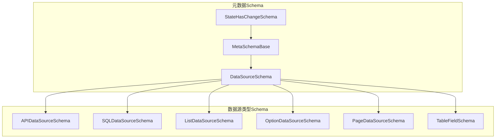
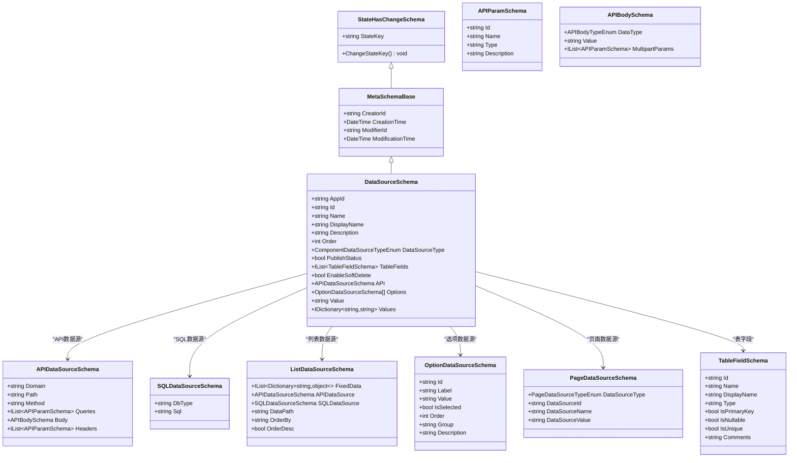
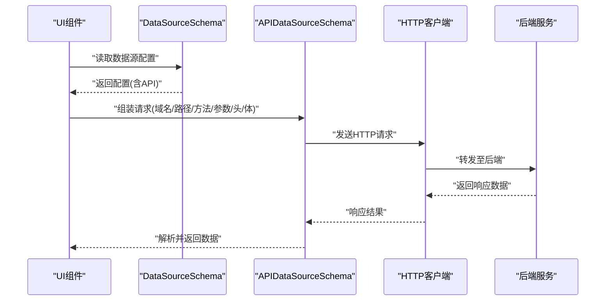
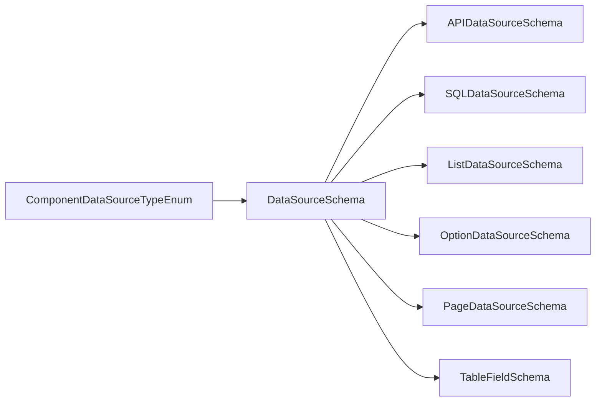

# 数据源Schema

<cite>
**本文引用的文件**   
- [DataSourceSchema.cs](file://src/LowCode/Common/H.LowCode.MetaSchema/DataSourceSchema.cs)
- [MetaSchemaBase.cs](file://src/LowCode/Common/H.LowCode.MetaSchema/MetaSchemaBase.cs)
- [StateHasChangeSchema.cs](file://src/LowCode/Common/H.LowCode.MetaSchema/StateHasChangeSchema.cs)
- [APIDataSourceSchema.cs](file://src/LowCode/Common/H.LowCode.MetaSchema/DataSourceSchemas/APIDataSourceSchema.cs)
- [SQLDataSourceSchema.cs](file://src/LowCode/Common/H.LowCode.MetaSchema/DataSourceSchemas/SQLDataSourceSchema.cs)
- [ListDataSourceSchema.cs](file://src/LowCode/Common/H.LowCode.MetaSchema/DataSourceSchemas/ListDataSourceSchema.cs)
- [OptionDataSourceSchema.cs](file://src/LowCode/Common/H.LowCode.MetaSchema/DataSourceSchemas/OptionDataSourceSchema.cs)
- [PageDataSourceSchema.cs](file://src/LowCode/Common/H.LowCode.MetaSchema/DataSourceSchemas/PageDataSourceSchema.cs)
- [TableFieldSchema.cs](file://src/LowCode/Common/H.LowCode.MetaSchema/DataSourceSchemas/TableFieldSchema.cs)
- [ComponentDataSourceTypeEnum.cs](file://src/LowCode/Common/H.LowCode.MetaSchema/Enums/ComponentDataSourceTypeEnum.cs)
</cite>

## 目录
1. [简介](#简介)
2. [项目结构](#项目结构)
3. [核心组件](#核心组件)
4. [架构总览](#架构总览)
5. [详细组件分析](#详细组件分析)
6. [依赖关系分析](#依赖关系分析)
7. [性能考虑](#性能考虑)
8. [故障排查指南](#故障排查指南)
9. [结论](#结论)
10. [附录：配置与最佳实践](#附录配置与最佳实践)

## 简介
本文件围绕低代码平台中的“数据源Schema系统”进行系统化文档化，重点阐述 DataSourceSchema 基类的设计与扩展机制，覆盖数据源的抽象定义、连接配置、查询执行机制（概念层面）、参数绑定、数据转换、缓存策略等高级特性。同时，对 API 数据源、SQL 数据源、列表数据源、选项数据源、页面数据源等进行详细说明，并提供自定义数据源类型的开发指南与实现示例路径，帮助开发者快速扩展新的数据源类型。

## 项目结构
数据源Schema相关代码集中在 LowCode 的 MetaSchema 模块中，采用“基础基类 + 具体Schema + 枚举类型”的分层组织方式：
- 基类与状态管理：MetaSchemaBase、StateHasChangeSchema
- 数据源根Schema：DataSourceSchema
- 具体数据源Schema：APIDataSourceSchema、SQLDataSourceSchema、ListDataSourceSchema、OptionDataSourceSchema、PageDataSourceSchema、TableFieldSchema
- 数据源类型枚举：ComponentDataSourceTypeEnum

图表来源
- [StateHasChangeSchema.cs:1-17](file://src/LowCode/Common/H.LowCode.MetaSchema/StateHasChangeSchema.cs#L1-L17)
- [MetaSchemaBase.cs:1-20](file://src/LowCode/Common/H.LowCode.MetaSchema/MetaSchemaBase.cs#L1-L20)
- [DataSourceSchema.cs:1-70](file://src/LowCode/Common/H.LowCode.MetaSchema/DataSourceSchema.cs#L1-L70)
- [APIDataSourceSchema.cs:1-65](file://src/LowCode/Common/H.LowCode.MetaSchema/DataSourceSchemas/APIDataSourceSchema.cs#L1-L65)
- [SQLDataSourceSchema.cs:1-19](file://src/LowCode/Common/H.LowCode.MetaSchema/DataSourceSchemas/SQLDataSourceSchema.cs#L1-L19)
- [ListDataSourceSchema.cs:1-51](file://src/LowCode/Common/H.LowCode.MetaSchema/DataSourceSchemas/ListDataSourceSchema.cs#L1-L51)
- [OptionDataSourceSchema.cs:1-34](file://src/LowCode/Common/H.LowCode.MetaSchema/DataSourceSchemas/OptionDataSourceSchema.cs#L1-L34)
- [PageDataSourceSchema.cs:1-18](file://src/LowCode/Common/H.LowCode.MetaSchema/DataSourceSchemas/PageDataSourceSchema.cs#L1-L18)
- [TableFieldSchema.cs:1-39](file://src/LowCode/Common/H.LowCode.MetaSchema/DataSourceSchemas/TableFieldSchema.cs#L1-L39)

章节来源
- [DataSourceSchema.cs:1-70](file://src/LowCode/Common/H.LowCode.MetaSchema/DataSourceSchema.cs#L1-L70)
- [MetaSchemaBase.cs:1-20](file://src/LowCode/Common/H.LowCode.MetaSchema/MetaSchemaBase.cs#L1-L20)
- [StateHasChangeSchema.cs:1-17](file://src/LowCode/Common/H.LowCode.MetaSchema/StateHasChangeSchema.cs#L1-L17)

## 核心组件
- StateHasChangeSchema：为所有Schema提供状态键（StateKey）与变更能力，便于渲染引擎触发更新。
- MetaSchemaBase：在状态基础上增加审计字段（创建者、创建时间、修改者、修改时间）。
- DataSourceSchema：数据源的核心元数据模型，包含标识、名称、显示名、描述、排序、发布状态、数据源类型以及按类型区分的配置片段（如API、SQL、选项、表字段等）。

关键要点
- 通过 ComponentDataSourceTypeEnum 区分不同数据源类型，并在 DataSourceSchema 中以条件属性承载对应配置。
- 使用 System.Text.Json 的 JsonPropertyName 控制序列化键名，保证前后端一致。
- 状态键由 ShortIdGenerator 生成，避免重复并支持按需刷新。

章节来源
- [StateHasChangeSchema.cs:1-17](file://src/LowCode/Common/H.LowCode.MetaSchema/StateHasChangeSchema.cs#L1-L17)
- [MetaSchemaBase.cs:1-20](file://src/LowCode/Common/H.LowCode.MetaSchema/MetaSchemaBase.cs#L1-L20)
- [DataSourceSchema.cs:1-70](file://src/LowCode/Common/H.LowCode.MetaSchema/DataSourceSchema.cs#L1-L70)
- [ComponentDataSourceTypeEnum.cs:1-21](file://src/LowCode/Common/H.LowCode.MetaSchema/Enums/ComponentDataSourceTypeEnum.cs#L1-L21)

## 架构总览
下图展示了数据源Schema的继承与组合关系，以及各类型Schema的职责边界。

图表来源
- [StateHasChangeSchema.cs:1-17](file://src/LowCode/Common/H.LowCode.MetaSchema/StateHasChangeSchema.cs#L1-L17)
- [MetaSchemaBase.cs:1-20](file://src/LowCode/Common/H.LowCode.MetaSchema/MetaSchemaBase.cs#L1-L20)
- [DataSourceSchema.cs:1-70](file://src/LowCode/Common/H.LowCode.MetaSchema/DataSourceSchema.cs#L1-L70)
- [APIDataSourceSchema.cs:1-65](file://src/LowCode/Common/H.LowCode.MetaSchema/DataSourceSchemas/APIDataSourceSchema.cs#L1-L65)
- [SQLDataSourceSchema.cs:1-19](file://src/LowCode/Common/H.LowCode.MetaSchema/DataSourceSchemas/SQLDataSourceSchema.cs#L1-L19)
- [ListDataSourceSchema.cs:1-51](file://src/LowCode/Common/H.LowCode.MetaSchema/DataSourceSchemas/ListDataSourceSchema.cs#L1-L51)
- [OptionDataSourceSchema.cs:1-34](file://src/LowCode/Common/H.LowCode.MetaSchema/DataSourceSchemas/OptionDataSourceSchema.cs#L1-L34)
- [PageDataSourceSchema.cs:1-18](file://src/LowCode/Common/H.LowCode.MetaSchema/DataSourceSchemas/PageDataSourceSchema.cs#L1-L18)
- [TableFieldSchema.cs:1-39](file://src/LowCode/Common/H.LowCode.MetaSchema/DataSourceSchemas/TableFieldSchema.cs#L1-L39)

## 详细组件分析

### DataSourceSchema 基类设计
- 职责：统一描述一个数据源的元信息（标识、名称、显示名、描述、排序、发布状态），并通过 DataSourceType 决定后续加载的具体配置片段。
- 扩展点：通过条件属性（API、Options、TableFields、Values、EnableSoftDelete）承载不同类型的数据源配置；新增类型时可在枚举中添加值并在该类中增加对应属性。
- 序列化：使用 JsonPropertyName 指定紧凑的JSON键名，减少体积并保持可读性。

章节来源
- [DataSourceSchema.cs:1-70](file://src/LowCode/Common/H.LowCode.MetaSchema/DataSourceSchema.cs#L1-L70)
- [ComponentDataSourceTypeEnum.cs:1-21](file://src/LowCode/Common/H.LowCode.MetaSchema/Enums/ComponentDataSourceTypeEnum.cs#L1-L21)

### API 数据源（APIDataSourceSchema）
- 用途：定义HTTP请求的域、路径、方法、查询参数、请求体与请求头。
- 请求体：支持多种类型（None、Json、Text、Multipart、Raw、Binary），其中 Multipart 支持多部分参数集合。
- 参数：Queries 与 Headers 均为参数数组，每个参数包含标识、名称、类型与描述。

章节来源
- [APIDataSourceSchema.cs:1-65](file://src/LowCode/Common/H.LowCode.MetaSchema/DataSourceSchemas/APIDataSourceSchema.cs#L1-L65)

### SQL 数据源（SQLDataSourceSchema）
- 用途：声明数据库类型与SQL语句，供渲染或应用层执行查询。
- 注意：实际执行需结合后端服务或ORM框架，此处仅负责配置描述。

章节来源
- [SQLDataSourceSchema.cs:1-19](file://src/LowCode/Common/H.LowCode.MetaSchema/DataSourceSchemas/SQLDataSourceSchema.cs#L1-L19)

### 列表数据源（ListDataSourceSchema）
- 用途：用于循环渲染场景，支持固定数据（设计时预览）、API/SQL数据源、响应路径提取、排序与倒序。
- 关键点：DataPath 用于从复杂响应中提取数组数据（例如 data.list）；OrderBy/OrderDesc 控制排序。

章节来源
- [ListDataSourceSchema.cs:1-51](file://src/LowCode/Common/H.LowCode.MetaSchema/DataSourceSchemas/ListDataSourceSchema.cs#L1-L51)

### 选项数据源（OptionDataSourceSchema）
- 用途：为下拉、单选、多选等组件提供静态选项集。
- 特点：支持分组、默认选中、排序与描述信息。

章节来源
- [OptionDataSourceSchema.cs:1-34](file://src/LowCode/Common/H.LowCode.MetaSchema/DataSourceSchemas/OptionDataSourceSchema.cs#L1-L34)

### 页面数据源（PageDataSourceSchema）
- 用途：描述页面级别的数据源引用（类型、ID、名称、值），常用于页面初始化或路由参数映射。

章节来源
- [PageDataSourceSchema.cs:1-18](file://src/LowCode/Common/H.LowCode.MetaSchema/DataSourceSchemas/PageDataSourceSchema.cs#L1-L18)

### 表字段（TableFieldSchema）
- 用途：描述数据表的字段元信息（名称、显示名、类型、主键、可空、唯一、注释），配合表数据源使用。

章节来源
- [TableFieldSchema.cs:1-39](file://src/LowCode/Common/H.LowCode.MetaSchema/DataSourceSchemas/TableFieldSchema.cs#L1-L39)

### 数据流时序（以API数据源为例）
以下序列图展示从组件发起请求到返回数据的典型流程（概念示意，非具体实现）：

图表来源
- [APIDataSourceSchema.cs:1-65](file://src/LowCode/Common/H.LowCode.MetaSchema/DataSourceSchemas/APIDataSourceSchema.cs#L1-L65)
- [DataSourceSchema.cs:1-70](file://src/LowCode/Common/H.LowCode.MetaSchema/DataSourceSchema.cs#L1-L70)

## 依赖关系分析
- 继承链：StateHasChangeSchema → MetaSchemaBase → DataSourceSchema
- 组合关系：DataSourceSchema 根据 DataSourceType 组合不同的具体Schema（API、SQL、List、Option、Page、TableFields）
- 枚举依赖：ComponentDataSourceTypeEnum 驱动类型分支逻辑

图表来源
- [ComponentDataSourceTypeEnum.cs:1-21](file://src/LowCode/Common/H.LowCode.MetaSchema/Enums/ComponentDataSourceTypeEnum.cs#L1-L21)
- [DataSourceSchema.cs:1-70](file://src/LowCode/Common/H.LowCode.MetaSchema/DataSourceSchema.cs#L1-L70)

章节来源
- [ComponentDataSourceTypeEnum.cs:1-21](file://src/LowCode/Common/H.LowCode.MetaSchema/Enums/ComponentDataSourceTypeEnum.cs#L1-L21)
- [DataSourceSchema.cs:1-70](file://src/LowCode/Common/H.LowCode.MetaSchema/DataSourceSchema.cs#L1-L70)

## 性能考虑
- 响应路径提取：ListDataSourceSchema.DataPath 应尽可能精确，避免深层嵌套导致的额外解析开销。
- 缓存策略：建议在调用层（HTTP客户端或服务端）对相同请求进行缓存（基于URL+参数哈希），以减少重复网络请求。
- 分页与限流：对于大数据量场景，优先在服务端分页，前端仅拉取必要数据。
- JSON序列化：使用紧凑键名（已实现）可降低传输体积，提升解析速度。
- 状态键管理：StateKey 可用于细粒度刷新，避免全量重渲染。

[本节为通用指导，不直接分析具体文件]

## 故障排查指南
- 数据源类型不匹配：检查 DataSourceType 是否与配置的Schema片段一致（例如类型为API但缺少API配置）。
- 响应路径错误：确认 DataPath 指向正确的数组节点，必要时打印原始响应进行定位。
- 参数缺失或类型错误：核对 API 参数的名称、类型与必填项，确保请求头与请求体格式正确。
- 状态未更新：若组件未刷新，检查 StateKey 是否变化，必要时调用 ChangeStateKey 强制重新渲染。
- 软删除影响：启用 EnableSoftDelete 后，查询结果可能过滤掉已删除记录，需在业务侧明确处理。

章节来源
- [ListDataSourceSchema.cs:1-51](file://src/LowCode/Common/H.LowCode.MetaSchema/DataSourceSchemas/ListDataSourceSchema.cs#L1-L51)
- [APIDataSourceSchema.cs:1-65](file://src/LowCode/Common/H.LowCode.MetaSchema/DataSourceSchemas/APIDataSourceSchema.cs#L1-L65)
- [StateHasChangeSchema.cs:1-17](file://src/LowCode/Common/H.LowCode.MetaSchema/StateHasChangeSchema.cs#L1-L17)
- [DataSourceSchema.cs:1-70](file://src/LowCode/Common/H.LowCode.MetaSchema/DataSourceSchema.cs#L1-L70)

## 结论
数据源Schema系统通过清晰的基类与类型化Schema设计，实现了灵活、可扩展的数据源抽象。借助统一的元数据模型与类型枚举，可以在不侵入业务逻辑的前提下，快速接入API、SQL、列表、选项等多种数据源。结合状态键管理与响应路径提取，能够高效支撑低代码平台的动态渲染需求。

[本节为总结性内容，不直接分析具体文件]

## 附录：配置与最佳实践

### 配置说明
- DataSourceSchema
  - 标识与命名：AppId、Id、Name、DisplayName、Description、Order、PublishStatus
  - 类型与片段：DataSourceType 决定 API、SQL、Options、TableFields、Values 等片段的可用性
  - 表数据源：TableFields 描述字段元信息；EnableSoftDelete 控制软删除行为
- APIDataSourceSchema
  - 请求配置：Domain、Path、Method
  - 参数与头：Queries、Headers
  - 请求体：Body.DataType（None/Json/Text/Multipart/Raw/Binary）、Body.Value、Body.MultipartParams
- SQLDataSourceSchema
  - 数据库类型：DbType
  - SQL语句：Sql
- ListDataSourceSchema
  - 固定数据：FixedData（设计时预览）
  - 数据源：APIDataSource、SQLDataSource
  - 响应路径：DataPath
  - 排序：OrderBy、OrderDesc
- OptionDataSourceSchema
  - 选项项：Label、Value、IsSelected、Order、Group、Description
- PageDataSourceSchema
  - 页面数据源：DataSourceType、DataSourceId、DataSourceName、DataSourceValue

章节来源
- [DataSourceSchema.cs:1-70](file://src/LowCode/Common/H.LowCode.MetaSchema/DataSourceSchema.cs#L1-L70)
- [APIDataSourceSchema.cs:1-65](file://src/LowCode/Common/H.LowCode.MetaSchema/DataSourceSchemas/APIDataSourceSchema.cs#L1-L65)
- [SQLDataSourceSchema.cs:1-19](file://src/LowCode/Common/H.LowCode.MetaSchema/DataSourceSchemas/SQLDataSourceSchema.cs#L1-L19)
- [ListDataSourceSchema.cs:1-51](file://src/LowCode/Common/H.LowCode.MetaSchema/DataSourceSchemas/ListDataSourceSchema.cs#L1-L51)
- [OptionDataSourceSchema.cs:1-34](file://src/LowCode/Common/H.LowCode.MetaSchema/DataSourceSchemas/OptionDataSourceSchema.cs#L1-L34)
- [PageDataSourceSchema.cs:1-18](file://src/LowCode/Common/H.LowCode.MetaSchema/DataSourceSchemas/PageDataSourceSchema.cs#L1-L18)

### 高级特性
- 参数绑定
  - API 参数：Queries 与 Headers 支持名称、类型与描述，便于校验与自动生成文档
  - 列表数据源：DataPath 支持点路径表达式，精准提取数组数据
- 数据转换
  - 建议在后端完成类型转换与格式化，前端仅做必要的展示转换
- 缓存策略
  - 基于请求指纹（URL+参数）进行缓存，设置合理的过期时间与失效策略
- 状态管理
  - 使用 StateKey 进行细粒度刷新，避免不必要的重渲染

章节来源
- [APIDataSourceSchema.cs:1-65](file://src/LowCode/Common/H.LowCode.MetaSchema/DataSourceSchemas/APIDataSourceSchema.cs#L1-L65)
- [ListDataSourceSchema.cs:1-51](file://src/LowCode/Common/H.LowCode.MetaSchema/DataSourceSchemas/ListDataSourceSchema.cs#L1-L51)
- [StateHasChangeSchema.cs:1-17](file://src/LowCode/Common/H.LowCode.MetaSchema/StateHasChangeSchema.cs#L1-L17)

### 自定义数据源类型开发指南
步骤
1. 扩展枚举：在 ComponentDataSourceTypeEnum 中新增类型值
2. 定义Schema：新建对应的 Schema 类（参考 APIDataSourceSchema、SQLDataSourceSchema）
3. 集成到基类：在 DataSourceSchema 中新增条件属性，承载新类型配置
4. 渲染/执行层：在渲染引擎或应用服务中根据 DataSourceType 分发处理逻辑
5. 测试验证：覆盖正常与异常路径，确保参数校验、错误处理与状态更新

示例路径
- 新增类型枚举：[ComponentDataSourceTypeEnum.cs:1-21](file://src/LowCode/Common/H.LowCode.MetaSchema/Enums/ComponentDataSourceTypeEnum.cs#L1-L21)
- 新增Schema类：参考 [APIDataSourceSchema.cs:1-65](file://src/LowCode/Common/H.LowCode.MetaSchema/DataSourceSchemas/APIDataSourceSchema.cs#L1-L65)、[SQLDataSourceSchema.cs:1-19](file://src/LowCode/Common/H.LowCode.MetaSchema/DataSourceSchemas/SQLDataSourceSchema.cs#L1-L19)
- 基类集成：参考 [DataSourceSchema.cs:1-70](file://src/LowCode/Common/H.LowCode.MetaSchema/DataSourceSchema.cs#L1-L70)

章节来源
- [ComponentDataSourceTypeEnum.cs:1-21](file://src/LowCode/Common/H.LowCode.MetaSchema/Enums/ComponentDataSourceTypeEnum.cs#L1-L21)
- [APIDataSourceSchema.cs:1-65](file://src/LowCode/Common/H.LowCode.MetaSchema/DataSourceSchemas/APIDataSourceSchema.cs#L1-L65)
- [SQLDataSourceSchema.cs:1-19](file://src/LowCode/Common/H.LowCode.MetaSchema/DataSourceSchemas/SQLDataSourceSchema.cs#L1-L19)
- [DataSourceSchema.cs:1-70](file://src/LowCode/Common/H.LowCode.MetaSchema/DataSourceSchema.cs#L1-L70)