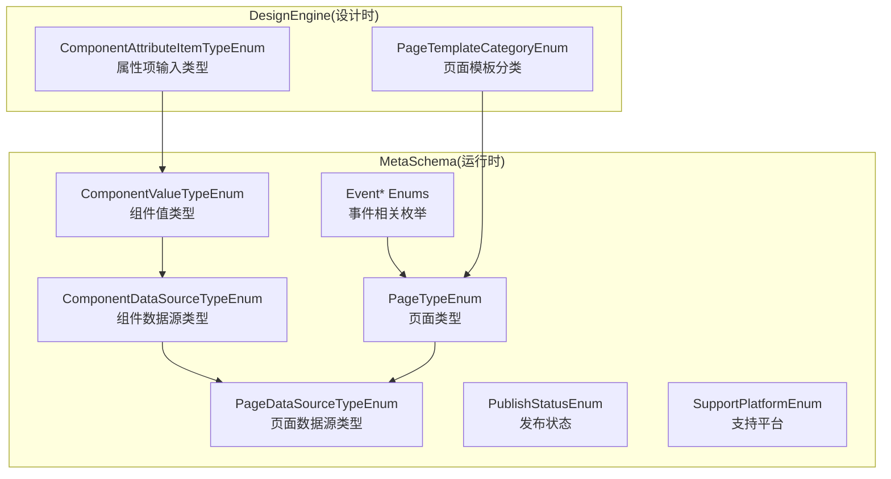
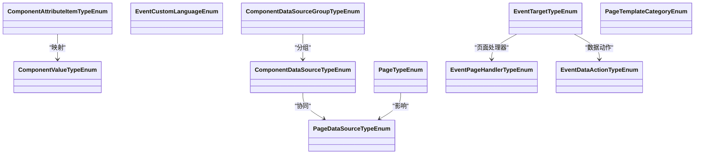
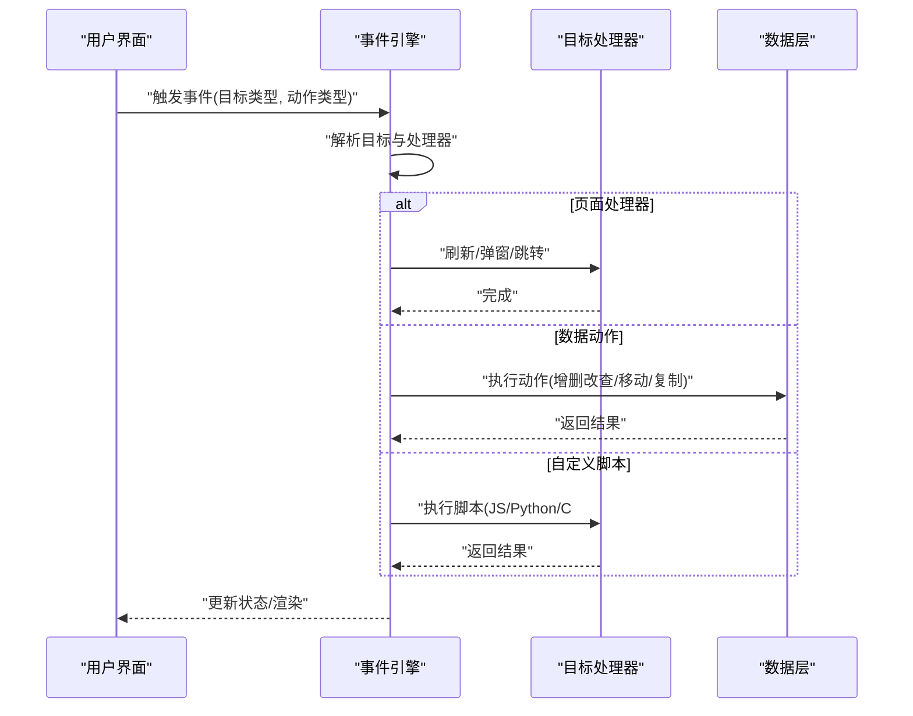
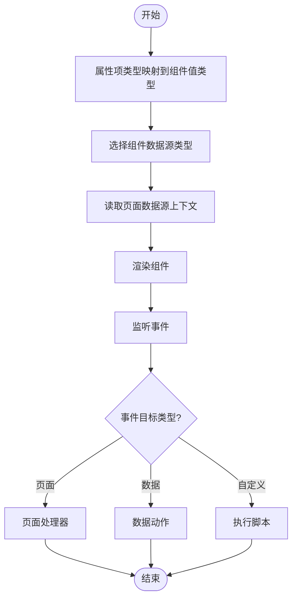

# 枚举和类型定义

<cite>
**本文引用的文件**   
- [ComponentValueTypeEnum.cs](file://src/LowCode/Common/H.LowCode.MetaSchema/Enums/ComponentValueTypeEnum.cs)
- [ComponentDataSourceTypeEnum.cs](file://src/LowCode/Common/H.LowCode.MetaSchema/Enums/ComponentDataSourceTypeEnum.cs)
- [PageTypeEnum.cs](file://src/LowCode/Common/H.LowCode.MetaSchema/Enums/PageTypeEnum.cs)
- [EventDataActionTypeEnum.cs](file://src/LowCode/Common/H.LowCode.MetaSchema/Enums/EventDataActionTypeEnum.cs)
- [EventTargetTypeEnum.cs](file://src/LowCode/Common/H.LowCode.MetaSchema/Enums/EventTargetTypeEnum.cs)
- [ComponentDataSourceGroupTypeEnum.cs](file://src/LowCode/Common/H.LowCode.MetaSchema/Enums/ComponentDataSourceGroupTypeEnum.cs)
- [PageDataSourceTypeEnum.cs](file://src/LowCode/Common/H.LowCode.MetaSchema/Enums/PageDataSourceTypeEnum.cs)
- [PublishStatusEnum.cs](file://src/LowCode/Common/H.LowCode.MetaSchema/Enums/PublishStatusEnum.cs)
- [SupportPlatformEnum.cs](file://src/LowCode/Common/H.LowCode.MetaSchema/Enums/SupportPlatformEnum.cs)
- [ComponentAttributeItemTypeEnum.cs](file://src/LowCode/Common/H.LowCode.MetaSchema.DesignEngine/Enums/ComponentAttributeItemTypeEnum.cs)
- [PageTemplateCategoryEnum.cs](file://src/LowCode/Common/H.LowCode.MetaSchema.DesignEngine/Enums/PageTemplateCategoryEnum.cs)
</cite>

## 目录
1. [简介](#简介)
2. [项目结构](#项目结构)
3. [核心组件](#核心组件)
4. [架构总览](#架构总览)
5. [详细组件分析](#详细组件分析)
6. [依赖关系分析](#依赖关系分析)
7. [性能考虑](#性能考虑)
8. [故障排查指南](#故障排查指南)
9. [结论](#结论)
10. [附录](#附录)

## 简介
本文件面向元数据系统的枚举与类型定义，系统性梳理并解释以下主题：
- 组件值类型、数据源类型、页面类型、事件类型等枚举的定义与使用场景
- 各枚举值的含义、适用范围与相互关系
- 类型映射机制与数据转换规则（设计时与运行时）
- 类型扩展开发指南与自定义类型的实现方法
- 类型使用的最佳实践与常见问题解决方案

## 项目结构
元数据相关的枚举主要分布在两个命名空间下：
- H.LowCode.MetaSchema：运行时与通用元数据模型相关的基础枚举
- H.LowCode.MetaSchema.DesignEngine：设计引擎侧的属性项类型与模板分类枚举

图表来源
- [ComponentValueTypeEnum.cs:9-26](file://src/LowCode/Common/H.LowCode.MetaSchema/Enums/ComponentValueTypeEnum.cs#L9-L26)
- [ComponentDataSourceTypeEnum.cs:12-21](file://src/LowCode/Common/H.LowCode.MetaSchema/Enums/ComponentDataSourceTypeEnum.cs#L12-L21)
- [PageTypeEnum.cs:10-20](file://src/LowCode/Common/H.LowCode.MetaSchema/Enums/PageTypeEnum.cs#L10-L20)
- [EventTargetTypeEnum.cs:5-29](file://src/LowCode/Common/H.LowCode.MetaSchema/Enums/EventTargetTypeEnum.cs#L5-L29)
- [EventDataActionTypeEnum.cs:5-19](file://src/LowCode/Common/H.LowCode.MetaSchema/Enums/EventDataActionTypeEnum.cs#L5-L19)
- [PageDataSourceTypeEnum.cs:12-18](file://src/LowCode/Common/H.LowCode.MetaSchema/Enums/PageDataSourceTypeEnum.cs#L12-L18)
- [PublishStatusEnum.cs:9-14](file://src/LowCode/Common/H.LowCode.MetaSchema/Enums/PublishStatusEnum.cs#L9-L14)
- [SupportPlatformEnum.cs:10-18](file://src/LowCode/Common/H.LowCode.MetaSchema/Enums/SupportPlatformEnum.cs#L10-L18)
- [ComponentAttributeItemTypeEnum.cs:9-22](file://src/LowCode/Common/H.LowCode.MetaSchema.DesignEngine/Enums/ComponentAttributeItemTypeEnum.cs#L9-L22)
- [PageTemplateCategoryEnum.cs:8-27](file://src/LowCode/Common/H.LowCode.MetaSchema.DesignEngine/Enums/PageTemplateCategoryEnum.cs#L8-L27)

章节来源
- [ComponentValueTypeEnum.cs:9-26](file://src/LowCode/Common/H.LowCode.MetaSchema/Enums/ComponentValueTypeEnum.cs#L9-L26)
- [ComponentDataSourceTypeEnum.cs:12-21](file://src/LowCode/Common/H.LowCode.MetaSchema/Enums/ComponentDataSourceTypeEnum.cs#L12-L21)
- [PageTypeEnum.cs:10-20](file://src/LowCode/Common/H.LowCode.MetaSchema/Enums/PageTypeEnum.cs#L10-L20)
- [EventTargetTypeEnum.cs:5-29](file://src/LowCode/Common/H.LowCode.MetaSchema/Enums/EventTargetTypeEnum.cs#L5-L29)
- [EventDataActionTypeEnum.cs:5-19](file://src/LowCode/Common/H.LowCode.MetaSchema/Enums/EventDataActionTypeEnum.cs#L5-L19)
- [ComponentDataSourceGroupTypeEnum.cs:12-19](file://src/LowCode/Common/H.LowCode.MetaSchema/Enums/ComponentDataSourceGroupTypeEnum.cs#L12-L19)
- [PageDataSourceTypeEnum.cs:12-18](file://src/LowCode/Common/H.LowCode.MetaSchema/Enums/PageDataSourceTypeEnum.cs#L12-L18)
- [PublishStatusEnum.cs:9-14](file://src/LowCode/Common/H.LowCode.MetaSchema/Enums/PublishStatusEnum.cs#L9-L14)
- [SupportPlatformEnum.cs:10-18](file://src/LowCode/Common/H.LowCode.MetaSchema/Enums/SupportPlatformEnum.cs#L10-L18)
- [ComponentAttributeItemTypeEnum.cs:9-22](file://src/LowCode/Common/H.LowCode.MetaSchema.DesignEngine/Enums/ComponentAttributeItemTypeEnum.cs#L9-L22)
- [PageTemplateCategoryEnum.cs:8-27](file://src/LowCode/Common/H.LowCode.MetaSchema.DesignEngine/Enums/PageTemplateCategoryEnum.cs#L8-L27)

## 核心组件
本节对关键枚举进行逐一说明，包括含义、典型使用范围与关联关系。

- 组件值类型 ComponentValueTypeEnum
  - 用途：描述组件绑定的数据字段值类型，用于序列化、校验与渲染策略选择
  - 常见值：字符串类（String/Textarea/Text）、数值类（Integer/Double/Decimal）、布尔（Boolean）、日期（Date）、集合类（Array/StringList/IntList）、结构化（Table/Tree）、选项（Option）
  - 关联：与设计时属性项类型 ComponentAttributeItemTypeEnum 存在映射关系（如 String→Input，Integer→InputNumber，Boolean→Switch/Radio，Date→Date，Table/Table 等）

- 组件数据源类型 ComponentDataSourceTypeEnum
  - 用途：指定组件数据来源，驱动不同的数据加载与绑定逻辑
  - 常见值：数据库(DB)、API接口(API)、静态选项(Option)、SQL查询(SQL)、表达式(Expression)、固定值(Fixed)
  - 关联：与页面级数据源 PageDataSourceTypeEnum 协同，前者聚焦组件粒度，后者聚焦页面维度

- 页面类型 PageTypeEnum
  - 用途：区分页面形态与默认布局/交互模式
  - 常见值：普通(Normal)、表单(Form)、列表(Table)、报表(Report)
  - 关联：影响页面数据源类型选择与事件处理默认行为

- 事件相关枚举
  - EventTargetTypeEnum：事件目标类别（页面、组件、数据操作、自定义）
  - EventPageHandlerTypeEnum：页面级事件处理器类型（刷新、弹窗、当前页、空白页）
  - EventCustomLanguageEnum：自定义事件脚本语言（JavaScript、Python、C#）
  - EventDataActionTypeEnum：数据动作（编辑行、删除行、保存行、取消编辑、添加行、刷新数据、上移、下移、复制行）

- 组件数据源分组 ComponentDataSourceGroupTypeEnum
  - 用途：将组件数据源按用途分组，便于设计器展示与筛选
  - 常见值：通用(General)、选项(Option)、表格(Table)、树(Tree)、列表(List)

- 页面数据源类型 PageDataSourceTypeEnum
  - 用途：页面级数据源类型（数据库、API），与组件级数据源形成层级关系

- 发布状态 PublishStatusEnum
  - 用途：应用或页面的生命周期状态（开发中、审批中、已发布）

- 支持平台 SupportPlatformEnum
  - 用途：标识可运行平台（Web、App、小程序）

- 设计引擎属性项类型 ComponentAttributeItemTypeEnum
  - 用途：设计器属性面板的输入控件类型，与组件值类型存在映射关系

- 页面模板分类 PageTemplateCategoryEnum
  - 用途：页面模板的分类（空白页、仪表盘、表单页、列表页、统计页、其他）

章节来源
- [ComponentValueTypeEnum.cs:9-26](file://src/LowCode/Common/H.LowCode.MetaSchema/Enums/ComponentValueTypeEnum.cs#L9-L26)
- [ComponentDataSourceTypeEnum.cs:12-21](file://src/LowCode/Common/H.LowCode.MetaSchema/Enums/ComponentDataSourceTypeEnum.cs#L12-L21)
- [PageTypeEnum.cs:10-20](file://src/LowCode/Common/H.LowCode.MetaSchema/Enums/PageTypeEnum.cs#L10-L20)
- [EventTargetTypeEnum.cs:5-29](file://src/LowCode/Common/H.LowCode.MetaSchema/Enums/EventTargetTypeEnum.cs#L5-L29)
- [EventDataActionTypeEnum.cs:5-19](file://src/LowCode/Common/H.LowCode.MetaSchema/Enums/EventDataActionTypeEnum.cs#L5-L19)
- [ComponentDataSourceGroupTypeEnum.cs:12-19](file://src/LowCode/Common/H.LowCode.MetaSchema/Enums/ComponentDataSourceGroupTypeEnum.cs#L12-L19)
- [PageDataSourceTypeEnum.cs:12-18](file://src/LowCode/Common/H.LowCode.MetaSchema/Enums/PageDataSourceTypeEnum.cs#L12-L18)
- [PublishStatusEnum.cs:9-14](file://src/LowCode/Common/H.LowCode.MetaSchema/Enums/PublishStatusEnum.cs#L9-L14)
- [SupportPlatformEnum.cs:10-18](file://src/LowCode/Common/H.LowCode.MetaSchema/Enums/SupportPlatformEnum.cs#L10-L18)
- [ComponentAttributeItemTypeEnum.cs:9-22](file://src/LowCode/Common/H.LowCode.MetaSchema.DesignEngine/Enums/ComponentAttributeItemTypeEnum.cs#L9-L22)
- [PageTemplateCategoryEnum.cs:8-27](file://src/LowCode/Common/H.LowCode.MetaSchema.DesignEngine/Enums/PageTemplateCategoryEnum.cs#L8-L27)

## 架构总览
下图展示了元数据类型在设计时与运行时的协作关系：设计器通过属性项类型生成配置，运行时根据组件值类型与数据源类型解析渲染与数据绑定；事件系统基于目标类型与动作类型驱动页面与组件行为。

图表来源
- [ComponentValueTypeEnum.cs:9-26](file://src/LowCode/Common/H.LowCode.MetaSchema/Enums/ComponentValueTypeEnum.cs#L9-L26)
- [ComponentDataSourceTypeEnum.cs:12-21](file://src/LowCode/Common/H.LowCode.MetaSchema/Enums/ComponentDataSourceTypeEnum.cs#L12-L21)
- [PageTypeEnum.cs:10-20](file://src/LowCode/Common/H.LowCode.MetaSchema/Enums/PageTypeEnum.cs#L10-L20)
- [PageDataSourceTypeEnum.cs:12-18](file://src/LowCode/Common/H.LowCode.MetaSchema/Enums/PageDataSourceTypeEnum.cs#L12-L18)
- [EventTargetTypeEnum.cs:5-29](file://src/LowCode/Common/H.LowCode.MetaSchema/Enums/EventTargetTypeEnum.cs#L5-L29)
- [EventDataActionTypeEnum.cs:5-19](file://src/LowCode/Common/H.LowCode.MetaSchema/Enums/EventDataActionTypeEnum.cs#L5-L19)
- [ComponentDataSourceGroupTypeEnum.cs:12-19](file://src/LowCode/Common/H.LowCode.MetaSchema/Enums/ComponentDataSourceGroupTypeEnum.cs#L12-L19)
- [ComponentAttributeItemTypeEnum.cs:9-22](file://src/LowCode/Common/H.LowCode.MetaSchema.DesignEngine/Enums/ComponentAttributeItemTypeEnum.cs#L9-L22)
- [PageTemplateCategoryEnum.cs:8-27](file://src/LowCode/Common/H.LowCode.MetaSchema.DesignEngine/Enums/PageTemplateCategoryEnum.cs#L8-L27)

## 详细组件分析

### 组件值类型 ComponentValueTypeEnum
- 语义与用途
  - 统一描述组件绑定的数据字段类型，贯穿序列化、校验、渲染与事件数据转换
- 典型值与适用场景
  - 文本类：String/Textarea/Text，适用于自由文本与富文本片段
  - 数值类：Integer/Double/Decimal，适用于度量与计算
  - 布尔：Boolean，开关与标记
  - 日期：Date，时间选择与格式化
  - 集合类：Array/StringList/IntList，多值与列表
  - 结构化：Table，二维表数据；Tree，层级结构
  - 选项：Option，下拉/单选等选择型数据
- 设计时映射建议
  - String→Input，Textarea→Textarea，Integer→InputNumber，Double/Decimal→InputNumber，Boolean→Switch/Radio，Date→Date，Table→Table，Tree→Select(树形)，Option→Select/Radio/Checkbox
- 运行时转换要点
  - 输入到值：根据类型进行强转与校验（如数字精度、日期格式）
  - 值到输出：序列化为JSON或UI显示格式（如日期本地化、小数位数）

章节来源
- [ComponentValueTypeEnum.cs:9-26](file://src/LowCode/Common/H.LowCode.MetaSchema/Enums/ComponentValueTypeEnum.cs#L9-L26)
- [ComponentAttributeItemTypeEnum.cs:9-22](file://src/LowCode/Common/H.LowCode.MetaSchema.DesignEngine/Enums/ComponentAttributeItemTypeEnum.cs#L9-L22)

### 组件数据源类型 ComponentDataSourceTypeEnum
- 语义与用途
  - 决定组件数据的获取方式与执行上下文
- 典型值与适用场景
  - DB：直接访问数据库实体或视图
  - API：调用远程服务接口
  - Option：静态选项集（字典、枚举映射）
  - SQL：执行SQL语句返回结果集
  - Expression：表达式求值（变量、函数、运算）
  - Fixed：固定常量值
- 与页面数据源的协作
  - 页面级数据源提供上下文（如分页、过滤参数），组件级数据源在上下文中取值

章节来源
- [ComponentDataSourceTypeEnum.cs:12-21](file://src/LowCode/Common/H.LowCode.MetaSchema/Enums/ComponentDataSourceTypeEnum.cs#L12-L21)
- [PageDataSourceTypeEnum.cs:12-18](file://src/LowCode/Common/H.LowCode.MetaSchema/Enums/PageDataSourceTypeEnum.cs#L12-L18)

### 页面类型 PageTypeEnum
- 语义与用途
  - 定义页面形态，影响默认布局、交互与数据源策略
- 典型值与适用场景
  - Normal：通用页面
  - Form：表单录入与提交
  - Table：列表展示与操作
  - Report：报表展示与导出

章节来源
- [PageTypeEnum.cs:10-20](file://src/LowCode/Common/H.LowCode.MetaSchema/Enums/PageTypeEnum.cs#L10-L20)

### 事件系统枚举
- EventTargetTypeEnum
  - None/页面/组件/数据操作/自定义
  - 用于路由事件到不同处理器
- EventPageHandlerTypeEnum
  - 刷新/弹窗/当前页/空白页，控制页面级响应行为
- EventCustomLanguageEnum
  - JavaScript/Python/C#，支持脚本化扩展
- EventDataActionTypeEnum
  - 行级操作（编辑/删除/保存/取消/添加）、数据刷新、列表项移动与复制

图表来源
- [EventTargetTypeEnum.cs:5-29](file://src/LowCode/Common/H.LowCode.MetaSchema/Enums/EventTargetTypeEnum.cs#L5-L29)
- [EventDataActionTypeEnum.cs:5-19](file://src/LowCode/Common/H.LowCode.MetaSchema/Enums/EventDataActionTypeEnum.cs#L5-L19)

章节来源
- [EventTargetTypeEnum.cs:5-29](file://src/LowCode/Common/H.LowCode.MetaSchema/Enums/EventTargetTypeEnum.cs#L5-L29)
- [EventDataActionTypeEnum.cs:5-19](file://src/LowCode/Common/H.LowCode.MetaSchema/Enums/EventDataActionTypeEnum.cs#L5-L19)

### 组件数据源分组 ComponentDataSourceGroupTypeEnum
- 语义与用途
  - 将组件数据源按用途分组，提升设计器易用性
- 典型值
  - General/Option/Table/Tree/List

章节来源
- [ComponentDataSourceGroupTypeEnum.cs:12-19](file://src/LowCode/Common/H.LowCode.MetaSchema/Enums/ComponentDataSourceGroupTypeEnum.cs#L12-L19)

### 页面数据源类型 PageDataSourceTypeEnum
- 语义与用途
  - 页面级数据源类型，通常与组件级数据源配合使用
- 典型值
  - DB/API

章节来源
- [PageDataSourceTypeEnum.cs:12-18](file://src/LowCode/Common/H.LowCode.MetaSchema/Enums/PageDataSourceTypeEnum.cs#L12-L18)

### 发布状态 PublishStatusEnum
- 语义与用途
  - 管理应用或页面的发布流程状态
- 典型值
  - Development/Approving/Published

章节来源
- [PublishStatusEnum.cs:9-14](file://src/LowCode/Common/H.LowCode.MetaSchema/Enums/PublishStatusEnum.cs#L9-L14)

### 支持平台 SupportPlatformEnum
- 语义与用途
  - 标识可运行平台，影响资源加载与兼容性
- 典型值
  - Web/Mobile/WXMiniApp

章节来源
- [SupportPlatformEnum.cs:10-18](file://src/LowCode/Common/H.LowCode.MetaSchema/Enums/SupportPlatformEnum.cs#L10-L18)

### 设计引擎属性项类型 ComponentAttributeItemTypeEnum
- 语义与用途
  - 设计器属性面板的输入控件类型，与组件值类型映射
- 典型值
  - Input/InputNumber/Radio/Checkbox/Select/Switch/Date/Textarea/Options/Table

章节来源
- [ComponentAttributeItemTypeEnum.cs:9-22](file://src/LowCode/Common/H.LowCode.MetaSchema.DesignEngine/Enums/ComponentAttributeItemTypeEnum.cs#L9-L22)

### 页面模板分类 PageTemplateCategoryEnum
- 语义与用途
  - 页面模板的分类，辅助快速创建页面骨架
- 典型值
  - Blank/Dashboard/Form/List/Statistic/Other

章节来源
- [PageTemplateCategoryEnum.cs:8-27](file://src/LowCode/Common/H.LowCode.MetaSchema.DesignEngine/Enums/PageTemplateCategoryEnum.cs#L8-L27)

## 依赖关系分析
- 设计时依赖
  - 属性项类型依赖组件值类型，以生成正确的编辑器控件
  - 页面模板分类依赖页面类型，以提供合适的初始布局
- 运行时依赖
  - 组件数据源类型依赖页面数据源类型提供的上下文
  - 事件系统依赖目标类型与动作类型，驱动页面与数据层行为

图表来源
- [ComponentAttributeItemTypeEnum.cs:9-22](file://src/LowCode/Common/H.LowCode.MetaSchema.DesignEngine/Enums/ComponentAttributeItemTypeEnum.cs#L9-L22)
- [ComponentValueTypeEnum.cs:9-26](file://src/LowCode/Common/H.LowCode.MetaSchema/Enums/ComponentValueTypeEnum.cs#L9-L26)
- [ComponentDataSourceTypeEnum.cs:12-21](file://src/LowCode/Common/H.LowCode.MetaSchema/Enums/ComponentDataSourceTypeEnum.cs#L12-L21)
- [PageDataSourceTypeEnum.cs:12-18](file://src/LowCode/Common/H.LowCode.MetaSchema/Enums/PageDataSourceTypeEnum.cs#L12-L18)
- [EventTargetTypeEnum.cs:5-29](file://src/LowCode/Common/H.LowCode.MetaSchema/Enums/EventTargetTypeEnum.cs#L5-L29)
- [EventDataActionTypeEnum.cs:5-19](file://src/LowCode/Common/H.LowCode.MetaSchema/Enums/EventDataActionTypeEnum.cs#L5-L19)

## 性能考虑
- 数据源选择
  - 优先使用缓存友好的数据源（如API聚合、SQL预取），减少频繁请求
  - 表达式数据源应避免复杂计算，必要时在后台预处理
- 值类型转换
  - 批量转换时使用一次性解析，避免重复格式化
  - 大数组与树结构注意懒加载与分页
- 事件处理
  - 高频事件去抖与节流，避免阻塞渲染
  - 自定义脚本执行需限制超时与资源占用

## 故障排查指南
- 值类型不匹配
  - 现象：输入校验失败或渲染异常
  - 排查：检查组件值类型与属性项类型映射是否正确，确认输入格式
- 数据源未生效
  - 现象：组件无数据或报错
  - 排查：确认组件数据源类型与页面数据源上下文是否一致，权限与网络是否正常
- 事件未触发或错误
  - 现象：点击无效或脚本执行失败
  - 排查：核对事件目标类型与处理器配置，检查脚本语言与语法
- 发布状态异常
  - 现象：页面不可用或版本不一致
  - 排查：检查发布流程状态机，确保审批通过后发布

## 结论
通过对元数据系统中枚举与类型的系统化梳理，可以清晰理解设计时与运行时的类型契约与数据流转路径。遵循本文的映射规则、转换策略与最佳实践，能够显著提升低代码平台的稳定性与可扩展性。

## 附录

### 类型映射与转换规则（建议）
- 设计时映射
  - 属性项类型 → 组件值类型（见“组件值类型”与“属性项类型”章节）
- 运行时转换
  - 输入 → 值类型：类型强转与校验（数字精度、日期格式、布尔规范化）
  - 值类型 → 输出：序列化与UI格式化（日期本地化、小数位数、集合展开）
- 数据源转换
  - 页面数据源上下文 → 组件数据源参数（分页、排序、过滤）
  - 组件数据源结果 → 组件值类型（字段映射、类型适配）

### 类型扩展开发指南
- 新增组件值类型
  - 在组件值类型枚举中添加新值
  - 在设计器属性项类型中补充对应输入控件
  - 在运行时增加序列化/反序列化与校验逻辑
- 新增数据源类型
  - 在组件/页面数据源枚举中添加新值
  - 实现数据获取适配器（如新的API协议或SQL方言）
  - 在渲染层适配数据结构
- 新增事件类型
  - 在事件目标类型或动作类型中添加新值
  - 实现对应的处理器或脚本执行器
  - 在UI层暴露相应的事件配置入口

### 最佳实践
- 保持枚举值稳定，避免破坏向后兼容
- 为每个枚举值提供清晰的文档与示例
- 在边界条件与非法输入处进行严格校验与友好提示
- 对大数据量与复杂结构采用懒加载与分页策略