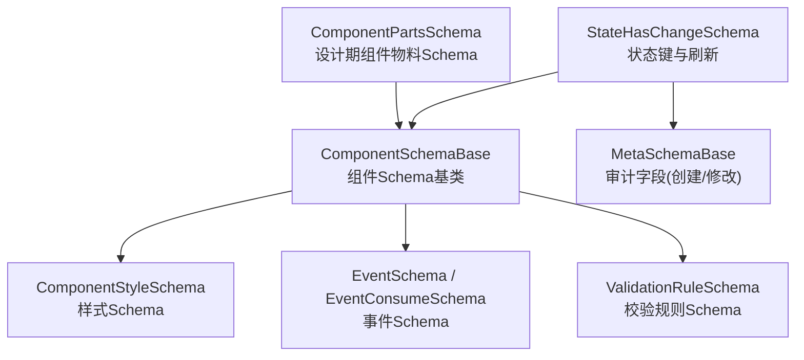
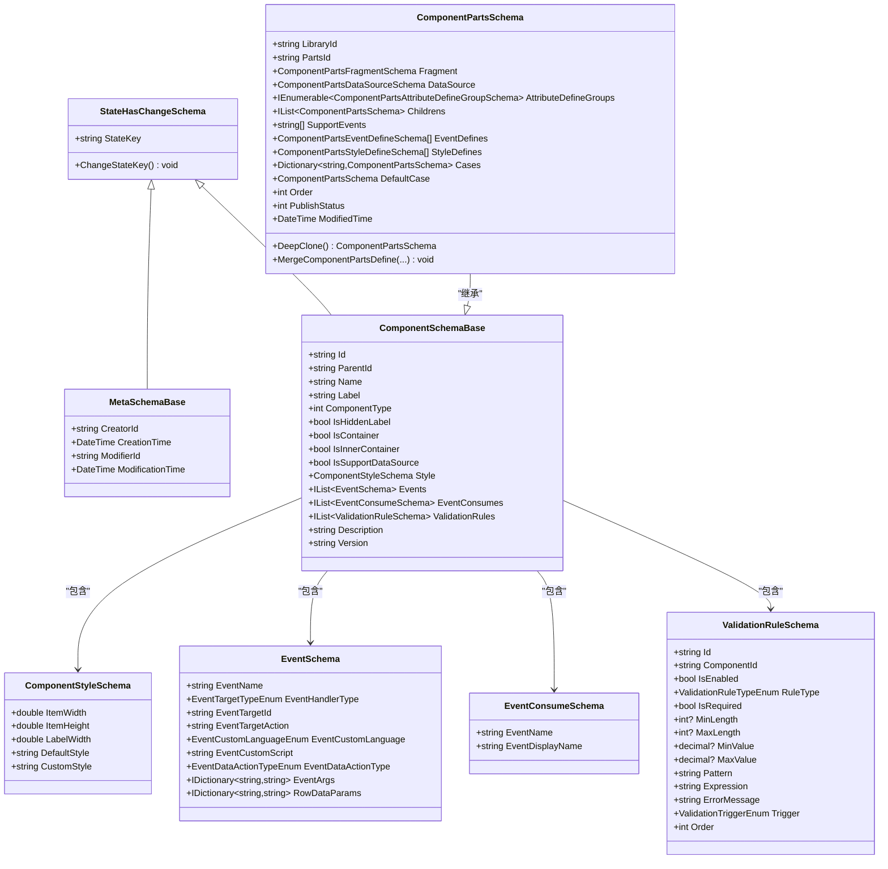
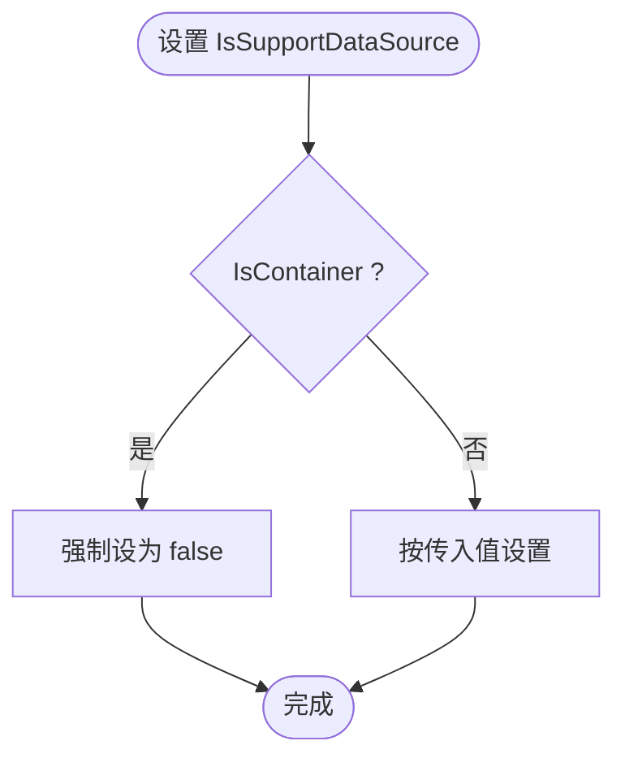
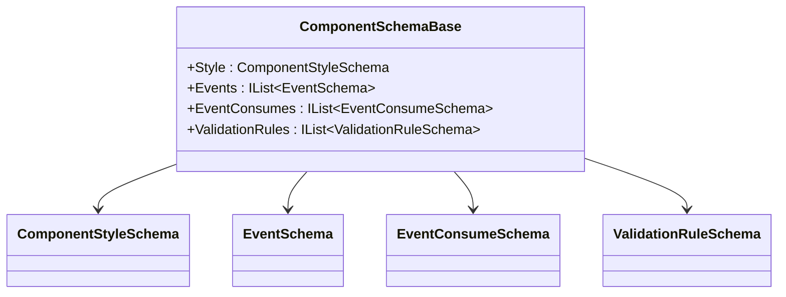
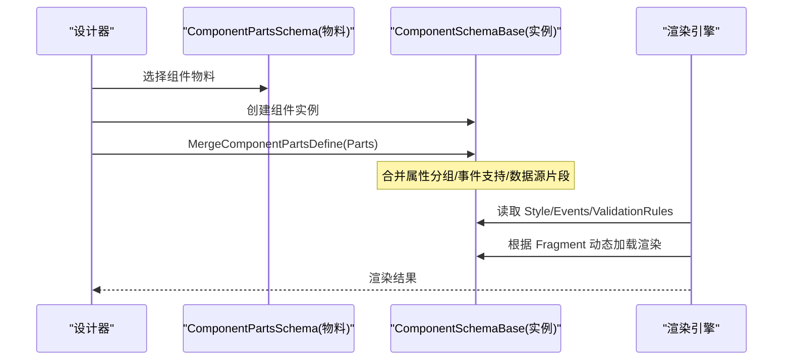
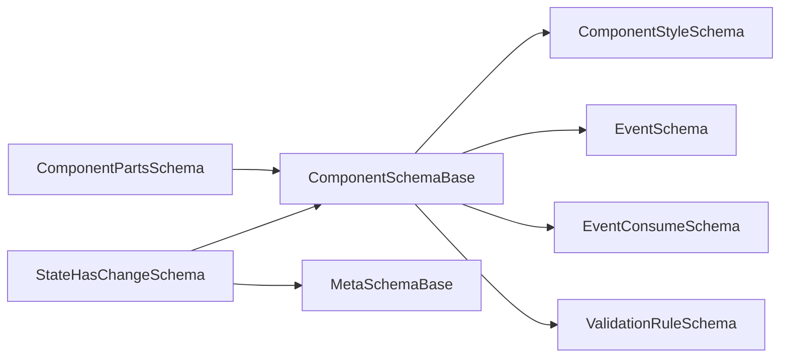

# 组件Schema基类

<cite>
**本文引用的文件**   
- [ComponentSchemaBase.cs](file://src/LowCode/Common/H.LowCode.MetaSchema/ComponentSchemaBase.cs)
- [StateHasChangeSchema.cs](file://src/LowCode/Common/H.LowCode.MetaSchema/StateHasChangeSchema.cs)
- [MetaSchemaBase.cs](file://src/LowCode/Common/H.LowCode.MetaSchema/MetaSchemaBase.cs)
- [ComponentStyleSchema.cs](file://src/LowCode/Common/H.LowCode.MetaSchema/PropertySchemas/ComponentStyleSchema.cs)
- [EventSchema.cs](file://src/LowCode/Common/H.LowCode.MetaSchema/PropertySchemas/EventSchema.cs)
- [ValidationRuleSchema.cs](file://src/LowCode/Common/H.LowCode.MetaSchema/PropertySchemas/ValidationRuleSchema.cs)
- [ComponentPartsSchema.cs](file://src/LowCode/Common/H.LowCode.MetaSchema.DesignEngine/ComponentPartsSchema.cs)
</cite>

## 目录
1. [简介](#简介)
2. [项目结构](#项目结构)
3. [核心组件](#核心组件)
4. [架构总览](#架构总览)
5. [详细组件分析](#详细组件分析)
6. [依赖关系分析](#依赖关系分析)
7. [性能考量](#性能考量)
8. [故障排查指南](#故障排查指南)
9. [结论](#结论)
10. [附录：自定义组件Schema开发指南](#附录自定义组件schema开发指南)

## 简介
本文件围绕“组件Schema基类”展开，系统性阐述 ComponentSchemaBase 的设计理念与核心能力，包括：
- 组件元数据的定义规范（标识、名称、类型、容器能力、版本等）
- 属性定义的继承机制（样式、事件、校验规则等）
- 片段组件的扩展能力（设计期物料定义、动态加载、合并策略）
- 组件属性的 Schema 结构（基础属性、样式属性、事件属性）
并提供自定义组件 Schema 的开发指南与最佳实践。

## 项目结构
与组件Schema相关的核心代码位于 LowCode 公共模块 MetaSchema 及其设计引擎扩展中：
- 元数据基类与状态刷新基类：StateHasChangeSchema、MetaSchemaBase
- 组件Schema基类：ComponentSchemaBase
- 属性Schema：ComponentStyleSchema、EventSchema、ValidationRuleSchema
- 设计期组件物料Schema：ComponentPartsSchema（用于描述组件“模板/物料”，支持片段Fragment、数据源、属性分组、事件定义、样式定义、条件分支等）

图表来源
- [StateHasChangeSchema.cs:1-17](file://src/LowCode/Common/H.LowCode.MetaSchema/StateHasChangeSchema.cs#L1-L17)
- [ComponentSchemaBase.cs:1-104](file://src/LowCode/Common/H.LowCode.MetaSchema/ComponentSchemaBase.cs#L1-L104)
- [MetaSchemaBase.cs:1-20](file://src/LowCode/Common/H.LowCode.MetaSchema/MetaSchemaBase.cs#L1-L20)
- [ComponentStyleSchema.cs:1-40](file://src/LowCode/Common/H.LowCode.MetaSchema/PropertySchemas/ComponentStyleSchema.cs#L1-L40)
- [EventSchema.cs:1-67](file://src/LowCode/Common/H.LowCode.MetaSchema/PropertySchemas/EventSchema.cs#L1-L67)
- [ValidationRuleSchema.cs:1-178](file://src/LowCode/Common/H.LowCode.MetaSchema/PropertySchemas/ValidationRuleSchema.cs#L1-L178)
- [ComponentPartsSchema.cs:1-230](file://src/LowCode/Common/H.LowCode.MetaSchema.DesignEngine/ComponentPartsSchema.cs#L1-L230)

章节来源
- [ComponentSchemaBase.cs:1-104](file://src/LowCode/Common/H.LowCode.MetaSchema/ComponentSchemaBase.cs#L1-L104)
- [StateHasChangeSchema.cs:1-17](file://src/LowCode/Common/H.LowCode.MetaSchema/StateHasChangeSchema.cs#L1-L17)
- [MetaSchemaBase.cs:1-20](file://src/LowCode/Common/H.LowCode.MetaSchema/MetaSchemaBase.cs#L1-L20)
- [ComponentStyleSchema.cs:1-40](file://src/LowCode/Common/H.LowCode.MetaSchema/PropertySchemas/ComponentStyleSchema.cs#L1-L40)
- [EventSchema.cs:1-67](file://src/LowCode/Common/H.LowCode.MetaSchema/PropertySchemas/EventSchema.cs#L1-L67)
- [ValidationRuleSchema.cs:1-178](file://src/LowCode/Common/H.LowCode.MetaSchema/PropertySchemas/ValidationRuleSchema.cs#L1-L178)
- [ComponentPartsSchema.cs:1-230](file://src/LowCode/Common/H.LowCode.MetaSchema.DesignEngine/ComponentPartsSchema.cs#L1-L230)

## 核心组件
- StateHasChangeSchema：为所有Schema提供不可序列化的状态键 StateKey，并支持 ChangeStateKey 刷新，便于渲染层触发更新。
- MetaSchemaBase：在StateHasChangeSchema基础上增加审计字段（创建者、创建时间、修改者、修改时间），适用于应用、页面、数据源等元数据。
- ComponentSchemaBase：组件Schema的抽象基类，承载实例级元数据、样式、事件、事件消费、校验规则、描述与版本；同时内置容器能力与数据源支持的约束逻辑。
- 属性Schema族：
  - ComponentStyleSchema：宽度、高度、标签宽度、默认/自定义样式等。
  - EventSchema / EventConsumeSchema：标准事件、自定义脚本、数据操作事件及参数映射。
  - ValidationRuleSchema：必填、长度、数值范围、正则、邮箱/手机/URL/身份证等内置规则，以及自定义表达式与触发时机。
- ComponentPartsSchema：设计期组件物料定义，包含片段Fragment、数据源、属性分组、子节点、支持的事件、事件定义、样式定义、条件分支、发布状态与设计期状态等，并提供深拷贝与合并策略。

章节来源
- [StateHasChangeSchema.cs:1-17](file://src/LowCode/Common/H.LowCode.MetaSchema/StateHasChangeSchema.cs#L1-L17)
- [MetaSchemaBase.cs:1-20](file://src/LowCode/Common/H.LowCode.MetaSchema/MetaSchemaBase.cs#L1-L20)
- [ComponentSchemaBase.cs:1-104](file://src/LowCode/Common/H.LowCode.MetaSchema/ComponentSchemaBase.cs#L1-L104)
- [ComponentStyleSchema.cs:1-40](file://src/LowCode/Common/H.LowCode.MetaSchema/PropertySchemas/ComponentStyleSchema.cs#L1-L40)
- [EventSchema.cs:1-67](file://src/LowCode/Common/H.LowCode.MetaSchema/PropertySchemas/EventSchema.cs#L1-L67)
- [ValidationRuleSchema.cs:1-178](file://src/LowCode/Common/H.LowCode.MetaSchema/PropertySchemas/ValidationRuleSchema.cs#L1-L178)
- [ComponentPartsSchema.cs:1-230](file://src/LowCode/Common/H.LowCode.MetaSchema.DesignEngine/ComponentPartsSchema.cs#L1-L230)

## 架构总览
下图展示了组件Schema体系的继承与组合关系，以及设计期与运行期的职责划分。

图表来源
- [StateHasChangeSchema.cs:1-17](file://src/LowCode/Common/H.LowCode.MetaSchema/StateHasChangeSchema.cs#L1-L17)
- [MetaSchemaBase.cs:1-20](file://src/LowCode/Common/H.LowCode.MetaSchema/MetaSchemaBase.cs#L1-L20)
- [ComponentSchemaBase.cs:1-104](file://src/LowCode/Common/H.LowCode.MetaSchema/ComponentSchemaBase.cs#L1-L104)
- [ComponentStyleSchema.cs:1-40](file://src/LowCode/Common/H.LowCode.MetaSchema/PropertySchemas/ComponentStyleSchema.cs#L1-L40)
- [EventSchema.cs:1-67](file://src/LowCode/Common/H.LowCode.MetaSchema/PropertySchemas/EventSchema.cs#L1-L67)
- [ValidationRuleSchema.cs:1-178](file://src/LowCode/Common/H.LowCode.MetaSchema/PropertySchemas/ValidationRuleSchema.cs#L1-L178)
- [ComponentPartsSchema.cs:1-230](file://src/LowCode/Common/H.LowCode.MetaSchema.DesignEngine/ComponentPartsSchema.cs#L1-L230)

## 详细组件分析

### ComponentSchemaBase 设计理念与核心功能
- 唯一标识与层级：Id 为实例唯一标识，ParentId 表示父节点，构成组件树。
- 命名与展示：Name 与 Label 分别用于程序识别与界面显示。
- 类型与容器能力：ComponentType 区分原子/组合；IsContainer/IsInnerContainer 控制是否为容器或内部容器。
- 数据源支持约束：IsSupportDataSource 在容器组件上强制为 false，避免容器误配数据源。
- 样式、事件、校验：通过 Style、Events、EventConsumes、ValidationRules 统一描述组件运行时行为与UI表现。
- 版本与描述：Version 与 Description 便于演进与文档化。

图表来源
- [ComponentSchemaBase.cs:53-73](file://src/LowCode/Common/H.LowCode.MetaSchema/ComponentSchemaBase.cs#L53-L73)

章节来源
- [ComponentSchemaBase.cs:1-104](file://src/LowCode/Common/H.LowCode.MetaSchema/ComponentSchemaBase.cs#L1-L104)

### 属性定义的继承机制
- 基础属性：Id、ParentId、Name、Label、ComponentType、IsHiddenLabel、IsContainer、IsInnerContainer、Version、Description。
- 样式属性：ComponentStyleSchema 提供布局尺寸与样式字符串，便于渲染器读取。
- 事件属性：EventSchema 描述事件名、目标、动作、自定义脚本、数据操作类型与参数映射；EventConsumeSchema 描述事件消费方。
- 校验规则：ValidationRuleSchema 提供多种内置规则与自定义表达式，支持多触发时机与排序。

图表来源
- [ComponentSchemaBase.cs:75-97](file://src/LowCode/Common/H.LowCode.MetaSchema/ComponentSchemaBase.cs#L75-L97)
- [ComponentStyleSchema.cs:1-40](file://src/LowCode/Common/H.LowCode.MetaSchema/PropertySchemas/ComponentStyleSchema.cs#L1-L40)
- [EventSchema.cs:1-67](file://src/LowCode/Common/H.LowCode.MetaSchema/PropertySchemas/EventSchema.cs#L1-L67)
- [ValidationRuleSchema.cs:1-178](file://src/LowCode/Common/H.LowCode.MetaSchema/PropertySchemas/ValidationRuleSchema.cs#L1-L178)

章节来源
- [ComponentSchemaBase.cs:1-104](file://src/LowCode/Common/H.LowCode.MetaSchema/ComponentSchemaBase.cs#L1-L104)
- [ComponentStyleSchema.cs:1-40](file://src/LowCode/Common/H.LowCode.MetaSchema/PropertySchemas/ComponentStyleSchema.cs#L1-L40)
- [EventSchema.cs:1-67](file://src/LowCode/Common/H.LowCode.MetaSchema/PropertySchemas/EventSchema.cs#L1-L67)
- [ValidationRuleSchema.cs:1-178](file://src/LowCode/Common/H.LowCode.MetaSchema/PropertySchemas/ValidationRuleSchema.cs#L1-L178)

### 片段组件的扩展能力与动态加载原理
- 片段（Fragment）：ComponentPartsSchema 中的 Fragment 字段用于描述组件渲染片段，配合设计期与运行期解析实现按需加载。
- 数据源（DataSource）：ComponentPartsSchema 提供 DataSource，允许组件绑定数据源以驱动渲染。
- 属性分组（AttributeDefineGroups）：将属性按组组织，便于设计器生成配置面板。
- 事件与样式定义：EventDefines 与 StyleDefines 描述组件对外暴露的能力，供设计器与渲染器使用。
- 条件分支（Cases/DefaultCase）：支持基于条件的动态渲染。
- 合并策略（MergeComponentPartsDefine）：将物料定义合并到实例，覆盖/新增属性分组、事件支持、数据源片段等。
- 深拷贝（DeepClone）：复制组件树并重新分配Id、父子关系与刷新回调，保证设计期操作的独立性。

图表来源
- [ComponentPartsSchema.cs:149-169](file://src/LowCode/Common/H.LowCode.MetaSchema.DesignEngine/ComponentPartsSchema.cs#L149-L169)
- [ComponentPartsSchema.cs:104-136](file://src/LowCode/Common/H.LowCode.MetaSchema.DesignEngine/ComponentPartsSchema.cs#L104-L136)
- [ComponentSchemaBase.cs:75-97](file://src/LowCode/Common/H.LowCode.MetaSchema/ComponentSchemaBase.cs#L75-L97)

章节来源
- [ComponentPartsSchema.cs:1-230](file://src/LowCode/Common/H.LowCode.MetaSchema.DesignEngine/ComponentPartsSchema.cs#L1-L230)

## 依赖关系分析
- 继承链：StateHasChangeSchema → ComponentSchemaBase；StateHasChangeSchema → MetaSchemaBase。
- 组合关系：ComponentSchemaBase 组合 ComponentStyleSchema、EventSchema、EventConsumeSchema、ValidationRuleSchema。
- 设计期扩展：ComponentPartsSchema 继承 ComponentSchemaBase，增强物料定义能力（Fragment、DataSource、属性分组、事件/样式定义、条件分支）。

图表来源
- [StateHasChangeSchema.cs:1-17](file://src/LowCode/Common/H.LowCode.MetaSchema/StateHasChangeSchema.cs#L1-L17)
- [ComponentSchemaBase.cs:1-104](file://src/LowCode/Common/H.LowCode.MetaSchema/ComponentSchemaBase.cs#L1-L104)
- [MetaSchemaBase.cs:1-20](file://src/LowCode/Common/H.LowCode.MetaSchema/MetaSchemaBase.cs#L1-L20)
- [ComponentPartsSchema.cs:1-230](file://src/LowCode/Common/H.LowCode.MetaSchema.DesignEngine/ComponentPartsSchema.cs#L1-L230)

章节来源
- [ComponentSchemaBase.cs:1-104](file://src/LowCode/Common/H.LowCode.MetaSchema/ComponentSchemaBase.cs#L1-L104)
- [ComponentPartsSchema.cs:1-230](file://src/LowCode/Common/H.LowCode.MetaSchema.DesignEngine/ComponentPartsSchema.cs#L1-L230)

## 性能考量
- 状态键刷新：StateHasChangeSchema 的 StateKey 可用于细粒度刷新，避免全量重渲染。
- 容器数据源限制：容器组件禁用数据源，减少不必要的绑定与计算开销。
- 深拷贝与递归：ComponentPartsSchema 的 DeepClone 会递归复制子节点，注意在大型组件树中谨慎使用。
- 合并策略：MergeComponentPartsDefine 仅对必要字段进行覆盖/新增，避免重复赋值带来的额外开销。

[本节为通用指导，不直接分析具体文件]

## 故障排查指南
- 容器组件无法设置数据源：检查 IsContainer 是否为 true，IsSupportDataSource 会被强制为 false。
- 事件未触发：确认 EventSchema 的 EventName、EventTargetId、EventTargetAction 是否正确，以及 EventConsumes 是否匹配。
- 校验规则无效：检查 ValidationRuleSchema 的 RuleType、Trigger、IsRequired 等字段是否符合预期。
- 样式不生效：核对 ComponentStyleSchema 的 ItemWidth/ItemHeight/LabelWidth 与 DefaultStyle/CustomStyle 的值。
- 设计期合并异常：查看 MergeComponentPartsDefine 的合并逻辑，确保 AttributeDefineGroups 的 GroupName 与 AttributeName 一致。

章节来源
- [ComponentSchemaBase.cs:53-73](file://src/LowCode/Common/H.LowCode.MetaSchema/ComponentSchemaBase.cs#L53-L73)
- [EventSchema.cs:1-67](file://src/LowCode/Common/H.LowCode.MetaSchema/PropertySchemas/EventSchema.cs#L1-L67)
- [ValidationRuleSchema.cs:1-178](file://src/LowCode/Common/H.LowCode.MetaSchema/PropertySchemas/ValidationRuleSchema.cs#L1-L178)
- [ComponentStyleSchema.cs:1-40](file://src/LowCode/Common/H.LowCode.MetaSchema/PropertySchemas/ComponentStyleSchema.cs#L1-L40)
- [ComponentPartsSchema.cs:149-169](file://src/LowCode/Common/H.LowCode.MetaSchema.DesignEngine/ComponentPartsSchema.cs#L149-L169)

## 结论
ComponentSchemaBase 作为组件Schema的基石，提供了统一的元数据、样式、事件与校验模型，并通过 StateHasChangeSchema 与 MetaSchemaBase 形成清晰的继承体系。结合 ComponentPartsSchema 的设计期能力，可实现组件片段的动态加载与灵活扩展，满足低代码平台对组件可配置性与可复用性的要求。

[本节为总结性内容，不直接分析具体文件]

## 附录：自定义组件Schema开发指南
- 步骤概览
  - 定义组件Schema：继承 ComponentSchemaBase，补充业务相关属性（如特定样式、事件、校验规则）。
  - 定义设计期物料：继承 ComponentPartsSchema，完善 Fragment、DataSource、AttributeDefineGroups、EventDefines、StyleDefines、Cases/DefaultCase 等。
  - 实现合并与克隆：利用 MergeComponentPartsDefine 与 DeepClone 保障设计期与运行期的一致性。
  - 注册与加载：在渲染引擎中根据 Fragment 动态加载组件，读取 Style/Events/ValidationRules 进行渲染与交互。
- 最佳实践
  - 明确组件类型与容器能力：合理设置 ComponentType、IsContainer、IsInnerContainer。
  - 事件命名规范：保持 EventName 的唯一性与可读性，必要时提供 EventDisplayName。
  - 校验规则最小化：优先使用内置规则，复杂场景再引入自定义表达式。
  - 样式解耦：尽量使用 ItemWidth/ItemHeight/LabelWidth 与 DefaultStyle/CustomStyle 分离布局与外观。
  - 版本管理：维护 Version 字段，便于向后兼容与迁移。
- 参考路径
  - 组件Schema基类：[ComponentSchemaBase.cs:1-104](file://src/LowCode/Common/H.LowCode.MetaSchema/ComponentSchemaBase.cs#L1-L104)
  - 设计期组件物料：[ComponentPartsSchema.cs:1-230](file://src/LowCode/Common/H.LowCode.MetaSchema.DesignEngine/ComponentPartsSchema.cs#L1-L230)
  - 样式Schema：[ComponentStyleSchema.cs:1-40](file://src/LowCode/Common/H.LowCode.MetaSchema/PropertySchemas/ComponentStyleSchema.cs#L1-L40)
  - 事件Schema：[EventSchema.cs:1-67](file://src/LowCode/Common/H.LowCode.MetaSchema/PropertySchemas/EventSchema.cs#L1-L67)
  - 校验规则Schema：[ValidationRuleSchema.cs:1-178](file://src/LowCode/Common/H.LowCode.MetaSchema/PropertySchemas/ValidationRuleSchema.cs#L1-L178)

章节来源
- [ComponentSchemaBase.cs:1-104](file://src/LowCode/Common/H.LowCode.MetaSchema/ComponentSchemaBase.cs#L1-L104)
- [ComponentPartsSchema.cs:1-230](file://src/LowCode/Common/H.LowCode.MetaSchema.DesignEngine/ComponentPartsSchema.cs#L1-L230)
- [ComponentStyleSchema.cs:1-40](file://src/LowCode/Common/H.LowCode.MetaSchema/PropertySchemas/ComponentStyleSchema.cs#L1-L40)
- [EventSchema.cs:1-67](file://src/LowCode/Common/H.LowCode.MetaSchema/PropertySchemas/EventSchema.cs#L1-L67)
- [ValidationRuleSchema.cs:1-178](file://src/LowCode/Common/H.LowCode.MetaSchema/PropertySchemas/ValidationRuleSchema.cs#L1-L178)