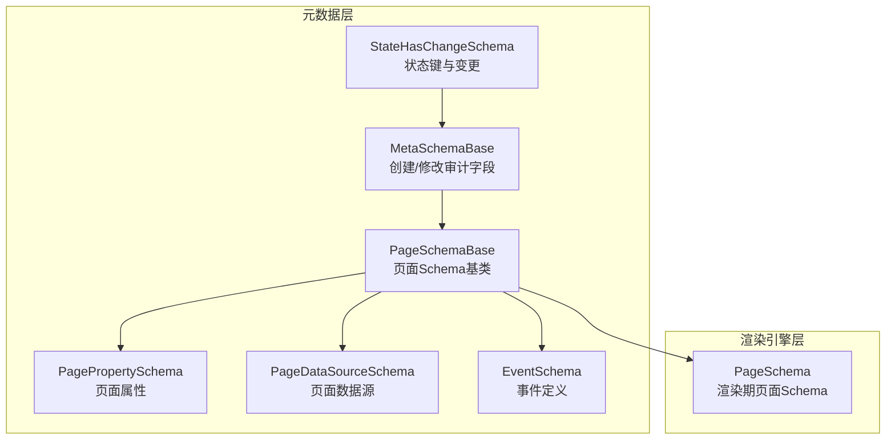
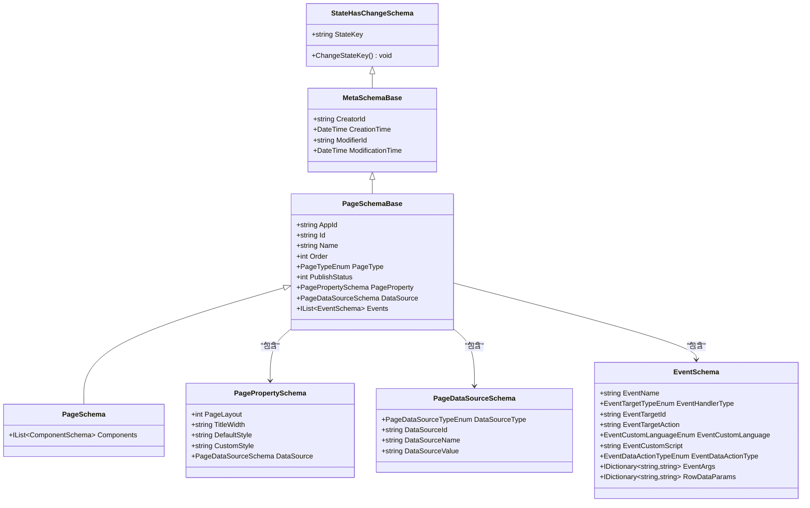
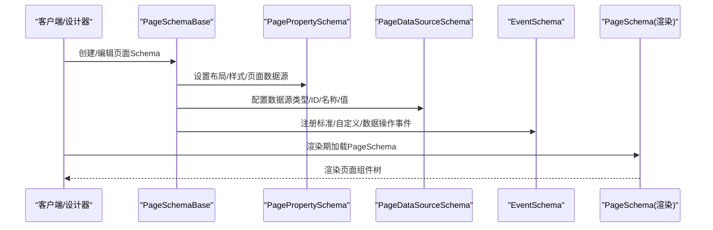

# 页面Schema基类

<cite>
**本文引用的文件**   
- [PageSchemaBase.cs](file://src/LowCode/Common/H.LowCode.MetaSchema/PageSchemaBase.cs)
- [PageSchema.cs](file://src/LowCode/Common/H.LowCode.MetaSchema.RenderEngine/PageSchema.cs)
- [MetaSchemaBase.cs](file://src/LowCode/Common/H.LowCode.MetaSchema/MetaSchemaBase.cs)
- [StateHasChangeSchema.cs](file://src/LowCode/Common/H.LowCode.MetaSchema/StateHasChangeSchema.cs)
- [PagePropertySchema.cs](file://src/LowCode/Common/H.LowCode.MetaSchema/PropertySchemas/PagePropertySchema.cs)
- [PageDataSourceSchema.cs](file://src/LowCode/Common/H.LowCode.MetaSchema/DataSourceSchemas/PageDataSourceSchema.cs)
- [EventSchema.cs](file://src/LowCode/Common/H.LowCode.MetaSchema/PropertySchemas/EventSchema.cs)
- [PageTypeEnum.cs](file://src/LowCode/Common/H.LowCode.MetaSchema/Enums/PageTypeEnum.cs)
</cite>

## 目录
1. [简介](#简介)
2. [项目结构](#项目结构)
3. [核心组件](#核心组件)
4. [架构总览](#架构总览)
5. [详细组件分析](#详细组件分析)
6. [依赖关系分析](#依赖关系分析)
7. [性能考虑](#性能考虑)
8. [故障排查指南](#故障排查指南)
9. [结论](#结论)
10. [附录](#附录)

## 简介
本文件围绕“页面Schema基类”展开，系统性阐述 PageSchemaBase 的设计理念与实现要点，包括：
- 页面元数据模型（标识、名称、排序、类型、发布状态等）
- 页面属性定义（布局、标题宽度、默认/自定义样式、页面级数据源）
- 事件机制（标准事件、自定义脚本、数据操作事件）
- 状态管理机制（基于 StateKey 的响应式更新触发）
- 渲染期扩展（在渲染引擎中为页面注入组件集合）
- 页面模板与自定义页面类型的开发规范与集成方法

该文档旨在帮助开发者快速理解并正确使用页面Schema进行低代码页面的建模、配置与渲染。

## 项目结构
与页面Schema相关的核心文件位于 LowCode 公共模块与渲染引擎模块中，层次清晰、职责单一：
- MetaSchema 层：定义通用元数据基类、状态键、页面Schema基类及属性/数据源/事件等子Schema
- RenderEngine 层：在渲染期对页面Schema进行扩展（如组件集合）
- Enums 层：枚举定义（如页面类型、事件目标类型、数据源类型等）

图表来源 
- [StateHasChangeSchema.cs:1-17](file://src/LowCode/Common/H.LowCode.MetaSchema/StateHasChangeSchema.cs#L1-L17)
- [MetaSchemaBase.cs:1-20](file://src/LowCode/Common/H.LowCode.MetaSchema/MetaSchemaBase.cs#L1-L20)
- [PageSchemaBase.cs:1-40](file://src/LowCode/Common/H.LowCode.MetaSchema/PageSchemaBase.cs#L1-L40)
- [PagePropertySchema.cs:1-38](file://src/LowCode/Common/H.LowCode.MetaSchema/PropertySchemas/PagePropertySchema.cs#L1-L38)
- [PageDataSourceSchema.cs:1-18](file://src/LowCode/Common/H.LowCode.MetaSchema/DataSourceSchemas/PageDataSourceSchema.cs#L1-L18)
- [EventSchema.cs:1-67](file://src/LowCode/Common/H.LowCode.MetaSchema/PropertySchemas/EventSchema.cs#L1-L67)
- [PageSchema.cs:1-10](file://src/LowCode/Common/H.LowCode.MetaSchema.RenderEngine/PageSchema.cs#L1-L10)

章节来源
- [PageSchemaBase.cs:1-40](file://src/LowCode/Common/H.LowCode.MetaSchema/PageSchemaBase.cs#L1-L40)
- [PageSchema.cs:1-10](file://src/LowCode/Common/H.LowCode.MetaSchema.RenderEngine/PageSchema.cs#L1-L10)
- [MetaSchemaBase.cs:1-20](file://src/LowCode/Common/H.LowCode.MetaSchema/MetaSchemaBase.cs#L1-L20)
- [StateHasChangeSchema.cs:1-17](file://src/LowCode/Common/H.LowCode.MetaSchema/StateHasChangeSchema.cs#L1-L17)
- [PagePropertySchema.cs:1-38](file://src/LowCode/Common/H.LowCode.MetaSchema/PropertySchemas/PagePropertySchema.cs#L1-L38)
- [PageDataSourceSchema.cs:1-18](file://src/LowCode/Common/H.LowCode.MetaSchema/DataSourceSchemas/PageDataSourceSchema.cs#L1-L18)
- [EventSchema.cs:1-67](file://src/LowCode/Common/H.LowCode.MetaSchema/PropertySchemas/EventSchema.cs#L1-L67)

## 核心组件
- 状态键基类 StateHasChangeSchema：提供不可序列化的 StateKey 与变更方法 ChangeStateKey，用于驱动UI响应式更新
- 元数据基类 MetaSchemaBase：统一维护创建者、创建时间、修改者、修改时间等审计字段
- 页面Schema基类 PageSchemaBase：承载页面元数据、属性、数据源、事件等核心配置
- 渲染期页面Schema PageSchema：在渲染阶段为页面注入组件列表，完成页面内容组装
- 页面属性 PagePropertySchema：定义页面布局、标题宽度、默认/自定义样式、页面级数据源
- 页面数据源 PageDataSourceSchema：描述数据源类型、ID、名称与值
- 事件 EventSchema：支持标准事件、自定义脚本、数据操作三类事件，并提供参数映射

章节来源
- [StateHasChangeSchema.cs:1-17](file://src/LowCode/Common/H.LowCode.MetaSchema/StateHasChangeSchema.cs#L1-L17)
- [MetaSchemaBase.cs:1-20](file://src/LowCode/Common/H.LowCode.MetaSchema/MetaSchemaBase.cs#L1-L20)
- [PageSchemaBase.cs:1-40](file://src/LowCode/Common/H.LowCode.MetaSchema/PageSchemaBase.cs#L1-L40)
- [PageSchema.cs:1-10](file://src/LowCode/Common/H.LowCode.MetaSchema.RenderEngine/PageSchema.cs#L1-L10)
- [PagePropertySchema.cs:1-38](file://src/LowCode/Common/H.LowCode.MetaSchema/PropertySchemas/PagePropertySchema.cs#L1-L38)
- [PageDataSourceSchema.cs:1-18](file://src/LowCode/Common/H.LowCode.MetaSchema/DataSourceSchemas/PageDataSourceSchema.cs#L1-L18)
- [EventSchema.cs:1-67](file://src/LowCode/Common/H.LowCode.MetaSchema/PropertySchemas/EventSchema.cs#L1-L67)

## 架构总览
下图展示从基类到具体页面Schema的继承与组合关系，以及JSON序列化键名约定。

图表来源 
- [StateHasChangeSchema.cs:1-17](file://src/LowCode/Common/H.LowCode.MetaSchema/StateHasChangeSchema.cs#L1-L17)
- [MetaSchemaBase.cs:1-20](file://src/LowCode/Common/H.LowCode.MetaSchema/MetaSchemaBase.cs#L1-L20)
- [PageSchemaBase.cs:1-40](file://src/LowCode/Common/H.LowCode.MetaSchema/PageSchemaBase.cs#L1-L40)
- [PageSchema.cs:1-10](file://src/LowCode/Common/H.LowCode.MetaSchema.RenderEngine/PageSchema.cs#L1-L10)
- [PagePropertySchema.cs:1-38](file://src/LowCode/Common/H.LowCode.MetaSchema/PropertySchemas/PagePropertySchema.cs#L1-L38)
- [PageDataSourceSchema.cs:1-18](file://src/LowCode/Common/H.LowCode.MetaSchema/DataSourceSchemas/PageDataSourceSchema.cs#L1-L18)
- [EventSchema.cs:1-67](file://src/LowCode/Common/H.LowCode.MetaSchema/PropertySchemas/EventSchema.cs#L1-L67)

## 详细组件分析

### 页面Schema基类 PageSchemaBase
- 设计理念
  - 以最小必要元数据为核心，支撑页面在设计与渲染阶段的统一建模
  - 通过 JSON 属性名映射（如 aid、id、n、order、pt、pub、pageprop、ds、evs）保证前后端一致性与紧凑性
  - 将页面属性、数据源、事件解耦为独立Schema，便于扩展与维护
- 关键属性
  - 应用标识 AppId、页面标识 Id、名称 Name、排序 Order
  - 页面类型 PageType（由枚举控制）、发布状态 PublishStatus
  - 页面属性 PageProperty（布局、样式、页面数据源）
  - 页面数据源 DataSource（数据源类型、ID、名称、值）
  - 事件 Events（标准事件、自定义脚本、数据操作事件）
- 使用建议
  - 在设计器中生成或编辑时，确保 Id 唯一且稳定；如需强制刷新UI，可调用父类的 ChangeStateKey
  - 发布流程应校验 PublishStatus 与权限策略（由上层业务决定）

章节来源
- [PageSchemaBase.cs:1-40](file://src/LowCode/Common/H.LowCode.MetaSchema/PageSchemaBase.cs#L1-L40)

### 渲染期页面Schema PageSchema
- 设计目的
  - 在渲染阶段为页面注入组件集合 Components，形成最终可渲染的页面结构
- 与基类关系
  - 继承自 PageSchemaBase，复用所有元数据与配置能力
- 集成方式
  - 渲染引擎根据路由或页面标识加载 PageSchema，再结合主题与布局渲染组件树

章节来源
- [PageSchema.cs:1-10](file://src/LowCode/Common/H.LowCode.MetaSchema.RenderEngine/PageSchema.cs#L1-L10)

### 状态管理 StateHasChangeSchema
- 作用
  - 为每个Schema实例分配唯一 StateKey，并在需要时通过 ChangeStateKey 触发UI重新渲染
- 特性
  - StateKey 不参与序列化（JsonIgnore），避免污染持久化数据
  - 适合用于页面/组件级局部刷新场景

章节来源
- [StateHasChangeSchema.cs:1-17](file://src/LowCode/Common/H.LowCode.MetaSchema/StateHasChangeSchema.cs#L1-L17)

### 元数据审计 MetaSchemaBase
- 作用
  - 统一记录创建者、创建时间、修改者、修改时间，满足审计与追溯需求
- 适用性
  - 所有页面、组件、模板等元数据均可继承以获得一致的审计能力

章节来源
- [MetaSchemaBase.cs:1-20](file://src/LowCode/Common/H.LowCode.MetaSchema/MetaSchemaBase.cs#L1-L20)

### 页面属性 PagePropertySchema
- 布局设置
  - PageLayout：支持一列至四列布局（数值型）
- 标题与样式
  - TitleWidth：标题宽度（字符串，通常表示百分比或栅格单位）
  - DefaultStyle：默认样式（CSS字符串）
  - CustomStyle：自定义样式（CSS字符串）
- 页面数据源
  - DataSource：页面级数据源配置，供页面生命周期或全局变量使用

章节来源
- [PagePropertySchema.cs:1-38](file://src/LowCode/Common/H.LowCode.MetaSchema/PropertySchemas/PagePropertySchema.cs#L1-L38)

### 页面数据源 PageDataSourceSchema
- 字段说明
  - DataSourceType：数据源类型（枚举）
  - DataSourceId：数据源唯一标识
  - DataSourceName：数据源显示名称
  - DataSourceValue：数据源值（通常为JSON字符串或连接串）
- 使用场景
  - 页面初始化加载、定时刷新、跨组件共享数据等

章节来源
- [PageDataSourceSchema.cs:1-18](file://src/LowCode/Common/H.LowCode.MetaSchema/DataSourceSchemas/PageDataSourceSchema.cs#L1-L18)

### 事件 EventSchema
- 标准事件
  - EventTargetId：目标对象ID（页面或组件）
  - EventTargetAction：目标动作（如打开弹窗、跳转路由等）
- 自定义脚本
  - EventCustomLanguage：脚本语言类型
  - EventCustomScript：脚本内容
- 数据操作事件
  - EventDataActionType：数据操作类型（增删改查等）
- 参数映射
  - EventArgs：事件参数键值对
  - RowDataParams：行数据字段到URL参数的映射

章节来源
- [EventSchema.cs:1-67](file://src/LowCode/Common/H.LowCode.MetaSchema/PropertySchemas/EventSchema.cs#L1-L67)

### 页面类型 PageTypeEnum
- 用途
  - 区分页面类型（如普通页、表单页、列表页、仪表盘等），影响渲染与交互行为
- 扩展建议
  - 新增页面类型时，需同步完善渲染引擎与事件处理逻辑

章节来源
- [PageTypeEnum.cs](file://src/LowCode/Common/H.LowCode.MetaSchema/Enums/PageTypeEnum.cs)

## 依赖关系分析
- 继承链
  - StateHasChangeSchema → MetaSchemaBase → PageSchemaBase → PageSchema
- 组合关系
  - PageSchemaBase 组合 PagePropertySchema、PageDataSourceSchema、EventSchema
- 序列化约定
  - 通过 JsonPropertyName 指定紧凑的键名，降低传输体积并保持一致性

图表来源 
- [PageSchemaBase.cs:1-40](file://src/LowCode/Common/H.LowCode.MetaSchema/PageSchemaBase.cs#L1-L40)
- [PagePropertySchema.cs:1-38](file://src/LowCode/Common/H.LowCode.MetaSchema/PropertySchemas/PagePropertySchema.cs#L1-L38)
- [PageDataSourceSchema.cs:1-18](file://src/LowCode/Common/H.LowCode.MetaSchema/DataSourceSchemas/PageDataSourceSchema.cs#L1-L18)
- [EventSchema.cs:1-67](file://src/LowCode/Common/H.LowCode.MetaSchema/PropertySchemas/EventSchema.cs#L1-L67)
- [PageSchema.cs:1-10](file://src/LowCode/Common/H.LowCode.MetaSchema.RenderEngine/PageSchema.cs#L1-L10)

## 性能考虑
- 状态键刷新
  - 仅在必要时调用 ChangeStateKey，避免频繁重建导致重绘开销
- 数据源选择
  - 合理选择数据源类型与缓存策略，减少重复请求
- 事件处理
  - 避免在高频事件中执行重型计算，必要时做节流/防抖
- 序列化体积
  - 利用紧凑的JSON键名与按需填充字段，降低网络传输成本

[本节为通用指导，不直接分析具体文件]

## 故障排查指南
- 页面未刷新
  - 检查是否调用了 ChangeStateKey 或 StateKey 是否发生变化
- 事件未触发
  - 核对 EventName、EventTargetId、EventTargetAction 是否正确
  - 确认事件处理器已正确注册
- 数据源无效
  - 校验 DataSourceType、DataSourceId、DataSourceValue 是否符合预期
- 样式不生效
  - 检查 DefaultStyle 与 CustomStyle 的CSS语法与优先级

章节来源
- [StateHasChangeSchema.cs:1-17](file://src/LowCode/Common/H.LowCode.MetaSchema/StateHasChangeSchema.cs#L1-L17)
- [EventSchema.cs:1-67](file://src/LowCode/Common/H.LowCode.MetaSchema/PropertySchemas/EventSchema.cs#L1-L67)
- [PagePropertySchema.cs:1-38](file://src/LowCode/Common/H.LowCode.MetaSchema/PropertySchemas/PagePropertySchema.cs#L1-L38)
- [PageDataSourceSchema.cs:1-18](file://src/LowCode/Common/H.LowCode.MetaSchema/DataSourceSchemas/PageDataSourceSchema.cs#L1-L18)

## 结论
PageSchemaBase 作为页面Schema的核心基类，提供了统一的元数据、属性、数据源与事件模型，并通过 StateHasChangeSchema 实现了轻量级的响应式更新机制。配合渲染期的 PageSchema 扩展，能够灵活构建各类页面。遵循本文档的设计与集成规范，可高效开发与维护低代码页面。

[本节为总结，不直接分析具体文件]

## 附录

### 页面Schema开发示例（步骤）
- 定义页面类型
  - 在 PageTypeEnum 中新增类型，并在渲染引擎中补充对应渲染逻辑
- 创建页面Schema
  - 使用 PageSchemaBase 定义元数据与属性，或通过设计器生成
- 配置页面属性
  - 设置布局、标题宽度、默认/自定义样式
- 配置数据源
  - 选择数据源类型，填写ID、名称与值
- 注册事件
  - 为标准事件配置目标与动作，或编写自定义脚本
- 渲染期扩展
  - 在渲染阶段为 PageSchema 注入组件集合，完成页面渲染

章节来源
- [PageSchemaBase.cs:1-40](file://src/LowCode/Common/H.LowCode.MetaSchema/PageSchemaBase.cs#L1-L40)
- [PageSchema.cs:1-10](file://src/LowCode/Common/H.LowCode.MetaSchema.RenderEngine/PageSchema.cs#L1-L10)
- [PagePropertySchema.cs:1-38](file://src/LowCode/Common/H.LowCode.MetaSchema/PropertySchemas/PagePropertySchema.cs#L1-L38)
- [PageDataSourceSchema.cs:1-18](file://src/LowCode/Common/H.LowCode.MetaSchema/DataSourceSchemas/PageDataSourceSchema.cs#L1-L18)
- [EventSchema.cs:1-67](file://src/LowCode/Common/H.LowCode.MetaSchema/PropertySchemas/EventSchema.cs#L1-L67)

### 自定义页面类型开发指南
- 扩展点
  - 在 PageTypeEnum 中添加新类型
  - 在渲染引擎中为新类型提供专用布局与组件容器
- 事件与数据源
  - 若新类型有特殊事件或数据源需求，可在 EventSchema 与 PageDataSourceSchema 基础上扩展
- 测试验证
  - 覆盖典型用例：初始化、事件触发、数据刷新、样式切换

章节来源
- [PageTypeEnum.cs](file://src/LowCode/Common/H.LowCode.MetaSchema/Enums/PageTypeEnum.cs)
- [EventSchema.cs:1-67](file://src/LowCode/Common/H.LowCode.MetaSchema/PropertySchemas/EventSchema.cs#L1-L67)
- [PageDataSourceSchema.cs:1-18](file://src/LowCode/Common/H.LowCode.MetaSchema/DataSourceSchemas/PageDataSourceSchema.cs#L1-L18)