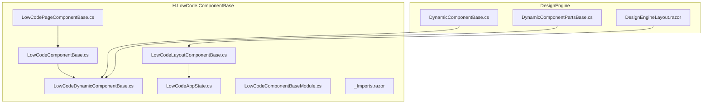
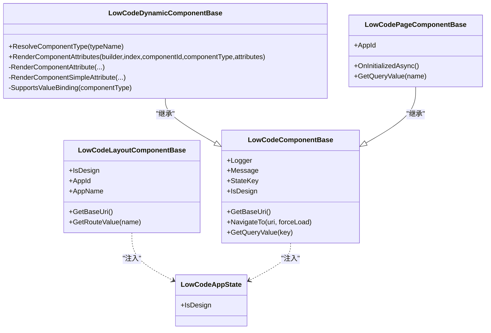
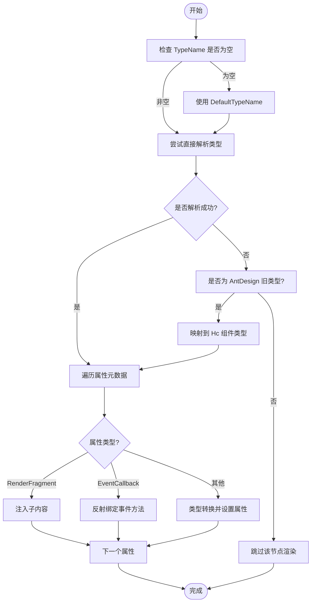
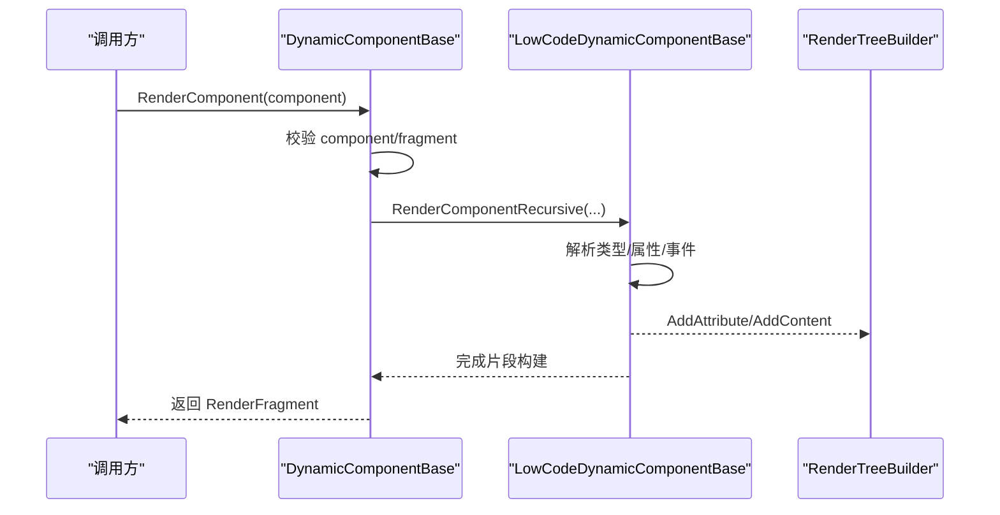
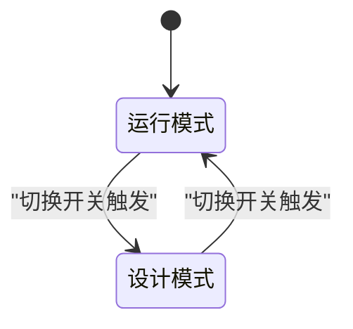
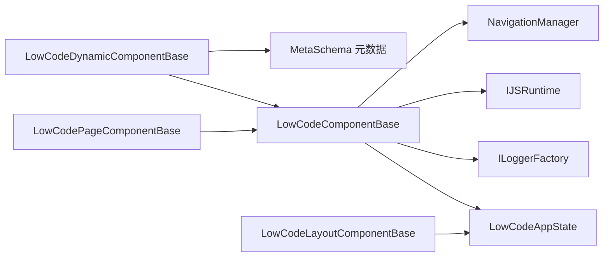

# 组件基类

<cite>
**本文引用的文件**   
- [LowCodeComponentBase.cs](file://src/LowCode/Common/H.LowCode.ComponentBase/LowCodeComponentBase.cs)
- [LowCodeAppState.cs](file://src/LowCode/Common/H.LowCode.ComponentBase/LowCodeAppState.cs)
- [LowCodeDynamicComponentBase.cs](file://src/LowCode/Common/H.LowCode.ComponentBase/LowCodeDynamicComponentBase.cs)
- [LowCodeLayoutComponentBase.cs](file://src/LowCode/Common/H.LowCode.ComponentBase/LowCodeLayoutComponentBase.cs)
- [LowCodePageComponentBase.cs](file://src/LowCode/Common/H.LowCode.ComponentBase/LowCodePageComponentBase.cs)
- [LowCodeComponentBaseModule.cs](file://src/LowCode/Common/H.LowCode.ComponentBase/LowCodeComponentBaseModule.cs)
- [_Imports.razor](file://src/LowCode/Common/H.LowCode.ComponentBase/_Imports.razor)
- [DynamicComponentBase.cs](file://src/LowCode/DesignEngine/H.LowCode.DesignEngine/Services/DynamicComponentBase.cs)
- [DynamicComponentPartsBase.cs](file://src/LowCode/DesignEngine/H.LowCode.PartsDesignEngine/Services/DynamicComponentPartsBase.cs)
- [DesignEngineLayout.razor](file://src/LowCode/DesignEngine/H.LowCode.DesignEngine/Layout/DesignEngineLayout.razor)
</cite>

## 目录
1. [简介](#简介)
2. [项目结构](#项目结构)
3. [核心组件](#核心组件)
4. [架构总览](#架构总览)
5. [详细组件分析](#详细组件分析)
6. [依赖关系分析](#依赖关系分析)
7. [性能考量](#性能考量)
8. [故障排查指南](#故障排查指南)
9. [结论](#结论)
10. [附录](#附录)

## 简介
本文件面向低代码平台的组件基类体系，系统性阐述 LowCodeComponentBase、LowCodeDynamicComponentBase、LowCodeLayoutComponentBase、LowCodePageComponentBase 的设计理念与实现要点，覆盖状态管理（设计模式切换）、导航服务、消息服务、日志记录、生命周期管理、设计模式支持、JavaScript 互操作等通用能力。同时解释全局状态 LowCodeAppState 的设计与作用，并给出 DynamicComponentBase 动态渲染的实现原理与使用方式，最后提供组件继承与扩展的最佳实践。

## 项目结构
围绕 H.LowCode.ComponentBase 工程，核心文件包括：
- 基础组件基类与页面/布局基类
- 全局应用状态 LowCodeAppState
- 动态组件基类与属性解析、类型映射
- 模块标记与命名空间导入

图表来源
- [LowCodeComponentBase.cs:1-73](file://src/LowCode/Common/H.LowCode.ComponentBase/LowCodeComponentBase.cs#L1-L73)
- [LowCodeDynamicComponentBase.cs:1-187](file://src/LowCode/Common/H.LowCode.ComponentBase/LowCodeDynamicComponentBase.cs#L1-L187)
- [LowCodeLayoutComponentBase.cs:1-66](file://src/LowCode/Common/H.LowCode.ComponentBase/LowCodeLayoutComponentBase.cs#L1-L66)
- [LowCodePageComponentBase.cs:1-22](file://src/LowCode/Common/H.LowCode.ComponentBase/LowCodePageComponentBase.cs#L1-L22)
- [LowCodeAppState.cs:1-21](file://src/LowCode/Common/H.LowCode.ComponentBase/LowCodeAppState.cs#L1-L21)
- [LowCodeComponentBaseModule.cs:1-9](file://src/LowCode/Common/H.LowCode.ComponentBase/LowCodeComponentBaseModule.cs#L1-L9)
- [_Imports.razor:1-3](file://src/LowCode/Common/H.LowCode.ComponentBase/_Imports.razor#L1-L3)
- [DynamicComponentBase.cs:1-34](file://src/LowCode/DesignEngine/H.LowCode.DesignEngine/Services/DynamicComponentBase.cs#L1-L34)
- [DynamicComponentPartsBase.cs:1-34](file://src/LowCode/DesignEngine/H.LowCode.PartsDesignEngine/Services/DynamicComponentPartsBase.cs#L1-L34)
- [DesignEngineLayout.razor:1-8](file://src/LowCode/DesignEngine/H.LowCode.DesignEngine/Layout/DesignEngineLayout.razor#L1-L8)

章节来源
- [LowCodeComponentBase.cs:1-73](file://src/LowCode/Common/H.LowCode.ComponentBase/LowCodeComponentBase.cs#L1-L73)
- [LowCodeDynamicComponentBase.cs:1-187](file://src/LowCode/Common/H.LowCode.ComponentBase/LowCodeDynamicComponentBase.cs#L1-L187)
- [LowCodeLayoutComponentBase.cs:1-66](file://src/LowCode/Common/H.LowCode.ComponentBase/LowCodeLayoutComponentBase.cs#L1-L66)
- [LowCodePageComponentBase.cs:1-22](file://src/LowCode/Common/H.LowCode.ComponentBase/LowCodePageComponentBase.cs#L1-L22)
- [LowCodeAppState.cs:1-21](file://src/LowCode/Common/H.LowCode.ComponentBase/LowCodeAppState.cs#L1-L21)
- [LowCodeComponentBaseModule.cs:1-9](file://src/LowCode/Common/H.LowCode.ComponentBase/LowCodeComponentBaseModule.cs#L1-L9)
- [_Imports.razor:1-3](file://src/LowCode/Common/H.LowCode.ComponentBase/_Imports.razor#L1-L3)
- [DynamicComponentBase.cs:1-34](file://src/LowCode/DesignEngine/H.LowCode.DesignEngine/Services/DynamicComponentBase.cs#L1-L34)
- [DynamicComponentPartsBase.cs:1-34](file://src/LowCode/DesignEngine/H.LowCode.PartsDesignEngine/Services/DynamicComponentPartsBase.cs#L1-L34)
- [DesignEngineLayout.razor:1-8](file://src/LowCode/DesignEngine/H.LowCode.DesignEngine/Layout/DesignEngineLayout.razor#L1-L8)

## 核心组件
- LowCodeComponentBase：所有低代码组件的根基类，提供日志、导航、JS 互操作、查询参数读取、设计模式判断、消息服务等通用能力。
- LowCodeDynamicComponentBase：在基类基础上增加“按元数据动态渲染组件”的能力，包含类型解析、属性映射、事件回调绑定、RenderFragment 子内容注入等。
- LowCodeLayoutComponentBase：面向布局组件的基类，提供 AppId/AppName 获取、路由值读取、基础 URI 获取与设计模式判断。
- LowCodePageComponentBase：面向页面组件的基类，提供 AppId 参数与生命周期钩子扩展点。
- LowCodeAppState：全局应用状态，承载“是否处于设计模式”的上下文信息。

章节来源
- [LowCodeComponentBase.cs:1-73](file://src/LowCode/Common/H.LowCode.ComponentBase/LowCodeComponentBase.cs#L1-L73)
- [LowCodeDynamicComponentBase.cs:1-187](file://src/LowCode/Common/H.LowCode.ComponentBase/LowCodeDynamicComponentBase.cs#L1-L187)
- [LowCodeLayoutComponentBase.cs:1-66](file://src/LowCode/Common/H.LowCode.ComponentBase/LowCodeLayoutComponentBase.cs#L1-L66)
- [LowCodePageComponentBase.cs:1-22](file://src/LowCode/Common/H.LowCode.ComponentBase/LowCodePageComponentBase.cs#L1-L22)
- [LowCodeAppState.cs:1-21](file://src/LowCode/Common/H.LowCode.ComponentBase/LowCodeAppState.cs#L1-L21)

## 架构总览
下图展示了基类之间的继承关系以及关键依赖：

图表来源
- [LowCodeComponentBase.cs:1-73](file://src/LowCode/Common/H.LowCode.ComponentBase/LowCodeComponentBase.cs#L1-L73)
- [LowCodeDynamicComponentBase.cs:1-187](file://src/LowCode/Common/H.LowCode.ComponentBase/LowCodeDynamicComponentBase.cs#L1-L187)
- [LowCodeLayoutComponentBase.cs:1-66](file://src/LowCode/Common/H.LowCode.ComponentBase/LowCodeLayoutComponentBase.cs#L1-L66)
- [LowCodePageComponentBase.cs:1-22](file://src/LowCode/Common/H.LowCode.ComponentBase/LowCodePageComponentBase.cs#L1-L22)
- [LowCodeAppState.cs:1-21](file://src/LowCode/Common/H.LowCode.ComponentBase/LowCodeAppState.cs#L1-L21)

## 详细组件分析

### LowCodeComponentBase：通用能力与生命周期
- 依赖注入
  - NavigationManager：统一导航入口
  - IJSRuntime：JS 互操作
  - ILoggerFactory：按组件类型创建 Logger
  - LowCodeAppState：设计模式上下文
- 日志记录器
  - 通过 LoggerFactory.CreateLogger(GetType()) 懒加载，避免重复实例化
- 消息服务
  - 内部 LowCodeMessageService 封装 JS alert 调用，提供 Success/Error/Warning/Info 等方法
- 导航与查询
  - NavigateTo：基于 NavigationManager 的跳转
  - GetQueryValue：解析 URL 查询参数
  - GetBaseUri：获取基础 URI
- 设计模式判断
  - IsDesign：从 LowCodeAppState 读取当前是否处于设计模式
- 状态标识
  - StateKey：用于 ShouldRender 优化（由派生类按需使用）

章节来源
- [LowCodeComponentBase.cs:1-73](file://src/LowCode/Common/H.LowCode.ComponentBase/LowCodeComponentBase.cs#L1-L73)

### LowCodeDynamicComponentBase：动态组件渲染与属性映射
- 类型解析与兼容
  - ResolveComponentType：优先直接解析类型名；若为旧版 AntDesign 类型，则回退到 Hc 组件映射表
  - 内置 _legacyAntDesignTypeMap 将常见 AntDesign 控件映射至自研 Hc 控件
- 属性渲染
  - RenderComponentAttributes：遍历属性元数据，逐个渲染
  - RenderComponentAttribute：区分三类属性
    - RenderFragment：注入子内容
    - EventCallback：反射查找同名方法并绑定事件回调
    - 简单属性：根据 AttributeClrType 转换值后写入
  - RenderComponentSimpleAttribute：类型转换与赋值
- 值绑定支持
  - SupportsValueBinding：检测组件是否具备 Value/ValueChanged 以支持双向绑定（预留扩展点）

图表来源
- [LowCodeDynamicComponentBase.cs:1-187](file://src/LowCode/Common/H.LowCode.ComponentBase/LowCodeDynamicComponentBase.cs#L1-L187)

章节来源
- [LowCodeDynamicComponentBase.cs:1-187](file://src/LowCode/Common/H.LowCode.ComponentBase/LowCodeDynamicComponentBase.cs#L1-L187)

### LowCodeLayoutComponentBase：布局与路由上下文
- 设计模式判断：IsDesign 来自 LowCodeAppState
- 应用上下文：AppId/AppName（当前 AppName 暂返回 AppId，后续可扩展）
- 路由值读取：GetRouteValue 从 RouteView.RouteData 中取值
- 基础 URI：GetBaseUri 基于 NavigationManager.BaseUri

章节来源
- [LowCodeLayoutComponentBase.cs:1-66](file://src/LowCode/Common/H.LowCode.ComponentBase/LowCodeLayoutComponentBase.cs#L1-L66)

### LowCodePageComponentBase：页面基类
- 参数：AppId 作为页面级参数
- 生命周期：重写 OnInitializedAsync 以便扩展初始化逻辑
- 查询参数：提供泛型 GetQueryValue<T> 占位方法（可由派生类实现）

章节来源
- [LowCodePageComponentBase.cs:1-22](file://src/LowCode/Common/H.LowCode.ComponentBase/LowCodePageComponentBase.cs#L1-L22)

### LowCodeAppState：全局状态
- 构造时传入 isDesign，暴露 IsDesign 只读属性
- 用于在设计/运行模式间切换，控制组件行为差异

章节来源
- [LowCodeAppState.cs:1-21](file://src/LowCode/Common/H.LowCode.ComponentBase/LowCodeAppState.cs#L1-L21)

### DynamicComponentBase 与 DynamicComponentPartsBase：运行时渲染
- 二者均继承自 LowCodeDynamicComponentBase，提供统一的 RenderComponent 接口
- 递归渲染组件树：根据 ComponentPartsSchema 与 Fragment 元数据构建 RenderTreeBuilder
- 支持 DataSource 与容器/叶子节点的不同渲染策略

图表来源
- [DynamicComponentBase.cs:1-34](file://src/LowCode/DesignEngine/H.LowCode.DesignEngine/Services/DynamicComponentBase.cs#L1-L34)
- [DynamicComponentPartsBase.cs:1-34](file://src/LowCode/DesignEngine/H.LowCode.PartsDesignEngine/Services/DynamicComponentPartsBase.cs#L1-L34)
- [LowCodeDynamicComponentBase.cs:1-187](file://src/LowCode/Common/H.LowCode.ComponentBase/LowCodeDynamicComponentBase.cs#L1-L187)

章节来源
- [DynamicComponentBase.cs:1-34](file://src/LowCode/DesignEngine/H.LowCode.DesignEngine/Services/DynamicComponentBase.cs#L1-L34)
- [DynamicComponentPartsBase.cs:1-34](file://src/LowCode/DesignEngine/H.LowCode.PartsDesignEngine/Services/DynamicComponentPartsBase.cs#L1-L34)

### 设计模式切换流程（概念性）

[本图为概念示意，不直接对应具体源码文件]

## 依赖关系分析
- 组件基类对 DI 容器的依赖
  - NavigationManager、IJSRuntime、ILoggerFactory、LowCodeAppState
- 动态渲染对元数据的依赖
  - ComponentPartsSchema、ComponentPartsFragmentSchema、ComponentAttributeFragmentSchema
- 布局与页面基类对路由系统的依赖
  - RouteView.RouteData、NavigationManager

图表来源
- [LowCodeComponentBase.cs:1-73](file://src/LowCode/Common/H.LowCode.ComponentBase/LowCodeComponentBase.cs#L1-L73)
- [LowCodeDynamicComponentBase.cs:1-187](file://src/LowCode/Common/H.LowCode.ComponentBase/LowCodeDynamicComponentBase.cs#L1-L187)
- [LowCodeLayoutComponentBase.cs:1-66](file://src/LowCode/Common/H.LowCode.ComponentBase/LowCodeLayoutComponentBase.cs#L1-L66)
- [LowCodePageComponentBase.cs:1-22](file://src/LowCode/Common/H.LowCode.ComponentBase/LowCodePageComponentBase.cs#L1-L22)

章节来源
- [LowCodeComponentBase.cs:1-73](file://src/LowCode/Common/H.LowCode.ComponentBase/LowCodeComponentBase.cs#L1-L73)
- [LowCodeDynamicComponentBase.cs:1-187](file://src/LowCode/Common/H.LowCode.ComponentBase/LowCodeDynamicComponentBase.cs#L1-L187)
- [LowCodeLayoutComponentBase.cs:1-66](file://src/LowCode/Common/H.LowCode.ComponentBase/LowCodeLayoutComponentBase.cs#L1-L66)
- [LowCodePageComponentBase.cs:1-22](file://src/LowCode/Common/H.LowCode.ComponentBase/LowCodePageComponentBase.cs#L1-L22)

## 性能考量
- 日志实例懒加载：Logger 仅在首次访问时创建，减少不必要的对象分配
- 类型解析缓存：ResolveComponentType 先尝试直接解析，失败再走兼容映射，降低反射开销
- 属性渲染短路：当 AttributeClrType 为空或属性不存在时快速跳过，避免无效计算
- 设计模式判断：IsDesign 仅读取只读状态，无额外同步成本
- 建议
  - 在高频渲染路径中使用 StateKey 配合 ShouldRender 减少重绘
  - 对复杂属性集合进行批量处理，减少多次 AddAttribute 调用

## 故障排查指南
- 组件类型解析失败
  - 现象：动态渲染跳过某节点
  - 排查：确认 TypeName 是否正确；如为旧版 AntDesign 类型，检查映射表是否覆盖
- 属性未生效
  - 现象：组件属性未更新
  - 排查：检查 AttributeClrType 是否与目标属性类型一致；确认属性名存在且可写
- 事件回调未触发
  - 现象：绑定的事件方法未被调用
  - 排查：确认 AttributeValue 指向的方法名在当前组件中存在且可见性满足反射要求
- 导航异常
  - 现象：NavigateTo 无效或报错
  - 排查：确认 uri 格式正确；必要时设置 forceLoad 强制刷新
- 查询参数为空
  - 现象：GetQueryValue 返回空
  - 排查：确认 URL Query 字符串是否存在对应键

章节来源
- [LowCodeDynamicComponentBase.cs:1-187](file://src/LowCode/Common/H.LowCode.ComponentBase/LowCodeDynamicComponentBase.cs#L1-L187)
- [LowCodeComponentBase.cs:1-73](file://src/LowCode/Common/H.LowCode.ComponentBase/LowCodeComponentBase.cs#L1-L73)

## 结论
LowCodeComponentBase 及其派生类为低代码平台提供了统一的组件基础设施：日志、导航、JS 互操作、设计模式判断、消息提示、查询参数解析等。LowCodeDynamicComponentBase 进一步实现了基于元数据的动态渲染与属性映射，兼容历史数据并保证向后演进。LowCodeLayoutComponentBase 与 LowCodePageComponentBase 分别聚焦布局与页面场景的上下文与生命周期扩展。通过 LowCodeAppState 统一管理设计/运行模式，使组件能够灵活适配不同场景。遵循本文的继承与扩展最佳实践，可高效构建稳定、可维护的低代码组件生态。

## 附录
- 模块标记：LowCodeComponentBaseModule 用于模块聚合与引用组织
- 命名空间导入：_Imports.razor 集中引入常用命名空间，简化组件文件头部

章节来源
- [LowCodeComponentBaseModule.cs:1-9](file://src/LowCode/Common/H.LowCode.ComponentBase/LowCodeComponentBaseModule.cs#L1-L9)
- [_Imports.razor:1-3](file://src/LowCode/Common/H.LowCode.ComponentBase/_Imports.razor#L1-L3)