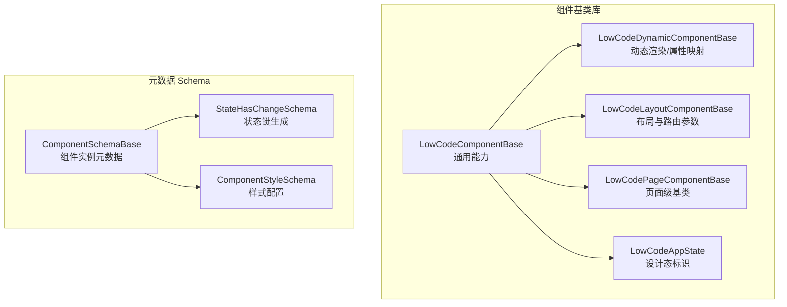
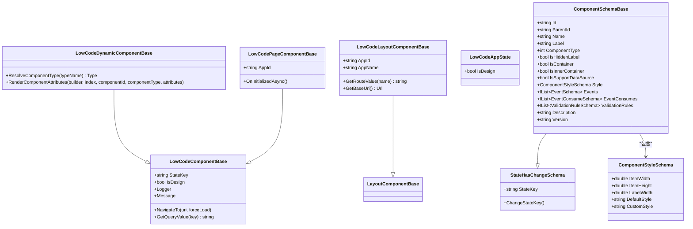
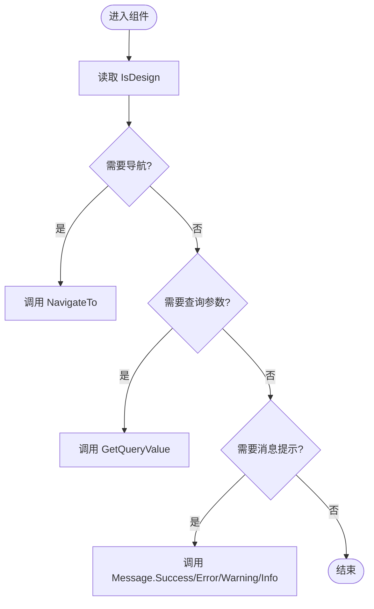
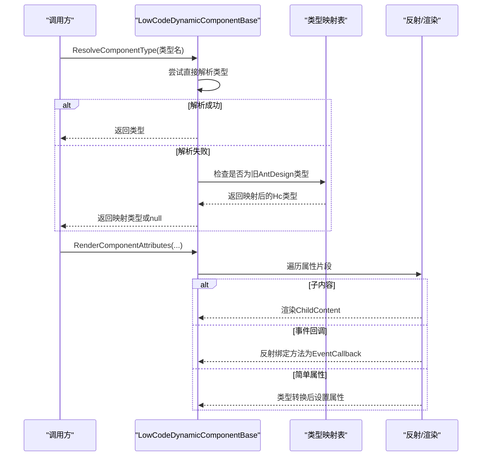
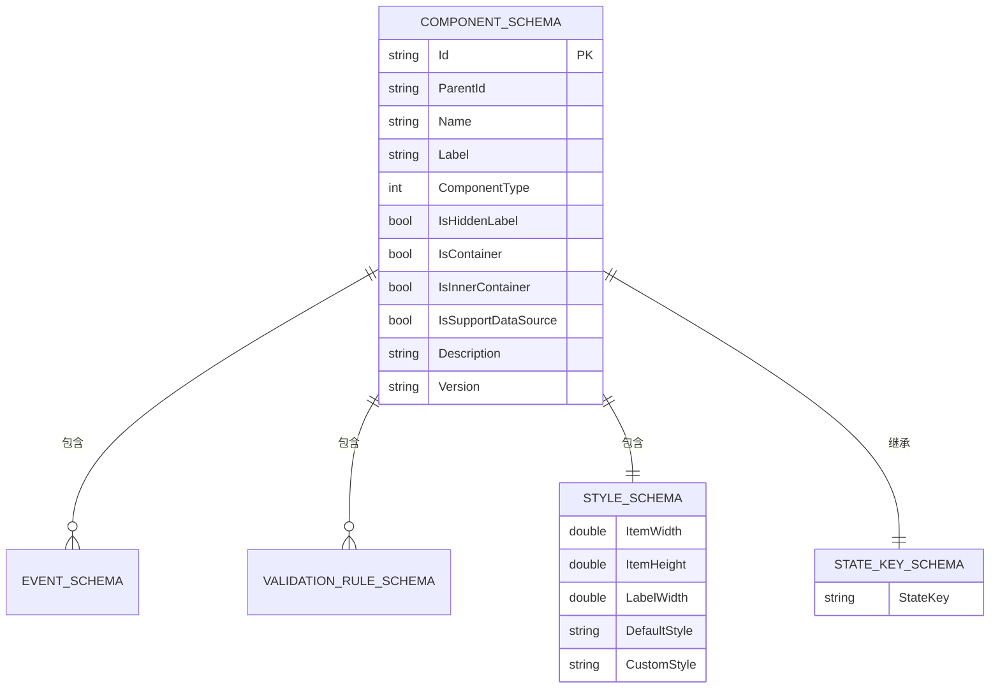
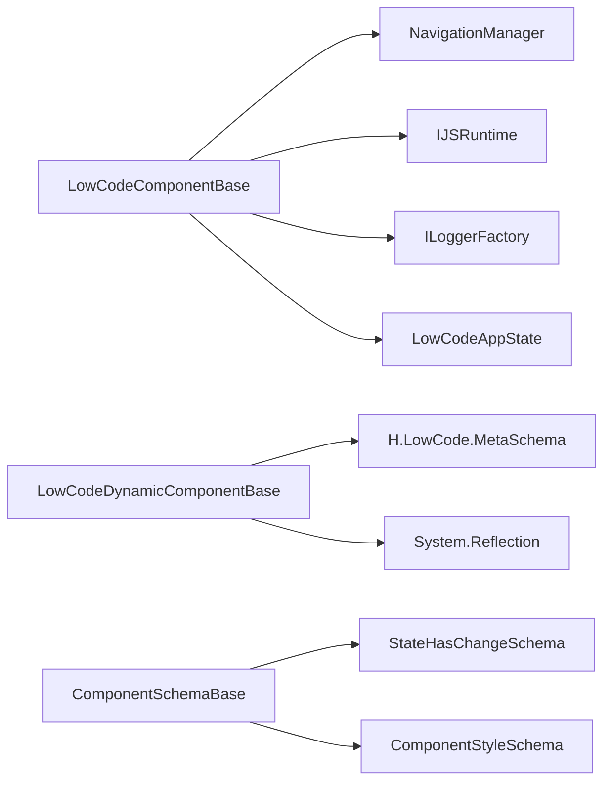

# 组件系统

<cite>
**本文引用的文件**   
- [LowCodeComponentBase.cs](file://src/LowCode/Common/H.LowCode.ComponentBase/LowCodeComponentBase.cs)
- [LowCodeDynamicComponentBase.cs](file://src/LowCode/Common/H.LowCode.ComponentBase/LowCodeDynamicComponentBase.cs)
- [LowCodeLayoutComponentBase.cs](file://src/LowCode/Common/H.LowCode.ComponentBase/LowCodeLayoutComponentBase.cs)
- [LowCodePageComponentBase.cs](file://src/LowCode/Common/H.LowCode.ComponentBase/LowCodePageComponentBase.cs)
- [LowCodeAppState.cs](file://src/LowCode/Common/H.LowCode.ComponentBase/LowCodeAppState.cs)
- [ComponentSchemaBase.cs](file://src/LowCode/Common/H.LowCode.MetaSchema/ComponentSchemaBase.cs)
- [StateHasChangeSchema.cs](file://src/LowCode/Common/H.LowCode.MetaSchema/StateHasChangeSchema.cs)
- [ComponentStyleSchema.cs](file://src/LowCode/Common/H.LowCode.MetaSchema/PropertySchemas/ComponentStyleSchema.cs)
</cite>

## 目录
1. [简介](#简介)
2. [项目结构](#项目结构)
3. [核心组件](#核心组件)
4. [架构总览](#架构总览)
5. [详细组件分析](#详细组件分析)
6. [依赖关系分析](#依赖关系分析)
7. [性能考量](#性能考量)
8. [故障排查指南](#故障排查指南)
9. [结论](#结论)
10. [附录](#附录)

## 简介
本文件面向低代码组件系统的开发者与使用者，系统性阐述组件基类的设计理念、扩展点与通用能力（状态管理、导航、消息服务等），并给出组件分类体系、元数据 Schema 规范、开发最佳实践以及自定义组件开发指南。文档以仓库中的实际源码为依据，确保内容准确可追溯。

## 项目结构
低代码组件系统位于 src/LowCode/Common 下，核心由“组件基类库”和“元数据 Schema 定义”两部分组成：
- 组件基类库（H.LowCode.ComponentBase）：提供页面、布局、动态渲染等基础能力，统一注入导航、JS 运行时、日志、设计态标识等。
- 元数据 Schema（H.LowCode.MetaSchema）：描述组件实例的结构化信息，包括属性、事件、样式、校验规则等，用于设计器与渲染引擎的序列化/反序列化。

图表来源
- [LowCodeComponentBase.cs:1-73](file://src/LowCode/Common/H.LowCode.ComponentBase/LowCodeComponentBase.cs#L1-L73)
- [LowCodeDynamicComponentBase.cs:1-187](file://src/LowCode/Common/H.LowCode.ComponentBase/LowCodeDynamicComponentBase.cs#L1-L187)
- [LowCodeLayoutComponentBase.cs:1-66](file://src/LowCode/Common/H.LowCode.ComponentBase/LowCodeLayoutComponentBase.cs#L1-L66)
- [LowCodePageComponentBase.cs:1-22](file://src/LowCode/Common/H.LowCode.ComponentBase/LowCodePageComponentBase.cs#L1-L22)
- [LowCodeAppState.cs:1-21](file://src/LowCode/Common/H.LowCode.ComponentBase/LowCodeAppState.cs#L1-L21)
- [ComponentSchemaBase.cs:1-104](file://src/LowCode/Common/H.LowCode.MetaSchema/ComponentSchemaBase.cs#L1-L104)
- [StateHasChangeSchema.cs:1-17](file://src/LowCode/Common/H.LowCode.MetaSchema/StateHasChangeSchema.cs#L1-L17)
- [ComponentStyleSchema.cs:1-40](file://src/LowCode/Common/H.LowCode.MetaSchema/PropertySchemas/ComponentStyleSchema.cs#L1-L40)

章节来源
- [LowCodeComponentBase.cs:1-73](file://src/LowCode/Common/H.LowCode.ComponentBase/LowCodeComponentBase.cs#L1-L73)
- [LowCodeDynamicComponentBase.cs:1-187](file://src/LowCode/Common/H.LowCode.ComponentBase/LowCodeDynamicComponentBase.cs#L1-L187)
- [LowCodeLayoutComponentBase.cs:1-66](file://src/LowCode/Common/H.LowCode.ComponentBase/LowCodeLayoutComponentBase.cs#L1-L66)
- [LowCodePageComponentBase.cs:1-22](file://src/LowCode/Common/H.LowCode.ComponentBase/LowCodePageComponentBase.cs#L1-L22)
- [LowCodeAppState.cs:1-21](file://src/LowCode/Common/H.LowCode.ComponentBase/LowCodeAppState.cs#L1-L21)
- [ComponentSchemaBase.cs:1-104](file://src/LowCode/Common/H.LowCode.MetaSchema/ComponentSchemaBase.cs#L1-L104)
- [StateHasChangeSchema.cs:1-17](file://src/LowCode/Common/H.LowCode.MetaSchema/StateHasChangeSchema.cs#L1-L17)
- [ComponentStyleSchema.cs:1-40](file://src/LowCode/Common/H.LowCode.MetaSchema/PropertySchemas/ComponentStyleSchema.cs#L1-L40)

## 核心组件
本节聚焦组件基类的职责划分与扩展点，帮助理解如何基于基类快速构建可复用、可配置的组件。

- LowCodeComponentBase
  - 职责：为所有低代码组件提供统一的注入能力（导航、JS 运行时、日志）、设计态判断、消息服务封装、查询参数解析与基础导航方法。
  - 关键扩展点：
    - StateKey：配合 ShouldRender 实现细粒度渲染控制。
    - IsDesign：通过全局状态判断是否处于设计时。
    - Message：轻量消息提示（当前实现调用浏览器 alert）。
    - NavigateTo/GetQueryValue：统一导航与查询参数读取。
- LowCodeDynamicComponentBase
  - 职责：负责根据元数据动态解析组件类型、将属性片段映射到目标组件的属性/事件/子内容，兼容旧版 AntDesign 类型名到现用 Hc 组件类型的映射。
  - 关键扩展点：
    - ResolveComponentType：自定义类型解析策略（含兼容映射）。
    - RenderComponentAttributes：按属性片段渲染简单属性、事件回调、RenderFragment 子内容。
- LowCodeLayoutComponentBase
  - 职责：为布局组件提供 AppId/AppName 获取、路由参数读取、设计态判断与基础 URI 构造。
- LowCodePageComponentBase
  - 职责：页面级基类，预留 AppId 参数与初始化生命周期钩子。
- LowCodeAppState
  - 职责：全局设计态标识，供组件在设计与运行模式间切换行为。

章节来源
- [LowCodeComponentBase.cs:1-73](file://src/LowCode/Common/H.LowCode.ComponentBase/LowCodeComponentBase.cs#L1-L73)
- [LowCodeDynamicComponentBase.cs:1-187](file://src/LowCode/Common/H.LowCode.ComponentBase/LowCodeDynamicComponentBase.cs#L1-L187)
- [LowCodeLayoutComponentBase.cs:1-66](file://src/LowCode/Common/H.LowCode.ComponentBase/LowCodeLayoutComponentBase.cs#L1-L66)
- [LowCodePageComponentBase.cs:1-22](file://src/LowCode/Common/H.LowCode.ComponentBase/LowCodePageComponentBase.cs#L1-L22)
- [LowCodeAppState.cs:1-21](file://src/LowCode/Common/H.LowCode.ComponentBase/LowCodeAppState.cs#L1-L21)

## 架构总览
下图展示了组件基类与元数据 Schema 的整体关系，以及设计态与渲染流程的关键交互。

图表来源
- [LowCodeComponentBase.cs:1-73](file://src/LowCode/Common/H.LowCode.ComponentBase/LowCodeComponentBase.cs#L1-L73)
- [LowCodeDynamicComponentBase.cs:1-187](file://src/LowCode/Common/H.LowCode.ComponentBase/LowCodeDynamicComponentBase.cs#L1-L187)
- [LowCodeLayoutComponentBase.cs:1-66](file://src/LowCode/Common/H.LowCode.ComponentBase/LowCodeLayoutComponentBase.cs#L1-L66)
- [LowCodePageComponentBase.cs:1-22](file://src/LowCode/Common/H.LowCode.ComponentBase/LowCodePageComponentBase.cs#L1-L22)
- [ComponentSchemaBase.cs:1-104](file://src/LowCode/Common/H.LowCode.MetaSchema/ComponentSchemaBase.cs#L1-L104)
- [StateHasChangeSchema.cs:1-17](file://src/LowCode/Common/H.LowCode.MetaSchema/StateHasChangeSchema.cs#L1-L17)
- [ComponentStyleSchema.cs:1-40](file://src/LowCode/Common/H.LowCode.MetaSchema/PropertySchemas/ComponentStyleSchema.cs#L1-L40)

## 详细组件分析

### 组件基类与通用能力
- 设计态感知
  - 通过 LowCodeAppState.IsDesign 暴露设计态标志，组件可在渲染或交互时差异化处理。
- 导航与参数
  - NavigateTo：统一跳转；GetQueryValue：从当前 URL 查询参数中取值。
- 日志与消息
  - Logger：按组件类型创建独立日志记录器；Message：封装 JS 消息（当前使用 alert）。
- 渲染优化
  - StateKey：结合 ShouldRender 可实现按需重渲染，减少不必要的 UI 更新。

图表来源
- [LowCodeComponentBase.cs:1-73](file://src/LowCode/Common/H.LowCode.ComponentBase/LowCodeComponentBase.cs#L1-L73)

章节来源
- [LowCodeComponentBase.cs:1-73](file://src/LowCode/Common/H.LowCode.ComponentBase/LowCodeComponentBase.cs#L1-L73)

### 动态组件与属性映射
- 类型解析与兼容
  - ResolveComponentType：优先直接解析类型名；若失败且为旧版 AntDesign 类型，则回退到内置映射表解析为现用 Hc 组件类型。
- 属性渲染
  - RenderComponentAttributes：遍历属性片段，区分三类：
    - RenderFragment：作为子内容渲染。
    - EventCallback：反射匹配方法名并绑定事件回调。
    - 简单属性：按 AttributeClrType 转换值后设置。
- 兼容性保障
  - 对缺失属性或空值进行安全处理，避免整页崩溃。

图表来源
- [LowCodeDynamicComponentBase.cs:1-187](file://src/LowCode/Common/H.LowCode.ComponentBase/LowCodeDynamicComponentBase.cs#L1-L187)

章节来源
- [LowCodeDynamicComponentBase.cs:1-187](file://src/LowCode/Common/H.LowCode.ComponentBase/LowCodeDynamicComponentBase.cs#L1-L187)

### 布局与页面基类
- 布局基类
  - 提供 AppId/AppName 获取、路由参数读取、设计态判断与基础 URI 构造，便于布局组件在不同应用上下文中工作。
- 页面基类
  - 提供 AppId 参数与初始化生命周期钩子，便于页面级逻辑接入。

章节来源
- [LowCodeLayoutComponentBase.cs:1-66](file://src/LowCode/Common/H.LowCode.ComponentBase/LowCodeLayoutComponentBase.cs#L1-L66)
- [LowCodePageComponentBase.cs:1-22](file://src/LowCode/Common/H.LowCode.ComponentBase/LowCodePageComponentBase.cs#L1-L22)

### 组件元数据 Schema 规范
- 组件实例元数据（ComponentSchemaBase）
  - 标识与层级：Id、ParentId、Name、Label。
  - 类型与容器：ComponentType、IsContainer、IsInnerContainer、IsSupportDataSource。
  - 展示与交互：Style（样式）、Events（事件）、EventConsumes（事件消费）、ValidationRules（校验规则）。
  - 版本与说明：Version、Description。
- 状态键（StateHasChangeSchema）
  - StateKey：自动生成唯一键，支持 ChangeStateKey 刷新。
- 样式（ComponentStyleSchema）
  - 宽度/高度/标签宽度、默认样式与自定义样式字段。

图表来源
- [ComponentSchemaBase.cs:1-104](file://src/LowCode/Common/H.LowCode.MetaSchema/ComponentSchemaBase.cs#L1-L104)
- [StateHasChangeSchema.cs:1-17](file://src/LowCode/Common/H.LowCode.MetaSchema/StateHasChangeSchema.cs#L1-L17)
- [ComponentStyleSchema.cs:1-40](file://src/LowCode/Common/H.LowCode.MetaSchema/PropertySchemas/ComponentStyleSchema.cs#L1-L40)

章节来源
- [ComponentSchemaBase.cs:1-104](file://src/LowCode/Common/H.LowCode.MetaSchema/ComponentSchemaBase.cs#L1-L104)
- [StateHasChangeSchema.cs:1-17](file://src/LowCode/Common/H.LowCode.MetaSchema/StateHasChangeSchema.cs#L1-L17)
- [ComponentStyleSchema.cs:1-40](file://src/LowCode/Common/H.LowCode.MetaSchema/PropertySchemas/ComponentStyleSchema.cs#L1-L40)

## 依赖关系分析
- 组件基类依赖
  - Microsoft.AspNetCore.Components：组件框架能力。
  - NavigationManager：路由导航。
  - IJSRuntime：JavaScript 互操作（消息提示）。
  - ILoggerFactory：日志。
  - LowCodeAppState：设计态标识。
- 动态渲染依赖
  - System.Reflection：反射解析类型与方法。
  - H.LowCode.MetaSchema：属性片段与事件/校验等元数据结构。
- 元数据 Schema 依赖
  - H.Util.Ids：生成唯一 StateKey。
  - System.Text.Json.Serialization：JSON 序列化注解。

图表来源
- [LowCodeComponentBase.cs:1-73](file://src/LowCode/Common/H.LowCode.ComponentBase/LowCodeComponentBase.cs#L1-L73)
- [LowCodeDynamicComponentBase.cs:1-187](file://src/LowCode/Common/H.LowCode.ComponentBase/LowCodeDynamicComponentBase.cs#L1-L187)
- [ComponentSchemaBase.cs:1-104](file://src/LowCode/Common/H.LowCode.MetaSchema/ComponentSchemaBase.cs#L1-L104)
- [StateHasChangeSchema.cs:1-17](file://src/LowCode/Common/H.LowCode.MetaSchema/StateHasChangeSchema.cs#L1-L17)

章节来源
- [LowCodeComponentBase.cs:1-73](file://src/LowCode/Common/H.LowCode.ComponentBase/LowCodeComponentBase.cs#L1-L73)
- [LowCodeDynamicComponentBase.cs:1-187](file://src/LowCode/Common/H.LowCode.ComponentBase/LowCodeDynamicComponentBase.cs#L1-L187)
- [ComponentSchemaBase.cs:1-104](file://src/LowCode/Common/H.LowCode.MetaSchema/ComponentSchemaBase.cs#L1-L104)
- [StateHasChangeSchema.cs:1-17](file://src/LowCode/Common/H.LowCode.MetaSchema/StateHasChangeSchema.cs#L1-L17)

## 性能考量
- 渲染优化
  - 使用 StateKey 与 ShouldRender 组合，仅在相关状态变化时触发重渲染，降低 Blazor 渲染开销。
- 类型解析缓存
  - 动态类型解析建议使用缓存策略（例如静态字典），避免重复反射带来的性能损耗。
- 属性映射最小化
  - 仅对必要属性进行反射与类型转换，避免无意义的属性设置。
- 消息提示降级
  - 当前消息服务使用 alert，生产环境建议替换为更友好的通知组件，并避免频繁调用造成阻塞。

[本节为通用指导，不直接分析具体文件]

## 故障排查指南
- 类型解析失败
  - 现象：组件无法渲染或节点被跳过。
  - 排查：确认类型名是否正确；如为旧版 AntDesign 类型，检查映射表是否覆盖；必要时扩展 ResolveComponentType。
- 属性为空或类型不匹配
  - 现象：属性未生效或警告日志。
  - 排查：检查 AttributeClrType 与 AttributeValue 是否一致；确保 ConvertToRealType 能正确转换。
- 事件回调未绑定
  - 现象：事件无效。
  - 排查：确认方法签名与 EventCallback 兼容；检查方法可见性与命名。
- 设计态判断异常
  - 现象：组件在设计/运行模式行为不一致。
  - 排查：确认 LowCodeAppState.IsDesign 注入是否正确。

章节来源
- [LowCodeDynamicComponentBase.cs:1-187](file://src/LowCode/Common/H.LowCode.ComponentBase/LowCodeDynamicComponentBase.cs#L1-L187)
- [LowCodeComponentBase.cs:1-73](file://src/LowCode/Common/H.LowCode.ComponentBase/LowCodeComponentBase.cs#L1-L73)

## 结论
本组件系统通过清晰的基类分层与元数据驱动的动态渲染机制，实现了高内聚、低耦合的可扩展组件生态。开发者可基于基类快速构建具备统一导航、消息、日志与设计态能力的组件，并通过 Schema 规范完成可视化配置与校验。建议在工程实践中遵循性能优化与错误处理的最佳实践，持续提升组件质量与用户体验。

[本节为总结性内容，不直接分析具体文件]

## 附录

### 组件分类体系与使用场景
- 基础组件（原子组件）
  - 特性：单一职责、无内部容器、可配置属性丰富。
  - 场景：输入、选择、按钮、图片等。
- 容器组件
  - 特性：IsContainer=true，承载子组件，通常不支持数据源。
  - 场景：布局容器、卡片、栅格等。
- 表单组件
  - 特性：支持双向绑定、校验规则、事件消费。
  - 场景：输入框、日期选择、下拉选择等。
- 展示组件
  - 特性：只读展示、样式可控、事件较少。
  - 场景：文本、富文本、统计卡片等。

[本节为概念性内容，不直接分析具体文件]

### 自定义组件开发指南
- 步骤概览
  - 新建组件并继承合适的基类（页面/布局/普通组件）。
  - 定义属性与事件，并在元数据 Schema 中声明属性片段与事件。
  - 如需动态渲染，确保类型名与映射表一致，或使用 ResolveComponentType 扩展。
  - 使用 StateKey 与 ShouldRender 优化渲染。
  - 集成导航、消息、日志等通用能力。
- 示例参考路径
  - 基类用法参考：[LowCodeComponentBase.cs:1-73](file://src/LowCode/Common/H.LowCode.ComponentBase/LowCodeComponentBase.cs#L1-L73)
  - 动态属性映射参考：[LowCodeDynamicComponentBase.cs:1-187](file://src/LowCode/Common/H.LowCode.ComponentBase/LowCodeDynamicComponentBase.cs#L1-L187)
  - 布局与路由参数参考：[LowCodeLayoutComponentBase.cs:1-66](file://src/LowCode/Common/H.LowCode.ComponentBase/LowCodeLayoutComponentBase.cs#L1-L66)
  - 页面基类参考：[LowCodePageComponentBase.cs:1-22](file://src/LowCode/Common/H.LowCode.ComponentBase/LowCodePageComponentBase.cs#L1-L22)
  - 元数据 Schema 参考：[ComponentSchemaBase.cs:1-104](file://src/LowCode/Common/H.LowCode.MetaSchema/ComponentSchemaBase.cs#L1-L104)

[本节为概念性内容，不直接分析具体文件]