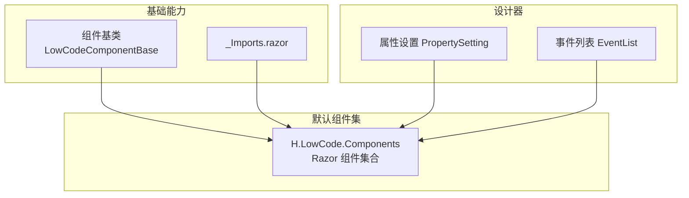
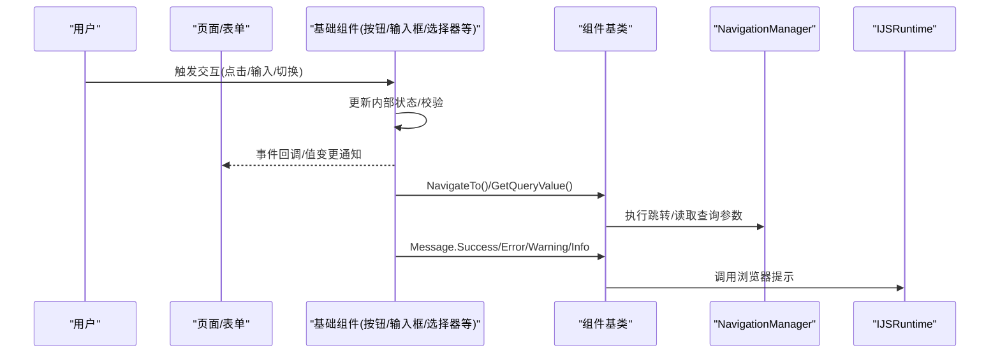
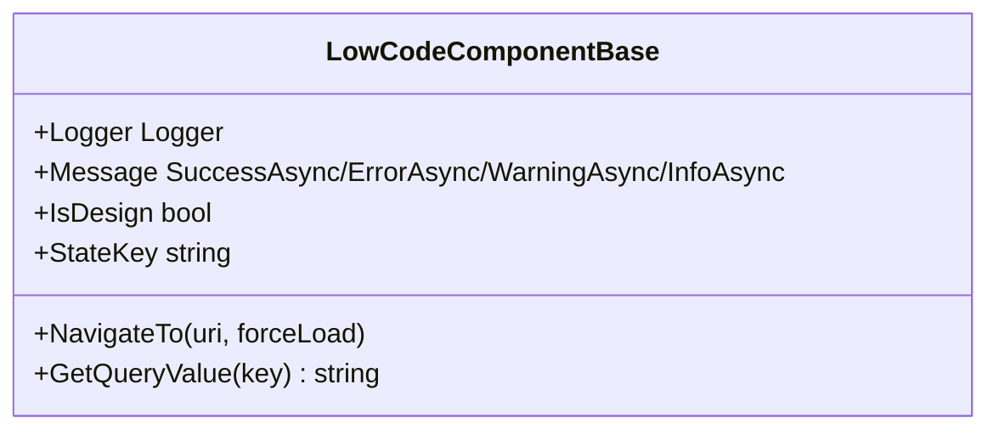
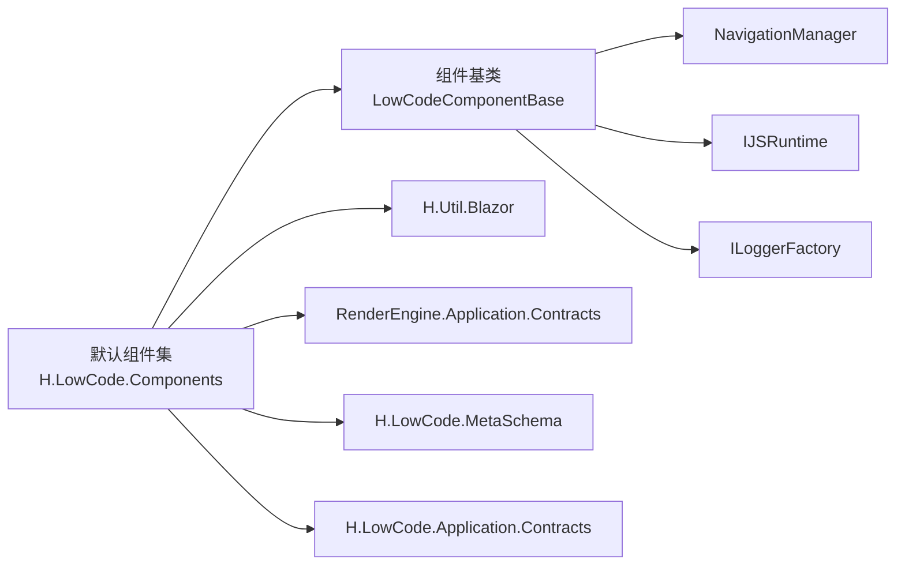

# 基础组件

<cite>
**本文引用的文件**   
- [LowCodeComponentBase.cs](file://src/LowCode/Common/H.LowCode.ComponentBase/LowCodeComponentBase.cs)
- [_Imports.razor](file://src/LowCode/Common/H.LowCode.ComponentBase/_Imports.razor)
- [H.LowCode.Components.csproj](file://src/LowCode/Common/H.LowCode.Components/H.LowCode.Components.csproj)
- [PropertySetting.razor](file://src/LowCode/DesignEngine/H.LowCode.DesignEngine/SettingPanel/PropertySetting.razor)
- [EventList.razor](file://src/LowCode/DesignEngine/H.LowCode.DesignEngineBase/Components/Events/EventList.razor)
- [ComponentPartsBasicForm.razor](file://src/LowCode/DesignEngine/H.LowCode.PartsDesignEngine/Pages/ComponentParts/ComponentPartsBasicForm.razor)
- [TablePropertyItem.razor](file://src/LowCode/DesignEngine/H.LowCode.DesignEngine/SettingPanel/PropertySettingItems/TablePropertyItem.razor)
- [Organization.razor](file://src/Services/Organization/H.Organization.Web/Pages/Organization.razor)
- [StartApprovalForm.razor](file://src/Services/Approval/H.Approval.Web/Pages/StartApprovalForm.razor)
</cite>

## 目录
1. [简介](#简介)
2. [项目结构](#项目结构)
3. [核心组件](#核心组件)
4. [架构总览](#架构总览)
5. [详细组件分析](#详细组件分析)
6. [依赖关系分析](#依赖关系分析)
7. [性能考虑](#性能考虑)
8. [故障排查指南](#故障排查指南)
9. [结论](#结论)
10. [附录](#附录)

## 简介
本文件面向低代码平台的基础交互组件，覆盖按钮、输入框、选择器、复选框、单选框、开关等。文档从属性配置（如禁用、加载、尺寸）、事件处理机制、数据绑定方式、样式定制与主题支持、表单集成与验证规则、性能优化建议以及可访问性实现等方面进行系统化说明，帮助开发者快速掌握并高效使用这些组件。

## 项目结构
- 组件基类位于公共基础库中，提供导航、日志、消息提示、设计态判断等通用能力。
- 默认组件集合以 Razor 组件形式组织，通过项目引用与渲染引擎、元数据模式、应用契约等模块协作。
- 设计器侧的“属性设置”和“事件列表”为可视化配置提供了支撑，便于在拖拽编排时动态生成属性与事件。

图表来源
- [LowCodeComponentBase.cs:1-73](file://src/LowCode/Common/H.LowCode.ComponentBase/LowCodeComponentBase.cs#L1-L73)
- [_Imports.razor:1-3](file://src/LowCode/Common/H.LowCode.ComponentBase/_Imports.razor#L1-L3)
- [H.LowCode.Components.csproj:1-16](file://src/LowCode/Common/H.LowCode.Components/H.LowCode.Components.csproj#L1-L16)
- [PropertySetting.razor:112-134](file://src/LowCode/DesignEngine/H.LowCode.DesignEngine/SettingPanel/PropertySetting.razor#L112-L134)
- [EventList.razor:22-41](file://src/LowCode/DesignEngine/H.LowCode.DesignEngineBase/Components/Events/EventList.razor#L22-L41)

章节来源
- [LowCodeComponentBase.cs:1-73](file://src/LowCode/Common/H.LowCode.ComponentBase/LowCodeComponentBase.cs#L1-L73)
- [_Imports.razor:1-3](file://src/LowCode/Common/H.LowCode.ComponentBase/_Imports.razor#L1-L3)
- [H.LowCode.Components.csproj:1-16](file://src/LowCode/Common/H.LowCode.Components/H.LowCode.Components.csproj#L1-L16)

## 核心组件
本节概述各基础组件的能力边界与共性特性：
- 按钮：支持禁用、加载状态、尺寸、类型（主操作/次要/链接/文本）等；支持点击事件与表单提交联动。
- 输入框：支持占位符、只读、禁用、大小、前缀/后缀图标、校验提示；支持双向绑定与失焦/变更事件。
- 选择器：支持单选/多选、搜索过滤、远程数据源、禁用、尺寸；支持选中值变化事件。
- 复选框：支持分组、禁用、尺寸、自定义标签；支持多值绑定与变更事件。
- 单选框：支持分组、禁用、尺寸；支持单项绑定与变更事件。
- 开关：支持禁用、尺寸、文案；支持布尔值绑定与切换事件。

上述组件在设计器中可通过“属性设置”面板进行可视化配置，并在运行时由渲染引擎解析元数据后实例化。

章节来源
- [PropertySetting.razor:112-134](file://src/LowCode/DesignEngine/H.LowCode.DesignEngine/SettingPanel/PropertySetting.razor#L112-L134)
- [EventList.razor:22-41](file://src/LowCode/DesignEngine/H.LowCode.DesignEngineBase/Components/Events/EventList.razor#L22-L41)

## 架构总览
低代码基础组件的运行流程大致如下：设计期通过属性与事件面板生成组件元数据；运行期由渲染引擎根据元数据动态创建组件实例，注入上下文（导航、JS 运行时、日志），并通过双向绑定与事件回调完成数据流闭环。

图表来源
- [LowCodeComponentBase.cs:57-71](file://src/LowCode/Common/H.LowCode.ComponentBase/LowCodeComponentBase.cs#L57-L71)
- [LowCodeComponentBase.cs:48-55](file://src/LowCode/Common/H.LowCode.ComponentBase/LowCodeComponentBase.cs#L48-L55)

## 详细组件分析

### 组件基类与通用能力
- 提供日志记录器、消息提示服务、导航与查询参数读取、设计态判断等通用方法。
- 所有基础组件继承该基类，获得一致的交互体验与扩展点。

图表来源
- [LowCodeComponentBase.cs:12-71](file://src/LowCode/Common/H.LowCode.ComponentBase/LowCodeComponentBase.cs#L12-L71)

章节来源
- [LowCodeComponentBase.cs:1-73](file://src/LowCode/Common/H.LowCode.ComponentBase/LowCodeComponentBase.cs#L1-L73)

### 按钮 Button
- 属性要点
  - Disabled：禁用状态，阻止交互。
  - Loading：加载中状态，通常用于异步提交。
  - Size：尺寸（小/中/大）。
  - Type：类型（主操作/次要/链接/文本）。
  - Icon：图标（可选）。
  - Block：是否块级显示。
- 事件
  - OnClick：点击回调。
  - OnDisabledChange：禁用状态变化（可选）。
- 数据绑定
  - 可与表单字段联动，作为提交或重置按钮。
- 样式与主题
  - 通过 CSS 类名与主题变量控制颜色、圆角、阴影等。
- 示例路径
  - 设计器中的按钮类型配置参考：[TablePropertyItem.razor:114-118](file://src/LowCode/DesignEngine/H.LowCode.DesignEngine/SettingPanel/PropertySettingItems/TablePropertyItem.razor#L114-L118)

章节来源
- [TablePropertyItem.razor:114-118](file://src/LowCode/DesignEngine/H.LowCode.DesignEngine/SettingPanel/PropertySettingItems/TablePropertyItem.razor#L114-L118)

### 输入框 Input
- 属性要点
  - Placeholder：占位符。
  - ReadOnly：只读。
  - Disabled：禁用。
  - Size：尺寸。
  - Prefix/Suffix：前后缀内容。
  - ValidateOn：校验时机（输入时/失焦时）。
- 事件
  - OnInput：输入回调。
  - OnBlur：失焦回调。
  - OnValidate：校验结果回调。
- 数据绑定
  - 支持 @bind 双向绑定到模型字段。
- 样式与主题
  - 边框、背景、聚焦态、错误态均可通过主题变量覆盖。
- 示例路径
  - 设计器中校验触发时机配置参考：[PropertySetting.razor:112-116](file://src/LowCode/DesignEngine/H.LowCode.DesignEngine/SettingPanel/PropertySetting.razor#L112-L116)

章节来源
- [PropertySetting.razor:112-116](file://src/LowCode/DesignEngine/H.LowCode.DesignEngine/SettingPanel/PropertySetting.razor#L112-L116)

### 选择器 Select
- 属性要点
  - Mode：单选/多选。
  - Searchable：是否支持搜索。
  - Remote：是否启用远程数据源。
  - Disabled：禁用。
  - Size：尺寸。
- 事件
  - OnChange：选中值变化。
  - OnSearch：搜索回调（远程场景）。
- 数据绑定
  - 单选绑定单个值，多选绑定数组。
- 样式与主题
  - 下拉面板、选项高亮、空状态均可定制。
- 示例路径
  - 设计器中选择页面/操作的示例参考：[EventList.razor:32-38](file://src/LowCode/DesignEngine/H.LowCode.DesignEngineBase/Components/Events/EventList.razor#L32-L38)

章节来源
- [EventList.razor:32-38](file://src/LowCode/DesignEngine/H.LowCode.DesignEngineBase/Components/Events/EventList.razor#L32-L38)

### 复选框 Checkbox
- 属性要点
  - Options：选项列表（支持静态或动态）。
  - Disabled：禁用。
  - Size：尺寸。
- 事件
  - OnChange：选中项变化。
- 数据绑定
  - 绑定到字符串数组或对象集合。
- 样式与主题
  - 勾选态、禁用态、间距等可定制。
- 示例路径
  - 动态渲染复选框组参考：[StartApprovalForm.razor:253-270](file://src/Services/Approval/H.Approval.Web/Pages/StartApprovalForm.razor#L253-L270)

章节来源
- [StartApprovalForm.razor:253-270](file://src/Services/Approval/H.Approval.Web/Pages/StartApprovalForm.razor#L253-L270)

### 单选框 Radio
- 属性要点
  - Options：选项列表。
  - Disabled：禁用。
  - Size：尺寸。
- 事件
  - OnChange：选中值变化。
- 数据绑定
  - 绑定到单个值。
- 样式与主题
  - 按钮式/传统样式可切换。
- 示例路径
  - 设计器中单选按钮样式参考：[AccountEmptyLayout.razor:235-252](file://src/Services/Account/H.Account.Web/Layout/AccountEmptyLayout.razor#L235-L252)

章节来源
- [AccountEmptyLayout.razor:235-252](file://src/Services/Account/H.Account.Web/Layout/AccountEmptyLayout.razor#L235-L252)

### 开关 Switch
- 属性要点
  - Disabled：禁用。
  - Size：尺寸。
  - Label：开关文案。
- 事件
  - OnChange：开关状态变化。
- 数据绑定
  - 绑定到布尔值。
- 样式与主题
  - 滑块、轨道、文案位置可定制。
- 示例路径
  - 开关用法参考：[Organization.razor:187-193](file://src/Services/Organization/H.Organization.Web/Pages/Organization.razor#L187-L193)

章节来源
- [Organization.razor:187-193](file://src/Services/Organization/H.Organization.Web/Pages/Organization.razor#L187-L193)

### 表单集成与验证
- 表单集成
  - 将输入框、选择器、复选框、单选框、开关等组合成表单，统一提交与重置。
  - 按钮作为提交/重置入口，支持 Loading 状态。
- 验证规则
  - 支持必填、长度、格式、自定义校验函数。
  - 触发时机：输入时/失去焦点时。
  - 优先级：多条规则按顺序执行。
- 示例路径
  - 校验触发时机与优先级配置参考：[PropertySetting.razor:112-122](file://src/LowCode/DesignEngine/H.LowCode.DesignEngine/SettingPanel/PropertySetting.razor#L112-L122)

章节来源
- [PropertySetting.razor:112-122](file://src/LowCode/DesignEngine/H.LowCode.DesignEngine/SettingPanel/PropertySetting.razor#L112-L122)

### 事件处理机制
- 事件目标类型
  - 组件：调用组件自身方法。
  - 数据：触发数据源操作（增删改查）。
  - 自定义：执行自定义脚本或服务端接口。
- 事件绑定
  - 在设计器中通过“事件列表”选择目标与操作，生成事件配置。
- 示例路径
  - 事件目标类型与选择界面参考：[EventList.razor:22-41](file://src/LowCode/DesignEngine/H.LowCode.DesignEngineBase/Components/Events/EventList.razor#L22-L41)

章节来源
- [EventList.razor:22-41](file://src/LowCode/DesignEngine/H.LowCode.DesignEngineBase/Components/Events/EventList.razor#L22-L41)

### 样式定制与主题支持
- 样式定制
  - 通过 CSS 类名与 CSS 变量覆盖默认样式。
  - 支持全局主题变量（颜色、字号、圆角、阴影等）。
- 主题切换
  - 基于 AntBlazor 主题体系，可在运行时切换主题。
- 示例路径
  - 默认组件集项目引用与资源组织参考：[H.LowCode.Components.csproj:1-16](file://src/LowCode/Common/H.LowCode.Components/H.LowCode.Components.csproj#L1-L16)

章节来源
- [H.LowCode.Components.csproj:1-16](file://src/LowCode/Common/H.LowCode.Components/H.LowCode.Components.csproj#L1-L16)

## 依赖关系分析
- 组件基类依赖：
  - NavigationManager：路由跳转与查询参数读取。
  - IJSRuntime：消息提示与 JS 互操作。
  - ILoggerFactory：日志记录。
- 默认组件集依赖：
  - H.Util.Blazor：通用工具与 Blazor 扩展。
  - H.LowCode.ComponentBase：组件基类能力。
  - H.LowCode.RenderEngine.Application.Contracts：渲染引擎契约。
  - H.LowCode.MetaSchema：元数据模式定义。
  - H.LowCode.Application.Contracts：应用层契约。

图表来源
- [LowCodeComponentBase.cs:14-27](file://src/LowCode/Common/H.LowCode.ComponentBase/LowCodeComponentBase.cs#L14-L27)
- [H.LowCode.Components.csproj:10-15](file://src/LowCode/Common/H.LowCode.Components/H.LowCode.Components.csproj#L10-L15)

章节来源
- [LowCodeComponentBase.cs:14-27](file://src/LowCode/Common/H.LowCode.ComponentBase/LowCodeComponentBase.cs#L14-L27)
- [H.LowCode.Components.csproj:10-15](file://src/LowCode/Common/H.LowCode.Components/H.LowCode.Components.csproj#L10-L15)

## 性能考虑
- 减少不必要的重渲染
  - 合理使用 StateKey 与 ShouldRender 逻辑，避免频繁刷新。
- 事件节流与防抖
  - 对高频输入事件（如 OnInput）进行节流/防抖，降低计算压力。
- 数据源分页与懒加载
  - 选择器与表格列数据采用分页与按需加载，避免一次性加载大量数据。
- 组件拆分与按需加载
  - 将复杂组件拆分为子组件，结合路由懒加载提升首屏性能。
- 主题与样式优化
  - 使用 CSS 变量与最小化样式文件，减少样式体积与计算开销。

## 故障排查指南
- 常见问题
  - 事件未触发：检查事件绑定是否正确，目标类型与参数是否匹配。
  - 数据未更新：确认双向绑定语法与字段命名一致，注意只读/禁用状态影响。
  - 校验不生效：核对触发时机与优先级，确保校验规则已正确配置。
  - 主题不生效：检查主题变量覆盖顺序与 CSS 作用域。
- 调试建议
  - 使用基类的 Logger 输出关键步骤日志。
  - 使用基类的 Message 服务提示错误与警告信息。
  - 利用设计器的属性与事件面板逐步定位问题。

章节来源
- [LowCodeComponentBase.cs:22-27](file://src/LowCode/Common/H.LowCode.ComponentBase/LowCodeComponentBase.cs#L22-L27)
- [LowCodeComponentBase.cs:48-55](file://src/LowCode/Common/H.LowCode.ComponentBase/LowCodeComponentBase.cs#L48-L55)

## 结论
基础交互组件是低代码平台的基石，统一的基类能力、完善的属性与事件体系、灵活的样式与主题支持，使其能够在不同业务场景中快速复用与扩展。通过合理的数据绑定、验证规则与性能优化策略，可以构建出稳定高效的表单与交互界面。

## 附录
- 相关示例与参考
  - 开关用法：[Organization.razor:187-193](file://src/Services/Organization/H.Organization.Web/Pages/Organization.razor#L187-L193)
  - 复选框组动态渲染：[StartApprovalForm.razor:253-270](file://src/Services/Approval/H.Approval.Web/Pages/StartApprovalForm.razor#L253-L270)
  - 单选按钮样式：[AccountEmptyLayout.razor:235-252](file://src/Services/Account/H.Account.Web/Layout/AccountEmptyLayout.razor#L235-L252)
  - 校验触发时机与优先级：[PropertySetting.razor:112-122](file://src/LowCode/DesignEngine/H.LowCode.DesignEngine/SettingPanel/PropertySetting.razor#L112-L122)
  - 事件目标类型与选择：[EventList.razor:22-41](file://src/LowCode/DesignEngine/H.LowCode.DesignEngineBase/Components/Events/EventList.razor#L22-L41)
  - 按钮类型配置：[TablePropertyItem.razor:114-118](file://src/LowCode/DesignEngine/H.LowCode.DesignEngine/SettingPanel/PropertySettingItems/TablePropertyItem.razor#L114-L118)