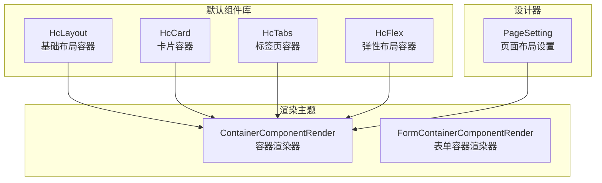
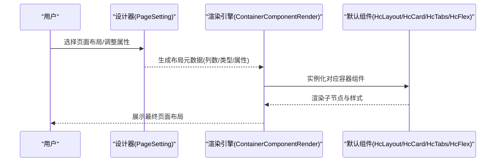
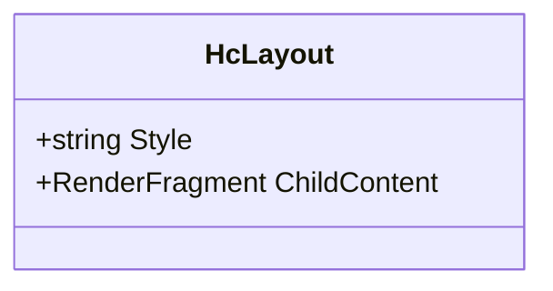
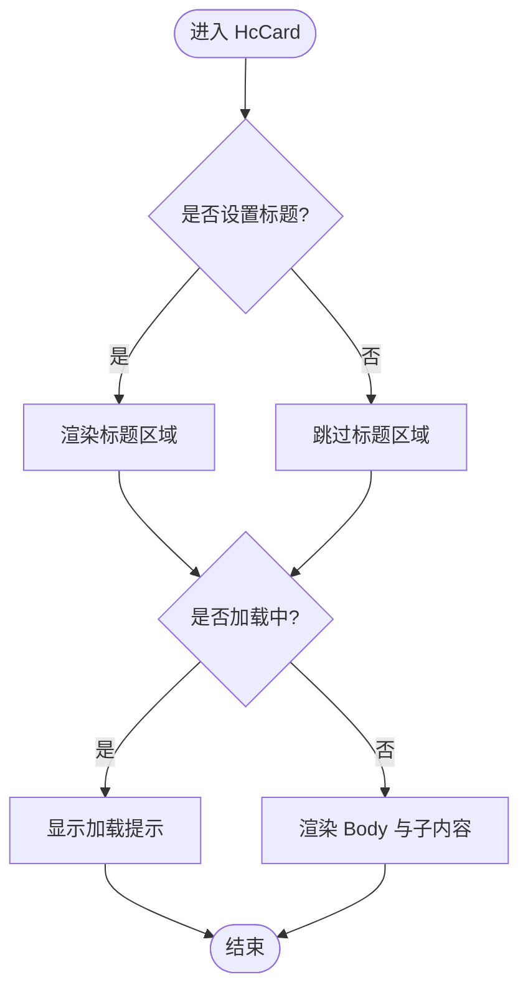
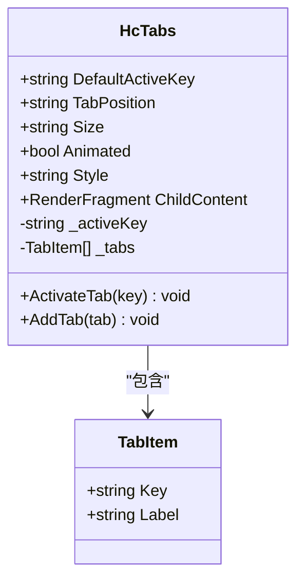
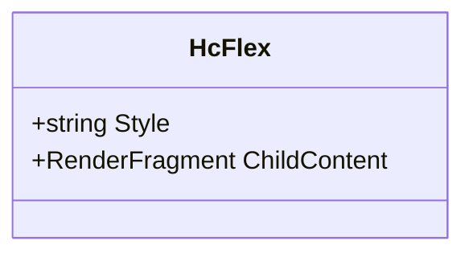
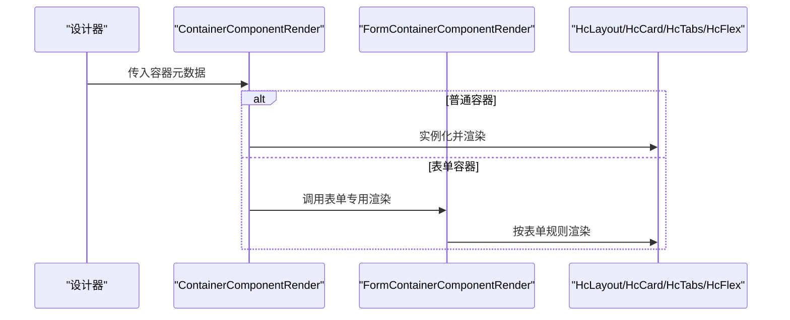
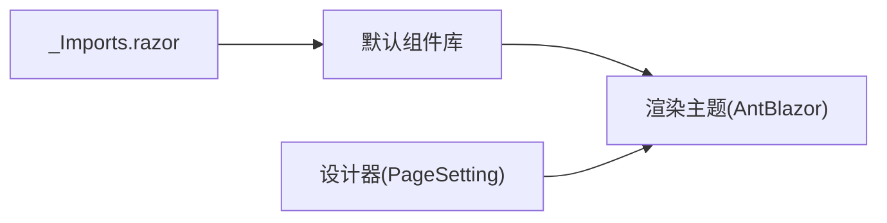

# 容器组件

<cite>
**本文引用的文件**   
- [HcLayout.razor](file://src/LowCode/Common/H.LowCode.Components/Components/HcLayout.razor)
- [HcCard.razor](file://src/LowCode/Common/H.LowCode.Components/Components/HcCard.razor)
- [HcTabs.razor](file://src/LowCode/Common/H.LowCode.Components/Components/HcTabs.razor)
- [HcFlex.razor](file://src/LowCode/Common/H.LowCode.Components/Components/HcFlex.razor)
- [ContainerComponentRender.razor](file://src/LowCode/RenderEngine/H.LowCode.RenderEngine/ComponentRender/ContainerComponentRender.razor)
- [FormContainerComponentRender.razor](file://src/LowCode/RenderEngine/H.LowCode.RenderEngine/ComponentRender/FormContainerComponentRender.azur)
- [PageSetting.razor](file://src/LowCode/DesignEngine/H.LowCode.DesignEngine/SettingPanel/PageSetting.razor)
- [_Imports.razor](file://src/LowCode/Common/H.LowCode.Components/_Imports.razor)
</cite>

## 目录
1. [简介](#简介)
2. [项目结构](#项目结构)
3. [核心组件](#核心组件)
4. [架构总览](#架构总览)
5. [详细组件分析](#详细组件分析)
6. [依赖关系分析](#依赖关系分析)
7. [性能考虑](#性能考虑)
8. [故障排查指南](#故障排查指南)
9. [结论](#结论)
10. [附录](#附录)

## 简介
本文件面向低代码平台的“容器类组件”，聚焦卡片、布局、标签页、栅格系统与弹性布局等能力，系统阐述其嵌套结构、属性配置、响应式断点与自定义布局方案。文档同时提供复杂页面布局构建示例与最佳实践，并给出布局性能优化技巧与移动端适配策略，帮助读者快速掌握在低代码环境中高效搭建高质量页面的方法。

## 项目结构
容器组件主要位于默认组件库与渲染主题中：
- 默认组件库（通用实现）：H.LowCode.Components
- 渲染引擎主题（Ant Design Blazor 风格）：H.LowCode.RenderEngine
- 设计器设置面板（页面布局配置入口）：H.LowCode.DesignEngine

图表来源 
- [HcLayout.razor:1-11](file://src/LowCode/Common/H.LowCode.Components/Components/HcLayout.razor#L1-L11)
- [HcCard.razor:1-31](file://src/LowCode/Common/H.LowCode.Components/Components/HcCard.razor#L1-L31)
- [HcTabs.razor:1-59](file://src/LowCode/Common/H.LowCode.Components/Components/HcTabs.razor#L1-L59)
- [HcFlex.razor:1-11](file://src/LowCode/Common/H.LowCode.Components/Components/HcFlex.razor#L1-L11)
- [ContainerComponentRender.razor](file://src/LowCode/RenderEngine/H.LowCode.RenderEngine/ComponentRender/ContainerComponentRender.razor)
- [FormContainerComponentRender.razor](file://src/LowCode/RenderEngine/H.LowCode.RenderEngine/ComponentRender/FormContainerComponentRender.razor)
- [PageSetting.razor:1-21](file://src/LowCode/DesignEngine/H.LowCode.DesignEngine/SettingPanel/PageSetting.razor#L1-L21)

章节来源
- [HcLayout.razor:1-11](file://src/LowCode/Common/H.LowCode.Components/Components/HcLayout.razor#L1-L11)
- [HcCard.razor:1-31](file://src/LowCode/Common/H.LowCode.Components/Components/HcCard.razor#L1-L31)
- [HcTabs.razor:1-59](file://src/LowCode/Common/H.LowCode.Components/Components/HcTabs.razor#L1-L59)
- [HcFlex.razor:1-11](file://src/LowCode/Common/H.LowCode.Components/Components/HcFlex.razor#L1-L11)
- [ContainerComponentRender.razor](file://src/LowCode/RenderEngine/H.LowCode.RenderEngine/ComponentRender/ContainerComponentRender.razor)
- [FormContainerComponentRender.razor](file://src/LowCode/RenderEngine/H.LowCode.RenderEngine/ComponentRender/FormContainerComponentRender.razor)
- [PageSetting.razor:1-21](file://src/LowCode/DesignEngine/H.LowCode.DesignEngine/SettingPanel/PageSetting.razor#L1-L21)

## 核心组件
- HcLayout：最基础的布局容器，用于承载子内容并提供统一的样式控制。
- HcCard：卡片容器，支持标题、边框、悬停、加载态与内容区域样式。
- HcTabs：标签页容器，支持默认激活项、位置、尺寸、动画与动态添加标签。
- HcFlex：弹性布局容器，基于 Flex 模型，便于横向/纵向排列与对齐。

这些组件共同构成低代码页面布局的“原子”能力，可自由组合形成更复杂的布局结构。

章节来源
- [HcLayout.razor:1-11](file://src/LowCode/Common/H.LowCode.Components/Components/HcLayout.razor#L1-L11)
- [HcCard.razor:1-31](file://src/LowCode/Common/H.LowCode.Components/Components/HcCard.razor#L1-L31)
- [HcTabs.razor:1-59](file://src/LowCode/Common/H.LowCode.Components/Components/HcTabs.razor#L1-L59)
- [HcFlex.razor:1-11](file://src/LowCode/Common/H.LowCode.Components/Components/HcFlex.razor#L1-L11)

## 架构总览
容器组件在设计器中通过属性面板配置，在渲染引擎中被统一渲染为具体 UI。典型流程如下：

图表来源 
- [PageSetting.razor:1-21](file://src/LowCode/DesignEngine/H.LowCode.DesignEngine/SettingPanel/PageSetting.razor#L1-L21)
- [ContainerComponentRender.razor](file://src/LowCode/RenderEngine/H.LowCode.RenderEngine/ComponentRender/ContainerComponentRender.razor)
- [HcLayout.razor:1-11](file://src/LowCode/Common/H.LowCode.Components/Components/HcLayout.razor#L1-L11)
- [HcCard.razor:1-31](file://src/LowCode/Common/H.LowCode.Components/Components/HcCard.razor#L1-L31)
- [HcTabs.razor:1-59](file://src/LowCode/Common/H.LowCode.Components/Components/HcTabs.razor#L1-L59)
- [HcFlex.razor:1-11](file://src/LowCode/Common/H.LowCode.Components/Components/HcFlex.razor#L1-L11)

## 详细组件分析

### HcLayout（基础布局容器）
- 职责：提供最小化的布局容器，承载任意子内容，并通过 Style 参数注入样式。
- 关键属性：Style（样式字符串）、ChildContent（子内容）。
- 使用建议：作为页面或区块的最外层容器，配合其他容器组件进行嵌套。

图表来源 
- [HcLayout.razor:1-11](file://src/LowCode/Common/H.LowCode.Components/Components/HcLayout.razor#L1-L11)

章节来源
- [HcLayout.razor:1-11](file://src/LowCode/Common/H.LowCode.Components/Components/HcLayout.razor#L1-L11)

### HcCard（卡片容器）
- 职责：以卡片形式组织内容，支持标题、边框、悬停、加载状态与内容区样式。
- 关键属性：Title、Bordered、Hoverable、Loading、Style、BodyStyle、ChildContent。
- 交互逻辑：Loading 时显示占位提示；否则渲染子内容。

图表来源 
- [HcCard.razor:1-31](file://src/LowCode/Common/H.LowCode.Components/Components/HcCard.razor#L1-L31)

章节来源
- [HcCard.razor:1-31](file://src/LowCode/Common/H.LowCode.Components/Components/HcCard.razor#L1-L31)

### HcTabs（标签页容器）
- 职责：提供多标签页切换能力，支持默认激活项、位置、尺寸、动画与动态添加标签。
- 关键属性：DefaultActiveKey、TabPosition、Size、Animated、Style、ChildContent。
- 内部状态：_activeKey、_tabs（标签列表），提供 AddTab 方法动态扩展。

图表来源 
- [HcTabs.razor:1-59](file://src/LowCode/Common/H.LowCode.Components/Components/HcTabs.razor#L1-L59)

章节来源
- [HcTabs.razor:1-59](file://src/LowCode/Common/H.LowCode.Components/Components/HcTabs.razor#L1-L59)

### HcFlex（弹性布局容器）
- 职责：基于 Flex 模型的弹性布局容器，便于灵活排列与对齐子元素。
- 关键属性：Style、ChildContent。
- 使用建议：与 HcLayout/HcCard/HcTabs 组合，构建行/列、间距与对齐效果。

图表来源 
- [HcFlex.razor:1-11](file://src/LowCode/Common/H.LowCode.Components/Components/HcFlex.razor#L1-L11)

章节来源
- [HcFlex.razor:1-11](file://src/LowCode/Common/H.LowCode.Components/Components/HcFlex.razor#L1-L11)

### 渲染引擎中的容器渲染
- ContainerComponentRender：负责将容器组件渲染到页面，根据元数据决定渲染顺序与样式。
- FormContainerComponentRender：针对表单场景的容器渲染，适配表单布局与字段排列。

图表来源 
- [ContainerComponentRender.razor](file://src/LowCode/RenderEngine/H.LowCode.RenderEngine/ComponentRender/ContainerComponentRender.razor)
- [FormContainerComponentRender.razor](file://src/LowCode/RenderEngine/H.LowCode.RenderEngine/ComponentRender/FormContainerComponentRender.razor)

章节来源
- [ContainerComponentRender.razor](file://src/LowCode/RenderEngine/H.LowCode.RenderEngine/ComponentRender/ContainerComponentRender.razor)
- [FormContainerComponentRender.razor](file://src/LowCode/RenderEngine/H.LowCode.RenderEngine/ComponentRender/FormContainerComponentRender.razor)

## 依赖关系分析
- 组件库与主题分离：默认组件库提供通用实现，渲染主题负责样式与行为增强。
- 设计器与渲染器解耦：设计器仅输出元数据，渲染器负责解析与渲染。
- 导入与命名空间：_Imports.razor 集中引入常用命名空间，降低组件间耦合。

图表来源 
- [_Imports.razor:1-10](file://src/LowCode/Common/H.LowCode.Components/_Imports.razor#L1-L10)
- [PageSetting.razor:1-21](file://src/LowCode/DesignEngine/H.LowCode.DesignEngine/SettingPanel/PageSetting.razor#L1-L21)

章节来源
- [_Imports.razor:1-10](file://src/LowCode/Common/H.LowCode.Components/_Imports.razor#L1-L10)
- [PageSetting.razor:1-21](file://src/LowCode/DesignEngine/H.LowCode.DesignEngine/SettingPanel/PageSetting.razor#L1-L21)

## 性能考虑
- 减少不必要的重渲染：仅在必要时机更新 StateHasChanged，避免频繁触发标签页或卡片的重新渲染。
- 懒加载与按需渲染：对大体积子内容采用延迟加载，提升首屏性能。
- 样式合并与复用：尽量复用 Style 与公共样式类，减少重复计算与 DOM 操作。
- 事件节流：对高频交互（如拖拽、滚动）进行节流或防抖处理。
- 移动端适配：优先使用弹性布局与流式网格，结合媒体查询与响应式断点，确保在不同屏幕尺寸下的可读性与可用性。

[本节为通用指导，不直接分析具体文件]

## 故障排查指南
- 标签页未激活或切换异常：检查 DefaultActiveKey 是否与某个 TabItem.Key 一致；确认 ActivateTab 被正确调用。
- 卡片加载态不消失：确认 Loading 属性是否正确更新；确保异步数据加载完成后重置状态。
- 弹性布局失效：检查父容器是否设置了合适的宽高与 display:flex；确认子元素的 flex 属性是否冲突。
- 渲染主题未生效：确认 ContainerComponentRender/FormContainerComponentRender 已注册并被调用；检查命名空间导入是否完整。

章节来源
- [HcTabs.razor:1-59](file://src/LowCode/Common/H.LowCode.Components/Components/HcTabs.razor#L1-L59)
- [HcCard.razor:1-31](file://src/LowCode/Common/H.LowCode.Components/Components/HcCard.razor#L1-L31)
- [HcFlex.razor:1-11](file://src/LowCode/Common/H.LowCode.Components/Components/HcFlex.razor#L1-L11)
- [ContainerComponentRender.razor](file://src/LowCode/RenderEngine/H.LowCode.RenderEngine/ComponentRender/ContainerComponentRender.razor)
- [FormContainerComponentRender.razor](file://src/LowCode/RenderEngine/H.LowCode.RenderEngine/ComponentRender/FormContainerComponentRender.razor)

## 结论
HcLayout、HcCard、HcTabs、HcFlex 构成了低代码平台容器体系的核心，具备高内聚、低耦合、易扩展的特点。通过设计器与渲染引擎的解耦，开发者可以灵活组合这些原子能力，快速搭建复杂页面布局。遵循本文的最佳实践与性能优化建议，可在保证用户体验的同时提升开发效率与系统稳定性。

[本节为总结性内容，不直接分析具体文件]

## 附录
- 复杂页面布局构建示例（思路）
  - 首页仪表盘：HcLayout 包裹 HcCard，多个 HcCard 通过 HcFlex 横向排列；顶部使用 HcTabs 切换不同视图。
  - 表单页：使用 FormContainerComponentRender 渲染表单容器，字段按列布局，结合响应式断点实现移动端单列显示。
  - 数据看板：HcLayout 作为根容器，内部用 HcFlex 划分左右区域，左侧为导航，右侧为多个 HcCard 组成的网格。
- 栅格系统与自定义布局方案
  - 栅格：通过 HcFlex 与 CSS Grid 结合，实现自动换行与自适应列宽。
  - 自定义布局：在 HcLayout 中注入自定义 Style，或使用主题层覆盖默认样式，满足特殊业务需求。
- 响应式断点设置
  - 在小屏设备上优先使用垂直堆叠布局，在大屏设备上启用多列布局。
  - 利用媒体查询与容器宽度检测，动态调整 HcFlex 的排列方向与间距。

[本节为概念性内容，不直接分析具体文件]