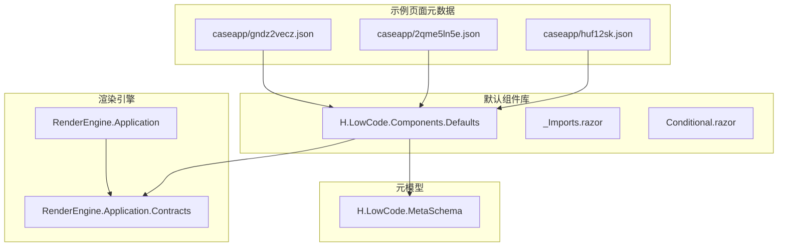
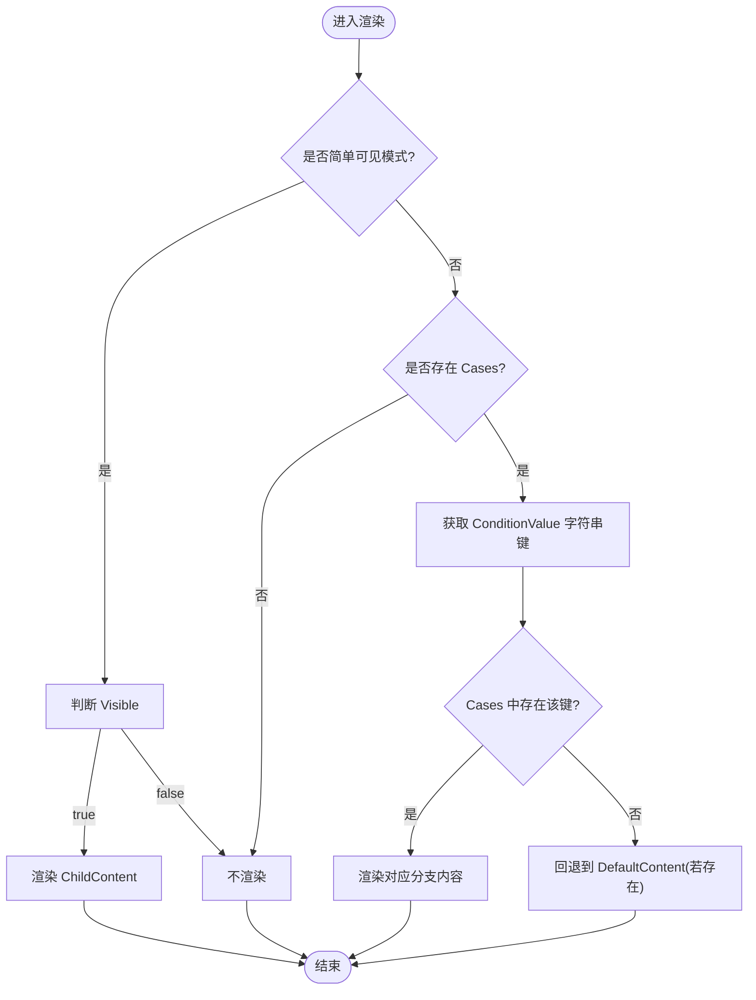
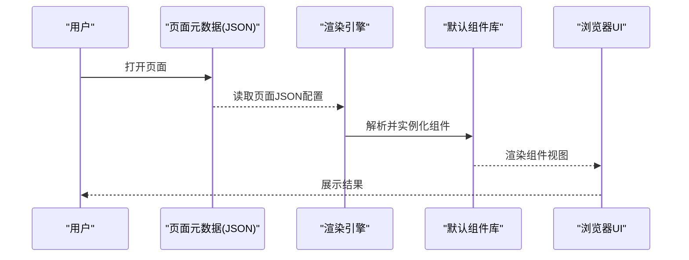
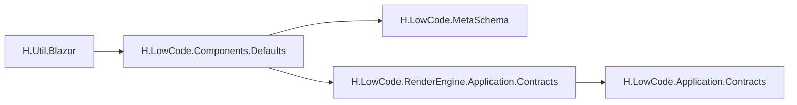

# 展示组件

<cite>
**本文引用的文件**
- [H.LowCode.Components.Defaults.csproj](file://src/LowCode/Common/H.LowCode.Components.Defaults/H.LowCode.Components.Defaults.csproj)
- [_Imports.razor](file://src/LowCode/Common/H.LowCode.Components.Defaults/_Imports.razor)
- [Conditional.razor](file://src/LowCode/Common/H.LowCode.Components.Defaults/Components/Conditional.razor)
- [huf12sk.json](file://src/LowCode/meta/apps/caseapp/page/huf12sk.json)
- [2qme5ln5e.json](file://src/LowCode/meta/apps/caseapp/page/2qme5ln5e.json)
- [gndz2vecz.json](file://src/LowCode/meta/apps/caseapp/page/gndz2vecz.json)
</cite>

## 目录
1. [简介](#简介)
2. [项目结构](#项目结构)
3. [核心组件](#核心组件)
4. [架构总览](#架构总览)
5. [详细组件分析](#详细组件分析)
6. [依赖关系分析](#依赖关系分析)
7. [性能考虑](#性能考虑)
8. [故障排查指南](#故障排查指南)
9. [结论](#结论)
10. [附录](#附录)

## 简介
本文件面向低代码平台的“数据展示类”组件，覆盖表格、树形控件、统计信息、列表、标签、图片等常见展示场景。重点说明：
- 表格的列配置、排序与筛选、分页处理、虚拟滚动等高级能力
- 树形组件的数据结构定义、节点操作与异步加载机制
- 大数据量展示的性能优化方案与响应式实现
- 数据可视化最佳实践与用户体验优化建议

为便于理解，文档同时给出基于仓库现有元数据与默认组件的实现映射，帮助读者将抽象能力落地到具体页面与组件中。

## 项目结构
本项目采用多模块组织方式，展示组件主要位于 LowCode 公共组件库与渲染引擎相关工程中。与展示组件直接相关的工程包括：
- H.LowCode.Components.Defaults：默认展示组件集合（如条件渲染等基础能力）
- H.LowCode.MetaSchema：组件与数据源的元模型定义
- H.LowCode.RenderEngine.*：渲染引擎与运行时装配
- meta/apps/*：示例应用页面元数据（包含表格、卡片、输入等组件的声明式配置）

图表来源
- [H.LowCode.Components.Defaults.csproj:1-16](file://src/LowCode/Common/H.LowCode.Components.Defaults/H.LowCode.Components.Defaults.csproj#L1-L16)
- [_Imports.razor:1-10](file://src/LowCode/Common/H.LowCode.Components.Defaults/_Imports.razor#L1-L10)
- [huf12sk.json:1-31](file://src/LowCode/meta/apps/caseapp/page/huf12sk.json#L1-L31)
- [2qme5ln5e.json:69-544](file://src/LowCode/meta/apps/caseapp/page/2qme5ln5e.json#L69-L544)
- [gndz2vecz.json:98-152](file://src/LowCode/meta/apps/caseapp/page/gndz2vecz.json#L98-L152)

章节来源
- [H.LowCode.Components.Defaults.csproj:1-16](file://src/LowCode/Common/H.LowCode.Components.Defaults/H.LowCode.Components.Defaults.csproj#L1-L16)
- [_Imports.razor:1-10](file://src/LowCode/Common/H.LowCode.Components.Defaults/_Imports.razor#L1-L10)

## 核心组件
本节聚焦默认组件库中的关键展示能力，并以条件渲染为例说明组件的参数化与渲染逻辑。

- 条件渲染组件（Conditional）
  - 功能要点：根据 ConditionValue 匹配 Cases 字典键值，渲染对应分支内容；未匹配时回退至 DefaultContent；亦支持简单的 Visible 控制 ChildContent 显示/隐藏
  - 参数说明：ConditionValue、Cases、DefaultContent、ChildContent、Visible
  - 使用场景：按状态或类型切换不同展示模板（如表格行内详情、统计卡片主题切换）

图表来源
- [Conditional.razor:1-77](file://src/LowCode/Common/H.LowCode.Components.Defaults/Components/Conditional.razor#L1-L77)

章节来源
- [Conditional.razor:1-77](file://src/LowCode/Common/H.LowCode.Components.Defaults/Components/Conditional.razor#L1-L77)

## 架构总览
低代码展示组件的整体工作流由“元数据驱动 + 渲染引擎装配 + 默认组件库实现”构成。页面通过 JSON 元数据声明组件及其属性，渲染引擎解析并实例化对应的 Blazor 组件，最终在浏览器中呈现。

图表来源
- [huf12sk.json:1-31](file://src/LowCode/meta/apps/caseapp/page/huf12sk.json#L1-L31)
- [2qme5ln5e.json:69-544](file://src/LowCode/meta/apps/caseapp/page/2qme5ln5e.json#L69-L544)
- [gndz2vecz.json:98-152](file://src/LowCode/meta/apps/caseapp/page/gndz2vecz.json#L98-L152)

## 详细组件分析

### 表格组件（Table）
- 能力概览
  - 列配置：通过元数据声明列名、标题、宽度、对齐、格式化器等
  - 排序与筛选：支持列级排序、文本/数值/日期筛选，可组合查询
  - 分页处理：服务端分页或客户端分页，支持页大小与跳转
  - 虚拟滚动：大数据量下仅渲染可视区域行，提升滚动性能
- 元数据映射
  - 示例页面 huf12sk.json 中包含 partsId 为 table 的组件声明，体现表格在页面中的嵌入位置与样式配置
- 使用建议
  - 大数据集优先启用服务端分页与虚拟滚动
  - 列宽自适应与固定列结合，保证可读性
  - 对敏感字段进行脱敏或掩码展示

章节来源
- [huf12sk.json:1-31](file://src/LowCode/meta/apps/caseapp/page/huf12sk.json#L1-L31)

### 树形控件（Tree）
- 数据结构定义
  - 节点通常包含 id、parentId、name、children、扩展属性等
  - 支持层级展开/折叠、多选、拖拽排序
- 节点操作
  - 增删改查、批量操作、右键菜单
  - 节点选中态与高亮反馈
- 异步加载机制
  - 懒加载子节点，按需请求后端接口
  - 缓存已加载节点，避免重复请求
- 使用建议
  - 首屏只加载根节点或部分一级节点
  - 对深层树提供搜索定位与快速跳转
  - 大节点数时使用虚拟滚动或分页加载

章节来源
- 无直接源码文件引用（概念性说明）

### 统计信息（Statistics）
- 能力概览
  - 指标卡、趋势图、同比环比、阈值告警
  - 支持动态刷新与自动轮询
- 使用建议
  - 聚合计算尽量在服务端完成，前端只做展示
  - 图表尺寸随容器自适应，移动端简化展示

章节来源
- 无直接源码文件引用（概念性说明）

### 列表（List）
- 能力概览
  - 单列/多列布局、卡片/行模式切换
  - 排序、筛选、分页、虚拟化
- 使用建议
  - 列表项高度固定以提升滚动性能
  - 图片等资源使用懒加载与占位图

章节来源
- 无直接源码文件引用（概念性说明）

### 标签（Tag）
- 能力概览
  - 颜色、形状、可关闭、点击事件
  - 用于状态标识、分类过滤、快捷选择
- 使用建议
  - 标签数量过多时提供“更多”折叠
  - 颜色需满足对比度与无障碍要求

章节来源
- 无直接源码文件引用（概念性说明）

### 图片（Image）
- 能力概览
  - 缩放、裁剪、懒加载、错误占位
  - 支持缩略图与大图预览
- 使用建议
  - 使用合适的 CDN 与格式（WebP/AVIF）
  - 设置宽高避免重排

章节来源
- 无直接源码文件引用（概念性说明）

### 条件渲染组件（Conditional）
- 能力概览
  - 根据条件值匹配分支内容，或基于 Visible 控制显示/隐藏
- 使用建议
  - 复杂分支建议使用 Cases 字典管理，保持可读性
  - 简单开关场景使用 Visible 更简洁

章节来源
- [Conditional.razor:1-77](file://src/LowCode/Common/H.LowCode.Components.Defaults/Components/Conditional.razor#L1-L77)

## 依赖关系分析
默认组件库与元模型、渲染引擎之间的依赖关系如下：

图表来源
- [H.LowCode.Components.Defaults.csproj:1-16](file://src/LowCode/Common/H.LowCode.Components.Defaults/H.LowCode.Components.Defaults.csproj#L1-L16)

章节来源
- [H.LowCode.Components.Defaults.csproj:1-16](file://src/LowCode/Common/H.LowCode.Components.Defaults/H.LowCode.Components.Defaults.csproj#L1-L16)

## 性能考虑
- 表格与列表
  - 启用虚拟滚动，限制一次性渲染行数
  - 服务端分页与筛选，减少数据传输
  - 固定列宽与行高，降低重排重绘
- 树形控件
  - 懒加载子节点，避免首屏阻塞
  - 缓存已展开节点，减少重复请求
- 图片与媒体
  - 懒加载与占位图，按需加载
  - 使用合适尺寸与格式，CDN 加速
- 渲染与更新
  - 合并状态更新，减少不必要的重渲染
  - 使用不可变数据与浅比较，提高 Diff 效率
- 响应式设计
  - 栅格布局适配不同屏幕
  - 移动端简化交互与展示密度

[本节为通用指导，无需源码引用]

## 故障排查指南
- 条件渲染未生效
  - 检查 ConditionValue 与 Cases 键是否一致
  - 确认 DefaultContent 与 ChildContent 的使用场景
- 表格数据不显示
  - 核对元数据中 partsId 与组件注册
  - 检查数据源绑定与分页参数
- 树形节点无法展开
  - 确认懒加载接口返回结构与缓存策略
  - 检查父节点 id 与子节点 parentId 关联
- 图片加载失败
  - 检查资源路径与跨域策略
  - 设置错误占位图与重试机制

章节来源
- [Conditional.razor:1-77](file://src/LowCode/Common/H.LowCode.Components.Defaults/Components/Conditional.razor#L1-L77)

## 结论
本仓库通过元数据驱动的渲染架构，将展示组件的能力抽象为可配置的 JSON 描述，并由默认组件库与渲染引擎协同实现。针对表格、树形、统计、列表、标签、图片等展示场景，提供了从列配置、排序筛选、分页到虚拟滚动的完整能力链。结合性能优化与响应式设计实践，可在大数据量与多终端环境下获得良好的用户体验。

[本节为总结性内容，无需源码引用]

## 附录
- 示例页面元数据参考
  - 表格嵌入示例：huf12sk.json
  - 表单与卡片组合示例：2qme5ln5e.json
  - 多标签页表单示例：gndz2vecz.json

章节来源
- [huf12sk.json:1-31](file://src/LowCode/meta/apps/caseapp/page/huf12sk.json#L1-L31)
- [2qme5ln5e.json:69-544](file://src/LowCode/meta/apps/caseapp/page/2qme5ln5e.json#L69-L544)
- [gndz2vecz.json:98-152](file://src/LowCode/meta/apps/caseapp/page/gndz2vecz.json#L98-L152)