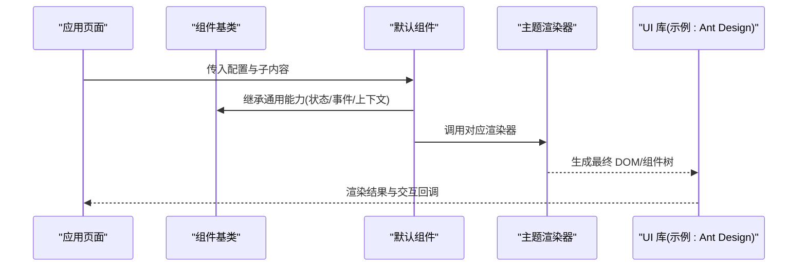
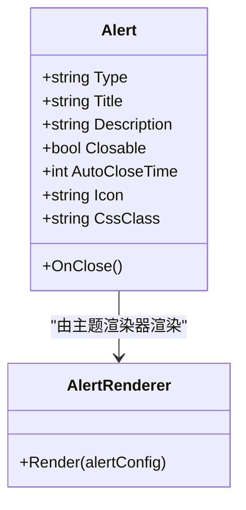
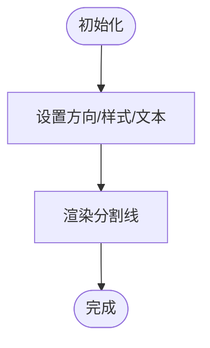
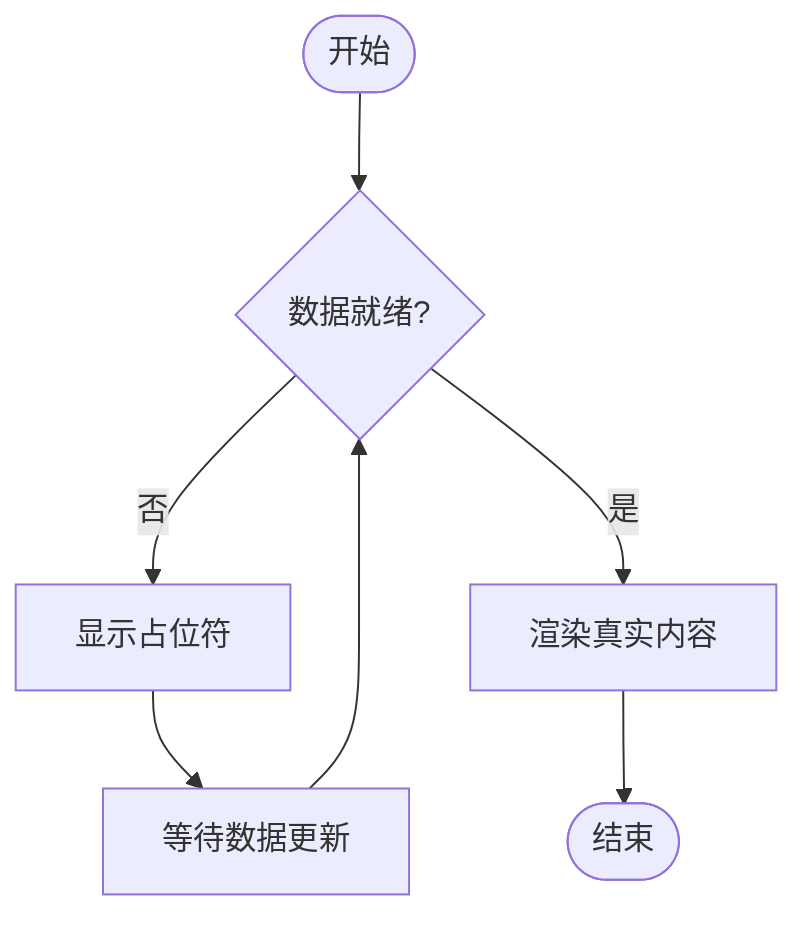
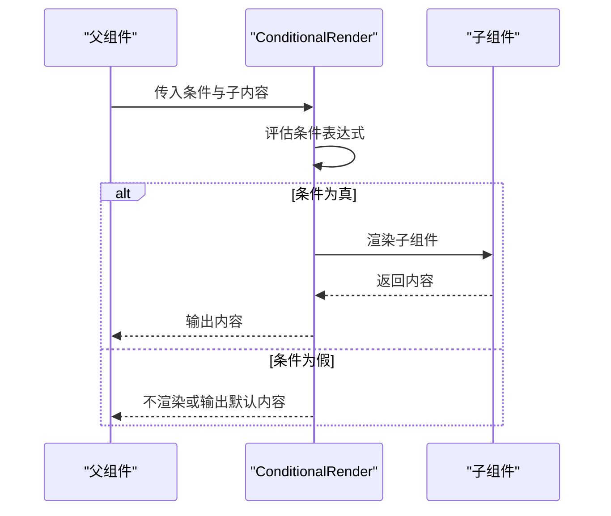
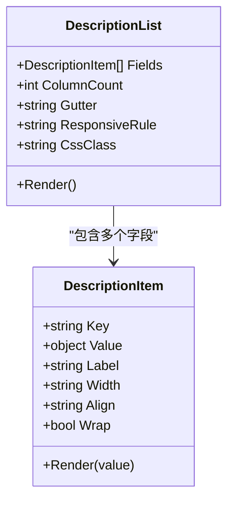
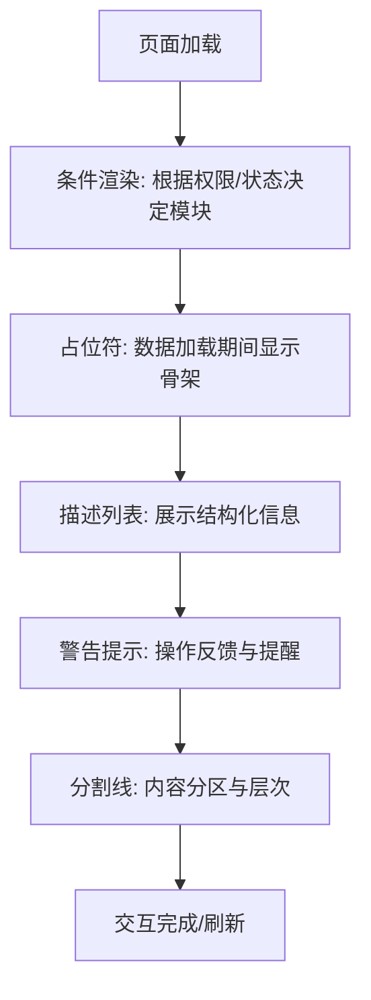
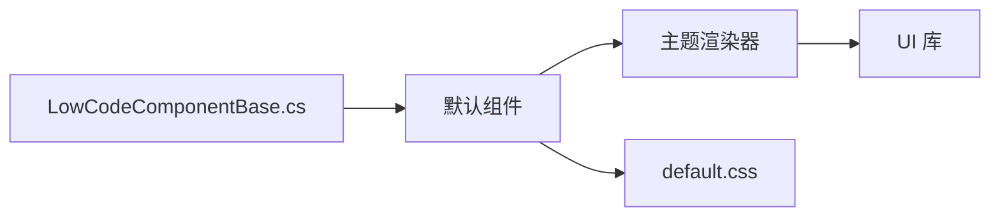

# 工具组件

<cite>
**本文引用的文件**   
- [H.LowCode.Components.Defaults.csproj](file://src/LowCode/Common/H.LowCode.Components.Defaults/H.LowCode.Components.Defaults.csproj)
- [Components/Alert.razor](file://src/LowCode/Common/H.LowCode.Components.Defaults/Components/Alert.razor)
- [Components/Divider.razor](file://src/LowCode/Common/H.LowCode.Components.Defaults/Components/Divider.razor)
- [Components/Placeholder.razor](file://src/LowCode/Common/H.LowCode.Components.Defaults/Components/Placeholder.razor)
- [Components/ConditionalRender.razor](file://src/LowCode/Common/H.LowCode.Components.Defaults/Components/ConditionalRender.razor)
- [Components/DescriptionList.razor](file://src/LowCode/Common/H.LowCode.Components.Defaults/Components/DescriptionList.razor)
- [ExtraComponents/Alert.razor](file://src/LowCode/Common/H.LowCode.Components.Defaults/ExtraComponents/Alert.razor)
- [ExtraComponents/Divider.razor](file://src/LowCode/Common/H.LowCode.Components.Defaults/ExtraComponents/Divider.razor)
- [wwwroot/css/default.css](file://src/LowCode/Common/H.LowCode.Components.Defaults/wwwroot/css/default.css)
- [LowCodeComponentBase.cs](file://src/LowCode/Common/H.LowCode.ComponentBase/LowCodeComponentBase.cs)
- [LowCodeDynamicComponentBase.cs](file://src/LowCode/Common/H.LowCode.ComponentBase/LowCodeDynamicComponentBase.cs)
- [LowCodeLayoutComponentBase.cs](file://src/LowCode/Common/H.LowCode.ComponentBase/LowCodeLayoutComponentBase.cs)
- [LowCodePageComponentBase.cs](file://src/LowCode/Common/H.LowCode.ComponentBase/LowCodePageComponentBase.cs)
- [AntBlazorThemeModule.cs](file://src/LowCode/RenderEngine/H.LowCode.Themes.AntBlazor/AntBlazorThemeModule.cs)
- [ComponentRender/AlertRenderer.cs](file://src/LowCode/RenderEngine/H.LowCode.Themes.AntBlazor/ComponentRender/AlertRenderer.cs)
- [ComponentRender/DividerRenderer.cs](file://src/LowCode/RenderEngine/H.LowCode.Themes.AntBlazor/ComponentRender/DividerRenderer.cs)
- [ComponentRender/PlaceholderRenderer.cs](file://src/LowCode/RenderEngine/H.LowCode.Themes.AntBlazor/ComponentRender/PlaceholderRenderer.cs)
- [ComponentRender/ConditionalRenderRenderer.cs](file://src/LowCode/RenderEngine/H.LowCode.Themes.AntBlazor/ComponentRender/ConditionalRenderRenderer.cs)
- [ComponentRender/DescriptionListRenderer.cs](file://src/LowCode/RenderEngine/H.LowCode.Themes.AntBlazor/ComponentRender/DescriptionListRenderer.cs)
</cite>

## 目录
1. [简介](#简介)
2. [项目结构](#项目结构)
3. [核心组件](#核心组件)
4. [架构总览](#架构总览)
5. [详细组件分析](#详细组件分析)
6. [依赖关系分析](#依赖关系分析)
7. [性能考虑](#性能考虑)
8. [故障排查指南](#故障排查指南)
9. [结论](#结论)
10. [附录](#附录)

## 简介
本文件面向低代码平台的“辅助性工具组件”，聚焦以下能力：警告提示、分割线、占位符、条件渲染、描述列表。文档将系统阐述各组件的功能与使用场景，配置项与显示控制方式，样式定制方法；并深入讲解条件渲染组件的逻辑控制与动态内容展示机制，以及描述列表的字段配置与响应式布局策略。同时提供组件组合的最佳实践与性能优化建议，帮助开发者在低代码场景中高效构建稳定、可维护的前端界面。

## 项目结构
低代码工具组件主要位于默认组件包与主题渲染层：
- 默认实现：H.LowCode.Components.Defaults（包含基础组件与扩展组件）
- 主题渲染：H.LowCode.Themes.AntBlazor（基于 Ant Design Blazor 的渲染器）
- 组件基类：H.LowCode.ComponentBase（统一基类与上下文能力）

```mermaid
graph TB
subgraph "默认组件包"
Defaults["H.LowCode.Components.Defaults"]
AlertD["Alert.razor"]
DividerD["Divider.razor"]
PlaceholderD["Placeholder.razor"]
ConditionalD["ConditionalRender.razor"]
DescD["DescriptionList.razor"]
ExtraA["Extra/Alert.razor"]
ExtraDiv["Extra/Divider.razor"]
CSS["default.css"]
end
subgraph "主题渲染层"
Theme["H.LowCode.Themes.AntBlazor"]
Module["AntBlazorThemeModule.cs"]
RAlert["AlertRenderer.cs"]
RDivider["DividerRenderer.cs"]
RPlaceholder["PlaceholderRenderer.cs"]
RConditional["ConditionalRenderRenderer.cs"]
RDesc["DescriptionListRenderer.cs"]
end
subgraph "组件基类"
Base["LowCodeComponentBase.cs"]
Dynamic["LowCodeDynamicComponentBase.cs"]
Layout["LowCodeLayoutComponentBase.cs"]
Page["LowCodePageComponentBase.cs"]
end
Defaults --> Theme
Theme --> Module
Theme --> RAlert
Theme --> RDivider
Theme --> RPlaceholder
Theme --> RConditional
Theme --> RDesc
Defaults --> Base
Defaults --> Dynamic
Defaults --> Layout
Defaults --> Page
Defaults --> CSS
```

图表来源
- [H.LowCode.Components.Defaults.csproj](file://src/LowCode/Common/H.LowCode.Components.Defaults/H.LowCode.Components.Defaults.csproj)
- [Alert.razor](file://src/LowCode/Common/H.LowCode.Components.Defaults/Components/Alert.razor)
- [Divider.razor](file://src/LowCode/Common/H.LowCode.Components.Defaults/Components/Divider.razor)
- [Placeholder.razor](file://src/LowCode/Common/H.LowCode.Components.Defaults/Components/Placeholder.razor)
- [ConditionalRender.razor](file://src/LowCode/Common/H.LowCode.Components.Defaults/Components/ConditionalRender.razor)
- [DescriptionList.razor](file://src/LowCode/Common/H.LowCode.Components.Defaults/Components/DescriptionList.razor)
- [Alert.razor](file://src/LowCode/Common/H.LowCode.Components.Defaults/ExtraComponents/Alert.razor)
- [Divider.razor](file://src/LowCode/Common/H.LowCode.Components.Defaults/ExtraComponents/Divider.razor)
- [default.css](file://src/LowCode/Common/H.LowCode.Components.Defaults/wwwroot/css/default.css)
- [AntBlazorThemeModule.cs](file://src/LowCode/RenderEngine/H.LowCode.Themes.AntBlazor/AntBlazorThemeModule.cs)
- [AlertRenderer.cs](file://src/LowCode/RenderEngine/H.LowCode.Themes.AntBlazor/ComponentRender/AlertRenderer.cs)
- [DividerRenderer.cs](file://src/LowCode/RenderEngine/H.LowCode.Themes.AntBlazor/ComponentRender/DividerRenderer.cs)
- [PlaceholderRenderer.cs](file://src/LowCode/RenderEngine/H.LowCode.Themes.AntBlazor/ComponentRender/PlaceholderRenderer.cs)
- [ConditionalRenderRenderer.cs](file://src/LowCode/RenderEngine/H.LowCode.Themes.AntBlazor/ComponentRender/ConditionalRenderRenderer.cs)
- [DescriptionListRenderer.cs](file://src/LowCode/RenderEngine/H.LowCode.Themes.AntBlazor/ComponentRender/DescriptionListRenderer.cs)
- [LowCodeComponentBase.cs](file://src/LowCode/Common/H.LowCode.ComponentBase/LowCodeComponentBase.cs)
- [LowCodeDynamicComponentBase.cs](file://src/LowCode/Common/H.LowCode.ComponentBase/LowCodeDynamicComponentBase.cs)
- [LowCodeLayoutComponentBase.cs](file://src/LowCode/Common/H.LowCode.ComponentBase/LowCodeLayoutComponentBase.cs)
- [LowCodePageComponentBase.cs](file://src/LowCode/Common/H.LowCode.ComponentBase/LowCodePageComponentBase.cs)

章节来源
- [H.LowCode.Components.Defaults.csproj](file://src/LowCode/Common/H.LowCode.Components.Defaults/H.LowCode.Components.Defaults.csproj)

## 核心组件
本节概述五类工具组件的职责与典型用法：
- 警告提示（Alert）：用于向用户传达重要信息或反馈操作结果，支持多种类型与关闭行为。
- 分割线（Divider）：用于视觉分隔内容区块，提升信息层次。
- 占位符（Placeholder）：在数据未就绪时提供骨架或提示，改善加载体验。
- 条件渲染（ConditionalRender）：根据表达式或状态动态显示/隐藏子组件或内容。
- 描述列表（DescriptionList）：以键值对形式展示结构化信息，支持响应式列数与自定义渲染。

章节来源
- [Alert.razor](file://src/LowCode/Common/H.LowCode.Components.Defaults/Components/Alert.razor)
- [Divider.razor](file://src/LowCode/Common/H.LowCode.Components.Defaults/Components/Divider.razor)
- [Placeholder.razor](file://src/LowCode/Common/H.LowCode.Components.Defaults/Components/Placeholder.razor)
- [ConditionalRender.razor](file://src/LowCode/Common/H.LowCode.Components.Defaults/Components/ConditionalRender.razor)
- [DescriptionList.razor](file://src/LowCode/Common/H.LowCode.Components.Defaults/Components/DescriptionList.razor)

## 架构总览
低代码平台通过“默认组件 + 主题渲染器”的方式解耦 UI 实现与渲染逻辑。默认组件定义属性与行为契约，主题渲染器负责将其映射到具体 UI 库（如 Ant Design Blazor）。组件基类提供统一的上下文、事件与生命周期能力。

图表来源
- [LowCodeComponentBase.cs](file://src/LowCode/Common/H.LowCode.ComponentBase/LowCodeComponentBase.cs)
- [LowCodeDynamicComponentBase.cs](file://src/LowCode/Common/H.LowCode.ComponentBase/LowCodeDynamicComponentBase.cs)
- [LowCodeLayoutComponentBase.cs](file://src/LowCode/Common/H.LowCode.ComponentBase/LowCodeLayoutComponentBase.cs)
- [LowCodePageComponentBase.cs](file://src/LowCode/Common/H.LowCode.ComponentBase/LowCodePageComponentBase.cs)
- [AntBlazorThemeModule.cs](file://src/LowCode/RenderEngine/H.LowCode.Themes.AntBlazor/AntBlazorThemeModule.cs)
- [AlertRenderer.cs](file://src/LowCode/RenderEngine/H.LowCode.Themes.AntBlazor/ComponentRender/AlertRenderer.cs)
- [DividerRenderer.cs](file://src/LowCode/RenderEngine/H.LowCode.Themes.AntBlazor/ComponentRender/DividerRenderer.cs)
- [PlaceholderRenderer.cs](file://src/LowCode/RenderEngine/H.LowCode.Themes.AntBlazor/ComponentRender/PlaceholderRenderer.cs)
- [ConditionalRenderRenderer.cs](file://src/LowCode/RenderEngine/H.LowCode.Themes.AntBlazor/ComponentRender/ConditionalRenderRenderer.cs)
- [DescriptionListRenderer.cs](file://src/LowCode/RenderEngine/H.LowCode.Themes.AntBlazor/ComponentRender/DescriptionListRenderer.cs)

## 详细组件分析

### 警告提示（Alert）
- 功能与场景：用于成功、警告、错误、信息等类型的消息提示，支持自动关闭、可关闭按钮、图标与附加内容。
- 配置选项（概念说明）：类型、标题、描述、是否可关闭、自动关闭时间、图标、样式类名、事件回调等。
- 显示控制：通过布尔属性控制可见性，或通过事件触发显隐。
- 样式定制：可通过 CSS 覆盖默认样式或使用主题变量；也可通过额外样式类进行局部调整。
- 扩展实现：ExtraComponents 中提供增强版 Alert，便于在不改动默认实现的情况下扩展能力。

图表来源
- [Alert.razor](file://src/LowCode/Common/H.LowCode.Components.Defaults/Components/Alert.razor)
- [AlertRenderer.cs](file://src/LowCode/RenderEngine/H.LowCode.Themes.AntBlazor/ComponentRender/AlertRenderer.cs)

章节来源
- [Alert.razor](file://src/LowCode/Common/H.LowCode.Components.Defaults/Components/Alert.razor)
- [Alert.razor](file://src/LowCode/Common/H.LowCode.Components.Defaults/ExtraComponents/Alert.razor)
- [AlertRenderer.cs](file://src/LowCode/RenderEngine/H.LowCode.Themes.AntBlazor/ComponentRender/AlertRenderer.cs)

### 分割线（Divider）
- 功能与场景：用于划分内容区域，支持水平/垂直方向、虚线/实线、文本标签等。
- 配置选项（概念说明）：方向、样式类型、文本、间距、对齐方式、样式类名等。
- 显示控制：通常静态展示，可通过父级条件渲染控制显隐。
- 样式定制：通过 CSS 类名或主题变量覆盖边框、颜色、间距等。

图表来源
- [Divider.razor](file://src/LowCode/Common/H.LowCode.Components.Defaults/Components/Divider.razor)

章节来源
- [Divider.razor](file://src/LowCode/Common/H.LowCode.Components.Defaults/Components/Divider.razor)
- [Divider.razor](file://src/LowCode/Common/H.LowCode.Components.Defaults/ExtraComponents/Divider.razor)

### 占位符（Placeholder）
- 功能与场景：在数据加载中显示骨架屏或提示文案，提升用户体验。
- 配置选项（概念说明）：占位类型（骨架/文本）、动画效果、宽高、延迟时间、样式类名等。
- 显示控制：与数据加载状态联动，数据就绪后自动切换为真实内容。
- 样式定制：通过 CSS 类名或主题变量覆盖骨架块颜色、圆角、动画时长等。

图表来源
- [Placeholder.razor](file://src/LowCode/Common/H.LowCode.Components.Defaults/Components/Placeholder.razor)

章节来源
- [Placeholder.razor](file://src/LowCode/Common/H.LowCode.Components.Defaults/Components/Placeholder.razor)
- [PlaceholderRenderer.cs](file://src/LowCode/RenderEngine/H.LowCode.Themes.AntBlazor/ComponentRender/PlaceholderRenderer.cs)

### 条件渲染（ConditionalRender）
- 功能与场景：根据表达式或状态动态显示/隐藏子组件或内容片段，常用于权限控制、表单字段显隐、步骤流程控制等。
- 配置选项（概念说明）：条件表达式、默认内容、反向显示、过渡动画、样式类名等。
- 逻辑控制：支持简单布尔判断、复杂表达式、异步状态监听；可在表达式变化时重新评估。
- 动态内容：子组件按需渲染，避免不必要的计算与渲染开销。

图表来源
- [ConditionalRender.razor](file://src/LowCode/Common/H.LowCode.Components.Defaults/Components/ConditionalRender.razor)
- [ConditionalRenderRenderer.cs](file://src/LowCode/RenderEngine/H.LowCode.Themes.AntBlazor/ComponentRender/ConditionalRenderRenderer.cs)

章节来源
- [ConditionalRender.razor](file://src/LowCode/Common/H.LowCode.Components.Defaults/Components/ConditionalRender.razor)
- [ConditionalRenderRenderer.cs](file://src/LowCode/RenderEngine/H.LowCode.Themes.AntBlazor/ComponentRender/ConditionalRenderRenderer.cs)

### 描述列表（DescriptionList）
- 功能与场景：以键值对形式展示结构化信息，适用于详情页、报表摘要、审批信息等。
- 配置选项（概念说明）：字段数组（键、值、标签、宽度、对齐、是否换行、自定义渲染函数）、列数、间距、响应式规则、样式类名等。
- 响应式布局：根据容器宽度自动调整列数与排列方式，确保在不同屏幕尺寸下可读性良好。
- 自定义渲染：支持为特定字段提供自定义渲染函数，灵活处理富文本、链接、状态标签等。

图表来源
- [DescriptionList.razor](file://src/LowCode/Common/H.LowCode.Components.Defaults/Components/DescriptionList.razor)
- [DescriptionListRenderer.cs](file://src/LowCode/RenderEngine/H.LowCode.Themes.AntBlazor/ComponentRender/DescriptionListRenderer.cs)

章节来源
- [DescriptionList.razor](file://src/LowCode/Common/H.LowCode.Components.Defaults/Components/DescriptionList.razor)
- [DescriptionListRenderer.cs](file://src/LowCode/RenderEngine/H.LowCode.Themes.AntBlazor/ComponentRender/DescriptionListRenderer.cs)

### 概念总览
以下为概念性流程图，展示工具组件在低代码页面中的常见组合模式：

[此图为概念流程，不直接映射具体源码文件]

## 依赖关系分析
- 组件与基类：所有默认组件继承自 LowCodeComponentBase 及其派生类，获得统一的上下文、事件与生命周期能力。
- 组件与主题渲染器：默认组件通过主题模块注册渲染器，渲染器将组件配置映射到 UI 库的具体实现。
- 样式资源：默认组件包提供 default.css 作为基础样式，主题层可覆盖或扩展样式。

图表来源
- [LowCodeComponentBase.cs](file://src/LowCode/Common/H.LowCode.ComponentBase/LowCodeComponentBase.cs)
- [LowCodeDynamicComponentBase.cs](file://src/LowCode/Common/H.LowCode.ComponentBase/LowCodeDynamicComponentBase.cs)
- [LowCodeLayoutComponentBase.cs](file://src/LowCode/Common/H.LowCode.ComponentBase/LowCodeLayoutComponentBase.cs)
- [LowCodePageComponentBase.cs](file://src/LowCode/Common/H.LowCode.ComponentBase/LowCodePageComponentBase.cs)
- [default.css](file://src/LowCode/Common/H.LowCode.Components.Defaults/wwwroot/css/default.css)
- [AntBlazorThemeModule.cs](file://src/LowCode/RenderEngine/H.LowCode.Themes.AntBlazor/AntBlazorThemeModule.cs)

章节来源
- [H.LowCode.Components.Defaults.csproj](file://src/LowCode/Common/H.LowCode.Components.Defaults/H.LowCode.Components.Defaults.csproj)
- [AntBlazorThemeModule.cs](file://src/LowCode/RenderEngine/H.LowCode.Themes.AntBlazor/AntBlazorThemeModule.cs)

## 性能考虑
- 条件渲染优化：仅在条件变化时重新评估表达式，避免频繁重渲染；对复杂表达式进行缓存或惰性求值。
- 占位符与懒加载：数据未就绪时使用占位符，减少无效渲染；对大体积子组件采用懒加载。
- 描述列表渲染：合理设置列数与响应式规则，避免过多 DOM 节点；对长列表分页或虚拟滚动。
- 样式覆盖成本：优先使用主题变量与少量 CSS 类名覆盖，避免大量内联样式导致重排重绘。
- 事件与状态：合并多次状态更新，减少 StateHasChange 调用频率；使用防抖/节流处理高频事件。

[本节为通用指导，无需源码引用]

## 故障排查指南
- 警告提示不显示：检查类型与可见性属性是否正确；确认事件回调未阻止默认行为；查看控制台是否有样式冲突。
- 分割线样式异常：核对方向与样式类型配置；检查 CSS 覆盖是否生效；确认父容器布局影响。
- 占位符无法切换：验证数据就绪状态与占位符绑定；检查异步加载是否抛出异常；确认延迟时间配置。
- 条件渲染不生效：检查表达式语法与依赖状态；确认组件参数传递正确；调试表达式求值过程。
- 描述列表错位：核对字段宽度与对齐设置；检查响应式规则与容器宽度；确认自定义渲染函数返回值类型。

章节来源
- [Alert.razor](file://src/LowCode/Common/H.LowCode.Components.Defaults/Components/Alert.razor)
- [Divider.razor](file://src/LowCode/Common/H.LowCode.Components.Defaults/Components/Divider.razor)
- [Placeholder.razor](file://src/LowCode/Common/H.LowCode.Components.Defaults/Components/Placeholder.razor)
- [ConditionalRender.razor](file://src/LowCode/Common/H.LowCode.Components.Defaults/Components/ConditionalRender.razor)
- [DescriptionList.razor](file://src/LowCode/Common/H.LowCode.Components.Defaults/Components/DescriptionList.razor)

## 结论
本文件系统梳理了低代码平台中警告提示、分割线、占位符、条件渲染、描述列表等工具组件的功能、配置与样式定制方法，并结合主题渲染架构说明了组件与渲染器的协作方式。通过合理的组合与性能优化策略，可在低代码场景中快速构建高质量、可维护的用户界面。

[本节为总结性内容，无需源码引用]

## 附录
- 最佳实践
  - 使用条件渲染包裹敏感或重型组件，按需加载。
  - 在数据加载阶段使用占位符，提升感知性能。
  - 描述列表字段按重要性排序，合理设置列数与对齐。
  - 通过主题变量与少量 CSS 类名进行样式定制，保持风格一致。
- 常见问题
  - 表达式依赖未更新导致条件渲染失效：确保依赖状态变更能触发重新评估。
  - 描述列表在窄屏错位：调整响应式规则与字段宽度。
  - 警告提示被其他组件遮挡：检查层级与容器布局。

[本节为补充内容，无需源码引用]