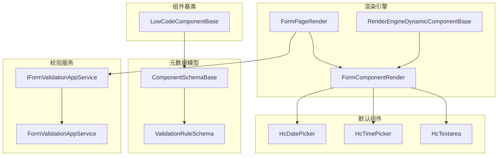
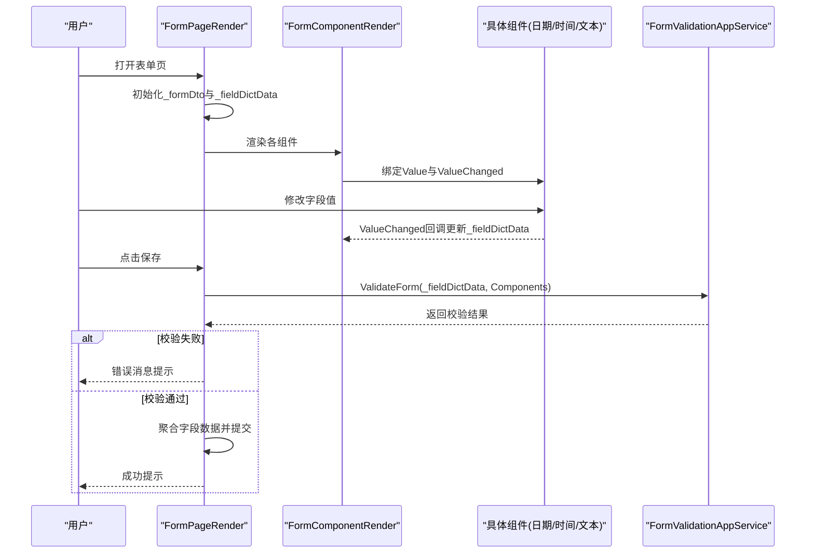
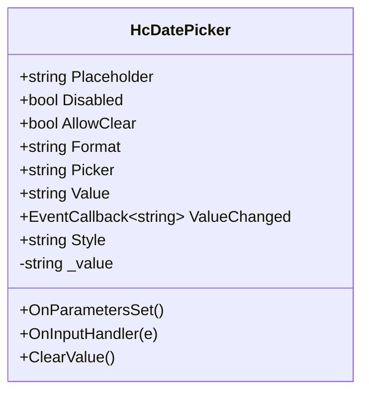
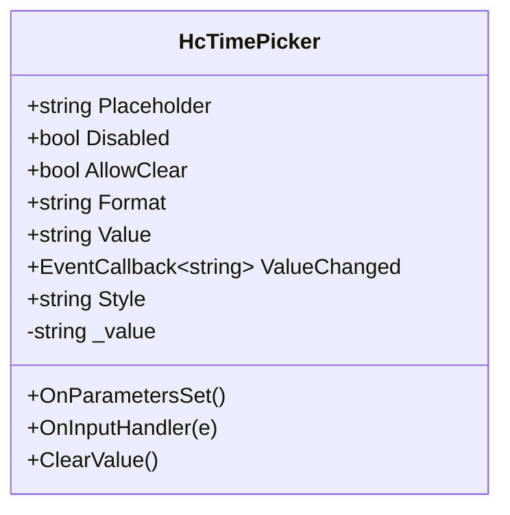
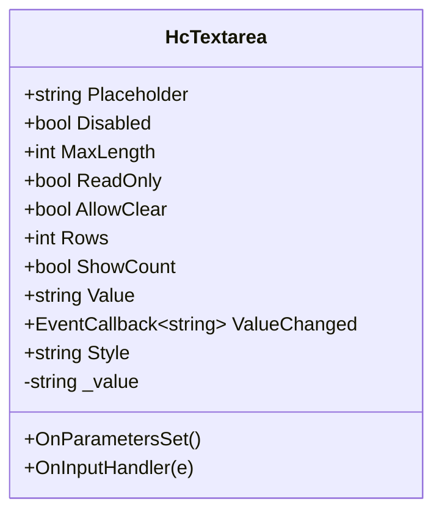
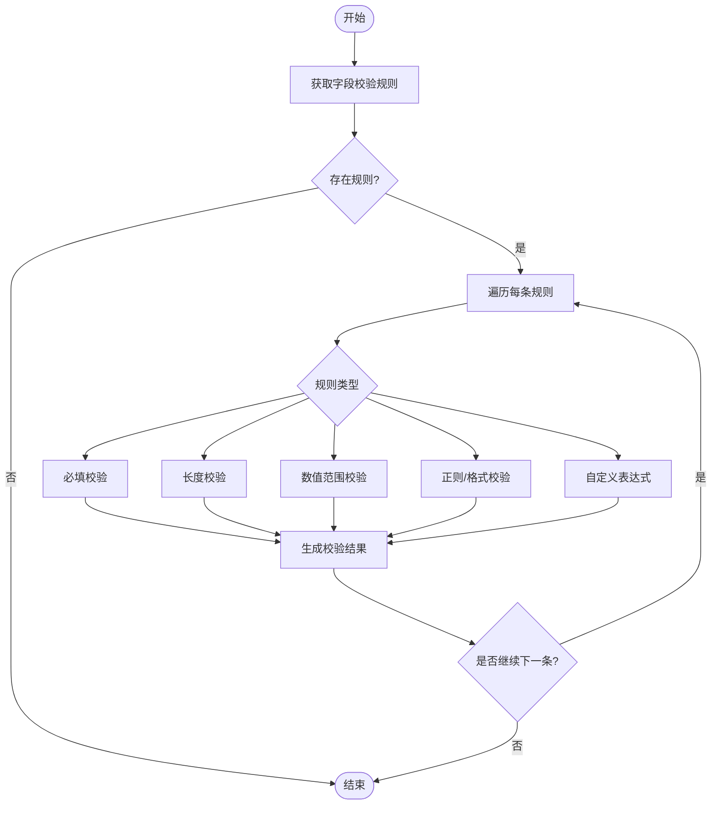
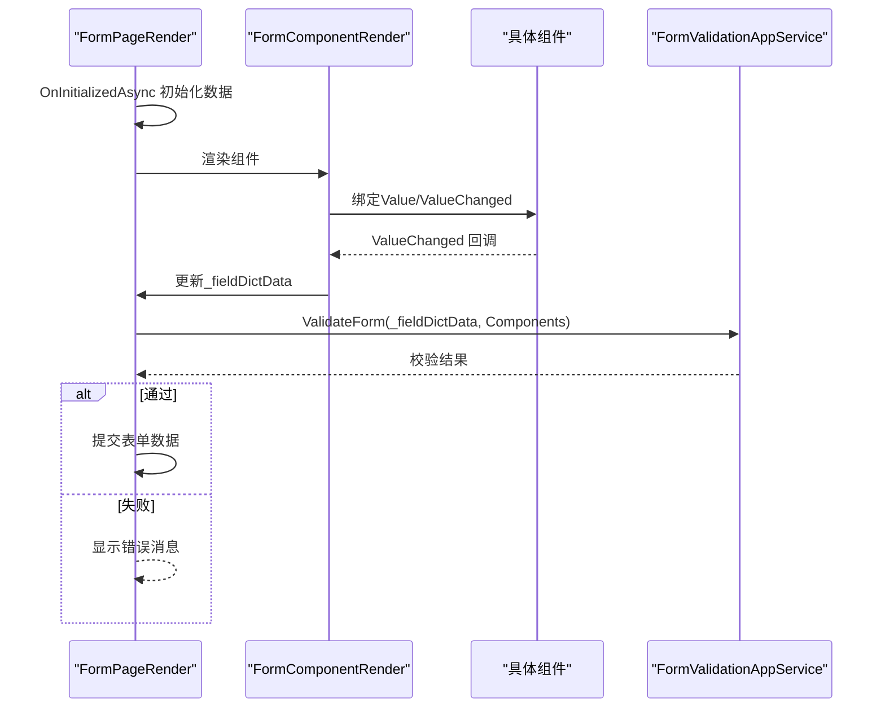
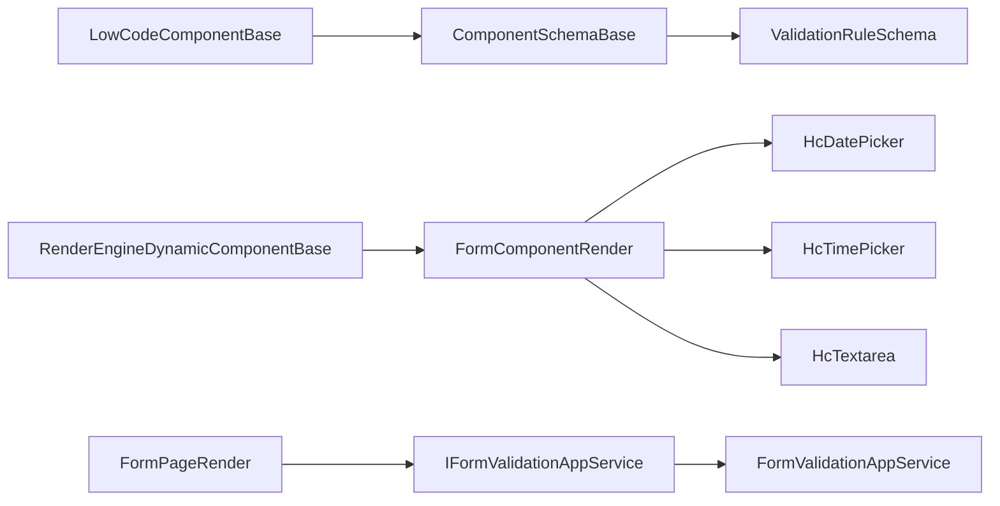

# 表单组件

<cite>
**本文引用的文件**   
- [LowCodeComponentBase.cs](file://src/LowCode/Common/H.LowCode.ComponentBase/LowCodeComponentBase.cs)
- [ComponentSchemaBase.cs](file://src/LowCode/Common/H.LowCode.MetaSchema/ComponentSchemaBase.cs)
- [ValidationRuleSchema.cs](file://src/LowCode/Common/H.LowCode.MetaSchema/PropertySchemas/ValidationRuleSchema.cs)
- [HcDatePicker.razor](file://src/LowCode/Common/H.LowCode.Components.Defaults/Components/HcDatePicker.razor)
- [HcTimePicker.razor](file://src/LowCode/Common/H.LowCode.Components.Defaults/Components/HcTimePicker.razor)
- [HcTextarea.razor](file://src/LowCode/Common/H.LowCode.Components.Defaults/Components/HcTextarea.razor)
- [datepicker.json](file://src/LowCode/meta/parts/componentParts/antdesign/datepicker.json)
- [timepicker.json](file://src/LowCode/meta/parts/componentParts/antdesign/timepicker.json)
- [textarea.json](file://src/LowCode/meta/parts/componentParts/antdesign/textarea.json)
- [FormPageRender.razor](file://src/LowCode/RenderEngine/H.LowCode.Themes.AntBlazor/PageRender/FormPageRender.razor)
- [FormComponentRender.razor](file://src/LowCode/RenderEngine/H.LowCode.Themes.AntBlazor/ComponentRender/FormComponentRender.razor)
- [RenderEngineDynamicComponentBase.cs](file://src/LowCode/RenderEngine/H.LowCode.RenderEngineBase/RenderEngineDynamicComponentBase.cs)
- [IFormValidationAppService.cs](file://src/LowCode/Common/H.LowCode.Application.Contracts/AppServices/IFormValidationAppService.cs)
- [FormValidationAppService.cs](file://src/LowCode/Common/H.LowCode.Application/Services/FormValidationAppService.cs)
</cite>

## 目录
1. [简介](#简介)
2. [项目结构](#项目结构)
3. [核心组件](#核心组件)
4. [架构总览](#架构总览)
5. [详细组件分析](#详细组件分析)
6. [依赖关系分析](#依赖关系分析)
7. [性能与体验优化](#性能与体验优化)
8. [故障排查指南](#故障排查指南)
9. [结论](#结论)
10. [附录](#附录)

## 简介
本文件面向低代码平台的表单组件体系，聚焦日期选择器、时间选择器、文本域等高级输入组件的数据格式处理、校验规则配置、国际化支持策略，以及与 Form 容器的集成和数据同步机制。文档同时给出复杂表单场景的实现思路、数据处理技巧以及性能优化建议，帮助开发者快速构建高质量表单页面。

## 项目结构
- 组件基类与状态：提供统一的日志、导航、JS交互能力，以及设计态标识等通用能力。
- 元数据模型：定义组件实例的通用属性（如 id、名称、标签、样式、事件、校验规则等）。
- 默认组件实现：包含日期选择器、时间选择器、文本域等基础输入组件。
- 渲染引擎：负责根据组件元数据动态渲染组件，并驱动表单数据收集与提交。
- 校验服务：集中管理字段级与表单级的校验逻辑，返回结构化结果。

图表来源
- [LowCodeComponentBase.cs:1-73](file://src/LowCode/Common/H.LowCode.ComponentBase/LowCodeComponentBase.cs#L1-L73)
- [ComponentSchemaBase.cs:1-104](file://src/LowCode/Common/H.LowCode.MetaSchema/ComponentSchemaBase.cs#L1-L104)
- [ValidationRuleSchema.cs:1-178](file://src/LowCode/Common/H.LowCode.MetaSchema/PropertySchemas/ValidationRuleSchema.cs#L1-L178)
- [HcDatePicker.razor:1-44](file://src/LowCode/Common/H.LowCode.Components.Defaults/Components/HcDatePicker.razor#L1-L44)
- [HcTimePicker.razor:1-43](file://src/LowCode/Common/H.LowCode.Components.Defaults/Components/HcTimePicker.razor#L1-L43)
- [HcTextarea.razor:1-42](file://src/LowCode/Common/H.LowCode.Components.Defaults/Components/HcTextarea.razor#L1-L42)
- [FormPageRender.razor:1-82](file://src/LowCode/RenderEngine/H.LowCode.Themes.AntBlazor/PageRender/FormPageRender.razor#L1-L82)
- [FormComponentRender.razor:37-77](file://src/LowCode/RenderEngine/H.LowCode.Themes.AntBlazor/ComponentRender/FormComponentRender.razor#L37-L77)
- [RenderEngineDynamicComponentBase.cs:65-107](file://src/LowCode/RenderEngine/H.LowCode.RenderEngineBase/RenderEngineDynamicComponentBase.cs#L65-L107)
- [IFormValidationAppService.cs:1-42](file://src/LowCode/Common/H.LowCode.Application.Contracts/AppServices/IFormValidationAppService.cs#L1-L42)
- [FormValidationAppService.cs:41-79](file://src/LowCode/Common/H.LowCode.Application/Services/FormValidationAppService.cs#L41-L79)

章节来源
- [LowCodeComponentBase.cs:1-73](file://src/LowCode/Common/H.LowCode.ComponentBase/LowCodeComponentBase.cs#L1-L73)
- [ComponentSchemaBase.cs:1-104](file://src/LowCode/Common/H.LowCode.MetaSchema/ComponentSchemaBase.cs#L1-L104)

## 核心组件
- 日期选择器（HcDatePicker）
  - 功能要点：支持 date/month/year/week 多种选择器类型；可配置占位符、禁用、清除按钮；值以字符串形式双向绑定。
  - 数据格式：通过 Format 参数控制显示格式（内部使用原生 input type 与字符串值）。
  - 验证集成：由表单校验服务统一处理，组件本身不耦合校验逻辑。
  - 参考路径：[HcDatePicker.razor:1-44](file://src/LowCode/Common/H.LowCode.Components.Defaults/Components/HcDatePicker.razor#L1-L44)、[datepicker.json:1-1](file://src/LowCode/meta/parts/componentParts/antdesign/datepicker.json#L1-L1)

- 时间选择器（HcTimePicker）
  - 功能要点：基于原生 time 输入；支持占位符、禁用、清除按钮；值以字符串形式双向绑定。
  - 数据格式：Format 参数用于展示格式说明（实际值由浏览器 time 输入决定）。
  - 验证集成：同日期选择器，交由校验服务处理。
  - 参考路径：[HcTimePicker.razor:1-43](file://src/LowCode/Common/H.LowCode.Components.Defaults/Components/HcTimePicker.razor#L1-L43)、[timepicker.json:1-1](file://src/LowCode/meta/parts/componentParts/antdesign/timepicker.json#L1-L1)

- 文本域（HcTextarea）
  - 功能要点：支持多行文本输入；可配置最大长度、只读、行数、字符计数显示；值以字符串形式双向绑定。
  - 数据格式：纯文本字符串，MaxLength 限制前端输入上限。
  - 验证集成：由校验服务统一处理必填、长度、正则等规则。
  - 参考路径：[HcTextarea.razor:1-42](file://src/LowCode/Common/H.LowCode.Components.Defaults/Components/HcTextarea.razor#L1-L42)、[textarea.json:1-1](file://src/LowCode/meta/parts/componentParts/antdesign/textarea.json#L1-L1)

章节来源
- [HcDatePicker.razor:1-44](file://src/LowCode/Common/H.LowCode.Components.Defaults/Components/HcDatePicker.razor#L1-L44)
- [HcTimePicker.razor:1-43](file://src/LowCode/Common/H.LowCode.Components.Defaults/Components/HcTimePicker.razor#L1-L43)
- [HcTextarea.razor:1-42](file://src/LowCode/Common/H.LowCode.Components.Defaults/Components/HcTextarea.razor#L1-L42)
- [datepicker.json:1-1](file://src/LowCode/meta/parts/componentParts/antdesign/datepicker.json#L1-L1)
- [timepicker.json:1-1](file://src/LowCode/meta/parts/componentParts/antdesign/timepicker.json#L1-L1)
- [textarea.json:1-1](file://src/LowCode/meta/parts/componentParts/antdesign/textarea.json#L1-L1)

## 架构总览
表单页面渲染与数据流的关键环节如下：
- 页面层：FormPageRender 初始化表单数据字典，遍历组件列表渲染每个 FormComponentRender。
- 组件层：FormComponentRender 根据组件 Fragment 动态渲染具体组件（如 HcDatePicker、HcTimePicker、HcTextarea），并维护字段值与校验提示。
- 校验层：FormValidationAppService 对字段值逐项执行 ValidationRuleSchema 定义的规则，返回 ValidationResult。
- 提交层：OnFinishAsync 触发校验，通过后聚合字段数据并提交。

图表来源
- [FormPageRender.razor:1-82](file://src/LowCode/RenderEngine/H.LowCode.Themes.AntBlazor/PageRender/FormPageRender.razor#L1-L82)
- [FormComponentRender.razor:37-77](file://src/LowCode/RenderEngine/H.LowCode.Themes.AntBlazor/ComponentRender/FormComponentRender.razor#L37-L77)
- [FormValidationAppService.cs:41-79](file://src/LowCode/Common/H.LowCode.Application/Services/FormValidationAppService.cs#L41-L79)

章节来源
- [FormPageRender.razor:1-82](file://src/LowCode/RenderEngine/H.LowCode.Themes.AntBlazor/PageRender/FormPageRender.razor#L1-L82)
- [FormComponentRender.razor:37-77](file://src/LowCode/RenderEngine/H.LowCode.Themes.AntBlazor/ComponentRender/FormComponentRender.razor#L37-L77)
- [FormValidationAppService.cs:41-79](file://src/LowCode/Common/H.LowCode.Application/Services/FormValidationAppService.cs#L41-L79)

## 详细组件分析

### 日期选择器（HcDatePicker）
- 数据绑定：通过 Value 与 ValueChanged 实现字符串值的双向绑定；内部 _value 缓存当前输入。
- 格式化：Format 参数控制展示格式；Picker 参数切换 date/month/year/week。
- 交互：支持 Clear 按钮清空值；Disabled 禁用输入。
- 与表单集成：在 FormComponentRender 中作为普通输入组件渲染，值写入 _fieldDictData。
- 参考路径：[HcDatePicker.razor:1-44](file://src/LowCode/Common/H.LowCode.Components.Defaults/Components/HcDatePicker.razor#L1-L44)

图表来源
- [HcDatePicker.razor:1-44](file://src/LowCode/Common/H.LowCode.Components.Defaults/Components/HcDatePicker.razor#L1-L44)

章节来源
- [HcDatePicker.razor:1-44](file://src/LowCode/Common/H.LowCode.Components.Defaults/Components/HcDatePicker.razor#L1-L44)

### 时间选择器（HcTimePicker）
- 数据绑定：与日期选择器一致，Value/ValueChanged 字符串双向绑定。
- 格式化：Format 参数用于展示格式说明；实际值由浏览器 time 输入决定。
- 交互：支持 Clear 按钮与 Disabled 状态。
- 与表单集成：同日期选择器，值写入 _fieldDictData。
- 参考路径：[HcTimePicker.razor:1-43](file://src/LowCode/Common/H.LowCode.Components.Defaults/Components/HcTimePicker.razor#L1-L43)

图表来源
- [HcTimePicker.razor:1-43](file://src/LowCode/Common/H.LowCode.Components.Defaults/Components/HcTimePicker.razor#L1-L43)

章节来源
- [HcTimePicker.razor:1-43](file://src/LowCode/Common/H.LowCode.Components.Defaults/Components/HcTimePicker.razor#L1-L43)

### 文本域（HcTextarea）
- 数据绑定：Value/ValueChanged 字符串双向绑定；_value 缓存当前输入。
- 输入限制：MaxLength 限制最大长度；ReadOnly 只读模式；Rows 控制行数。
- 计数显示：ShowCount 为 true 且 MaxLength > 0 时显示字符计数。
- 与表单集成：值写入 _fieldDictData，校验服务按规则进行必填、长度、正则等校验。
- 参考路径：[HcTextarea.razor:1-42](file://src/LowCode/Common/H.LowCode.Components.Defaults/Components/HcTextarea.razor#L1-L42)

图表来源
- [HcTextarea.razor:1-42](file://src/LowCode/Common/H.LowCode.Components.Defaults/Components/HcTextarea.razor#L1-L42)

章节来源
- [HcTextarea.razor:1-42](file://src/LowCode/Common/H.LowCode.Components.Defaults/Components/HcTextarea.razor#L1-L42)

### 校验规则与触发时机
- 规则类型：必填、最小/最大长度、最小/最大值、正则、邮箱、手机号、URL、身份证号、自定义表达式。
- 触发时机：失去焦点（Blur）、值改变（Change）、提交（Submit）。
- 错误消息：ErrorMessage 可自定义；未设置时使用默认中文提示。
- 参考路径：[ValidationRuleSchema.cs:1-178](file://src/LowCode/Common/H.LowCode.MetaSchema/PropertySchemas/ValidationRuleSchema.cs#L1-L178)

图表来源
- [ValidationRuleSchema.cs:1-178](file://src/LowCode/Common/H.LowCode.MetaSchema/PropertySchemas/ValidationRuleSchema.cs#L1-L178)
- [FormValidationAppService.cs:41-79](file://src/LowCode/Common/H.LowCode.Application/Services/FormValidationAppService.cs#L41-L79)

章节来源
- [ValidationRuleSchema.cs:1-178](file://src/LowCode/Common/H.LowCode.MetaSchema/PropertySchemas/ValidationRuleSchema.cs#L1-L178)
- [FormValidationAppService.cs:41-79](file://src/LowCode/Common/H.LowCode.Application/Services/FormValidationAppService.cs#L41-L79)

### 表单容器与数据同步机制
- 数据源：FormPageRender 初始化 _formDto 与 _fieldDictData，前者持久化存储，后者运行时字段值集合。
- 组件渲染：FormComponentRender 根据 Component.Fragment 动态渲染具体组件，并将值变更写回 _fieldDictData。
- 提交流程：OnFinishAsync 调用 FormValidationAppService.ValidateForm 进行校验，通过后聚合字段数据提交。
- 参考路径：[FormPageRender.razor:1-82](file://src/LowCode/RenderEngine/H.LowCode.Themes.AntBlazor/PageRender/FormPageRender.razor#L1-L82)、[FormComponentRender.razor:37-77](file://src/LowCode/RenderEngine/H.LowCode.Themes.AntBlazor/ComponentRender/FormComponentRender.razor#L37-L77)

图表来源
- [FormPageRender.razor:1-82](file://src/LowCode/RenderEngine/H.LowCode.Themes.AntBlazor/PageRender/FormPageRender.razor#L1-L82)
- [FormComponentRender.razor:37-77](file://src/LowCode/RenderEngine/H.LowCode.Themes.AntBlazor/ComponentRender/FormComponentRender.razor#L37-L77)
- [FormValidationAppService.cs:41-79](file://src/LowCode/Common/H.LowCode.Application/Services/FormValidationAppService.cs#L41-L79)

章节来源
- [FormPageRender.razor:1-82](file://src/LowCode/RenderEngine/H.LowCode.Themes.AntBlazor/PageRender/FormPageRender.razor#L1-L82)
- [FormComponentRender.razor:37-77](file://src/LowCode/RenderEngine/H.LowCode.Themes.AntBlazor/ComponentRender/FormComponentRender.razor#L37-L77)
- [FormValidationAppService.cs:41-79](file://src/LowCode/Common/H.LowCode.Application/Services/FormValidationAppService.cs#L41-L79)

## 依赖关系分析
- 组件基类 LowCodeComponentBase 提供通用能力（日志、导航、JS 交互），被设计器与运行期组件继承使用。
- 组件元数据 ComponentSchemaBase 定义了所有组件的通用属性（id、名称、标签、样式、事件、校验规则等）。
- 校验规则 ValidationRuleSchema 与校验服务 IFormValidationAppService/FormValidationAppService 形成解耦的校验体系。
- 渲染引擎 RenderEngineDynamicComponentBase 负责根据 Fragment 动态创建组件实例并注入属性。

图表来源
- [LowCodeComponentBase.cs:1-73](file://src/LowCode/Common/H.LowCode.ComponentBase/LowCodeComponentBase.cs#L1-L73)
- [ComponentSchemaBase.cs:1-104](file://src/LowCode/Common/H.LowCode.MetaSchema/ComponentSchemaBase.cs#L1-L104)
- [ValidationRuleSchema.cs:1-178](file://src/LowCode/Common/H.LowCode.MetaSchema/PropertySchemas/ValidationRuleSchema.cs#L1-L178)
- [RenderEngineDynamicComponentBase.cs:65-107](file://src/LowCode/RenderEngine/H.LowCode.RenderEngineBase/RenderEngineDynamicComponentBase.cs#L65-L107)
- [FormComponentRender.razor:37-77](file://src/LowCode/RenderEngine/H.LowCode.Themes.AntBlazor/ComponentRender/FormComponentRender.razor#L37-L77)
- [FormPageRender.razor:1-82](file://src/LowCode/RenderEngine/H.LowCode.Themes.AntBlazor/PageRender/FormPageRender.razor#L1-L82)
- [IFormValidationAppService.cs:1-42](file://src/LowCode/Common/H.LowCode.Application.Contracts/AppServices/IFormValidationAppService.cs#L1-L42)
- [FormValidationAppService.cs:41-79](file://src/LowCode/Common/H.LowCode.Application/Services/FormValidationAppService.cs#L41-L79)

章节来源
- [ComponentSchemaBase.cs:1-104](file://src/LowCode/Common/H.LowCode.MetaSchema/ComponentSchemaBase.cs#L1-L104)
- [RenderEngineDynamicComponentBase.cs:65-107](file://src/LowCode/RenderEngine/H.LowCode.RenderEngineBase/RenderEngineDynamicComponentBase.cs#L65-L107)

## 性能与体验优化
- 减少不必要的重渲染
  - 仅在 ValueChanged 时更新 _fieldDictData，避免频繁 StateHasChange。
  - 对于大表单，考虑分页或分块加载组件。
- 校验优化
  - 将触发时机设置为 Blur 或 Submit，避免 Change 时高频校验。
  - 对长文本与复杂正则进行延迟校验（如防抖）。
- 数据格式与本地化
  - 日期/时间组件统一以字符串传输，后端再按需要转换；如需多语言，可在 FormComponentRender 中根据区域设置默认错误消息。
- 用户体验
  - 启用 AllowClear 提升输入效率；合理设置 Placeholder 与只读/禁用状态。
  - 文本域开启 ShowCount 帮助用户控制输入长度。

[本节为通用指导，不直接分析具体文件]

## 故障排查指南
- 表单校验失败
  - 检查 ValidationRuleSchema 是否正确配置（必填、长度、正则等）。
  - 确认 Trigger 设置是否符合预期（Blur/Change/Submit）。
  - 查看 FormValidationAppService 返回的错误消息，定位具体字段。
- 值未同步
  - 确保组件实现了 Value 与 ValueChanged 的正确绑定。
  - 检查 FormComponentRender 是否在 ValueChanged 回调中更新了 _fieldDictData。
- 组件未渲染
  - 确认 Component.Fragment 的 dt 指向正确的组件类型。
  - 检查 RenderEngineDynamicComponentBase 是否能解析属性与子节点。

章节来源
- [FormValidationAppService.cs:41-79](file://src/LowCode/Common/H.LowCode.Application/Services/FormValidationAppService.cs#L41-L79)
- [FormComponentRender.razor:37-77](file://src/LowCode/RenderEngine/H.LowCode.Themes.AntBlazor/ComponentRender/FormComponentRender.razor#L37-L77)
- [RenderEngineDynamicComponentBase.cs:65-107](file://src/LowCode/RenderEngine/H.LowCode.RenderEngineBase/RenderEngineDynamicComponentBase.cs#L65-L107)

## 结论
本项目提供了完善的低代码表单组件体系：组件基类与元数据模型清晰解耦，默认组件覆盖常用输入场景，渲染引擎与校验服务协同完成数据收集与校验。通过合理的触发时机、数据格式约定与本地化策略，可构建高性能、易用的复杂表单应用。

[本节为总结性内容，不直接分析具体文件]

## 附录
- 组件元数据示例
  - 日期选择器：[datepicker.json:1-1](file://src/LowCode/meta/parts/componentParts/antdesign/datepicker.json#L1-L1)
  - 时间选择器：[timepicker.json:1-1](file://src/LowCode/meta/parts/componentParts/antdesign/timepicker.json#L1-L1)
  - 文本域：[textarea.json:1-1](file://src/LowCode/meta/parts/componentParts/antdesign/textarea.json#L1-L1)

章节来源
- [datepicker.json:1-1](file://src/LowCode/meta/parts/componentParts/antdesign/datepicker.json#L1-L1)
- [timepicker.json:1-1](file://src/LowCode/meta/parts/componentParts/antdesign/timepicker.json#L1-L1)
- [textarea.json:1-1](file://src/LowCode/meta/parts/componentParts/antdesign/textarea.json#L1-L1)