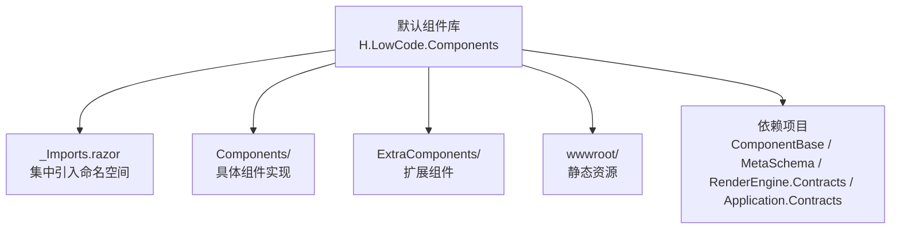
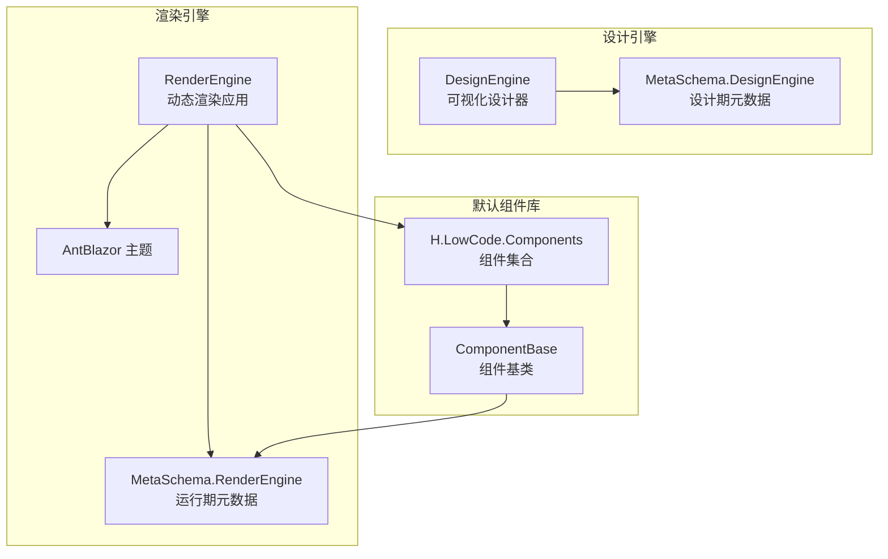
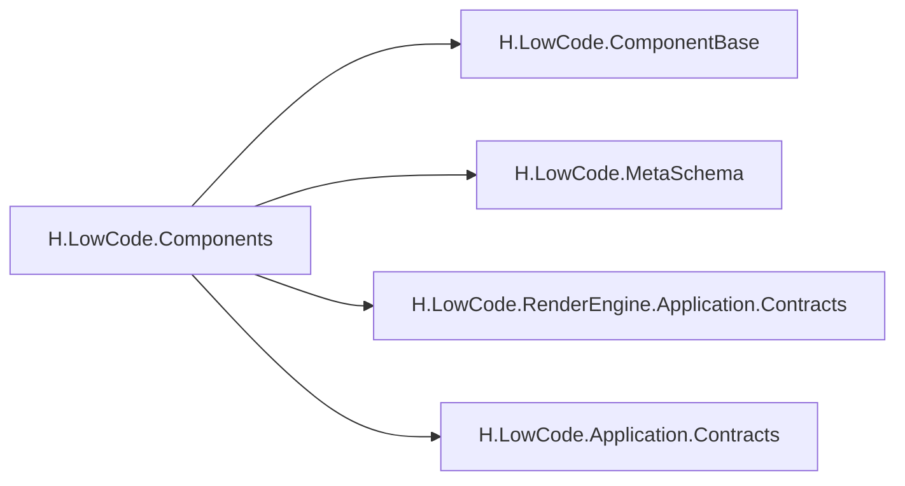

# 默认组件库

<cite>
**本文引用的文件**   
- [README.md](file://README.md)
- [H.LowCode.Components.csproj](file://src/LowCode/Common/H.LowCode.Components/H.LowCode.Components.csproj)
- [_Imports.razor](file://src/LowCode/Common/H.LowCode.Components/_Imports.razor)
</cite>

## 目录
1. [简介](#简介)
2. [项目结构](#项目结构)
3. [核心组件](#核心组件)
4. [架构总览](#架构总览)
5. [详细组件分析](#详细组件分析)
6. [依赖关系分析](#依赖关系分析)
7. [性能考虑](#性能考虑)
8. [故障排查指南](#故障排查指南)
9. [结论](#结论)
10. [附录](#附录)

## 简介
本文件为低代码默认组件库的权威文档，面向使用与扩展该组件库的开发者。内容覆盖组件分类体系（基础、容器、表单、展示）、属性配置、事件处理、样式定制、响应式设计与可访问性支持，以及组合使用与高级配置示例。同时提供性能优化建议与最佳实践，帮助在低代码平台中高效构建高质量界面。

## 项目结构
默认组件库位于 LowCode 公共模块下，采用 Razor Class Library 组织，通过 _Imports.razor 集中引入常用命名空间，便于各组件统一引用。

图表来源 
- [H.LowCode.Components.csproj](file://src/LowCode/Common/H.LowCode.Components/H.LowCode.Components.csproj)
- [_Imports.razor](file://src/LowCode/Common/H.LowCode.Components/_Imports.razor)

章节来源
- [README.md:14-20](file://README.md#L14-L20)
- [H.LowCode.Components.csproj:1-16](file://src/LowCode/Common/H.LowCode.Components/H.LowCode.Components.csproj#L1-L16)
- [_Imports.razor:1-10](file://src/LowCode/Common/H.LowCode.Components/_Imports.razor#L1-L10)

## 核心组件
默认组件库按用途划分为四类：
- 基础组件：Button、Input、Select 等，用于最小粒度的交互与输入
- 容器组件：Card、Layout、Tabs 等，用于页面结构与区域划分
- 表单组件：Form、DatePicker、Upload 等，用于数据录入与校验
- 展示组件：Table、Tree、Statistic 等，用于数据呈现与分析

说明：
- 组件属性：每个组件暴露一组属性以控制行为与外观，如尺寸、颜色、禁用状态、占位符、选项列表、分页参数等
- 事件处理：组件对外暴露事件回调，如点击、输入变化、选择变更、上传完成、表格行操作等
- 样式定制：通过主题变量、CSS 类名、内联样式或插槽/模板进行定制
- 响应式设计：基于 Blazor Web App 模式，结合 Ant Design Blazor 主题，适配不同屏幕尺寸
- 可访问性：遵循通用无障碍规范，提供语义化标签、键盘导航、ARIA 属性等

章节来源
- [README.md:14-20](file://README.md#L14-L20)
- [_Imports.razor:1-10](file://src/LowCode/Common/H.LowCode.Components/_Imports.razor#L1-L10)

## 架构总览
默认组件库作为 Razor Class Library，被设计引擎与渲染引擎共同消费。组件通过基类与元数据 Schema 驱动，确保在设计期与运行期的一致性。

图表来源 
- [README.md:14-20](file://README.md#L14-L20)
- [H.LowCode.Components.csproj:10-14](file://src/LowCode/Common/H.LowCode.Components/H.LowCode.Components.csproj#L10-L14)

## 详细组件分析
本节对四类组件逐一展开，给出特性、使用场景、属性与事件要点、样式定制方式、响应式与可访问性支持，以及组合与高级配置示例路径。

### 基础组件（Button、Input、Select）
- 特性与场景
  - Button：触发操作，支持主按钮、次按钮、危险按钮、图标按钮、加载态
  - Input：文本输入，支持前缀/后缀、清除、只读、禁用、大小
  - Select：下拉选择，支持单选/多选、搜索、分组、远程加载
- 属性与事件
  - 常见属性：Text/Value、Disabled、ReadOnly、Size、Variant、Options、Placeholder
  - 事件：OnClick、OnInput、OnChange、OnSearch、OnClear
- 样式定制
  - 通过主题变量覆盖颜色、圆角、阴影；通过 CSS 类名或内联样式调整布局
- 响应式与可访问性
  - 自适应宽度与字号；提供 aria-* 属性与键盘可达性
- 组合与高级配置
  - 与 Form 集成进行校验；Select 配合远程数据源实现懒加载

章节来源
- [_Imports.razor:1-10](file://src/LowCode/Common/H.LowCode.Components/_Imports.razor#L1-L10)

### 容器组件（Card、Layout、Tabs）
- 特性与场景
  - Card：卡片容器，承载内容区块，支持标题、副标题、操作区
  - Layout：页面布局，支持侧边栏、头部、主体、底部区域
  - Tabs：多页签切换，支持嵌套、懒加载、滚动
- 属性与事件
  - 常见属性：Title、Padding、Gutter、ActiveKey、TabList、LazyLoad
  - 事件：OnTabChange、OnClose、OnResize
- 样式定制
  - 通过栅格系统调整间距；通过主题变量定制边框、背景、阴影
- 响应式与可访问性
  - 移动端折叠侧边栏；Tabs 支持键盘切换与焦点管理
- 组合与高级配置
  - Layout + Card 构建仪表盘；Tabs + Table 实现分页数据分片展示

章节来源
- [_Imports.razor:1-10](file://src/LowCode/Common/H.LowCode.Components/_Imports.razor#L1-L10)

### 表单组件（Form、DatePicker、Upload）
- 特性与场景
  - Form：表单容器，统一管理字段、校验、提交
  - DatePicker：日期时间选择，支持范围、快捷选项、国际化
  - Upload：文件上传，支持拖拽、预览、进度、分片
- 属性与事件
  - 常见属性：Model、Rules、Layout、Format、MaxCount、Action
  - 事件：OnSubmit、OnValidate、OnDateChange、OnUpload、OnError
- 样式定制
  - 自定义校验提示样式；Upload 支持自定义上传按钮与预览组件
- 响应式与可访问性
  - 表单字段自动换行；DatePicker 提供无障碍键盘操作
- 组合与高级配置
  - Form + DatePicker 实现预约登记；Upload + Progress 显示上传进度

章节来源
- [_Imports.razor:1-10](file://src/LowCode/Common/H.LowCode.Components/_Imports.razor#L1-L10)

### 展示组件（Table、Tree、Statistic）
- 特性与场景
  - Table：数据表格，支持排序、筛选、分页、行选择、虚拟滚动
  - Tree：树形控件，支持异步加载、节点操作、勾选
  - Statistic：统计指标，支持计数、百分比、趋势图
- 属性与事件
  - 常见属性：Columns、DataSource、PageSize、RowSelection、Expandable
  - 事件：OnSort、OnFilter、OnRowClick、OnCheck、OnExpand
- 样式定制
  - 列宽自适应；单元格条件渲染；Statistic 支持自定义格式化
- 响应式与可访问性
  - 小屏横向滚动；Tree 支持键盘导航与屏幕阅读器
- 组合与高级配置
  - Table + FilterPanel 实现复杂查询；Tree + Modal 编辑节点

章节来源
- [_Imports.razor:1-10](file://src/LowCode/Common/H.LowCode.Components/_Imports.razor#L1-L10)

### 组件组合与高级配置示例
- 典型组合
  - 表单+表格：在表单中查询并刷新表格数据
  - 容器+展示：Layout 包裹 Tabs，每个 Tab 内嵌 Table
  - 基础+表单：Button 触发 Form 提交，Input/Select 作为表单项
- 高级配置
  - 远程数据源：Select/Table 使用分页与搜索联动
  - 权限控制：根据角色隐藏/禁用组件
  - 主题切换：运行时切换 AntBlazor 主题变量

章节来源
- [_Imports.razor:1-10](file://src/LowCode/Common/H.LowCode.Components/_Imports.razor#L1-L10)

## 依赖关系分析
默认组件库依赖以下关键项目：
- ComponentBase：组件基类，提供通用能力与上下文
- MetaSchema：元数据 Schema，定义组件属性与行为模型
- RenderEngine.Application.Contracts：渲染引擎契约，供组件与渲染层对接
- Application.Contracts：应用服务契约，供组件调用后端接口

图表来源 
- [H.LowCode.Components.csproj:10-14](file://src/LowCode/Common/H.LowCode.Components/H.LowCode.Components.csproj#L10-L14)

章节来源
- [H.LowCode.Components.csproj:10-14](file://src/LowCode/Common/H.LowCode.Components/H.LowCode.Components.csproj#L10-L14)

## 性能考虑
- 按需加载
  - 利用 Blazor WebAssembly 懒加载机制，仅在需要时下载组件程序集
- 渲染优化
  - 合理使用 ShouldRender 与 StateHasChanged，避免不必要的重渲染
  - 大数据表格启用虚拟滚动与分页
- 资源优化
  - 压缩静态资源，启用 Gzip/Brotli
  - 合并与缓存第三方脚本与样式
- 网络优化
  - 接口请求去抖与节流，批量请求合并
  - 使用 CDN 分发静态资源

[本节为通用指导，不直接分析具体文件]

## 故障排查指南
- 组件未渲染
  - 检查 _Imports.razor 是否引入必要命名空间
  - 确认组件属性绑定与类型一致
- 事件不触发
  - 检查事件回调是否正确注册
  - 确认组件未被禁用或只读
- 样式不生效
  - 检查 CSS 优先级与主题变量覆盖顺序
  - 确认 wwwroot 静态资源路径正确
- 响应式异常
  - 检查栅格与媒体查询设置
  - 确认容器宽度与父级布局约束

章节来源
- [_Imports.razor:1-10](file://src/LowCode/Common/H.LowCode.Components/_Imports.razor#L1-L10)

## 结论
默认组件库以清晰的分类与统一的基类/元数据驱动，为低代码平台提供了稳定、可扩展的前端能力。通过合理的组合与高级配置，可满足从简单表单到复杂数据应用的多样化需求。遵循性能优化与可访问性最佳实践，可进一步提升用户体验与系统稳定性。

[本节为总结，不直接分析具体文件]

## 附录
- 术语
  - 组件：可复用的 UI 单元
  - 元数据：描述组件属性与行为的 JSON 结构
  - 主题：统一的外观与风格配置
- 参考
  - README 中的模块化架构与懒加载说明有助于理解组件库的使用环境

章节来源
- [README.md:14-20](file://README.md#L14-L20)
- [README.md:69-73](file://README.md#L69-L73)