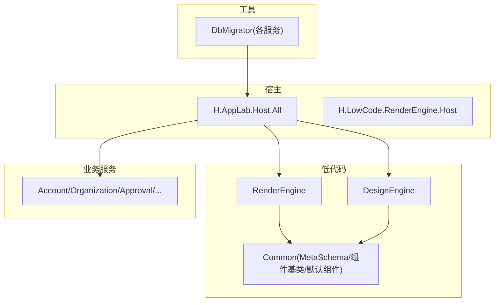
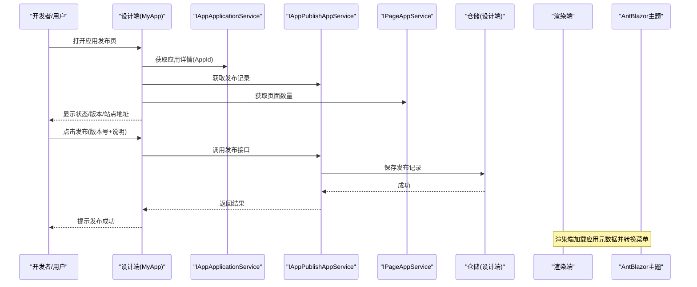
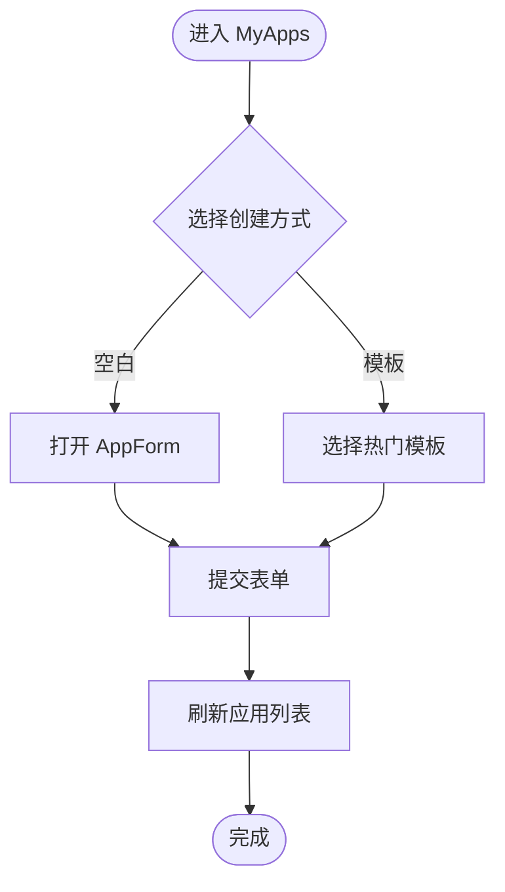
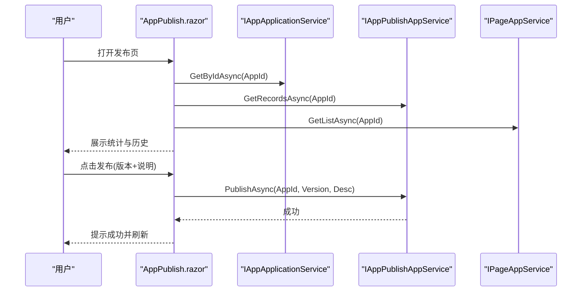
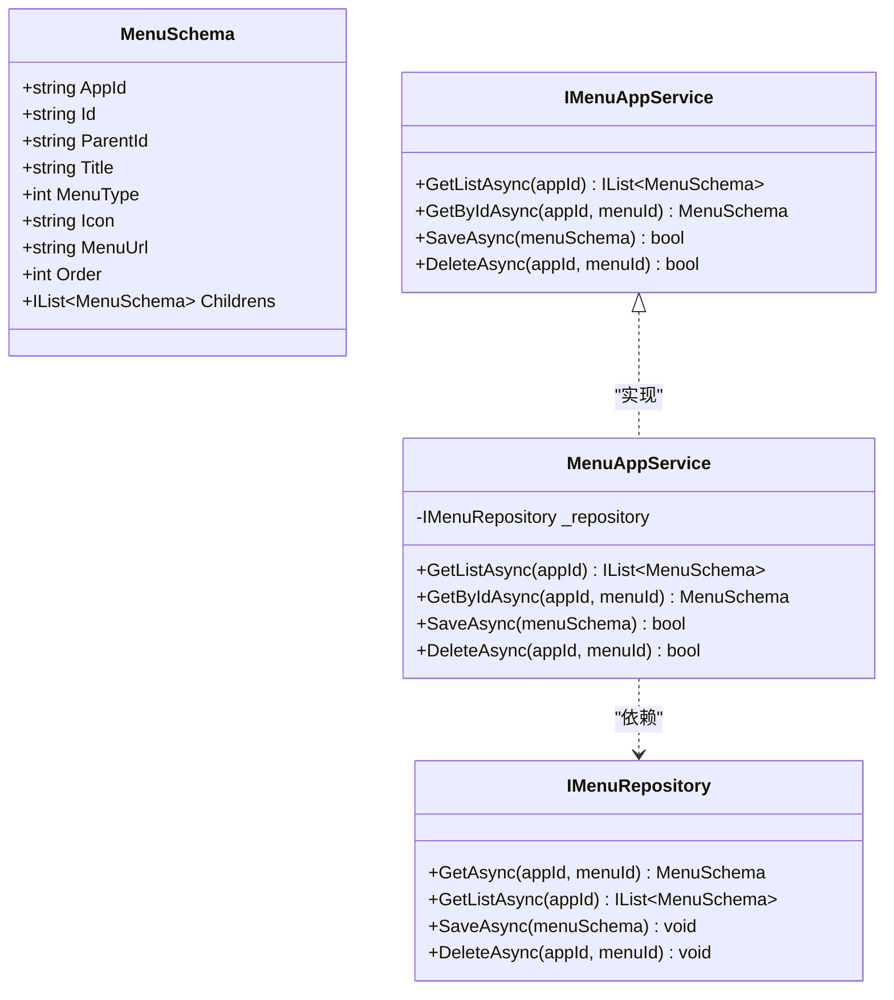
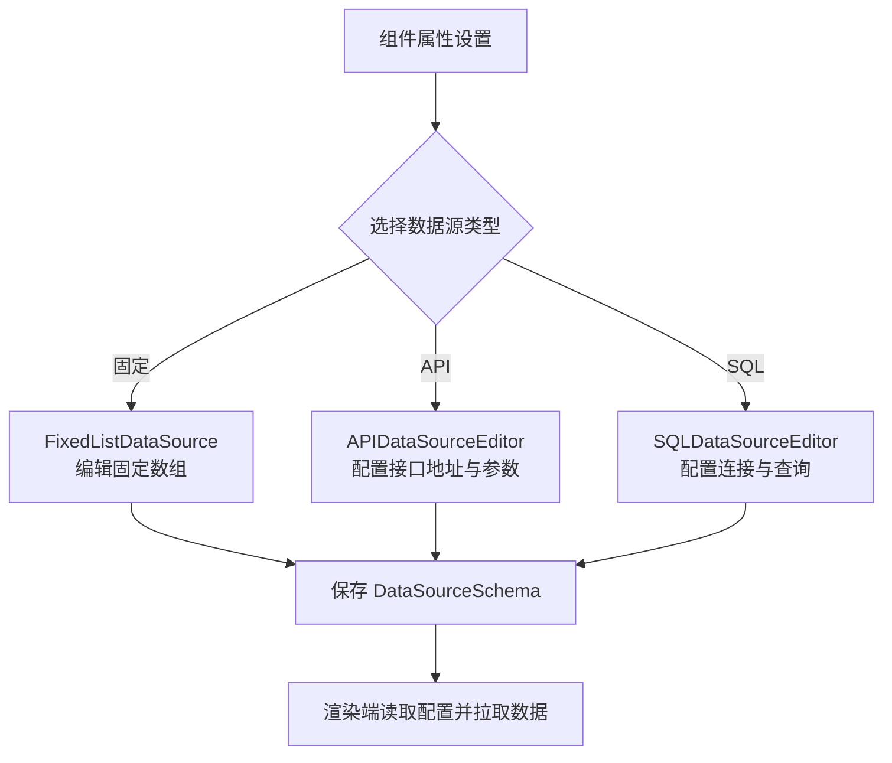
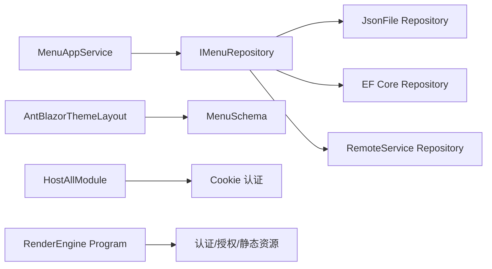

# MyApp集成

<cite>
**本文引用的文件**   
- [README.md](file://README.md)
- [HostAllModule.cs](file://src/Host/H.AppLab.Host.All/H.AppLab.Host.All/HostAllModule.cs)
- [Program.cs（渲染引擎宿主）](file://src/Host/RenderEngine/H.LowCode.RenderEngine.Host/Program.cs)
- [MyAppLayout.razor](file://src/LowCode/DesignEngine/H.LowCode.MyApp/Layout/MyAppLayout.razor)
- [MyApps.razor](file://src/LowCode/DesignEngine/H.LowCode.MyApp/Pages/MyApps.razor)
- [AppPublish.razor](file://src/LowCode/DesignEngine/H.LowCode.MyApp/Pages/AppPublish.razor)
- [MenuSchema.cs](file://src/LowCode/Common/H.LowCode.MetaSchema/MenuSchema.cs)
- [IMenuAppService.cs](file://src/LowCode/DesignEngine/H.LowCode.DesignEngine.Application.Contracts/AppServices/IMenuAppService.cs)
- [MenuAppService.cs](file://src/LowCode/DesignEngine/H.LowCode.DesignEngine.Application/AppServices/MenuAppService.cs)
- [IMenuRepository.cs](file://src/LowCode/DesignEngine/H.LowCode.DesignEngine.Domain/MetaRepositories/IMenuRepository.cs)
- [MenuRemoteServiceRepository.cs（设计端远程仓储）](file://src/LowCode/DesignEngine/H.LowCode.DesignEngine.Repository.RemoteService/Repositories/MenuRemoteServiceRepository.cs)
- [MenuRemoteServiceRepository.cs（渲染端远程仓储）](file://src/LowCode/RenderEngine/H.LowCode.RenderEngine.Repository.RemoteService/Repositories/MenuRemoteServiceRepository.cs)
- [AntBlazorThemeLayout.razor](file://src/LowCode/RenderEngine/H.LowCode.Themes.AntBlazor/Layout/AntBlazorThemeLayout.razor)
- [ListDataSourceSetting.razor](file://src/LowCode/DesignEngine/H.LowCode.DesignEngine/SettingPanel/PropertySettingItems/ListDataSource/ListDataSourceSetting.razor)
- [ComponentDataSourceEditor.razor](file://src/LowCode/DesignEngine/H.LowCode.PartsDesignEngine/Pages/ComponentParts/Components/ComponentDataSourceEditor.razor)
- [DataSourceSchema.cs](file://src/LowCode/Common/H.LowCode.MetaSchema/DataSourceSchema.cs)
- [APIDataSourceSchema.cs](file://src/LowCode/Common/H.LowCode.MetaSchema/DataSourceSchemas/APIDataSourceSchema.cs)
- [SQLDataSourceSchema.cs](file://src/LowCode/Common/H.LowCode.MetaSchema/DataSourceSchemas/SQLDataSourceSchema.cs)
- [ListDataSourceSchema.cs](file://src/LowCode/Common/H.LowCode.MetaSchema/DataSourceSchemas/ListDataSourceSchema.cs)
- [OptionDataSourceSchema.cs](file://src/LowCode/Common/H.LowCode.MetaSchema/DataSourceSchemas/OptionDataSourceSchema.cs)
- [PageDataSourceSchema.cs](file://src/LowCode/Common/H.LowCode.MetaSchema/DataSourceSchemas/PageDataSourceSchema.cs)
- [ComponentDataSourceTypeEnum.cs](file://src/LowCode/Common/H.LowCode.MetaSchema/Enums/ComponentDataSourceTypeEnum.cs)
- [PageDataSourceTypeEnum.cs](file://src/LowCode/Common/H.LowCode.MetaSchema/Enums/PageDataSourceTypeEnum.cs)
- [AppCreateFromTemplate.razor](file://src/LowCode/DesignEngine/H.LowCode.MyApp/Pages/MyApps/AppCreateFromTemplate.razor)
- [DbMigrationService.cs](file://src/Tools/H.LowCode.DbMigrator/DbMigrationService.cs)
</cite>

## 目录
1. [简介](#简介)
2. [项目结构](#项目结构)
3. [核心组件](#核心组件)
4. [架构总览](#架构总览)
5. [详细组件分析](#详细组件分析)
6. [依赖关系分析](#依赖关系分析)
7. [性能考虑](#性能考虑)
8. [故障排查指南](#故障排查指南)
9. [结论](#结论)
10. [附录](#附录)

## 简介
本文件面向“MyApp”应用的集成与使用，覆盖应用创建、编辑、发布流程；数据源管理器（API、SQL、静态数据）的配置与管理；菜单管理与权限控制集成；应用模板的使用与自定义开发方法；以及部署与版本管理的最佳实践。整体基于 .NET + Blazor 模块化架构，支持单体与按服务独立部署，并通过低代码元数据驱动页面与组件的可视化设计与运行时渲染。

## 项目结构
- Host：宿主程序，负责服务注册与启动。H.AppLab.Host.All 为所有服务的宿主（单体），其他 Host 为单服务宿主。
- Components：共享 UI 组件（如 AppDrawer）。
- LowCode：低代码核心，包含 Common（元数据 Schema、组件基类、默认组件库）、DesignEngine（设计端）、RenderEngine（渲染端）、meta（元数据 JSON 存放）。
- Services：企业级业务模块（Account、Organization、Approval、Notification、Order、Portal、Setting、SupplyChain、BackgroundTask、Testing）。
- System：系统级应用（Enterprise、SystemPortal）。
- Tools：各服务对应的 DbMigrator 控制台程序，用于数据库迁移与种子数据初始化。
- Utils：通用工具库（ABP 契约、HTTP 动态代理、Blazor 工具、ID 生成等）。

图表来源
- [README.md:1-74](file://README.md#L1-L74)

章节来源
- [README.md:1-74](file://README.md#L1-L74)

## 核心组件
- 应用抽屉与布局：DefaultLayoutComponent 提供统一顶部导航、侧边菜单与应用切换能力，MyApp 通过 MyAppLayout 注入应用元数据并渲染菜单。
- 应用管理：MyApps 页面展示应用列表，支持从空白或模板创建应用、编辑、另存为模板、访问站点。
- 应用发布：AppPublish 页面支持发布、回滚、查看发布历史与当前版本信息。
- 菜单管理：MenuAppService 提供菜单 CRUD，MenuSchema 定义菜单元数据结构，渲染端将 MenuSchema 转换为前端菜单项。
- 数据源管理：组件属性设置中支持固定（静态）、API、SQL 三种数据源类型，分别对应不同 Schema 与编辑器。

章节来源
- [MyAppLayout.razor:1-101](file://src/LowCode/DesignEngine/H.LowCode.MyApp/Layout/MyAppLayout.razor#L1-L101)
- [MyApps.razor:56-165](file://src/LowCode/DesignEngine/H.LowCode.MyApp/Pages/MyApps.razor#L56-L165)
- [AppPublish.razor:1-181](file://src/LowCode/DesignEngine/H.LowCode.MyApp/Pages/AppPublish.razor#L1-L181)
- [MenuSchema.cs:1-39](file://src/LowCode/Common/H.LowCode.MetaSchema/MenuSchema.cs#L1-L39)
- [IMenuAppService.cs:1-15](file://src/LowCode/DesignEngine/H.LowCode.DesignEngine.Application.Contracts/AppServices/IMenuAppService.cs#L1-L15)
- [MenuAppService.cs:1-39](file://src/LowCode/DesignEngine/H.LowCode.DesignEngine.Application/AppServices/MenuAppService.cs#L1-L39)
- [AntBlazorThemeLayout.razor:9-60](file://src/LowCode/RenderEngine/H.LowCode.Themes.AntBlazor/Layout/AntBlazorThemeLayout.razor#L9-L60)
- [ListDataSourceSetting.razor:19-40](file://src/LowCode/DesignEngine/H.LowCode.DesignEngine/SettingPanel/PropertySettingItems/ListDataSource/ListDataSourceSetting.razor#L19-L40)
- [ComponentDataSourceEditor.razor:42-69](file://src/LowCode/DesignEngine/H.LowCode.PartsDesignEngine/Pages/ComponentParts/Components/ComponentDataSourceEditor.razor#L42-L69)

## 架构总览
MyApp 的设计端与渲染端通过 ABP 应用服务与仓储接口解耦，支持多种存储实现（JsonFile、EntityFrameworkCore、RemoteService）。渲染端根据元数据动态生成页面与菜单，主题层基于 Ant Design Blazor。

图表来源
- [AppPublish.razor:1-181](file://src/LowCode/DesignEngine/H.LowCode.MyApp/Pages/AppPublish.razor#L1-L181)
- [MenuAppService.cs:1-39](file://src/LowCode/DesignEngine/H.LowCode.DesignEngine.Application/AppServices/MenuAppService.cs#L1-L39)
- [AntBlazorThemeLayout.razor:9-60](file://src/LowCode/RenderEngine/H.LowCode.Themes.AntBlazor/Layout/AntBlazorThemeLayout.razor#L9-L60)

## 详细组件分析

### 应用创建与编辑（MyApp）
- 入口：MyApps 页面提供“创建空白应用”和“从模板创建”，内部通过 AppCreateFromTemplate 组件引导表单提交。
- 编辑：通过 AppForm 组件绑定 AppPartsSchema，提交后刷新列表。
- 模板：支持“另存为模板”，便于复用已有应用结构。

图表来源
- [MyApps.razor:56-165](file://src/LowCode/DesignEngine/H.LowCode.MyApp/Pages/MyApps.razor#L56-L165)
- [AppCreateFromTemplate.razor:1-42](file://src/LowCode/DesignEngine/H.LowCode.MyApp/Pages/MyApps/AppCreateFromTemplate.razor#L1-L42)

章节来源
- [MyApps.razor:56-165](file://src/LowCode/DesignEngine/H.LowCode.MyApp/Pages/MyApps.razor#L56-L165)
- [AppCreateFromTemplate.razor:1-42](file://src/LowCode/DesignEngine/H.LowCode.MyApp/Pages/MyApps/AppCreateFromTemplate.razor#L1-L42)

### 应用发布与版本管理（AppPublish）
- 功能：显示发布状态、当前版本、页面数、站点地址；维护发布历史（版本、状态、操作人、时间、说明）；支持发布与回滚。
- 交互：弹窗输入版本号与说明，调用 IAppPublishAppService.PublishAsync；回滚调用 RollbackAsync。

图表来源
- [AppPublish.razor:1-181](file://src/LowCode/DesignEngine/H.LowCode.MyApp/Pages/AppPublish.razor#L1-L181)

章节来源
- [AppPublish.razor:1-181](file://src/LowCode/DesignEngine/H.LowCode.MyApp/Pages/AppPublish.razor#L1-L181)

### 菜单管理与权限控制集成
- 菜单模型：MenuSchema 定义 appId、id、parentId、title、type、icon、menuUrl、order、childrens。
- 设计端服务：MenuAppService 提供 GetListAsync、GetByIdAsync、SaveAsync、DeleteAsync，委托给 IMenuRepository。
- 渲染端转换：AntBlazorThemeLayout 将 MenuSchema 转换为 AppMenuItem，构建路由 /app/{appId}/{menuUrl}。
- 权限控制：DefaultLayoutComponent 支持 AuthMode，可在主题层配置认证模式（示例为 None），实际权限由宿主认证与授权中间件控制。

图表来源
- [MenuSchema.cs:1-39](file://src/LowCode/Common/H.LowCode.MetaSchema/MenuSchema.cs#L1-L39)
- [IMenuAppService.cs:1-15](file://src/LowCode/DesignEngine/H.LowCode.DesignEngine.Application.Contracts/AppServices/IMenuAppService.cs#L1-L15)
- [MenuAppService.cs:1-39](file://src/LowCode/DesignEngine/H.LowCode.DesignEngine.Application/AppServices/MenuAppService.cs#L1-L39)
- [IMenuRepository.cs:1-15](file://src/LowCode/DesignEngine/H.LowCode.DesignEngine.Domain/MetaRepositories/IMenuRepository.cs#L1-L15)

章节来源
- [MenuSchema.cs:1-39](file://src/LowCode/Common/H.LowCode.MetaSchema/MenuSchema.cs#L1-L39)
- [IMenuAppService.cs:1-15](file://src/LowCode/DesignEngine/H.LowCode.DesignEngine.Application.Contracts/AppServices/IMenuAppService.cs#L1-L15)
- [MenuAppService.cs:1-39](file://src/LowCode/DesignEngine/H.LowCode.DesignEngine.Application/AppServices/MenuAppService.cs#L1-L39)
- [AntBlazorThemeLayout.razor:9-60](file://src/LowCode/RenderEngine/H.LowCode.Themes.AntBlazor/Layout/AntBlazorThemeLayout.razor#L9-L60)

### 数据源管理器（API、SQL、静态数据）
- 类型枚举：ComponentDataSourceTypeEnum 支持 Fiexd（固定/静态）、API、SQL。
- 元数据 Schema：
  - ComponentDataSourceSchema：组件数据源抽象。
  - ListDataSourceSchema：列表数据源（含固定数据数组）。
  - APIDataSourceSchema：API 数据源（接口地址、参数映射等）。
  - SQLDataSourceSchema：SQL 数据源（连接串、查询语句、字段映射）。
  - OptionDataSourceSchema：选项数据源（下拉框等）。
  - PageDataSourceSchema：页面数据源（页面级数据绑定）。
- 设计端编辑器：
  - ListDataSourceSetting.razor：列表数据源配置（固定/API/SQL 切换与子编辑器）。
  - ComponentDataSourceEditor.razor：组件数据源编辑器（固定选项、API 选项、SQL 选项）。
- 渲染端：根据数据源类型与配置在运行时拉取数据并绑定到组件。

图表来源
- [ListDataSourceSetting.razor:19-40](file://src/LowCode/DesignEngine/H.LowCode.DesignEngine/SettingPanel/PropertySettingItems/ListDataSource/ListDataSourceSetting.razor#L19-L40)
- [ComponentDataSourceEditor.razor:42-69](file://src/LowCode/DesignEngine/H.LowCode.PartsDesignEngine/Pages/ComponentParts/Components/ComponentDataSourceEditor.razor#L42-L69)
- [DataSourceSchema.cs:1-200](file://src/LowCode/Common/H.LowCode.MetaSchema/DataSourceSchema.cs#L1-L200)
- [APIDataSourceSchema.cs:1-200](file://src/LowCode/Common/H.LowCode.MetaSchema/DataSourceSchemas/APIDataSourceSchema.cs#L1-L200)
- [SQLDataSourceSchema.cs:1-200](file://src/LowCode/Common/H.LowCode.MetaSchema/DataSourceSchemas/SQLDataSourceSchema.cs#L1-L200)
- [ListDataSourceSchema.cs:1-200](file://src/LowCode/Common/H.LowCode.MetaSchema/DataSourceSchemas/ListDataSourceSchema.cs#L1-L200)
- [OptionDataSourceSchema.cs:1-200](file://src/LowCode/Common/H.LowCode.MetaSchema/DataSourceSchemas/OptionDataSourceSchema.cs#L1-L200)
- [PageDataSourceSchema.cs:1-200](file://src/LowCode/Common/H.LowCode.MetaSchema/DataSourceSchemas/PageDataSourceSchema.cs#L1-L200)
- [ComponentDataSourceTypeEnum.cs:1-200](file://src/LowCode/Common/H.LowCode.MetaSchema/Enums/ComponentDataSourceTypeEnum.cs#L1-L200)
- [PageDataSourceTypeEnum.cs:1-200](file://src/LowCode/Common/H.LowCode.MetaSchema/Enums/PageDataSourceTypeEnum.cs#L1-L200)

章节来源
- [ListDataSourceSetting.razor:19-40](file://src/LowCode/DesignEngine/H.LowCode.DesignEngine/SettingPanel/PropertySettingItems/ListDataSource/ListDataSourceSetting.razor#L19-L40)
- [ComponentDataSourceEditor.razor:42-69](file://src/LowCode/DesignEngine/H.LowCode.PartsDesignEngine/Pages/ComponentParts/Components/ComponentDataSourceEditor.razor#L42-L69)
- [DataSourceSchema.cs:1-200](file://src/LowCode/Common/H.LowCode.MetaSchema/DataSourceSchema.cs#L1-L200)
- [APIDataSourceSchema.cs:1-200](file://src/LowCode/Common/H.LowCode.MetaSchema/DataSourceSchemas/APIDataSourceSchema.cs#L1-L200)
- [SQLDataSourceSchema.cs:1-200](file://src/LowCode/Common/H.LowCode.MetaSchema/DataSourceSchemas/SQLDataSourceSchema.cs#L1-L200)
- [ListDataSourceSchema.cs:1-200](file://src/LowCode/Common/H.LowCode.MetaSchema/DataSourceSchemas/ListDataSourceSchema.cs#L1-L200)
- [OptionDataSourceSchema.cs:1-200](file://src/LowCode/Common/H.LowCode.MetaSchema/DataSourceSchemas/OptionDataSourceSchema.cs#L1-L200)
- [PageDataSourceSchema.cs:1-200](file://src/LowCode/Common/H.LowCode.MetaSchema/DataSourceSchemas/PageDataSourceSchema.cs#L1-L200)
- [ComponentDataSourceTypeEnum.cs:1-200](file://src/LowCode/Common/H.LowCode.MetaSchema/Enums/ComponentDataSourceTypeEnum.cs#L1-L200)
- [PageDataSourceTypeEnum.cs:1-200](file://src/LowCode/Common/H.LowCode.MetaSchema/Enums/PageDataSourceTypeEnum.cs#L1-L200)

### 应用模板的使用与自定义开发
- 使用：MyApps 中的 AppCreateFromTemplate 提供“从模板创建”，内置热门模板列表，选择后填充 AppForm 并提交。
- 自定义：可通过扩展模板仓库与 UI 组件，新增模板分类与预览，并在创建流程中接入。

章节来源
- [AppCreateFromTemplate.razor:1-42](file://src/LowCode/DesignEngine/H.LowCode.MyApp/Pages/MyApps/AppCreateFromTemplate.razor#L1-L42)
- [MyApps.razor:56-165](file://src/LowCode/DesignEngine/H.LowCode.MyApp/Pages/MyApps.razor#L56-L165)

### 部署与版本管理最佳实践
- 数据库迁移：使用 Tools 下各服务的 DbMigrator 执行架构迁移与种子数据初始化。
- 宿主配置：HostAllModule 配置 Cookie 认证与自动 API 控制器；渲染引擎 Program 启用 WebAssembly 调试、异常处理、HSTS、静态资源缓存、路由与中间件。
- 版本管理：AppPublish 页面维护发布记录与回滚；建议每次发布填写版本号与变更说明，结合站点地址进行灰度验证。

章节来源
- [DbMigrationService.cs:1-41](file://src/Tools/H.LowCode.DbMigrator/DbMigrationService.cs#L1-L41)
- [HostAllModule.cs:115-139](file://src/Host/H.AppLab.Host.All/H.AppLab.Host.All/HostAllModule.cs#L115-L139)
- [Program.cs（渲染引擎宿主）:44-79](file://src/Host/RenderEngine/H.LowCode.RenderEngine.Host/Program.cs#L44-L79)
- [AppPublish.razor:1-181](file://src/LowCode/DesignEngine/H.LowCode.MyApp/Pages/AppPublish.razor#L1-L181)

## 依赖关系分析
- 设计端：MenuAppService → IMenuRepository（支持 JsonFile/EF/RemoteService 实现）。
- 渲染端：AntBlazorThemeLayout 依赖 MenuSchema 转换为 AppMenuItem，并通过 DefaultLayoutComponent 渲染菜单。
- 宿主：HostAllModule 配置认证与 MVC；渲染引擎 Program 配置中间件与路由。

图表来源
- [MenuAppService.cs:1-39](file://src/LowCode/DesignEngine/H.LowCode.DesignEngine.Application/AppServices/MenuAppService.cs#L1-L39)
- [IMenuRepository.cs:1-15](file://src/LowCode/DesignEngine/H.LowCode.DesignEngine.Domain/MetaRepositories/IMenuRepository.cs#L1-L15)
- [MenuRemoteServiceRepository.cs（设计端远程仓储）:1-36](file://src/LowCode/DesignEngine/H.LowCode.DesignEngine.Repository.RemoteService/Repositories/MenuRemoteServiceRepository.cs#L1-L36)
- [MenuRemoteServiceRepository.cs（渲染端远程仓储）:1-26](file://src/LowCode/RenderEngine/H.LowCode.RenderEngine.Repository.RemoteService/Repositories/MenuRemoteServiceRepository.cs#L1-L26)
- [AntBlazorThemeLayout.razor:9-60](file://src/LowCode/RenderEngine/H.LowCode.Themes.AntBlazor/Layout/AntBlazorThemeLayout.razor#L9-L60)
- [HostAllModule.cs:115-139](file://src/Host/H.AppLab.Host.All/H.AppLab.Host.All/HostAllModule.cs#L115-L139)
- [Program.cs（渲染引擎宿主）:44-79](file://src/Host/RenderEngine/H.LowCode.RenderEngine.Host/Program.cs#L44-L79)

章节来源
- [MenuAppService.cs:1-39](file://src/LowCode/DesignEngine/H.LowCode.DesignEngine.Application/AppServices/MenuAppService.cs#L1-L39)
- [IMenuRepository.cs:1-15](file://src/LowCode/DesignEngine/H.LowCode.DesignEngine.Domain/MetaRepositories/IMenuRepository.cs#L1-L15)
- [AntBlazorThemeLayout.razor:9-60](file://src/LowCode/RenderEngine/H.LowCode.Themes.AntBlazor/Layout/AntBlazorThemeLayout.razor#L9-L60)
- [HostAllModule.cs:115-139](file://src/Host/H.AppLab.Host.All/H.AppLab.Host.All/HostAllModule.cs#L115-L139)
- [Program.cs（渲染引擎宿主）:44-79](file://src/Host/RenderEngine/H.LowCode.RenderEngine.Host/Program.cs#L44-L79)

## 性能考虑
- 前端懒加载：按需加载程序集，减少首屏体积；Release 模式启用 AOT 与裁剪。
- 静态资源缓存：响应头设置 Cache-Control，提升静态资源加载速度。
- 数据库模型缓存：EF Core ModelCacheKeyFactory 按 AppId 区分模型缓存，避免多租户/多应用冲突。
- 数据源优化：优先使用缓存与分页；SQL 数据源避免复杂查询，必要时引入视图或索引。

章节来源
- [README.md:69-74](file://README.md#L69-L74)
- [Program.cs（渲染引擎宿主）:54-64](file://src/Host/RenderEngine/H.LowCode.RenderEngine.Host/Program.cs#L54-L64)
- [RenderEngineModelCacheKeyFactory.cs:1-13](file://src/LowCode/RenderEngine/H.LowCode.RenderEngine.EntityFrameworkCore/EntityFrameworkCore/Extensions/RenderEngineModelCacheKeyFactory.cs#L1-L13)
- [DesignEngineModelCacheKeyFactory.cs:1-13](file://src/LowCode/DesignEngine/H.LowCode.DesignEngine.EntityFrameworkCore/EntityFrameworkCore/Extensions/DesignEngineModelCacheKeyFactory.cs#L1-L13)

## 故障排查指南
- 认证失败：检查 HostAllModule 中 Cookie 配置（登录路径、过期时间、滑动过期）；确认客户端携带正确 Cookie。
- 菜单不显示：确认 MenuSchema 的 path 与渲染端路由拼接一致；检查 DefaultLayoutComponent 的 AuthMode 是否允许匿名访问。
- 数据源错误：核对 API 返回数组格式；SQL 连接串与查询语法正确；固定数据数组结构符合预期。
- 发布失败：检查版本号必填；查看发布记录与异常日志；确保站点地址配置正确以便访问。

章节来源
- [HostAllModule.cs:115-139](file://src/Host/H.AppLab.Host.All/H.AppLab.Host.All/HostAllModule.cs#L115-L139)
- [AntBlazorThemeLayout.razor:9-60](file://src/LowCode/RenderEngine/H.LowCode.Themes.AntBlazor/Layout/AntBlazorThemeLayout.razor#L9-L60)
- [ListDataSourceSetting.razor:19-40](file://src/LowCode/DesignEngine/H.LowCode.DesignEngine/SettingPanel/PropertySettingItems/ListDataSource/ListDataSourceSetting.razor#L19-L40)
- [AppPublish.razor:1-181](file://src/LowCode/DesignEngine/H.LowCode.MyApp/Pages/AppPublish.razor#L1-L181)

## 结论
MyApp 提供了完整的应用生命周期管理能力：从创建、编辑、模板化到发布与回滚；通过元数据驱动的菜单与数据源配置，实现了低代码可视化设计与运行时渲染的统一体验。结合宿主认证、中间件与 EF 模型缓存，具备良好的可维护性与性能表现。建议在团队内建立模板规范与发布流程，持续优化数据源查询与前端加载策略。

## 附录
- 本地开发与环境准备参考 README。
- 数据库迁移与种子数据初始化使用 Tools 下的 DbMigrator。
- 如需扩展数据源类型或菜单权限，请在 MetaSchema 与服务层增加相应 Schema 与接口实现。