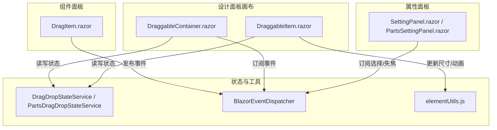
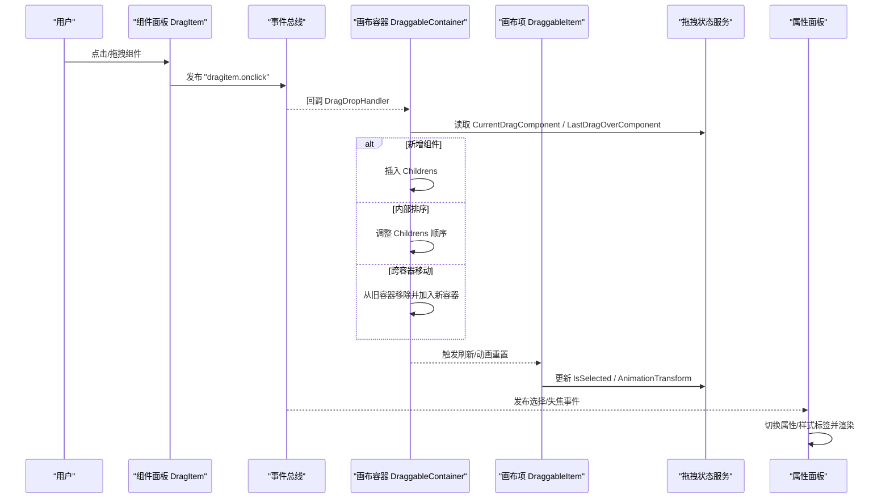
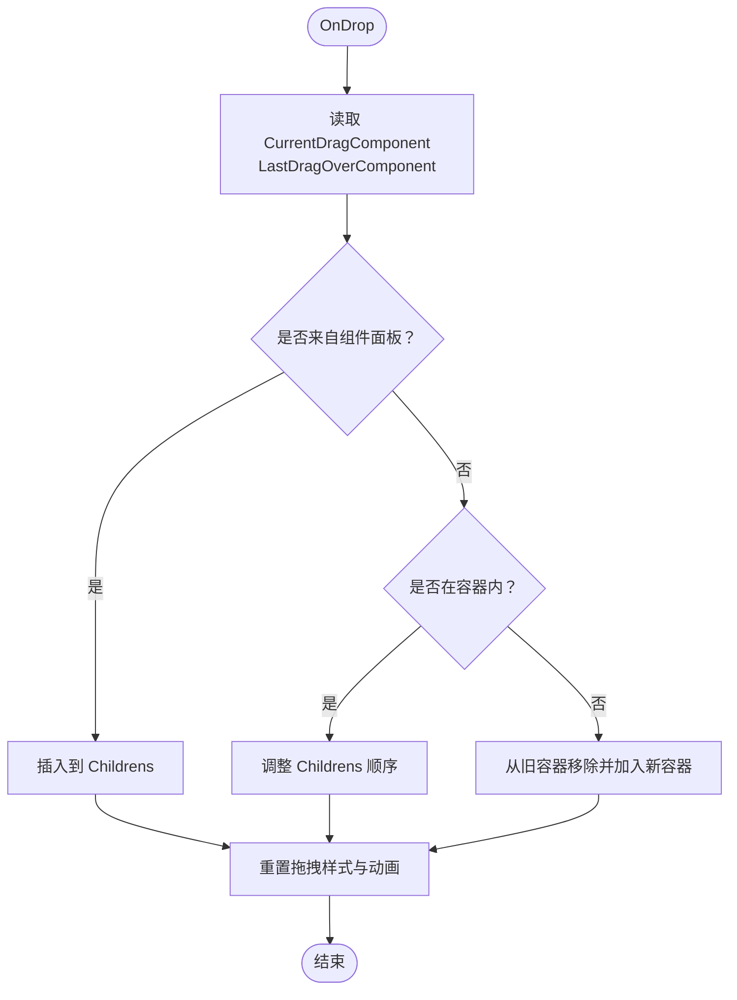
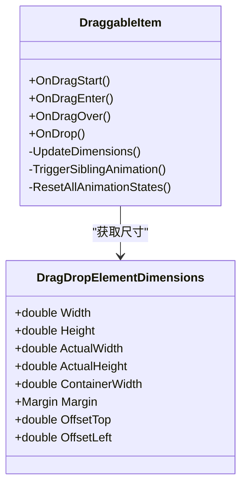
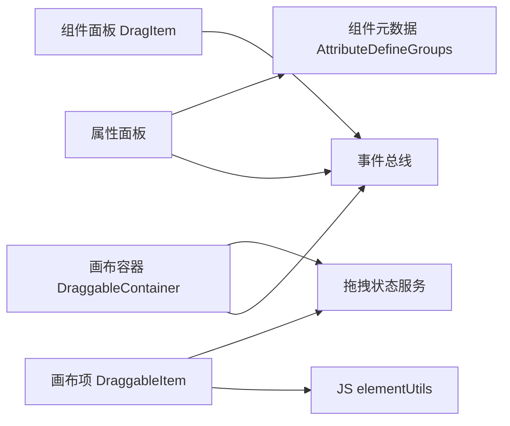

# 可视化设计器

<cite>
**本文引用的文件**   
- [H.LowCode.DesignEngine/_Imports.razor](file://src/LowCode/DesignEngine/H.LowCode.DesignEngine/_Imports.razor)
- [H.LowCode.PartsDesignEngine/DraggableComponents/DraggableItem.razor](file://src/LowCode/DesignEngine/H.LowCode.PartsDesignEngine/DraggableComponents/DraggableItem.razor)
- [H.LowCode.PartsDesignEngine/DraggableComponents/DraggableContainer.razor](file://src/LowCode/DesignEngine/H.LowCode.PartsDesignEngine/DraggableComponents/DraggableContainer.razor)
- [H.LowCode.PartsDesignEngine/ComponentPanel/DragItem.razor](file://src/LowCode/DesignEngine/H.LowCode.PartsDesignEngine/ComponentPanel/DragItem.razor)
- [H.LowCode.PartsDesignEngine/SettingPanel/PartsSettingPanel.razor](file://src/LowCode/DesignEngine/H.LowCode.PartsDesignEngine/SettingPanel/PartsSettingPanel.razor)
- [H.LowCode.DesignEngine/DraggableComponents/DraggableItem.razor](file://src/LowCode/DesignEngine/H.LowCode.DesignEngine/DraggableComponents/DraggableItem.razor)
- [H.LowCode.DesignEngine/DraggableComponents/DraggableContainer.razor](file://src/LowCode/DesignEngine/H.LowCode.DesignEngine/DraggableComponents/DraggableContainer.razor)
- [H.LowCode.DesignEngine/ComponentPanel/DragItem.razor](file://src/LowCode/DesignEngine/H.LowCode.DesignEngine/ComponentPanel/DragItem.razor)
- [H.LowCode.DesignEngine/SettingPanel/SettingPanel.razor](file://src/LowCode/DesignEngine/H.LowCode.DesignEngine/SettingPanel/SettingPanel.razor)
- [H.LowCode.DesignEngine/wwwroot/designengine.css](file://src/LowCode/DesignEngine/H.LowCode.DesignEngine/wwwroot/designengine.css)
- [H.LowCode.PartsDesignEngine/wwwroot/partsdesignengine.css](file://src/LowCode/DesignEngine/H.LowCode.PartsDesignEngine/wwwroot/partsdesignengine.css)
- [H.LowCode.DesignEngineBase/Dtos/DragDropElementDimensions.cs](file://src/LowCode/DesignEngine/H.LowCode.DesignEngineBase/Dtos/DragDropElementDimensions.cs)
- [H.Util.Blazor/BlazorEventDispatcher.cs](file://src/Utils/H.Util.Blazor/BlazorEventDispatcher.cs)
- [H.LowCode.MetaSchema.DesignEngine/ComponentLibrarySchema.cs](file://src/LowCode/Common/H.LowCode.MetaSchema.DesignEngine/ComponentLibrarySchema.cs)
- [H.LowCode.MetaSchema.DesignEngine/PropertySchemas/ComponentPartsAttributeDefineSchema.cs](file://src/LowCode/Common/H.LowCode.MetaSchema.DesignEngine/PropertySchemas/ComponentPartsAttributeDefineSchema.cs)
- [H.LowCode.Common/H.LowCode.MetaSchema.RenderEngine/ComponentSchema.cs](file://src/LowCode/Common/H.LowCode.MetaSchema.RenderEngine/ComponentSchema.cs)
</cite>

## 目录
1. [简介](#简介)
2. [项目结构](#项目结构)
3. [核心组件](#核心组件)
4. [架构总览](#架构总览)
5. [详细组件分析](#详细组件分析)
6. [依赖关系分析](#依赖关系分析)
7. [性能与优化](#性能与优化)
8. [故障排查指南](#故障排查指南)
9. [结论](#结论)
10. [附录：快捷键、撤销重做与版本控制](#附录快捷键撤销重做与版本控制)

## 简介
本文件为可视化设计器的技术文档，聚焦于设计引擎（DesignEngine）与部件设计引擎（PartsDesignEngine）的界面布局、交互机制与拖拽实现。内容涵盖画布区域、组件面板、属性面板的协作方式；拖拽状态管理、元素定位算法与碰撞检测；实时预览的工作流与渲染优化；以及配置扩展点与常见问题排查建议。

## 项目结构
可视化设计器由多个 Blazor 组件与服务组成，核心包括：
- 组件面板：提供可拖拽的组件项，支持点击直接插入或拖拽到画布
- 设计面板（画布）：承载组件树，支持容器嵌套、排序、跨容器移动
- 属性面板：根据选中组件动态展示属性与样式设置
- 拖拽状态服务：维护当前拖拽对象、最后悬停目标、动画状态等
- 事件总线：跨组件通信的核心通道

图表来源
- [H.LowCode.DesignEngine/ComponentPanel/DragItem.razor](file://src/LowCode/DesignEngine/H.LowCode.DesignEngine/ComponentPanel/DragItem.razor)
- [H.LowCode.PartsDesignEngine/ComponentPanel/DragItem.razor](file://src/LowCode/DesignEngine/H.LowCode.PartsDesignEngine/ComponentPanel/DragItem.razor)
- [H.LowCode.DesignEngine/DraggableComponents/DraggableContainer.razor](file://src/LowCode/DesignEngine/H.LowCode.DesignEngine/DraggableComponents/DraggableContainer.razor)
- [H.LowCode.PartsDesignEngine/DraggableComponents/DraggableContainer.razor](file://src/LowCode/DesignEngine/H.LowCode.PartsDesignEngine/DraggableComponents/DraggableContainer.razor)
- [H.LowCode.DesignEngine/DraggableComponents/DraggableItem.razor](file://src/LowCode/DesignEngine/H.LowCode.DesignEngine/DraggableComponents/DraggableItem.razor)
- [H.LowCode.PartsDesignEngine/DraggableComponents/DraggableItem.razor](file://src/LowCode/DesignEngine/H.LowCode.PartsDesignEngine/DraggableComponents/DraggableItem.razor)
- [H.LowCode.DesignEngine/SettingPanel/SettingPanel.razor](file://src/LowCode/DesignEngine/H.LowCode.DesignEngine/SettingPanel/SettingPanel.razor)
- [H.LowCode.PartsDesignEngine/SettingPanel/PartsSettingPanel.razor](file://src/LowCode/DesignEngine/H.LowCode.PartsDesignEngine/SettingPanel/PartsSettingPanel.razor)
- [H.Util.Blazor/BlazorEventDispatcher.cs](file://src/Utils/H.Util.Blazor/BlazorEventDispatcher.cs)

章节来源
- [H.LowCode.DesignEngine/_Imports.razor](file://src/LowCode/DesignEngine/H.LowCode.DesignEngine/_Imports.razor)

## 核心组件
- 组件面板 DragItem：负责将组件克隆并标记来源，通过事件总线通知画布容器处理插入逻辑
- 设计面板 DraggableContainer：作为容器接收 drop 事件，判断新增/排序/跨容器移动，维护 Childrens 列表
- 设计项 DraggableItem：处理 dragstart/dragover/drop 等原生事件，计算位置与让位动画，更新 DesignState
- 属性面板 SettingPanel/PartsSettingPanel：订阅选择与失焦事件，切换“属性/样式”标签页，绑定属性定义
- 拖拽状态服务：按 App/Page 或 Library/Parts 维度维护 RootComponent、LastSelected、LastDragOver、动画状态等
- 事件总线：统一的事件发布/订阅机制，避免组件间强耦合

章节来源
- [H.LowCode.DesignEngine/ComponentPanel/DragItem.razor](file://src/LowCode/DesignEngine/H.LowCode.DesignEngine/ComponentPanel/DragItem.razor)
- [H.LowCode.PartsDesignEngine/ComponentPanel/DragItem.razor](file://src/LowCode/DesignEngine/H.LowCode.PartsDesignEngine/ComponentPanel/DragItem.razor)
- [H.LowCode.DesignEngine/DraggableComponents/DraggableContainer.razor](file://src/LowCode/DesignEngine/H.LowCode.DesignEngine/DraggableComponents/DraggableContainer.razor)
- [H.LowCode.PartsDesignEngine/DraggableComponents/DraggableContainer.razor](file://src/LowCode/DesignEngine/H.LowCode.PartsDesignEngine/DraggableComponents/DraggableContainer.razor)
- [H.LowCode.DesignEngine/DraggableComponents/DraggableItem.razor](file://src/LowCode/DesignEngine/H.LowCode.DesignEngine/DraggableComponents/DraggableItem.razor)
- [H.LowCode.PartsDesignEngine/DraggableComponents/DraggableItem.razor](file://src/LowCode/DesignEngine/H.LowCode.PartsDesignEngine/DraggableComponents/DraggableItem.razor)
- [H.LowCode.DesignEngine/SettingPanel/SettingPanel.razor](file://src/LowCode/DesignEngine/H.LowCode.DesignEngine/SettingPanel/SettingPanel.razor)
- [H.LowCode.PartsDesignEngine/SettingPanel/PartsSettingPanel.razor](file://src/LowCode/DesignEngine/H.LowCode.PartsDesignEngine/SettingPanel/PartsSettingPanel.razor)
- [H.Util.Blazor/BlazorEventDispatcher.cs](file://src/Utils/H.Util.Blazor/BlazorEventDispatcher.cs)

## 架构总览
设计器采用“事件驱动 + 状态服务”的架构模式：
- 组件面板通过事件总线广播“插入请求”，画布容器订阅后执行插入/排序/移动
- 拖拽过程中，DraggableItem 持续更新 DesignState（如 AnimationTransform、IsAnimating），JS 辅助获取元素尺寸
- 属性面板基于选中组件的属性定义组动态渲染表单，修改值后同步回组件元数据

图表来源
- [H.LowCode.DesignEngine/ComponentPanel/DragItem.razor](file://src/LowCode/DesignEngine/H.LowCode.DesignEngine/ComponentPanel/DragItem.razor)
- [H.LowCode.PartsDesignEngine/ComponentPanel/DragItem.razor](file://src/LowCode/DesignEngine/H.LowCode.PartsDesignEngine/ComponentPanel/DragItem.razor)
- [H.LowCode.DesignEngine/DraggableComponents/DraggableContainer.razor](file://src/LowCode/DesignEngine/H.LowCode.DesignEngine/DraggableComponents/DraggableContainer.razor)
- [H.LowCode.PartsDesignEngine/DraggableComponents/DraggableContainer.razor](file://src/LowCode/DesignEngine/H.LowCode.PartsDesignEngine/DraggableComponents/DraggableContainer.razor)
- [H.LowCode.DesignEngine/DraggableComponents/DraggableItem.razor](file://src/LowCode/DesignEngine/H.LowCode.DesignEngine/DraggableComponents/DraggableItem.razor)
- [H.LowCode.PartsDesignEngine/DraggableComponents/DraggableItem.razor](file://src/LowCode/DesignEngine/H.LowCode.PartsDesignEngine/DraggableComponents/DraggableItem.razor)
- [H.LowCode.DesignEngine/SettingPanel/SettingPanel.razor](file://src/LowCode/DesignEngine/H.LowCode.DesignEngine/SettingPanel/SettingPanel.razor)
- [H.LowCode.PartsDesignEngine/SettingPanel/PartsSettingPanel.razor](file://src/LowCode/DesignEngine/H.LowCode.PartsDesignEngine/SettingPanel/PartsSettingPanel.razor)
- [H.Util.Blazor/BlazorEventDispatcher.cs](file://src/Utils/H.Util.Blazor/BlazorEventDispatcher.cs)

## 详细组件分析

### 画布容器 DraggableContainer
职责：
- 监听 drop 事件，调用 DragDropHandler 决定新增/排序/移动
- 维护 Childrens 列表，确保父子关系正确
- 在根容器时订阅“组件面板点击”事件，支持直接插入
- 释放后清理动画与指示器状态

关键流程：
- OnDrop -> 读取 CurrentDragComponent 与 LastDragOverComponent
- 若来自组件面板则新增；若在容器内则排序；否则跨容器移动
- 完成后重置拖拽样式与动画状态

图表来源
- [H.LowCode.DesignEngine/DraggableComponents/DraggableContainer.razor](file://src/LowCode/DesignEngine/H.LowCode.DesignEngine/DraggableComponents/DraggableContainer.razor)
- [H.LowCode.PartsDesignEngine/DraggableComponents/DraggableContainer.razor](file://src/LowCode/DesignEngine/H.LowCode.PartsDesignEngine/DraggableComponents/DraggableContainer.razor)

章节来源
- [H.LowCode.DesignEngine/DraggableComponents/DraggableContainer.razor](file://src/LowCode/DesignEngine/H.LowCode.DesignEngine/DraggableComponents/DraggableContainer.razor)
- [H.LowCode.PartsDesignEngine/DraggableComponents/DraggableContainer.razor](file://src/LowCode/DesignEngine/H.LowCode.PartsDesignEngine/DraggableComponents/DraggableContainer.razor)

### 画布项 DraggableItem
职责：
- 处理 dragstart/dragover/dragenter/drop 等事件
- 计算拖拽偏移量，更新 DesignState.AnimationTransform 与 IsAnimating
- 触发兄弟组件让位动画，提升 UX
- 通过 JSRuntime 获取元素尺寸，用于定位与碰撞检测

关键点：
- dragstart 中不立即改变 isDragging，避免中断原生拖拽
- dragover 中记录 LastDragOverComponent，供 drop 时使用
- 使用 translate3d 进行 GPU 加速动画

图表来源
- [H.LowCode.DesignEngine/DraggableComponents/DraggableItem.razor](file://src/LowCode/DesignEngine/H.LowCode.DesignEngine/DraggableComponents/DraggableItem.razor)
- [H.LowCode.PartsDesignEngine/DraggableComponents/DraggableItem.razor](file://src/LowCode/DesignEngine/H.LowCode.PartsDesignEngine/DraggableComponents/DraggableItem.razor)
- [H.LowCode.DesignEngineBase/Dtos/DragDropElementDimensions.cs](file://src/LowCode/DesignEngine/H.LowCode.DesignEngineBase/Dtos/DragDropElementDimensions.cs)

章节来源
- [H.LowCode.DesignEngine/DraggableComponents/DraggableItem.razor](file://src/LowCode/DesignEngine/H.LowCode.DesignEngine/DraggableComponents/DraggableItem.razor)
- [H.LowCode.PartsDesignEngine/DraggableComponents/DraggableItem.razor](file://src/LowCode/DesignEngine/H.LowCode.PartsDesignEngine/DraggableComponents/DraggableItem.razor)
- [H.LowCode.DesignEngineBase/Dtos/DragDropElementDimensions.cs](file://src/LowCode/DesignEngine/H.LowCode.DesignEngineBase/Dtos/DragDropElementDimensions.cs)

### 组件面板 DragItem
职责：
- 克隆组件并标记来源（IsDroppedFromComponentPanel）
- 点击时通过事件总线发布“插入请求”
- 拖拽时设置当前拖拽组件到状态服务

章节来源
- [H.LowCode.DesignEngine/ComponentPanel/DragItem.razor](file://src/LowCode/DesignEngine/H.LowCode.DesignEngine/ComponentPanel/DragItem.razor)
- [H.LowCode.PartsDesignEngine/ComponentPanel/DragItem.razor](file://src/LowCode/DesignEngine/H.LowCode.PartsDesignEngine/ComponentPanel/DragItem.razor)

### 属性面板 SettingPanel / PartsSettingPanel
职责：
- 订阅“组件点击/失焦”事件，切换显示“属性/样式”标签
- 基于 Component.AttributeDefineGroups 渲染属性表单
- 支持扩展属性项（ExtensionPropertyItem）动态写入属性定义

章节来源
- [H.LowCode.DesignEngine/SettingPanel/SettingPanel.razor](file://src/LowCode/DesignEngine/H.LowCode.DesignEngine/SettingPanel/SettingPanel.razor)
- [H.LowCode.PartsDesignEngine/SettingPanel/PartsSettingPanel.razor](file://src/LowCode/DesignEngine/H.LowCode.PartsDesignEngine/SettingPanel/PartsSettingPanel.razor)

### 拖拽状态服务
职责：
- 按上下文键（App/Page 或 Library/Parts）维护 RootComponent、Page、LastSelected、LastDragOver、LastDrop、时间戳等
- 提供 ResetDragStyle、ResetComponent 等方法清理状态

章节来源
- [H.LowCode.DesignEngine/DraggableComponents/DraggableItem.razor](file://src/LowCode/DesignEngine/H.LowCode.DesignEngine/DraggableComponents/DraggableItem.razor)
- [H.LowCode.PartsDesignEngine/DraggableComponents/DraggableItem.razor](file://src/LowCode/DesignEngine/H.LowCode.PartsDesignEngine/DraggableComponents/DraggableItem.razor)

## 依赖关系分析
- 组件面板与设计面板通过事件总线解耦
- 画布项依赖 JS 工具获取元素尺寸，用于定位与碰撞检测
- 属性面板依赖组件元数据（AttributeDefineGroups）动态渲染
- 状态服务被多处读写，需保证线程安全与一致性

图表来源
- [H.Util.Blazor/BlazorEventDispatcher.cs](file://src/Utils/H.Util.Blazor/BlazorEventDispatcher.cs)
- [H.LowCode.MetaSchema.DesignEngine/PropertySchemas/ComponentPartsAttributeDefineSchema.cs](file://src/LowCode/Common/H.LowCode.MetaSchema.DesignEngine/PropertySchemas/ComponentPartsAttributeDefineSchema.cs)

章节来源
- [H.Util.Blazor/BlazorEventDispatcher.cs](file://src/Utils/H.Util.Blazor/BlazorEventDispatcher.cs)
- [H.LowCode.MetaSchema.DesignEngine/PropertySchemas/ComponentPartsAttributeDefineSchema.cs](file://src/LowCode/Common/H.LowCode.MetaSchema.DesignEngine/PropertySchemas/ComponentPartsAttributeDefineSchema.cs)

## 性能与优化
- 动画优化：使用 translate3d 与 will-change 启用 GPU 加速，减少重排重绘
- 渲染优化：仅在必要时调用 InvokeAsync(StateHasChanged)，避免频繁全量刷新
- 尺寸计算：通过 JS 批量获取元素尺寸，避免多次 DOM 查询
- 事件去抖：在 dragover 中避免重复重置兄弟动画，降低闪烁

[本节为通用指导，无需引用具体文件]

## 故障排查指南
- 拖拽无效：检查 dragstart 是否过早修改 isDragging，导致浏览器取消原生拖拽
- 动画异常：确认 ResetAllAnimationStates 在 drop 后被调用
- 属性面板不更新：确认事件总线订阅是否正确，InvokeAsync 是否在 UI 线程执行
- 尺寸获取失败：检查 JSRuntime 调用与 elementUtils.js 是否存在

章节来源
- [H.LowCode.DesignEngine/DraggableComponents/DraggableItem.razor](file://src/LowCode/DesignEngine/H.LowCode.DesignEngine/DraggableComponents/DraggableItem.razor)
- [H.LowCode.PartsDesignEngine/DraggableComponents/DraggableItem.razor](file://src/LowCode/DesignEngine/H.LowCode.PartsDesignEngine/DraggableComponents/DraggableItem.razor)
- [H.LowCode.DesignEngine/SettingPanel/SettingPanel.razor](file://src/LowCode/DesignEngine/H.LowCode.DesignEngine/SettingPanel/SettingPanel.razor)
- [H.LowCode.PartsDesignEngine/SettingPanel/PartsSettingPanel.razor](file://src/LowCode/DesignEngine/H.LowCode.PartsDesignEngine/SettingPanel/PartsSettingPanel.razor)

## 结论
可视化设计器以事件驱动为核心，结合状态服务与 JS 辅助，实现了高可用、高性能的拖拽与实时预览体验。通过清晰的组件职责划分与松耦合通信，便于扩展与维护。

[本节为总结性内容，无需引用具体文件]

## 附录：快捷键、撤销重做与版本控制
- 快捷键：当前代码未内置全局快捷键监听，可在页面层扩展键盘事件处理器，结合事件总线触发操作
- 撤销/重做：可通过对组件树变更（新增/删除/移动/属性修改）生成操作快照，维护历史栈实现撤销重做
- 版本控制：利用现有 JSON 存储（meta/apps、meta/parts）保存页面/部件版本，结合 Git 进行差异对比与回滚

[本节为概念性说明，无需引用具体文件]