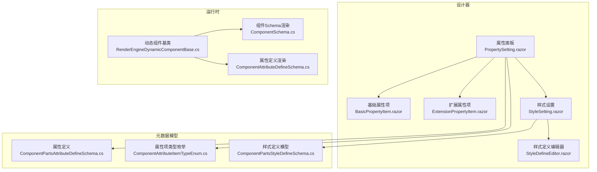
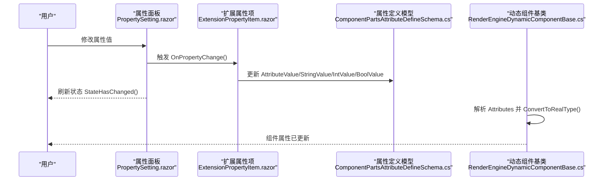
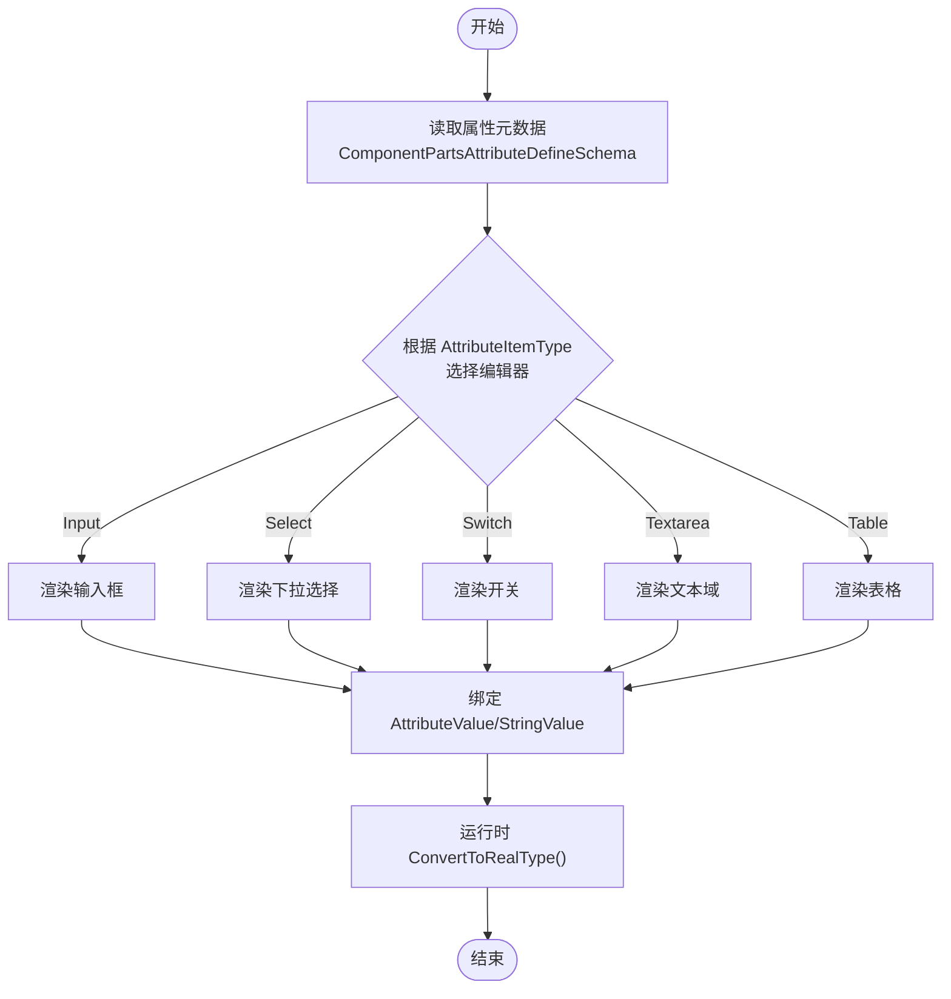
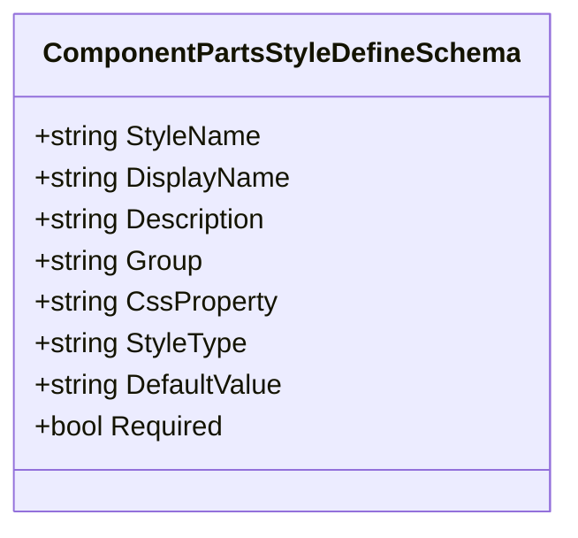
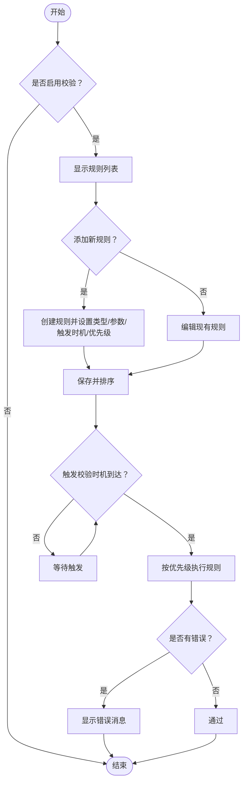
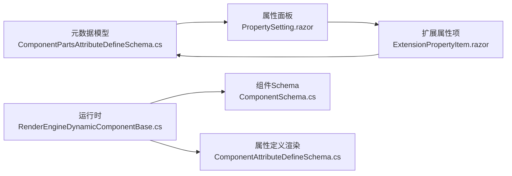

# 属性面板

<cite>
**本文引用的文件**   
- [PropertySetting.razor](file://src/LowCode/DesignEngine/H.LowCode.DesignEngine/SettingPanel/PropertySetting.razor)
- [BasicPropertyItem.razor](file://src/LowCode/DesignEngine/H.LowCode.DesignEngine/SettingPanel/PropertySettingItems/BasicPropertyItem.razor)
- [ComponentPartsAttributeDefineSchema.cs](file://src/LowCode/Common/H.LowCode.MetaSchema.DesignEngine/PropertySchemas/ComponentPartsAttributeDefineSchema.cs)
- [ComponentAttributeItemTypeEnum.cs](file://src/LowCode/Common/H.LowCode.MetaSchema.DesignEngine/Enums/ComponentAttributeItemTypeEnum.cs)
- [StyleSetting.razor（部件设计器）](file://src/LowCode/DesignEngine/H.LowCode.PartsDesignEngine/SettingPanel/StyleSetting.razor)
- [StyleDefineEditor.razor](file://src/LowCode/DesignEngine/H.LowCode.PartsDesignEngine/Pages/ComponentParts/Components/StyleDefineEditor.razor)
- [ComponentPartsStyleDefineSchema.cs](file://src/LowCode/Common/H.LowCode.MetaSchema.DesignEngine/PropertySchemas/ComponentPartsStyleDefineSchema.cs)
- [RenderEngineDynamicComponentBase.cs](file://src/LowCode/RenderEngine/H.LowCode.RenderEngineBase/RenderEngineDynamicComponentBase.cs)
- [ComponentSchema.cs（渲染引擎）](file://src/LowCode/Common/H.LowCode.MetaSchema.RenderEngine/ComponentSchema.cs)
- [ComponentAttributeDefineSchema.cs（渲染引擎）](file://src/LowCode/Common/H.LowCode.MetaSchema.RenderEngine/PropertySchemas/ComponentAttributeDefineSchema.cs)
- [ArrayPropertyEditor.razor](file://src/LowCode/DesignEngine/H.LowCode.PartsDesignEngine/Pages/ComponentParts/Components/ArrayPropertyEditor.razor)
- [ObjectArrayEditor.razor](file://src/LowCode/DesignEngine/H.LowCode.PartsDesignEngine/Pages/ComponentParts/Components/ObjectArrayEditor.razor)
- [OptionsEditor.razor](file://src/LowCode/DesignEngine/H.LowCode.PartsDesignEngine/Pages/ComponentParts/Components/OptionsEditor.razor)
- [FixedOptionDataSourceEditor.razor](file://src/LowCode/DesignEngine/H.LowCode.PartsDesignEngine/Pages/ComponentParts/Components/FixedOptionDataSourceEditor.razor)
- [SQLParametersEditor.razor](file://src/LowCode/DesignEngine/H.LowCode.PartsDesignEngine/Pages/ComponentParts/Components/SQLParametersEditor.razor)
- [ExtensionPropertyItem.razor（设计器）](file://src/LowCode/DesignEngine/H.LowCode.DesignEngine/SettingPanel/PropertySettingItems/ExtensionPropertyItem.razor)
- [ExtensionPropertyItem.razor（部件设计器）](file://src/LowCode/DesignEngine/H.LowCode.PartsDesignEngine/SettingPanel/PropertySettingItems/ExtensionPropertyItem.razor)
</cite>

## 目录
1. [简介](#简介)
2. [项目结构](#项目结构)
3. [核心组件](#核心组件)
4. [架构总览](#架构总览)
5. [详细组件分析](#详细组件分析)
6. [依赖关系分析](#依赖关系分析)
7. [性能考虑](#性能考虑)
8. [故障排查指南](#故障排查指南)
9. [结论](#结论)
10. [附录](#附录)

## 简介
本文件面向低代码平台的“属性面板”子系统，系统性阐述属性动态渲染机制、编辑器选择策略、数据绑定与类型转换、样式属性的可视化编辑、以及复杂属性编辑器（对象、数组、条件等）的开发指南。同时给出属性验证规则与错误处理机制的实现要点，帮助开发者快速理解并扩展属性面板能力。

## 项目结构
属性面板由“设计器侧的属性配置”和“运行时的属性渲染”两部分组成：
- 设计器侧：负责以元数据驱动的方式生成属性表单，支持基础属性、数据源、扩展属性、校验规则与事件等。
- 运行侧：根据组件的 Fragment/Attributes 定义，将字符串值转换为目标属性类型并注入到 Blazor 组件中。

**图示来源** 
- [PropertySetting.razor:1-255](file://src/LowCode/DesignEngine/H.LowCode.DesignEngine/SettingPanel/PropertySetting.razor#L1-L255)
- [BasicPropertyItem.razor:1-39](file://src/LowCode/DesignEngine/H.LowCode.DesignEngine/SettingPanel/PropertySettingItems/BasicPropertyItem.razor#L1-L39)
- [ComponentPartsAttributeDefineSchema.cs:1-99](file://src/LowCode/Common/H.LowCode.MetaSchema.DesignEngine/PropertySchemas/ComponentPartsAttributeDefineSchema.cs#L1-L99)
- [ComponentAttributeItemTypeEnum.cs:1-23](file://src/LowCode/Common/H.LowCode.MetaSchema.DesignEngine/Enums/ComponentAttributeItemTypeEnum.cs#L1-L23)
- [StyleSetting.razor（部件设计器）:1-31](file://src/LowCode/DesignEngine/H.LowCode.PartsDesignEngine/SettingPanel/StyleSetting.razor#L1-L31)
- [StyleDefineEditor.razor:42-63](file://src/LowCode/DesignEngine/H.LowCode.PartsDesignEngine/Pages/ComponentParts/Components/StyleDefineEditor.razor#L42-L63)
- [ComponentPartsStyleDefineSchema.cs:1-57](file://src/LowCode/Common/H.LowCode.MetaSchema.DesignEngine/PropertySchemas/ComponentPartsStyleDefineSchema.cs#L1-L57)
- [RenderEngineDynamicComponentBase.cs:382-484](file://src/LowCode/RenderEngine/H.LowCode.RenderEngineBase/RenderEngineDynamicComponentBase.cs#L382-L484)
- [ComponentSchema.cs（渲染引擎）:1-43](file://src/LowCode/Common/H.LowCode.MetaSchema.RenderEngine/ComponentSchema.cs#L1-L43)
- [ComponentAttributeDefineSchema.cs（渲染引擎）:1-13](file://src/LowCode/Common/H.LowCode.MetaSchema.RenderEngine/PropertySchemas/ComponentAttributeDefineSchema.cs#L1-L13)

**章节来源**
- [PropertySetting.razor:1-255](file://src/LowCode/DesignEngine/H.LowCode.DesignEngine/SettingPanel/PropertySetting.razor#L1-L255)
- [BasicPropertyItem.razor:1-39](file://src/LowCode/DesignEngine/H.LowCode.DesignEngine/SettingPanel/PropertySettingItems/BasicPropertyItem.razor#L1-L39)
- [ComponentPartsAttributeDefineSchema.cs:1-99](file://src/LowCode/Common/H.LowCode.MetaSchema.DesignEngine/PropertySchemas/ComponentPartsAttributeDefineSchema.cs#L1-L99)
- [ComponentAttributeItemTypeEnum.cs:1-23](file://src/LowCode/Common/H.LowCode.MetaSchema.DesignEngine/Enums/ComponentAttributeItemTypeEnum.cs#L1-L23)
- [StyleSetting.razor（部件设计器）:1-31](file://src/LowCode/DesignEngine/H.LowCode.PartsDesignEngine/SettingPanel/StyleSetting.razor#L1-L31)
- [StyleDefineEditor.razor:42-63](file://src/LowCode/DesignEngine/H.LowCode.PartsDesignEngine/Pages/ComponentParts/Components/StyleDefineEditor.razor#L42-L63)
- [ComponentPartsStyleDefineSchema.cs:1-57](file://src/LowCode/Common/H.LowCode.MetaSchema.DesignEngine/PropertySchemas/ComponentPartsStyleDefineSchema.cs#L1-L57)
- [RenderEngineDynamicComponentBase.cs:382-484](file://src/LowCode/RenderEngine/H.LowCode.RenderEngineBase/RenderEngineDynamicComponentBase.cs#L382-L484)
- [ComponentSchema.cs（渲染引擎）:1-43](file://src/LowCode/Common/H.LowCode.MetaSchema.RenderEngine/ComponentSchema.cs#L1-L43)
- [ComponentAttributeDefineSchema.cs（渲染引擎）:1-13](file://src/LowCode/Common/H.LowCode.MetaSchema.RenderEngine/PropertySchemas/ComponentAttributeDefineSchema.cs#L1-L13)

## 核心组件
- 属性面板容器：负责编排基础属性、数据源、扩展属性、校验规则与事件等子项，并在变更时触发刷新。
- 基础属性项：提供名称、标题、描述等通用字段编辑。
- 扩展属性项：基于元数据中的属性定义（含显示名、类型、默认值、选项、校验开关与规则）动态渲染对应控件。
- 样式设置：提供尺寸、标签宽度、自定义样式等可视化编辑入口，并与样式定义模型联动。
- 运行时动态组件基类：读取 Fragment/Attributes，按目标属性类型进行字符串到真实类型的转换并注入组件。

**章节来源**
- [PropertySetting.razor:1-255](file://src/LowCode/DesignEngine/H.LowCode.DesignEngine/SettingPanel/PropertySetting.razor#L1-L255)
- [BasicPropertyItem.razor:1-39](file://src/LowCode/DesignEngine/H.LowCode.DesignEngine/SettingPanel/PropertySettingItems/BasicPropertyItem.razor#L1-L39)
- [ExtensionPropertyItem.razor（设计器）:70-87](file://src/LowCode/DesignEngine/H.LowCode.DesignEngine/SettingPanel/PropertySettingItems/ExtensionPropertyItem.razor#L70-L87)
- [StyleSetting.razor（部件设计器）:1-31](file://src/LowCode/DesignEngine/H.LowCode.PartsDesignEngine/SettingPanel/StyleSetting.razor#L1-L31)
- [RenderEngineDynamicComponentBase.cs:382-484](file://src/LowCode/RenderEngine/H.LowCode.RenderEngineBase/RenderEngineDynamicComponentBase.cs#L382-L484)

## 架构总览
属性面板采用“元数据驱动 + 动态渲染”的架构：
- 设计期：通过 ComponentPartsAttributeDefineSchema 与 ComponentAttributeItemTypeEnum 描述属性元数据，UI 据此选择编辑器。
- 运行期：RenderEngineDynamicComponentBase 读取 ComponentSchema.Fragment.Attributes，依据目标属性类型完成值转换并注入。

**图示来源** 
- [PropertySetting.razor:1-255](file://src/LowCode/DesignEngine/H.LowCode.DesignEngine/SettingPanel/PropertySetting.razor#L1-L255)
- [ExtensionPropertyItem.razor（设计器）:70-87](file://src/LowCode/DesignEngine/H.LowCode.DesignEngine/SettingPanel/PropertySettingItems/ExtensionPropertyItem.razor#L70-L87)
- [ComponentPartsAttributeDefineSchema.cs:1-99](file://src/LowCode/Common/H.LowCode.MetaSchema.DesignEngine/PropertySchemas/ComponentPartsAttributeDefineSchema.cs#L1-L99)
- [RenderEngineDynamicComponentBase.cs:382-484](file://src/LowCode/RenderEngine/H.LowCode.RenderEngineBase/RenderEngineDynamicComponentBase.cs#L382-L484)

## 详细组件分析

### 属性动态渲染机制
- 属性类型识别：通过 ComponentAttributeItemTypeEnum 指定 UI 控件类型（输入框、数字、单选、复选、下拉、开关、日期、文本域、选项、表格等）。
- 编辑器选择：扩展属性项根据 AttributeItemType 渲染对应控件；基础属性项固定渲染通用字段。
- 数据绑定：属性值统一保存在 AttributeValue，并提供 StringValue/IntValue/BoolValue 便捷读写；运行时在注入前使用 ConvertToRealType 将字符串转为目标类型。

**图示来源** 
- [ComponentPartsAttributeDefineSchema.cs:1-99](file://src/LowCode/Common/H.LowCode.MetaSchema.DesignEngine/PropertySchemas/ComponentPartsAttributeDefineSchema.cs#L1-L99)
- [ComponentAttributeItemTypeEnum.cs:1-23](file://src/LowCode/Common/H.LowCode.MetaSchema.DesignEngine/Enums/ComponentAttributeItemTypeEnum.cs#L1-L23)
- [RenderEngineDynamicComponentBase.cs:382-484](file://src/LowCode/RenderEngine/H.LowCode.RenderEngineBase/RenderEngineDynamicComponentBase.cs#L382-L484)

**章节来源**
- [ComponentPartsAttributeDefineSchema.cs:1-99](file://src/LowCode/Common/H.LowCode.MetaSchema.DesignEngine/PropertySchemas/ComponentPartsAttributeDefineSchema.cs#L1-L99)
- [ComponentAttributeItemTypeEnum.cs:1-23](file://src/LowCode/Common/H.LowCode.MetaSchema.DesignEngine/Enums/ComponentAttributeItemTypeEnum.cs#L1-L23)
- [RenderEngineDynamicComponentBase.cs:382-484](file://src/LowCode/RenderEngine/H.LowCode.RenderEngineBase/RenderEngineDynamicComponentBase.cs#L382-L484)

### 基础属性编辑器实现
- 文本输入：用于名称、标题、描述等字符串字段。
- 数值调节：数字输入框用于数值型属性。
- 下拉选择：基于 Options 或枚举映射渲染。
- 颜色拾取：样式定义编辑器中包含颜色选择器控件类型。
- 开关：布尔值切换。

这些控件由扩展属性项根据元数据自动选择渲染，或通过基础属性项固定渲染。

**章节来源**
- [BasicPropertyItem.razor:1-39](file://src/LowCode/DesignEngine/H.LowCode.DesignEngine/SettingPanel/PropertySettingItems/BasicPropertyItem.razor#L1-L39)
- [StyleDefineEditor.razor:42-63](file://src/LowCode/DesignEngine/H.LowCode.PartsDesignEngine/Pages/ComponentParts/Components/StyleDefineEditor.razor#L42-L63)

### 样式属性的可视化编辑
- CSS 属性映射：样式定义模型包含 CssProperty 字段，将界面样式名映射到具体 CSS 属性。
- 实时预览：样式变更后调用 RefreshState() 触发重新渲染，实现即时反馈。
- 样式继承：样式定义可分组（如字体、布局、自定义），便于组合与覆盖。

**图示来源** 
- [ComponentPartsStyleDefineSchema.cs:1-57](file://src/LowCode/Common/H.LowCode.MetaSchema.DesignEngine/PropertySchemas/ComponentPartsStyleDefineSchema.cs#L1-L57)

**章节来源**
- [StyleSetting.razor（部件设计器）:1-31](file://src/LowCode/DesignEngine/H.LowCode.PartsDesignEngine/SettingPanel/StyleSetting.razor#L1-L31)
- [StyleDefineEditor.razor:42-63](file://src/LowCode/DesignEngine/H.LowCode.PartsDesignEngine/Pages/ComponentParts/Components/StyleDefineEditor.razor#L42-L63)
- [ComponentPartsStyleDefineSchema.cs:1-57](file://src/LowCode/Common/H.LowCode.MetaSchema.DesignEngine/PropertySchemas/ComponentPartsStyleDefineSchema.cs#L1-L57)

### 复杂属性编辑器开发指南
- 对象编辑器：用于编辑嵌套对象结构，通常以表格或树形结构展示键值对。
- 数组编辑器：支持增删改查数组元素，常见于列表配置。
- 条件编辑器：基于条件分支渲染不同子组件或属性组。
- 选项编辑器：维护固定选项或 SQL 参数等数据源。

示例组件路径参考：
- 数组编辑器：[ArrayPropertyEditor.razor](file://src/LowCode/DesignEngine/H.LowCode.PartsDesignEngine/Pages/ComponentParts/Components/ArrayPropertyEditor.razor)
- 对象数组编辑器：[ObjectArrayEditor.razor](file://src/LowCode/DesignEngine/H.LowCode.PartsDesignEngine/Pages/ComponentParts/Components/ObjectArrayEditor.razor)
- 选项编辑器：[OptionsEditor.razor](file://src/LowCode/DesignEngine/H.LowCode.PartsDesignEngine/Pages/ComponentParts/Components/OptionsEditor.razor)
- 固定选项数据源编辑器：[FixedOptionDataSourceEditor.razor](file://src/LowCode/DesignEngine/H.LowCode.PartsDesignEngine/Pages/ComponentParts/Components/FixedOptionDataSourceEditor.razor)
- SQL 参数编辑器：[SQLParametersEditor.razor](file://src/LowCode/DesignEngine/H.LowCode.PartsDesignEngine/Pages/ComponentParts/Components/SQLParametersEditor.razor)

**章节来源**
- [ArrayPropertyEditor.razor](file://src/LowCode/DesignEngine/H.LowCode.PartsDesignEngine/Pages/ComponentParts/Components/ArrayPropertyEditor.razor)
- [ObjectArrayEditor.razor](file://src/LowCode/DesignEngine/H.LowCode.PartsDesignEngine/Pages/ComponentParts/Components/ObjectArrayEditor.razor)
- [OptionsEditor.razor](file://src/LowCode/DesignEngine/H.LowCode.PartsDesignEngine/Pages/ComponentParts/Components/OptionsEditor.razor)
- [FixedOptionDataSourceEditor.razor](file://src/LowCode/DesignEngine/H.LowCode.PartsDesignEngine/Pages/ComponentParts/Components/FixedOptionDataSourceEditor.razor)
- [SQLParametersEditor.razor](file://src/LowCode/DesignEngine/H.LowCode.PartsDesignEngine/Pages/ComponentParts/Components/SQLParametersEditor.razor)

### 属性验证规则与错误处理
- 启用校验：属性面板提供“启用校验”开关，开启后显示规则列表。
- 规则类型：必填、最小/最大长度、最小/最大值、正则表达式、邮箱、手机号、URL、自定义等。
- 触发时机：输入时或失去焦点时。
- 优先级：支持多条规则的顺序执行。
- 错误消息：每条规则可配置默认或自定义错误提示。

**图示来源** 
- [PropertySetting.razor:1-255](file://src/LowCode/DesignEngine/H.LowCode.DesignEngine/SettingPanel/PropertySetting.razor#L1-L255)

**章节来源**
- [PropertySetting.razor:1-255](file://src/LowCode/DesignEngine/H.LowCode.DesignEngine/SettingPanel/PropertySetting.razor#L1-L255)

## 依赖关系分析
- 设计器侧依赖元数据模型（属性定义、样式定义、枚举）来驱动 UI。
- 运行侧依赖组件 Schema 与属性定义，将字符串值转换为目标类型并注入组件属性。
- 扩展属性项通过查找属性定义组中的匹配项，更新 StringValue 以同步 AttributeValue。

**图示来源** 
- [ComponentPartsAttributeDefineSchema.cs:1-99](file://src/LowCode/Common/H.LowCode.MetaSchema.DesignEngine/PropertySchemas/ComponentPartsAttributeDefineSchema.cs#L1-L99)
- [PropertySetting.razor:1-255](file://src/LowCode/DesignEngine/H.LowCode.DesignEngine/SettingPanel/PropertySetting.razor#L1-L255)
- [ExtensionPropertyItem.razor（设计器）:70-87](file://src/LowCode/DesignEngine/H.LowCode.DesignEngine/SettingPanel/PropertySettingItems/ExtensionPropertyItem.razor#L70-L87)
- [RenderEngineDynamicComponentBase.cs:382-484](file://src/LowCode/RenderEngine/H.LowCode.RenderEngineBase/RenderEngineDynamicComponentBase.cs#L382-L484)
- [ComponentSchema.cs（渲染引擎）:1-43](file://src/LowCode/Common/H.LowCode.MetaSchema.RenderEngine/ComponentSchema.cs#L1-L43)
- [ComponentAttributeDefineSchema.cs（渲染引擎）:1-13](file://src/LowCode/Common/H.LowCode.MetaSchema.RenderEngine/PropertySchemas/ComponentAttributeDefineSchema.cs#L1-L13)

**章节来源**
- [ComponentPartsAttributeDefineSchema.cs:1-99](file://src/LowCode/Common/H.LowCode.MetaSchema.DesignEngine/PropertySchemas/ComponentPartsAttributeDefineSchema.cs#L1-L99)
- [PropertySetting.razor:1-255](file://src/LowCode/DesignEngine/H.LowCode.DesignEngine/SettingPanel/PropertySetting.razor#L1-L255)
- [ExtensionPropertyItem.razor（设计器）:70-87](file://src/LowCode/DesignEngine/H.LowCode.DesignEngine/SettingPanel/PropertySettingItems/ExtensionPropertyItem.razor#L70-L87)
- [RenderEngineDynamicComponentBase.cs:382-484](file://src/LowCode/RenderEngine/H.LowCode.RenderEngineBase/RenderEngineDynamicComponentBase.cs#L382-L484)
- [ComponentSchema.cs（渲染引擎）:1-43](file://src/LowCode/Common/H.LowCode.MetaSchema.RenderEngine/ComponentSchema.cs#L1-L43)
- [ComponentAttributeDefineSchema.cs（渲染引擎）:1-13](file://src/LowCode/Common/H.LowCode.MetaSchema.RenderEngine/PropertySchemas/ComponentAttributeDefineSchema.cs#L1-L13)

## 性能考虑
- 避免频繁重渲染：仅在属性变更时调用 RefreshState() 与 StateHasChanged()，减少不必要的 UI 更新。
- 批量更新：对于数组/对象编辑器的多次操作，建议合并为一次提交后再刷新。
- 类型转换优化：ConvertToRealType 应在运行时按需执行，避免重复计算。
- 样式预览延迟：大段自定义样式编辑可采用防抖策略，降低实时预览开销。

## 故障排查指南
- 属性未生效：检查 AttributeName 是否与组件属性一致，确认 AttributeClrType 与实际类型匹配。
- 类型转换失败：确认 AttributeValue 的字符串表示能正确转换为目标类型，必要时增加转换异常处理。
- 校验不触发：检查 Trigger 设置（输入时/失去焦点）与 IsEnabled 开关是否正确。
- 样式未应用：确认 CssProperty 映射正确，且样式变更后触发了刷新。

**章节来源**
- [PropertySetting.razor:1-255](file://src/LowCode/DesignEngine/H.LowCode.DesignEngine/SettingPanel/PropertySetting.razor#L1-L255)
- [RenderEngineDynamicComponentBase.cs:382-484](file://src/LowCode/RenderEngine/H.LowCode.RenderEngineBase/RenderEngineDynamicComponentBase.cs#L382-L484)

## 结论
属性面板通过元数据驱动与动态渲染机制，实现了高度可扩展的属性编辑体验。基础属性编辑器覆盖常用控件，样式属性支持可视化编辑与实时预览，复杂属性编辑器满足多样化场景。结合完善的验证规则与错误处理，能够保障数据质量与用户体验。建议在扩展时遵循现有模型与约定，确保设计与运行的一致性。

## 附录
- 相关组件与页面路径参考：
  - 数组编辑器：[ArrayPropertyEditor.razor](file://src/LowCode/DesignEngine/H.LowCode.PartsDesignEngine/Pages/ComponentParts/Components/ArrayPropertyEditor.razor)
  - 对象数组编辑器：[ObjectArrayEditor.razor](file://src/LowCode/DesignEngine/H.LowCode.PartsDesignEngine/Pages/ComponentParts/Components/ObjectArrayEditor.razor)
  - 选项编辑器：[OptionsEditor.razor](file://src/LowCode/DesignEngine/H.LowCode.PartsDesignEngine/Pages/ComponentParts/Components/OptionsEditor.razor)
  - 固定选项数据源编辑器：[FixedOptionDataSourceEditor.razor](file://src/LowCode/DesignEngine/H.LowCode.PartsDesignEngine/Pages/ComponentParts/Components/FixedOptionDataSourceEditor.razor)
  - SQL 参数编辑器：[SQLParametersEditor.razor](file://src/LowCode/DesignEngine/H.LowCode.PartsDesignEngine/Pages/ComponentParts/Components/SQLParametersEditor.razor)
  - 扩展属性项（设计器）：[ExtensionPropertyItem.razor（设计器）](file://src/LowCode/DesignEngine/H.LowCode.DesignEngine/SettingPanel/PropertySettingItems/ExtensionPropertyItem.razor)
  - 扩展属性项（部件设计器）：[ExtensionPropertyItem.razor（部件设计器）](file://src/LowCode/DesignEngine/H.LowCode.PartsDesignEngine/SettingPanel/PropertySettingItems/ExtensionPropertyItem.razor)