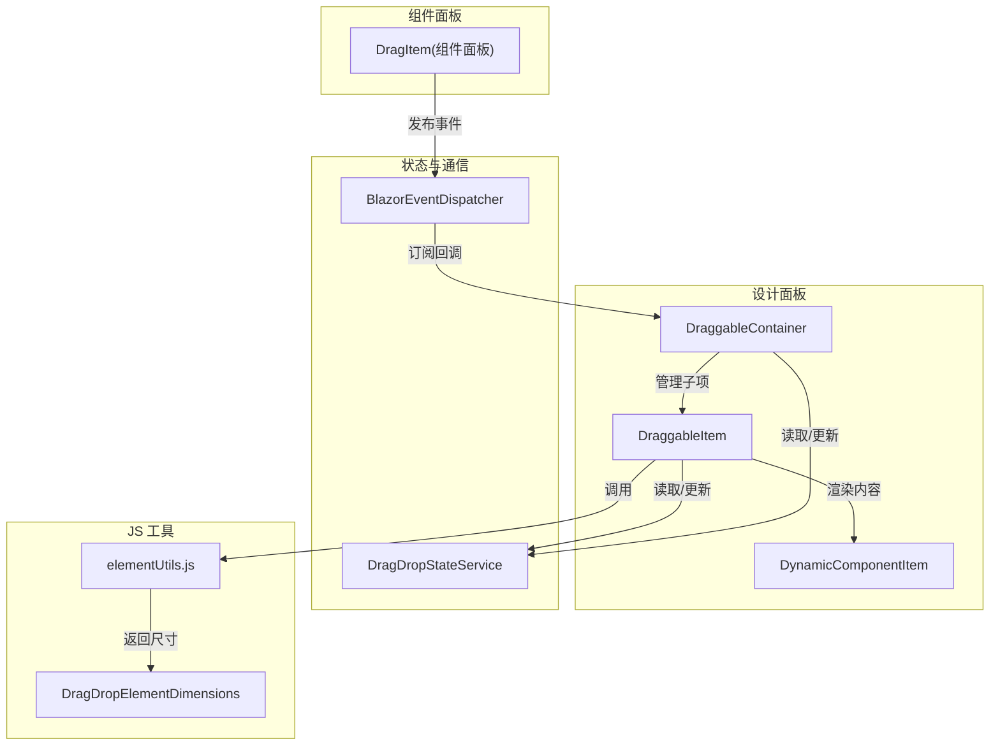
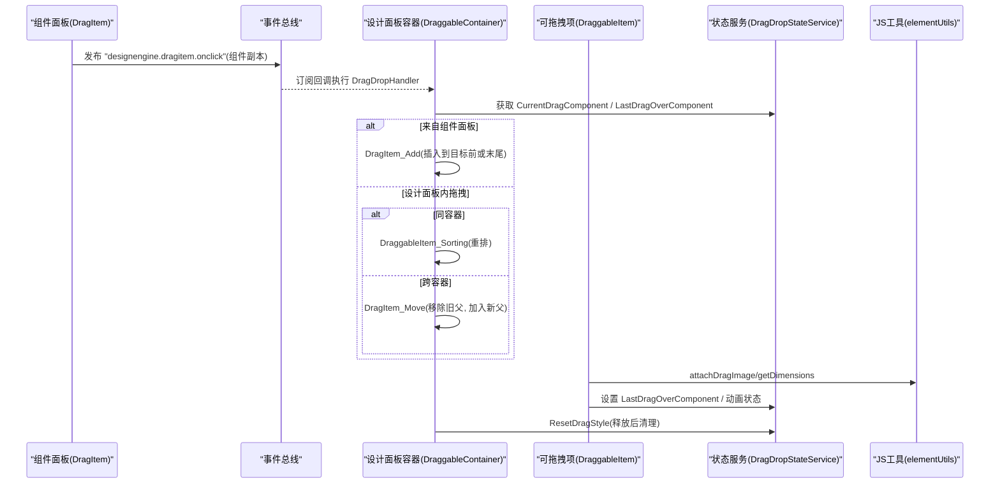
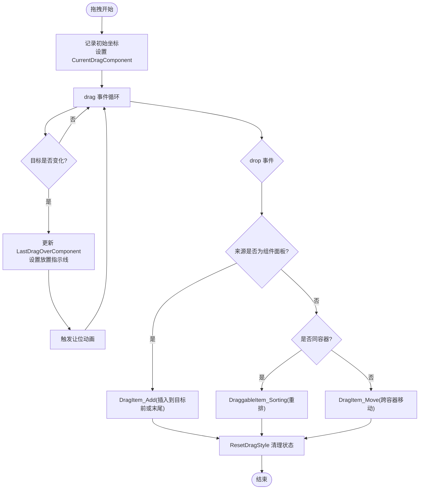
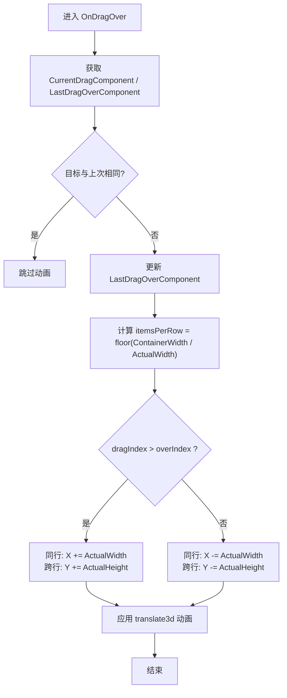
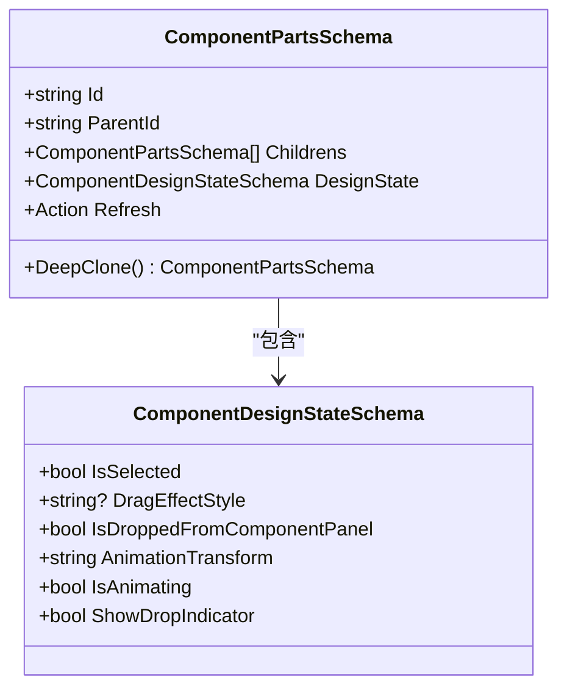
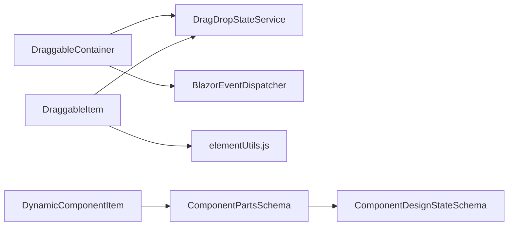

# 拖拽系统

<cite>
**本文引用的文件**   
- [DraggableContainer.razor](file://src/LowCode/DesignEngine/H.LowCode.DesignEngine/DraggableComponents/DraggableContainer.razor)
- [DraggableItem.razor](file://src/LowCode/DesignEngine/H.LowCode.DesignEngine/DraggableComponents/DraggableItem.razor)
- [DragItem.razor（组件面板）](file://src/LowCode/DesignEngine/H.LowCode.DesignEngine/ComponentPanel/DragItem.razor)
- [DynamicComponentItem.razor](file://src/LowCode/DesignEngine/H.LowCode.DesignEngine/DraggableComponents/DynamicComponentItem.razor)
- [DragDropStateService.cs](file://src/LowCode/DesignEngine/H.LowCode.DesignEngine/Services/DragDropStateService.cs)
- [BlazorEventDispatcher.cs](file://src/Utils/H.Util.Blazor/BlazorEventDispatcher.cs)
- [elementUtils.js](file://src/LowCode/DesignEngine/H.LowCode.DesignEngineBase/wwwroot/js/elementUtils.js)
- [DragDropElementDimensions.cs](file://src/LowCode/DesignEngine/H.LowCode.DesignEngineBase/Dtos/DragDropElementDimensions.cs)
- [ComponentPartsSchema.cs](file://src/LowCode/Common/H.LowCode.MetaSchema.DesignEngine/ComponentPartsSchema.cs)
- [ComponentDesignStateSchema.cs](file://src/LowCode/Common/H.LowCode.MetaSchema.DesignEngine/PropertySchemas/ComponentDesignStateSchema.cs)
</cite>

## 目录
1. [简介](#简介)
2. [项目结构](#项目结构)
3. [核心组件](#核心组件)
4. [架构总览](#架构总览)
5. [详细组件分析](#详细组件分析)
6. [依赖关系分析](#依赖关系分析)
7. [性能考量](#性能考量)
8. [故障排查指南](#故障排查指南)
9. [结论](#结论)
10. [附录](#附录)

## 简介
本文件面向低代码平台的“拖拽系统”，系统性阐述以下能力与实现：
- 拖拽状态管理与生命周期：从开始、移动、放置到清理的完整流程，以及跨容器、嵌套容器的状态同步与冲突解决。
- 碰撞检测与插入位置：基于元素尺寸与布局列数的边界计算、行内/跨行判断、目标项选择与插入索引确定。
- 动画与视觉反馈：跟随鼠标的覆盖层、GPU 加速的让位动画、选中态与放置指示线等。
- 约束规则：层级限制、类型匹配、数量限制等业务扩展点。
- 扩展接口：事件总线、JS 工具、状态服务与组件元数据模型，便于自定义拖拽行为。

## 项目结构
拖拽系统由“组件面板”、“设计面板容器”、“可拖拽项”、“状态服务”、“事件总线”和“JS 工具”共同组成。关键文件如下：
- 组件面板拖拽源：[DragItem.razor（组件面板）](file://src/LowCode/DesignEngine/H.LowCode.DesignEngine/ComponentPanel/DragItem.razor)
- 设计面板容器：[DraggableContainer.razor](file://src/LowCode/DesignEngine/H.LowCode.DesignEngine/DraggableComponents/DraggableContainer.razor)
- 可拖拽项：[DraggableItem.razor](file://src/LowCode/DesignEngine/H.LowCode.DesignEngine/DraggableComponents/DraggableItem.razor)
- 动态渲染项：[DynamicComponentItem.razor](file://src/LowCode/DesignEngine/H.LowCode.DesignEngine/DraggableComponents/DynamicComponentItem.razor)
- 状态服务：[DragDropStateService.cs](file://src/LowCode/DesignEngine/H.LowCode.DesignEngine/Services/DragDropStateService.cs)
- 事件总线：[BlazorEventDispatcher.cs](file://src/Utils/H.Util.Blazor/BlazorEventDispatcher.cs)
- JS 工具：[elementUtils.js](file://src/LowCode/DesignEngine/H.LowCode.DesignEngineBase/wwwroot/js/elementUtils.js)
- 尺寸 DTO：[DragDropElementDimensions.cs](file://src/LowCode/DesignEngine/H.LowCode.DesignEngineBase/Dtos/DragDropElementDimensions.cs)
- 组件元数据与设计态：[ComponentPartsSchema.cs](file://src/LowCode/Common/H.LowCode.MetaSchema.DesignEngine/ComponentPartsSchema.cs)、[ComponentDesignStateSchema.cs](file://src/LowCode/Common/H.LowCode.MetaSchema.DesignEngine/PropertySchemas/ComponentDesignStateSchema.cs)

**图表来源** 
- [DragItem.razor（组件面板）](file://src/LowCode/DesignEngine/H.LowCode.DesignEngine/ComponentPanel/DragItem.razor)
- [DraggableContainer.razor](file://src/LowCode/DesignEngine/H.LowCode.DesignEngine/DraggableComponents/DraggableContainer.razor)
- [DraggableItem.razor](file://src/LowCode/DesignEngine/H.LowCode.DesignEngine/DraggableComponents/DraggableItem.razor)
- [DynamicComponentItem.razor](file://src/LowCode/DesignEngine/H.LowCode.DesignEngine/DraggableComponents/DynamicComponentItem.razor)
- [DragDropStateService.cs](file://src/LowCode/DesignEngine/H.LowCode.DesignEngine/Services/DragDropStateService.cs)
- [BlazorEventDispatcher.cs](file://src/Utils/H.Util.Blazor/BlazorEventDispatcher.cs)
- [elementUtils.js](file://src/LowCode/DesignEngine/H.LowCode.DesignEngineBase/wwwroot/js/elementUtils.js)
- [DragDropElementDimensions.cs](file://src/LowCode/DesignEngine/H.LowCode.DesignEngineBase/Dtos/DragDropElementDimensions.cs)

**章节来源**
- [DraggableContainer.razor](file://src/LowCode/DesignEngine/H.LowCode.DesignEngine/DraggableComponents/DraggableContainer.razor)
- [DraggableItem.razor](file://src/LowCode/DesignEngine/H.LowCode.DesignEngine/DraggableComponents/DraggableItem.razor)
- [DragItem.razor（组件面板）](file://src/LowCode/DesignEngine/H.LowCode.DesignEngine/ComponentPanel/DragItem.razor)
- [DynamicComponentItem.razor](file://src/LowCode/DesignEngine/H.LowCode.DesignEngine/DraggableComponents/DynamicComponentItem.razor)
- [DragDropStateService.cs](file://src/LowCode/DesignEngine/H.LowCode.DesignEngine/Services/DragDropStateService.cs)
- [BlazorEventDispatcher.cs](file://src/Utils/H.Util.Blazor/BlazorEventDispatcher.cs)
- [elementUtils.js](file://src/LowCode/DesignEngine/H.LowCode.DesignEngineBase/wwwroot/js/elementUtils.js)
- [DragDropElementDimensions.cs](file://src/LowCode/DesignEngine/H.LowCode.DesignEngineBase/Dtos/DragDropElementDimensions.cs)
- [ComponentPartsSchema.cs](file://src/LowCode/Common/H.LowCode.MetaSchema.DesignEngine/ComponentPartsSchema.cs)
- [ComponentDesignStateSchema.cs](file://src/LowCode/Common/H.LowCode.MetaSchema.DesignEngine/PropertySchemas/ComponentDesignStateSchema.cs)

## 核心组件
- 组件面板拖拽源（DragItem.razor）
  - 负责将组件面板中的组件克隆并标记为“来自组件面板”，通过事件总线通知设计面板根容器进行添加。
- 设计面板容器（DraggableContainer.razor）
  - 监听 drop 事件，根据来源区分新增、排序或跨容器移动；维护选中项、清空动画与指示线。
- 可拖拽项（DraggableItem.razor）
  - 处理 dragstart/dragover/dragenter/dragleave/dragend 等原生事件；驱动让位动画、放置指示线、跟随鼠标的覆盖层。
- 动态渲染项（DynamicComponentItem.razor）
  - 根据 ComponentType 渲染具体组件或容器，支持低代码组件的子节点递归渲染。
- 状态服务（DragDropStateService.cs）
  - 以 appId-pageId 为键维护 RootComponent、LastSelectedComponent、CurrentDragComponent、LastDragOverComponent 等状态，并提供查找与重置方法。
- 事件总线（BlazorEventDispatcher.cs）
  - 提供 Subscribe/Publish/Remove，用于跨组件解耦通信。
- JS 工具（elementUtils.js）与尺寸 DTO（DragDropElementDimensions.cs）
  - 提供 attachDragImage（跟随鼠标的高对比覆盖层）、getDimensions（元素尺寸与容器宽度），支撑高性能拖拽体验。

**章节来源**
- [DragItem.razor（组件面板）](file://src/LowCode/DesignEngine/H.LowCode.DesignEngine/ComponentPanel/DragItem.razor)
- [DraggableContainer.razor](file://src/LowCode/DesignEngine/H.LowCode.DesignEngine/DraggableComponents/DraggableContainer.razor)
- [DraggableItem.razor](file://src/LowCode/DesignEngine/H.LowCode.DesignEngine/DraggableComponents/DraggableItem.razor)
- [DynamicComponentItem.razor](file://src/LowCode/DesignEngine/H.LowCode.DesignEngine/DraggableComponents/DynamicComponentItem.razor)
- [DragDropStateService.cs](file://src/LowCode/DesignEngine/H.LowCode.DesignEngine/Services/DragDropStateService.cs)
- [BlazorEventDispatcher.cs](file://src/Utils/H.Util.Blazor/BlazorEventDispatcher.cs)
- [elementUtils.js](file://src/LowCode/DesignEngine/H.LowCode.DesignEngineBase/wwwroot/js/elementUtils.js)
- [DragDropElementDimensions.cs](file://src/LowCode/DesignEngine/H.LowCode.DesignEngineBase/Dtos/DragDropElementDimensions.cs)

## 架构总览
拖拽系统的控制流围绕“事件总线 + 状态服务 + 组件树”展开：
- 组件面板触发事件，设计面板根容器订阅并执行添加逻辑。
- 设计面板内部拖拽时，DraggableItem 更新 LastDragOverComponent 并触发让位动画。
- 释放时，DraggableContainer 根据来源与目标决定新增、排序或跨容器移动。
- 所有交互均通过 DragDropStateService 读写共享状态，保证多组件间一致性。

**图表来源** 
- [DragItem.razor（组件面板）](file://src/LowCode/DesignEngine/H.LowCode.DesignEngine/ComponentPanel/DragItem.razor)
- [DraggableContainer.razor](file://src/LowCode/DesignEngine/H.LowCode.DesignEngine/DraggableComponents/DraggableContainer.razor)
- [DraggableItem.razor](file://src/LowCode/DesignEngine/H.LowCode.DesignEngine/DraggableComponents/DraggableItem.razor)
- [DragDropStateService.cs](file://src/LowCode/DesignEngine/H.LowCode.DesignEngine/Services/DragDropStateService.cs)
- [BlazorEventDispatcher.cs](file://src/Utils/H.Util.Blazor/BlazorEventDispatcher.cs)
- [elementUtils.js](file://src/LowCode/DesignEngine/H.LowCode.DesignEngineBase/wwwroot/js/elementUtils.js)

## 详细组件分析

### 拖拽状态管理与生命周期
- 生命周期阶段
  - 开始：记录初始坐标、设置当前拖拽对象、清理兄弟动画。
  - 移动：更新 LastDragOverComponent，触发让位动画；首个 drag 事件后才置 isDragging，避免中断原生拖拽。
  - 放置：根据来源与目标执行新增/排序/移动；清理动画与指示线。
  - 结束：恢复样式、清空动画状态。
- 状态同步
  - 使用 DragDropStateService 按 appId-pageId 隔离状态，包含 RootComponent、LastSelectedComponent、CurrentDragComponent、LastDragOverComponent 等。
  - 组件树变更后立即刷新 UI（Refresh/StateHasChanged）。
- 冲突解决
  - 同容器排序：比较 dragIndex 与 overIndex，直接重排 Childrens。
  - 跨容器移动：先从旧父移除，再在新父插入；必要时先刷新旧父确保移除立即生效。
  - 重复悬停：仅在 LastDragOverComponent 变化时触发让位动画，减少闪烁。

**图表来源** 
- [DraggableItem.razor](file://src/LowCode/DesignEngine/H.LowCode.DesignEngine/DraggableComponents/DraggableItem.razor)
- [DraggableContainer.razor](file://src/LowCode/DesignEngine/H.LowCode.DesignEngine/DraggableComponents/DraggableContainer.razor)
- [DragDropStateService.cs](file://src/LowCode/DesignEngine/H.LowCode.DesignEngine/Services/DragDropStateService.cs)

**章节来源**
- [DraggableItem.razor](file://src/LowCode/DesignEngine/H.LowCode.DesignEngine/DraggableComponents/DraggableItem.razor)
- [DraggableContainer.razor](file://src/LowCode/DesignEngine/H.LowCode.DesignEngine/DraggableComponents/DraggableContainer.razor)
- [DragDropStateService.cs](file://src/LowCode/DesignEngine/H.LowCode.DesignEngine/Services/DragDropStateService.cs)

### 碰撞检测与插入位置算法
- 边界计算
  - 通过 elementUtils.getDimensions 获取 ActualWidth/ActualHeight 与 ContainerWidth，计算每行可容纳项数 itemsPerRow。
- 嵌套判断
  - 若 currentDragComponent 在 ContainerComponent.Childrens 中，视为同容器排序；否则为跨容器移动。
- 插入位置确定
  - 新增：若存在 dragOverComponent，则在其索引处插入；否则追加至末尾。
  - 排序：根据 dragIndex 与 overIndex 删除原位置并插入新位置。
  - 跨容器：从旧父移除，在新父插入。

**图表来源** 
- [DraggableItem.razor](file://src/LowCode/DesignEngine/H.LowCode.DesignEngine/DraggableComponents/DraggableItem.razor)
- [DragDropElementDimensions.cs](file://src/LowCode/DesignEngine/H.LowCode.DesignEngineBase/Dtos/DragDropElementDimensions.cs)

**章节来源**
- [DraggableItem.razor](file://src/LowCode/DesignEngine/H.LowCode.DesignEngine/DraggableComponents/DraggableItem.razor)
- [DraggableContainer.razor](file://src/LowCode/DesignEngine/H.LowCode.DesignEngine/DraggableComponents/DraggableContainer.razor)
- [DragDropElementDimensions.cs](file://src/LowCode/DesignEngine/H.LowCode.DesignEngineBase/Dtos/DragDropElementDimensions.cs)

### 拖拽动画与视觉反馈
- 跟随鼠标的覆盖层
  - 通过 elementUtils.attachDragImage 创建高对比覆盖层，在 requestAnimationFrame 中更新 transform，避免 Blazor 逐事件渲染导致的延迟。
- 让位动画
  - 使用 translate3d 与 will-change 触发 GPU 加速；仅当偏移量变化时更新，降低重绘开销。
- 选中与放置指示
  - 选中态通过 IsSelected 控制样式；放置指示线通过 ShowDropIndicator 切换类名。
- 性能优化
  - 延迟 isDragging 置位，避免中断原生拖拽；批量清理兄弟动画，减少闪烁。

**图表来源** 
- [ComponentDesignStateSchema.cs](file://src/LowCode/Common/H.LowCode.MetaSchema.DesignEngine/PropertySchemas/ComponentDesignStateSchema.cs)
- [ComponentPartsSchema.cs](file://src/LowCode/Common/H.LowCode.MetaSchema.DesignEngine/ComponentPartsSchema.cs)

**章节来源**
- [DraggableItem.razor](file://src/LowCode/DesignEngine/H.LowCode.DesignEngine/DraggableComponents/DraggableItem.razor)
- [elementUtils.js](file://src/LowCode/DesignEngine/H.LowCode.DesignEngineBase/wwwroot/js/elementUtils.js)
- [ComponentDesignStateSchema.cs](file://src/LowCode/Common/H.LowCode.MetaSchema.DesignEngine/PropertySchemas/ComponentDesignStateSchema.cs)
- [ComponentPartsSchema.cs](file://src/LowCode/Common/H.LowCode.MetaSchema.DesignEngine/ComponentPartsSchema.cs)

### 约束规则与业务扩展点
- 层级限制
  - 通过 ParentId 与 Childrens 维护父子关系；跨容器移动需更新 ParentId。
- 类型匹配
  - DynamicComponentItem 根据 ComponentType 决定渲染路径；可在新增/移动前校验类型合法性。
- 数量限制
  - 可在 DragItem_Add 或 DragItem_Move 中加入计数检查，达到上限时拒绝插入。
- 扩展建议
  - 在 DragDropStateService 增加校验钩子；或在容器组件中注入策略接口，实现自定义规则。

**章节来源**
- [DraggableContainer.razor](file://src/LowCode/DesignEngine/H.LowCode.DesignEngine/DraggableComponents/DraggableContainer.razor)
- [DynamicComponentItem.razor](file://src/LowCode/DesignEngine/H.LowCode.DesignEngine/DraggableComponents/DynamicComponentItem.razor)
- [DragDropStateService.cs](file://src/LowCode/DesignEngine/H.LowCode.DesignEngine/Services/DragDropStateService.cs)

### 扩展接口与自定义拖拽行为
- 事件总线扩展
  - 通过 BlazorEventDispatcher.Subscribe/Publish 定义新事件，如“拖拽前校验”、“拖拽后回调”。
- JS 工具扩展
  - 在 elementUtils.js 中新增辅助函数，如更精确的命中测试、网格吸附、区域限制等。
- 状态服务扩展
  - 在 DragDropStateService 增加校验方法（如 CanInsert、ValidateMove），供容器组件调用。
- 组件元数据扩展
  - 在 ComponentDesignStateSchema 增加自定义字段（如 AllowedParents、MaxChildren），在拖拽逻辑中读取并应用。

**章节来源**
- [BlazorEventDispatcher.cs](file://src/Utils/H.Util.Blazor/BlazorEventDispatcher.cs)
- [elementUtils.js](file://src/LowCode/DesignEngine/H.LowCode.DesignEngineBase/wwwroot/js/elementUtils.js)
- [DragDropStateService.cs](file://src/LowCode/DesignEngine/H.LowCode.DesignEngine/Services/DragDropStateService.cs)
- [ComponentDesignStateSchema.cs](file://src/LowCode/Common/H.LowCode.MetaSchema.DesignEngine/PropertySchemas/ComponentDesignStateSchema.cs)

## 依赖关系分析
- 组件耦合
  - DraggableContainer 依赖 DragDropStateService 与事件总线；DraggableItem 依赖状态服务与 JS 工具。
- 外部依赖
  - BlazorEventDispatcher 提供全局事件分发；elementUtils.js 提供 DOM 操作与动画优化。
- 潜在循环依赖
  - 当前无循环引用；状态服务为静态字典，组件通过方法访问，避免强耦合。

**图表来源** 
- [DraggableContainer.razor](file://src/LowCode/DesignEngine/H.LowCode.DesignEngine/DraggableComponents/DraggableContainer.razor)
- [DraggableItem.razor](file://src/LowCode/DesignEngine/H.LowCode.DesignEngine/DraggableComponents/DraggableItem.razor)
- [DynamicComponentItem.razor](file://src/LowCode/DesignEngine/H.LowCode.DesignEngine/DraggableComponents/DynamicComponentItem.razor)
- [DragDropStateService.cs](file://src/LowCode/DesignEngine/H.LowCode.DesignEngine/Services/DragDropStateService.cs)
- [BlazorEventDispatcher.cs](file://src/Utils/H.Util.Blazor/BlazorEventDispatcher.cs)
- [elementUtils.js](file://src/LowCode/DesignEngine/H.LowCode.DesignEngineBase/wwwroot/js/elementUtils.js)
- [ComponentPartsSchema.cs](file://src/LowCode/Common/H.LowCode.MetaSchema.DesignEngine/ComponentPartsSchema.cs)
- [ComponentDesignStateSchema.cs](file://src/LowCode/Common/H.LowCode.MetaSchema.DesignEngine/PropertySchemas/ComponentDesignStateSchema.cs)

**章节来源**
- [DraggableContainer.razor](file://src/LowCode/DesignEngine/H.LowCode.DesignEngine/DraggableComponents/DraggableContainer.razor)
- [DraggableItem.razor](file://src/LowCode/DesignEngine/H.LowCode.DesignEngine/DraggableComponents/DraggableItem.razor)
- [DynamicComponentItem.razor](file://src/LowCode/DesignEngine/H.LowCode.DesignEngine/DraggableComponents/DynamicComponentItem.razor)
- [DragDropStateService.cs](file://src/LowCode/DesignEngine/H.LowCode.DesignEngine/Services/DragDropStateService.cs)
- [BlazorEventDispatcher.cs](file://src/Utils/H.Util.Blazor/BlazorEventDispatcher.cs)
- [elementUtils.js](file://src/LowCode/DesignEngine/H.LowCode.DesignEngineBase/wwwroot/js/elementUtils.js)
- [ComponentPartsSchema.cs](file://src/LowCode/Common/H.LowCode.MetaSchema.DesignEngine/ComponentPartsSchema.cs)
- [ComponentDesignStateSchema.cs](file://src/LowCode/Common/H.LowCode.MetaSchema.DesignEngine/PropertySchemas/ComponentDesignStateSchema.cs)

## 性能考量
- 使用 translate3d 与 will-change 启用 GPU 加速，减少重排重绘。
- 仅在偏移量变化时更新动画，避免频繁 StateHasChanged。
- 延迟 isDragging 置位，避免中断原生拖拽导致的事件丢失。
- 批量清理兄弟动画，减少闪烁与多余渲染。
- 通过 JS 覆盖层处理跟随鼠标，避免 Blazor 高频渲染带来的卡顿。

## 故障排查指南
- 拖拽被中断
  - 检查是否在 dragstart 中修改了源节点样式；应延迟到首个 drag 事件再置 isDragging。
- 动画不生效
  - 确认设置了 translate3d 与 will-change；检查 IsAnimating 与 AnimationTransform 是否正确赋值。
- 放置指示线异常
  - 确认 SetDropIndicator 仅对当前目标设置，其他兄弟清除；检查 ShowDropIndicator 与类名映射。
- 状态不同步
  - 检查 DragDropStateService 的 Key 是否一致（appId-pageId）；确保 RefreshState 被调用。
- 跨容器移动失败
  - 确认先从旧父移除并刷新，再在新父插入；检查 ParentId 更新。

**章节来源**
- [DraggableItem.razor](file://src/LowCode/DesignEngine/H.LowCode.DesignEngine/DraggableComponents/DraggableItem.razor)
- [DraggableContainer.razor](file://src/LowCode/DesignEngine/H.LowCode.DesignEngine/DraggableComponents/DraggableContainer.razor)
- [DragDropStateService.cs](file://src/LowCode/DesignEngine/H.LowCode.DesignEngine/Services/DragDropStateService.cs)

## 结论
该拖拽系统以“事件总线 + 状态服务 + 组件树”为核心，结合 JS 工具实现了高性能、可定制的拖拽体验。通过清晰的职责划分与可扩展接口，能够灵活应对复杂业务场景下的层级、类型与数量约束。建议在后续迭代中引入更精细的命中测试、网格吸附与撤销/重做机制，进一步提升用户体验与开发效率。

## 附录
- 常用事件名称
  - designengine.dragitem.onclick（组件面板点击/拖拽）
  - designengine.draggableitem.onblur（设计面板失焦）
  - designengine.pagesetting.pagelayout.onchange（页面布局变更）
- 关键状态字段
  - IsSelected、AnimationTransform、IsAnimating、ShowDropIndicator、IsDroppedFromComponentPanel