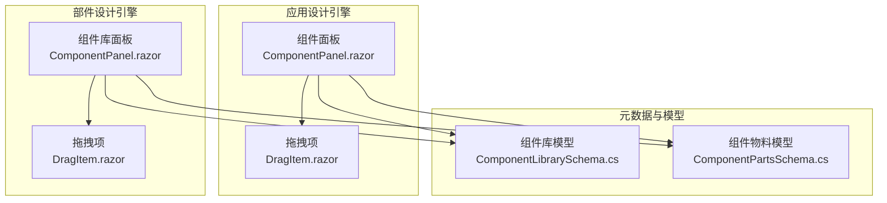
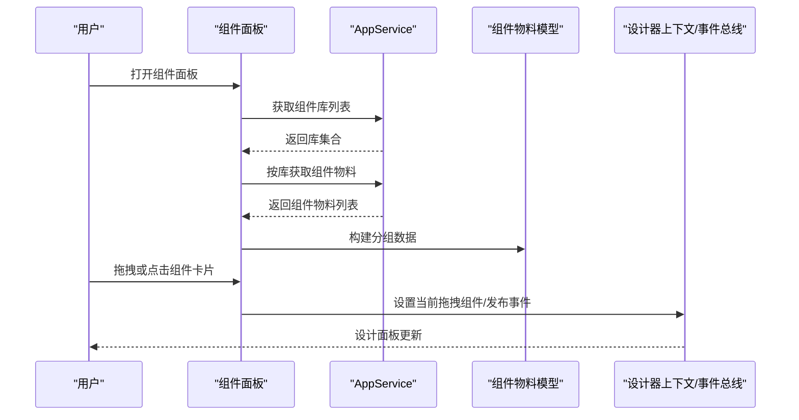
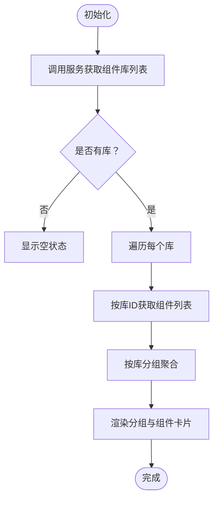
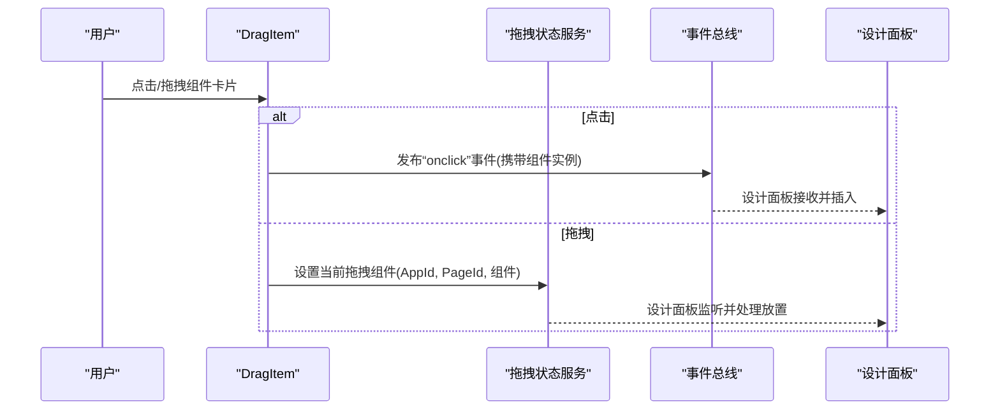
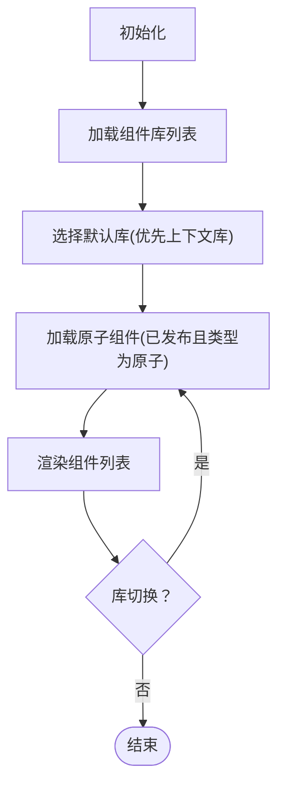
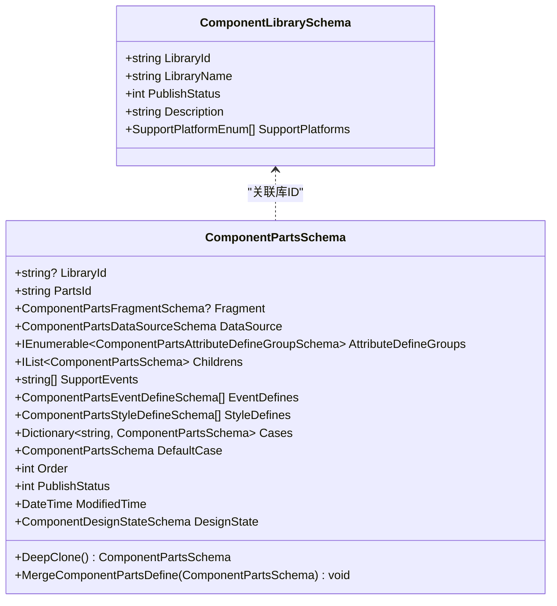
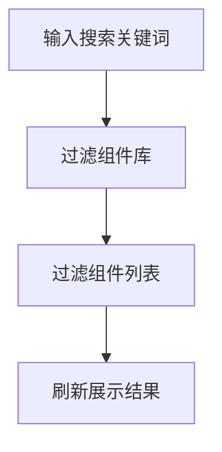
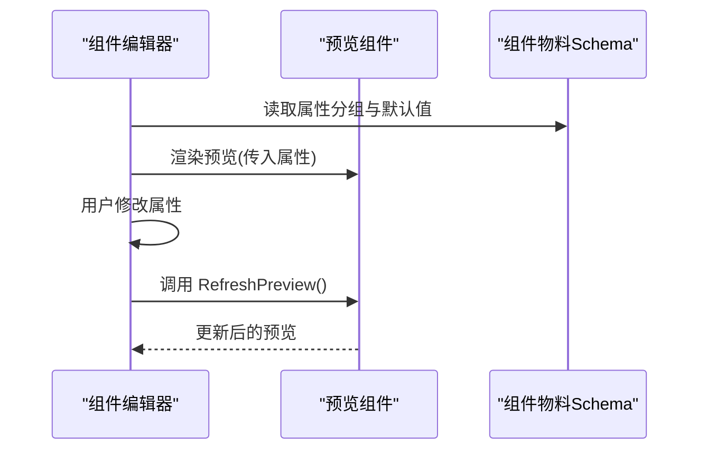
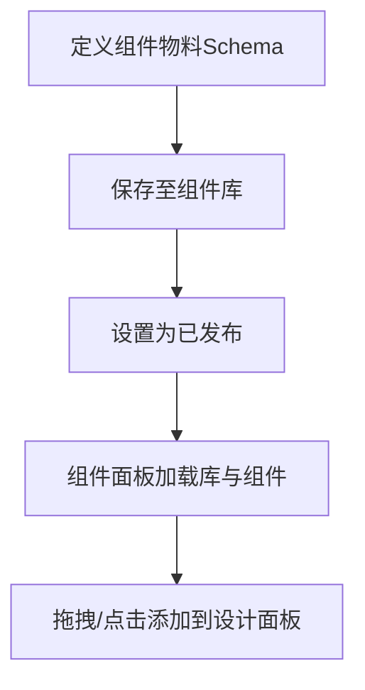
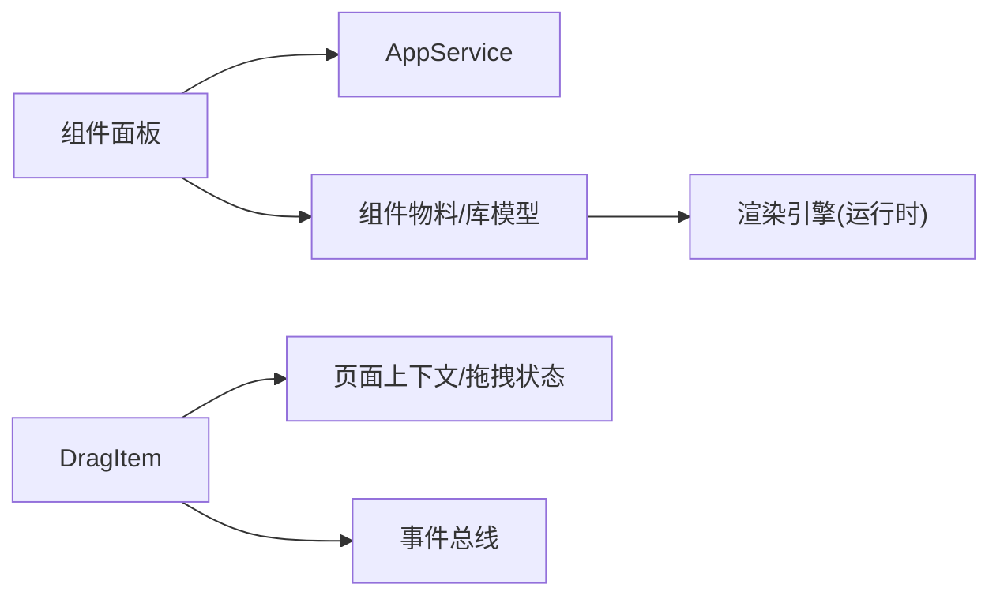

# 组件面板

<cite>
**本文引用的文件**   
- [ComponentPanel.razor](file://src/LowCode/DesignEngine/H.LowCode.DesignEngine/ComponentPanel/ComponentPanel.razor)
- [DragItem.razor](file://src/LowCode/DesignEngine/H.LowCode.DesignEngine/ComponentPanel/DragItem.razor)
- [ComponentPanel.razor（部件设计引擎）](file://src/LowCode/DesignEngine/H.LowCode.PartsDesignEngine/ComponentPanel/ComponentPanel.razor)
- [DragItem.razor（部件设计引擎）](file://src/LowCode/DesignEngine/H.LowCode.PartsDesignEngine/ComponentPanel/DragItem.razor)
- [ComponentPartsSchema.cs](file://src/LowCode/Common/H.LowCode.MetaSchema.DesignEngine/ComponentPartsSchema.cs)
- [ComponentLibrarySchema.cs](file://src/LowCode/Common/H.LowCode.MetaSchema.DesignEngine/ComponentLibrarySchema.cs)
- [ComponentLibraryManager.razor](file://src/LowCode/DesignEngine/H.LowCode.PartsDesignEngine/Pages/ComponentParts/ComponentLibraryManager.razor)
- [ComponentPartsEditorPage.razor](file://src/LowCode/DesignEngine/H.LowCode.PartsDesignEngine/Pages/ComponentParts/ComponentPartsEditorPage.razor)
- [conditional.json](file://src/LowCode/meta/parts/componentParts/common/conditional.json)
- [common.json](file://src/LowCode/meta/parts/componentParts/common/common.json)
</cite>

## 目录
1. [简介](#简介)
2. [项目结构](#项目结构)
3. [核心组件](#核心组件)
4. [架构总览](#架构总览)
5. [详细组件分析](#详细组件分析)
6. [依赖关系分析](#依赖关系分析)
7. [性能考量](#性能考量)
8. [故障排查指南](#故障排查指南)
9. [结论](#结论)
10. [附录](#附录)

## 简介
本文件面向低代码平台的“组件面板”子系统，系统性说明组件分类组织、查找与收藏能力、预览机制、自定义组件注册流程、元数据定义与版本管理，以及样式定制与主题适配方案。文档基于仓库中的实际实现进行梳理，并提供可视化图示帮助理解。

## 项目结构
组件面板在两个设计引擎中均有体现：
- 应用级设计引擎（H.LowCode.DesignEngine）：提供“组件库/页面库/数据源/在线编码”多标签的左侧面板，按组件库分组展示组件卡片，支持拖拽与点击添加。
- 部件设计引擎（H.LowCode.PartsDesignEngine）：提供“原子组件”列表视图，用于选择并编辑组件物料（Component Parts）。

**图表来源** 
- [ComponentPanel.razor](file://src/LowCode/DesignEngine/H.LowCode.DesignEngine/ComponentPanel/ComponentPanel.razor)
- [DragItem.razor](file://src/LowCode/DesignEngine/H.LowCode.DesignEngine/ComponentPanel/DragItem.razor)
- [ComponentPanel.razor（部件设计引擎）](file://src/LowCode/DesignEngine/H.LowCode.PartsDesignEngine/ComponentPanel/ComponentPanel.razor)
- [DragItem.razor（部件设计引擎）](file://src/LowCode/DesignEngine/H.LowCode.PartsDesignEngine/ComponentPanel/DragItem.razor)
- [ComponentLibrarySchema.cs](file://src/LowCode/Common/H.LowCode.MetaSchema.DesignEngine/ComponentLibrarySchema.cs)
- [ComponentPartsSchema.cs](file://src/LowCode/Common/H.LowCode.MetaSchema.DesignEngine/ComponentPartsSchema.cs)

**章节来源**
- [ComponentPanel.razor](file://src/LowCode/DesignEngine/H.LowCode.DesignEngine/ComponentPanel/ComponentPanel.razor)
- [ComponentPanel.razor（部件设计引擎）](file://src/LowCode/DesignEngine/H.LowCode.PartsDesignEngine/ComponentPanel/ComponentPanel.razor)

## 核心组件
- 应用设计引擎组件面板：负责加载组件库、按库分组渲染组件卡片、切换“组件库/页面库”等标签页，并通过 DragItem 完成拖拽或点击添加。
- 部件设计引擎组件面板：负责列出当前库下的已发布原子组件，供用户选择与编辑。
- 拖拽项 DragItem：封装拖拽与点击行为，将组件实例注入到设计面板上下文或事件总线。
- 元数据模型：
  - ComponentLibrarySchema：描述组件库标识、名称、平台支持、发布状态等。
  - ComponentPartsSchema：描述组件物料的结构、属性分组、事件、样式、数据源、条件分支、版本、修改时间与设计期状态等。

**章节来源**
- [ComponentPanel.razor](file://src/LowCode/DesignEngine/H.LowCode.DesignEngine/ComponentPanel/ComponentPanel.razor)
- [DragItem.razor](file://src/LowCode/DesignEngine/H.LowCode.DesignEngine/ComponentPanel/DragItem.razor)
- [ComponentPanel.razor（部件设计引擎）](file://src/LowCode/DesignEngine/H.LowCode.PartsDesignEngine/ComponentPanel/ComponentPanel.razor)
- [ComponentPartsSchema.cs](file://src/LowCode/Common/H.LowCode.MetaSchema.DesignEngine/ComponentPartsSchema.cs)
- [ComponentLibrarySchema.cs](file://src/LowCode/Common/H.LowCode.MetaSchema.DesignEngine/ComponentLibrarySchema.cs)

## 架构总览
组件面板通过 AppService 获取组件库与组件物料，以“库-组件”两级结构组织；交互层通过 DragItem 将组件实例传递到设计器上下文或事件总线；运行时由渲染引擎根据 Fragment 类型动态渲染。

**图表来源** 
- [ComponentPanel.razor](file://src/LowCode/DesignEngine/H.LowCode.DesignEngine/ComponentPanel/ComponentPanel.razor)
- [DragItem.razor](file://src/LowCode/DesignEngine/H.LowCode.DesignEngine/ComponentPanel/DragItem.razor)
- [ComponentPartsSchema.cs](file://src/LowCode/Common/H.LowCode.MetaSchema.DesignEngine/ComponentPartsSchema.cs)

## 详细组件分析

### 应用设计引擎：组件面板（ComponentPanel.razor）
- 功能要点
  - 顶部图标栏切换“组件库/数据源/在线编码”。
  - “组件库”内再分“组件库/页面库”子标签。
  - 按组件库分组渲染组件卡片，默认展开指定库（如 antdesign、common）。
  - 初始化时先拉取所有组件库，再逐个拉取该库下的组件，组装为 Dictionary<string, List<ComponentPartsSchema>>。
- 关键数据结构
  - ComponentsByLibrary：按库名分组的组件集合，使用持久化状态标记。
- 交互逻辑
  - 每个组件卡片以 DragItem 渲染，支持拖拽与点击两种添加方式。

**图表来源** 
- [ComponentPanel.razor](file://src/LowCode/DesignEngine/H.LowCode.DesignEngine/ComponentPanel/ComponentPanel.razor)

**章节来源**
- [ComponentPanel.razor](file://src/LowCode/DesignEngine/H.LowCode.DesignEngine/ComponentPanel/ComponentPanel.razor)

### 应用设计引擎：拖拽项（DragItem.razor）
- 功能要点
  - 支持 HTML5 拖拽与点击两种添加路径。
  - 点击时在 UI 线程发布事件，避免跨线程 InvokeAsync 异常。
  - 拖拽时将当前组件写入拖拽状态服务，供设计面板接收。
- 关键参数
  - CascadingParameter PageCascading：页面上下文（包含 AppId、PageId）。
  - Parameter Component：组件物料实例（深拷贝后注入）。

**图表来源** 
- [DragItem.razor](file://src/LowCode/DesignEngine/H.LowCode.DesignEngine/ComponentPanel/DragItem.razor)

**章节来源**
- [DragItem.razor](file://src/LowCode/DesignEngine/H.LowCode.DesignEngine/ComponentPanel/DragItem.razor)

### 部件设计引擎：组件面板（ComponentPanel.razor）
- 功能要点
  - 仅展示“组件库”标签，下拉选择组件库，过滤出已发布的原子组件（ComponentType==1）。
  - 默认选中设计上下文所在库，不存在则回退到第一个库。
- 数据流
  - OnInitializedAsync 加载库列表与初始组件列表；OnLibraryChanged 响应库切换重新加载。

**图表来源** 
- [ComponentPanel.razor（部件设计引擎）](file://src/LowCode/DesignEngine/H.LowCode.PartsDesignEngine/ComponentPanel/ComponentPanel.razor)

**章节来源**
- [ComponentPanel.razor（部件设计引擎）](file://src/LowCode/DesignEngine/H.LowCode.PartsDesignEngine/ComponentPanel/ComponentPanel.razor)

### 部件设计引擎：拖拽项（DragItem.razor）
- 与应用的 DragItem 类似，但运行于部件设计引擎上下文中，用于从库中选择原子组件并进入编辑流程。

**章节来源**
- [DragItem.razor（部件设计引擎）](file://src/LowCode/DesignEngine/H.LowCode.PartsDesignEngine/ComponentPanel/DragItem.razor)

### 组件元数据与版本管理（ComponentPartsSchema / ComponentLibrarySchema）
- ComponentPartsSchema
  - 字段涵盖：库ID、物料ID、Fragment 类型、数据源配置、属性分组、事件与样式定义、条件分支、排序、发布状态、修改时间、设计期状态、版本 v 等。
  - 提供 DeepClone 方法用于复制新实例并重置 ID、父ID、名称与选中态，同时递归修复子节点与回调引用。
  - MergeComponentPartsDefine 用于合并物料定义到实例，覆盖属性分组、数据源片段、事件支持等。
- ComponentLibrarySchema
  - 字段涵盖：库ID、库名称、发布状态、描述、支持平台数组。

**图表来源** 
- [ComponentLibrarySchema.cs](file://src/LowCode/Common/H.LowCode.MetaSchema.DesignEngine/ComponentLibrarySchema.cs)
- [ComponentPartsSchema.cs](file://src/LowCode/Common/H.LowCode.MetaSchema.DesignEngine/ComponentPartsSchema.cs)

**章节来源**
- [ComponentPartsSchema.cs](file://src/LowCode/Common/H.LowCode.MetaSchema.DesignEngine/ComponentPartsSchema.cs)
- [ComponentLibrarySchema.cs](file://src/LowCode/Common/H.LowCode.MetaSchema.DesignEngine/ComponentLibrarySchema.cs)

### 组件搜索、过滤与收藏
- 搜索与过滤
  - 组件库管理页面提供“搜索组件库”和“搜索组件”输入框，结合前端筛选实现快速定位。
  - 部件面板在切换库时自动过滤出“已发布且类型为原子”的组件。
- 收藏
  - 当前实现未内置“收藏”能力；可通过扩展 DragItem 或增加本地存储/后端接口实现常用组件收藏。

**图表来源** 
- [ComponentLibraryManager.razor](file://src/LowCode/DesignEngine/H.LowCode.PartsDesignEngine/Pages/ComponentParts/ComponentLibraryManager.razor)
- [ComponentPanel.razor（部件设计引擎）](file://src/LowCode/DesignEngine/H.LowCode.PartsDesignEngine/ComponentPanel/ComponentPanel.razor)

**章节来源**
- [ComponentLibraryManager.razor](file://src/LowCode/DesignEngine/H.LowCode.PartsDesignEngine/Pages/ComponentParts/ComponentLibraryManager.razor)
- [ComponentPanel.razor（部件设计引擎）](file://src/LowCode/DesignEngine/H.LowCode.PartsDesignEngine/ComponentPanel/ComponentPanel.razor)

### 组件预览机制（缩略图、实时预览、属性预配置）
- 缩略图生成
  - 当前实现未提供专门的缩略图生成逻辑；可在组件物料中扩展 thumbnail 字段并在面板中渲染。
- 实时预览
  - 部件编辑器页面包含“实时预览”区域，当配置变更时调用预览组件的 RefreshPreview 刷新。
- 属性预配置
  - 组件物料定义中包含属性分组与默认值，编辑器可据此生成表单并进行预填充。

**图表来源** 
- [ComponentPartsEditorPage.razor](file://src/LowCode/DesignEngine/H.LowCode.PartsDesignEngine/Pages/ComponentParts/ComponentPartsEditorPage.razor)

**章节来源**
- [ComponentPartsEditorPage.razor](file://src/LowCode/DesignEngine/H.LowCode.PartsDesignEngine/Pages/ComponentParts/ComponentPartsEditorPage.razor)

### 自定义组件注册流程
- 步骤概览
  - 创建组件物料（ComponentPartsSchema），定义 Fragment 类型、属性分组、事件与样式定义、数据源等。
  - 将物料保存到组件库（ComponentLibrarySchema），确保发布状态为已发布。
  - 在设计引擎中，组件面板会按库拉取并发布到设计器上下文。
- 示例参考
  - conditional.json 展示了条件分支组件的物料定义结构（含属性分组、Fragment 类型等）。
  - common.json 展示了通用组件库的元数据。

**图表来源** 
- [ComponentPartsSchema.cs](file://src/LowCode/Common/H.LowCode.MetaSchema.DesignEngine/ComponentPartsSchema.cs)
- [ComponentLibrarySchema.cs](file://src/LowCode/Common/H.LowCode.MetaSchema.DesignEngine/ComponentLibrarySchema.cs)
- [conditional.json](file://src/LowCode/meta/parts/componentParts/common/conditional.json)
- [common.json](file://src/LowCode/meta/parts/componentParts/common/common.json)

**章节来源**
- [ComponentPartsSchema.cs](file://src/LowCode/Common/H.LowCode.MetaSchema.DesignEngine/ComponentPartsSchema.cs)
- [ComponentLibrarySchema.cs](file://src/LowCode/Common/H.LowCode.MetaSchema.DesignEngine/ComponentLibrarySchema.cs)
- [conditional.json](file://src/LowCode/meta/parts/componentParts/common/conditional.json)
- [common.json](file://src/LowCode/meta/parts/componentParts/common/common.json)

### 组件面板样式定制与主题适配
- 样式定制
  - 组件面板使用 scoped CSS（如 DragItem.razor.css），可在对应组件文件中扩展样式类。
  - 应用设计引擎与部件设计引擎各自维护样式，便于独立定制。
- 主题适配
  - 渲染引擎提供主题包（如 AntBlazor 主题），可在主题层统一调整组件容器宽度、边距等视觉表现。
  - 建议在主题层提供统一的变量或类名，以便面板与渲染保持一致风格。

**章节来源**
- [DragItem.razor](file://src/LowCode/DesignEngine/H.LowCode.DesignEngine/ComponentPanel/DragItem.razor)
- [DragItem.razor（部件设计引擎）](file://src/LowCode/DesignEngine/H.LowCode.PartsDesignEngine/ComponentPanel/DragItem.razor)

## 依赖关系分析
- 组件面板依赖 AppService 获取组件库与组件物料。
- DragItem 依赖页面上下文与拖拽状态服务/事件总线，将组件实例传递给设计面板。
- 组件物料与库模型构成元数据契约，贯穿设计、编辑与渲染阶段。

**图表来源** 
- [ComponentPanel.razor](file://src/LowCode/DesignEngine/H.LowCode.DesignEngine/ComponentPanel/ComponentPanel.razor)
- [DragItem.razor](file://src/LowCode/DesignEngine/H.LowCode.DesignEngine/ComponentPanel/DragItem.razor)
- [ComponentPartsSchema.cs](file://src/LowCode/Common/H.LowCode.MetaSchema.DesignEngine/ComponentPartsSchema.cs)
- [ComponentLibrarySchema.cs](file://src/LowCode/Common/H.LowCode.MetaSchema.DesignEngine/ComponentLibrarySchema.cs)

**章节来源**
- [ComponentPanel.razor](file://src/LowCode/DesignEngine/H.LowCode.DesignEngine/ComponentPanel/ComponentPanel.razor)
- [DragItem.razor](file://src/LowCode/DesignEngine/H.LowCode.DesignEngine/ComponentPanel/DragItem.razor)
- [ComponentPartsSchema.cs](file://src/LowCode/Common/H.LowCode.MetaSchema.DesignEngine/ComponentPartsSchema.cs)
- [ComponentLibrarySchema.cs](file://src/LowCode/Common/H.LowCode.MetaSchema.DesignEngine/ComponentLibrarySchema.cs)

## 性能考量
- 按需加载：组件面板按库逐个拉取组件，避免一次性加载全部数据。
- 深拷贝优化：DragItem 对组件实例进行深拷贝，防止共享状态污染。
- 事件派发：点击路径在 UI 线程发布事件，避免跨线程异常。
- 建议
  - 对大型库启用分页或懒加载。
  - 对预览组件引入虚拟滚动或防抖刷新。
  - 缓存组件库与组件列表，减少重复请求。

[本节为通用指导，不直接分析具体文件]

## 故障排查指南
- 组件面板为空
  - 检查组件库是否已创建且已发布。
  - 确认 AppService 返回数据是否为空。
- 拖拽无效
  - 检查 DragItem 是否正确设置拖拽状态或发布事件。
  - 确认设计面板是否订阅了对应事件。
- 预览不更新
  - 确认编辑器触发 RefreshPreview 调用。
  - 检查组件物料属性绑定是否正确。

**章节来源**
- [DragItem.razor](file://src/LowCode/DesignEngine/H.LowCode.DesignEngine/ComponentPanel/DragItem.razor)
- [ComponentPartsEditorPage.razor](file://src/LowCode/DesignEngine/H.LowCode.PartsDesignEngine/Pages/ComponentParts/ComponentPartsEditorPage.razor)

## 结论
组件面板围绕“库-组件”两层结构组织，通过 AppService 获取元数据，借助 DragItem 完成交互，配合组件物料 Schema 实现属性、事件、样式与数据源的声明式配置。系统已具备搜索与过滤能力，实时预览在部件编辑器中落地。后续可扩展缩略图、收藏与更丰富的主题定制能力，以提升设计与开发效率。

[本节为总结性内容，不直接分析具体文件]

## 附录
- 相关页面与资源
  - 组件库管理：ComponentLibraryManager.razor
  - 组件物料编辑器：ComponentPartsEditorPage.razor
  - 示例物料：conditional.json、common.json

**章节来源**
- [ComponentLibraryManager.razor](file://src/LowCode/DesignEngine/H.LowCode.PartsDesignEngine/Pages/ComponentParts/ComponentLibraryManager.razor)
- [ComponentPartsEditorPage.razor](file://src/LowCode/DesignEngine/H.LowCode.PartsDesignEngine/Pages/ComponentParts/ComponentPartsEditorPage.razor)
- [conditional.json](file://src/LowCode/meta/parts/componentParts/common/conditional.json)
- [common.json](file://src/LowCode/meta/parts/componentParts/common/common.json)