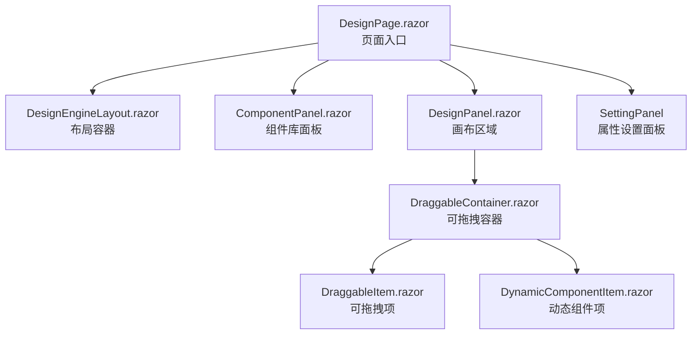
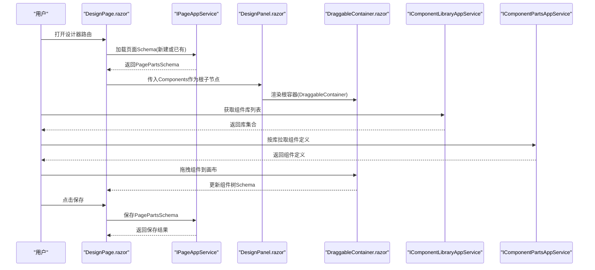
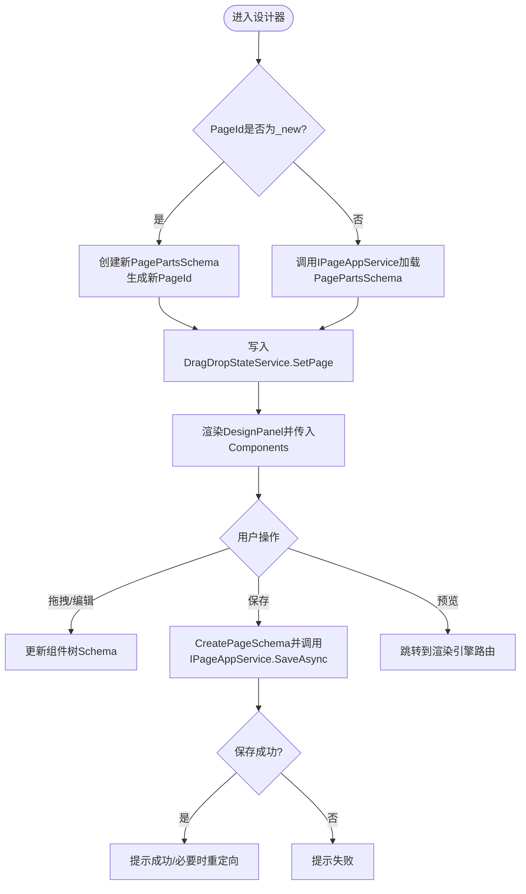
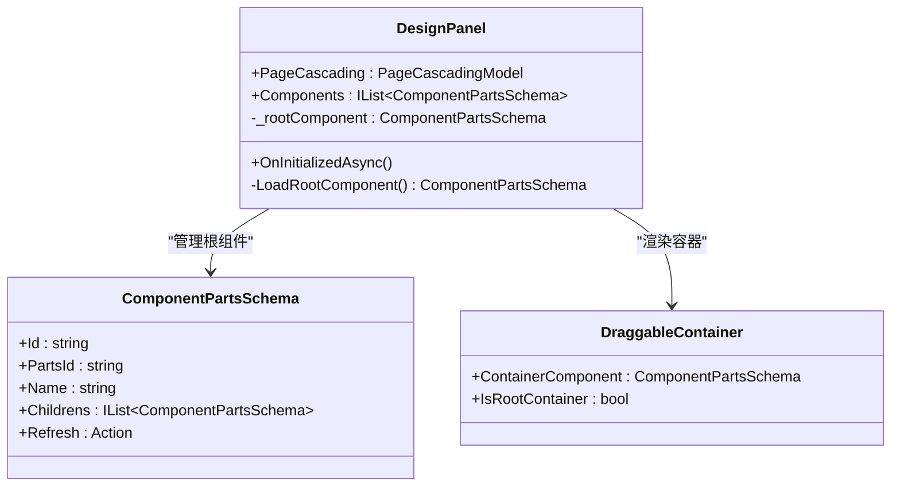
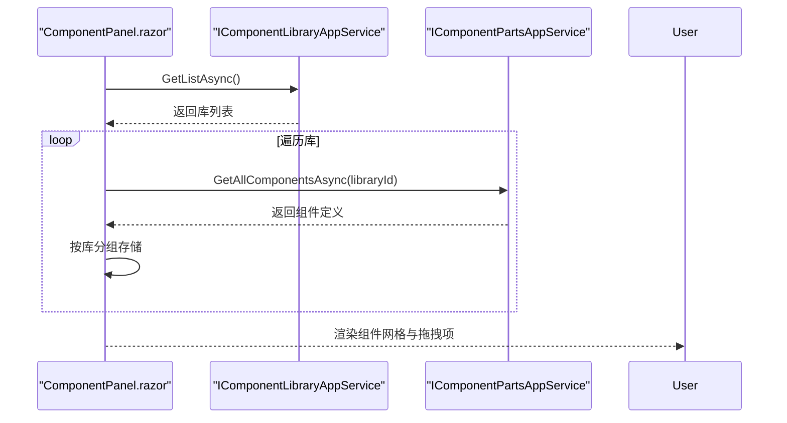
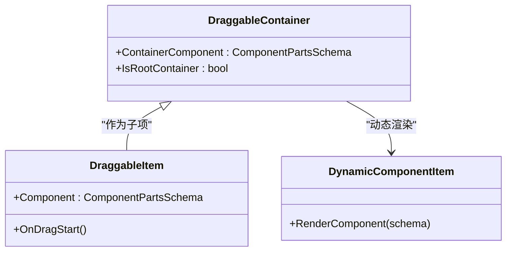
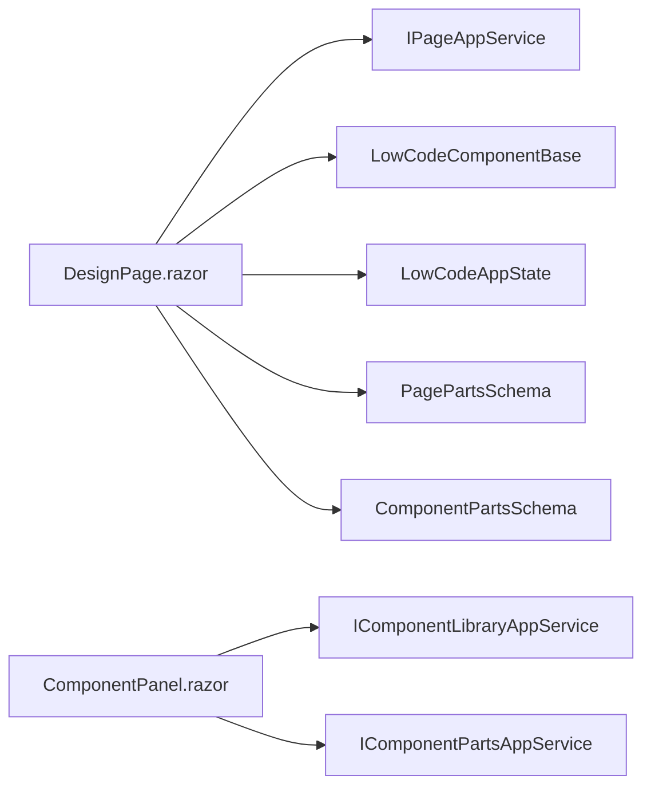

# 设计画布

<cite>
**本文引用的文件**   
- [DesignPage.razor](file://src/LowCode/DesignEngine/H.LowCode.DesignEngine/Pages/DesignPage.razor)
- [DesignPanel.razor](file://src/LowCode/DesignEngine/H.LowCode.DesignEngine/DesignPanel/DesignPanel.razor)
- [ComponentPanel.razor](file://src/LowCode/DesignEngine/H.LowCode.DesignEngine/ComponentPanel/ComponentPanel.razor)
- [DraggableContainer.razor](file://src/LowCode/DesignEngine/H.LowCode.DesignEngine/DraggableComponents/DraggableContainer.razor)
- [DraggableItem.razor](file://src/LowCode/DesignEngine/H.LowCode.DesignEngine/DraggableComponents/DraggableItem.razor)
- [DynamicComponentItem.razor](file://src/LowCode/DesignEngine/H.LowCode.DesignEngine/DraggableComponents/DynamicComponentItem.razor)
- [DesignEngineLayout.razor](file://src/LowCode/DesignEngine/H.LowCode.DesignEngine/Layout/DesignEngineLayout.razor)
- [LowCodeComponentBase.cs](file://src/LowCode/Common/H.LowCode.ComponentBase/LowCodeComponentBase.cs)
- [LowCodeAppState.cs](file://src/LowCode/Common/H.LowCode.ComponentBase/LowCodeAppState.cs)
- [ComponentPartsSchema.cs](file://src/LowCode/Common/H.LowCode.MetaSchema.DesignEngine/ComponentPartsSchema.cs)
- [PagePartsSchema.cs](file://src/LowCode/Common/H.LowCode.MetaSchema.DesignEngine/PagePartsSchema.cs)
- [IComponentLibraryAppService.cs](file://src/LowCode/Common/H.LowCode.Application.Contracts/AppServices/IComponentLibraryAppService.cs)
- [IComponentPartsAppService.cs](file://src/LowCode/Common/H.LowCode.Application.Contracts/AppServices/IComponentPartsAppService.cs)
- [IPageAppService.cs](file://src/LowCode/Common/H.LowCode.Application.Contracts/AppServices/IPageAppService.cs)
</cite>

## 目录
1. [简介](#简介)
2. [项目结构](#项目结构)
3. [核心组件](#核心组件)
4. [架构总览](#架构总览)
5. [详细组件分析](#详细组件分析)
6. [依赖关系分析](#依赖关系分析)
7. [性能考量](#性能考量)
8. [故障排查指南](#故障排查指南)
9. [结论](#结论)
10. [附录](#附录)

## 简介
本文件面向“设计画布”子系统，系统性阐述其渲染机制、交互能力与扩展方式。重点覆盖：
- 组件树结构与渲染流程
- DOM 操作优化策略（虚拟滚动、增量更新、懒加载）
- 画布缩放、平移、网格对齐等交互实现思路
- 选中状态管理、多选与批量编辑
- 性能优化（内存管理、事件节流/防抖、渲染批处理）
- 自定义配置与扩展点（组件库、属性面板、拖拽行为）

## 项目结构
设计画布位于 LowCode 子系统中，采用 Blazor 组件化组织，围绕“页面设计器”路由展开，包含左侧组件库面板、中间画布区域、右侧属性设置面板三大区域。

图表来源
- [DesignPage.razor:1-163](file://src/LowCode/DesignEngine/H.LowCode.DesignEngine/Pages/DesignPage.razor#L1-L163)
- [DesignEngineLayout.razor:1-9](file://src/LowCode/DesignEngine/H.LowCode.DesignEngine/Layout/DesignEngineLayout.razor#L1-L9)
- [ComponentPanel.razor:1-125](file://src/LowCode/DesignEngine/H.LowCode.DesignEngine/ComponentPanel/ComponentPanel.razor#L1-L125)
- [DesignPanel.razor:1-51](file://src/LowCode/DesignEngine/H.LowCode.DesignEngine/DesignPanel/DesignPanel.razor#L1-L51)
- [DraggableContainer.razor](file://src/LowCode/DesignEngine/H.LowCode.DesignEngine/DraggableComponents/DraggableContainer.razor)
- [DraggableItem.razor](file://src/LowCode/DesignEngine/H.LowCode.DesignEngine/DraggableComponents/DraggableItem.razor)
- [DynamicComponentItem.razor](file://src/LowCode/DesignEngine/H.LowCode.DesignEngine/DraggableComponents/DynamicComponentItem.razor)

章节来源
- [DesignPage.razor:1-163](file://src/LowCode/DesignEngine/H.LowCode.DesignEngine/Pages/DesignPage.razor#L1-L163)
- [DesignEngineLayout.razor:1-9](file://src/LowCode/DesignEngine/H.LowCode.DesignEngine/Layout/DesignEngineLayout.razor#L1-L9)

## 核心组件
- DesignPage.razor：页面设计器入口，负责路由参数解析、页面元数据加载、保存/预览逻辑、级联上下文注入。
- DesignPanel.razor：画布区域，承载根组件并渲染为可拖拽容器。
- ComponentPanel.razor：组件库面板，按库分组展示组件，支持拖拽到画布。
- DraggableContainer.razor / DraggableItem.razor / DynamicComponentItem.razor：画布内组件的拖拽与动态渲染基础构件。
- DesignEngineLayout.razor：设计器布局容器，提供全屏主内容区。

章节来源
- [DesignPage.razor:1-163](file://src/LowCode/DesignEngine/H.LowCode.DesignEngine/Pages/DesignPage.razor#L1-L163)
- [DesignPanel.razor:1-51](file://src/LowCode/DesignEngine/H.LowCode.DesignEngine/DesignPanel/DesignPanel.razor#L1-L51)
- [ComponentPanel.razor:1-125](file://src/LowCode/DesignEngine/H.LowCode.DesignEngine/ComponentPanel/ComponentPanel.razor#L1-L125)
- [DraggableContainer.razor](file://src/LowCode/DesignEngine/H.LowCode.DesignEngine/DraggableComponents/DraggableContainer.razor)
- [DraggableItem.razor](file://src/LowCode/DesignEngine/H.LowCode.DesignEngine/DraggableComponents/DraggableItem.razor)
- [DynamicComponentItem.razor](file://src/LowCode/DesignEngine/H.LowCode.DesignEngine/DraggableComponents/DynamicComponentItem.razor)
- [DesignEngineLayout.razor:1-9](file://src/LowCode/DesignEngine/H.LowCode.DesignEngine/Layout/DesignEngineLayout.razor#L1-L9)

## 架构总览
设计画布以“页面 Schema + 组件树 Schema”为核心数据模型，通过服务层获取与持久化，UI 层基于 Blazor 组件树进行渲染。拖拽与选择状态由共享服务维护，确保多面板间一致性。

图表来源
- [DesignPage.razor:1-163](file://src/LowCode/DesignEngine/H.LowCode.DesignEngine/Pages/DesignPage.razor#L1-L163)
- [DesignPanel.razor:1-51](file://src/LowCode/DesignEngine/H.LowCode.DesignEngine/DesignPanel/DesignPanel.razor#L1-L51)
- [ComponentPanel.razor:1-125](file://src/LowCode/DesignEngine/H.LowCode.DesignEngine/ComponentPanel/ComponentPanel.razor#L1-L125)
- [DraggableContainer.razor](file://src/LowCode/DesignEngine/H.LowCode.DesignEngine/DraggableComponents/DraggableContainer.razor)

## 详细组件分析

### 页面入口与设计器布局
- 路由与级联上下文：DesignPage 通过 CascadingValue 注入 PageCascadingModel，供子组件共享 AppId/PageId/PageName 等信息。
- 页面 Schema 生命周期：初始化时根据 PageId 判断新建或加载，调用 IPageAppService 获取 PagePartsSchema，并写入 DragDropStateService。
- 保存与预览：保存时将根组件 Childrens 同步回 PagePartsSchema.Components；预览跳转至渲染引擎路由。

图表来源
- [DesignPage.razor:1-163](file://src/LowCode/DesignEngine/H.LowCode.DesignEngine/Pages/DesignPage.razor#L1-L163)

章节来源
- [DesignPage.razor:1-163](file://src/LowCode/DesignEngine/H.LowCode.DesignEngine/Pages/DesignPage.razor#L1-L163)

### 画布区域与组件树渲染
- 根组件管理：DesignPanel 在初始化时从 DragDropStateService 获取或创建根组件，并将传入的 Components 赋给根节点的 Childrens。
- 渲染容器：使用 DraggableContainer 包裹根组件，使其具备拖放能力。
- 刷新机制：根组件持有 Refresh 回调，用于触发 UI 更新。

图表来源
- [DesignPanel.razor:1-51](file://src/LowCode/DesignEngine/H.LowCode.DesignEngine/DesignPanel/DesignPanel.razor#L1-L51)
- [DraggableContainer.razor](file://src/LowCode/DesignEngine/H.LowCode.DesignEngine/DraggableComponents/DraggableContainer.razor)
- [ComponentPartsSchema.cs](file://src/LowCode/Common/H.LowCode.MetaSchema.DesignEngine/ComponentPartsSchema.cs)

章节来源
- [DesignPanel.razor:1-51](file://src/LowCode/DesignEngine/H.LowCode.DesignEngine/DesignPanel/DesignPanel.razor#L1-L51)

### 组件库面板与拖拽源
- 分组与展示：ComponentPanel 通过 IComponentLibraryAppService 获取库列表，再按库调用 IComponentPartsAppService 拉取组件定义，按库分组渲染。
- 拖拽项：每个组件以 DragItem 形式呈现，支持拖拽到画布。
- 占位与空态：对未实现的“数据源”“在线编码”等 Tab 提供占位内容。

图表来源
- [ComponentPanel.razor:1-125](file://src/LowCode/DesignEngine/H.LowCode.DesignEngine/ComponentPanel/ComponentPanel.razor#L1-L125)

章节来源
- [ComponentPanel.razor:1-125](file://src/LowCode/DesignEngine/H.LowCode.DesignEngine/ComponentPanel/ComponentPanel.razor#L1-L125)

### 拖拽与动态组件渲染
- DraggableContainer：作为画布内的容器，接收 ContainerComponent 并渲染为可放置目标。
- DraggableItem：表示单个可拖拽的组件项，封装拖拽起始数据。
- DynamicComponentItem：根据组件定义动态渲染具体组件实例。

图表来源
- [DraggableContainer.razor](file://src/LowCode/DesignEngine/H.LowCode.DesignEngine/DraggableComponents/DraggableContainer.razor)
- [DraggableItem.razor](file://src/LowCode/DesignEngine/H.LowCode.DesignEngine/DraggableComponents/DraggableItem.razor)
- [DynamicComponentItem.razor](file://src/LowCode/DesignEngine/H.LowCode.DesignEngine/DraggableComponents/DynamicComponentItem.razor)

章节来源
- [DraggableContainer.razor](file://src/LowCode/DesignEngine/H.LowCode.DesignEngine/DraggableComponents/DraggableContainer.razor)
- [DraggableItem.razor](file://src/LowCode/DesignEngine/H.LowCode.DesignEngine/DraggableComponents/DraggableItem.razor)
- [DynamicComponentItem.razor](file://src/LowCode/DesignEngine/H.LowCode.DesignEngine/DraggableComponents/DynamicComponentItem.razor)

### 选中状态管理与多选/批量编辑
- 状态位置：选中状态通常由 DragDropStateService 或全局 AppState 管理，保证跨面板一致。
- 多选策略：通过 Shift/Ctrl 组合键维护 SelectedIds 集合，配合 UI 高亮与批量属性面板。
- 批量编辑：属性面板读取选中集合，应用统一变更并触发增量更新。

说明：该部分为通用实现建议，需结合 DragDropStateService 与属性面板协作完成。

章节来源
- [LowCodeAppState.cs](file://src/LowCode/Common/H.LowCode.ComponentBase/LowCodeAppState.cs)

### 画布交互：缩放、平移、网格对齐
- 缩放与平移：建议在 DraggableContainer 外层容器上监听鼠标滚轮与拖拽事件，计算 transform: scale/translate，避免直接修改大量 DOM 属性。
- 网格对齐：在拖拽结束或移动过程中，将坐标对齐到网格步长，提升布局一致性。
- 性能要点：使用 requestAnimationFrame 合并多次变换，减少重排重绘。

说明：该部分为通用实现建议，可在 DraggableContainer 或其父容器中扩展。

## 依赖关系分析
设计器依赖以下关键类型与服务：
- 页面服务：IPageAppService 负责页面 Schema 的读取与保存。
- 组件库服务：IComponentLibraryAppService、IComponentPartsAppService 负责组件库与组件定义的获取。
- 基类与状态：LowCodeComponentBase、LowCodeAppState 提供公共能力与全局状态。
- 数据模型：PagePartsSchema、ComponentPartsSchema 描述页面与组件结构。

图表来源
- [DesignPage.razor:1-163](file://src/LowCode/DesignEngine/H.LowCode.DesignEngine/Pages/DesignPage.razor#L1-L163)
- [ComponentPanel.razor:1-125](file://src/LowCode/DesignEngine/H.LowCode.DesignEngine/ComponentPanel/ComponentPanel.razor#L1-L125)
- [LowCodeComponentBase.cs](file://src/LowCode/Common/H.LowCode.ComponentBase/LowCodeComponentBase.cs)
- [LowCodeAppState.cs](file://src/LowCode/Common/H.LowCode.ComponentBase/LowCodeAppState.cs)
- [PagePartsSchema.cs](file://src/LowCode/Common/H.LowCode.MetaSchema.DesignEngine/PagePartsSchema.cs)
- [ComponentPartsSchema.cs](file://src/LowCode/Common/H.LowCode.MetaSchema.DesignEngine/ComponentPartsSchema.cs)

章节来源
- [DesignPage.razor:1-163](file://src/LowCode/DesignEngine/H.LowCode.DesignEngine/Pages/DesignPage.razor#L1-L163)
- [ComponentPanel.razor:1-125](file://src/LowCode/DesignEngine/H.LowCode.DesignEngine/ComponentPanel/ComponentPanel.razor#L1-L125)
- [LowCodeComponentBase.cs](file://src/LowCode/Common/H.LowCode.ComponentBase/LowCodeComponentBase.cs)
- [LowCodeAppState.cs](file://src/LowCode/Common/H.LowCode.ComponentBase/LowCodeAppState.cs)
- [PagePartsSchema.cs](file://src/LowCode/Common/H.LowCode.MetaSchema.DesignEngine/PagePartsSchema.cs)
- [ComponentPartsSchema.cs](file://src/LowCode/Common/H.LowCode.MetaSchema.DesignEngine/ComponentPartsSchema.cs)

## 性能考量
- 虚拟滚动：对组件库面板与大型组件树实施虚拟滚动，仅渲染可视区域节点，降低初始渲染与内存占用。
- 增量更新：利用 Blazor 的差异化渲染特性，仅在受影响的组件树上触发 StateHasChanged，避免全量重渲染。
- 懒加载：按需加载组件定义与样式资源，首屏只加载必要库与组件。
- 事件优化：对拖拽、缩放、平移等高频事件使用节流/防抖与 requestAnimationFrame 合并更新。
- 内存管理：及时释放不再使用的组件实例与事件订阅，避免闭包引用导致的泄漏。
- 序列化与缓存：对组件树与页面 Schema 做轻量序列化与本地缓存，减少重复请求。

[本节为通用指导，不直接分析具体文件]

## 故障排查指南
- 页面无法保存：检查 CreatePageSchema 是否正确将根组件 Childrens 写回 PagePartsSchema.Components，以及 IPageAppService.SaveAsync 是否返回成功。
- 组件未显示：确认 DragDropStateService 中根组件已正确设置，且 Components 非空。
- 拖拽无效：检查 DraggableContainer 是否被正确渲染为放置目标，DraggableItem 是否携带正确的组件定义。
- 性能卡顿：排查是否存在全量重渲染、频繁 DOM 操作或未释放的事件订阅。

章节来源
- [DesignPage.razor:1-163](file://src/LowCode/DesignEngine/H.LowCode.DesignEngine/Pages/DesignPage.razor#L1-L163)
- [DesignPanel.razor:1-51](file://src/LowCode/DesignEngine/H.LowCode.DesignEngine/DesignPanel/DesignPanel.razor#L1-L51)
- [ComponentPanel.razor:1-125](file://src/LowCode/DesignEngine/H.LowCode.DesignEngine/ComponentPanel/ComponentPanel.razor#L1-L125)

## 结论
设计画布以清晰的组件分层与数据模型为基础，通过服务层解耦 UI 与数据，借助拖拽与动态渲染实现灵活的页面构建。在性能方面，应优先采用虚拟滚动、增量更新与懒加载策略，并结合事件优化与内存管理保障流畅体验。扩展方面，可通过新增组件库、属性面板与拖拽行为来丰富功能。

## 附录
- 自定义配置与扩展方法
  - 新增组件库：实现 IComponentLibraryAppService 与 IComponentPartsAppService 的数据源，并在 ComponentPanel 中按库分组展示。
  - 扩展属性面板：在 SettingPanel 中增加新的 PropertySettingItems，绑定到 ComponentPartsSchema 的属性。
  - 自定义拖拽行为：在 DraggableContainer 中扩展放置规则与对齐策略。
  - 主题与样式：通过 wwwroot 下的 CSS 文件覆盖默认样式，保持与整体主题一致。

[本节为通用指导，不直接分析具体文件]