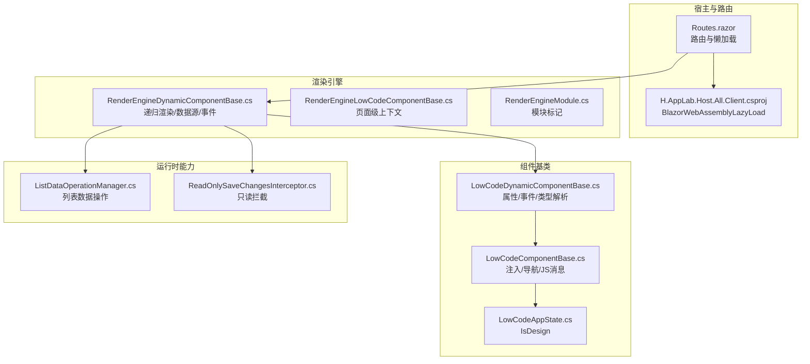
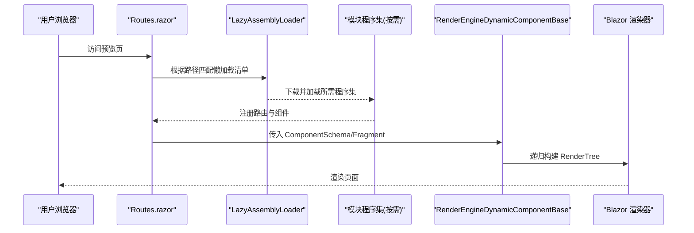
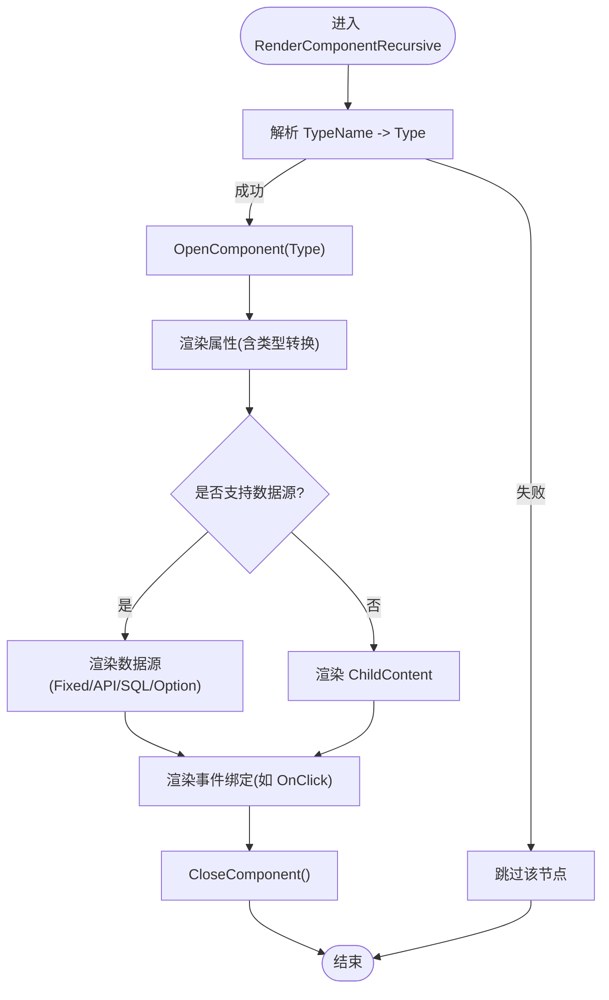
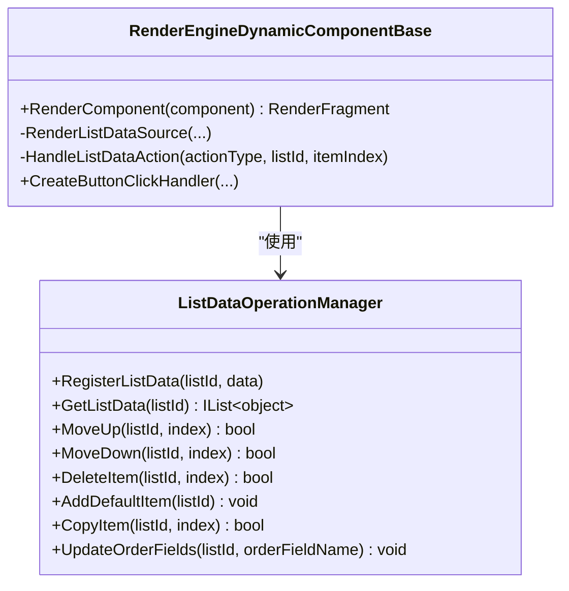
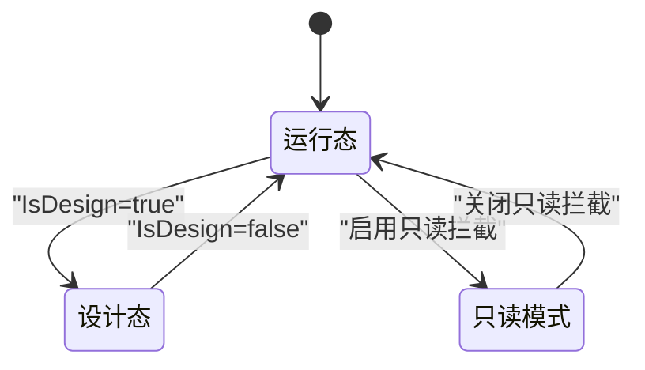
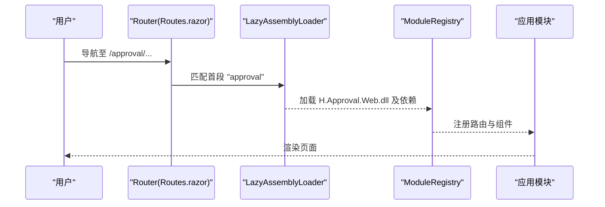
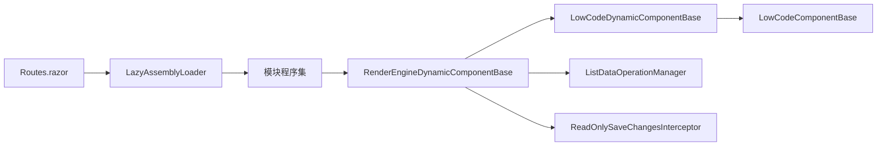

# 预览系统

<cite>
**本文引用的文件**   
- [RenderEngineModule.cs](file://src/LowCode/RenderEngine/H.LowCode.RenderEngine/RenderEngineModule.cs)
- [LowCodeComponentBase.cs](file://src/LowCode/Common/H.LowCode.ComponentBase/LowCodeComponentBase.cs)
- [LowCodeDynamicComponentBase.cs](file://src/LowCode/Common/H.LowCode.ComponentBase/LowCodeDynamicComponentBase.cs)
- [RenderEngineDynamicComponentBase.cs](file://src/LowCode/RenderEngine/H.LowCode.RenderEngineBase/RenderEngineDynamicComponentBase.cs)
- [RenderEngineLowCodeComponentBase.cs](file://src/LowCode/RenderEngine/H.LowCode.RenderEngineBase/RenderEngineLowCodeComponentBase.cs)
- [ListDataOperationManager.cs](file://src/LowCode/RenderEngine/H.LowCode.RenderEngineBase/ListDataOperationManager.cs)
- [ReadOnlySaveChangesInterceptor.cs](file://src/LowCode/RenderEngine/H.LowCode.RenderEngine.EntityFrameworkCore/EntityFrameworkCore/Extensions/ReadOnlySaveChangesInterceptor.cs)
- [Routes.razor](file://src/Host/H.AppLab.Host.All/H.AppLab.Host.All.Client/Routes.razor)
- [H.AppLab.Host.All.Client.csproj](file://src/Host/H.AppLab.Host.All/H.AppLab.Host.All.Client/H.AppLab.Host.All.Client.csproj)
- [LowCodeAppState.cs](file://src/LowCode/Common/H.LowCode.ComponentBase/LowCodeAppState.cs)
</cite>

## 目录
1. [简介](#简介)
2. [项目结构](#项目结构)
3. [核心组件](#核心组件)
4. [架构总览](#架构总览)
5. [详细组件分析](#详细组件分析)
6. [依赖关系分析](#依赖关系分析)
7. [性能考量](#性能考量)
8. [故障排查指南](#故障排查指南)
9. [结论](#结论)
10. [附录](#附录)

## 简介
本文件面向“低代码平台”的预览系统，系统性阐述其实现原理与工程实践。内容覆盖：
- 实时预览渲染引擎集成（基于 Blazor 的动态组件渲染）
- 组件动态加载与类型解析（含旧版兼容映射）
- 样式隔离与只读模式（设计态/运行态切换、数据库写保护）
- 交互限制与安全机制（事件拦截、编辑保护、只读约束）
- 性能优化策略（懒加载、资源缓存、内存管理）
- 调试能力（控制台输出、网络请求监控、性能分析）
- 自定义配置与扩展方法（主题、组件库、数据源）

## 项目结构
预览系统主要位于 LowCode/RenderEngine 及其基础层 RenderEngineBase，配合 Common 中的组件基类与状态管理，以及 Host 端的客户端路由与懒加载配置。

**图示来源** 
- [Routes.razor](file://src/Host/H.AppLab.Host.All/H.AppLab.Host.All.Client/Routes.razor)
- [H.AppLab.Host.All.Client.csproj](file://src/Host/H.AppLab.Host.All/H.AppLab.Host.All.Client/H.AppLab.Host.All.Client.csproj)
- [RenderEngineDynamicComponentBase.cs](file://src/LowCode/RenderEngine/H.LowCode.RenderEngineBase/RenderEngineDynamicComponentBase.cs)
- [RenderEngineLowCodeComponentBase.cs](file://src/LowCode/RenderEngine/H.LowCode.RenderEngineBase/RenderEngineLowCodeComponentBase.cs)
- [RenderEngineModule.cs](file://src/LowCode/RenderEngine/H.LowCode.RenderEngine/RenderEngineModule.cs)
- [LowCodeComponentBase.cs](file://src/LowCode/Common/H.LowCode.ComponentBase/LowCodeComponentBase.cs)
- [LowCodeDynamicComponentBase.cs](file://src/LowCode/Common/H.LowCode.ComponentBase/LowCodeDynamicComponentBase.cs)
- [LowCodeAppState.cs](file://src/LowCode/Common/H.LowCode.ComponentBase/LowCodeAppState.cs)
- [ListDataOperationManager.cs](file://src/LowCode/RenderEngine/H.LowCode.RenderEngineBase/ListDataOperationManager.cs)
- [ReadOnlySaveChangesInterceptor.cs](file://src/LowCode/RenderEngine/H.LowCode.RenderEngine.EntityFrameworkCore/EntityFrameworkCore/Extensions/ReadOnlySaveChangesInterceptor.cs)

**章节来源**
- [Routes.razor](file://src/Host/H.AppLab.Host.All/H.AppLab.Host.All.Client/Routes.razor)
- [H.AppLab.Host.All.Client.csproj](file://src/Host/H.AppLab.Host.All/H.AppLab.Host.All.Client/H.AppLab.Host.All.Client.csproj)

## 核心组件
- 渲染基类与动态组件
  - RenderEngineDynamicComponentBase：负责根据元数据（ComponentSchema/Fragment）递归构建渲染树，处理数据源、条件分支、子节点与事件绑定。
  - LowCodeDynamicComponentBase：提供属性渲染、事件回调绑定、旧版 AntDesign 到 Hc 组件的类型映射与解析。
  - LowCodeComponentBase：统一注入 NavigationManager、IJSRuntime、日志器，提供导航、查询参数获取与 JS 消息服务。
- 运行态能力
  - ListDataOperationManager：集中管理列表数据的增删改查、排序与顺序字段更新。
  - ReadOnlySaveChangesInterceptor：在 EF Core 保存前拦截并阻止对标注为只读的实体的写入。
- 应用状态
  - LowCodeAppState：标识是否处于设计时（IsDesign），用于控制组件行为差异。

**章节来源**
- [RenderEngineDynamicComponentBase.cs](file://src/LowCode/RenderEngine/H.LowCode.RenderEngineBase/RenderEngineDynamicComponentBase.cs)
- [LowCodeDynamicComponentBase.cs](file://src/LowCode/Common/H.LowCode.ComponentBase/LowCodeDynamicComponentBase.cs)
- [LowCodeComponentBase.cs](file://src/LowCode/Common/H.LowCode.ComponentBase/LowCodeComponentBase.cs)
- [ListDataOperationManager.cs](file://src/LowCode/RenderEngine/H.LowCode.RenderEngineBase/ListDataOperationManager.cs)
- [ReadOnlySaveChangesInterceptor.cs](file://src/LowCode/RenderEngine/H.LowCode.RenderEngine.EntityFrameworkCore/EntityFrameworkCore/Extensions/ReadOnlySaveChangesInterceptor.cs)
- [LowCodeAppState.cs](file://src/LowCode/Common/H.LowCode.ComponentBase/LowCodeAppState.cs)

## 架构总览
预览系统以 Blazor WebAssembly 为宿主，通过路由与懒加载按需加载模块程序集；渲染引擎将页面元数据转换为真实组件实例，完成属性、事件、数据源的装配与渲染。

**图示来源** 
- [Routes.razor](file://src/Host/H.AppLab.Host.All/H.AppLab.Host.All.Client/Routes.razor)
- [H.AppLab.Host.All.Client.csproj](file://src/Host/H.AppLab.Host.All/H.AppLab.Host.All.Client/H.AppLab.Host.All.Client.csproj)
- [RenderEngineDynamicComponentBase.cs](file://src/LowCode/RenderEngine/H.LowCode.RenderEngineBase/RenderEngineDynamicComponentBase.cs)

## 详细组件分析

### 动态组件渲染与类型解析
- 递归渲染：从根 Fragment 开始，按类型名解析组件 Type，打开/关闭组件节点，依次渲染属性、数据源、子片段。
- 条件渲染：识别包含“Conditional”的类型，读取 ConditionValue 属性值，选择对应分支或默认分支渲染。
- 属性渲染：支持简单属性、RenderFragment 子内容、EventCallback 事件回调；属性值支持字符串到目标类型的转换。
- 类型兼容：内置旧版 AntDesign 组件名到 Hc 组件名的映射表，避免历史数据无法解析导致崩溃。

**图示来源** 
- [RenderEngineDynamicComponentBase.cs](file://src/LowCode/RenderEngine/H.LowCode.RenderEngineBase/RenderEngineDynamicComponentBase.cs)
- [LowCodeDynamicComponentBase.cs](file://src/LowCode/Common/H.LowCode.ComponentBase/LowCodeDynamicComponentBase.cs)

**章节来源**
- [RenderEngineDynamicComponentBase.cs](file://src/LowCode/RenderEngine/H.LowCode.RenderEngineBase/RenderEngineDynamicComponentBase.cs)
- [LowCodeDynamicComponentBase.cs](file://src/LowCode/Common/H.LowCode.ComponentBase/LowCodeDynamicComponentBase.cs)

### 列表数据与事件处理
- 列表数据源：优先使用固定数据（设计时），预留 API/SQL 数据源接入点；将数据注册到 ListDataOperationManager，供后续操作使用。
- 列表项模板：支持 ItemTemplate（完整组件配置）与 Fragment（简单组件配置）两种渲染方式，均支持数据绑定表达式 $(item.fieldName)。
- 事件处理：为按钮等控件生成 EventCallback，调用 HandleListDataAction，执行上移、下移、删除、复制、新增、保存、刷新等操作，并通过 StateHasChanged 触发重渲染。

**图示来源** 
- [ListDataOperationManager.cs](file://src/LowCode/RenderEngine/H.LowCode.RenderEngineBase/ListDataOperationManager.cs)
- [RenderEngineDynamicComponentBase.cs](file://src/LowCode/RenderEngine/H.LowCode.RenderEngineBase/RenderEngineDynamicComponentBase.cs)

**章节来源**
- [RenderEngineDynamicComponentBase.cs](file://src/LowCode/RenderEngine/H.LowCode.RenderEngineBase/RenderEngineDynamicComponentBase.cs)
- [ListDataOperationManager.cs](file://src/LowCode/RenderEngine/H.LowCode.RenderEngineBase/ListDataOperationManager.cs)

### 页面级上下文与只读模式
- 页面级上下文：RenderEngineLowCodeComponentBase 暴露 PageCascadingModel，便于页面级共享状态与配置。
- 设计态/运行态：LowCodeAppState.IsDesign 决定组件是否处于设计环境，影响交互与渲染策略。
- 数据库只读：ReadOnlySaveChangesInterceptor 在 SavingChanges 阶段检测实体标注 Custom:ReadOnly，若尝试修改则抛出异常，确保预览环境不可写。

**图示来源** 
- [RenderEngineLowCodeComponentBase.cs](file://src/LowCode/RenderEngine/H.LowCode.RenderEngineBase/RenderEngineLowCodeComponentBase.cs)
- [LowCodeAppState.cs](file://src/LowCode/Common/H.LowCode.ComponentBase/LowCodeAppState.cs)
- [ReadOnlySaveChangesInterceptor.cs](file://src/LowCode/RenderEngine/H.LowCode.RenderEngine.EntityFrameworkCore/EntityFrameworkCore/Extensions/ReadOnlySaveChangesInterceptor.cs)

**章节来源**
- [RenderEngineLowCodeComponentBase.cs](file://src/LowCode/RenderEngine/H.LowCode.RenderEngineBase/RenderEngineLowCodeComponentBase.cs)
- [LowCodeAppState.cs](file://src/LowCode/Common/H.LowCode.ComponentBase/LowCodeAppState.cs)
- [ReadOnlySaveChangesInterceptor.cs](file://src/LowCode/RenderEngine/H.LowCode.RenderEngine.EntityFrameworkCore/EntityFrameworkCore/Extensions/ReadOnlySaveChangesInterceptor.cs)

### 路由与懒加载
- 路由与懒加载：Routes.razor 使用 LazyAssemblyLoader 与 ModuleRegistry，根据路由首段精确匹配需要加载的程序集，避免全量加载。
- 程序集清单：H.AppLab.Host.All.Client.csproj 中通过 BlazorWebAssemblyLazyLoad 声明各模块与 Contracts 程序集，按需加载。

**图示来源** 
- [Routes.razor](file://src/Host/H.AppLab.Host.All/H.AppLab.Host.All.Client/Routes.razor)
- [H.AppLab.Host.All.Client.csproj](file://src/Host/H.AppLab.Host.All/H.AppLab.Host.All.Client/H.AppLab.Host.All.Client.csproj)

**章节来源**
- [Routes.razor](file://src/Host/H.AppLab.Host.All/H.AppLab.Host.All.Client/Routes.razor)
- [H.AppLab.Host.All.Client.csproj](file://src/Host/H.AppLab.Host.All/H.AppLab.Host.All.Client/H.AppLab.Host.All.Client.csproj)

## 依赖关系分析
- 渲染引擎依赖组件基类与元数据模型，通过反射解析类型与属性，避免硬编码耦合。
- 列表数据管理器作为平台通用能力被渲染引擎注入使用，解耦具体业务逻辑。
- 只读拦截器在 EF Core 层保障预览环境的数据安全，防止意外写入。
- 宿主端通过路由与懒加载清单降低初始包体积，提升首屏性能。

**图示来源** 
- [Routes.razor](file://src/Host/H.AppLab.Host.All/H.AppLab.Host.All.Client/Routes.razor)
- [RenderEngineDynamicComponentBase.cs](file://src/LowCode/RenderEngine/H.LowCode.RenderEngineBase/RenderEngineDynamicComponentBase.cs)
- [LowCodeDynamicComponentBase.cs](file://src/LowCode/Common/H.LowCode.ComponentBase/LowCodeDynamicComponentBase.cs)
- [LowCodeComponentBase.cs](file://src/LowCode/Common/H.LowCode.ComponentBase/LowCodeComponentBase.cs)
- [ListDataOperationManager.cs](file://src/LowCode/RenderEngine/H.LowCode.RenderEngineBase/ListDataOperationManager.cs)
- [ReadOnlySaveChangesInterceptor.cs](file://src/LowCode/RenderEngine/H.LowCode.RenderEngine.EntityFrameworkCore/EntityFrameworkCore/Extensions/ReadOnlySaveChangesInterceptor.cs)

**章节来源**
- [RenderEngineDynamicComponentBase.cs](file://src/LowCode/RenderEngine/H.LowCode.RenderEngineBase/RenderEngineDynamicComponentBase.cs)
- [LowCodeDynamicComponentBase.cs](file://src/LowCode/Common/H.LowCode.ComponentBase/LowCodeDynamicComponentBase.cs)
- [LowCodeComponentBase.cs](file://src/LowCode/Common/H.LowCode.ComponentBase/LowCodeComponentBase.cs)
- [ListDataOperationManager.cs](file://src/LowCode/RenderEngine/H.LowCode.RenderEngineBase/ListDataOperationManager.cs)
- [ReadOnlySaveChangesInterceptor.cs](file://src/LowCode/RenderEngine/H.LowCode.RenderEngine.EntityFrameworkCore/EntityFrameworkCore/Extensions/ReadOnlySaveChangesInterceptor.cs)
- [Routes.razor](file://src/Host/H.AppLab.Host.All/H.AppLab.Host.All.Client/Routes.razor)

## 性能考量
- 组件懒加载：通过 BlazorWebAssemblyLazyLoad 与路由首段映射，仅在访问相关路由时加载模块程序集，减少初始包大小与启动时间。
- 资源缓存：浏览器与 CDN 对静态资源进行缓存；模块程序集可借助 Service Worker 或浏览器缓存策略提升重复访问速度。
- 内存管理：
  - 列表数据通过 ListDataOperationManager 集中管理，避免多处引用造成内存泄漏。
  - 渲染过程中尽量复用 RenderFragment，减少对象分配。
  - 及时释放不再使用的订阅与事件处理器。
- 渲染优化：
  - 条件渲染仅渲染匹配分支，避免无谓的 DOM 构建。
  - 属性值类型转换在必要时进行，避免频繁装箱拆箱。
  - 使用 ShouldRender 与最小化 StateHasChanged 调用范围，减少不必要的重渲染。

[本节为通用指导，不直接分析具体文件]

## 故障排查指南
- 组件类型解析失败
  - 现象：页面部分节点未渲染或报错。
  - 排查：检查 ComponentFragment.TypeName 是否正确，确认程序集已加载；查看旧版 AntDesign 映射是否生效。
  - 参考：类型解析与映射逻辑位于动态组件基类。
- 列表数据为空或不更新
  - 现象：列表未显示或操作后视图未刷新。
  - 排查：确认 GetListDataSource 返回数据非空；检查 RegisterListData 是否被调用；验证 StateHasChanged 是否触发。
  - 参考：列表数据管理与事件处理逻辑。
- 只读模式误拦截
  - 现象：保存时报错提示实体只读。
  - 排查：确认实体是否标注 Custom:ReadOnly；检查是否在预览模式下错误触发了保存流程。
  - 参考：EF Core 只读拦截器。
- 路由懒加载失败
  - 现象：首次访问模块页面卡住或 404。
  - 排查：核对 Routes.razor 中的 LazyAssemblies 映射；确认 csproj 中 BlazorWebAssemblyLazyLoad 配置正确。
  - 参考：路由与懒加载清单。

**章节来源**
- [RenderEngineDynamicComponentBase.cs](file://src/LowCode/RenderEngine/H.LowCode.RenderEngineBase/RenderEngineDynamicComponentBase.cs)
- [ListDataOperationManager.cs](file://src/LowCode/RenderEngine/H.LowCode.RenderEngineBase/ListDataOperationManager.cs)
- [ReadOnlySaveChangesInterceptor.cs](file://src/LowCode/RenderEngine/H.LowCode.RenderEngine.EntityFrameworkCore/EntityFrameworkCore/Extensions/ReadOnlySaveChangesInterceptor.cs)
- [Routes.razor](file://src/Host/H.AppLab.Host.All/H.AppLab.Host.All.Client/Routes.razor)
- [H.AppLab.Host.All.Client.csproj](file://src/Host/H.AppLab.Host.All/H.AppLab.Host.All.Client/H.AppLab.Host.All.Client.csproj)

## 结论
预览系统通过 Blazor 的动态组件渲染与元数据驱动，实现了高内聚、低耦合的实时预览能力。结合懒加载、只读拦截与列表数据管理器，既保证了性能与安全，又提供了良好的扩展性。建议在生产环境中进一步引入网络请求监控、性能分析与更完善的错误上报机制，以提升用户体验与可维护性。

[本节为总结，不直接分析具体文件]

## 附录
- 自定义配置与扩展
  - 主题扩展：通过 RenderEngineModule 与主题模块（如 AntBlazor 主题）替换默认 UI 风格。
  - 组件库扩展：在组件库元数据中注册新组件类型，确保类型名与程序集可解析。
  - 数据源扩展：在 RenderEngineDynamicComponentBase 中补充 API/SQL 数据源加载逻辑，并在页面事件中触发保存与刷新。
  - 调试工具：利用 IJSRuntime 调用浏览器控制台输出日志；结合浏览器开发者工具监控网络请求与性能指标。

[本节为概念性内容，不直接分析具体文件]