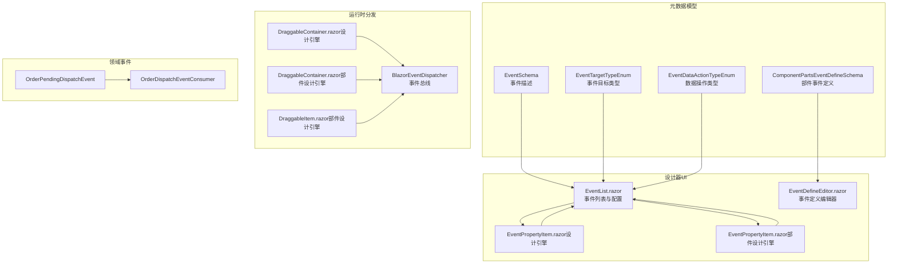
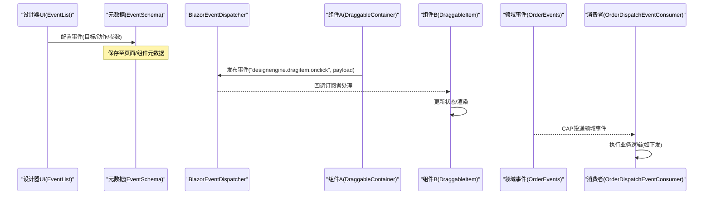
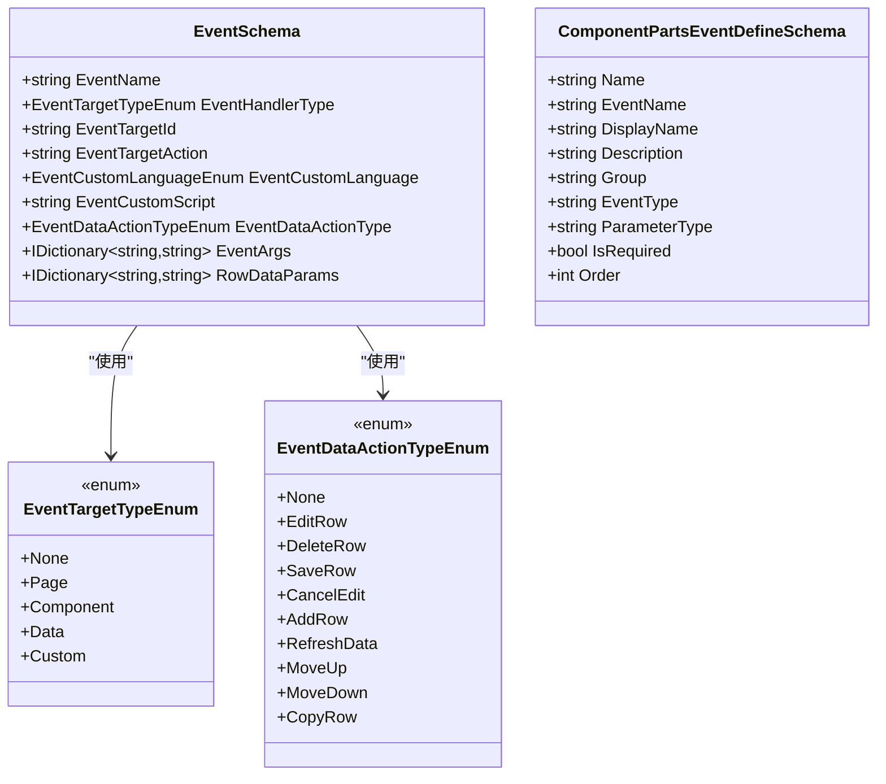
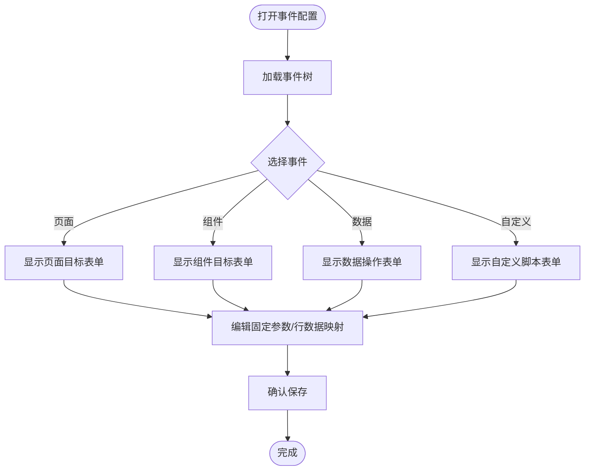
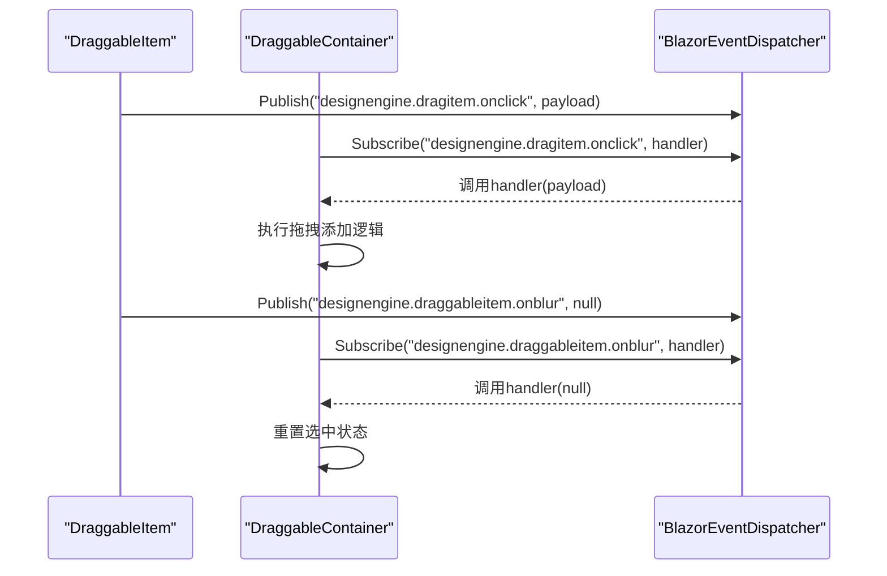
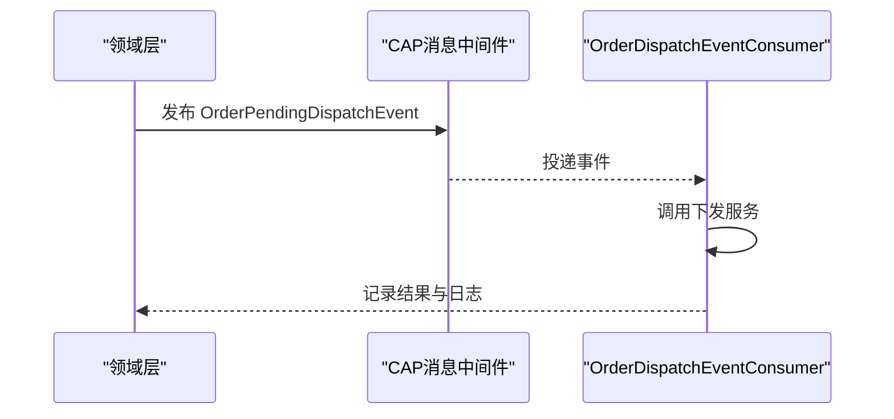
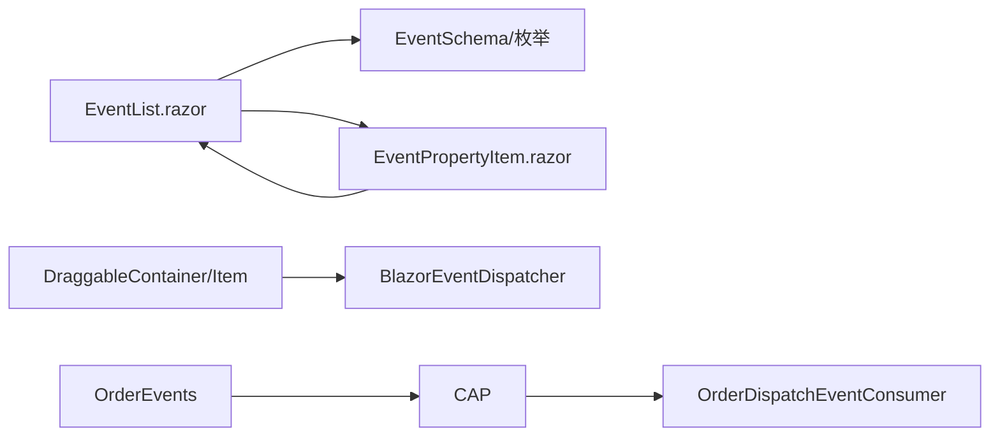

# 事件属性配置

<cite>
**本文引用的文件**
- [BlazorEventDispatcher.cs](file://src/Utils/H.Util.Blazor/BlazorEventDispatcher.cs)
- [EventSchema.cs](file://src/LowCode/Common/H.LowCode.MetaSchema/PropertySchemas/EventSchema.cs)
- [EventTargetTypeEnum.cs](file://src/LowCode/Common/H.LowCode.MetaSchema/Enums/EventTargetTypeEnum.cs)
- [EventDataActionTypeEnum.cs](file://src/LowCode/Common/H.LowCode.MetaSchema/Enums/EventDataActionTypeEnum.cs)
- [EventList.razor](file://src/LowCode/DesignEngine/H.LowCode.DesignEngineBase/Components/Events/EventList.razor)
- [EventPropertyItem.razor（设计引擎）](file://src/LowCode/DesignEngine/H.LowCode.DesignEngine/SettingPanel/PropertySettingItems/EventPropertyItem.razor)
- [EventPropertyItem.razor（部件设计引擎）](file://src/LowCode/DesignEngine/H.LowCode.PartsDesignEngine/SettingPanel/PropertySettingItems/EventPropertyItem.razor)
- [EventDefineEditor.razor](file://src/LowCode/DesignEngine/H.LowCode.PartsDesignEngine/Pages/ComponentParts/Components/EventDefineEditor.razor)
- [ComponentPartsEventDefineSchema.cs](file://src/LowCode/Common/H.LowCode.MetaSchema.DesignEngine/PropertySchemas/ComponentPartsEventDefineSchema.cs)
- [DraggableContainer.razor（设计引擎）](file://src/LowCode/DesignEngine/H.LowCode.DesignEngine/DraggableComponents/DraggableContainer.razor)
- [DraggableContainer.razor（部件设计引擎）](file://src/LowCode/DesignEngine/H.LowCode.PartsDesignEngine/DraggableComponents/DraggableContainer.razor)
- [DraggableItem.razor（部件设计引擎）](file://src/LowCode/DesignEngine/H.LowCode.PartsDesignEngine/DraggableComponents/DraggableItem.razor)
- [OrderEvents.cs](file://src/Services/Order/H.Order.Application.Contracts/Events/OrderEvents.cs)
- [OrderDispatchEventConsumer.cs](file://src/Services/Order/H.Order.Application/Services/OrderDispatchEventConsumer.cs)
</cite>

## 目录
1. [简介](#简介)
2. [项目结构](#项目结构)
3. [核心组件](#核心组件)
4. [架构总览](#架构总览)
5. [详细组件分析](#详细组件分析)
6. [依赖关系分析](#依赖关系分析)
7. [性能考虑](#性能考虑)
8. [故障排查指南](#故障排查指南)
9. [结论](#结论)
10. [附录](#附录)

## 简介
本文件围绕“事件属性配置”展开，系统化阐述低代码平台中的事件系统：事件定义、事件处理器、事件冒泡与跨组件通信机制；说明事件参数的传递与数据处理方式；给出内置事件的配置方法与自定义事件开发流程；并提供调试与性能监控建议以及复杂业务场景下的最佳实践。

## 项目结构
事件系统贯穿“元数据模型—设计器UI—运行时分发—领域事件”四层：
- 元数据模型：统一的事件描述与目标类型枚举，支撑可视化配置与序列化。
- 设计器UI：提供事件列表、事件目标选择、参数映射等编辑能力。
- 运行时分发：基于 Blazor 的轻量级事件总线，实现跨组件通信与冒泡。
- 领域事件：通过消息中间件（CAP）进行服务间异步解耦。

图表来源
- [EventSchema.cs:1-67](file://src/LowCode/Common/H.LowCode.MetaSchema/PropertySchemas/EventSchema.cs#L1-L67)
- [EventTargetTypeEnum.cs:1-29](file://src/LowCode/Common/H.LowCode.MetaSchema/Enums/EventTargetTypeEnum.cs#L1-L29)
- [EventDataActionTypeEnum.cs:1-19](file://src/LowCode/Common/H.LowCode.MetaSchema/Enums/EventDataActionTypeEnum.cs#L1-L19)
- [ComponentPartsEventDefineSchema.cs:1-65](file://src/LowCode/Common/H.LowCode.MetaSchema.DesignEngine/PropertySchemas/ComponentPartsEventDefineSchema.cs#L1-L65)
- [EventList.razor:1-280](file://src/LowCode/DesignEngine/H.LowCode.DesignEngineBase/Components/Events/EventList.razor#L1-L280)
- [EventPropertyItem.razor（设计引擎）:1-40](file://src/LowCode/DesignEngine/H.LowCode.DesignEngine/SettingPanel/PropertySettingItems/EventPropertyItem.razor#L1-L40)
- [EventPropertyItem.razor（部件设计引擎）:1-40](file://src/LowCode/DesignEngine/H.LowCode.PartsDesignEngine/SettingPanel/PropertySettingItems/EventPropertyItem.razor#L1-L40)
- [EventDefineEditor.razor:1-92](file://src/LowCode/DesignEngine/H.LowCode.PartsDesignEngine/Pages/ComponentParts/Components/EventDefineEditor.razor#L1-L92)
- [BlazorEventDispatcher.cs:1-50](file://src/Utils/H.Util.Blazor/BlazorEventDispatcher.cs#L1-L50)
- [DraggableContainer.razor（设计引擎）:44-88](file://src/LowCode/DesignEngine/H.LowCode.DesignEngine/DraggableComponents/DraggableContainer.razor#L44-L88)
- [DraggableContainer.razor（部件设计引擎）:44-87](file://src/LowCode/DesignEngine/H.LowCode.PartsDesignEngine/DraggableComponents/DraggableContainer.razor#L44-L87)
- [DraggableItem.razor（部件设计引擎）:96-142](file://src/LowCode/DesignEngine/H.LowCode.PartsDesignEngine/DraggableComponents/DraggableItem.razor#L96-L142)
- [OrderEvents.cs:1-20](file://src/Services/Order/H.Order.Application.Contracts/Events/OrderEvents.cs#L1-L20)
- [OrderDispatchEventConsumer.cs:1-33](file://src/Services/Order/H.Order.Application/Services/OrderDispatchEventConsumer.cs#L1-L33)

章节来源
- [EventSchema.cs:1-67](file://src/LowCode/Common/H.LowCode.MetaSchema/PropertySchemas/EventSchema.cs#L1-L67)
- [EventList.razor:1-280](file://src/LowCode/DesignEngine/H.LowCode.DesignEngineBase/Components/Events/EventList.razor#L1-L280)
- [BlazorEventDispatcher.cs:1-50](file://src/Utils/H.Util.Blazor/BlazorEventDispatcher.cs#L1-L50)

## 核心组件
- 事件元数据模型
  - EventSchema：承载事件名称、目标类型、目标ID/动作、数据操作类型、自定义脚本语言与内容、事件参数与行数据参数映射。
  - 枚举：EventTargetTypeEnum（页面/组件/数据/自定义）、EventDataActionTypeEnum（增删改查、刷新、移动、复制等）。
  - ComponentPartsEventDefineSchema：用于部件侧的事件定义（名称、显示名、分组、类型、参数类型、是否必需、排序）。
- 设计器UI
  - EventList.razor：事件树形列表、目标选择、参数与行数据映射编辑。
  - EventPropertyItem.razor（设计引擎/部件设计引擎）：在属性面板中打开事件配置弹窗并回填支持的事件。
  - EventDefineEditor.razor：新增/删除事件定义，维护事件类型与参数定义。
- 运行时分发
  - BlazorEventDispatcher：静态事件总线，提供订阅、发布、移除能力，键约定为“库.组件.事件”。
  - DraggableContainer/Item：在设计器中触发或订阅事件，完成拖拽添加、选中/失焦、布局变更等交互。
- 领域事件
  - OrderPendingDispatchEvent：订单转入待下发状态时发布的领域事件。
  - OrderDispatchEventConsumer：CAP消费者，收到事件后调用下发服务。

章节来源
- [EventSchema.cs:1-67](file://src/LowCode/Common/H.LowCode.MetaSchema/PropertySchemas/EventSchema.cs#L1-L67)
- [EventTargetTypeEnum.cs:1-29](file://src/LowCode/Common/H.LowCode.MetaSchema/Enums/EventTargetTypeEnum.cs#L1-L29)
- [EventDataActionTypeEnum.cs:1-19](file://src/LowCode/Common/H.LowCode.MetaSchema/Enums/EventDataActionTypeEnum.cs#L1-L19)
- [ComponentPartsEventDefineSchema.cs:1-65](file://src/LowCode/Common/H.LowCode.MetaSchema.DesignEngine/PropertySchemas/ComponentPartsEventDefineSchema.cs#L1-L65)
- [EventList.razor:1-280](file://src/LowCode/DesignEngine/H.LowCode.DesignEngineBase/Components/Events/EventList.razor#L1-L280)
- [EventPropertyItem.razor（设计引擎）:1-40](file://src/LowCode/DesignEngine/H.LowCode.DesignEngine/SettingPanel/PropertySettingItems/EventPropertyItem.razor#L1-L40)
- [EventPropertyItem.razor（部件设计引擎）:1-40](file://src/LowCode/DesignEngine/H.LowCode.PartsDesignEngine/SettingPanel/PropertySettingItems/EventPropertyItem.razor#L1-L40)
- [EventDefineEditor.razor:1-92](file://src/LowCode/DesignEngine/H.LowCode.PartsDesignEngine/Pages/ComponentParts/Components/EventDefineEditor.razor#L1-L92)
- [BlazorEventDispatcher.cs:1-50](file://src/Utils/H.Util.Blazor/BlazorEventDispatcher.cs#L1-L50)
- [DraggableContainer.razor（设计引擎）:44-88](file://src/LowCode/DesignEngine/H.LowCode.DesignEngine/DraggableComponents/DraggableContainer.razor#L44-L88)
- [DraggableContainer.razor（部件设计引擎）:44-87](file://src/LowCode/DesignEngine/H.LowCode.PartsDesignEngine/DraggableComponents/DraggableContainer.razor#L44-L87)
- [DraggableItem.razor（部件设计引擎）:96-142](file://src/LowCode/DesignEngine/H.LowCode.PartsDesignEngine/DraggableComponents/DraggableItem.razor#L96-L142)
- [OrderEvents.cs:1-20](file://src/Services/Order/H.Order.Application.Contracts/Events/OrderEvents.cs#L1-L20)
- [OrderDispatchEventConsumer.cs:1-33](file://src/Services/Order/H.Order.Application/Services/OrderDispatchEventConsumer.cs#L1-L33)

## 架构总览
事件系统采用“声明式元数据 + 可视化配置 + 运行时总线 + 领域事件”的分层架构：
- 声明式元数据：以 JSON 友好的结构描述事件及其行为，便于持久化与版本管理。
- 可视化配置：设计器提供直观的事件绑定与参数映射界面。
- 运行时总线：BlazorEventDispatcher 作为进程内事件总线，支持跨组件通信与冒泡。
- 领域事件：通过 CAP 将关键业务事件投递到下游服务，实现最终一致性与解耦。

图表来源
- [EventList.razor:1-280](file://src/LowCode/DesignEngine/H.LowCode.DesignEngineBase/Components/Events/EventList.razor#L1-L280)
- [EventSchema.cs:1-67](file://src/LowCode/Common/H.LowCode.MetaSchema/PropertySchemas/EventSchema.cs#L1-L67)
- [BlazorEventDispatcher.cs:1-50](file://src/Utils/H.Util.Blazor/BlazorEventDispatcher.cs#L1-L50)
- [DraggableContainer.razor（设计引擎）:44-88](file://src/LowCode/DesignEngine/H.LowCode.DesignEngine/DraggableComponents/DraggableContainer.razor#L44-L88)
- [DraggableItem.razor（部件设计引擎）:96-142](file://src/LowCode/DesignEngine/H.LowCode.PartsDesignEngine/DraggableComponents/DraggableItem.razor#L96-L142)
- [OrderEvents.cs:1-20](file://src/Services/Order/H.Order.Application.Contracts/Events/OrderEvents.cs#L1-L20)
- [OrderDispatchEventConsumer.cs:1-33](file://src/Services/Order/H.Order.Application/Services/OrderDispatchEventConsumer.cs#L1-L33)

## 详细组件分析

### 事件元数据模型
- EventSchema
  - 字段涵盖事件名称、目标类型、目标ID/动作、数据操作类型、自定义脚本语言与内容、事件参数字典与行数据参数映射。
  - 适用于页面级与组件级的行为编排。
- 枚举
  - EventTargetTypeEnum：区分页面跳转/弹窗/当前页/新标签页、组件方法调用、数据操作、自定义脚本。
  - EventDataActionTypeEnum：覆盖表格行的增删改、取消编辑、刷新、上移下移、复制等常见操作。
- ComponentPartsEventDefineSchema
  - 面向部件侧的事件定义，包含名称、英文标识、显示名、描述、分组、类型、参数类型、是否必需、排序等。

图表来源
- [EventSchema.cs:1-67](file://src/LowCode/Common/H.LowCode.MetaSchema/PropertySchemas/EventSchema.cs#L1-L67)
- [EventTargetTypeEnum.cs:1-29](file://src/LowCode/Common/H.LowCode.MetaSchema/Enums/EventTargetTypeEnum.cs#L1-L29)
- [EventDataActionTypeEnum.cs:1-19](file://src/LowCode/Common/H.LowCode.MetaSchema/Enums/EventDataActionTypeEnum.cs#L1-L19)
- [ComponentPartsEventDefineSchema.cs:1-65](file://src/LowCode/Common/H.LowCode.MetaSchema.DesignEngine/PropertySchemas/ComponentPartsEventDefineSchema.cs#L1-L65)

章节来源
- [EventSchema.cs:1-67](file://src/LowCode/Common/H.LowCode.MetaSchema/PropertySchemas/EventSchema.cs#L1-L67)
- [EventTargetTypeEnum.cs:1-29](file://src/LowCode/Common/H.LowCode.MetaSchema/Enums/EventTargetTypeEnum.cs#L1-L29)
- [EventDataActionTypeEnum.cs:1-19](file://src/LowCode/Common/H.LowCode.MetaSchema/Enums/EventDataActionTypeEnum.cs#L1-L19)
- [ComponentPartsEventDefineSchema.cs:1-65](file://src/LowCode/Common/H.LowCode.MetaSchema.DesignEngine/PropertySchemas/ComponentPartsEventDefineSchema.cs#L1-L65)

### 设计器事件配置UI
- EventList.razor
  - 左侧事件树，右侧根据事件目标类型动态渲染表单：页面跳转/弹窗/当前页/新标签页、组件方法调用、数据操作、自定义脚本。
  - 支持固定参数与行数据参数映射的动态增删改。
- EventPropertyItem.razor（设计引擎/部件设计引擎）
  - 在属性面板中弹出事件配置窗口，自动补齐组件支持的事件，确认后将结果写回组件元数据。
- EventDefineEditor.razor
  - 部件侧事件定义的增删与编辑，包括事件类型、参数定义、描述等。

图表来源
- [EventList.razor:1-280](file://src/LowCode/DesignEngine/H.LowCode.DesignEngineBase/Components/Events/EventList.razor#L1-L280)
- [EventPropertyItem.razor（设计引擎）:1-40](file://src/LowCode/DesignEngine/H.LowCode.DesignEngine/SettingPanel/PropertySettingItems/EventPropertyItem.razor#L1-L40)
- [EventPropertyItem.razor（部件设计引擎）:1-40](file://src/LowCode/DesignEngine/H.LowCode.PartsDesignEngine/SettingPanel/PropertySettingItems/EventPropertyItem.razor#L1-L40)
- [EventDefineEditor.razor:1-92](file://src/LowCode/DesignEngine/H.LowCode.PartsDesignEngine/Pages/ComponentParts/Components/EventDefineEditor.razor#L1-L92)

章节来源
- [EventList.razor:1-280](file://src/LowCode/DesignEngine/H.LowCode.DesignEngineBase/Components/Events/EventList.razor#L1-L280)
- [EventPropertyItem.razor（设计引擎）:1-40](file://src/LowCode/DesignEngine/H.LowCode.DesignEngine/SettingPanel/PropertySettingItems/EventPropertyItem.razor#L1-L40)
- [EventPropertyItem.razor（部件设计引擎）:1-40](file://src/LowCode/DesignEngine/H.LowCode.PartsDesignEngine/SettingPanel/PropertySettingItems/EventPropertyItem.razor#L1-L40)
- [EventDefineEditor.razor:1-92](file://src/LowCode/DesignEngine/H.LowCode.PartsDesignEngine/Pages/ComponentParts/Components/EventDefineEditor.razor#L1-L92)

### 运行时事件总线与冒泡
- BlazorEventDispatcher
  - 提供 Subscribe、Publish、Remove 三个核心方法，内部以静态字典维护事件名到委托的映射。
  - 事件名建议遵循“小写.库.组件.事件”的命名规范，避免冲突。
- DraggableContainer/Item
  - 在设计器中通过总线发布/订阅事件，如“designengine.dragitem.onclick”“designengine.draggableitem.onblur”“designengine.pagesetting.pagelayout.onchange”，实现跨组件联动与状态同步。

图表来源
- [BlazorEventDispatcher.cs:1-50](file://src/Utils/H.Util.Blazor/BlazorEventDispatcher.cs#L1-L50)
- [DraggableContainer.razor（设计引擎）:44-88](file://src/LowCode/DesignEngine/H.LowCode.DesignEngine/DraggableComponents/DraggableContainer.razor#L44-L88)
- [DraggableContainer.razor（部件设计引擎）:44-87](file://src/LowCode/DesignEngine/H.LowCode.PartsDesignEngine/DraggableComponents/DraggableContainer.razor#L44-L87)
- [DraggableItem.razor（部件设计引擎）:96-142](file://src/LowCode/DesignEngine/H.LowCode.PartsDesignEngine/DraggableComponents/DraggableItem.razor#L96-L142)

章节来源
- [BlazorEventDispatcher.cs:1-50](file://src/Utils/H.Util.Blazor/BlazorEventDispatcher.cs#L1-L50)
- [DraggableContainer.razor（设计引擎）:44-88](file://src/LowCode/DesignEngine/H.LowCode.DesignEngine/DraggableComponents/DraggableContainer.razor#L44-L88)
- [DraggableContainer.razor（部件设计引擎）:44-87](file://src/LowCode/DesignEngine/H.LowCode.PartsDesignEngine/DraggableComponents/DraggableContainer.razor#L44-L87)
- [DraggableItem.razor（部件设计引擎）:96-142](file://src/LowCode/DesignEngine/H.LowCode.PartsDesignEngine/DraggableComponents/DraggableItem.razor#L96-L142)

### 领域事件与异步解耦
- OrderPendingDispatchEvent：订单转入待下发状态时发布，携带订单ID、订单号、行业、商品类别等上下文。
- OrderDispatchEventConsumer：CAP消费者，订阅主题并调用下发服务，记录日志与结果。

图表来源
- [OrderEvents.cs:1-20](file://src/Services/Order/H.Order.Application.Contracts/Events/OrderEvents.cs#L1-L20)
- [OrderDispatchEventConsumer.cs:1-33](file://src/Services/Order/H.Order.Application/Services/OrderDispatchEventConsumer.cs#L1-L33)

章节来源
- [OrderEvents.cs:1-20](file://src/Services/Order/H.Order.Application.Contracts/Events/OrderEvents.cs#L1-L20)
- [OrderDispatchEventConsumer.cs:1-33](file://src/Services/Order/H.Order.Application/Services/OrderDispatchEventConsumer.cs#L1-L33)

## 依赖关系分析
- 组件耦合
  - 设计器UI依赖元数据模型（EventSchema、枚举），用于渲染与校验。
  - 运行时组件依赖 BlazorEventDispatcher，实现松耦合通信。
  - 领域事件通过 CAP 与消费者解耦，降低服务间直接依赖。
- 潜在循环依赖
  - 事件总线为静态类，无实例依赖，避免循环引用风险。
- 外部依赖
  - CAP：用于领域事件的消息投递与重试。
  - Blazor WASM：运行环境与调试工具链。

图表来源
- [EventList.razor:1-280](file://src/LowCode/DesignEngine/H.LowCode.DesignEngineBase/Components/Events/EventList.razor#L1-L280)
- [EventSchema.cs:1-67](file://src/LowCode/Common/H.LowCode.MetaSchema/PropertySchemas/EventSchema.cs#L1-L67)
- [BlazorEventDispatcher.cs:1-50](file://src/Utils/H.Util.Blazor/BlazorEventDispatcher.cs#L1-L50)
- [OrderEvents.cs:1-20](file://src/Services/Order/H.Order.Application.Contracts/Events/OrderEvents.cs#L1-L20)
- [OrderDispatchEventConsumer.cs:1-33](file://src/Services/Order/H.Order.Application/Services/OrderDispatchEventConsumer.cs#L1-L33)

章节来源
- [EventList.razor:1-280](file://src/LowCode/DesignEngine/H.LowCode.DesignEngineBase/Components/Events/EventList.razor#L1-L280)
- [BlazorEventDispatcher.cs:1-50](file://src/Utils/H.Util.Blazor/BlazorEventDispatcher.cs#L1-L50)
- [OrderEvents.cs:1-20](file://src/Services/Order/H.Order.Application.Contracts/Events/OrderEvents.cs#L1-L20)
- [OrderDispatchEventConsumer.cs:1-33](file://src/Services/Order/H.Order.Application/Services/OrderDispatchEventConsumer.cs#L1-L33)

## 性能考虑
- 事件总线
  - 使用静态字典存储事件委托，查找复杂度 O(1)，适合高频事件。
  - 注意及时 Remove 订阅，避免内存泄漏与重复回调。
- 参数传递
  - 优先传递轻量对象或值类型，避免大对象频繁序列化/反序列化。
  - 行数据参数映射仅在需要时启用，减少不必要的计算。
- 设计器渲染
  - 事件列表与表单按需渲染，避免一次性构建大量节点。
- 领域事件
  - 借助 CAP 的重试与幂等机制，提升可靠性；合理设置失败重试次数与间隔。

[本节为通用指导，不直接分析具体文件]

## 故障排查指南
- 事件未触发
  - 检查事件名是否与订阅一致（大小写、分隔符）。
  - 确认订阅是否在组件生命周期内注册（OnInitialized/OnAfterRender）。
  - 查看 BlazorEventDispatcher.Publish 是否抛出“事件不存在”异常。
- 参数为空或类型错误
  - 核对 EventArgs 与 RowDataParams 的键值映射是否正确。
  - 确保发布时传入的参数结构与订阅期望一致。
- 设计器配置不生效
  - 确认 EventPropertyItem 已正确回填 SupportEvents。
  - 检查 EventList 保存后的元数据是否持久化成功。
- 领域事件未消费
  - 检查 CAP 主题与消费者注解是否匹配。
  - 查看消费者日志与重试队列状态。

章节来源
- [BlazorEventDispatcher.cs:1-50](file://src/Utils/H.Util.Blazor/BlazorEventDispatcher.cs#L1-L50)
- [EventPropertyItem.razor（设计引擎）:1-40](file://src/LowCode/DesignEngine/H.LowCode.DesignEngine/SettingPanel/PropertySettingItems/EventPropertyItem.razor#L1-L40)
- [EventPropertyItem.razor（部件设计引擎）:1-40](file://src/LowCode/DesignEngine/H.LowCode.PartsDesignEngine/SettingPanel/PropertySettingItems/EventPropertyItem.razor#L1-L40)
- [OrderDispatchEventConsumer.cs:1-33](file://src/Services/Order/H.Order.Application/Services/OrderDispatchEventConsumer.cs#L1-L33)

## 结论
本事件属性配置体系以清晰的元数据模型为基础，配合设计器的可视化配置与运行时事件总线，实现了从前端交互到后端领域的完整事件链路。通过合理的命名规范、参数映射与领域事件解耦，可在复杂业务场景中保持高内聚、低耦合与可观测性。建议在开发中遵循本文的最佳实践，结合调试与性能监控手段，持续提升系统的稳定性与可维护性。

[本节为总结，不直接分析具体文件]

## 附录
- 事件命名规范
  - 建议使用“小写.库.组件.事件”格式，例如“designengine.dragitem.onclick”。
- 事件参数最佳实践
  - 固定参数用于常量或配置项；行数据参数映射用于动态绑定行字段到 URL 参数。
- 自定义事件开发流程
  - 在部件侧通过 EventDefineEditor 定义事件名称、类型与参数。
  - 在组件中通过 BlazorEventDispatcher 发布事件，并在需要的地方订阅处理。
- 调试与监控
  - 使用浏览器控制台与 Blazor 调试工具观察事件发布与订阅。
  - 对领域事件通过 CAP 控制台与日志追踪消费情况。

[本节为补充信息，不直接分析具体文件]