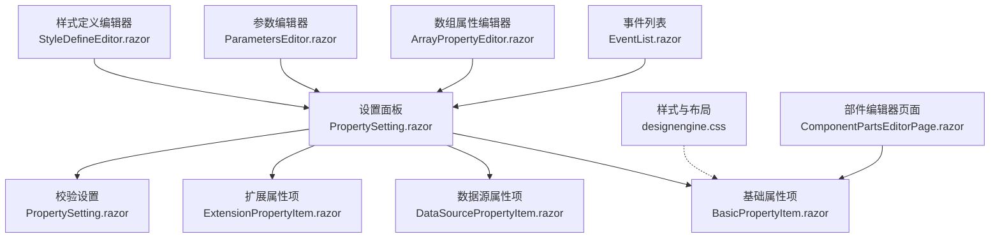
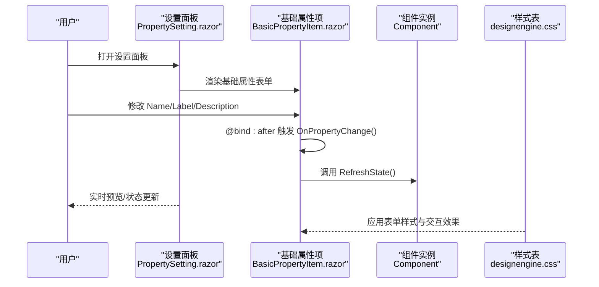
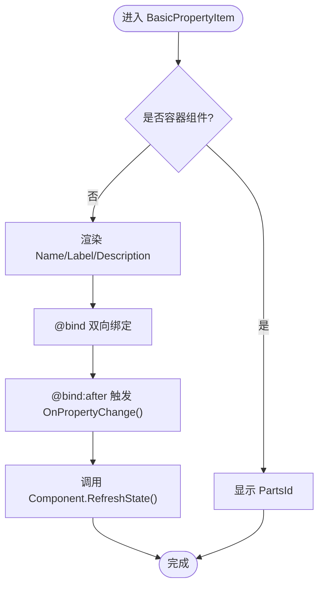
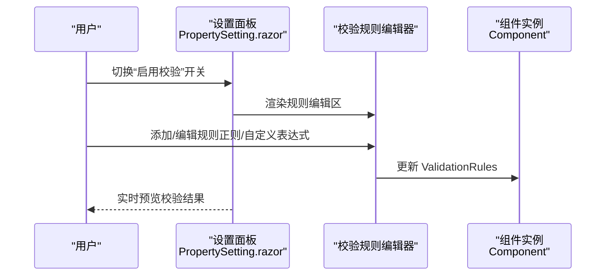
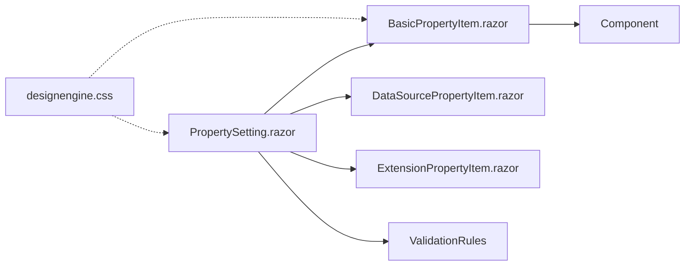

# 基础属性配置

<cite>
**本文引用的文件**   
- [BasicPropertyItem.razor](file://src/LowCode/DesignEngine/H.LowCode.DesignEngine/SettingPanel/PropertySettingItems/BasicPropertyItem.razor)
- [BasicPropertyItem.razor](file://src/LowCode/DesignEngine/H.LowCode.PartsDesignEngine/SettingPanel/PropertySettingItems/BasicPropertyItem.razor)
- [PropertySetting.razor](file://src/LowCode/DesignEngine/H.LowCode.DesignEngine/SettingPanel/PropertySetting.razor)
- [designengine.css](file://src/LowCode/DesignEngine/H.LowCode.DesignEngine/wwwroot/designengine.css)
- [ComponentPartsEditorPage.razor](file://src/LowCode/DesignEngine/H.LowCode.PartsDesignEngine/Pages/ComponentParts/ComponentPartsEditorPage.razor)
- [EventList.razor](file://src/LowCode/DesignEngine/H.LowCode.DesignEngineBase/Components/Events/EventList.razor)
- [StyleDefineEditor.razor](file://src/LowCode/DesignEngine/H.LowCode.PartsDesignEngine/Pages/ComponentParts/Components/StyleDefineEditor.razor)
- [ArrayPropertyEditor.razor](file://src/LowCode/DesignEngine/H.LowCode.PartsDesignEngine/Pages/ComponentParts/Components/ArrayPropertyEditor.razor)
- [ParametersEditor.razor](file://src/LowCode/DesignEngine/H.LowCode.PartsDesignEngine/Pages/ComponentParts/Components/ParametersEditor.razor)
- [ComponentFragmentEditor.razor](file://src/LowCode/DesignEngine/H.LowCode.PartsDesignEngine/Pages/ComponentParts/Components/ComponentFragmentEditor.razor)
</cite>

## 目录
1. [简介](#简介)
2. [项目结构](#项目结构)
3. [核心组件](#核心组件)
4. [架构总览](#架构总览)
5. [详细组件分析](#详细组件分析)
6. [依赖关系分析](#依赖关系分析)
7. [性能考虑](#性能考虑)
8. [故障排查指南](#故障排查指南)
9. [结论](#结论)
10. [附录](#附录)

## 简介
本文件面向低代码平台的基础属性配置系统，聚焦“基础属性编辑器”的实现原理与使用方式。内容涵盖：
- 组件ID、名称、可见性、禁用状态等核心属性的编辑界面与数据绑定机制
- 不同类型基础属性编辑器（文本输入、开关选择、数字输入等）的实现细节
- 属性验证与错误处理机制
- 自定义基础属性类型的扩展方法与实践示例

该文档旨在帮助开发者快速理解并扩展基础属性编辑能力，确保在设计与运行阶段保持一致的数据模型与交互体验。

## 项目结构
基础属性编辑相关代码主要分布在设计引擎的“设置面板”与“部件编辑器”中，采用 Blazor 组件化组织：
- 设置面板入口：PropertySetting.razor 负责聚合基础属性、数据源属性、扩展属性与校验设置等分组
- 基础属性项：BasicPropertyItem.razor 提供 Name、Label、Description 等基础字段的双向绑定与变更回调
- 样式与布局：designengine.css 统一了属性表单的视觉风格与交互反馈
- 部件编辑器页面：ComponentPartsEditorPage.razor 作为原子组件编辑器的宿主页面
- 事件与参数编辑器：EventList.razor、ParametersEditor.razor、ArrayPropertyEditor.razor 等用于更复杂的属性编辑场景
- 样式定义编辑器：StyleDefineEditor.razor 提供控件类型、输入控件、滑块、下拉、开关、数字输入等可视化配置

图表来源
- [PropertySetting.razor:1-38](file://src/LowCode/DesignEngine/H.LowCode.DesignEngine/SettingPanel/PropertySetting.razor#L1-L38)
- [BasicPropertyItem.razor:1-39](file://src/LowCode/DesignEngine/H.LowCode.DesignEngine/SettingPanel/PropertySettingItems/BasicPropertyItem.razor#L1-L39)
- [designengine.css:317-470](file://src/LowCode/DesignEngine/H.LowCode.DesignEngine/wwwroot/designengine.css#L317-L470)
- [ComponentPartsEditorPage.razor:1-27](file://src/LowCode/DesignEngine/H.LowCode.PartsDesignEngine/Pages/ComponentParts/ComponentPartsEditorPage.razor#L1-L27)
- [EventList.razor:22-41](file://src/LowCode/DesignEngine/H.LowCode.DesignEngineBase/Components/Events/EventList.razor#L22-L41)
- [ArrayPropertyEditor.razor:1-30](file://src/LowCode/DesignEngine/H.LowCode.PartsDesignEngine/Pages/ComponentParts/Components/ArrayPropertyEditor.razor#L1-L30)
- [ParametersEditor.razor:1-31](file://src/LowCode/DesignEngine/H.LowCode.PartsDesignEngine/Pages/ComponentParts/Components/ParametersEditor.razor#L1-L31)
- [StyleDefineEditor.razor:42-63](file://src/LowCode/DesignEngine/H.LowCode.PartsDesignEngine/Pages/ComponentParts/Components/StyleDefineEditor.razor#L42-L63)

章节来源
- [PropertySetting.razor:1-38](file://src/LowCode/DesignEngine/H.LowCode.DesignEngine/SettingPanel/PropertySetting.razor#L1-L38)
- [designengine.css:317-470](file://src/LowCode/DesignEngine/H.LowCode.DesignEngine/wwwroot/designengine.css#L317-L470)

## 核心组件
- 基础属性项 BasicPropertyItem.razor
  - 负责渲染组件标识（容器组件显示 PartsId）、Name（字段名/英文）、Label（标题）、Description（描述）等基础属性
  - 通过双向绑定 @bind 将用户输入同步到 Component 对象，并在 @bind:after 触发 OnPropertyChange() 调用 Component.RefreshState() 刷新状态
- 设置面板 PropertySetting.razor
  - 聚合多个属性分组：基础属性、数据源属性、扩展属性、校验设置
  - 校验设置支持启用/禁用校验、规则列表（正则或自定义表达式）、错误消息、触发时机（如输入时）
- 样式与布局 designengine.css
  - 统一属性表单样式：标签、输入框、下拉框、开关、按钮、分组标题等
  - 提供焦点态、占位符、描述文字等交互细节

章节来源
- [BasicPropertyItem.razor:1-39](file://src/LowCode/DesignEngine/H.LowCode.DesignEngine/SettingPanel/PropertySettingItems/BasicPropertyItem.razor#L1-L39)
- [BasicPropertyItem.razor:1-39](file://src/LowCode/DesignEngine/H.LowCode.PartsDesignEngine/SettingPanel/PropertySettingItems/BasicPropertyItem.razor#L1-L39)
- [PropertySetting.razor:1-38](file://src/LowCode/DesignEngine/H.LowCode.DesignEngine/SettingPanel/PropertySetting.razor#L1-L38)
- [designengine.css:317-470](file://src/LowCode/DesignEngine/H.LowCode.DesignEngine/wwwroot/designengine.css#L317-L470)

## 架构总览
基础属性编辑的整体流程如下：
- 用户在设置面板中选择组件后，PropertySetting.razor 加载并渲染各属性分组
- BasicPropertyItem.razor 渲染基础属性表单，用户修改 Name/Label/Description 等字段
- 每次修改通过 @bind:after 触发 OnPropertyChange()，调用 Component.RefreshState() 更新组件状态
- 校验设置由 PropertySetting.razor 管理，支持动态添加/编辑规则、错误消息与触发时机
- 样式与布局由 designengine.css 统一控制，保证一致的视觉与交互体验

图表来源
- [PropertySetting.razor:1-38](file://src/LowCode/DesignEngine/H.LowCode.DesignEngine/SettingPanel/PropertySetting.razor#L1-L38)
- [BasicPropertyItem.razor:1-39](file://src/LowCode/DesignEngine/H.LowCode.DesignEngine/SettingPanel/PropertySettingItems/BasicPropertyItem.razor#L1-L39)
- [designengine.css:317-470](file://src/LowCode/DesignEngine/H.LowCode.DesignEngine/wwwroot/designengine.css#L317-L470)

## 详细组件分析

### 基础属性项 BasicPropertyItem.razor
- 功能要点
  - 容器组件与非容器组件的区别：容器组件仅显示 PartsId；非容器组件显示 Name、Label、Description
  - 双向绑定：@bind="Component.Name/Label/Description" 实现视图与模型同步
  - 变更回调：@bind:after="() => OnPropertyChange()" 触发刷新，调用 Component.RefreshState()
- 数据流
  - 用户输入 -> 组件属性更新 -> 刷新状态 -> 设置面板与其他组件感知变化
- 可扩展点
  - 可在 OnPropertyChange() 中加入自定义逻辑（如去重、格式化、联动更新）

图表来源
- [BasicPropertyItem.razor:1-39](file://src/LowCode/DesignEngine/H.LowCode.DesignEngine/SettingPanel/PropertySettingItems/BasicPropertyItem.razor#L1-L39)

章节来源
- [BasicPropertyItem.razor:1-39](file://src/LowCode/DesignEngine/H.LowCode.DesignEngine/SettingPanel/PropertySettingItems/BasicPropertyItem.razor#L1-L39)
- [BasicPropertyItem.razor:1-39](file://src/LowCode/DesignEngine/H.LowCode.PartsDesignEngine/SettingPanel/PropertySettingItems/BasicPropertyItem.razor#L1-L39)

### 设置面板 PropertySetting.razor
- 功能要点
  - 聚合多个属性分组：基础属性、数据源属性、扩展属性、校验设置
  - 校验设置支持启用/禁用、规则列表、错误消息、触发时机（如输入时）
- 数据流
  - 用户切换校验开关 -> 动态显示/隐藏规则编辑区 -> 保存规则到 Component.ValidationRules
- 可扩展点
  - 新增属性分组（如样式、行为）可通过插入新的 PropertyItem 组件实现

图表来源
- [PropertySetting.razor:1-38](file://src/LowCode/DesignEngine/H.LowCode.DesignEngine/SettingPanel/PropertySetting.razor#L1-L38)

章节来源
- [PropertySetting.razor:1-38](file://src/LowCode/DesignEngine/H.LowCode.DesignEngine/SettingPanel/PropertySetting.razor#L1-L38)

### 样式与布局 designengine.css
- 功能要点
  - 统一属性表单样式：标签、输入框、下拉框、开关、按钮、分组标题
  - 提供焦点态、占位符、描述文字等交互细节
- 使用建议
  - 自定义属性编辑器应遵循现有类名规范（如 propertysetting-item、inp、sel、switch）
  - 保持统一的间距、字体、颜色，确保一致性

章节来源
- [designengine.css:317-470](file://src/LowCode/DesignEngine/H.LowCode.DesignEngine/wwwroot/designengine.css#L317-L470)

### 其他属性编辑器
- 事件列表 EventList.razor
  - 支持选择事件目标（组件/数据/自定义），并提供页面与操作选择
- 数组属性编辑器 ArrayPropertyEditor.razor
  - 支持添加、上移、下移、删除数组项，并可传入 ItemTemplate 自定义渲染
- 参数编辑器 ParametersEditor.razor
  - 支持键值对参数的增删改，适用于简单配置项
- 组件片段编辑器 ComponentFragmentEditor.razor
  - 支持文本内容与属性配置的动态添加与删除
- 样式定义编辑器 StyleDefineEditor.razor
  - 提供控件类型（输入框、颜色选择器、滑块、下拉、开关、数字输入）的配置界面

章节来源
- [EventList.razor:22-41](file://src/LowCode/DesignEngine/H.LowCode.DesignEngineBase/Components/Events/EventList.razor#L22-L41)
- [ArrayPropertyEditor.razor:1-30](file://src/LowCode/DesignEngine/H.LowCode.PartsDesignEngine/Pages/ComponentParts/Components/ArrayPropertyEditor.razor#L1-L30)
- [ParametersEditor.razor:1-31](file://src/LowCode/DesignEngine/H.LowCode.PartsDesignEngine/Pages/ComponentParts/Components/ParametersEditor.razor#L1-L31)
- [ComponentFragmentEditor.razor:24-52](file://src/LowCode/DesignEngine/H.LowCode.PartsDesignEngine/Pages/ComponentParts/Components/ComponentFragmentEditor.razor#L24-L52)
- [StyleDefineEditor.razor:42-63](file://src/LowCode/DesignEngine/H.LowCode.PartsDesignEngine/Pages/ComponentParts/Components/StyleDefineEditor.razor#L42-L63)

## 依赖关系分析
- 组件耦合
  - BasicPropertyItem.razor 依赖 Component 对象的属性与 RefreshState() 方法
  - PropertySetting.razor 依赖多个 PropertyItem 组件与 Component 的 ValidationRules
- 外部依赖
  - designengine.css 为所有属性编辑器提供统一样式
  - Blazor 框架提供双向绑定与事件回调机制
- 潜在循环依赖
  - 当前结构清晰，未见循环依赖；建议在扩展时保持单向依赖（视图 -> 模型）

图表来源
- [BasicPropertyItem.razor:1-39](file://src/LowCode/DesignEngine/H.LowCode.DesignEngine/SettingPanel/PropertySettingItems/BasicPropertyItem.razor#L1-L39)
- [PropertySetting.razor:1-38](file://src/LowCode/DesignEngine/H.LowCode.DesignEngine/SettingPanel/PropertySetting.razor#L1-L38)
- [designengine.css:317-470](file://src/LowCode/DesignEngine/H.LowCode.DesignEngine/wwwroot/designengine.css#L317-L470)

章节来源
- [BasicPropertyItem.razor:1-39](file://src/LowCode/DesignEngine/H.LowCode.DesignEngine/SettingPanel/PropertySettingItems/BasicPropertyItem.razor#L1-L39)
- [PropertySetting.razor:1-38](file://src/LowCode/DesignEngine/H.LowCode.DesignEngine/SettingPanel/PropertySetting.razor#L1-L38)

## 性能考虑
- 双向绑定开销
  - 频繁修改 Name/Label/Description 会触发多次 RefreshState()，建议在 OnPropertyChange() 中加入防抖或批量更新逻辑
- 渲染优化
  - 对于复杂属性编辑器（如数组、事件、样式定义），建议使用虚拟化或分页加载减少初始渲染压力
- 样式与主题
  - 避免在运行时动态注入大量 CSS，优先使用预编译样式与主题变量

[本节为通用指导，不直接分析具体文件]

## 故障排查指南
- 常见问题
  - 属性未同步：检查 @bind 是否正确绑定到 Component 的属性，确认 OnPropertyChange() 是否被调用
  - 校验无效：确认 ValidationRules 已正确赋值，触发时机（如输入时）是否符合预期
  - 样式异常：检查是否使用了正确的类名（propertysetting-item、inp、sel、switch）
- 调试建议
  - 在 OnPropertyChange() 中添加日志输出，观察属性变更与刷新流程
  - 使用浏览器开发者工具检查 DOM 结构与样式应用情况

章节来源
- [PropertySetting.razor:1-38](file://src/LowCode/DesignEngine/H.LowCode.DesignEngine/SettingPanel/PropertySetting.razor#L1-L38)
- [designengine.css:317-470](file://src/LowCode/DesignEngine/H.LowCode.DesignEngine/wwwroot/designengine.css#L317-L470)

## 结论
基础属性配置系统通过 Blazor 组件化与双向绑定实现了高效、可维护的属性编辑能力。BasicPropertyItem.razor 与 PropertySetting.razor 构成了核心编辑界面，designengine.css 提供了统一的视觉与交互体验。通过扩展不同的属性编辑器（数组、事件、样式定义等），可以满足多样化的配置需求。建议在开发过程中遵循现有命名规范与数据流模式，确保系统的可扩展性与一致性。

[本节为总结性内容，不直接分析具体文件]

## 附录
- 自定义基础属性类型的扩展方法
  - 创建新的 PropertyItem 组件，继承 LowCodeComponentBase
  - 使用 @bind 双向绑定到 Component 的新属性
  - 在 @bind:after 中实现自定义逻辑（如格式转换、联动更新）
  - 在 PropertySetting.razor 中引入并渲染新组件
- 使用示例
  - 参考 ArrayPropertyEditor.razor 实现数组型属性编辑器
  - 参考 StyleDefineEditor.razor 实现可视化样式配置编辑器
  - 参考 ParametersEditor.razor 实现键值对配置编辑器

[本节为概念性内容，不直接分析具体文件]