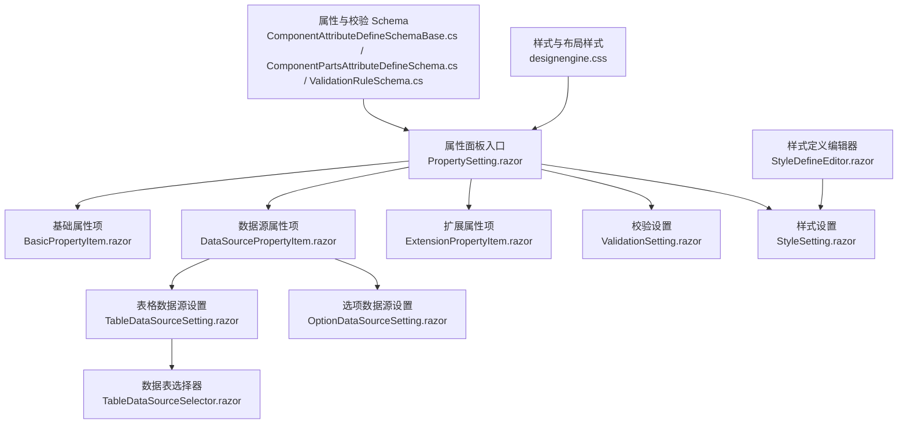
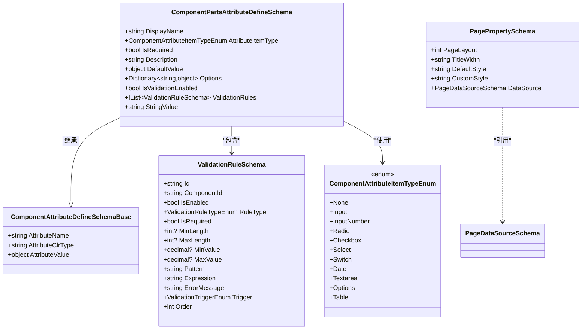
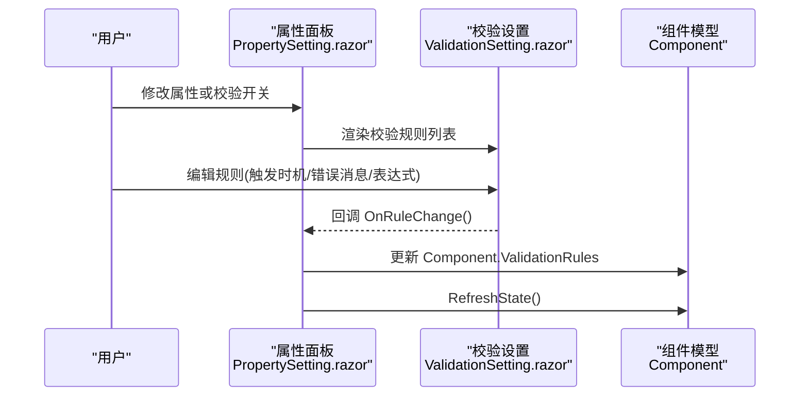
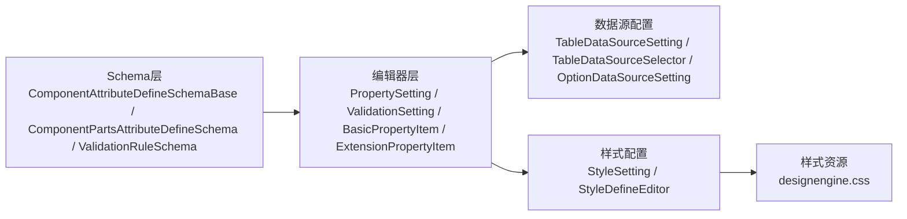
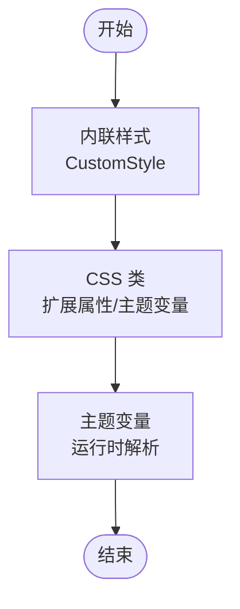

# 属性配置面板

<cite>
**本文引用的文件**   
- [PropertySetting.razor](file://src/LowCode/DesignEngine/H.LowCode.DesignEngine/SettingPanel/PropertySetting.razor)
- [ValidationSetting.razor](file://src/LowCode/DesignEngine/H.LowCode.DesignEngine/SettingPanel\ValidationSetting.razor)
- [BasicPropertyItem.razor](file://src/LowCode/DesignEngine/H.LowCode.DesignEngine/SettingPanel/PropertySettingItems/BasicPropertyItem.razor)
- [ExtensionPropertyItem.razor](file://src/LowCode/DesignEngine/H.LowCode.DesignEngine/SettingPanel/PropertySettingItems/ExtensionPropertyItem.razor)
- [DataSourcePropertyItem.razor](file://src/LowCode/DesignEngine/H.LowCode.DesignEngine/SettingPanel/PropertySettingItems/DataSourcePropertyItem.razor)
- [TableDataSourceSetting.razor](file://src/LowCode/DesignEngine/H.LowCode.DesignEngine/SettingPanel/PropertySettingItems/TableDataSource/TableDataSourceSetting.razor)
- [TableDataSourceSelector.razor](file://src/LowCode/DesignEngine/H.LowCode.DesignEngine/SettingPanel/PropertySettingItems/TableDataSource/TableDataSourceSelector.razor)
- [OptionDataSourceSetting.razor](file://src/LowCode/DesignEngine/H.LowCode.DesignEngine/SettingPanel/PropertySettingItems/OptionDataSource/OptionDataSourceSetting.razor)
- [StyleSetting.razor](file://src/LowCode/DesignEngine/H.LowCode.DesignEngine/SettingPanel/StyleSetting.razor)
- [designengine.css](file://src/LowCode/DesignEngine/H.LowCode.DesignEngine/wwwroot/designengine.css)
- [ComponentAttributeDefineSchemaBase.cs](file://src/LowCode/Common/H.LowCode.MetaSchema/PropertySchemas/ComponentAttributeDefineSchemaBase.cs)
- [ComponentPartsAttributeDefineSchema.cs](file://src/LowCode/Common/H.LowCode.MetaSchema.DesignEngine/PropertySchemas/ComponentPartsAttributeDefineSchema.cs)
- [ComponentAttributeItemTypeEnum.cs](file://src/LowCode/Common/H.LowCode.MetaSchema.DesignEngine/Enums/ComponentAttributeItemTypeEnum.cs)
- [ValidationRuleSchema.cs](file://src/LowCode/Common/H.LowCode.MetaSchema/PropertySchemas/ValidationRuleSchema.cs)
- [PagePropertySchema.cs](file://src/LowCode/Common/H.LowCode.MetaSchema/PropertySchemas/PagePropertySchema.cs)
- [StyleDefineEditor.razor](file://src/LowCode/DesignEngine/H.LowCode.PartsDesignEngine/Pages/ComponentParts/Components/StyleDefineEditor.razor)
- [ComponentPartsAttributeDefineSchema.cs](file://src/LowCode/Common/H.LowCode.MetaSchema.DesignEngine/PropertySchemas/ComponentPartsAttributeDefineSchema.cs)
</cite>

## 目录
1. [简介](#简介)
2. [项目结构](#项目结构)
3. [核心组件](#核心组件)
4. [架构总览](#架构总览)
5. [详细组件分析](#详细组件分析)
6. [依赖关系分析](#依赖关系分析)
7. [性能考虑](#性能考虑)
8. [故障排查指南](#故障排查指南)
9. [结论](#结论)
10. [附录](#附录)

## 简介
本文件面向低代码平台的“属性配置面板”，系统性阐述属性系统的架构设计、属性定义 Schema、属性编辑器与数据绑定机制，覆盖文本输入、数值选择、下拉框、颜色选择器等常见编辑器类型；详细说明样式配置的层次结构（内联样式、CSS 类、主题变量）；并给出验证规则的配置与使用方式（必填、格式、自定义表达式）。同时提供属性编辑器的扩展方法与自定义属性类型的开发指南，帮助开发者快速扩展平台能力。

## 项目结构
属性配置面板位于低代码设计引擎的“设置面板”模块中，围绕组件属性分组渲染、校验规则管理、样式配置以及数据源配置等关键能力组织代码。核心文件包括：
- 属性面板入口与分组渲染：PropertySetting.razor
- 校验设置：ValidationSetting.razor
- 基础属性项：BasicPropertyItem.razor
- 扩展属性项：ExtensionPropertyItem.razor
- 数据源相关：DataSourcePropertyItem.razor、TableDataSourceSetting.razor、TableDataSourceSelector.razor、OptionDataSourceSetting.razor
- 样式设置：StyleSetting.razor
- 样式定义编辑器（部件级）：StyleDefineEditor.razor
- 样式与布局 CSS：designengine.css
- 属性与校验 Schema：ComponentAttributeDefineSchemaBase.cs、ComponentPartsAttributeDefineSchema.cs、ComponentAttributeItemTypeEnum.cs、ValidationRuleSchema.cs、PagePropertySchema.cs

图表来源
- [PropertySetting.razor:1-113](file://src/LowCode/DesignEngine/H.LowCode.DesignEngine/SettingPanel/PropertySetting.razor#L1-L113)
- [ValidationSetting.razor:1-104](file://src/LowCode/DesignEngine/H.LowCode.DesignEngine/SettingPanel/ValidationSetting.razor#L1-L104)
- [BasicPropertyItem.razor:1-39](file://src/LowCode/DesignEngine/H.LowCode.DesignEngine/SettingPanel/PropertySettingItems/BasicPropertyItem.razor#L1-L39)
- [ExtensionPropertyItem.razor:70-87](file://src/LowCode/DesignEngine/H.LowCode.DesignEngine/SettingPanel/PropertySettingItems/ExtensionPropertyItem.razor#L70-L87)
- [TableDataSourceSetting.razor:1-23](file://src/LowCode/DesignEngine/H.LowCode.DesignEngine/SettingPanel/PropertySettingItems/TableDataSource/TableDataSourceSetting.razor#L1-L23)
- [TableDataSourceSelector.razor:1-40](file://src/LowCode/DesignEngine/H.LowCode.DesignEngine/SettingPanel/PropertySettingItems/TableDataSource/TableDataSourceSelector.razor#L1-L40)
- [OptionDataSourceSetting.razor:1-46](file://src/LowCode/DesignEngine/H.LowCode.DesignEngine/SettingPanel/PropertySettingItems/OptionDataSource/OptionDataSourceSetting.razor#L1-L46)
- [StyleSetting.razor:1-32](file://src/LowCode/DesignEngine/H.LowCode.DesignEngine/SettingPanel/StyleSetting.razor#L1-L32)
- [StyleDefineEditor.razor:1-192](file://src/LowCode/DesignEngine/H.LowCode.PartsDesignEngine/Pages/ComponentParts/Components/StyleDefineEditor.razor#L1-L192)
- [ComponentAttributeDefineSchemaBase.cs:1-25](file://src/LowCode/Common/H.LowCode.MetaSchema/PropertySchemas/ComponentAttributeDefineSchemaBase.cs#L1-L25)
- [ComponentPartsAttributeDefineSchema.cs:1-49](file://src/LowCode/Common/H.LowCode.MetaSchema.DesignEngine/PropertySchemas/ComponentPartsAttributeDefineSchema.cs#L1-L49)
- [ValidationRuleSchema.cs:1-178](file://src/LowCode/Common/H.LowCode.MetaSchema/PropertySchemas/ValidationRuleSchema.cs#L1-L178)
- [designengine.css:317-418](file://src/LowCode/DesignEngine/H.LowCode.DesignEngine/wwwroot/designengine.css#L317-L418)

章节来源
- [PropertySetting.razor:1-113](file://src/LowCode/DesignEngine/H.LowCode.DesignEngine/SettingPanel/PropertySetting.razor#L1-L113)
- [designengine.css:317-418](file://src/LowCode/DesignEngine/H.LowCode.DesignEngine/wwwroot/designengine.css#L317-L418)

## 核心组件
- 属性面板入口 PropertySetting.razor：聚合基础属性、数据源属性、扩展属性与校验设置，统一渲染与交互。
- 校验设置 ValidationSetting.razor：提供启用开关、规则列表、触发时机、错误消息等配置。
- 基础属性 BasicPropertyItem.razor：编辑组件标识、名称、标题、描述等基础信息。
- 扩展属性 ExtensionPropertyItem.razor：根据 AttributeDefineGroups 动态渲染扩展属性，支持按属性名映射值。
- 数据源相关：
  - DataSourcePropertyItem.razor：通用数据源属性入口。
  - TableDataSourceSetting.razor：表格数据源类型切换（数据表/SQL/API）。
  - TableDataSourceSelector.razor：数据表选择与信息展示。
  - OptionDataSourceSetting.razor：选项数据源类型切换（固定值/API/SQL）。
- 样式设置 StyleSetting.razor：组件宽度、标签宽度、自定义样式（内联 CSS）编辑。
- 样式定义编辑器 StyleDefineEditor.razor：部件级样式字段定义（名称、显示名、类型、控件类型、默认值、单位、选项、是否必需、排序、分组、CSS 属性）。

章节来源
- [PropertySetting.razor:1-113](file://src/LowCode/DesignEngine/H.LowCode.DesignEngine/SettingPanel/PropertySetting.razor#L1-L113)
- [ValidationSetting.razor:1-104](file://src/LowCode/DesignEngine/H.LowCode.DesignEngine/SettingPanel/ValidationSetting.razor#L1-L104)
- [BasicPropertyItem.razor:1-39](file://src/LowCode/DesignEngine/H.LowCode.DesignEngine/SettingPanel/PropertySettingItems/BasicPropertyItem.razor#L1-L39)
- [ExtensionPropertyItem.razor:70-87](file://src/LowCode/DesignEngine/H.LowCode.DesignEngine/SettingPanel/PropertySettingItems/ExtensionPropertyItem.razor#L70-L87)
- [TableDataSourceSetting.razor:1-23](file://src/LowCode/DesignEngine/H.LowCode.DesignEngine/SettingPanel/PropertySettingItems/TableDataSource/TableDataSourceSetting.razor#L1-L23)
- [TableDataSourceSelector.razor:1-40](file://src/LowCode/DesignEngine/H.LowCode.DesignEngine/SettingPanel/PropertySettingItems/TableDataSource/TableDataSourceSelector.razor#L1-L40)
- [OptionDataSourceSetting.razor:1-46](file://src/LowCode/DesignEngine/H.LowCode.DesignEngine/SettingPanel/PropertySettingItems/OptionDataSource/OptionDataSourceSetting.razor#L1-L46)
- [StyleSetting.razor:1-32](file://src/LowCode/DesignEngine/H.LowCode.DesignEngine/SettingPanel/StyleSetting.razor#L1-L32)
- [StyleDefineEditor.razor:1-192](file://src/LowCode/DesignEngine/H.LowCode.PartsDesignEngine/Pages/ComponentParts/Components/StyleDefineEditor.razor#L1-L192)

## 架构总览
属性系统采用“Schema + 编辑器”的解耦模式：
- Schema 层：通过 ComponentAttributeDefineSchemaBase 与 ComponentPartsAttributeDefineSchema 定义属性元数据（名称、类型、默认值、选项、校验开关与规则等），并通过枚举 ComponentAttributeItemTypeEnum 指定编辑器类型。
- 编辑器层：各 Razor 组件根据 Schema 渲染对应 UI 控件，并通过双向绑定更新属性值。
- 校验层：ValidationRuleSchema 集中描述校验规则（必填、长度、范围、正则、邮箱、手机号、URL、身份证、自定义表达式），并在属性面板中可视化配置。
- 样式层：页面与组件样式通过 PagePropertySchema（DefaultStyle/CustomStyle）与 StyleSetting/StyleDefineEditor 进行分层管理（内联样式、CSS 类、主题变量）。

图表来源
- [ComponentAttributeDefineSchemaBase.cs:1-25](file://src/LowCode/Common/H.LowCode.MetaSchema/PropertySchemas/ComponentAttributeDefineSchemaBase.cs#L1-L25)
- [ComponentPartsAttributeDefineSchema.cs:1-49](file://src/LowCode/Common/H.LowCode.MetaSchema.DesignEngine/PropertySchemas/ComponentPartsAttributeDefineSchema.cs#L1-L49)
- [ComponentAttributeItemTypeEnum.cs:1-23](file://src/LowCode/Common/H.LowCode.MetaSchema.DesignEngine/Enums/ComponentAttributeItemTypeEnum.cs#L1-L23)
- [ValidationRuleSchema.cs:1-178](file://src/LowCode/Common/H.LowCode.MetaSchema/PropertySchemas/ValidationRuleSchema.cs#L1-L178)
- [PagePropertySchema.cs:1-37](file://src/LowCode/Common/H.LowCode.MetaSchema/PropertySchemas/PagePropertySchema.cs#L1-L37)

章节来源
- [ComponentAttributeDefineSchemaBase.cs:1-25](file://src/LowCode/Common/H.LowCode.MetaSchema/PropertySchemas/ComponentAttributeDefineSchemaBase.cs#L1-L25)
- [ComponentPartsAttributeDefineSchema.cs:1-49](file://src/LowCode/Common/H.LowCode.MetaSchema.DesignEngine/PropertySchemas/ComponentPartsAttributeDefineSchema.cs#L1-L49)
- [ComponentAttributeItemTypeEnum.cs:1-23](file://src/LowCode/Common/H.LowCode.MetaSchema.DesignEngine/Enums/ComponentAttributeItemTypeEnum.cs#L1-L23)
- [ValidationRuleSchema.cs:1-178](file://src/LowCode/Common/H.LowCode.MetaSchema/PropertySchemas/ValidationRuleSchema.cs#L1-L178)
- [PagePropertySchema.cs:1-37](file://src/LowCode/Common/H.LowCode.MetaSchema/PropertySchemas/PagePropertySchema.cs#L1-L37)

## 详细组件分析

### 属性面板入口与分组渲染（PropertySetting.razor）
- 功能要点：
  - 聚合基础属性、数据源属性、扩展属性与校验设置四个分组。
  - 校验设置提供启用开关与规则列表，支持为每条规则配置触发时机、错误消息与正则/自定义表达式。
- 数据流：
  - 用户修改属性后，通过 @bind:after 回调触发刷新状态（如 OnPropertyChange/OnRuleChange）。
  - 校验规则变更时同步到 Component.ValidationRules。

图表来源
- [PropertySetting.razor:1-113](file://src/LowCode/DesignEngine/H.LowCode.DesignEngine/SettingPanel/PropertySetting.razor#L1-L113)
- [ValidationSetting.razor:1-104](file://src/LowCode/DesignEngine/H.LowCode.DesignEngine/SettingPanel/ValidationSetting.razor#L1-L104)

章节来源
- [PropertySetting.razor:1-113](file://src/LowCode/DesignEngine/H.LowCode.DesignEngine/SettingPanel/PropertySetting.razor#L1-L113)
- [ValidationSetting.razor:1-104](file://src/LowCode/DesignEngine/H.LowCode.DesignEngine/SettingPanel/ValidationSetting.razor#L1-L104)

### 基础属性项（BasicPropertyItem.razor）
- 功能要点：
  - 非容器组件可编辑 Name、Label、Description；容器组件显示 PartsId。
  - 所有修改通过 OnPropertyChange 触发组件状态刷新。
- 数据绑定：
  - 使用 @bind 与 @bind:after 实现双向绑定与变更回调。

章节来源
- [BasicPropertyItem.razor:1-39](file://src/LowCode/DesignEngine/H.LowCode.DesignEngine/SettingPanel/PropertySettingItems/BasicPropertyItem.razor#L1-L39)

### 扩展属性项（ExtensionPropertyItem.razor）
- 功能要点：
  - 遍历 Component.AttributeDefineGroups，按属性名匹配并写入 StringValue。
  - 支持复杂属性的键值映射与动态更新。
- 数据流：
  - 通过属性名定位对应的 ComponentPartsAttributeDefineSchema，并更新其 StringValue。

章节来源
- [ExtensionPropertyItem.razor:70-87](file://src/LowCode/DesignEngine/H.LowCode.DesignEngine/SettingPanel/PropertySettingItems/ExtensionPropertyItem.razor#L70-L87)
- [ComponentPartsAttributeDefineSchema.cs:1-49](file://src/LowCode/Common/H.LowCode.MetaSchema.DesignEngine/PropertySchemas/ComponentPartsAttributeDefineSchema.cs#L1-L49)

### 数据源属性（DataSourcePropertyItem.razor 及子组件）
- 功能要点：
  - 提供数据源类型切换（数据表/SQL/API）与具体配置编辑。
  - TableDataSourceSetting.razor 负责表格数据源类型选择与子组件挂载。
  - TableDataSourceSelector.razor 提供数据表选择与信息展示。
  - OptionDataSourceSetting.razor 提供选项数据源类型选择（固定值/API/SQL）。
- 数据流：
  - 用户选择数据源类型后，绑定到 ComponentPartsDataSourceSchema，并触发 DataSourceChanged 回调。

章节来源
- [TableDataSourceSetting.razor:1-23](file://src/LowCode/DesignEngine/H.LowCode.DesignEngine/SettingPanel/PropertySettingItems/TableDataSource/TableDataSourceSetting.razor#L1-L23)
- [TableDataSourceSelector.razor:1-40](file://src/LowCode/DesignEngine/H.LowCode.DesignEngine/SettingPanel/PropertySettingItems/TableDataSource/TableDataSourceSelector.razor#L1-L40)
- [OptionDataSourceSetting.razor:1-46](file://src/LowCode/DesignEngine/H.LowCode.DesignEngine/SettingPanel/PropertySettingItems/OptionDataSource/OptionDataSourceSetting.razor#L1-L46)

### 样式设置（StyleSetting.razor）
- 功能要点：
  - 组件宽度与标签宽度滑块控制。
  - 自定义样式文本域用于内联 CSS 编辑。
  - 修改后调用 Component.RefreshState() 实时预览。
- 样式层次：
  - 内联样式：通过 CustomStyle 直接注入。
  - CSS 类：可通过扩展属性或主题变量管理（见下文“样式配置层次结构”）。
  - 主题变量：由运行时主题解析（不在本文件中体现，但可在扩展属性中配置变量名）。

章节来源
- [StyleSetting.razor:1-32](file://src/LowCode/DesignEngine/H.LowCode.DesignEngine/SettingPanel/StyleSetting.razor#L1-L32)

### 样式定义编辑器（StyleDefineEditor.razor）
- 功能要点：
  - 维护一组 ComponentPartsStyleDefineSchema，支持添加/删除样式定义。
  - 每个样式定义包含名称、显示名、类型（颜色/尺寸/间距/边框/字体/布局/自定义）、控件类型（输入框/颜色选择器/滑块/下拉选择/开关/数字输入）、默认值、单位、选项（JSON）、是否必需、排序、分组、CSS 属性。
- 适用场景：
  - 部件级样式字段定义，供设计器生成统一的样式编辑界面。

章节来源
- [StyleDefineEditor.razor:1-192](file://src/LowCode/DesignEngine/H.LowCode.PartsDesignEngine/Pages/ComponentParts/Components/StyleDefineEditor.razor#L1-L192)

### 校验规则（ValidationRuleSchema）
- 功能要点：
  - 支持多种规则类型：必填、最小/最大长度、最小/最大值、正则、邮箱、手机号、URL、身份证、自定义表达式。
  - 触发时机：失去焦点、值改变、提交时。
  - 错误消息可自定义，便于多语言与友好提示。
- 使用方式：
  - 在属性面板中配置规则列表，并在运行时按触发时机执行校验。

章节来源
- [ValidationRuleSchema.cs:1-178](file://src/LowCode/Common/H.LowCode.MetaSchema/PropertySchemas/ValidationRuleSchema.cs#L1-L178)
- [ValidationSetting.razor:1-104](file://src/LowCode/DesignEngine/H.LowCode.DesignEngine/SettingPanel/ValidationSetting.razor#L1-L104)

## 依赖关系分析
- 属性 Schema 与编辑器耦合度低：编辑器仅依赖 ComponentAttributeItemTypeEnum 决定渲染控件类型，不关心业务逻辑。
- 校验规则独立于属性定义：ValidationRuleSchema 与 ComponentPartsAttributeDefineSchema 通过 ValidationRules 关联，便于复用与扩展。
- 数据源配置模块化：TableDataSourceSetting、TableDataSourceSelector、OptionDataSourceSetting 各自职责清晰，易于替换或新增数据源类型。
- 样式配置分层：StyleSetting 处理内联样式，StyleDefineEditor 处理部件级样式字段定义，二者互补。

图表来源
- [ComponentAttributeDefineSchemaBase.cs:1-25](file://src/LowCode/Common/H.LowCode.MetaSchema/PropertySchemas/ComponentAttributeDefineSchemaBase.cs#L1-L25)
- [ComponentPartsAttributeDefineSchema.cs:1-49](file://src/LowCode/Common/H.LowCode.MetaSchema.DesignEngine/PropertySchemas/ComponentPartsAttributeDefineSchema.cs#L1-L49)
- [ValidationRuleSchema.cs:1-178](file://src/LowCode/Common/H.LowCode.MetaSchema/PropertySchemas/ValidationRuleSchema.cs#L1-L178)
- [PropertySetting.razor:1-113](file://src/LowCode/DesignEngine/H.LowCode.DesignEngine/SettingPanel/PropertySetting.razor#L1-L113)
- [ValidationSetting.razor:1-104](file://src/LowCode/DesignEngine/H.LowCode.DesignEngine/SettingPanel/ValidationSetting.razor#L1-L104)
- [BasicPropertyItem.razor:1-39](file://src/LowCode/DesignEngine/H.LowCode.DesignEngine/SettingPanel/PropertySettingItems/BasicPropertyItem.razor#L1-L39)
- [ExtensionPropertyItem.razor:70-87](file://src/LowCode/DesignEngine/H.LowCode.DesignEngine/SettingPanel/PropertySettingItems/ExtensionPropertyItem.razor#L70-L87)
- [TableDataSourceSetting.razor:1-23](file://src/LowCode/DesignEngine/H.LowCode.DesignEngine/SettingPanel/PropertySettingItems/TableDataSource/TableDataSourceSetting.razor#L1-L23)
- [TableDataSourceSelector.razor:1-40](file://src/LowCode/DesignEngine/H.LowCode.DesignEngine/SettingPanel/PropertySettingItems/TableDataSource/TableDataSourceSelector.razor#L1-L40)
- [OptionDataSourceSetting.razor:1-46](file://src/LowCode/DesignEngine/H.LowCode.DesignEngine/SettingPanel/PropertySettingItems/OptionDataSource/OptionDataSourceSetting.razor#L1-L46)
- [StyleSetting.razor:1-32](file://src/LowCode/DesignEngine/H.LowCode.DesignEngine/SettingPanel/StyleSetting.razor#L1-L32)
- [StyleDefineEditor.razor:1-192](file://src/LowCode/DesignEngine/H.LowCode.PartsDesignEngine/Pages/ComponentParts/Components/StyleDefineEditor.razor#L1-L192)
- [designengine.css:317-418](file://src/LowCode/DesignEngine/H.LowCode.DesignEngine/wwwroot/designengine.css#L317-L418)

章节来源
- [designengine.css:317-418](file://src/LowCode/DesignEngine/H.LowCode.DesignEngine/wwwroot/designengine.css#L317-L418)

## 性能考虑
- 增量更新：属性变更后通过 @bind:after 触发局部刷新（RefreshState），避免全量重渲染。
- 规则缓存：校验规则数量较多时，建议对规则列表进行排序与缓存，减少重复计算。
- 数据源加载：数据表与 API 数据源选择应分页与懒加载，避免一次性加载大量选项。
- 样式合并：内联样式与 CSS 类合并时应去重与优化，减少 CSS 体积。

[本节为通用指导，不直接分析具体文件]

## 故障排查指南
- 属性未生效：
  - 检查 AttributeName 是否与组件属性一致。
  - 确认 AttributeClrType 与实际类型匹配。
  - 查看 StringValue 转换是否正确。
- 校验不触发：
  - 确认 IsValidationEnabled 已启用。
  - 检查 Trigger 设置是否符合预期（Blur/Change/Submit）。
  - 验证规则类型与参数（MinLength/MaxLength/Pattern 等）正确。
- 样式不生效：
  - 检查 CustomStyle 语法与优先级。
  - 确认 StyleDefineEditor 定义的 CssProperty 与运行时应用一致。
- 数据源选择失败：
  - 检查数据源类型与后端接口一致性。
  - 确认 TableDataSourceSelector 返回的数据结构与前端绑定字段匹配。

章节来源
- [ValidationRuleSchema.cs:1-178](file://src/LowCode/Common/H.LowCode.MetaSchema/PropertySchemas/ValidationRuleSchema.cs#L1-L178)
- [ValidationSetting.razor:1-104](file://src/LowCode/DesignEngine/H.LowCode.DesignEngine/SettingPanel/ValidationSetting.razor#L1-L104)
- [StyleSetting.razor:1-32](file://src/LowCode/DesignEngine/H.LowCode.DesignEngine/SettingPanel/StyleSetting.razor#L1-L32)
- [TableDataSourceSelector.razor:1-40](file://src/LowCode/DesignEngine/H.LowCode.DesignEngine/SettingPanel/PropertySettingItems/TableDataSource/TableDataSourceSelector.razor#L1-L40)

## 结论
属性配置面板以 Schema 驱动编辑器渲染，结合校验规则与样式配置形成完整的低代码属性编辑体系。通过模块化设计与清晰的职责划分，平台具备良好的可扩展性与可维护性。开发者可基于现有 Schema 与编辑器快速扩展新的属性类型与校验规则，满足多样化业务需求。

[本节为总结性内容，不直接分析具体文件]

## 附录

### 样式配置层次结构
- 内联样式：通过 StyleSetting 的 CustomStyle 文本域直接编辑 CSS 字符串。
- CSS 类：可通过扩展属性或主题变量管理，运行时由主题解析器应用。
- 主题变量：在扩展属性中配置变量名，由主题层统一替换。

[本图为概念流程，不直接映射具体文件]

### 属性编辑器扩展方法
- 新增属性类型：
  - 在 ComponentAttributeItemTypeEnum 中添加新枚举值。
  - 在 ExtensionPropertyItem 或专用编辑器中根据枚举值渲染对应控件。
  - 在 ComponentPartsAttributeDefineSchema 中配置 Options、DefaultValue 等。
- 自定义校验规则：
  - 在 ValidationRuleSchema 中扩展 RuleType 与参数。
  - 在 ValidationSetting 中增加规则编辑 UI。
  - 在运行时按 Trigger 执行校验逻辑。

章节来源
- [ComponentAttributeItemTypeEnum.cs:1-23](file://src/LowCode/Common/H.LowCode.MetaSchema.DesignEngine/Enums/ComponentAttributeItemTypeEnum.cs#L1-L23)
- [ComponentPartsAttributeDefineSchema.cs:1-49](file://src/LowCode/Common/H.LowCode.MetaSchema.DesignEngine/PropertySchemas/ComponentPartsAttributeDefineSchema.cs#L1-L49)
- [ValidationRuleSchema.cs:1-178](file://src/LowCode/Common/H.LowCode.MetaSchema/PropertySchemas/ValidationRuleSchema.cs#L1-L178)
- [ValidationSetting.razor:1-104](file://src/LowCode/DesignEngine/H.LowCode.DesignEngine/SettingPanel/ValidationSetting.razor#L1-L104)