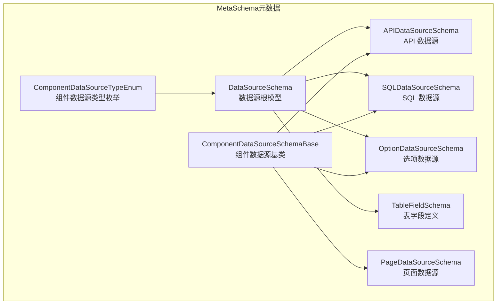
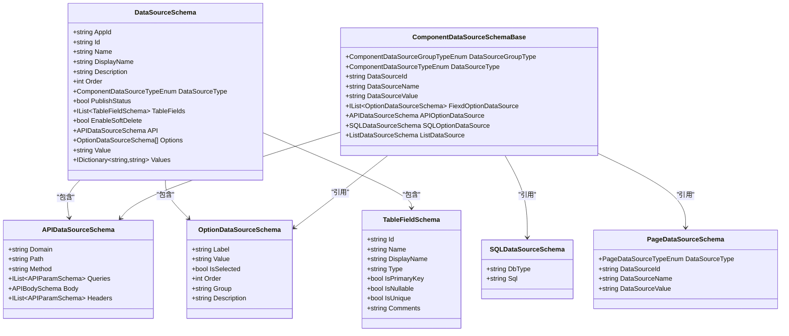
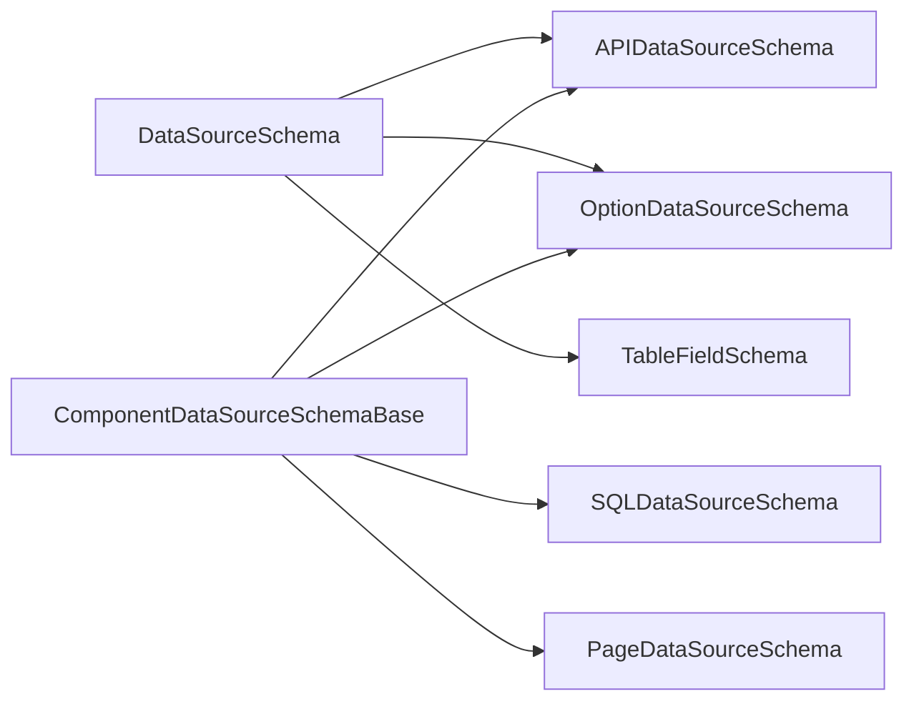

# 数据源属性配置

<cite>
**本文引用的文件**   
- [DataSourceSchema.cs](file://src/LowCode/Common/H.LowCode.MetaSchema/DataSourceSchema.cs)
- [APIDataSourceSchema.cs](file://src/LowCode/Common/H.LowCode.MetaSchema/DataSourceSchemas/APIDataSourceSchema.cs)
- [ComponentDataSourceSchema.cs](file://src/LowCode/Common/H.LowCode.MetaSchema/DataSourceSchemas/ComponentDataSourceSchema.cs)
- [TableFieldSchema.cs](file://src/LowCode/Common/H.LowCode.MetaSchema/DataSourceSchemas/TableFieldSchema.cs)
- [SQLDataSourceSchema.cs](file://src/LowCode/Common/H.LowCode.MetaSchema/DataSourceSchemas/SQLDataSourceSchema.cs)
- [OptionDataSourceSchema.cs](file://src/LowCode/Common/H.LowCode.MetaSchema/DataSourceSchemas/OptionDataSourceSchema.cs)
- [PageDataSourceSchema.cs](file://src/LowCode/Common/H.LowCode.MetaSchema/DataSourceSchemas/PageDataSourceSchema.cs)
- [ComponentDataSourceTypeEnum.cs](file://src/LowCode/Common/H.LowCode.MetaSchema/Enums/ComponentDataSourceTypeEnum.cs)
</cite>

## 目录
1. [简介](#简介)
2. [项目结构](#项目结构)
3. [核心组件](#核心组件)
4. [架构总览](#架构总览)
5. [详细组件分析](#详细组件分析)
6. [依赖关系分析](#依赖关系分析)
7. [性能与缓存策略](#性能与缓存策略)
8. [调试与测试指南](#调试与测试指南)
9. [结论](#结论)
10. [附录：字段映射与转换规则](#附录字段映射与转换规则)

## 简介
本文件面向低代码平台的数据源属性配置，系统性说明数据源绑定的配置界面与元数据结构，覆盖静态数据、API 接口、组件数据源、SQL 数据源等多种类型；阐述字段映射、数据转换与格式化规则；说明动态数据源的参数配置与请求拦截机制；并提供数据缓存策略、性能优化选项以及调试与测试方法。读者可据此完成从设计器到渲染器的完整数据绑定链路配置与排障。

## 项目结构
数据源相关元数据定义集中在 MetaSchema 层，按“通用基类 + 具体数据源 Schema”的组织方式划分，便于扩展新的数据源类型并保持序列化一致性。

图表来源 
- [DataSourceSchema.cs:1-70](file://src/LowCode/Common/H.LowCode.MetaSchema/DataSourceSchema.cs#L1-L70)
- [ComponentDataSourceSchema.cs:1-53](file://src/LowCode/Common/H.LowCode.MetaSchema/DataSourceSchemas/ComponentDataSourceSchema.cs#L1-L53)
- [APIDataSourceSchema.cs:1-65](file://src/LowCode/Common/H.LowCode.MetaSchema/DataSourceSchemas/APIDataSourceSchema.cs#L1-L65)
- [SQLDataSourceSchema.cs:1-19](file://src/LowCode/Common/H.LowCode.MetaSchema/DataSourceSchemas/SQLDataSourceSchema.cs#L1-L19)
- [OptionDataSourceSchema.cs:1-34](file://src/LowCode/Common/H.LowCode.MetaSchema/DataSourceSchemas/OptionDataSourceSchema.cs#L1-L34)
- [TableFieldSchema.cs:1-39](file://src/LowCode/Common/H.LowCode.MetaSchema/DataSourceSchemas/TableFieldSchema.cs#L1-L39)
- [PageDataSourceSchema.cs:1-18](file://src/LowCode/Common/H.LowCode.MetaSchema/DataSourceSchemas/PageDataSourceSchema.cs#L1-L18)
- [ComponentDataSourceTypeEnum.cs:1-21](file://src/LowCode/Common/H.LowCode.MetaSchema/Enums/ComponentDataSourceTypeEnum.cs#L1-L21)

章节来源
- [DataSourceSchema.cs:1-70](file://src/LowCode/Common/H.LowCode.MetaSchema/DataSourceSchema.cs#L1-L70)
- [ComponentDataSourceSchema.cs:1-53](file://src/LowCode/Common/H.LowCode.MetaSchema/DataSourceSchemas/ComponentDataSourceSchema.cs#L1-L53)

## 核心组件
- 数据源根模型 DataSourceSchema：统一描述应用内数据源的标识、名称、排序、发布状态与类型，并针对不同类型提供专属字段（如表字段、API、选项等）。
- 组件数据源基类 ComponentDataSourceSchemaBase：为组件级数据源提供分组类型、数据源类型、引用 ID/名称/值、固定选项、API 选项、SQL 选项、列表循环数据源等能力。
- API 数据源 APIDataSourceSchema：声明域名、路径、HTTP 方法、查询参数、请求体与请求头，支持多种 Body 类型。
- SQL 数据源 SQLDataSourceSchema：声明数据库类型与 SQL 语句。
- 选项数据源 OptionDataSourceSchema：用于下拉、单选、多选等场景的键值对选项集合。
- 表字段 TableFieldSchema：定义数据表的字段名、显示名、类型、主键、可空、唯一性与注释。
- 页面数据源 PageDataSourceSchema：页面级数据源的类型与引用信息。
- 组件数据源类型枚举 ComponentDataSourceTypeEnum：DB、API、Option、SQL、表达式、固定值等。

章节来源
- [DataSourceSchema.cs:1-70](file://src/LowCode/Common/H.LowCode.MetaSchema/DataSourceSchema.cs#L1-L70)
- [ComponentDataSourceSchema.cs:1-53](file://src/LowCode/Common/H.LowCode.MetaSchema/DataSourceSchemas/ComponentDataSourceSchema.cs#L1-L53)
- [APIDataSourceSchema.cs:1-65](file://src/LowCode/Common/H.LowCode.MetaSchema/DataSourceSchemas/APIDataSourceSchema.cs#L1-L65)
- [SQLDataSourceSchema.cs:1-19](file://src/LowCode/Common/H.LowCode.MetaSchema/DataSourceSchemas/SQLDataSourceSchema.cs#L1-L19)
- [OptionDataSourceSchema.cs:1-34](file://src/LowCode/Common/H.LowCode.MetaSchema/DataSourceSchemas/OptionDataSourceSchema.cs#L1-L34)
- [TableFieldSchema.cs:1-39](file://src/LowCode/Common/H.LowCode.MetaSchema/DataSourceSchemas/TableFieldSchema.cs#L1-L39)
- [PageDataSourceSchema.cs:1-18](file://src/LowCode/Common/H.LowCode.MetaSchema/DataSourceSchemas/PageDataSourceSchema.cs#L1-L18)
- [ComponentDataSourceTypeEnum.cs:1-21](file://src/LowCode/Common/H.LowCode.MetaSchema/Enums/ComponentDataSourceTypeEnum.cs#L1-L21)

## 架构总览
数据源在“设计器”中通过元数据 Schema 进行可视化配置，在“渲染器”中根据类型解析执行：静态/选项直接消费；API/SQL 由运行时发起请求或执行；组件/页面数据源通过引用关联其他组件或页面的数据结果。

图表来源 
- [DataSourceSchema.cs:1-70](file://src/LowCode/Common/H.LowCode.MetaSchema/DataSourceSchema.cs#L1-L70)
- [ComponentDataSourceSchema.cs:1-53](file://src/LowCode/Common/H.LowCode.MetaSchema/DataSourceSchemas/ComponentDataSourceSchema.cs#L1-L53)
- [APIDataSourceSchema.cs:1-65](file://src/LowCode/Common/H.LowCode.MetaSchema/DataSourceSchemas/APIDataSourceSchema.cs#L1-L65)
- [SQLDataSourceSchema.cs:1-19](file://src/LowCode/Common/H.LowCode.MetaSchema/DataSourceSchemas/SQLDataSourceSchema.cs#L1-L19)
- [OptionDataSourceSchema.cs:1-34](file://src/LowCode/Common/H.LowCode.MetaSchema/DataSourceSchemas/OptionDataSourceSchema.cs#L1-L34)
- [TableFieldSchema.cs:1-39](file://src/LowCode/Common/H.LowCode.MetaSchema/DataSourceSchemas/TableFieldSchema.cs#L1-L39)
- [PageDataSourceSchema.cs:1-18](file://src/LowCode/Common/H.LowCode.MetaSchema/DataSourceSchemas/PageDataSourceSchema.cs#L1-L18)

## 详细组件分析

### 数据源根模型（DataSourceSchema）
- 作用：作为应用内所有数据源的统一描述，承载基础信息与类型化扩展字段。
- 关键字段：
  - 标识与展示：AppId、Id、Name、DisplayName、Description、Order、PublishStatus
  - 类型：DataSourceType（决定后续使用哪个扩展字段）
  - 表数据源：TableFields、EnableSoftDelete
  - API 数据源：API
  - 选项数据源：Options、Values、Value
- 设计要点：通过类型分支组织扩展字段，避免冗余，提升序列化体积与可读性。

章节来源
- [DataSourceSchema.cs:1-70](file://src/LowCode/Common/H.LowCode.MetaSchema/DataSourceSchema.cs#L1-L70)

### 组件数据源基类（ComponentDataSourceSchemaBase）
- 作用：为组件级数据源提供统一的引用与配置入口，支持多来源组合。
- 关键能力：
  - 分组与类型：DataSourceGroupType、DataSourceType
  - 引用：DataSourceId、DataSourceName、DataSourceValue
  - 选项来源：FiexdOptionDataSource、APIOptionDataSource、SQLOptionDataSource
  - 列表循环：ListDataSource（用于 v-for 类渲染）
- 适用场景：下拉框、表格列、表单控件等的动态数据绑定。

章节来源
- [ComponentDataSourceSchema.cs:1-53](file://src/LowCode/Common/H.LowCode.MetaSchema/DataSourceSchemas/ComponentDataSourceSchema.cs#L1-L53)

### API 数据源（APIDataSourceSchema）
- 作用：声明 HTTP 调用所需的全部参数，包括域名、路径、方法、查询参数、请求体与请求头。
- 关键点：
  - 查询参数：Queries（键、类型、描述）
  - 请求体：Body（支持 JSON、Text、Multipart、Raw、Binary）
  - 请求头：Headers（键、类型、描述）
- 建议：将敏感头（如鉴权 Token）通过环境变量注入，避免硬编码。

章节来源
- [APIDataSourceSchema.cs:1-65](file://src/LowCode/Common/H.LowCode.MetaSchema/DataSourceSchemas/APIDataSourceSchema.cs#L1-L65)

### SQL 数据源（SQLDataSourceSchema）
- 作用：声明数据库类型与 SQL 语句，供渲染期或后端代理执行。
- 关键点：DbType、Sql
- 安全建议：严格校验与白名单控制，避免 SQL 注入；优先使用参数化查询。

章节来源
- [SQLDataSourceSchema.cs:1-19](file://src/LowCode/Common/H.LowCode.MetaSchema/DataSourceSchemas/SQLDataSourceSchema.cs#L1-L19)

### 选项数据源（OptionDataSourceSchema）
- 作用：定义一组键值对选项，常用于选择类控件。
- 关键点：Label、Value、IsSelected、Order、Group、Description
- 使用建议：大量选项时结合分页或懒加载；保持 Value 稳定且短小。

章节来源
- [OptionDataSourceSchema.cs:1-34](file://src/LowCode/Common/H.LowCode.MetaSchema/DataSourceSchemas/OptionDataSourceSchema.cs#L1-L34)

### 表字段（TableFieldSchema）
- 作用：描述数据表字段元信息，支撑数据建模与自动映射。
- 关键点：Id、Name、DisplayName、Type、IsPrimaryKey、IsNullable、IsUnique、Comments
- 用途：生成表单/表格列、校验规则、索引与约束提示。

章节来源
- [TableFieldSchema.cs:1-39](file://src/LowCode/Common/H.LowCode.MetaSchema/DataSourceSchemas/TableFieldSchema.cs#L1-L39)

### 页面数据源（PageDataSourceSchema）
- 作用：页面级数据源的类型与引用，便于跨页面共享数据。
- 关键点：DataSourceType、DataSourceId、DataSourceName、DataSourceValue

章节来源
- [PageDataSourceSchema.cs:1-18](file://src/LowCode/Common/H.LowCode.MetaSchema/DataSourceSchemas/PageDataSourceSchema.cs#L1-L18)

### 组件数据源类型（ComponentDataSourceTypeEnum）
- 枚举值涵盖 DB、API、Option、SQL、表达式、固定值等，驱动不同渲染与执行逻辑。

章节来源
- [ComponentDataSourceTypeEnum.cs:1-21](file://src/LowCode/Common/H.LowCode.MetaSchema/Enums/ComponentDataSourceTypeEnum.cs#L1-L21)

## 依赖关系分析
- 耦合度：各 Schema 之间以组合为主，松耦合，新增数据源类型只需扩展对应 Schema 并在类型分支中处理。
- 外部依赖：JSON 序列化键名采用短键（如 d、p、m、qs、bd、hs），有利于减小传输体积。
- 潜在风险：若 API/SQL 配置不当可能导致性能问题或安全风险，需配合校验与拦截。

图表来源 
- [DataSourceSchema.cs:1-70](file://src/LowCode/Common/H.LowCode.MetaSchema/DataSourceSchema.cs#L1-L70)
- [ComponentDataSourceSchema.cs:1-53](file://src/LowCode/Common/H.LowCode.MetaSchema/DataSourceSchemas/ComponentDataSourceSchema.cs#L1-L53)
- [APIDataSourceSchema.cs:1-65](file://src/LowCode/Common/H.LowCode.MetaSchema/DataSourceSchemas/APIDataSourceSchema.cs#L1-L65)
- [SQLDataSourceSchema.cs:1-19](file://src/LowCode/Common/H.LowCode.MetaSchema/DataSourceSchemas/SQLDataSourceSchema.cs#L1-L19)
- [OptionDataSourceSchema.cs:1-34](file://src/LowCode/Common/H.LowCode.MetaSchema/DataSourceSchemas/OptionDataSourceSchema.cs#L1-L34)
- [PageDataSourceSchema.cs:1-18](file://src/LowCode/Common/H.LowCode.MetaSchema/DataSourceSchemas/PageDataSourceSchema.cs#L1-L18)

## 性能与缓存策略
- 缓存层级
  - 浏览器端缓存：对静态与选项数据源启用内存缓存，减少重复渲染开销。
  - 服务端缓存：对 API/SQL 响应设置合理的 TTL，热点数据优先命中缓存。
- 请求优化
  - 合并请求：批量获取多个选项或字典数据，降低网络往返。
  - 分页与懒加载：大数据集按需加载，避免首屏阻塞。
  - 去抖与节流：输入触发查询时限制频率，避免频繁请求。
- 资源控制
  - 连接池与超时：合理设置并发与超时时间，防止雪崩。
  - 压缩与增量更新：启用 gzip/br，必要时使用增量同步。
- 监控与降级
  - 指标上报：QPS、延迟、错误率、缓存命中率。
  - 降级策略：上游不可用时返回兜底数据或空态 UI。

[本节为通用指导，不直接分析具体文件]

## 调试与测试指南
- 设计器阶段
  - 预览数据：在配置面板中实时预览 API/SQL 返回结果，验证字段映射与格式。
  - 校验规则：检查必填、唯一、长度、正则等约束是否生效。
- 运行期调试
  - 网络抓包：查看请求 URL、方法、头部、参数与响应体，确认鉴权与跨域。
  - 控制台日志：输出关键变量与中间结果，定位数据转换异常。
- 单元测试
  - 用例覆盖：正常路径、边界条件、异常分支（超时、4xx/5xx、空数据）。
  - Mock 服务：模拟第三方 API 与数据库响应，保证稳定性。
- 回归与自动化
  - 快照对比：对复杂页面渲染结果做视觉回归。
  - 性能基准：记录关键路径耗时，纳入持续集成。

[本节为通用指导，不直接分析具体文件]

## 结论
通过统一的元数据 Schema 体系，数据源属性配置在设计器与渲染器间形成清晰契约。基于类型分支的扩展方式使新增数据源类型成本低、维护性强。配合合理的缓存、请求优化与完善的调试测试流程，可在保证灵活性的同时获得稳定的性能表现。

[本节为总结性内容，不直接分析具体文件]

## 附录：字段映射与转换规则
- 字段映射
  - 一对一映射：组件字段与数据字段同名或显式指定映射关系。
  - 嵌套展开：对象数组展开为行数据，支持多级展开。
  - 别名与重命名：通过映射表将后端字段转换为前端友好名称。
- 数据转换
  - 类型转换：字符串转日期/数字/布尔，空值默认化处理。
  - 计算字段：基于公式或表达式派生新字段（如金额合计、状态码翻译）。
  - 枚举映射：数值/代码映射为可读文本。
- 格式化规则
  - 日期时间：统一时区与格式（YYYY-MM-DD HH:mm:ss）。
  - 数值精度：保留小数位、千分位分隔、货币符号。
  - 文本处理：截断、换行、富文本转义。
- 校验与容错
  - 前置校验：必填、范围、格式、业务规则。
  - 后置清洗：去除空白、标准化大小写、规范化单位。
  - 失败回退：默认值、占位符、错误提示。

[本节为通用指导，不直接分析具体文件]