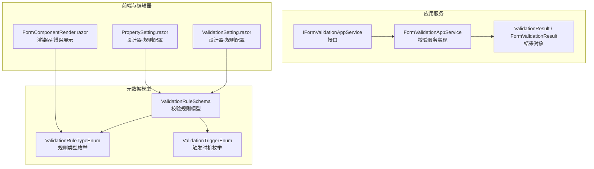
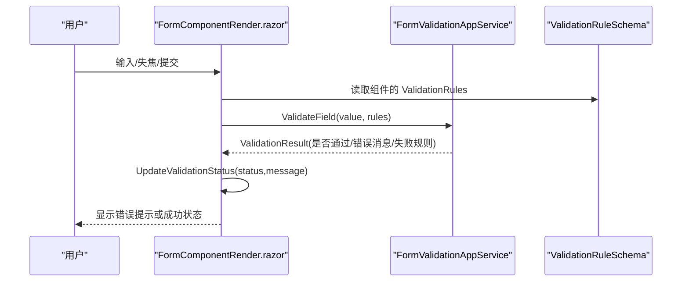
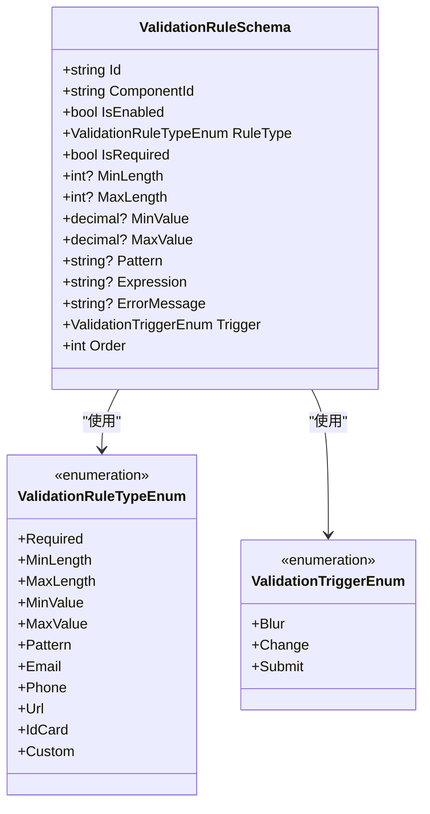
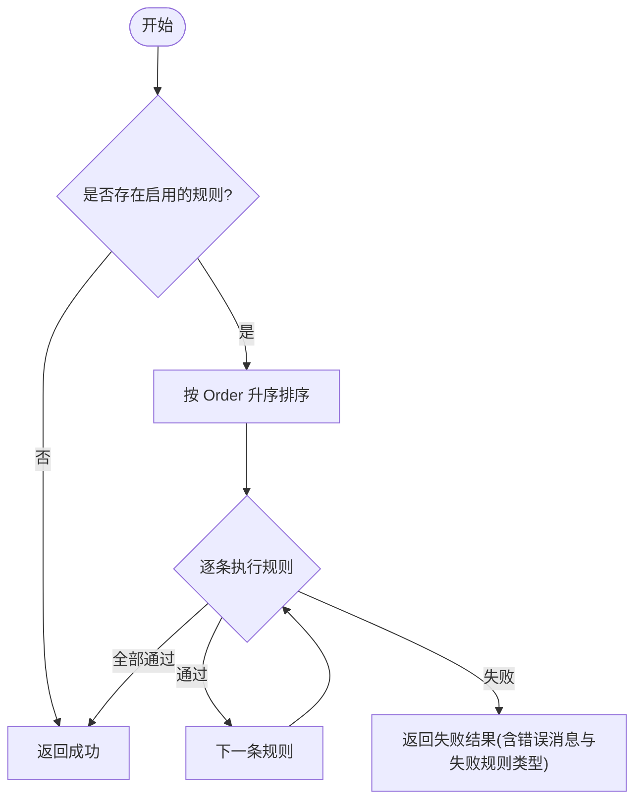
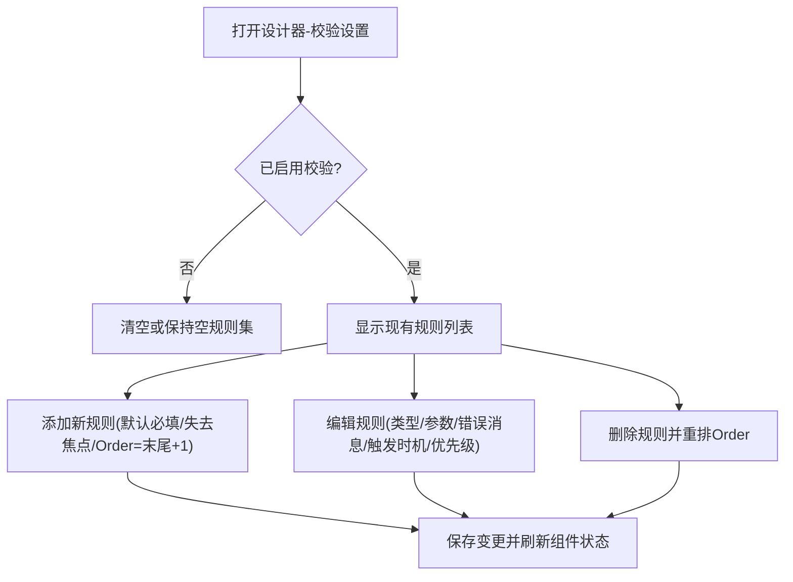
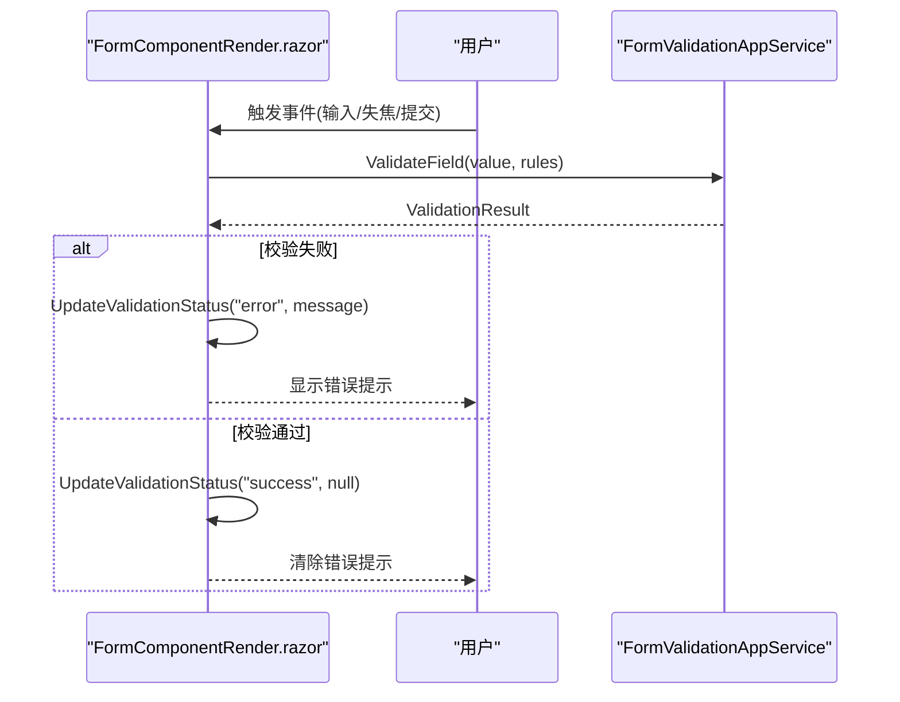
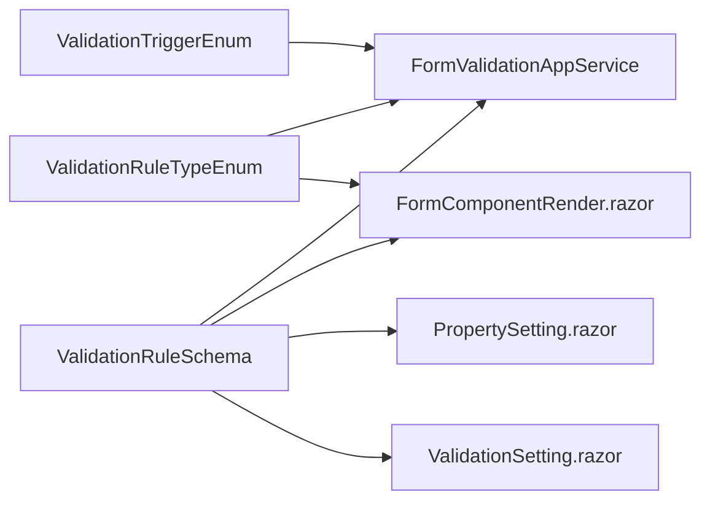

# 验证规则设置

<cite>
**本文引用的文件**   
- [FormValidationAppService.cs](file://src/LowCode/Common/H.LowCode.Application/Services/FormValidationAppService.cs)
- [IFormValidationAppService.cs](file://src/LowCode/Common/H.LowCode.Application.Contracts/AppServices/IFormValidationAppService.cs)
- [ValidationRuleSchema.cs](file://src/LowCode/Common/H.LowCode.MetaSchema/PropertySchemas/ValidationRuleSchema.cs)
- [FormComponentRender.razor](file://src/LowCode/RenderEngine/H.LowCode.RenderEngine/ComponentRender/FormComponentRender.razor)
- [PropertySetting.razor（部件设计器）](file://src/LowCode/DesignEngine/H.LowCode.PartsDesignEngine/SettingPanel/PropertySetting.razor)
- [ValidationSetting.razor（引擎设计器）](file://src/LowCode/DesignEngine/H.LowCode.DesignEngine/SettingPanel/ValidationSetting.razor)
</cite>

## 目录
1. [简介](#简介)
2. [项目结构](#项目结构)
3. [核心组件](#核心组件)
4. [架构总览](#架构总览)
5. [详细组件分析](#详细组件分析)
6. [依赖关系分析](#依赖关系分析)
7. [性能考虑](#性能考虑)
8. [故障排查指南](#故障排查指南)
9. [结论](#结论)
10. [附录](#附录)

## 简介
本文件面向低代码平台的“验证规则设置”，系统性说明内置校验类型、配置方法、触发时机与优先级、错误展示与国际化支持，以及自定义校验规则的扩展机制。同时给出复杂校验的组合使用与条件校验的实现思路，帮助开发者快速掌握从设计器到渲染器的完整验证链路。

## 项目结构
围绕验证规则的核心由三类文件组成：
- 元数据模型：定义校验规则的数据结构与枚举
- 应用服务：实现字段级与表单级的校验逻辑
- 前端渲染与设计器：提供可视化配置与运行时错误展示

图表来源 
- [ValidationRuleSchema.cs:10-177](file://src/LowCode/Common/H.LowCode.MetaSchema/PropertySchemas/ValidationRuleSchema.cs#L10-L177)
- [IFormValidationAppService.cs:1-67](file://src/LowCode/Common/H.LowCode.Application.Contracts/AppServices/IFormValidationAppService.cs#L1-L67)
- [FormValidationAppService.cs:1-252](file://src/LowCode/Common/H.LowCode.Application/Services/FormValidationAppService.cs#L1-L252)
- [FormComponentRender.razor:1-90](file://src/LowCode/RenderEngine/H.LowCode.RenderEngine/ComponentRender/FormComponentRender.razor#L1-L90)
- [PropertySetting.razor（部件设计器）:1-249](file://src/LowCode/DesignEngine/H.LowCode.PartsDesignEngine/SettingPanel/PropertySetting.razor#L1-L249)
- [ValidationSetting.razor（引擎设计器）:102-195](file://src/LowCode/DesignEngine/H.LowCode.DesignEngine/SettingPanel/ValidationSetting.razor#L102-L195)

章节来源
- [ValidationRuleSchema.cs:10-177](file://src/LowCode/Common/H.LowCode.MetaSchema/PropertySchemas/ValidationRuleSchema.cs#L10-L177)
- [IFormValidationAppService.cs:1-67](file://src/LowCode/Common/H.LowCode.Application.Contracts/AppServices/IFormValidationAppService.cs#L1-L67)
- [FormValidationAppService.cs:1-252](file://src/LowCode/Common/H.LowCode.Application/Services/FormValidationAppService.cs#L1-L252)
- [FormComponentRender.razor:1-90](file://src/LowCode/RenderEngine/H.LowCode.RenderEngine/ComponentRender/FormComponentRender.razor#L1-L90)
- [PropertySetting.razor（部件设计器）:1-249](file://src/LowCode/DesignEngine/H.LowCode.PartsDesignEngine/SettingPanel/PropertySetting.razor#L1-L249)
- [ValidationSetting.razor（引擎设计器）:102-195](file://src/LowCode/DesignEngine/H.LowCode.DesignEngine/SettingPanel/ValidationSetting.razor#L102-L195)

## 核心组件
- 校验规则模型 ValidationRuleSchema：包含规则ID、关联组件ID、启用状态、规则类型、必填标记、长度/数值范围、正则表达式、自定义表达式、错误消息、触发时机、排序等属性。
- 规则类型枚举 ValidationRuleTypeEnum：覆盖必填、最小/最大长度、最小/最大值、正则、邮箱、手机号、URL、身份证号、自定义等。
- 触发时机枚举 ValidationTriggerEnum：支持失去焦点、值改变、提交时三种触发方式。
- 校验服务 IFormValidationAppService / FormValidationAppService：提供字段级 ValidateField、表单级 ValidateForm、按组件ID获取规则 GetValidationRules 等方法；内部按 Order 排序执行，遇到失败立即返回。
- 结果对象 ValidationResult / FormValidationResult：封装单字段校验结果与表单级汇总结果。
- 渲染器 FormComponentRender.razor：负责在运行时根据规则类型映射默认错误消息，并通过 UpdateValidationStatus 更新提示文本。
- 设计器 PropertySetting.razor / ValidationSetting.razor：提供可视化配置界面，支持添加/删除规则、设置触发时机与优先级、编辑错误消息等。

章节来源
- [ValidationRuleSchema.cs:10-177](file://src/LowCode/Common/H.LowCode.MetaSchema/PropertySchemas/ValidationRuleSchema.cs#L10-L177)
- [IFormValidationAppService.cs:1-67](file://src/LowCode/Common/H.LowCode.Application.Contracts/AppServices/IFormValidationAppService.cs#L1-L67)
- [FormValidationAppService.cs:15-56](file://src/LowCode/Common/H.LowCode.Application/Services/FormValidationAppService.cs#L15-L56)
- [FormComponentRender.razor:67-90](file://src/LowCode/RenderEngine/H.LowCode.RenderEngine/ComponentRender/FormComponentRender.razor#L67-L90)
- [PropertySetting.razor（部件设计器）:18-124](file://src/LowCode/DesignEngine/H.LowCode.PartsDesignEngine/SettingPanel/PropertySetting.razor#L18-L124)
- [ValidationSetting.razor（引擎设计器）:102-195](file://src/LowCode/DesignEngine/H.LowCode.DesignEngine/SettingPanel/ValidationSetting.razor#L102-L195)

## 架构总览
下图展示了从设计器配置到渲染器执行的端到端流程：设计器维护组件的 ValidationRules，渲染器在用户交互时读取规则并调用校验服务，最终将错误信息反馈到 UI。

图表来源 
- [FormComponentRender.razor:67-90](file://src/LowCode/RenderEngine/H.LowCode.RenderEngine/ComponentRender/FormComponentRender.razor#L67-L90)
- [FormValidationAppService.cs:15-56](file://src/LowCode/Common/H.LowCode.Application/Services/FormValidationAppService.cs#L15-L56)
- [ValidationRuleSchema.cs:10-95](file://src/LowCode/Common/H.LowCode.MetaSchema/PropertySchemas/ValidationRuleSchema.cs#L10-L95)

## 详细组件分析

### 校验规则模型与枚举
- ValidationRuleSchema 字段涵盖规则标识、启用开关、类型、长度/数值范围、正则/自定义表达式、错误消息、触发时机、排序等。
- ValidationRuleTypeEnum 定义了所有内置规则类型，便于统一分发与错误文案映射。
- ValidationTriggerEnum 控制校验触发时机，为前端事件绑定提供依据。

图表来源 
- [ValidationRuleSchema.cs:10-177](file://src/LowCode/Common/H.LowCode.MetaSchema/PropertySchemas/ValidationRuleSchema.cs#L10-L177)

章节来源
- [ValidationRuleSchema.cs:10-177](file://src/LowCode/Common/H.LowCode.MetaSchema/PropertySchemas/ValidationRuleSchema.cs#L10-L177)

### 校验服务与执行流程
- ValidateField：对单个字段值按规则顺序执行校验，遇到失败即返回。
- ValidateForm：遍历组件列表，收集每个字段的校验结果并汇总。
- ValidateSingleRule：根据 RuleType 分派到具体校验方法（必填、长度、数值、正则、邮箱、手机、URL、自定义）。
- 自定义校验：预留 Expression 字段用于未来扩展表达式引擎。

图表来源 
- [FormValidationAppService.cs:15-56](file://src/LowCode/Common/H.LowCode.Application/Services/FormValidationAppService.cs#L15-L56)
- [FormValidationAppService.cs:64-108](file://src/LowCode/Common/H.LowCode.Application/Services/FormValidationAppService.cs#L64-L108)

章节来源
- [FormValidationAppService.cs:15-56](file://src/LowCode/Common/H.LowCode.Application/Services/FormValidationAppService.cs#L15-L56)
- [FormValidationAppService.cs:64-108](file://src/LowCode/Common/H.LowCode.Application/Services/FormValidationAppService.cs#L64-L108)
- [FormValidationAppService.cs:110-251](file://src/LowCode/Common/H.LowCode.Application/Services/FormValidationAppService.cs#L110-L251)

### 设计器：规则配置与优先级
- 设计器页面提供“启用校验”开关、规则增删、类型选择、参数配置（如长度/数值范围/正则）、错误消息编辑、触发时机选择、优先级设置。
- 新增规则默认类型为必填，触发时机默认为失去焦点，Order 自动递增。
- 删除规则后会自动重排 Order，保证执行顺序稳定。

图表来源 
- [PropertySetting.razor（部件设计器）:18-124](file://src/LowCode/DesignEngine/H.LowCode.PartsDesignEngine/SettingPanel/PropertySetting.razor#L18-L124)
- [PropertySetting.razor（部件设计器）:183-218](file://src/LowCode/DesignEngine/H.LowCode.PartsDesignEngine/SettingPanel/PropertySetting.razor#L183-L218)
- [ValidationSetting.razor（引擎设计器）:102-195](file://src/LowCode/DesignEngine/H.LowCode.DesignEngine/SettingPanel/ValidationSetting.razor#L102-L195)

章节来源
- [PropertySetting.razor（部件设计器）:18-124](file://src/LowCode/DesignEngine/H.LowCode.PartsDesignEngine/SettingPanel/PropertySetting.razor#L18-L124)
- [PropertySetting.razor（部件设计器）:183-218](file://src/LowCode/DesignEngine/H.LowCode.PartsDesignEngine/SettingPanel/PropertySetting.razor#L183-L218)
- [ValidationSetting.razor（引擎设计器）:102-195](file://src/LowCode/DesignEngine/H.LowCode.DesignEngine/SettingPanel/ValidationSetting.razor#L102-L195)

### 渲染器：错误展示与默认文案
- 渲染器根据规则类型映射默认错误消息，并在需要时通过 UpdateValidationStatus 异步更新提示文本。
- 错误消息可在设计器中覆盖，未覆盖时使用默认文案。

图表来源 
- [FormComponentRender.razor:67-90](file://src/LowCode/RenderEngine/H.LowCode.RenderEngine/ComponentRender/FormComponentRender.razor#L67-L90)
- [FormValidationAppService.cs:15-56](file://src/LowCode/Common/H.LowCode.Application/Services/FormValidationAppService.cs#L15-L56)

章节来源
- [FormComponentRender.razor:67-90](file://src/LowCode/RenderEngine/H.LowCode.RenderEngine/ComponentRender/FormComponentRender.razor#L67-L90)

## 依赖关系分析
- 元数据模型被设计器与渲染器共同消费，确保配置与运行一致。
- 校验服务依赖规则模型与枚举，对外暴露统一的校验接口。
- 渲染器依赖枚举进行错误文案映射，并通过服务完成实际校验。

图表来源 
- [ValidationRuleSchema.cs:10-177](file://src/LowCode/Common/H.LowCode.MetaSchema/PropertySchemas/ValidationRuleSchema.cs#L10-L177)
- [FormValidationAppService.cs:15-56](file://src/LowCode/Common/H.LowCode.Application/Services/FormValidationAppService.cs#L15-L56)
- [FormComponentRender.razor:67-90](file://src/LowCode/RenderEngine/H.LowCode.RenderEngine/ComponentRender/FormComponentRender.razor#L67-L90)
- [PropertySetting.razor（部件设计器）:18-124](file://src/LowCode/DesignEngine/H.LowCode.PartsDesignEngine/SettingPanel/PropertySetting.razor#L18-L124)
- [ValidationSetting.razor（引擎设计器）:102-195](file://src/LowCode/DesignEngine/H.LowCode.DesignEngine/SettingPanel/ValidationSetting.razor#L102-L195)

章节来源
- [ValidationRuleSchema.cs:10-177](file://src/LowCode/Common/H.LowCode.MetaSchema/PropertySchemas/ValidationRuleSchema.cs#L10-L177)
- [FormValidationAppService.cs:15-56](file://src/LowCode/Common/H.LowCode.Application/Services/FormValidationAppService.cs#L15-L56)
- [FormComponentRender.razor:67-90](file://src/LowCode/RenderEngine/H.LowCode.RenderEngine/ComponentRender/FormComponentRender.razor#L67-L90)
- [PropertySetting.razor（部件设计器）:18-124](file://src/LowCode/DesignEngine/H.LowCode.PartsDesignEngine/SettingPanel/PropertySetting.razor#L18-L124)
- [ValidationSetting.razor（引擎设计器）:102-195](file://src/LowCode/DesignEngine/H.LowCode.DesignEngine/SettingPanel/ValidationSetting.razor#L102-L195)

## 性能考虑
- 规则执行顺序：按 Order 升序执行，短路失败可尽早返回，减少不必要的计算。
- 正则表达式：避免过于复杂的模式，必要时缓存编译后的正则以提升性能。
- 批量校验：ValidateForm 会遍历组件集合，建议在大数据量场景下分页或延迟加载。
- 前端触发频率：Change 触发较频繁，建议对高成本规则采用 Blur 或 Submit 触发。

[本节为通用指导，不直接分析具体文件]

## 故障排查指南
- 校验未生效：检查规则是否启用（IsEnabled），确认触发时机（Trigger）与前端事件匹配。
- 错误消息不正确：优先检查设计器中的 ErrorMessage 是否覆盖默认文案。
- 自定义规则无效：确认 Expression 是否正确填充，服务端 ValidateCustom 尚未实现表达式解析，需后续扩展。
- 顺序问题：确认各规则的 Order 值是否符合预期，删除规则后是否重新排序。

章节来源
- [FormValidationAppService.cs:110-251](file://src/LowCode/Common/H.LowCode.Application/Services/FormValidationAppService.cs#L110-L251)
- [PropertySetting.razor（部件设计器）:183-218](file://src/LowCode/DesignEngine/H.LowCode.PartsDesignEngine/SettingPanel/PropertySetting.razor#L183-L218)

## 结论
该验证体系以清晰的元数据模型为核心，配合统一的服务层与友好的设计器，实现了从配置到运行的闭环。通过优先级与触发时机控制，既能满足常见校验需求，也为复杂与条件校验提供了扩展空间。建议在生产环境中结合国际化资源与表达式引擎进一步完善错误文案与自定义规则能力。

[本节为总结性内容，不直接分析具体文件]

## 附录

### 内置验证规则与配置要点
- 必填验证：设置 RuleType=Required，可为空时提示“此字段为必填项”。
- 长度验证：MinLength/MaxLength 控制字符串长度边界。
- 数值范围：MinValue/MaxValue 控制数值上下界。
- 格式验证：Pattern（正则）、Email、Phone、Url、IdCard 等内置格式。
- 自定义验证：RuleType=Custom，Expression 预留扩展点。

章节来源
- [ValidationRuleSchema.cs:100-177](file://src/LowCode/Common/H.LowCode.MetaSchema/PropertySchemas/ValidationRuleSchema.cs#L100-L177)
- [FormValidationAppService.cs:110-251](file://src/LowCode/Common/H.LowCode.Application/Services/FormValidationAppService.cs#L110-L251)

### 触发时机与优先级
- 触发时机：Blur（失去焦点）、Change（输入时）、Submit（提交时）。
- 优先级：Order 越小越先执行，删除规则后应重排 Order。

章节来源
- [ValidationRuleSchema.cs:161-177](file://src/LowCode/Common/H.LowCode.MetaSchema/PropertySchemas/ValidationRuleSchema.cs#L161-L177)
- [FormValidationAppService.cs:15-34](file://src/LowCode/Common/H.LowCode.Application/Services/FormValidationAppService.cs#L15-L34)
- [PropertySetting.razor（部件设计器）:106-124](file://src/LowCode/DesignEngine/H.LowCode.PartsDesignEngine/SettingPanel/PropertySetting.razor#L106-L124)

### 错误展示与国际化
- 默认错误文案：渲染器根据 RuleType 映射默认文案。
- 覆盖策略：设计器中设置 ErrorMessage 可覆盖默认文案。
- 国际化建议：将默认文案抽取至资源文件，按语言环境动态替换。

章节来源
- [FormComponentRender.razor:67-90](file://src/LowCode/RenderEngine/H.LowCode.RenderEngine/ComponentRender/FormComponentRender.razor#L67-L90)
- [PropertySetting.razor（部件设计器）:231-247](file://src/LowCode/DesignEngine/H.LowCode.PartsDesignEngine/SettingPanel/PropertySetting.razor#L231-L247)

### 复杂校验组合与条件校验
- 组合使用：在同一字段上叠加多个规则，按 Order 顺序执行，首个失败即中断。
- 条件校验：可通过 Expression 字段在未来接入表达式引擎，实现跨字段或上下文相关的条件判断。
- 最佳实践：将高频且简单的规则前置（如必填、长度），将耗时或复杂规则后置。

章节来源
- [FormValidationAppService.cs:15-56](file://src/LowCode/Common/H.LowCode.Application/Services/FormValidationAppService.cs#L15-L56)
- [FormValidationAppService.cs:241-251](file://src/LowCode/Common/H.LowCode.Application/Services/FormValidationAppService.cs#L241-L251)