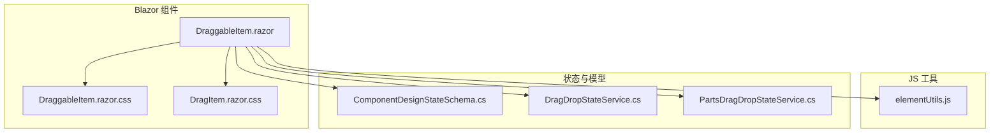
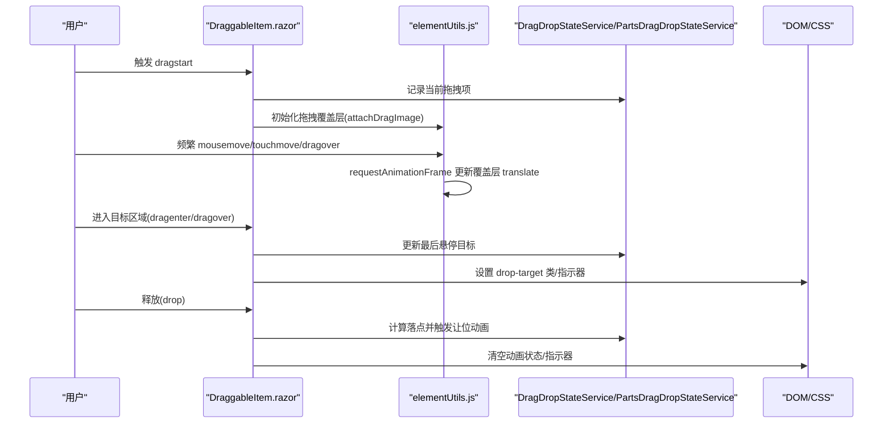
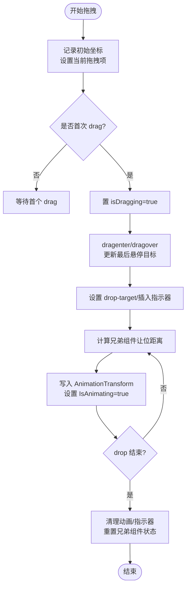
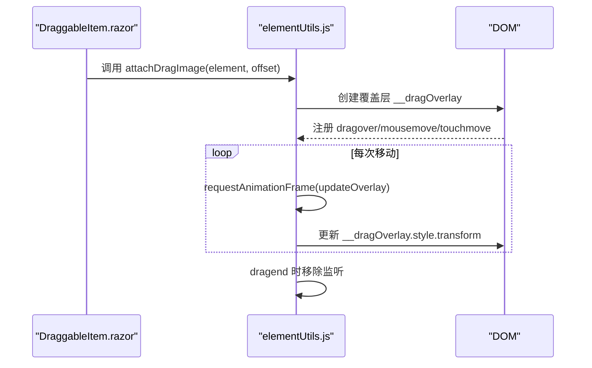
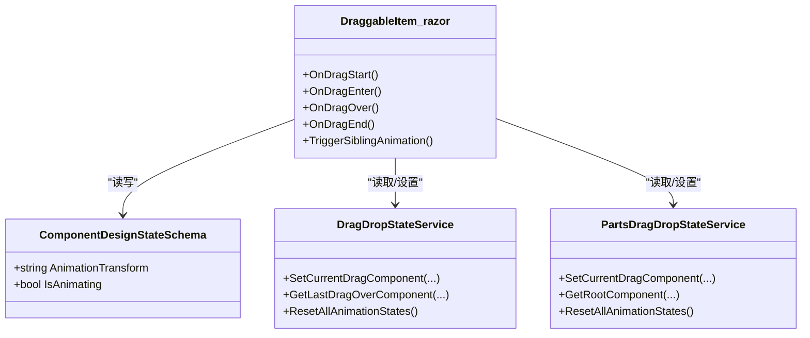
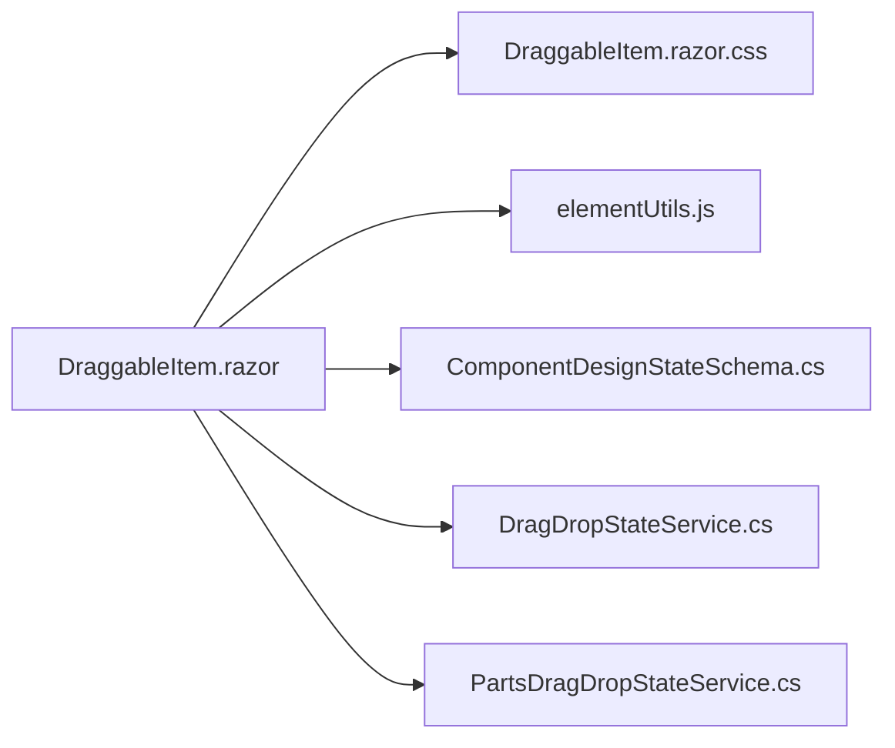

# 拖拽动画效果

<cite>
**本文引用的文件**   
- [DraggableItem.razor](file://src/LowCode/DesignEngine/H.LowCode.DesignEngine/DraggableComponents/DraggableItem.razor)
- [DraggableItem.razor.css](file://src/LowCode/DesignEngine/H.LowCode.DesignEngine/DraggableComponents/DraggableItem.razor.css)
- [elementUtils.js](file://src/LowCode/DesignEngine/H.LowCode.DesignEngineBase/wwwroot/js/elementUtils.js)
- [ComponentDesignStateSchema.cs](file://src/LowCode/Common/H.LowCode.MetaSchema.DesignEngine/PropertySchemas/ComponentDesignStateSchema.cs)
- [DragDropStateService.cs](file://src/LowCode/DesignEngine/H.LowCode.DesignEngine/Services/DragDropStateService.cs)
- [PartsDragDropStateService.cs](file://src/LowCode/DesignEngine/H.LowCode.PartsDesignEngine/Services/PartsDragDropStateService.cs)
- [DragItem.razor.css](file://src/LowCode/DesignEngine/H.LowCode.PartsDesignEngine/ComponentPanel/DragItem.razor.css)
</cite>

## 目录
1. [简介](#简介)
2. [项目结构](#项目结构)
3. [核心组件](#核心组件)
4. [架构总览](#架构总览)
5. [详细组件分析](#详细组件分析)
6. [依赖关系分析](#依赖关系分析)
7. [性能考量](#性能考量)
8. [故障排查指南](#故障排查指南)
9. [结论](#结论)
10. [附录](#附录)

## 简介
本文件面向“拖拽动画效果系统”，系统性阐述在 Blazor 与原生 JavaScript 协同下，如何通过 CSS transform、transition 与 JS requestAnimationFrame 实现高性能的拖拽预览、放置区域高亮、插入指示器以及兄弟组件让位动画。文档同时覆盖动画状态管理（IsAnimating、AnimationTransform）、性能优化策略（硬件加速、防抖节流、批量更新）与扩展定制方法。

## 项目结构
与拖拽动画相关的代码主要分布在以下位置：
- 设计引擎组件层：DraggableItem.razor 及其样式
- 基础 JS 工具：elementUtils.js（拖拽图像跟随、事件绑定与清理）
- 状态模型：ComponentDesignStateSchema（AnimationTransform、IsAnimating 等）
- 拖拽状态服务：DragDropStateService、PartsDragDropStateService（跨组件共享当前拖拽项、最后悬停目标等）
- 部件面板样式：DragItem.razor.css（库面板拖拽项交互反馈）

**图表来源** 
- [DraggableItem.razor:1-278](file://src/LowCode/DesignEngine/H.LowCode.DesignEngine/DraggableComponents/DraggableItem.razor#L1-L278)
- [DraggableItem.razor.css:28-36](file://src/LowCode/DesignEngine/H.LowCode.DesignEngine/DraggableComponents/DraggableItem.razor.css#L28-L36)
- [DragItem.razor.css:1-35](file://src/LowCode/DesignEngine/H.LowCode.PartsDesignEngine/ComponentPanel/DragItem.razor.css#L1-L35)
- [elementUtils.js:175-196](file://src/LowCode/DesignEngine/H.LowCode.DesignEngineBase/wwwroot/js/elementUtils.js#L175-L196)
- [ComponentDesignStateSchema.cs:27-33](file://src/LowCode/Common/H.LowCode.MetaSchema.DesignEngine/PropertySchemas/ComponentDesignStateSchema.cs#L27-L33)
- [DragDropStateService.cs:189-230](file://src/LowCode/DesignEngine/H.LowCode.DesignEngine/Services/DragDropStateService.cs#L189-L230)
- [PartsDragDropStateService.cs:190-230](file://src/LowCode/DesignEngine/H.LowCode.PartsDesignEngine/Services/PartsDragDropStateService.cs#L190-L230)

**章节来源**
- [DraggableItem.razor:1-278](file://src/LowCode/DesignEngine/H.LowCode.DesignEngine/DraggableComponents/DraggableItem.razor#L1-L278)
- [DraggableItem.razor.css:28-36](file://src/LowCode/DesignEngine/H.LowCode.DesignEngine/DraggableComponents/DraggableItem.razor.css#L28-L36)
- [DragItem.razor.css:1-35](file://src/LowCode/DesignEngine/H.LowCode.PartsDesignEngine/ComponentPanel/DragItem.razor.css#L1-L35)
- [elementUtils.js:175-196](file://src/LowCode/DesignEngine/H.LowCode.DesignEngineBase/wwwroot/js/elementUtils.js#L175-L196)
- [ComponentDesignStateSchema.cs:27-33](file://src/LowCode/Common/H.LowCode.MetaSchema.DesignEngine/PropertySchemas/ComponentDesignStateSchema.cs#L27-L33)
- [DragDropStateService.cs:189-230](file://src/LowCode/DesignEngine/H.LowCode.DesignEngine/Services/DragDropStateService.cs#L189-L230)
- [PartsDragDropStateService.cs:190-230](file://src/LowCode/DesignEngine/H.LowCode.PartsDesignEngine/Services/PartsDragDropStateService.cs#L190-L230)

## 核心组件
- DraggableItem.razor：承载拖拽生命周期（dragstart/dragover/drop 等），通过 DesignState.AnimationTransform 驱动元素位移，配合 will-change 与 transition 实现平滑过渡；isDragging 控制 z-index、pointer-events、opacity 等视觉反馈。
- elementUtils.js：提供 attachDragImage 能力，使用 requestAnimationFrame 以 translate 更新覆盖层，避免逐帧 Blazor 渲染带来的延迟。
- ComponentDesignStateSchema：定义 AnimationTransform、IsAnimating 等属性，作为 UI 动画的数据源。
- DragDropStateService / PartsDragDropStateService：维护当前拖拽项、最后悬停目标、根组件树等，用于计算让位动画与重置状态。

**章节来源**
- [DraggableItem.razor:1-278](file://src/LowCode/DesignEngine/H.LowCode.DesignEngine/DraggableComponents/DraggableItem.razor#L1-L278)
- [elementUtils.js:175-196](file://src/LowCode/DesignEngine/H.LowCode.DesignEngineBase/wwwroot/js/elementUtils.js#L175-L196)
- [ComponentDesignStateSchema.cs:27-33](file://src/LowCode/Common/H.LowCode.MetaSchema.DesignEngine/PropertySchemas/ComponentDesignStateSchema.cs#L27-L33)
- [DragDropStateService.cs:189-230](file://src/LowCode/DesignEngine/H.LowCode.DesignEngine/Services/DragDropStateService.cs#L189-L230)
- [PartsDragDropStateService.cs:190-230](file://src/LowCode/DesignEngine/H.LowCode.PartsDesignEngine/Services/PartsDragDropStateService.cs#L190-L230)

## 架构总览
拖拽动画由三层协作完成：
- 视图层（Blazor + CSS）：通过内联 style 绑定 AnimationTransform，CSS 处理 hover/highlight/indicator 等静态或轻量动效。
- 交互层（JS）：elementUtils.js 接管高频移动事件，requestAnimationFrame 驱动覆盖层跟随鼠标，降低主线程压力。
- 状态层（C# 服务）：DragDropStateService/PartsDragDropStateService 维护拖拽上下文，驱动兄弟组件让位动画与最终落点判定。

**图表来源** 
- [DraggableItem.razor:172-255](file://src/LowCode/DesignEngine/H.LowCode.DesignEngine/DraggableComponents/DraggableItem.razor#L172-L255)
- [elementUtils.js:175-196](file://src/LowCode/DesignEngine/H.LowCode.DesignEngineBase/wwwroot/js/elementUtils.js#L175-L196)
- [DragDropStateService.cs:189-230](file://src/LowCode/DesignEngine/H.LowCode.DesignEngine/Services/DragDropStateService.cs#L189-L230)
- [PartsDragDropStateService.cs:190-230](file://src/LowCode/DesignEngine/H.LowCode.PartsDesignEngine/Services/PartsDragDropStateService.cs#L190-L230)

## 详细组件分析

### DraggableItem.razor：拖拽与动画编排
- 关键样式绑定
  - transform: 绑定到 Component.DesignState.AnimationTransform，驱动 translate/translate3d 位移。
  - will-change: 当 isDragging 或 IsAnimating 为真时提示浏览器优先优化 transform。
  - transition: 非拖拽阶段启用 transform 过渡，提升回弹顺滑度。
  - z-index/position/opacity/pointer-events: 拖拽中临时提升层级、禁用自身事件穿透，保证覆盖层交互。
- 事件处理要点
  - OnDragStart：记录初始坐标，设置当前拖拽项，清理兄弟残留动画；注意不在 dragstart 立即置 isDragging，避免中断原生拖拽。
  - OnDragEnter/OnDragOver：更新最后悬停目标，设置 drop-target 与插入指示器。
  - OnDrag：仅在首个 drag 事件后置 isDragging=true，确保原生拖拽已启动。
  - OnDragEnd：清理所有动画与指示器，重置兄弟组件动画状态。
- 让位动画
  - 根据拖拽方向与网格布局计算 moveDistanceX/Y，使用 translate3d 触发 GPU 加速，并设置 IsAnimating=true。
  - 提供 ClearSiblingAnimation/ResetAllAnimationStates 等方法统一清理。

**图表来源** 
- [DraggableItem.razor:172-255](file://src/LowCode/DesignEngine/H.LowCode.DesignEngine/DraggableComponents/DraggableItem.razor#L172-L255)
- [DraggableItem.razor:267-428](file://src/LowCode/DesignEngine/H.LowCode.DesignEngine/DraggableComponents/DraggableItem.razor#L267-L428)

**章节来源**
- [DraggableItem.razor:1-278](file://src/LowCode/DesignEngine/H.LowCode.DesignEngine/DraggableComponents/DraggableItem.razor#L1-L278)
- [DraggableItem.razor:172-255](file://src/LowCode/DesignEngine/H.LowCode.DesignEngine/DraggableComponents/DraggableItem.razor#L172-L255)
- [DraggableItem.razor:267-428](file://src/LowCode/DesignEngine/H.LowCode.DesignEngine/DraggableComponents/DraggableItem.razor#L267-L428)

### elementUtils.js：拖拽覆盖层与高频更新
- attachDragImage：创建覆盖层元素，监听 dragover/mousemove/touchmove，使用 requestAnimationFrame 节流更新 translate，避免每帧触发重排。
- 事件解绑：在 dragend 时移除全局监听，防止内存泄漏。
- 性能要点：仅更新覆盖层 transform，不触发 Blazor 渲染；RAF 保证与浏览器刷新率同步。

**图表来源** 
- [elementUtils.js:175-196](file://src/LowCode/DesignEngine/H.LowCode.DesignEngineBase/wwwroot/js/elementUtils.js#L175-L196)

**章节来源**
- [elementUtils.js:175-196](file://src/LowCode/DesignEngine/H.LowCode.DesignEngineBase/wwwroot/js/elementUtils.js#L175-L196)

### 状态模型与共享服务
- ComponentDesignStateSchema：包含 AnimationTransform（字符串形式的 transform 值）与 IsAnimating（布尔标志），被组件模板直接绑定。
- DragDropStateService / PartsDragDropStateService：维护 RootComponent、CurrentDragComponent、LastDragOverComponent 等，提供获取/设置/重置方法，确保多组件间动画状态一致。

**图表来源** 
- [ComponentDesignStateSchema.cs:27-33](file://src/LowCode/Common/H.LowCode.MetaSchema.DesignEngine/PropertySchemas/ComponentDesignStateSchema.cs#L27-L33)
- [DragDropStateService.cs:189-230](file://src/LowCode/DesignEngine/H.LowCode.DesignEngine/Services/DragDropStateService.cs#L189-L230)
- [PartsDragDropStateService.cs:190-230](file://src/LowCode/DesignEngine/H.LowCode.PartsDesignEngine/Services/PartsDragDropStateService.cs#L190-L230)
- [DraggableItem.razor:172-255](file://src/LowCode/DesignEngine/H.LowCode.DesignEngine/DraggableComponents/DraggableItem.razor#L172-L255)

**章节来源**
- [ComponentDesignStateSchema.cs:27-33](file://src/LowCode/Common/H.LowCode.MetaSchema.DesignEngine/PropertySchemas/ComponentDesignStateSchema.cs#L27-L33)
- [DragDropStateService.cs:189-230](file://src/LowCode/DesignEngine/H.LowCode.DesignEngine/Services/DragDropStateService.cs#L189-L230)
- [PartsDragDropStateService.cs:190-230](file://src/LowCode/DesignEngine/H.LowCode.PartsDesignEngine/Services/PartsDragDropStateService.cs#L190-L230)

### 视觉反馈与主题定制
- 放置区域高亮：通过添加 draggableitem-drop-target 类名，结合 ::before 伪元素绘制插入指示器。
- 拖拽预览：JS 覆盖层跟随鼠标，Blazor 侧通过 opacity/z-index/pointer-events 控制源元素行为。
- 主题定制：可在 DragItem.razor.css 与 DraggableItem.razor.css 中调整颜色、阴影、圆角、过渡曲线等，适配不同品牌风格。

**章节来源**
- [DraggableItem.razor.css:28-36](file://src/LowCode/DesignEngine/H.LowCode.DesignEngine/DraggableComponents/DraggableItem.razor.css#L28-L36)
- [DragItem.razor.css:1-35](file://src/LowCode/DesignEngine/H.LowCode.PartsDesignEngine/ComponentPanel/DragItem.razor.css#L1-L35)

## 依赖关系分析
- 组件与样式：DraggableItem.razor 依赖其 CSS 进行高亮与指示器展示。
- 组件与 JS：DraggableItem.razor 通过 IJSRuntime 加载 elementUtils.js，实现覆盖层跟随。
- 组件与状态：DraggableItem.razor 读写 ComponentDesignStateSchema 并通过服务共享拖拽上下文。
- 服务之间：DragDropStateService 与 PartsDragDropStateService 分别服务于页面级与部件库级场景，职责清晰、耦合低。

**图表来源** 
- [DraggableItem.razor:1-278](file://src/LowCode/DesignEngine/H.LowCode.DesignEngine/DraggableComponents/DraggableItem.razor#L1-L278)
- [DraggableItem.razor.css:28-36](file://src/LowCode/DesignEngine/H.LowCode.DesignEngine/DraggableComponents/DraggableItem.razor.css#L28-L36)
- [elementUtils.js:175-196](file://src/LowCode/DesignEngine/H.LowCode.DesignEngineBase/wwwroot/js/elementUtils.js#L175-L196)
- [ComponentDesignStateSchema.cs:27-33](file://src/LowCode/Common/H.LowCode.MetaSchema.DesignEngine/PropertySchemas/ComponentDesignStateSchema.cs#L27-L33)
- [DragDropStateService.cs:189-230](file://src/LowCode/DesignEngine/H.LowCode.DesignEngine/Services/DragDropStateService.cs#L189-L230)
- [PartsDragDropStateService.cs:190-230](file://src/LowCode/DesignEngine/H.LowCode.PartsDesignEngine/Services/PartsDragDropStateService.cs#L190-L230)

**章节来源**
- [DraggableItem.razor:1-278](file://src/LowCode/DesignEngine/H.LowCode.DesignEngine/DraggableComponents/DraggableItem.razor#L1-L278)
- [DraggableItem.razor.css:28-36](file://src/LowCode/DesignEngine/H.LowCode.DesignEngine/DraggableComponents/DraggableItem.razor.css#L28-L36)
- [elementUtils.js:175-196](file://src/LowCode/DesignEngine/H.LowCode.DesignEngineBase/wwwroot/js/elementUtils.js#L175-L196)
- [ComponentDesignStateSchema.cs:27-33](file://src/LowCode/Common/H.LowCode.MetaSchema.DesignEngine/PropertySchemas/ComponentDesignStateSchema.cs#L27-L33)
- [DragDropStateService.cs:189-230](file://src/LowCode/DesignEngine/H.LowCode.DesignEngine/Services/DragDropStateService.cs#L189-L230)
- [PartsDragDropStateService.cs:190-230](file://src/LowCode/DesignEngine/H.LowCode.PartsDesignEngine/Services/PartsDragDropStateService.cs#L190-L230)

## 性能考量
- 硬件加速
  - 使用 translate3d 与 will-change: transform 触发 GPU 合成，减少重排重绘。
  - 将高频更新交由 JS 覆盖层，避免 Blazor 逐帧渲染。
- 防抖与节流
  - 使用 requestAnimationFrame 对移动事件进行节流，确保与屏幕刷新同步。
  - 在 C# 侧对偏移量变化阈值判断（如小于 2px 忽略），减少不必要的状态更新。
- 批量更新
  - 让位动画按子节点批量计算并写入 AnimationTransform，随后统一刷新，降低渲染抖动。
- 资源清理
  - dragend 时移除全局事件监听，避免内存泄漏与多余计算。

[本节为通用指导，无需特定文件引用]

## 故障排查指南
- 拖拽被取消或无响应
  - 检查是否在 dragstart 中过早修改源元素样式导致中断；应推迟至首个 drag 事件后再置 isDragging。
  - 确认 elementUtils.js 是否正确挂载并注册了 dragover/mousemove/touchmove 监听。
- 动画卡顿或闪烁
  - 确认是否使用了 translate3d 与 will-change: transform。
  - 检查是否频繁触发 Blazor 渲染；尽量将高频更新放在 JS 覆盖层。
- 指示器未显示或错乱
  - 检查 drop-target 类名是否正确添加与清除。
  - 确认 ::before 伪元素的定位与尺寸是否符合预期。
- 状态未重置
  - 在 OnDragEnd 中确保调用 ResetAllAnimationStates 与清理 DragEffectStyle、AnimationTransform、IsAnimating、ShowDropIndicator。

**章节来源**
- [DraggableItem.razor:172-255](file://src/LowCode/DesignEngine/H.LowCode.DesignEngine/DraggableComponents/DraggableItem.razor#L172-L255)
- [DraggableItem.razor:239-246](file://src/LowCode/DesignEngine/H.LowCode.DesignEngine/DraggableComponents/DraggableItem.razor#L239-L246)
- [elementUtils.js:175-196](file://src/LowCode/DesignEngine/H.LowCode.DesignEngineBase/wwwroot/js/elementUtils.js#L175-L196)

## 结论
本方案通过 Blazor 与 JS 的明确分工，实现了流畅且高性能的拖拽动画体验：JS 负责高频覆盖层跟随，Blazor 负责业务逻辑与状态管理，CSS 负责轻量视觉反馈。借助 translate3d、will-change、requestAnimationFrame 与合理的状态重置策略，既保证了交互顺滑，又避免了渲染瓶颈。开发者可通过样式与状态字段轻松扩展动画效果与主题。

[本节为总结性内容，无需特定文件引用]

## 附录
- 自定义动画扩展建议
  - 在 ComponentDesignStateSchema 中新增动画相关字段（如 AnimationEasing、AnimationDuration），并在模板中绑定至 transition 或 keyframes。
  - 在 elementUtils.js 中扩展覆盖层样式（如缩放、旋转），丰富拖拽预览表现。
  - 通过 CSS 变量集中管理主题色与阴影，便于一键切换主题。
- 最佳实践清单
  - 始终使用 translate3d 驱动位移。
  - 将高频更新放入 requestAnimationFrame。
  - 在 dragend 中彻底清理状态与监听。
  - 使用阈值过滤微小移动，减少无效更新。

[本节为补充说明，无需特定文件引用]