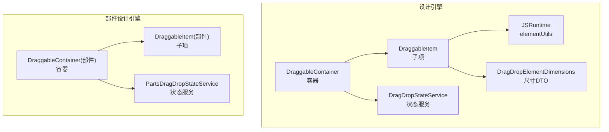
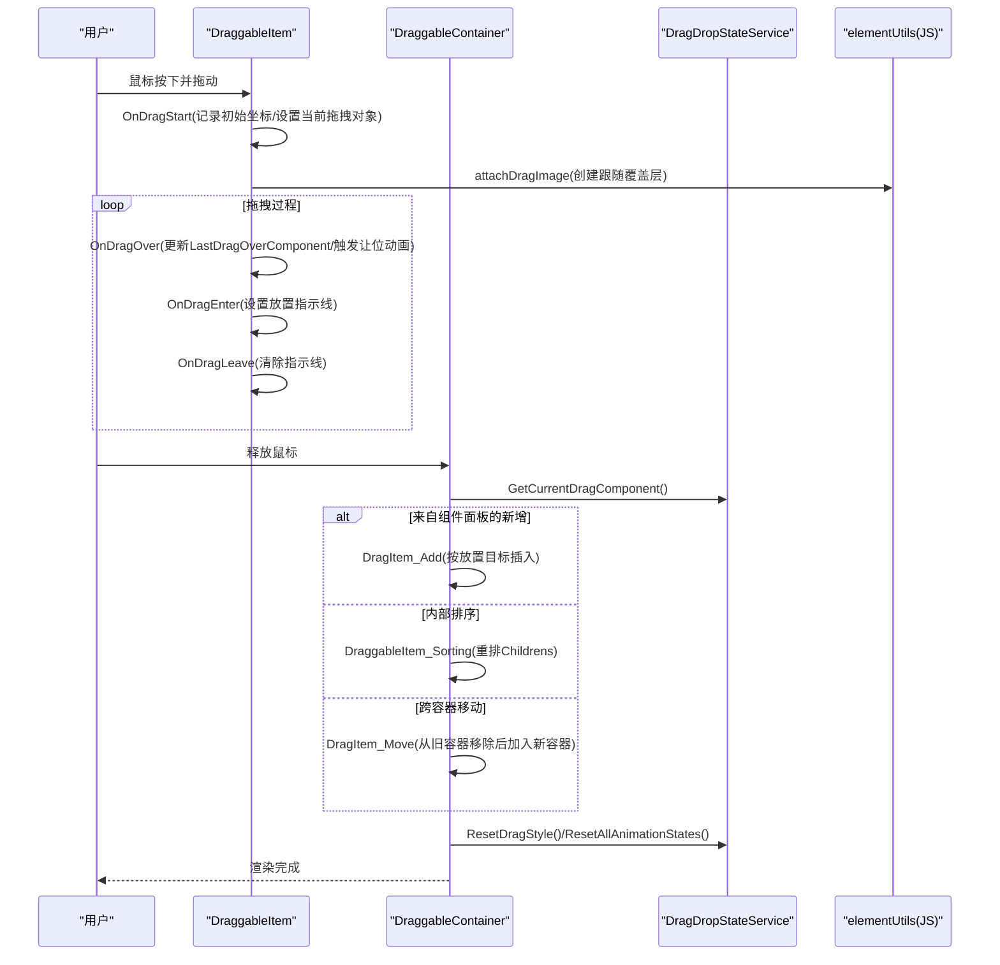
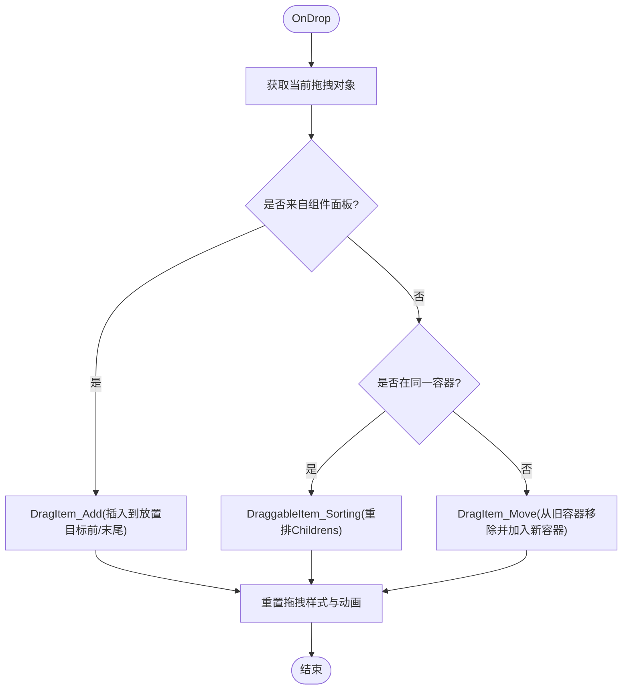
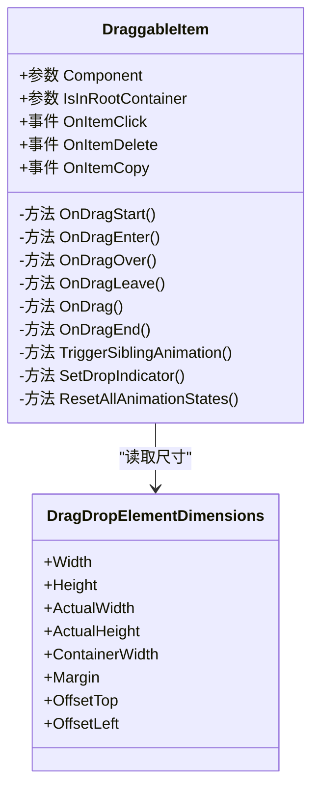
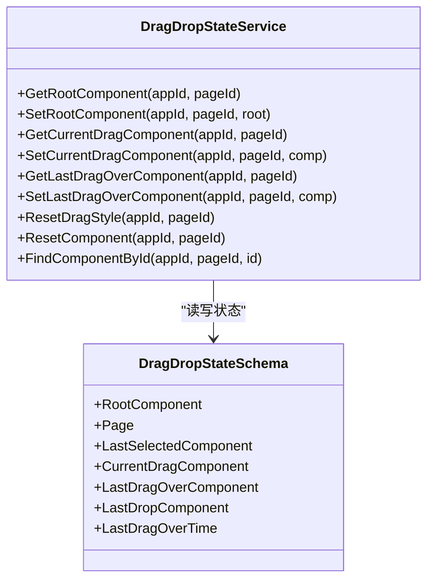
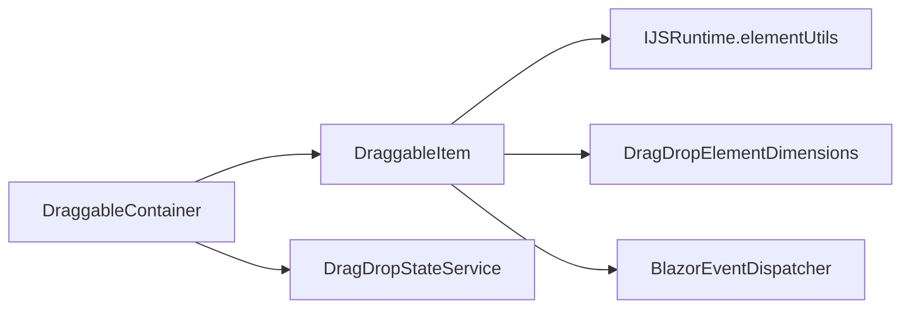

# 拖拽容器

<cite>
**本文引用的文件**   
- [DraggableContainer.razor](file://src/LowCode/DesignEngine/H.LowCode.DesignEngine/DraggableComponents/DraggableContainer.razor)
- [DraggableItem.razor](file://src/LowCode/DesignEngine/H.LowCode.DesignEngine/DraggableComponents/DraggableItem.razor)
- [DragDropStateService.cs](file://src/LowCode/DesignEngine/H.LowCode.DesignEngine/Services/DragDropStateService.cs)
- [DragDropElementDimensions.cs](file://src/LowCode/DesignEngine/H.LowCode.DesignEngineBase/Dtos/DragDropElementDimensions.cs)
- [DraggableContainer.razor.css](file://src/LowCode/DesignEngine/H.LowCode.DesignEngine/DraggableComponents/DraggableContainer.razor.css)
- [DraggableItem.razor.css](file://src/LowCode/DesignEngine/H.LowCode.DesignEngine/DraggableComponents/DraggableItem.razor.css)
- [DraggableContainer.razor（部件设计引擎）](file://src/LowCode/DesignEngine/H.LowCode.PartsDesignEngine/DraggableComponents/DraggableContainer.razor)
- [PartsDragDropStateService.cs](file://src/LowCode/DesignEngine/H.LowCode.PartsDesignEngine/Services/PartsDragDropStateService.cs)
</cite>

## 目录
1. [简介](#简介)
2. [项目结构](#项目结构)
3. [核心组件](#核心组件)
4. [架构总览](#架构总览)
5. [详细组件分析](#详细组件分析)
6. [依赖关系分析](#依赖关系分析)
7. [性能考量](#性能考量)
8. [故障排查指南](#故障排查指南)
9. [结论](#结论)
10. [附录](#附录)

## 简介
本文件为“拖拽容器”组件的权威技术文档，聚焦于 DraggableContainer 与 DraggableItem 在低代码设计器中的协作机制。内容涵盖：
- 嵌套支持机制：父子层级维护、位置计算算法、边界检测逻辑
- 拖拽事件处理：ondragover、ondrop 的拦截与策略
- 添加、移动、排序的核心算法：插入位置计算、索引管理、性能优化
- 交互细节：空容器引导提示、点击选择、复制与删除
- 样式与动画：容器样式自定义选项、让位动画与跟随动画配置

## 项目结构
拖拽容器相关代码主要位于 DesignEngine 与 PartsDesignEngine 两个子模块中，二者实现高度一致，分别服务于页面级与部件级设计面板。关键文件如下：
- DraggableContainer.razor：容器渲染与拖拽落点处理
- DraggableItem.razor：单项渲染、拖拽源与让位动画
- DragDropStateService.cs / PartsDragDropStateService.cs：全局拖拽状态服务
- DragDropElementDimensions.cs：元素尺寸 DTO
- 样式文件：容器与项的 CSS

图表来源
- [DraggableContainer.razor:1-278](file://src/LowCode/DesignEngine/H.LowCode.DesignEngine/DraggableComponents/DraggableContainer.razor#L1-L278)
- [DraggableItem.razor:1-473](file://src/LowCode/DesignEngine/H.LowCode.DesignEngine/DraggableComponents/DraggableItem.razor#L1-L473)
- [DragDropStateService.cs:1-244](file://src/LowCode/DesignEngine/H.LowCode.DesignEngine/Services/DragDropStateService.cs#L1-L244)
- [DragDropElementDimensions.cs:1-23](file://src/LowCode/DesignEngine/H.LowCode.DesignEngineBase/Dtos/DragDropElementDimensions.cs#L1-L23)
- [DraggableContainer.razor（部件设计引擎）:1-273](file://src/LowCode/DesignEngine/H.LowCode.PartsDesignEngine/DraggableComponents/DraggableContainer.razor#L1-L273)
- [PartsDragDropStateService.cs:1-246](file://src/LowCode/DesignEngine/H.LowCode.PartsDesignEngine/Services/PartsDragDropStateService.cs#L1-L246)

章节来源
- [DraggableContainer.razor:1-278](file://src/LowCode/DesignEngine/H.LowCode.DesignEngine/DraggableComponents/DraggableContainer.razor#L1-L278)
- [DraggableItem.razor:1-473](file://src/LowCode/DesignEngine/H.LowCode.DesignEngine/DraggableComponents/DraggableItem.razor#L1-L473)
- [DragDropStateService.cs:1-244](file://src/LowCode/DesignEngine/H.LowCode.DesignEngine/Services/DragDropStateService.cs#L1-L244)
- [DragDropElementDimensions.cs:1-23](file://src/LowCode/DesignEngine/H.LowCode.DesignEngineBase/Dtos/DragDropElementDimensions.cs#L1-L23)

## 核心组件
- DraggableContainer：负责渲染子项列表、处理 ondragover/ondrop、根容器空态引导、点击选择与复制删除回调分发。
- DraggableItem：负责单项渲染、原生拖拽事件、跟随动画、兄弟让位动画、放置指示线、点击选择与操作按钮。
- 状态服务：集中维护当前拖拽对象、最后悬停目标、选中项、根组件等跨组件共享状态。

章节来源
- [DraggableContainer.razor:1-278](file://src/LowCode/DesignEngine/H.LowCode.DesignEngine/DraggableComponents/DraggableContainer.razor#L1-L278)
- [DraggableItem.razor:1-473](file://src/LowCode/DesignEngine/H.LowCode.DesignEngine/DraggableComponents/DraggableItem.razor#L1-L473)
- [DragDropStateService.cs:1-244](file://src/LowCode/DesignEngine/H.LowCode.DesignEngine/Services/DragDropStateService.cs#L1-L244)

## 架构总览
拖拽流程由 DraggableItem 发起，通过浏览器原生 drag API 驱动；容器侧通过 ondragover/ondrop 拦截并决策新增、排序或跨容器移动；状态服务贯穿整个生命周期，确保多实例隔离与一致性。

图表来源
- [DraggableItem.razor:172-255](file://src/LowCode/DesignEngine/H.LowCode.DesignEngine/DraggableComponents/DraggableItem.razor#L172-L255)
- [DraggableContainer.razor:80-167](file://src/LowCode/DesignEngine/H.LowCode.DesignEngine/DraggableComponents/DraggableContainer.razor#L80-L167)
- [DragDropStateService.cs:53-77](file://src/LowCode/DesignEngine/H.LowCode.DesignEngine/Services/DragDropStateService.cs#L53-L77)

## 详细组件分析

### DraggableContainer 容器
- 渲染与事件绑定
  - 使用 @ondragover 阻止默认行为并停止冒泡，确保可接收 drop。
  - 使用 @ondrop 获取当前拖拽对象并进入统一处理入口。
- 空容器引导
  - 根容器且无子项时显示引导提示，提升新手体验。
- 点击选择与复制删除
  - 点击子项取消上一个选中并设置当前选中；复制执行深拷贝后插入末尾；删除后自动选择相邻项。
- 拖拽处理策略
  - 新增：来自组件面板的组件直接插入到放置目标前或末尾。
  - 排序：同容器内拖拽，根据 lastDragOver 目标重新排列 Childrens。
  - 跨容器移动：先自原容器移除，再插入新容器指定位置。
- 动画与状态重置
  - 释放后清理所有子项的动画与指示线状态，避免残留闪烁。

图表来源
- [DraggableContainer.razor:141-167](file://src/LowCode/DesignEngine/H.LowCode.DesignEngine/DraggableComponents/DraggableContainer.razor#L141-L167)
- [DraggableContainer.razor:175-241](file://src/LowCode/DesignEngine/H.LowCode.DesignEngine/DraggableComponents/DraggableContainer.razor#L175-L241)

章节来源
- [DraggableContainer.razor:1-278](file://src/LowCode/DesignEngine/H.LowCode.DesignEngine/DraggableComponents/DraggableContainer.razor#L1-L278)

### DraggableItem 子项
- 拖拽生命周期
  - OnDragStart：记录初始坐标，设置当前拖拽对象，清理兄弟动画，初始化 JS 跟随覆盖层。
  - OnDragEnter/OnDragOver：更新 lastDragOver 目标，设置放置指示线，触发兄弟让位动画。
  - OnDragLeave：清除指示线与效果样式。
  - OnDrag：延迟置位 isDragging，避免破坏原生拖拽。
  - OnDragEnd：清理所有动画与指示线状态。
- 让位动画算法
  - 基于每行可容纳数量与拖拽方向，计算同行或跨行的 translate3d 位移，使用 GPU 加速。
- 宽度与布局
  - 根据 PageLayout 动态计算宽度百分比，响应式适配列数变化。
- 交互按钮
  - hover/选中时显示删除与复制按钮，调用父级回调。

图表来源
- [DraggableItem.razor:1-473](file://src/LowCode/DesignEngine/H.LowCode.DesignEngine/DraggableComponents/DraggableItem.razor#L1-L473)
- [DragDropElementDimensions.cs:1-23](file://src/LowCode/DesignEngine/H.LowCode.DesignEngineBase/Dtos/DragDropElementDimensions.cs#L1-L23)

章节来源
- [DraggableItem.razor:1-473](file://src/LowCode/DesignEngine/H.LowCode.DesignEngine/DraggableComponents/DraggableItem.razor#L1-L473)

### 状态服务（DragDropStateService / PartsDragDropStateService）
- 作用域隔离：以 appId-pageId 或 libId-partsId 作为键，维护独立的状态快照。
- 核心字段：RootComponent、Page、LastSelectedComponent、CurrentDragComponent、LastDragOverComponent、LastDropComponent、LastDragOverTime。
- 工具方法：FindComponentById 递归查找、ResetDragStyle 统一清理样式与动画、ResetComponent 清空临时状态。

图表来源
- [DragDropStateService.cs:1-244](file://src/LowCode/DesignEngine/H.LowCode.DesignEngine/Services/DragDropStateService.cs#L1-L244)
- [PartsDragDropStateService.cs:1-246](file://src/LowCode/DesignEngine/H.LowCode.PartsDesignEngine/Services/PartsDragDropStateService.cs#L1-L246)

章节来源
- [DragDropStateService.cs:1-244](file://src/LowCode/DesignEngine/H.LowCode.DesignEngine/Services/DragDropStateService.cs#L1-L244)
- [PartsDragDropStateService.cs:1-246](file://src/LowCode/DesignEngine/H.LowCode.PartsDesignEngine/Services/PartsDragDropStateService.cs#L1-L246)

### 位置计算与边界检测
- 插入位置计算
  - 若存在 dragOver 目标，则在其索引处插入；否则追加至末尾。
- 排序算法
  - 同容器内：记录 dragIndex 与 overIndex，移除后在 overIndex 插入。
- 跨容器移动
  - 通过 ParentId 定位旧容器，移除后再在新容器插入。
- 边界检测
  - 通过 LastDragOverComponent 与 CurrentDragComponent 的比较避免自我拖拽与重复动画。
  - 使用 ReferenceEquals 精确判断对象引用，减少误判。

章节来源
- [DraggableContainer.razor:175-241](file://src/LowCode/DesignEngine/H.LowCode.DesignEngine/DraggableComponents/DraggableContainer.razor#L175-L241)
- [DraggableItem.razor:196-230](file://src/LowCode/DesignEngine/H.LowCode.DesignEngine/DraggableComponents/DraggableItem.razor#L196-L230)

### 拖拽事件处理策略
- ondragover
  - 阻止默认与冒泡，保证容器可接收 drop。
- ondrop
  - 获取当前拖拽对象，进入统一处理分支（新增/排序/跨容器）。
- 防抖与去重
  - 仅在 lastDragOver 目标变化时触发让位动画，避免频繁重绘。
  - 释放后将 lastDragOver 置空，防止后续无目标拖拽误用历史值。

章节来源
- [DraggableContainer.razor:80-102](file://src/LowCode/DesignEngine/H.LowCode.DesignEngine/DraggableComponents/DraggableContainer.razor#L80-L102)
- [DraggableItem.razor:196-230](file://src/LowCode/DesignEngine/H.LowCode.DesignEngine/DraggableComponents/DraggableItem.razor#L196-L230)

### 添加、移动、排序核心算法
- 新增（DragItem_Add）
  - 设置 ParentId、标记来源、可选选中、刷新回调绑定；按目标索引插入或末尾追加。
- 移动（DragItem_Move）
  - 从旧容器移除并刷新，再在新容器插入；更新 ParentId。
- 排序（DraggableItem_Sorting）
  - 校验目标非空且非同一目标；计算 dragIndex/overIndex 并重排 Childrens。

章节来源
- [DraggableContainer.razor:175-241](file://src/LowCode/DesignEngine/H.LowCode.DesignEngine/DraggableComponents/DraggableContainer.razor#L175-L241)

### 空容器引导、点击选择、复制删除
- 空容器引导
  - 根容器且 Childrens 为空时显示引导 UI。
- 点击选择
  - 取消上一个选中，设置当前选中并刷新；发布失焦事件。
- 复制与删除
  - 复制：深拷贝后插入末尾；删除：选择相邻项并移除。

章节来源
- [DraggableContainer.razor:16-24](file://src/LowCode/DesignEngine/H.LowCode.DesignEngine/DraggableComponents/DraggableContainer.razor#L16-L24)
- [DraggableContainer.razor:104-133](file://src/LowCode/DesignEngine/H.LowCode.DesignEngine/DraggableComponents/DraggableContainer.razor#L104-L133)

### 样式与动画配置
- 容器样式
  - 容器类名 draggablecontainer 控制高度与布局。
- 子项样式
  - hover/选中边框、放置指示线、拖拽图标与操作按钮显隐、占位符样式。
- 动画
  - 跟随动画：JS 覆盖层在 requestAnimationFrame 中更新 transform，避免 Blazor 逐事件渲染延迟。
  - 让位动画：translate3d 配合 will-change 触发 GPU 加速，跨行时同步 Y 轴位移。

章节来源
- [DraggableContainer.razor.css:1-4](file://src/LowCode/DesignEngine/H.LowCode.DesignEngine/DraggableComponents/DraggableContainer.razor.css#L1-L4)
- [DraggableItem.razor.css:1-169](file://src/LowCode/DesignEngine/H.LowCode.DesignEngine/DraggableComponents/DraggableItem.razor.css#L1-L169)
- [DraggableItem.razor:103-113](file://src/LowCode/DesignEngine/H.LowCode.DesignEngine/DraggableComponents/DraggableItem.razor#L103-L113)

## 依赖关系分析
- 组件耦合
  - DraggableContainer 依赖 DraggableItem 进行子项渲染与事件回调。
  - DraggableItem 依赖 JSRuntime 与 elementUtils 实现平滑跟随与尺寸测量。
  - 两者均依赖状态服务进行跨组件数据共享。
- 外部依赖
  - BlazorEventDispatcher：用于跨组件通信（如组件面板点击、页面布局变更）。
  - IJSRuntime：调用 JS 函数获取尺寸与附着拖拽图像。

图表来源
- [DraggableContainer.razor:1-278](file://src/LowCode/DesignEngine/H.LowCode.DesignEngine/DraggableComponents/DraggableContainer.razor#L1-L278)
- [DraggableItem.razor:1-473](file://src/LowCode/DesignEngine/H.LowCode.DesignEngine/DraggableComponents/DraggableItem.razor#L1-L473)
- [DragDropStateService.cs:1-244](file://src/LowCode/DesignEngine/H.LowCode.DesignEngine/Services/DragDropStateService.cs#L1-L244)

章节来源
- [DraggableContainer.razor:1-278](file://src/LowCode/DesignEngine/H.LowCode.DesignEngine/DraggableComponents/DraggableContainer.razor#L1-L278)
- [DraggableItem.razor:1-473](file://src/LowCode/DesignEngine/H.LowCode.DesignEngine/DraggableComponents/DraggableItem.razor#L1-L473)

## 性能考量
- 动画优化
  - 使用 translate3d 与 will-change 启用 GPU 加速，降低重排开销。
  - 跟随动画交由 JS 覆盖层在 requestAnimationFrame 中更新，避免 Blazor 高频渲染。
- 事件节流
  - 仅在 lastDragOver 目标变化时触发让位动画，减少不必要的 StateHasChanged。
- 状态隔离
  - 以应用/页面或库/部件维度隔离状态，避免跨实例污染。
- 尺寸测量
  - 首次渲染后缓存元素尺寸，减少重复测量。

[本节为通用指导，不直接分析具体文件]

## 故障排查指南
- 拖拽被中断
  - 检查是否在 dragstart 阶段修改了源节点样式导致原生拖拽取消；应延迟至首个 drag 事件再置位 isDragging。
- 放置目标异常
  - 确认 ondragover 已 preventDefault 与 stopPropagation；检查 lastDragOver 是否正确更新并在释放后清空。
- 动画残留
  - 释放后调用 ResetDragStyle/ResetAllAnimationStates，确保所有子项动画与指示线清理。
- 选择状态错乱
  - 点击空白区域或容器时发布 onblur 事件，确保上一个选中项取消。

章节来源
- [DraggableItem.razor:172-255](file://src/LowCode/DesignEngine/H.LowCode.DesignEngine/DraggableComponents/DraggableItem.razor#L172-L255)
- [DraggableContainer.razor:80-102](file://src/LowCode/DesignEngine/H.LowCode.DesignEngine/DraggableComponents/DraggableContainer.razor#L80-L102)
- [DragDropStateService.cs:169-205](file://src/LowCode/DesignEngine/H.LowCode.DesignEngine/Services/DragDropStateService.cs#L169-L205)

## 结论
DraggableContainer 与 DraggableItem 通过清晰的事件流与状态服务，实现了稳定高效的拖拽体验。其嵌套支持、位置计算、边界检测与动画优化共同保证了复杂布局下的流畅交互。遵循本文档的实践建议，可在不同设计引擎场景下复用该能力并获得一致的交互质量。

[本节为总结性内容，不直接分析具体文件]

## 附录
- 样式定制要点
  - 容器高度与布局可通过 .draggablecontainer 调整。
  - 子项边框、阴影、指示线颜色与宽度可通过 .draggableitem-box 及其伪元素定制。
  - 拖拽图标与操作按钮显隐可通过 hover/选中态样式控制。
- 动画参数
  - transition 曲线与时长可在 CSS 中调整；JS 覆盖层帧率由浏览器调度，无需额外配置。

[本节为概念性说明，不直接分析具体文件]