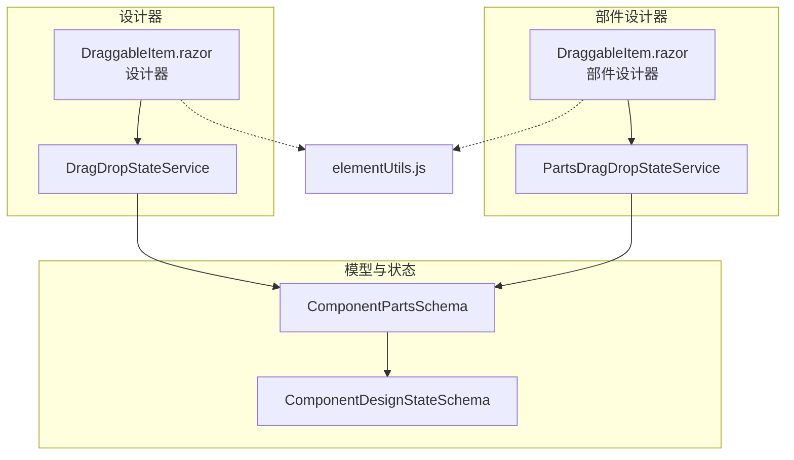
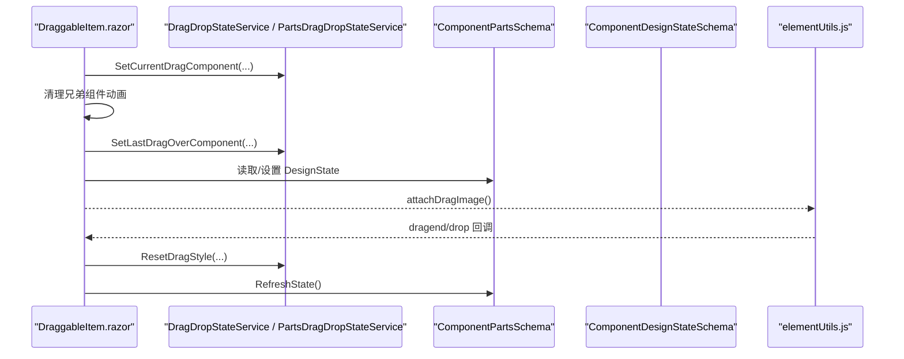
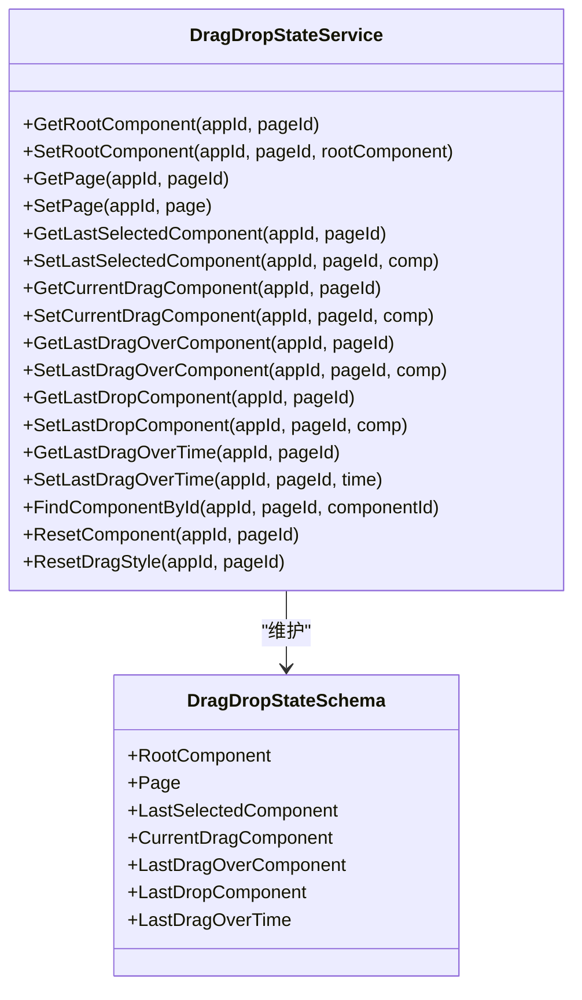
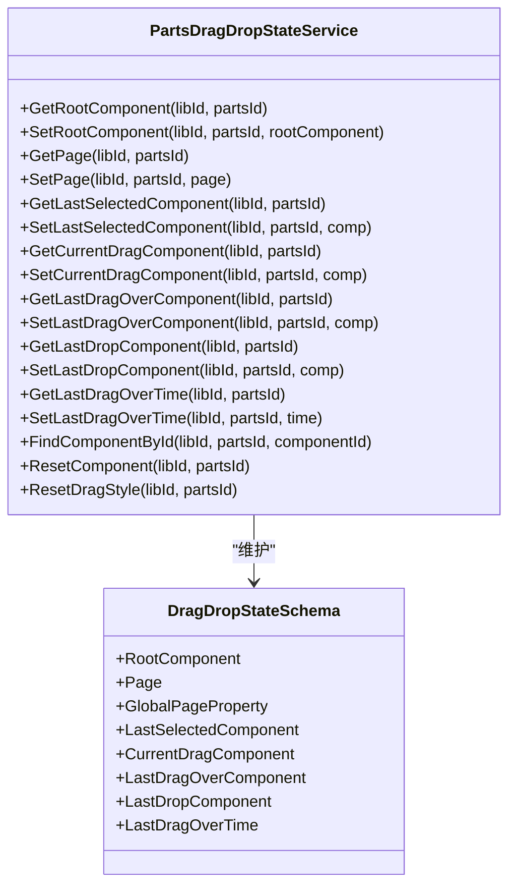
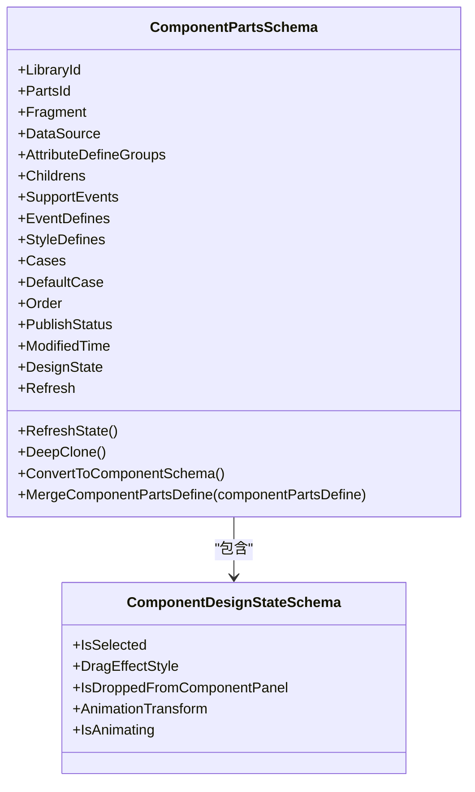
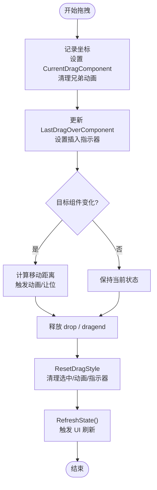
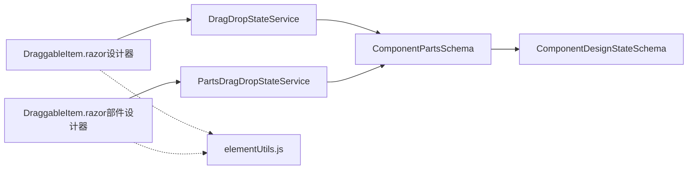

# 拖拽状态管理

<cite>
**本文引用的文件**   
- [DragDropStateService.cs](file://src/LowCode/DesignEngine/H.LowCode.DesignEngine/Services/DragDropStateService.cs)
- [PartsDragDropStateService.cs](file://src/LowCode/DesignEngine/H.LowCode.PartsDesignEngine/Services/PartsDragDropStateService.cs)
- [ComponentPartsSchema.cs](file://src/LowCode/Common/H.LowCode.MetaSchema.DesignEngine/ComponentPartsSchema.cs)
- [ComponentDesignStateSchema.cs](file://src/LowCode/Common/H.LowCode.MetaSchema.DesignEngine/PropertySchemas/ComponentDesignStateSchema.cs)
- [DraggableItem.razor（设计器）](file://src/LowCode/DesignEngine/H.LowCode.DesignEngine/DraggableComponents/DraggableItem.razor)
- [DraggableItem.razor（部件设计器）](file://src/LowCode/DesignEngine/H.LowCode.PartsDesignEngine/DraggableComponents/DraggableItem.razor)
- [elementUtils.js](file://src/LowCode/DesignEngine/H.LowCode.DesignEngineBase/wwwroot/js/elementUtils.js)
</cite>

## 目录
1. [简介](#简介)
2. [项目结构](#项目结构)
3. [核心组件](#核心组件)
4. [架构总览](#架构总览)
5. [详细组件分析](#详细组件分析)
6. [依赖关系分析](#依赖关系分析)
7. [性能考量](#性能考量)
8. [故障排查指南](#故障排查指南)
9. [结论](#结论)
10. [附录](#附录)

## 简介
本文件面向低代码平台的“拖拽状态管理系统”，聚焦于 DragDropStateService 与 PartsDragDropStateService 的核心职责：在设计与部件编辑场景中，维护多应用、多页面的拖拽状态隔离；提供组件的创建、更新、删除时的状态同步；实现选中状态、拖拽目标检测、样式重置等关键能力；并给出可插拔的扩展点，便于自定义状态行为与事件处理。

## 项目结构
- 服务层
  - 设计器场景：H.LowCode.DesignEngine.Services.DragDropStateService
  - 部件设计器场景：H.LowCode.PartsDesignEngine.Services.PartsDragDropStateService
- 模型与状态
  - 组件实例与运行时状态：ComponentPartsSchema、ComponentDesignStateSchema
- UI 交互
  - 拖拽项组件：DraggableItem.razor（设计器/部件设计器各一份）
  - 原生拖拽增强：elementUtils.js

图表来源
- [DragDropStateService.cs:1-244](file://src/LowCode/DesignEngine/H.LowCode.DesignEngine/Services/DragDropStateService.cs#L1-L244)
- [PartsDragDropStateService.cs:1-246](file://src/LowCode/DesignEngine/H.LowCode.PartsDesignEngine/Services/PartsDragDropStateService.cs#L1-L246)
- [ComponentPartsSchema.cs:1-230](file://src/LowCode/Common/H.LowCode.MetaSchema.DesignEngine/ComponentPartsSchema.cs#L1-L230)
- [ComponentDesignStateSchema.cs:1-35](file://src/LowCode/Common/H.LowCode.MetaSchema.DesignEngine/PropertySchemas/ComponentDesignStateSchema.cs#L1-L35)
- [DraggableItem.razor（设计器）:172-202](file://src/LowCode/DesignEngine/H.LowCode.DesignEngine/DraggableComponents/DraggableItem.razor#L172-L202)
- [DraggableItem.razor（部件设计器）:175-379](file://src/LowCode/DesignEngine/H.LowCode.PartsDesignEngine/DraggableComponents/DraggableItem.razor#L175-L379)
- [elementUtils.js:61-236](file://src/LowCode/DesignEngine/H.LowCode.DesignEngineBase/wwwroot/js/elementUtils.js#L61-L236)

章节来源
- [DragDropStateService.cs:1-244](file://src/LowCode/DesignEngine/H.LowCode.DesignEngine/Services/DragDropStateService.cs#L1-L244)
- [PartsDragDropStateService.cs:1-246](file://src/LowCode/DesignEngine/H.LowCode.PartsDesignEngine/Services/PartsDragDropStateService.cs#L1-L246)
- [ComponentPartsSchema.cs:1-230](file://src/LowCode/Common/H.LowCode.MetaSchema.DesignEngine/ComponentPartsSchema.cs#L1-L230)
- [ComponentDesignStateSchema.cs:1-35](file://src/LowCode/Common/H.LowCode.MetaSchema.DesignEngine/PropertySchemas/ComponentDesignStateSchema.cs#L1-L35)
- [DraggableItem.razor（设计器）:172-202](file://src/LowCode/DesignEngine/H.LowCode.DesignEngine/DraggableComponents/DraggableItem.razor#L172-L202)
- [DraggableItem.razor（部件设计器）:175-379](file://src/LowCode/DesignEngine/H.LowCode.PartsDesignEngine/DraggableComponents/DraggableItem.razor#L175-L379)
- [elementUtils.js:61-236](file://src/LowCode/DesignEngine/H.LowCode.DesignEngineBase/wwwroot/js/elementUtils.js#L61-L236)

## 核心组件
- DragDropStateService（设计器）
  - 职责：以 appId + pageId 为键，维护当前页面根组件、页级元数据、最后选中组件、当前拖拽组件、上次拖拽目标、上次放置目标、最后一次悬停时间等状态。
  - 关键能力：按 Id 递归查找组件、重置选中与动画样式、清理兄弟组件动画。
- PartsDragDropStateService（部件设计器）
  - 职责：与前者一致，但键空间为 libId + partsId，用于部件库/部件编辑上下文。
- ComponentPartsSchema
  - 职责：组件实例模型，包含属性定义、事件定义、样式定义、子节点树、数据源、以及仅设计期使用的 DesignState 和 Refresh 回调。
- ComponentDesignStateSchema
  - 职责：记录设计期临时状态，如是否选中、拖拽效果样式、是否由组件面板拖入、动画变换与动画进行中标志。
- DraggableItem.razor（设计器/部件设计器）
  - 职责：响应浏览器原生拖拽事件，调用对应状态服务更新状态，触发让位动画与插入指示器。
- elementUtils.js
  - 职责：增强原生拖拽体验，生成高对比度跟随图像，统一处理 dragend/drop 生命周期收尾。

章节来源
- [DragDropStateService.cs:1-244](file://src/LowCode/DesignEngine/H.LowCode.DesignEngine/Services/DragDropStateService.cs#L1-L244)
- [PartsDragDropStateService.cs:1-246](file://src/LowCode/DesignEngine/H.LowCode.PartsDesignEngine/Services/PartsDragDropStateService.cs#L1-L246)
- [ComponentPartsSchema.cs:1-230](file://src/LowCode/Common/H.LowCode.MetaSchema.DesignEngine/ComponentPartsSchema.cs#L1-L230)
- [ComponentDesignStateSchema.cs:1-35](file://src/LowCode/Common/H.LowCode.MetaSchema.DesignEngine/PropertySchemas/ComponentDesignStateSchema.cs#L1-L35)
- [DraggableItem.razor（设计器）:172-202](file://src/LowCode/DesignEngine/H.LowCode.DesignEngine/DraggableComponents/DraggableItem.razor#L172-L202)
- [DraggableItem.razor（部件设计器）:175-379](file://src/LowCode/DesignEngine/H.LowCode.PartsDesignEngine/DraggableComponents/DraggableItem.razor#L175-L379)
- [elementUtils.js:61-236](file://src/LowCode/DesignEngine/H.LowCode.DesignEngineBase/wwwroot/js/elementUtils.js#L61-L236)

## 架构总览
拖拽状态管理采用“服务+模型”的轻量方案：UI 层通过 Blazor 组件捕获原生拖拽事件，调用静态服务写入内存中的状态字典；状态字典以“应用/页面或库/部件”为键进行隔离；组件实例上的 DesignState 承载可视化相关的设计期状态；JS 辅助层负责拖拽图像的视觉增强与生命周期收尾。

图表来源
- [DraggableItem.razor（设计器）:172-202](file://src/LowCode/DesignEngine/H.LowCode.DesignEngine/DraggableComponents/DraggableItem.razor#L172-L202)
- [DraggableItem.razor（部件设计器）:175-379](file://src/LowCode/DesignEngine/H.LowCode.PartsDesignEngine/DraggableComponents/DraggableItem.razor#L175-L379)
- [DragDropStateService.cs:1-244](file://src/LowCode/DesignEngine/H.LowCode.DesignEngine/Services/DragDropStateService.cs#L1-L244)
- [PartsDragDropStateService.cs:1-246](file://src/LowCode/DesignEngine/H.LowCode.PartsDesignEngine/Services/PartsDragDropStateService.cs#L1-L246)
- [ComponentPartsSchema.cs:1-230](file://src/LowCode/Common/H.LowCode.MetaSchema.DesignEngine/ComponentPartsSchema.cs#L1-L230)
- [ComponentDesignStateSchema.cs:1-35](file://src/LowCode/Common/H.LowCode.MetaSchema.DesignEngine/PropertySchemas/ComponentDesignStateSchema.cs#L1-L35)
- [elementUtils.js:61-236](file://src/LowCode/DesignEngine/H.LowCode.DesignEngineBase/wwwroot/js/elementUtils.js#L61-L236)

## 详细组件分析

### DragDropStateService（设计器）
- 键值隔离策略
  - 使用 Dictionary<string, DragDropStateSchema>，键为 “appId-pageId”，确保多应用、多页面状态完全隔离。
- 状态字段
  - RootComponent：页面根组件
  - Page：页级元数据
  - LastSelectedComponent：最后选中组件（即使无焦点仍保留）
  - CurrentDragComponent：当前被拖拽组件
  - LastDragOverComponent：最后一次拖拽经过的目标组件
  - LastDropComponent：最后一次放置的目标组件
  - LastDragOverTime：最后一次拖拽经过的时间戳
- 关键方法
  - Get/SetRootComponent、Get/SetPage
  - Get/SetLastSelectedComponent、GetCurrentDragComponent、SetCurrentDragComponent
  - Get/SetLastDragOverComponent、Get/SetLastDropComponent、Get/SetLastDragOverTime
  - FindComponentById：基于 Id 的递归查找
  - ResetComponent：清空选中与拖拽相关引用
  - ResetDragStyle：重置动画与选择样式，并刷新子组件状态

图表来源
- [DragDropStateService.cs:1-244](file://src/LowCode/DesignEngine/H.LowCode.DesignEngine/Services/DragDropStateService.cs#L1-L244)

章节来源
- [DragDropStateService.cs:1-244](file://src/LowCode/DesignEngine/H.LowCode.DesignEngine/Services/DragDropStateService.cs#L1-L244)

### PartsDragDropStateService（部件设计器）
- 键值隔离策略
  - 使用 Dictionary<string, DragDropStateSchema>，键为 “libId-partsId”，用于部件库/部件编辑上下文的状态隔离。
- 功能对齐
  - 与服务端设计器版本保持一致的 API 集合，包括根组件、页面、选中、拖拽、放置、时间与样式重置等。
- 差异点
  - 键空间不同；内部类名相同但命名空间不同，避免冲突。

图表来源
- [PartsDragDropStateService.cs:1-246](file://src/LowCode/DesignEngine/H.LowCode.PartsDesignEngine/Services/PartsDragDropStateService.cs#L1-L246)

章节来源
- [PartsDragDropStateService.cs:1-246](file://src/LowCode/DesignEngine/H.LowCode.PartsDesignEngine/Services/PartsDragDropStateService.cs#L1-L246)

### 组件模型与设计期状态
- ComponentPartsSchema
  - 包含组件物料信息、属性/事件/样式定义、子节点树、数据源、发布状态、修改时间等。
  - 设计期状态 DesignState 标记 IsSelected、DragEffectStyle、IsDroppedFromComponentPanel、AnimationTransform、IsAnimating。
  - 提供 Refresh 回调与 RefreshState() 用于驱动 UI 刷新。
- ComponentDesignStateSchema
  - 纯设计期状态，不参与持久化，用于控制选中、拖拽效果、动画等。

图表来源
- [ComponentPartsSchema.cs:1-230](file://src/LowCode/Common/H.LowCode.MetaSchema.DesignEngine/ComponentPartsSchema.cs#L1-L230)
- [ComponentDesignStateSchema.cs:1-35](file://src/LowCode/Common/H.LowCode.MetaSchema.DesignEngine/PropertySchemas/ComponentDesignStateSchema.cs#L1-L35)

章节来源
- [ComponentPartsSchema.cs:1-230](file://src/LowCode/Common/H.LowCode.MetaSchema.DesignEngine/ComponentPartsSchema.cs#L1-L230)
- [ComponentDesignStateSchema.cs:1-35](file://src/LowCode/Common/H.LowCode.MetaSchema.DesignEngine/PropertySchemas/ComponentDesignStateSchema.cs#L1-L35)

### 拖拽生命周期与状态转换流程
- 开始拖拽（dragstart）
  - 记录初始坐标，设置 CurrentDragComponent，清理兄弟组件动画，避免闪烁。
- 进入目标（dragenter）
  - 更新 LastDragOverComponent，设置插入指示器。
- 拖拽经过（dragover）
  - 若目标变化则触发让位动画；避免连续拖拽导致的重复动画。
- 释放（drop/dragend）
  - 执行放置逻辑（由上层业务决定），随后调用 ResetDragStyle 清理样式与动画，并刷新组件状态。

图表来源
- [DraggableItem.razor（设计器）:172-202](file://src/LowCode/DesignEngine/H.LowCode.DesignEngine/DraggableComponents/DraggableItem.razor#L172-L202)
- [DraggableItem.razor（部件设计器）:175-379](file://src/LowCode/DesignEngine/H.LowCode.PartsDesignEngine/DraggableComponents/DraggableItem.razor#L175-L379)
- [DragDropStateService.cs:1-244](file://src/LowCode/DesignEngine/H.LowCode.DesignEngine/Services/DragDropStateService.cs#L1-L244)
- [PartsDragDropStateService.cs:1-246](file://src/LowCode/DesignEngine/H.LowCode.PartsDesignEngine/Services/PartsDragDropStateService.cs#L1-L246)

章节来源
- [DraggableItem.razor（设计器）:172-202](file://src/LowCode/DesignEngine/H.LowCode.DesignEngine/DraggableComponents/DraggableItem.razor#L172-L202)
- [DraggableItem.razor（部件设计器）:175-379](file://src/LowCode/DesignEngine/H.LowCode.PartsDesignEngine/DraggableComponents/DraggableItem.razor#L175-L379)
- [DragDropStateService.cs:1-244](file://src/LowCode/DesignEngine/H.LowCode.DesignEngine/Services/DragDropStateService.cs#L1-L244)
- [PartsDragDropStateService.cs:1-246](file://src/LowCode/DesignEngine/H.LowCode.PartsDesignEngine/Services/PartsDragDropStateService.cs#L1-L246)

### 选中状态管理与样式重置
- 选中状态
  - 通过 LastSelectedComponent 保存最近一次选中的组件，即使失去焦点也保留，便于后续操作（如复制、删除）。
- 样式重置
  - ResetDragStyle 会清除 CurrentDragComponent、LastSelectedComponent、LastDragOverComponent 的动画与选中样式，并遍历根组件的子节点重置动画与指示器，最后调用 RefreshState 触发渲染更新。

章节来源
- [DragDropStateService.cs:1-244](file://src/LowCode/DesignEngine/H.LowCode.DesignEngine/Services/DragDropStateService.cs#L1-244)
- [PartsDragDropStateService.cs:1-246](file://src/LowCode/DesignEngine/H.LowCode.PartsDesignEngine/Services/PartsDragDropStateService.cs#L1-246)
- [ComponentDesignStateSchema.cs:1-35](file://src/LowCode/Common/H.LowCode.MetaSchema.DesignEngine/PropertySchemas/ComponentDesignStateSchema.cs#L1-L35)

### 拖拽目标检测与让位动画
- 目标检测
  - 通过 LastDragOverComponent 与 CurrentDragComponent 比较，仅在目标变化时触发动画，避免抖动。
- 让位动画
  - 根据拖拽方向与布局（同行/跨行）计算 X/Y 位移，动态设置 AnimationTransform，配合 IsAnimating 控制动画开关。

章节来源
- [DraggableItem.razor（设计器）:172-202](file://src/LowCode/DesignEngine/H.LowCode.DesignEngine/DraggableComponents/DraggableItem.razor#L172-L202)
- [DraggableItem.razor（部件设计器）:175-379](file://src/LowCode/DesignEngine/H.LowCode.PartsDesignEngine/DraggableComponents/DraggableItem.razor#L175-L379)
- [ComponentDesignStateSchema.cs:1-35](file://src/LowCode/Common/H.LowCode.MetaSchema.DesignEngine/PropertySchemas/ComponentDesignStateSchema.cs#L1-L35)

### 多应用与多页面状态隔离
- 设计器
  - 键：appId + pageId，保证同一进程内不同应用与页面互不干扰。
- 部件设计器
  - 键：libId + partsId，保证部件库与部件编辑上下文独立。
- 内存字典
  - 使用静态 Dictionary 缓存状态，按需初始化，避免全局污染。

章节来源
- [DragDropStateService.cs:1-244](file://src/LowCode/DesignEngine/H.LowCode.DesignEngine/Services/DragDropStateService.cs#L1-244)
- [PartsDragDropStateService.cs:1-246](file://src/LowCode/DesignEngine/H.LowCode.PartsDesignEngine/Services/PartsDragDropStateService.cs#L1-L246)

### 扩展点与自定义事件
- 组件刷新
  - ComponentPartsSchema.Refresh 与 RefreshState() 提供 UI 刷新钩子，可在状态变更后触发重绘。
- 自定义状态行为
  - 可通过继承或组合方式扩展 DragDropStateSchema，增加额外字段与方法，并在 DragDropStateService/PartsDragDropStateService 中暴露相应 API。
- 事件处理
  - 在 DraggableItem.razor 的事件回调中接入自定义逻辑（如埋点、校验、撤销/重做），不影响核心状态流。

章节来源
- [ComponentPartsSchema.cs:1-230](file://src/LowCode/Common/H.LowCode.MetaSchema.DesignEngine/ComponentPartsSchema.cs#L1-L230)
- [DragDropStateService.cs:1-244](file://src/LowCode/DesignEngine/H.LowCode.DesignEngine/Services/DragDropStateService.cs#L1-244)
- [PartsDragDropStateService.cs:1-246](file://src/LowCode/DesignEngine/H.LowCode.PartsDesignEngine/Services/PartsDragDropStateService.cs#L1-L246)
- [DraggableItem.razor（设计器）:172-202](file://src/LowCode/DesignEngine/H.LowCode.DesignEngine/DraggableComponents/DraggableItem.razor#L172-L202)
- [DraggableItem.razor（部件设计器）:175-379](file://src/LowCode/DesignEngine/H.LowCode.PartsDesignEngine/DraggableComponents/DraggableItem.razor#L175-L379)

## 依赖关系分析
- 组件到服务
  - DraggableItem.razor 依赖对应的 DragDropStateService 或 PartsDragDropStateService，读写拖拽状态。
- 服务到模型
  - 服务读写 ComponentPartsSchema 及其 DesignState，驱动 UI 表现。
- 前端增强
  - elementUtils.js 为拖拽图像与生命周期收尾提供支撑，降低浏览器默认行为差异带来的问题。

图表来源
- [DragDropStateService.cs:1-244](file://src/LowCode/DesignEngine/H.LowCode.DesignEngine/Services/DragDropStateService.cs#L1-L244)
- [PartsDragDropStateService.cs:1-246](file://src/LowCode/DesignEngine/H.LowCode.PartsDesignEngine/Services/PartsDragDropStateService.cs#L1-L246)
- [ComponentPartsSchema.cs:1-230](file://src/LowCode/Common/H.LowCode.MetaSchema.DesignEngine/ComponentPartsSchema.cs#L1-L230)
- [ComponentDesignStateSchema.cs:1-35](file://src/LowCode/Common/H.LowCode.MetaSchema.DesignEngine/PropertySchemas/ComponentDesignStateSchema.cs#L1-L35)
- [DraggableItem.razor（设计器）:172-202](file://src/LowCode/DesignEngine/H.LowCode.DesignEngine/DraggableComponents/DraggableItem.razor#L172-L202)
- [DraggableItem.razor（部件设计器）:175-379](file://src/LowCode/DesignEngine/H.LowCode.PartsDesignEngine/DraggableComponents/DraggableItem.razor#L175-L379)
- [elementUtils.js:61-236](file://src/LowCode/DesignEngine/H.LowCode.DesignEngineBase/wwwroot/js/elementUtils.js#L61-L236)

章节来源
- [DragDropStateService.cs:1-244](file://src/LowCode/DesignEngine/H.LowCode.DesignEngine/Services/DragDropStateService.cs#L1-L244)
- [PartsDragDropStateService.cs:1-246](file://src/LowCode/DesignEngine/H.LowCode.PartsDesignEngine/Services/PartsDragDropStateService.cs#L1-L246)
- [ComponentPartsSchema.cs:1-230](file://src/LowCode/Common/H.LowCode.MetaSchema.DesignEngine/ComponentPartsSchema.cs#L1-L230)
- [ComponentDesignStateSchema.cs:1-35](file://src/LowCode/Common/H.LowCode.MetaSchema.DesignEngine/PropertySchemas/ComponentDesignStateSchema.cs#L1-L35)
- [DraggableItem.razor（设计器）:172-202](file://src/LowCode/DesignEngine/H.LowCode.DesignEngine/DraggableComponents/DraggableItem.razor#L172-L202)
- [DraggableItem.razor（部件设计器）:175-379](file://src/LowCode/DesignEngine/H.LowCode.PartsDesignEngine/DraggableComponents/DraggableItem.razor#L175-L379)
- [elementUtils.js:61-236](file://src/LowCode/DesignEngine/H.LowCode.DesignEngineBase/wwwroot/js/elementUtils.js#L61-L236)

## 性能考量
- 状态访问复杂度
  - 键值查找 O(1)，组件查找为 O(N)（N 为组件树节点数），建议合理组织组件层级，避免过深嵌套。
- 动画与刷新
  - 仅在目标变化时触发动画，减少不必要的重排；通过 RefreshState 精准刷新，避免全量重绘。
- 内存占用
  - 静态字典存储设计期状态，注意在页面切换或应用退出时及时 ResetComponent/ResetDragStyle，防止内存泄漏。

[本节为通用指导，无需源码引用]

## 故障排查指南
- 拖拽中断或无 dragover/dragend
  - 检查是否在 dragstart 中立即修改了源元素样式导致浏览器取消拖拽；应延迟至首个 drag 事件再修改。
- 动画异常或闪烁
  - 确认 ClearSiblingAnimation 已调用；检查 AnimationTransform 与 IsAnimating 是否正确重置。
- 选中状态丢失
  - 确认 LastSelectedComponent 未被覆盖；必要时在失焦事件中保留该引用。
- 样式未清理
  - 调用 ResetDragStyle 后需确保 RefreshState 被触发，使 UI 同步。

章节来源
- [DraggableItem.razor（设计器）:172-202](file://src/LowCode/DesignEngine/H.LowCode.DesignEngine/DraggableComponents/DraggableItem.razor#L172-L202)
- [DraggableItem.razor（部件设计器）:175-379](file://src/LowCode/DesignEngine/H.LowCode.PartsDesignEngine/DraggableComponents/DraggableItem.razor#L175-L379)
- [DragDropStateService.cs:1-244](file://src/LowCode/DesignEngine/H.LowCode.DesignEngine/Services/DragDropStateService.cs#L1-L244)
- [PartsDragDropStateService.cs:1-246](file://src/LowCode/DesignEngine/H.LowCode.PartsDesignEngine/Services/PartsDragDropStateService.cs#L1-L246)
- [elementUtils.js:61-236](file://src/LowCode/DesignEngine/H.LowCode.DesignEngineBase/wwwroot/js/elementUtils.js#L61-L236)

## 结论
拖拽状态管理系统以简洁的服务与模型设计，实现了多应用/多页面隔离、完整的拖拽生命周期管理、稳定的选中与样式控制，并通过可扩展的刷新与状态接口支持自定义行为。结合 JS 层的拖拽增强，整体体验流畅且易于维护。

[本节为总结性内容，无需源码引用]

## 附录
- 最佳实践
  - 始终使用服务提供的 Get/Set 方法读写状态，避免直接操作内部字典。
  - 在拖拽结束后务必调用 ResetDragStyle 并刷新组件状态。
  - 对复杂组件树，优先通过 Id 快速定位，再进行局部更新。
- 扩展建议
  - 在 DragDropStateSchema 中新增字段以支持更多设计期状态。
  - 在 DraggableItem.razor 的事件回调中接入审计、撤销/重做、校验等横切逻辑。

[本节为补充说明，无需源码引用]